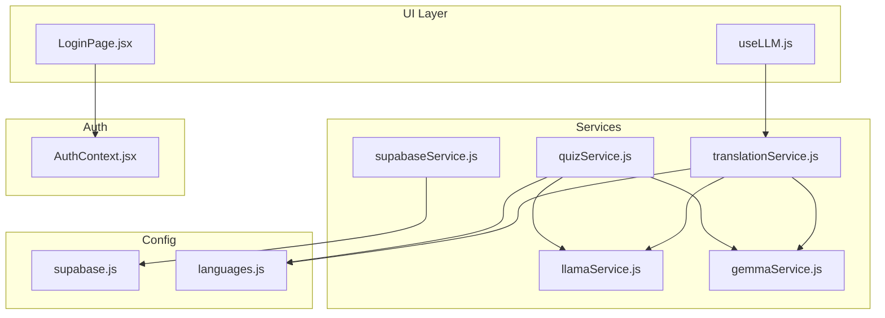
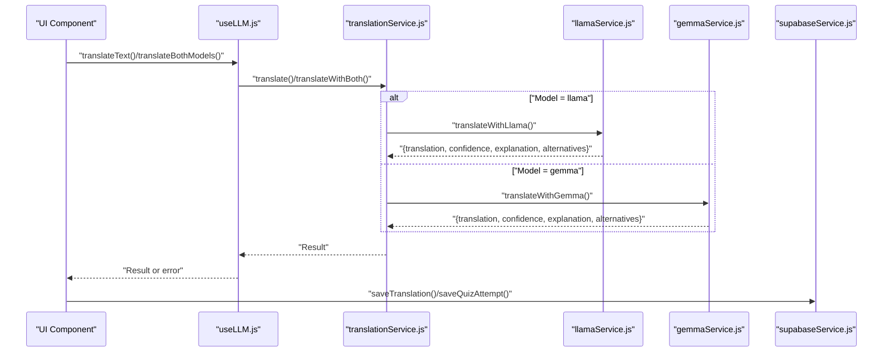
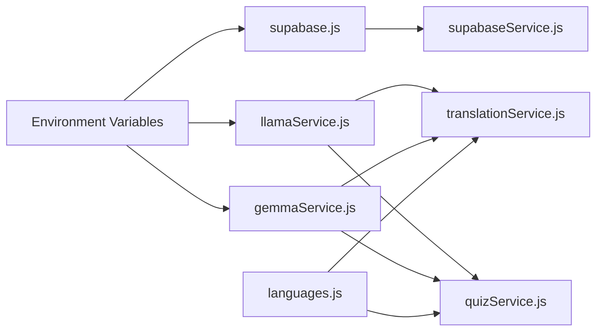

# API Reference

<cite>
**Referenced Files in This Document**
- [supabaseService.js](file://src/services/supabaseService.js)
- [translationService.js](file://src/services/translationService.js)
- [quizService.js](file://src/services/quizService.js)
- [llamaService.js](file://src/services/llamaService.js)
- [gemmaService.js](file://src/services/gemmaService.js)
- [supabase.js](file://src/config/supabase.js)
- [AuthContext.jsx](file://src/contexts/AuthContext.jsx)
- [languages.js](file://src/config/languages.js)
- [useLLM.js](file://src/hooks/useLLM.js)
- [LoginPage.jsx](file://src/pages/auth/LoginPage.jsx)
- [supabase-schema.sql](file://supabase-schema.sql)
- [package.json](file://package.json)
</cite>

## Table of Contents
1. [Introduction](#introduction)
2. [Project Structure](#project-structure)
3. [Core Components](#core-components)
4. [Architecture Overview](#architecture-overview)
5. [Detailed Component Analysis](#detailed-component-analysis)
6. [Dependency Analysis](#dependency-analysis)
7. [Performance Considerations](#performance-considerations)
8. [Troubleshooting Guide](#troubleshooting-guide)
9. [Conclusion](#conclusion)
10. [Appendices](#appendices)

## Introduction
This API reference documents the service interfaces used by Flinggo-app for:
- Supabase-backed data operations (authentication, user profiles, progress, leaderboard, quiz attempts, and translation history)
- Translation service integrating Meta’s Llama and Google’s Gemma AI models
- Quiz service for generating vocabulary, sentence arrangement, and daily challenges
- Authentication flows powered by Supabase Auth
- Environment configuration and integration patterns

It covers method signatures, parameters, return formats, authentication requirements, error handling, and operational guidance for external API integrations.

## Project Structure
The application organizes cross-cutting concerns into services and configuration modules:
- Services: Supabase client wrapper, translation, quiz, and LLM providers (Llama and Gemma)
- Config: Supabase client initialization and language constants
- Contexts: Authentication state and profile management
- Hooks: UI-friendly wrappers around LLM translation functions

**Diagram sources**
- [LoginPage.jsx:1-40](file://src/pages/auth/LoginPage.jsx#L1-L40)
- [useLLM.js:1-37](file://src/hooks/useLLM.js#L1-L37)
- [supabaseService.js:1-132](file://src/services/supabaseService.js#L1-L132)
- [translationService.js:1-73](file://src/services/translationService.js#L1-L73)
- [quizService.js:1-154](file://src/services/quizService.js#L1-L154)
- [llamaService.js:1-84](file://src/services/llamaService.js#L1-L84)
- [gemmaService.js:1-56](file://src/services/gemmaService.js#L1-L56)
- [supabase.js:1-7](file://src/config/supabase.js#L1-L7)
- [languages.js:1-30](file://src/config/languages.js#L1-L30)
- [AuthContext.jsx:1-101](file://src/contexts/AuthContext.jsx#L1-L101)

**Section sources**
- [supabaseService.js:1-132](file://src/services/supabaseService.js#L1-L132)
- [translationService.js:1-73](file://src/services/translationService.js#L1-L73)
- [quizService.js:1-154](file://src/services/quizService.js#L1-L154)
- [llamaService.js:1-84](file://src/services/llamaService.js#L1-L84)
- [gemmaService.js:1-56](file://src/services/gemmaService.js#L1-L56)
- [supabase.js:1-7](file://src/config/supabase.js#L1-L7)
- [AuthContext.jsx:1-101](file://src/contexts/AuthContext.jsx#L1-L101)
- [languages.js:1-30](file://src/config/languages.js#L1-L30)
- [useLLM.js:1-37](file://src/hooks/useLLM.js#L1-L37)
- [LoginPage.jsx:1-40](file://src/pages/auth/LoginPage.jsx#L1-L40)

## Core Components
- Supabase service: CRUD and queries for profiles, user progress, leaderboard, quiz attempts, and translation history
- Translation service: orchestrates single or dual-model translation and comparison metrics
- Quiz service: generates vocabulary quizzes, sentence arrangement tasks, and daily challenges
- Llama service: integrates with Meta’s hosted Llama API
- Gemma service: integrates with Google Generative AI
- Supabase config: initializes the Supabase client using Vite environment variables
- Auth context: manages session lifecycle and profile retrieval
- Languages config: language metadata and XP reward constants
- useLLM hook: exposes UI-friendly translation functions with loading/error states

**Section sources**
- [supabaseService.js:1-132](file://src/services/supabaseService.js#L1-L132)
- [translationService.js:1-73](file://src/services/translationService.js#L1-L73)
- [quizService.js:1-154](file://src/services/quizService.js#L1-L154)
- [llamaService.js:1-84](file://src/services/llamaService.js#L1-L84)
- [gemmaService.js:1-56](file://src/services/gemmaService.js#L1-L56)
- [supabase.js:1-7](file://src/config/supabase.js#L1-L7)
- [AuthContext.jsx:1-101](file://src/contexts/AuthContext.jsx#L1-L101)
- [languages.js:1-30](file://src/config/languages.js#L1-L30)
- [useLLM.js:1-37](file://src/hooks/useLLM.js#L1-L37)

## Architecture Overview
High-level API interactions:
- UI invokes useLLM hook to trigger translation
- translationService selects Llama or Gemma provider
- Llama/Gemma services call external APIs and return structured results
- Supabase service persists translation history and quiz attempts
- AuthContext manages session and profile data

**Diagram sources**
- [useLLM.js:1-37](file://src/hooks/useLLM.js#L1-L37)
- [translationService.js:1-73](file://src/services/translationService.js#L1-L73)
- [llamaService.js:1-84](file://src/services/llamaService.js#L1-L84)
- [gemmaService.js:1-56](file://src/services/gemmaService.js#L1-L56)
- [supabaseService.js:1-132](file://src/services/supabaseService.js#L1-L132)

## Detailed Component Analysis

### Supabase Service APIs
All Supabase functions operate against the initialized client and throw on error. They return either single records or arrays depending on the query.

- saveTranslation({ userId, sourceLang, targetLang, inputText, llamaOutput, gemmaOutput, selectedModel })
  - Purpose: Insert a translation record and return the inserted row
  - Parameters:
    - userId: string (UUID)
    - sourceLang: string
    - targetLang: string
    - inputText: string
    - llamaOutput: object | null
    - gemmaOutput: object | null
    - selectedModel: string
  - Returns: object (single row)
  - Throws: error on failure
  - Example usage: [supabaseService.js:5-17](file://src/services/supabaseService.js#L5-L17)

- getTranslationHistory(userId, limit=50)
  - Purpose: Retrieve recent translations for a user
  - Parameters:
    - userId: string (UUID)
    - limit: number
  - Returns: array of objects
  - Throws: error on failure
  - Example usage: [supabaseService.js:19-28](file://src/services/supabaseService.js#L19-L28)

- saveQuizAttempt({ userId, quizType, questionData, userAnswer, correctAnswer, isCorrect, xpEarned, timeSpentSec })
  - Purpose: Insert a quiz attempt and return the inserted row
  - Parameters:
    - userId: string (UUID)
    - quizType: string ("vocabulary" | "sentence" | "challenge")
    - questionData: JSON object
    - userAnswer: string
    - correctAnswer: string
    - isCorrect: boolean
    - xpEarned: number
    - timeSpentSec: number
  - Returns: object (single row)
  - Throws: error on failure
  - Example usage: [supabaseService.js:32-45](file://src/services/supabaseService.js#L32-L45)

- getQuizAttempts(userId, quizType=null, limit=20)
  - Purpose: Retrieve quiz attempts for a user, optionally filtered by type
  - Parameters:
    - userId: string (UUID)
    - quizType: string | null
    - limit: number
  - Returns: array of objects
  - Throws: error on failure
  - Example usage: [supabaseService.js:47-58](file://src/services/supabaseService.js#L47-L58)

- getUserProgress(userId)
  - Purpose: Fetch all progress rows for a user
  - Parameters:
    - userId: string (UUID)
  - Returns: array of objects
  - Throws: error on failure
  - Example usage: [supabaseService.js:62-69](file://src/services/supabaseService.js#L62-L69)

- upsertUserProgress(userId, language, category, updates)
  - Purpose: Upsert progress with conflict on user_id, language, category
  - Parameters:
    - userId: string (UUID)
    - language: string
    - category: string
    - updates: object (fields to update)
  - Returns: object (single row)
  - Throws: error on failure
  - Example usage: [supabaseService.js:71-85](file://src/services/supabaseService.js#L71-L85)

- getDailyChallenge(date)
  - Purpose: Fetch a daily challenge by date (may return null)
  - Parameters:
    - date: string (ISO date)
  - Returns: object | null (single row)
  - Throws: error on failure
  - Example usage: [supabaseService.js:89-97](file://src/services/supabaseService.js#L89-L97)

- saveDailyChallenge(challenge)
  - Purpose: Insert a daily challenge
  - Parameters:
    - challenge: object
  - Returns: object (single row)
  - Throws: error on failure
  - Example usage: [supabaseService.js:99-107](file://src/services/supabaseService.js#L99-L107)

- getLeaderboard(limit=20)
  - Purpose: Fetch top users by XP
  - Parameters:
    - limit: number
  - Returns: array of objects (profile fields)
  - Throws: error on failure
  - Example usage: [supabaseService.js:111-119](file://src/services/supabaseService.js#L111-L119)

- getProfile(userId)
  - Purpose: Fetch a user’s profile
  - Parameters:
    - userId: string (UUID)
  - Returns: object (single row)
  - Throws: error on failure
  - Example usage: [supabaseService.js:123-131](file://src/services/supabaseService.js#L123-L131)

Authentication and Real-time Notes:
- Supabase client is initialized from environment variables and used for all operations
- Row-level security policies restrict access to user-owned records
- Real-time subscriptions are not implemented in the provided code; authentication state changes are handled via Supabase Auth listeners

**Section sources**
- [supabaseService.js:1-132](file://src/services/supabaseService.js#L1-L132)
- [supabase.js:1-7](file://src/config/supabase.js#L1-L7)
- [supabase-schema.sql:40-77](file://supabase-schema.sql#L40-L77)

### Translation Service APIs
- translate(text, sourceLangCode, targetLangCode, model="llama")
  - Purpose: Translate text using a single model
  - Parameters:
    - text: string
    - sourceLangCode: string (e.g., "en")
    - targetLangCode: string (e.g., "es")
    - model: "llama" | "gemma"
  - Returns: object with keys translation, confidence, explanation, alternatives, model
  - Throws: error propagated from provider
  - Example usage: [translationService.js:12-20](file://src/services/translationService.js#L12-L20)

- translateWithBoth(text, sourceLangCode, targetLangCode)
  - Purpose: Run both models concurrently and return comparison metrics
  - Parameters:
    - text: string
    - sourceLangCode: string
    - targetLangCode: string
  - Returns: object with fields llama, gemma, comparison
    - comparison includes llamaWordCount, gemmaWordCount, llamaCharCount, gemmaCharCount, wordSimilarity, llamaConfidence, gemmaConfidence
  - Throws: error if provider throws; otherwise returns structured fallbacks
  - Example usage: [translationService.js:25-42](file://src/services/translationService.js#L25-L42)

- compareResults(llamaOutput, gemmaOutput)
  - Purpose: Compute basic similarity metrics between two translations
  - Parameters:
    - llamaOutput: object | null
    - gemmaOutput: object | null
  - Returns: object | null
  - Example usage: [translationService.js:47-72](file://src/services/translationService.js#L47-L72)

Integration Details:
- Language names resolved via languages config
- Provider selection delegates to llamaService or gemmaService

**Section sources**
- [translationService.js:1-73](file://src/services/translationService.js#L1-L73)
- [llamaService.js:1-84](file://src/services/llamaService.js#L1-L84)
- [gemmaService.js:1-56](file://src/services/gemmaService.js#L1-L56)
- [languages.js:1-30](file://src/config/languages.js#L1-L30)

### Quiz Service APIs
- generateVocabularyQuiz(targetLangCode, difficulty="easy", count=5)
  - Purpose: Generate vocabulary quiz questions
  - Parameters:
    - targetLangCode: string
    - difficulty: "easy" | "medium" | "hard"
    - count: number
  - Returns: array of question objects
  - Fallback: static quizzes for supported languages
  - Example usage: [quizService.js:8-32](file://src/services/quizService.js#L8-L32)

- generateSentenceExercise(targetLangCode, difficulty="easy", count=3)
  - Purpose: Generate sentence arrangement exercises
  - Parameters:
    - targetLangCode: string
    - difficulty: "easy" | "medium" | "hard"
    - count: number
  - Returns: array of exercise objects
  - Fallback: predefined sentences
  - Example usage: [quizService.js:37-61](file://src/services/quizService.js#L37-L61)

- generateDailyChallenge(sourceLangCode, targetLangCode, difficulty="medium")
  - Purpose: Generate a daily translation challenge
  - Parameters:
    - sourceLangCode: string
    - targetLangCode: string
    - difficulty: "easy" | "medium" | "hard"
  - Returns: object with prompt_text, english_hint, correct_answer, keywords, explanation, difficulty
  - Fallback: default challenge
  - Example usage: [quizService.js:66-88](file://src/services/quizService.js#L66-L88)

Parsing and Fallbacks:
- Attempts to extract JSON from provider responses; falls back to static data if parsing fails

**Section sources**
- [quizService.js:1-154](file://src/services/quizService.js#L1-L154)
- [llamaService.js:62-83](file://src/services/llamaService.js#L62-L83)
- [gemmaService.js:47-55](file://src/services/gemmaService.js#L47-L55)
- [languages.js:1-30](file://src/config/languages.js#L1-L30)

### Authentication APIs
- AuthContext methods exposed to UI:
  - signUp({ email, password, username })
  - signIn({ email, password })
  - signOut()
  - resetPassword(email)
  - updateProfile(updates)
  - fetchProfile(userId)
  - State: user, session, profile, loading
- Onboarding inserts a default profile row upon signup
- Auth state change listener keeps session and profile synchronized

Example usage:
- LoginPage triggers signIn and navigates on success
- AuthContext fetches profile after session retrieval

**Section sources**
- [AuthContext.jsx:1-101](file://src/contexts/AuthContext.jsx#L1-L101)
- [LoginPage.jsx:1-40](file://src/pages/auth/LoginPage.jsx#L1-L40)

### External API Integrations

#### Llama API
- Endpoint: POST https://api.llama.com/v1/chat/completions
- Headers:
  - Content-Type: application/json
  - Authorization: Bearer <VITE_META_AI_API_KEY>
- Request body fields:
  - model: "Llama-4-Maverick-17B-128E-Instruct-FP8"
  - messages: [{ role: "system", content: SYSTEM_PROMPT }, { role: "user", content: userPrompt }]
  - temperature: 0.3 (translation), 0.7 (quiz generation)
  - max_tokens: 512 (translation), 1024 (quiz generation)
- Response:
  - JSON with choices[0].message.content containing structured JSON or plain text
- Error handling:
  - Non-OK responses throw with status and body text
- Retry strategy:
  - Not implemented in code; consider exponential backoff at caller level

**Section sources**
- [llamaService.js:1-84](file://src/services/llamaService.js#L1-L84)

#### Google Generative AI (Gemma)
- SDK: @google/generative-ai
- Model: gemma-3-27b-it
- System prompts:
  - Translation: expects JSON with translation, confidence, explanation, alternatives
  - Quiz: expects JSON-only content
- Error handling:
  - JSON parse failures are caught; returns structured fallback
- Retry strategy:
  - Not implemented in code; consider retry with jitter at caller level

**Section sources**
- [gemmaService.js:1-56](file://src/services/gemmaService.js#L1-L56)

### Data Models and Schemas
- Profiles: id, username, display_name, avatar_url, current_level, total_xp, streak_days
- translation_history: user_id, source_lang, target_lang, input_text, llama_output, gemma_output, selected_model, created_at
- quiz_attempts: user_id, quiz_type, question_data, user_answer, correct_answer, is_correct, xp_earned, time_spent_sec, created_at
- user_progress: user_id, language, category, score, level, words_learned, last_played_at, created_at, updated_at
- daily_challenges: date, prompt_text, english_hint, correct_answer, keywords, explanation, difficulty, created_at

Row-level security policies ensure users can only access their own records.

**Section sources**
- [supabase-schema.sql:40-77](file://supabase-schema.sql#L40-L77)
- [supabaseService.js:1-132](file://src/services/supabaseService.js#L1-L132)

## Dependency Analysis
External dependencies and environment configuration:
- @google/generative-ai: Google AI SDK for Gemma
- @supabase/supabase-js: Supabase client
- Environment variables:
  - VITE_SUPABASE_URL, VITE_SUPABASE_ANON_KEY (Supabase)
  - VITE_GOOGLE_AI_API_KEY (Google AI)
  - VITE_META_AI_API_KEY (Llama)

**Diagram sources**
- [supabase.js:1-7](file://src/config/supabase.js#L1-L7)
- [llamaService.js:1-84](file://src/services/llamaService.js#L1-L84)
- [gemmaService.js:1-56](file://src/services/gemmaService.js#L1-L56)
- [supabaseService.js:1-132](file://src/services/supabaseService.js#L1-L132)
- [translationService.js:1-73](file://src/services/translationService.js#L1-L73)
- [quizService.js:1-154](file://src/services/quizService.js#L1-L154)
- [languages.js:1-30](file://src/config/languages.js#L1-L30)

**Section sources**
- [package.json:11-21](file://package.json#L11-L21)
- [supabase.js:1-7](file://src/config/supabase.js#L1-L7)

## Performance Considerations
- Parallelization:
  - Use translateWithBoth to run Llama and Gemma concurrently; combine results client-side
- Caching:
  - Cache frequent translations or quiz generations locally to reduce external calls
- Token limits:
  - Respect max_tokens and temperature tuning to balance quality and cost
- Network resilience:
  - Implement retry with exponential backoff for transient failures
- UI responsiveness:
  - Use the useLLM hook to manage loading states and avoid blocking the UI during network calls

[No sources needed since this section provides general guidance]

## Troubleshooting Guide
Common issues and remedies:
- Authentication errors:
  - Verify VITE_SUPABASE_URL and VITE_SUPABASE_ANON_KEY are set
  - Ensure AuthContext is wrapped around the app and session is retrieved
- Llama API errors:
  - Check VITE_META_AI_API_KEY validity
  - Inspect thrown error messages for HTTP status and payload
- Gemma JSON parsing:
  - Provider may return non-JSON; fallback objects are returned automatically
- Supabase errors:
  - Errors are thrown directly; wrap calls in try/catch and surface user-friendly messages
- Rate limiting and quotas:
  - External providers may throttle; implement client-side throttling or queueing
  - Monitor usage and consider batching requests

**Section sources**
- [AuthContext.jsx:1-101](file://src/contexts/AuthContext.jsx#L1-L101)
- [llamaService.js:34-37](file://src/services/llamaService.js#L34-L37)
- [gemmaService.js:27-44](file://src/services/gemmaService.js#L27-L44)
- [supabaseService.js:14-16](file://src/services/supabaseService.js#L14-L16)

## Conclusion
Flinggo-app integrates Supabase for data persistence and authentication, and two external AI providers for translation and quiz generation. The service layer abstracts provider specifics and offers robust fallbacks. By following the documented patterns, implementing retries, and leveraging caching, teams can build reliable and scalable language learning experiences.

[No sources needed since this section summarizes without analyzing specific files]

## Appendices

### API Usage Examples

- Translate with a single model
  - Method: translate(text, sourceLangCode, targetLangCode, model)
  - Example invocation path: [translationService.js:12-20](file://src/services/translationService.js#L12-L20)
  - Expected result keys: translation, confidence, explanation, alternatives, model

- Compare both models
  - Method: translateWithBoth(text, sourceLangCode, targetLangCode)
  - Example invocation path: [translationService.js:25-42](file://src/services/translationService.js#L25-L42)
  - Returns: llama, gemma, comparison metrics

- Generate vocabulary quiz
  - Method: generateVocabularyQuiz(targetLangCode, difficulty, count)
  - Example invocation path: [quizService.js:8-32](file://src/services/quizService.js#L8-L32)
  - Returns: array of question objects

- Generate sentence arrangement
  - Method: generateSentenceExercise(targetLangCode, difficulty, count)
  - Example invocation path: [quizService.js:37-61](file://src/services/quizService.js#L37-L61)
  - Returns: array of exercise objects

- Generate daily challenge
  - Method: generateDailyChallenge(sourceLangCode, targetLangCode, difficulty)
  - Example invocation path: [quizService.js:66-88](file://src/services/quizService.js#L66-L88)
  - Returns: object with prompt_text, correct_answer, keywords, explanation

- Save translation
  - Method: saveTranslation({ userId, sourceLang, targetLang, inputText, llamaOutput, gemmaOutput, selectedModel })
  - Example invocation path: [supabaseService.js:5-17](file://src/services/supabaseService.js#L5-L17)

- Save quiz attempt
  - Method: saveQuizAttempt({ userId, quizType, questionData, userAnswer, correctAnswer, isCorrect, xpEarned, timeSpentSec })
  - Example invocation path: [supabaseService.js:32-45](file://src/services/supabaseService.js#L32-L45)

- Authentication flow
  - Methods: signUp, signIn, signOut, resetPassword, updateProfile
  - Example invocation path: [AuthContext.jsx:42-84](file://src/contexts/AuthContext.jsx#L42-L84)
  - Login page integration: [LoginPage.jsx:13-25](file://src/pages/auth/LoginPage.jsx#L13-L25)

### Configuration Requirements
- Supabase
  - VITE_SUPABASE_URL
  - VITE_SUPABASE_ANON_KEY
- Google AI (Gemma)
  - VITE_GOOGLE_AI_API_KEY
- Meta AI (Llama)
  - VITE_META_AI_API_KEY

**Section sources**
- [supabase.js:3-6](file://src/config/supabase.js#L3-L6)
- [llamaService.js:1-2](file://src/services/llamaService.js#L1-L2)
- [gemmaService.js:3-4](file://src/services/gemmaService.js#L3-L4)
- [AuthContext.jsx:42-84](file://src/contexts/AuthContext.jsx#L42-L84)
- [LoginPage.jsx:13-25](file://src/pages/auth/LoginPage.jsx#L13-L25)