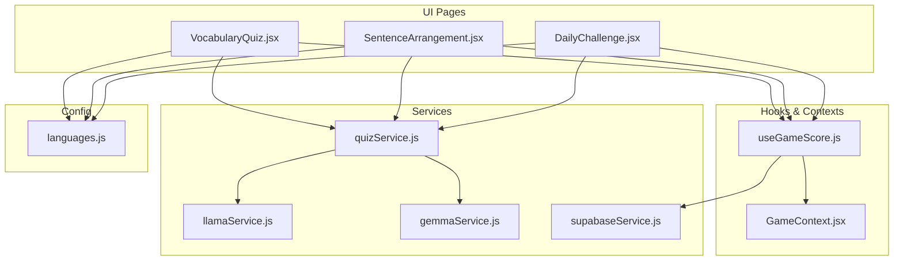
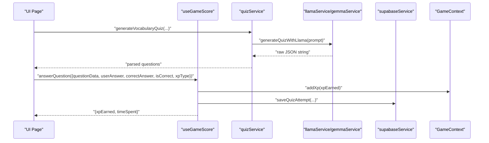
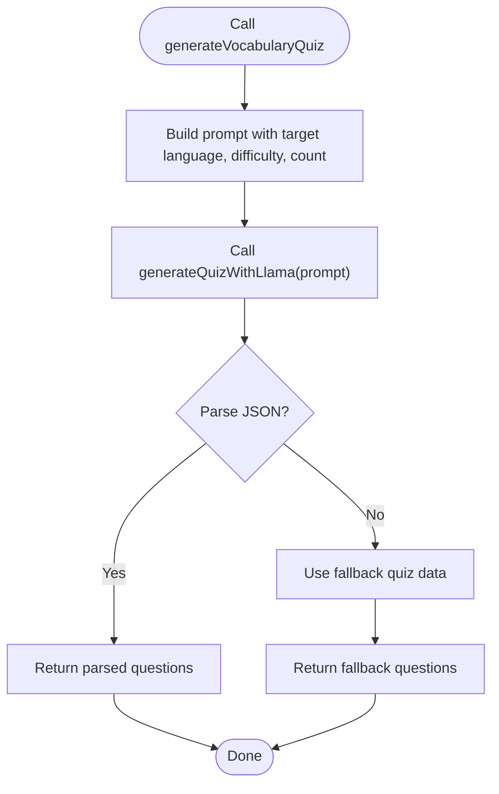
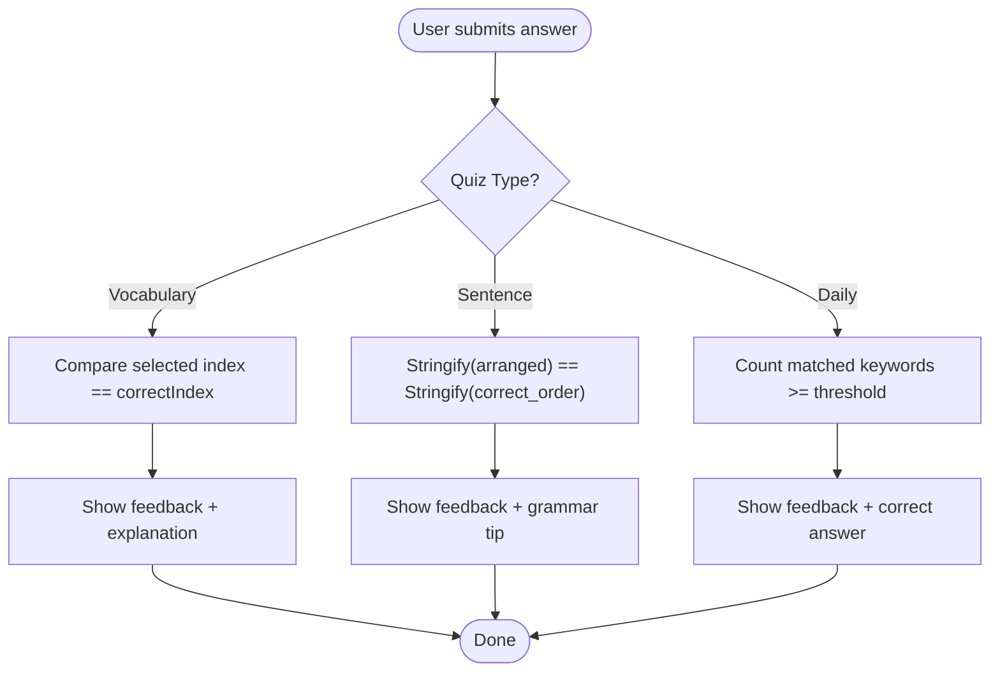
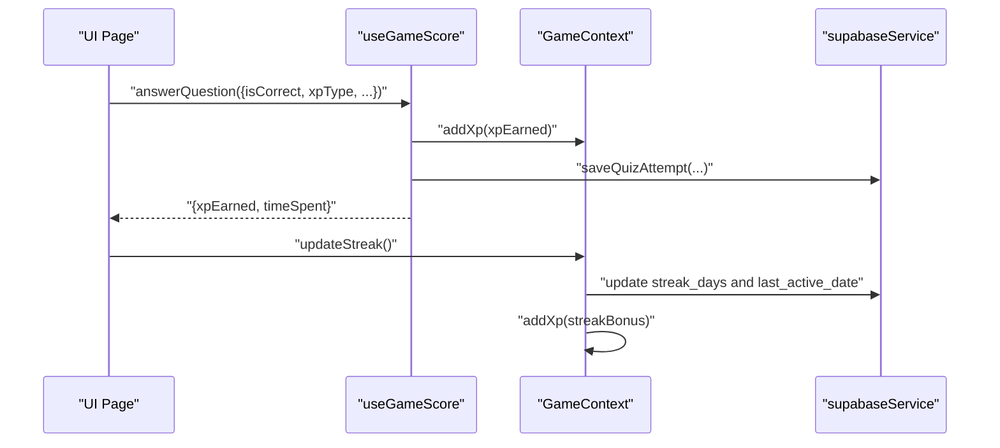
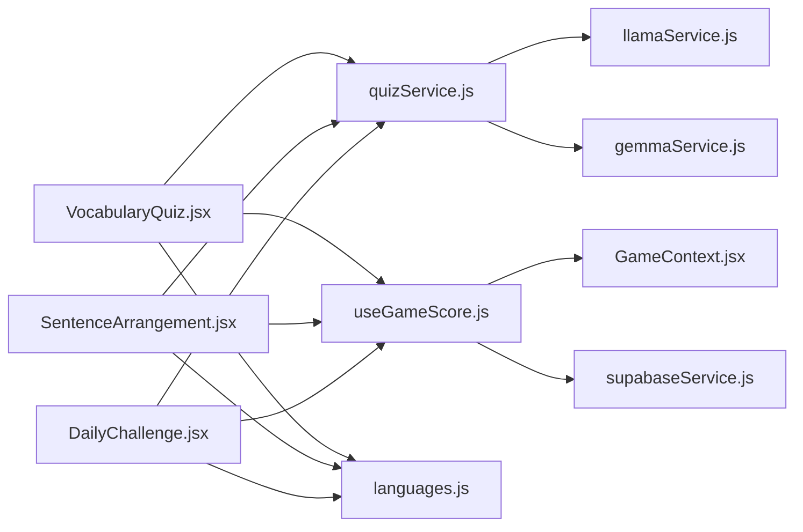

# Quiz Service API

<cite>
**Referenced Files in This Document**
- [quizService.js](file://src/services/quizService.js)
- [VocabularyQuiz.jsx](file://src/pages/games/VocabularyQuiz.jsx)
- [SentenceArrangement.jsx](file://src/pages/games/SentenceArrangement.jsx)
- [DailyChallenge.jsx](file://src/pages/games/DailyChallenge.jsx)
- [useGameScore.js](file://src/hooks/useGameScore.js)
- [languages.js](file://src/config/languages.js)
- [llamaService.js](file://src/services/llamaService.js)
- [gemmaService.js](file://src/services/gemmaService.js)
- [GameContext.jsx](file://src/contexts/GameContext.jsx)
- [supabaseService.js](file://src/services/supabaseService.js)
</cite>

## Table of Contents
1. [Introduction](#introduction)
2. [Project Structure](#project-structure)
3. [Core Components](#core-components)
4. [Architecture Overview](#architecture-overview)
5. [Detailed Component Analysis](#detailed-component-analysis)
6. [Dependency Analysis](#dependency-analysis)
7. [Performance Considerations](#performance-considerations)
8. [Troubleshooting Guide](#troubleshooting-guide)
9. [Conclusion](#conclusion)
10. [Appendices](#appendices)

## Introduction
This document provides comprehensive API documentation for the quiz service that powers dynamic language learning content in the application. It covers the quiz generation APIs, question data structures, answer validation logic, difficulty scaling, adaptive learning features, and integration with game mechanics for XP awarding, streak tracking, and progress updates. It also includes guidance on quiz customization, content localization, accessibility, content management strategies, question bank organization, and quality assurance processes for educational content generation.

## Project Structure
The quiz service is composed of:
- Service layer: quizService.js orchestrates question generation using Llama and Gemma APIs.
- UI pages: VocabularyQuiz.jsx, SentenceArrangement.jsx, and DailyChallenge.jsx consume the quiz service and manage user interactions.
- Hooks and contexts: useGameScore.js manages scoring and persistence; GameContext.jsx handles XP, streaks, and level progression.
- Configuration: languages.js defines supported languages, difficulty levels, XP rewards, and level calculations.
- Persistence: supabaseService.js persists quiz attempts and user progress.
- LLM integrations: llamaService.js and gemmaService.js wrap external AI APIs.

**Diagram sources**
- [quizService.js:1-154](file://src/services/quizService.js#L1-L154)
- [VocabularyQuiz.jsx:1-215](file://src/pages/games/VocabularyQuiz.jsx#L1-L215)
- [SentenceArrangement.jsx:1-280](file://src/pages/games/SentenceArrangement.jsx#L1-L280)
- [DailyChallenge.jsx:1-249](file://src/pages/games/DailyChallenge.jsx#L1-L249)
- [useGameScore.js:1-76](file://src/hooks/useGameScore.js#L1-L76)
- [GameContext.jsx:1-141](file://src/contexts/GameContext.jsx#L1-L141)
- [supabaseService.js:1-132](file://src/services/supabaseService.js#L1-L132)
- [llamaService.js:1-84](file://src/services/llamaService.js#L1-L84)
- [gemmaService.js:1-56](file://src/services/gemmaService.js#L1-L56)
- [languages.js:1-30](file://src/config/languages.js#L1-L30)

**Section sources**
- [quizService.js:1-154](file://src/services/quizService.js#L1-L154)
- [VocabularyQuiz.jsx:1-215](file://src/pages/games/VocabularyQuiz.jsx#L1-L215)
- [SentenceArrangement.jsx:1-280](file://src/pages/games/SentenceArrangement.jsx#L1-L280)
- [DailyChallenge.jsx:1-249](file://src/pages/games/DailyChallenge.jsx#L1-L249)
- [useGameScore.js:1-76](file://src/hooks/useGameScore.js#L1-L76)
- [GameContext.jsx:1-141](file://src/contexts/GameContext.jsx#L1-L141)
- [supabaseService.js:1-132](file://src/services/supabaseService.js#L1-L132)
- [llamaService.js:1-84](file://src/services/llamaService.js#L1-L84)
- [gemmaService.js:1-56](file://src/services/gemmaService.js#L1-L56)
- [languages.js:1-30](file://src/config/languages.js#L1-L30)

## Core Components
- Quiz Service API: Provides three primary generation functions:
  - generateVocabularyQuiz(targetLangCode, difficulty, count)
  - generateSentenceExercise(targetLangCode, difficulty, count)
  - generateDailyChallenge(sourceLangCode, targetLangCode, difficulty)
- Scoring and Persistence Hook: useGameScore(quizType) manages scoring, timing, XP awarding, and saving attempts to Supabase.
- Game Mechanics Context: GameContext.jsx tracks XP, level, streak, and records answers.
- Configuration: languages.js defines supported languages, difficulty levels, XP rewards, and level calculation.
- LLM Integrations: llamaService.js and gemmaService.js encapsulate external AI APIs and provide robust fallbacks.

Key responsibilities:
- Question generation with structured JSON prompts and fallbacks.
- Answer validation tailored to each quiz type.
- Difficulty scaling and XP reward adjustments.
- Streak tracking and level progression.
- Persistent storage of quiz attempts and user progress.

**Section sources**
- [quizService.js:8-88](file://src/services/quizService.js#L8-L88)
- [useGameScore.js:7-75](file://src/hooks/useGameScore.js#L7-L75)
- [GameContext.jsx:20-55](file://src/contexts/GameContext.jsx#L20-L55)
- [languages.js:14-29](file://src/config/languages.js#L14-L29)
- [llamaService.js:62-83](file://src/services/llamaService.js#L62-L83)
- [gemmaService.js:47-55](file://src/services/gemmaService.js#L47-L55)

## Architecture Overview
The quiz service follows a layered architecture:
- Presentation Layer: React pages render UI, collect user input, and trigger quiz generation.
- Business Logic Layer: quizService.js composes prompts and delegates to LLM services.
- Integration Layer: llamaService.js and gemmaService.js call external AI APIs.
- Persistence Layer: supabaseService.js stores quiz attempts and user progress.
- Game Mechanics: GameContext.jsx and useGameScore.js coordinate XP, streaks, and analytics.

**Diagram sources**
- [VocabularyQuiz.jsx:21-57](file://src/pages/games/VocabularyQuiz.jsx#L21-L57)
- [useGameScore.js:23-55](file://src/hooks/useGameScore.js#L23-L55)
- [quizService.js:8-32](file://src/services/quizService.js#L8-L32)
- [llamaService.js:62-83](file://src/services/llamaService.js#L62-L83)
- [supabaseService.js:32-45](file://src/services/supabaseService.js#L32-L45)
- [GameContext.jsx:76-84](file://src/contexts/GameContext.jsx#L76-L84)

## Detailed Component Analysis

### Quiz Service API
The quiz service exposes three primary functions for generating dynamic language learning content.

- generateVocabularyQuiz(targetLangCode, difficulty = "easy", count = 5)
  - Purpose: Generates vocabulary quizzes with multiple-choice options.
  - Input parameters:
    - targetLangCode: Language code for the target language.
    - difficulty: "easy" | "medium" | "hard".
    - count: Number of questions to generate.
  - Output: Array of question objects with fields:
    - id: Unique identifier.
    - word: Target word/phrase to translate.
    - options: List of candidate translations.
    - correctIndex: Index of the correct option.
    - explanation: Educational explanation for the correct answer.
  - Validation: Validates JSON extraction and falls back to predefined quizzes if parsing fails.
  - Example usage: [VocabularyQuiz.jsx:25](file://src/pages/games/VocabularyQuiz.jsx#L25)

- generateSentenceExercise(targetLangCode, difficulty = "easy", count = 3)
  - Purpose: Creates sentence arrangement exercises where users reorder shuffled words.
  - Input parameters:
    - targetLangCode: Language code for the target language.
    - difficulty: "easy" | "medium" | "hard".
    - count: Number of exercises to generate.
  - Output: Array of exercise objects with fields:
    - id: Unique identifier.
    - original_sentence: Correct sentence in target language.
    - english_hint: English hint for the sentence.
    - shuffled_words: Words in shuffled order.
    - correct_order: Correct word order.
    - grammar_tip: Grammar tip for the sentence structure.
  - Validation: Extracts JSON from raw response or falls back to predefined exercises.
  - Example usage: [SentenceArrangement.jsx:28](file://src/pages/games/SentenceArrangement.jsx#L28)

- generateDailyChallenge(sourceLangCode, targetLangCode, difficulty = "medium")
  - Purpose: Produces a daily translation challenge with lenient keyword-based validation.
  - Input parameters:
    - sourceLangCode: Source language code.
    - targetLangCode: Target language code.
    - difficulty: "easy" | "medium" | "hard".
  - Output: Challenge object with fields:
    - prompt_text: Text to translate.
    - english_hint: English hint for the prompt.
    - correct_answer: Expected translation.
    - keywords: Keywords to match for correctness.
    - explanation: Explanation of the correct translation.
    - difficulty: Assigned difficulty.
  - Validation: Extracts JSON from raw response or falls back to a default challenge.
  - Example usage: [DailyChallenge.jsx:30](file://src/pages/games/DailyChallenge.jsx#L30)

**Diagram sources**
- [quizService.js:8-32](file://src/services/quizService.js#L8-L32)
- [llamaService.js:62-83](file://src/services/llamaService.js#L62-L83)

**Section sources**
- [quizService.js:8-88](file://src/services/quizService.js#L8-L88)
- [llamaService.js:62-83](file://src/services/llamaService.js#L62-L83)
- [gemmaService.js:47-55](file://src/services/gemmaService.js#L47-L55)

### Question Data Structures
- Vocabulary Quiz Questions:
  - Fields: id, word, options[], correctIndex, explanation.
  - Complexity: O(n) per question for validation; O(n) for rendering options.
  - Validation: Compare selected index with correctIndex.

- Sentence Arrangement Exercises:
  - Fields: id, original_sentence, english_hint, shuffled_words[], correct_order[], grammar_tip.
  - Complexity: O(m log m) for shuffling; O(m) for equality check against correct_order.
  - Validation: Stringify and compare ordered arrays.

- Daily Challenge Questions:
  - Fields: prompt_text, english_hint, correct_answer, keywords[], explanation, difficulty.
  - Complexity: O(k) for keyword matching where k is number of keywords.
  - Validation: Lenient matching using keyword overlap threshold.

**Section sources**
- [quizService.js:90-153](file://src/services/quizService.js#L90-L153)
- [VocabularyQuiz.jsx:42-48](file://src/pages/games/VocabularyQuiz.jsx#L42-L48)
- [SentenceArrangement.jsx:72-80](file://src/pages/games/SentenceArrangement.jsx#L72-L80)
- [DailyChallenge.jsx:59-69](file://src/pages/games/DailyChallenge.jsx#L59-L69)

### Answer Validation Logic
- Vocabulary Quiz:
  - Compares selected option index with correctIndex.
  - Provides immediate feedback with explanation.

- Sentence Arrangement:
  - Compares user-arranged words with correct_order using stringify comparison.
  - Offers grammar tip on incorrect answers.

- Daily Challenge:
  - Uses keyword-based matching with a threshold of ceil(keywords.length * 0.6).
  - Awards XP multiplier based on difficulty.

**Diagram sources**
- [VocabularyQuiz.jsx:42-48](file://src/pages/games/VocabularyQuiz.jsx#L42-L48)
- [SentenceArrangement.jsx:72-80](file://src/pages/games/SentenceArrangement.jsx#L72-L80)
- [DailyChallenge.jsx:59-69](file://src/pages/games/DailyChallenge.jsx#L59-L69)

**Section sources**
- [VocabularyQuiz.jsx:37-68](file://src/pages/games/VocabularyQuiz.jsx#L37-L68)
- [SentenceArrangement.jsx:69-102](file://src/pages/games/SentenceArrangement.jsx#L69-L102)
- [DailyChallenge.jsx:50-80](file://src/pages/games/DailyChallenge.jsx#L50-L80)

### Difficulty Scaling and Adaptive Learning Features
- Difficulty Levels:
  - Easy, Medium, Hard mapped to XP multipliers and prompt complexity.
  - XP_REWARDS adjust per quiz type and difficulty.

- Adaptive Mechanisms:
  - Dynamic prompt construction based on difficulty and language.
  - Fallback content ensures availability when LLM parsing fails.
  - Streak bonuses and level progression motivate continued engagement.

**Section sources**
- [languages.js:14-25](file://src/config/languages.js#L14-L25)
- [quizService.js:95-153](file://src/services/quizService.js#L95-L153)
- [GameContext.jsx:107-119](file://src/contexts/GameContext.jsx#L107-L119)

### Scoring Mechanisms and Game Mechanics Integration
- Scoring:
  - useGameScore(quizType) maintains score, correct answers, total attempts, and accuracy.
  - Awards XP based on XP_REWARDS and difficulty multipliers.
  - Persists attempts to Supabase with questionData, userAnswer, correctAnswer, isCorrect, xpEarned, timeSpentSec.

- Game Mechanics:
  - GameContext.jsx tracks XP, level, streak, and records answers.
  - updateStreak increments streak and awards streakBonus XP.
  - calcLevel determines level based on XP thresholds.

**Diagram sources**
- [useGameScore.js:23-55](file://src/hooks/useGameScore.js#L23-L55)
- [GameContext.jsx:76-119](file://src/contexts/GameContext.jsx#L76-L119)
- [supabaseService.js:32-45](file://src/services/supabaseService.js#L32-L45)

**Section sources**
- [useGameScore.js:23-61](file://src/hooks/useGameScore.js#L23-L61)
- [GameContext.jsx:76-119](file://src/contexts/GameContext.jsx#L76-L119)
- [supabaseService.js:32-58](file://src/services/supabaseService.js#L32-L58)

### UI Integration Patterns
- Vocabulary Quiz:
  - Setup screen selects target language and difficulty.
  - Playing screen renders questions with animated transitions and immediate feedback.
  - Results screen displays accuracy, score, and XP.

- Sentence Arrangement:
  - Interactive drag-and-drop word arrangement with hints.
  - Immediate feedback and grammar tips.

- Daily Challenge:
  - Timer-based gameplay with difficulty-based XP multipliers.
  - Keyword-based validation and streak tracking.

**Section sources**
- [VocabularyQuiz.jsx:9-215](file://src/pages/games/VocabularyQuiz.jsx#L9-L215)
- [SentenceArrangement.jsx:9-280](file://src/pages/games/SentenceArrangement.jsx#L9-L280)
- [DailyChallenge.jsx:10-249](file://src/pages/games/DailyChallenge.jsx#L10-L249)

## Dependency Analysis
The quiz service exhibits low coupling and high cohesion:
- quizService.js depends on llamaService.js and gemmaService.js for content generation.
- UI pages depend on quizService.js and useGameScore.js for behavior.
- useGameScore.js depends on GameContext.jsx and supabaseService.js for persistence.
- Configuration is centralized in languages.js.

**Diagram sources**
- [quizService.js:1-3](file://src/services/quizService.js#L1-L3)
- [VocabularyQuiz.jsx:6](file://src/pages/games/VocabularyQuiz.jsx#L6)
- [SentenceArrangement.jsx:6](file://src/pages/games/SentenceArrangement.jsx#L6)
- [DailyChallenge.jsx:7](file://src/pages/games/DailyChallenge.jsx#L7)
- [useGameScore.js:1-6](file://src/hooks/useGameScore.js#L1-L6)
- [GameContext.jsx:1-6](file://src/contexts/GameContext.jsx#L1-L6)
- [supabaseService.js:1](file://src/services/supabaseService.js#L1)
- [languages.js:1-7](file://src/config/languages.js#L1-L7)

**Section sources**
- [quizService.js:1-3](file://src/services/quizService.js#L1-L3)
- [VocabularyQuiz.jsx:6](file://src/pages/games/VocabularyQuiz.jsx#L6)
- [SentenceArrangement.jsx:6](file://src/pages/games/SentenceArrangement.jsx#L6)
- [DailyChallenge.jsx:7](file://src/pages/games/DailyChallenge.jsx#L7)
- [useGameScore.js:1-6](file://src/hooks/useGameScore.js#L1-L6)
- [GameContext.jsx:1-6](file://src/contexts/GameContext.jsx#L1-L6)
- [supabaseService.js:1](file://src/services/supabaseService.js#L1)
- [languages.js:1-7](file://src/config/languages.js#L1-L7)

## Performance Considerations
- Prompt Construction: Keep prompts concise to reduce token usage and latency.
- JSON Parsing: Robust fallbacks prevent UI stalls when parsing fails.
- Rendering: Use animations judiciously; consider virtualization for long lists.
- API Calls: Batch saves and debounce frequent updates to minimize network overhead.
- Caching: Cache frequently used fallback content to reduce repeated generation.

## Troubleshooting Guide
Common issues and resolutions:
- LLM API Failures:
  - Symptoms: Empty or malformed responses.
  - Resolution: quizService.js includes fallbacks; verify API keys and network connectivity.
  - References: [quizService.js:24-31](file://src/services/quizService.js#L24-L31), [quizService.js:54-60](file://src/services/quizService.js#L54-L60), [quizService.js:81-87](file://src/services/quizService.js#L81-L87)

- JSON Parsing Errors:
  - Symptoms: Unexpected empty arrays or objects.
  - Resolution: quizService.js attempts to extract JSON blocks; ensure prompts enforce strict JSON output.
  - References: [quizService.js:27-28](file://src/services/quizService.js#L27-L28), [quizService.js:56-57](file://src/services/quizService.js#L56-L57), [quizService.js:83-84](file://src/services/quizService.js#L83-L84)

- Scoring and Persistence:
  - Symptoms: Score not updating or missing attempts.
  - Resolution: useGameScore.js saves attempts; verify user authentication and Supabase connection.
  - References: [useGameScore.js:36-51](file://src/hooks/useGameScore.js#L36-L51), [supabaseService.js:32-45](file://src/services/supabaseService.js#L32-L45)

- Streak Tracking:
  - Symptoms: Streak not incrementing.
  - Resolution: GameContext.jsx checks last_active_date; ensure user is logged in and date logic is correct.
  - References: [GameContext.jsx:107-119](file://src/contexts/GameContext.jsx#L107-L119)

**Section sources**
- [quizService.js:24-31](file://src/services/quizService.js#L24-L31)
- [quizService.js:54-60](file://src/services/quizService.js#L54-L60)
- [quizService.js:81-87](file://src/services/quizService.js#L81-L87)
- [useGameScore.js:36-51](file://src/hooks/useGameScore.js#L36-L51)
- [supabaseService.js:32-45](file://src/services/supabaseService.js#L32-L45)
- [GameContext.jsx:107-119](file://src/contexts/GameContext.jsx#L107-L119)

## Conclusion
The quiz service provides a robust, extensible foundation for dynamic language learning content. Its modular design enables easy customization, localization, and integration with game mechanics. By leveraging structured prompts, fallback strategies, and persistent analytics, it delivers an engaging and adaptive learning experience.

## Appendices

### API Reference Summary
- generateVocabularyQuiz(targetLangCode, difficulty, count)
  - Returns: Array of vocabulary questions.
  - Validation: Index-based correctness.
  - Example usage: [VocabularyQuiz.jsx:25](file://src/pages/games/VocabularyQuiz.jsx#L25)

- generateSentenceExercise(targetLangCode, difficulty, count)
  - Returns: Array of sentence arrangement exercises.
  - Validation: Ordered array comparison.
  - Example usage: [SentenceArrangement.jsx:28](file://src/pages/games/SentenceArrangement.jsx#L28)

- generateDailyChallenge(sourceLangCode, targetLangCode, difficulty)
  - Returns: Daily challenge object.
  - Validation: Keyword-based lenient matching.
  - Example usage: [DailyChallenge.jsx:30](file://src/pages/games/DailyChallenge.jsx#L30)

### Scoring and XP Rewards
- XP_REWARDS:
  - quizCorrect: base XP for vocabulary quizzes.
  - sentenceCorrect: base XP for sentence arrangements.
  - dailyChallenge: base XP for daily challenges.
  - streakBonus: bonus XP for maintaining streaks.
- Difficulty Multipliers:
  - Hard: 2x XP.
  - Medium: 1.5x XP.
  - Easy: 1x XP.

**Section sources**
- [languages.js:20-25](file://src/config/languages.js#L20-L25)
- [DailyChallenge.jsx:69-76](file://src/pages/games/DailyChallenge.jsx#L69-L76)

### Accessibility and Localization Guidance
- Accessibility:
  - Ensure buttons are keyboard focusable and have sufficient contrast.
  - Provide aria-live regions for feedback announcements.
  - Use semantic HTML and labels for interactive elements.
- Localization:
  - Add language packs for UI text and hints.
  - Respect right-to-left languages and text direction.
  - Localize numeric formatting and units.

### Content Management and QA Processes
- Content Management:
  - Maintain separate fallback datasets per language.
  - Version control prompts and templates.
  - Audit generated content for accuracy and appropriateness.
- QA Processes:
  - Unit tests for parsing and validation logic.
  - Integration tests for API endpoints and fallbacks.
  - User testing sessions to validate UX and comprehension.