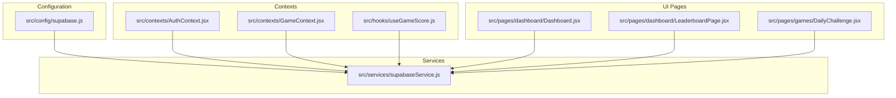
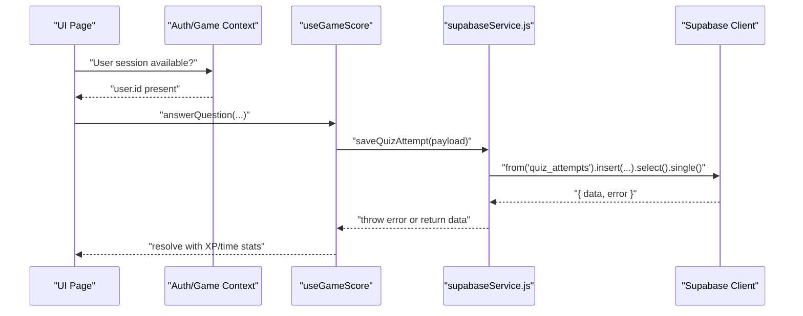
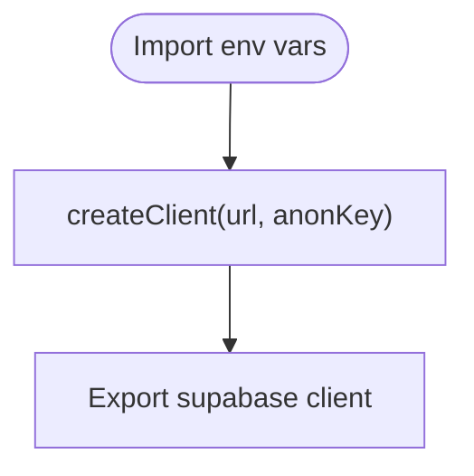
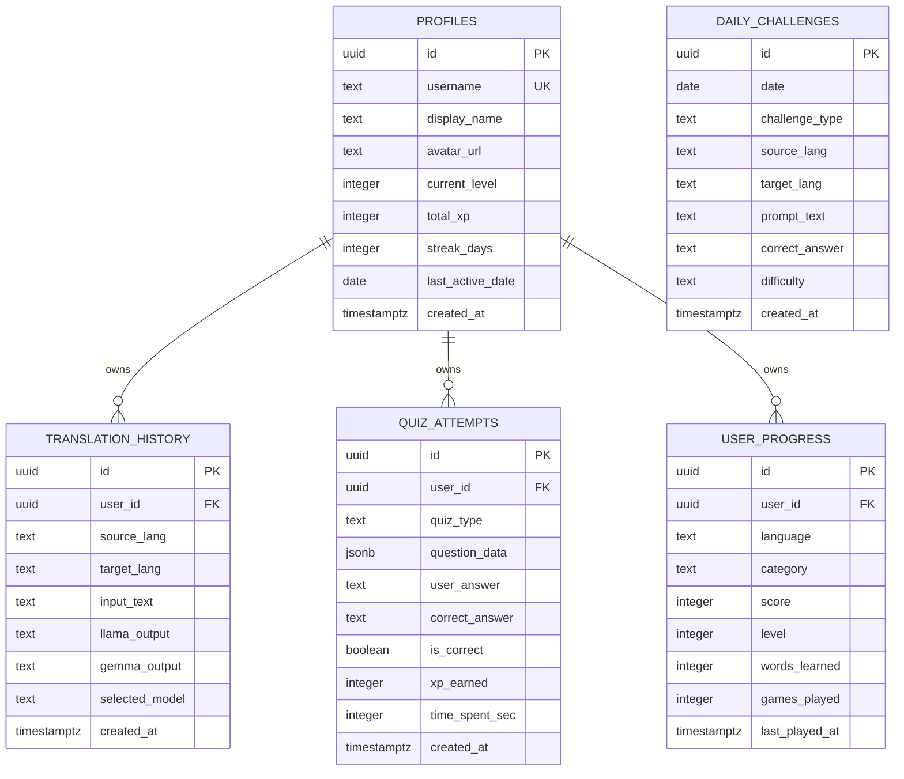
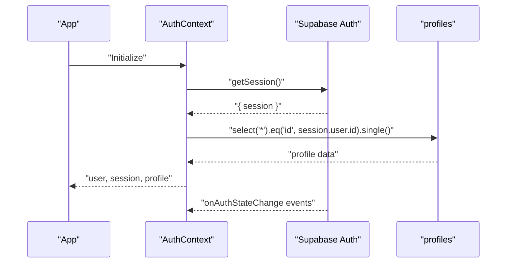
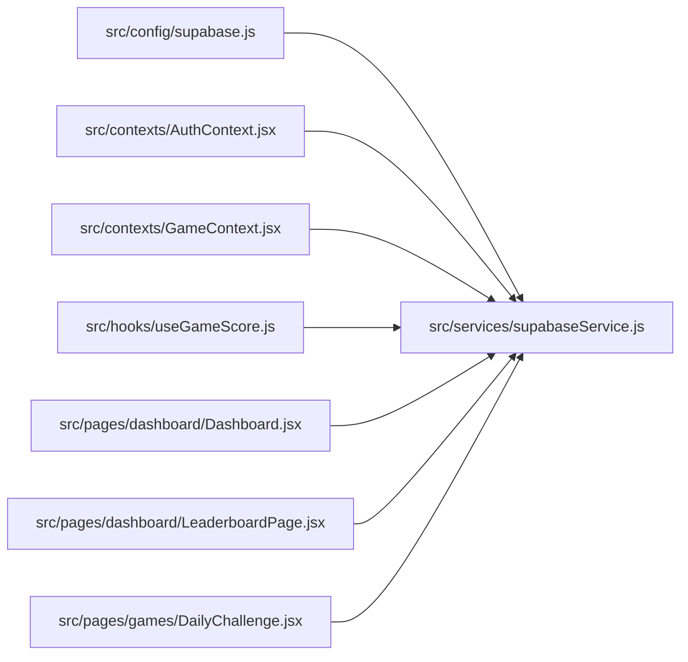

# Supabase Service API

<cite>
**Referenced Files in This Document**
- [supabase.js](file://src/config/supabase.js)
- [supabaseService.js](file://src/services/supabaseService.js)
- [supabase-schema.sql](file://supabase-schema.sql)
- [AuthContext.jsx](file://src/contexts/AuthContext.jsx)
- [GameContext.jsx](file://src/contexts/GameContext.jsx)
- [useGameScore.js](file://src/hooks/useGameScore.js)
- [Dashboard.jsx](file://src/pages/dashboard/Dashboard.jsx)
- [LeaderboardPage.jsx](file://src/pages/dashboard/LeaderboardPage.jsx)
- [DailyChallenge.jsx](file://src/pages/games/DailyChallenge.jsx)
- [package.json](file://package.json)
- [vite.config.js](file://vite.config.js)
</cite>

## Table of Contents
1. [Introduction](#introduction)
2. [Project Structure](#project-structure)
3. [Core Components](#core-components)
4. [Architecture Overview](#architecture-overview)
5. [Detailed Component Analysis](#detailed-component-analysis)
6. [Dependency Analysis](#dependency-analysis)
7. [Performance Considerations](#performance-considerations)
8. [Troubleshooting Guide](#troubleshooting-guide)
9. [Conclusion](#conclusion)
10. [Appendices](#appendices)

## Introduction
This document provides comprehensive API documentation for the Supabase service layer that powers authentication, data persistence, and real-time features in the application. It covers all exported functions for managing translations, quiz attempts, user progress, daily challenges, leaderboard, and profiles. It also documents database schemas, relationships, authentication requirements, query parameters, filtering, pagination, and error handling strategies. Finally, it outlines Supabase client configuration, environment-specific settings, and common database operation patterns used across the service layer.

## Project Structure
The Supabase service layer is organized around a small set of focused modules:
- Supabase client initialization and configuration
- Service functions for CRUD operations on core domain entities
- Authentication and game contexts that orchestrate user sessions and XP/streak updates
- UI pages that consume the service APIs and demonstrate usage patterns

**Diagram sources**
- [supabase.js:1-7](file://src/config/supabase.js#L1-L7)
- [supabaseService.js:1-132](file://src/services/supabaseService.js#L1-L132)
- [AuthContext.jsx:1-101](file://src/contexts/AuthContext.jsx#L1-L101)
- [GameContext.jsx:1-141](file://src/contexts/GameContext.jsx#L1-L141)
- [useGameScore.js:1-76](file://src/hooks/useGameScore.js#L1-L76)
- [Dashboard.jsx:1-151](file://src/pages/dashboard/Dashboard.jsx#L1-L151)
- [LeaderboardPage.jsx:1-78](file://src/pages/dashboard/LeaderboardPage.jsx#L1-L78)
- [DailyChallenge.jsx:1-249](file://src/pages/games/DailyChallenge.jsx#L1-L249)

**Section sources**
- [supabase.js:1-7](file://src/config/supabase.js#L1-L7)
- [supabaseService.js:1-132](file://src/services/supabaseService.js#L1-L132)
- [AuthContext.jsx:1-101](file://src/contexts/AuthContext.jsx#L1-L101)
- [GameContext.jsx:1-141](file://src/contexts/GameContext.jsx#L1-L141)
- [useGameScore.js:1-76](file://src/hooks/useGameScore.js#L1-L76)
- [Dashboard.jsx:1-151](file://src/pages/dashboard/Dashboard.jsx#L1-L151)
- [LeaderboardPage.jsx:1-78](file://src/pages/dashboard/LeaderboardPage.jsx#L1-L78)
- [DailyChallenge.jsx:1-249](file://src/pages/games/DailyChallenge.jsx#L1-L249)

## Core Components
This section documents the primary Supabase service functions and their responsibilities.

- saveTranslation
  - Purpose: Persist a translation request and model outputs to the translation history table.
  - Signature: saveTranslation({ userId, sourceLang, targetLang, inputText, llamaOutput, gemmaOutput, selectedModel })
  - Parameters:
    - userId: string (UUID)
    - sourceLang: string (ISO code)
    - targetLang: string (ISO code)
    - inputText: string
    - llamaOutput: string | null
    - gemmaOutput: string | null
    - selectedModel: string
  - Returns: Single inserted row from translation_history
  - Errors: Throws on database errors; callers should handle via try/catch
  - Notes: Uses insert + select().single()

- getTranslationHistory
  - Purpose: Retrieve a paginated list of a user’s translations ordered by recency.
  - Signature: getTranslationHistory(userId, limit = 50)
  - Parameters:
    - userId: string (UUID)
    - limit: number (default 50)
  - Returns: Array of translation_history rows
  - Errors: Throws on database errors
  - Notes: Filters by user_id, orders by created_at desc, limits results

- saveQuizAttempt
  - Purpose: Record a quiz attempt with metadata and scoring.
  - Signature: saveQuizAttempt({ userId, quizType, questionData, userAnswer, correctAnswer, isCorrect, xpEarned, timeSpentSec })
  - Parameters:
    - userId: string (UUID)
    - quizType: string (enum: vocabulary, sentence, challenge)
    - questionData: JSON object
    - userAnswer: string
    - correctAnswer: string
    - isCorrect: boolean
    - xpEarned: number
    - timeSpentSec: number
  - Returns: Single inserted row from quiz_attempts
  - Errors: Throws on database errors
  - Notes: Uses insert + select().single()

- getQuizAttempts
  - Purpose: Fetch quiz attempts with optional filtering by quiz type.
  - Signature: getQuizAttempts(userId, quizType = null, limit = 20)
  - Parameters:
    - userId: string (UUID)
    - quizType: string | null
    - limit: number (default 20)
  - Returns: Array of quiz_attempts rows
  - Errors: Throws on database errors
  - Notes: Filters by user_id, optionally filters by quiz_type, orders by created_at desc, limits results

- getUserProgress
  - Purpose: Retrieve all progress records for a given user.
  - Signature: getUserProgress(userId)
  - Parameters:
    - userId: string (UUID)
  - Returns: Array of user_progress rows
  - Errors: Throws on database errors
  - Notes: Filters by user_id

- upsertUserProgress
  - Purpose: Upsert a user’s progress for a specific language and category.
  - Signature: upsertUserProgress(userId, language, category, updates)
  - Parameters:
    - userId: string (UUID)
    - language: string
    - category: string
    - updates: object (fields to update; last_played_at is auto-set)
  - Returns: Single upserted row from user_progress
  - Errors: Throws on database errors
  - Notes: Uses upsert with conflict targeting user_id, language, category; sets last_played_at

- getDailyChallenge
  - Purpose: Fetch a daily challenge by date.
  - Signature: getDailyChallenge(date)
  - Parameters:
    - date: string (YYYY-MM-DD)
  - Returns: Single daily_challenges row or null
  - Errors: Throws on database errors
  - Notes: Uses maybeSingle()

- saveDailyChallenge
  - Purpose: Insert a new daily challenge.
  - Signature: saveDailyChallenge(challenge)
  - Parameters:
    - challenge: object (fields for daily_challenges)
  - Returns: Single inserted row from daily_challenges
  - Errors: Throws on database errors
  - Notes: Uses insert + select().single()

- getLeaderboard
  - Purpose: Retrieve top users by total XP for the leaderboard.
  - Signature: getLeaderboard(limit = 20)
  - Parameters:
    - limit: number (default 20)
  - Returns: Array of profile fields suitable for ranking
  - Errors: Throws on database errors
  - Notes: Selects specific profile fields, orders by total_xp desc, limits results

- getProfile
  - Purpose: Fetch a user’s profile by ID.
  - Signature: getProfile(userId)
  - Parameters:
    - userId: string (UUID)
  - Returns: Single profile row
  - Errors: Throws on database errors
  - Notes: Uses eq(id, userId) + single()

**Section sources**
- [supabaseService.js:5-17](file://src/services/supabaseService.js#L5-L17)
- [supabaseService.js:19-28](file://src/services/supabaseService.js#L19-L28)
- [supabaseService.js:32-44](file://src/services/supabaseService.js#L32-L44)
- [supabaseService.js:47-58](file://src/services/supabaseService.js#L47-L58)
- [supabaseService.js:62-69](file://src/services/supabaseService.js#L62-L69)
- [supabaseService.js:71-85](file://src/services/supabaseService.js#L71-L85)
- [supabaseService.js:89-97](file://src/services/supabaseService.js#L89-L97)
- [supabaseService.js:99-107](file://src/services/supabaseService.js#L99-L107)
- [supabaseService.js:111-119](file://src/services/supabaseService.js#L111-L119)
- [supabaseService.js:123-131](file://src/services/supabaseService.js#L123-L131)

## Architecture Overview
The Supabase service layer integrates tightly with React contexts and UI pages. Authentication state drives access to protected resources, while game and auth contexts coordinate XP updates and profile synchronization. The service functions encapsulate all Supabase queries, ensuring consistent error handling and data shaping.

**Diagram sources**
- [useGameScore.js:23-55](file://src/hooks/useGameScore.js#L23-L55)
- [supabaseService.js:32-44](file://src/services/supabaseService.js#L32-L44)
- [AuthContext.jsx:1-101](file://src/contexts/AuthContext.jsx#L1-L101)

**Section sources**
- [useGameScore.js:1-76](file://src/hooks/useGameScore.js#L1-L76)
- [supabaseService.js:1-132](file://src/services/supabaseService.js#L1-L132)
- [AuthContext.jsx:1-101](file://src/contexts/AuthContext.jsx#L1-L101)
- [GameContext.jsx:1-141](file://src/contexts/GameContext.jsx#L1-L141)

## Detailed Component Analysis

### Supabase Client Configuration
- Client creation: Initializes the Supabase client using Vite environment variables.
- Environment variables:
  - VITE_SUPABASE_URL: Supabase project URL
  - VITE_SUPABASE_ANON_KEY: Supabase anonymous API key
- Vite configuration: Exposes environment variables prefixed with VITE_ to the frontend.

**Diagram sources**
- [supabase.js:1-7](file://src/config/supabase.js#L1-L7)
- [vite.config.js:1-7](file://vite.config.js#L1-L7)

**Section sources**
- [supabase.js:1-7](file://src/config/supabase.js#L1-L7)
- [vite.config.js:1-7](file://vite.config.js#L1-L7)
- [package.json:1-31](file://package.json#L1-L31)

### Database Schemas and Relationships
The schema defines five core tables with Row Level Security policies and indexes optimized for common queries.

**Diagram sources**
- [supabase-schema.sql:5-119](file://supabase-schema.sql#L5-L119)

**Section sources**
- [supabase-schema.sql:1-119](file://supabase-schema.sql#L1-L119)

### Authentication and Authorization
- Authentication state: Managed by AuthContext, which listens to Supabase auth state changes and loads the user’s profile.
- Real-time security: Row Level Security policies restrict access to user-owned records for profiles, translation_history, quiz_attempts, and user_progress.
- Profile lifecycle: On signup, a profile is inserted with default values.

**Diagram sources**
- [AuthContext.jsx:12-40](file://src/contexts/AuthContext.jsx#L12-L40)

**Section sources**
- [AuthContext.jsx:1-101](file://src/contexts/AuthContext.jsx#L1-L101)

### Usage Examples and Error Handling
Below are representative usage patterns for each service function. Replace placeholders with actual values and wrap calls in try/catch blocks to handle errors.

- saveTranslation
  - Example call pattern:
    - Call saveTranslation({ userId, sourceLang, targetLang, inputText, llamaOutput, gemmaOutput, selectedModel })
    - Handle thrown error and use returned row for UI updates
  - Related integration: Translation UI pages call this after generating outputs

- getTranslationHistory
  - Example call pattern:
    - Call getTranslationHistory(userId, limit)
    - Handle thrown error and render list in UI
  - Related integration: Dashboard displays recent translations

- saveQuizAttempt
  - Example call pattern:
    - Call saveQuizAttempt({ userId, quizType, questionData, userAnswer, correctAnswer, isCorrect, xpEarned, timeSpentSec })
    - Handle thrown error and update UI state
  - Related integration: useGameScore invokes this after each answer

- getQuizAttempts
  - Example call pattern:
    - Call getQuizAttempts(userId, quizType, limit)
    - Handle thrown error and render attempts
  - Related integration: Dashboard shows recent activity

- getUserProgress
  - Example call pattern:
    - Call getUserProgress(userId)
    - Handle thrown error and render progress cards

- upsertUserProgress
  - Example call pattern:
    - Call upsertUserProgress(userId, language, category, updates)
    - Handle thrown error and refresh UI
  - Related integration: GameContext persists XP and level changes

- getDailyChallenge
  - Example call pattern:
    - Call getDailyChallenge(date)
    - Handle thrown error and fallback if null

- saveDailyChallenge
  - Example call pattern:
    - Call saveDailyChallenge(challenge)
    - Handle thrown error and notify admin

- getLeaderboard
  - Example call pattern:
    - Call getLeaderboard(limit)
    - Handle thrown error and render leaderboard

- getProfile
  - Example call pattern:
    - Call getProfile(userId)
    - Handle thrown error and render profile card

**Section sources**
- [supabaseService.js:5-17](file://src/services/supabaseService.js#L5-L17)
- [supabaseService.js:19-28](file://src/services/supabaseService.js#L19-L28)
- [supabaseService.js:32-44](file://src/services/supabaseService.js#L32-L44)
- [supabaseService.js:47-58](file://src/services/supabaseService.js#L47-L58)
- [supabaseService.js:62-69](file://src/services/supabaseService.js#L62-L69)
- [supabaseService.js:71-85](file://src/services/supabaseService.js#L71-L85)
- [supabaseService.js:89-97](file://src/services/supabaseService.js#L89-L97)
- [supabaseService.js:99-107](file://src/services/supabaseService.js#L99-L107)
- [supabaseService.js:111-119](file://src/services/supabaseService.js#L111-L119)
- [supabaseService.js:123-131](file://src/services/supabaseService.js#L123-L131)
- [Dashboard.jsx:16-23](file://src/pages/dashboard/Dashboard.jsx#L16-L23)
- [LeaderboardPage.jsx:12-17](file://src/pages/dashboard/LeaderboardPage.jsx#L12-L17)
- [useGameScore.js:35-51](file://src/hooks/useGameScore.js#L35-L51)
- [GameContext.jsx:76-84](file://src/contexts/GameContext.jsx#L76-L84)

### Database Operations Patterns
Common patterns used across the service layer:
- Insert + select().single(): Ensures returning the inserted row for immediate UI updates
- Select with filters: user_id equality for privacy and ordering by created_at desc
- Limiting: Applied to reduce payload sizes for history and leaderboard
- Upsert with conflict target: Used for user_progress to merge updates by composite key
- maybeSingle(): Used for optional daily challenge retrieval

**Section sources**
- [supabaseService.js:5-17](file://src/services/supabaseService.js#L5-L17)
- [supabaseService.js:19-28](file://src/services/supabaseService.js#L19-L28)
- [supabaseService.js:32-44](file://src/services/supabaseService.js#L32-L44)
- [supabaseService.js:47-58](file://src/services/supabaseService.js#L47-L58)
- [supabaseService.js:71-85](file://src/services/supabaseService.js#L71-L85)
- [supabaseService.js:89-97](file://src/services/supabaseService.js#L89-L97)
- [supabaseService.js:111-119](file://src/services/supabaseService.js#L111-L119)
- [supabaseService.js:123-131](file://src/services/supabaseService.js#L123-L131)

## Dependency Analysis
The service layer depends on the Supabase client and is consumed by React contexts and pages. There are no circular dependencies among the documented modules.

**Diagram sources**
- [supabase.js:1-7](file://src/config/supabase.js#L1-L7)
- [supabaseService.js:1-132](file://src/services/supabaseService.js#L1-L132)
- [AuthContext.jsx:1-101](file://src/contexts/AuthContext.jsx#L1-L101)
- [GameContext.jsx:1-141](file://src/contexts/GameContext.jsx#L1-L141)
- [useGameScore.js:1-76](file://src/hooks/useGameScore.js#L1-L76)
- [Dashboard.jsx:1-151](file://src/pages/dashboard/Dashboard.jsx#L1-L151)
- [LeaderboardPage.jsx:1-78](file://src/pages/dashboard/LeaderboardPage.jsx#L1-L78)
- [DailyChallenge.jsx:1-249](file://src/pages/games/DailyChallenge.jsx#L1-L249)

**Section sources**
- [supabase.js:1-7](file://src/config/supabase.js#L1-L7)
- [supabaseService.js:1-132](file://src/services/supabaseService.js#L1-L132)
- [AuthContext.jsx:1-101](file://src/contexts/AuthContext.jsx#L1-L101)
- [GameContext.jsx:1-141](file://src/contexts/GameContext.jsx#L1-L141)
- [useGameScore.js:1-76](file://src/hooks/useGameScore.js#L1-L76)
- [Dashboard.jsx:1-151](file://src/pages/dashboard/Dashboard.jsx#L1-L151)
- [LeaderboardPage.jsx:1-78](file://src/pages/dashboard/LeaderboardPage.jsx#L1-L78)
- [DailyChallenge.jsx:1-249](file://src/pages/games/DailyChallenge.jsx#L1-L249)

## Performance Considerations
- Indexes: The schema includes indexes on frequently queried columns (e.g., user_id, date, total_xp) to optimize reads.
- Pagination: Functions accept a limit parameter to constrain result sizes.
- Ordering: Queries order by created_at desc to prioritize recent items.
- Upserts: Using upsert with a conflict target avoids redundant inserts and reduces write amplification.

**Section sources**
- [supabase-schema.sql:113-119](file://supabase-schema.sql#L113-L119)
- [supabaseService.js:19-28](file://src/services/supabaseService.js#L19-L28)
- [supabaseService.js:47-58](file://src/services/supabaseService.js#L47-L58)
- [supabaseService.js:111-119](file://src/services/supabaseService.js#L111-L119)

## Troubleshooting Guide
- Authentication failures:
  - Verify VITE_SUPABASE_URL and VITE_SUPABASE_ANON_KEY are set in the environment.
  - Confirm AuthContext receives a session and profile; otherwise, re-authenticate.
- Permission errors:
  - Ensure Row Level Security policies are enabled and functioning.
  - Confirm user_id matches the authenticated user for protected tables.
- Network errors:
  - Wrap service calls in try/catch and surface user-friendly messages.
  - Retry transient network failures gracefully.
- Data shape mismatches:
  - Validate payload shapes for insert/upsert operations against table schemas.
  - Handle optional fields (e.g., llama_output, gemma_output) as null when missing.

**Section sources**
- [supabase.js:1-7](file://src/config/supabase.js#L1-L7)
- [AuthContext.jsx:1-101](file://src/contexts/AuthContext.jsx#L1-L101)
- [supabase-schema.sql:17-112](file://supabase-schema.sql#L17-L112)
- [supabaseService.js:5-17](file://src/services/supabaseService.js#L5-L17)
- [supabaseService.js:32-44](file://src/services/supabaseService.js#L32-L44)
- [supabaseService.js:71-85](file://src/services/supabaseService.js#L71-L85)
- [supabaseService.js:99-107](file://src/services/supabaseService.js#L99-L107)

## Conclusion
The Supabase service layer provides a clean, consistent interface for authentication, data persistence, and leaderboard features. By leveraging Supabase’s client, RLS, and indexing, the application ensures secure, scalable, and maintainable operations across translations, quizzes, progress tracking, and daily challenges.

## Appendices

### API Reference Summary
- saveTranslation: Insert translation with model outputs; returns single row
- getTranslationHistory: List user translations with limit and sort
- saveQuizAttempt: Insert quiz attempt with scoring; returns single row
- getQuizAttempts: List attempts with optional type filter and limit
- getUserProgress: List all progress for a user
- upsertUserProgress: Upsert progress by composite key; returns single row
- getDailyChallenge: Fetch daily challenge by date; may return null
- saveDailyChallenge: Insert daily challenge; returns single row
- getLeaderboard: Rank profiles by total XP with limit
- getProfile: Fetch profile by user ID

**Section sources**
- [supabaseService.js:5-17](file://src/services/supabaseService.js#L5-L17)
- [supabaseService.js:19-28](file://src/services/supabaseService.js#L19-L28)
- [supabaseService.js:32-44](file://src/services/supabaseService.js#L32-L44)
- [supabaseService.js:47-58](file://src/services/supabaseService.js#L47-L58)
- [supabaseService.js:62-69](file://src/services/supabaseService.js#L62-L69)
- [supabaseService.js:71-85](file://src/services/supabaseService.js#L71-L85)
- [supabaseService.js:89-97](file://src/services/supabaseService.js#L89-L97)
- [supabaseService.js:99-107](file://src/services/supabaseService.js#L99-L107)
- [supabaseService.js:111-119](file://src/services/supabaseService.js#L111-L119)
- [supabaseService.js:123-131](file://src/services/supabaseService.js#L123-L131)