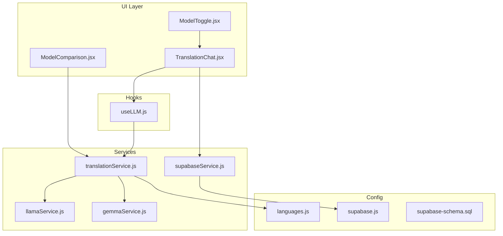
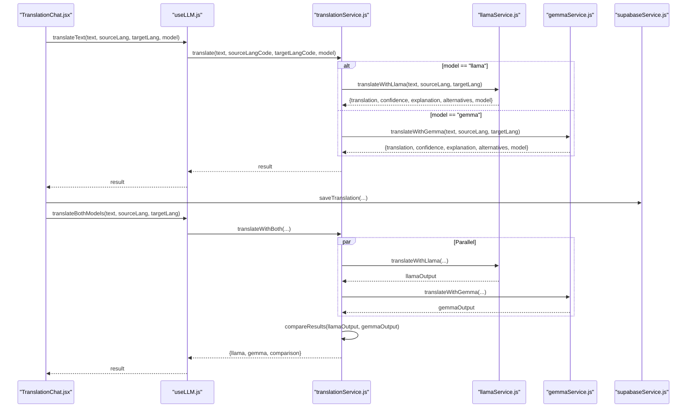
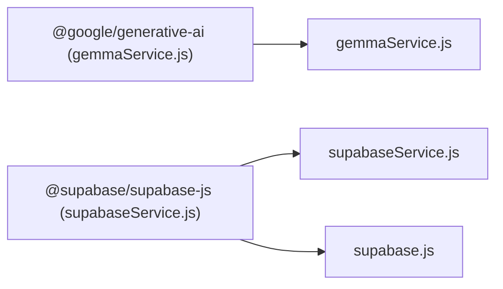
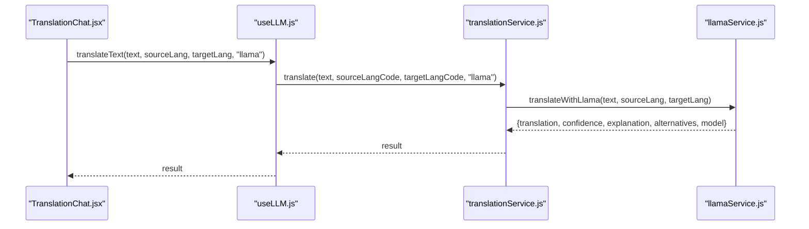
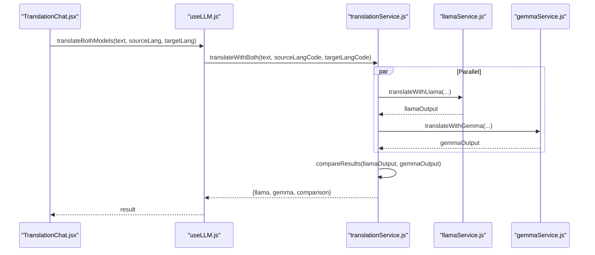

# Translation Service API

<cite>
**Referenced Files in This Document**
- [translationService.js](file://src/services/translationService.js)
- [llamaService.js](file://src/services/llamaService.js)
- [gemmaService.js](file://src/services/gemmaService.js)
- [useLLM.js](file://src/hooks/useLLM.js)
- [TranslationChat.jsx](file://src/pages/chat/TranslationChat.jsx)
- [ModelComparison.jsx](file://src/pages/chat/ModelComparison.jsx)
- [ModelToggle.jsx](file://src/components/ModelToggle.jsx)
- [supabaseService.js](file://src/services/supabaseService.js)
- [supabase.js](file://src/config/supabase.js)
- [languages.js](file://src/config/languages.js)
- [supabase-schema.sql](file://supabase-schema.sql)
- [package.json](file://package.json)
</cite>

## Table of Contents
1. [Introduction](#introduction)
2. [Project Structure](#project-structure)
3. [Core Components](#core-components)
4. [Architecture Overview](#architecture-overview)
5. [Detailed Component Analysis](#detailed-component-analysis)
6. [Dependency Analysis](#dependency-analysis)
7. [Performance Considerations](#performance-considerations)
8. [Troubleshooting Guide](#troubleshooting-guide)
9. [Conclusion](#conclusion)
10. [Appendices](#appendices)

## Introduction
This document provides comprehensive API documentation for the translation service layer that orchestrates translation requests between Llama and Gemma AI models. It covers function signatures, parameter specifications, integration patterns with external AI APIs, request/response schemas, error handling strategies, dual-model comparison, translation history storage, and model performance metrics. Guidance is included for model selection algorithms, fallback mechanisms, quality assessment criteria, caching strategies, request batching, and performance optimization techniques for AI API calls.

## Project Structure
The translation service layer is organized around three primary service modules and a coordinating hook:
- translationService.js: Orchestrates translation requests and comparison logic
- llamaService.js: Integrates with Meta’s Llama API
- gemmaService.js: Integrates with Google Generative AI (Gemini)
- useLLM.js: React hook exposing translation APIs to UI components
- TranslationChat.jsx and ModelComparison.jsx: UI components consuming the translation APIs
- ModelToggle.jsx: Model selection UI
- supabaseService.js: Translation history persistence
- supabase.js: Supabase client configuration
- languages.js: Language metadata and helpers
- supabase-schema.sql: Database schema for translation history
- package.json: External dependencies (Google Generative AI SDK)

**Diagram sources**
- [TranslationChat.jsx:1-197](file://src/pages/chat/TranslationChat.jsx#L1-L197)
- [ModelComparison.jsx:1-81](file://src/pages/chat/ModelComparison.jsx#L1-L81)
- [ModelToggle.jsx:1-25](file://src/components/ModelToggle.jsx#L1-L25)
- [useLLM.js:1-38](file://src/hooks/useLLM.js#L1-L38)
- [translationService.js:1-73](file://src/services/translationService.js#L1-L73)
- [llamaService.js:1-84](file://src/services/llamaService.js#L1-L84)
- [gemmaService.js:1-56](file://src/services/gemmaService.js#L1-L56)
- [supabaseService.js:1-132](file://src/services/supabaseService.js#L1-L132)
- [supabase.js:1-7](file://src/config/supabase.js#L1-L7)
- [languages.js:1-30](file://src/config/languages.js#L1-L30)
- [supabase-schema.sql:1-118](file://supabase-schema.sql#L1-L118)

**Section sources**
- [translationService.js:1-73](file://src/services/translationService.js#L1-L73)
- [llamaService.js:1-84](file://src/services/llamaService.js#L1-L84)
- [gemmaService.js:1-56](file://src/services/gemmaService.js#L1-L56)
- [useLLM.js:1-38](file://src/hooks/useLLM.js#L1-L38)
- [TranslationChat.jsx:1-197](file://src/pages/chat/TranslationChat.jsx#L1-L197)
- [ModelComparison.jsx:1-81](file://src/pages/chat/ModelComparison.jsx#L1-L81)
- [ModelToggle.jsx:1-25](file://src/components/ModelToggle.jsx#L1-L25)
- [supabaseService.js:1-132](file://src/services/supabaseService.js#L1-L132)
- [supabase.js:1-7](file://src/config/supabase.js#L1-L7)
- [languages.js:1-30](file://src/config/languages.js#L1-L30)
- [supabase-schema.sql:1-118](file://supabase-schema.sql#L1-L118)
- [package.json:1-31](file://package.json#L1-L31)

## Core Components
This section documents the primary translation service APIs and their responsibilities.

- translationService.js
  - translate(text, sourceLangCode, targetLangCode, model="llama"): Single-model translation orchestration
  - translateWithBoth(text, sourceLangCode, targetLangCode): Parallel dual-model translation with comparison
  - compareResults(llamaOutput, gemmaOutput): Basic similarity metrics between outputs

- llamaService.js
  - translateWithLlama(text, sourceLang, targetLang): Calls Meta’s Llama API endpoint with Bearer token auth
  - generateQuizWithLlama(prompt): Generates quiz content via Llama

- gemmaService.js
  - translateWithGemma(text, sourceLang, targetLang): Calls Google Generative AI with system instruction and JSON parsing
  - generateQuizWithGemma(prompt): Generates quiz content via Gemini

- useLLM.js
  - translateText(text, sourceLang, targetLang, model="llama"): Single-model translation wrapper with loading/error state
  - translateBothModels(text, sourceLang, targetLang): Dual-model translation wrapper with loading/error state

- UI Integration
  - TranslationChat.jsx: Orchestrates translation modes, handles user input, displays results, persists history
  - ModelComparison.jsx: Renders dual-model outputs and comparison metrics
  - ModelToggle.jsx: Model selection UI toggling between Llama, Gemma, and Compare modes

- Persistence
  - supabaseService.js: saveTranslation(...) and getTranslationHistory(userId, limit)
  - supabase-schema.sql: translation_history table schema and policies

**Section sources**
- [translationService.js:1-73](file://src/services/translationService.js#L1-L73)
- [llamaService.js:1-84](file://src/services/llamaService.js#L1-L84)
- [gemmaService.js:1-56](file://src/services/gemmaService.js#L1-L56)
- [useLLM.js:1-38](file://src/hooks/useLLM.js#L1-L38)
- [TranslationChat.jsx:1-197](file://src/pages/chat/TranslationChat.jsx#L1-L197)
- [ModelComparison.jsx:1-81](file://src/pages/chat/ModelComparison.jsx#L1-L81)
- [ModelToggle.jsx:1-25](file://src/components/ModelToggle.jsx#L1-L25)
- [supabaseService.js:1-132](file://src/services/supabaseService.js#L1-L132)
- [supabase-schema.sql:26-46](file://supabase-schema.sql#L26-L46)

## Architecture Overview
The translation service layer follows a layered architecture:
- UI Layer: Components render inputs, manage modes, and display results
- Hook Layer: useLLM.js exposes async translation functions and manages loading/error states
- Service Orchestration: translationService.js coordinates model selection and comparison
- Model Services: llamaService.js and gemmaService.js encapsulate external API integrations
- Persistence: supabaseService.js persists translation history and retrieves it for users

**Diagram sources**
- [TranslationChat.jsx:30-98](file://src/pages/chat/TranslationChat.jsx#L30-L98)
- [useLLM.js:8-34](file://src/hooks/useLLM.js#L8-L34)
- [translationService.js:12-42](file://src/services/translationService.js#L12-L42)
- [llamaService.js:14-60](file://src/services/llamaService.js#L14-L60)
- [gemmaService.js:16-45](file://src/services/gemmaService.js#L16-L45)
- [supabaseService.js:5-17](file://src/services/supabaseService.js#L5-L17)

## Detailed Component Analysis

### translationService.js
Responsibilities:
- Translate using a single model (default Llama)
- Translate using both models in parallel for comparison
- Compute basic similarity metrics between outputs

Key methods and parameters:
- translate(text, sourceLangCode, targetLangCode, model="llama")
  - text: Input string to translate
  - sourceLangCode: ISO code (e.g., "en")
  - targetLangCode: ISO code (e.g., "es")
  - model: "llama" | "gemma"
  - Returns: Promise resolving to translation result object

- translateWithBoth(text, sourceLangCode, targetLangCode)
  - Executes both models concurrently
  - On failure, returns structured error payload with model name and zero confidence
  - Returns: { llama, gemma, comparison }

- compareResults(llamaOutput, gemmaOutput)
  - Computes word counts, character counts, and a Jaccard-like similarity score
  - Returns: { llamaWordCount, gemmaWordCount, llamaCharCount, gemmaCharCount, wordSimilarity, llamaConfidence, gemmaConfidence }

Processing logic:
- Converts ISO codes to readable language names using getLanguageName
- Routes to appropriate model service
- Aggregates results and comparison metrics

Error handling:
- Graceful degradation: on model failure, returns structured error with model name and zero confidence
- Preserves original translation content as fallback

Performance characteristics:
- Uses Promise.allSettled for parallel execution
- Lightweight comparison computation

**Section sources**
- [translationService.js:5-73](file://src/services/translationService.js#L5-L73)
- [languages.js:9-12](file://src/config/languages.js#L9-L12)

### llamaService.js
Responsibilities:
- Integrate with Meta’s Llama API endpoint
- Send structured prompts with system instructions
- Parse JSON responses and provide fallbacks

Key method and parameters:
- translateWithLlama(text, sourceLang, targetLang)
  - text: Input string to translate
  - sourceLang: Human-readable source language name
  - targetLang: Human-readable target language name
  - Returns: Promise resolving to translation result object

Request schema:
- Endpoint: https://api.llama.com/v1/chat/completions
- Method: POST
- Headers: Content-Type: application/json, Authorization: Bearer <VITE_META_AI_API_KEY>
- Body fields:
  - model: "Llama-4-Maverick-17B-128E-Instruct-FP8"
  - messages: [{ role: "system", content: SYSTEM_PROMPT }, { role: "user", content: userPrompt }]
  - temperature: 0.3
  - max_tokens: 512

Response schema:
- choices[0].message.content: JSON string containing:
  - translation: string
  - confidence: number (0.0–1.0)
  - explanation: string
  - alternatives: string[]
- Fallback: If JSON parse fails, returns content as translation with default confidence

Authentication and rate limiting:
- API key configured via VITE_META_AI_API_KEY
- Rate limits governed by provider policies

Error handling:
- Throws on non-OK responses with status and body text

**Section sources**
- [llamaService.js:1-84](file://src/services/llamaService.js#L1-L84)
- [package.json:11-20](file://package.json#L11-L20)

### gemmaService.js
Responsibilities:
- Integrate with Google Generative AI (Gemini)
- Use system instructions to enforce JSON output
- Parse and normalize responses

Key method and parameters:
- translateWithGemma(text, sourceLang, targetLang)
  - text: Input string to translate
  - sourceLang: Human-readable source language name
  - targetLang: Human-readable target language name
  - Returns: Promise resolving to translation result object

Request schema:
- Model: gemma-3-27b-it
- System instruction: SYSTEM_PROMPT
- Prompt: userPrompt with source/target languages and JSON requirement
- Response: Text content expected to be valid JSON

Response schema:
- Parsed JSON fields:
  - translation: string
  - confidence: number (0.0–1.0)
  - explanation: string
  - alternatives: string[]
- Fallback: If JSON parse fails, returns content as translation with default confidence

Authentication and rate limiting:
- API key configured via VITE_GOOGLE_AI_API_KEY
- Rate limits governed by provider policies

Error handling:
- JSON parse errors are caught and normalized

**Section sources**
- [gemmaService.js:1-56](file://src/services/gemmaService.js#L1-L56)
- [package.json:12-12](file://package.json#L12-L12)

### useLLM.js
Responsibilities:
- Expose translation APIs to UI components
- Manage loading and error states
- Wrap service calls with consistent error propagation

Methods:
- translateText(text, sourceLang, targetLang, model="llama")
- translateBothModels(text, sourceLang, targetLang)

Behavior:
- Sets loading state during requests
- Captures and surfaces errors
- Returns results to UI components

**Section sources**
- [useLLM.js:1-38](file://src/hooks/useLLM.js#L1-L38)

### UI Integration: TranslationChat.jsx and ModelComparison.jsx
Responsibilities:
- Collect user input and language preferences
- Invoke translation APIs based on selected mode
- Render single-model or dual-model outputs
- Persist translation history when user is authenticated

Key flows:
- Mode selection: "llama", "gemma", or "compare"
- Single-mode translation: displays translation, confidence, explanation, alternatives
- Dual-model comparison: renders side-by-side outputs and metrics
- History persistence: saves translation records with selected model and outputs

**Section sources**
- [TranslationChat.jsx:1-197](file://src/pages/chat/TranslationChat.jsx#L1-L197)
- [ModelComparison.jsx:1-81](file://src/pages/chat/ModelComparison.jsx#L1-L81)
- [ModelToggle.jsx:1-25](file://src/components/ModelToggle.jsx#L1-L25)

### Persistence: supabaseService.js and supabase-schema.sql
Responsibilities:
- Save translation records with user context
- Retrieve translation history for authenticated users

Schema:
- translation_history table with fields:
  - user_id, source_lang, target_lang, input_text, llama_output, gemma_output, selected_model, created_at
- Row-level security policies restrict access to authenticated users

APIs:
- saveTranslation({ userId, sourceLang, targetLang, inputText, llamaOutput, gemmaOutput, selectedModel })
- getTranslationHistory(userId, limit=50)

**Section sources**
- [supabaseService.js:5-28](file://src/services/supabaseService.js#L5-L28)
- [supabase-schema.sql:26-46](file://supabase-schema.sql#L26-L46)

## Dependency Analysis
External dependencies and integration points:
- Google Generative AI SDK: Used by gemmaService.js
- Supabase client: Used by supabaseService.js and configured in supabase.js
- Environment variables: VITE_GOOGLE_AI_API_KEY, VITE_META_AI_API_KEY, VITE_SUPABASE_URL, VITE_SUPABASE_ANON_KEY

**Diagram sources**
- [gemmaService.js:1-1](file://src/services/gemmaService.js#L1-L1)
- [supabaseService.js:1-1](file://src/services/supabaseService.js#L1-L1)
- [supabase.js:1-7](file://src/config/supabase.js#L1-L7)
- [package.json:12-13](file://package.json#L12-L13)

**Section sources**
- [gemmaService.js:1-1](file://src/services/gemmaService.js#L1-L1)
- [supabaseService.js:1-1](file://src/services/supabaseService.js#L1-L1)
- [supabase.js:1-7](file://src/config/supabase.js#L1-L7)
- [package.json:12-13](file://package.json#L12-L13)

## Performance Considerations
- Parallel execution: translateWithBoth uses Promise.allSettled to run both models concurrently, reducing perceived latency.
- Minimal parsing overhead: compareResults performs lightweight string operations and set computations.
- Request tuning:
  - Llama: temperature 0.3 for deterministic outputs; max_tokens 512
  - Gemini: system instruction ensures JSON output; model gemma-3-27b-it
- Caching strategies:
  - Implement local cache keyed by (sourceLang, targetLang, text) to avoid redundant API calls.
  - Cache invalidation on language change or significant prompt variations.
- Request batching:
  - Batch multiple translation requests within short intervals to reduce overhead.
  - Debounce user input to minimize rapid successive calls.
- Network resilience:
  - Retry with exponential backoff on transient failures.
  - Fallback to cached results when offline or rate-limited.
- UI responsiveness:
  - Keep loading indicators and optimistic rendering for immediate feedback.
  - Debounce input to prevent excessive API calls.

[No sources needed since this section provides general guidance]

## Troubleshooting Guide
Common issues and resolutions:
- Missing API keys:
  - Ensure VITE_GOOGLE_AI_API_KEY and VITE_META_AI_API_KEY are set in environment.
  - Verify keys are correctly loaded by checking service initialization.
- Non-OK responses:
  - Llama service throws on non-OK responses; inspect status and body text for details.
  - Gemini service parses JSON; malformed responses fall back to raw content with default confidence.
- JSON parsing failures:
  - Both services include fallbacks; confirm system instructions require JSON output.
- Authentication errors:
  - Supabase requires authenticated users for history persistence; ensure user session is active.
- Rate limiting:
  - Implement backoff and retry logic; monitor provider quotas and adjust batch sizes accordingly.
- UI errors:
  - useLLM.js captures and surfaces errors; display user-friendly messages and retry options.

**Section sources**
- [llamaService.js:34-37](file://src/services/llamaService.js#L34-L37)
- [gemmaService.js:27-44](file://src/services/gemmaService.js#L27-L44)
- [TranslationChat.jsx:89-97](file://src/pages/chat/TranslationChat.jsx#L89-L97)

## Conclusion
The translation service layer provides a robust, extensible foundation for integrating Llama and Gemma AI models. It offers single-model translation, dual-model comparison, and persistent history tracking. By leveraging parallel execution, structured error handling, and configurable request parameters, the system balances performance and reliability. Future enhancements can focus on advanced caching, intelligent model selection, and richer quality metrics.

[No sources needed since this section summarizes without analyzing specific files]

## Appendices

### API Reference: translationService.js
- translate(text, sourceLangCode, targetLangCode, model="llama")
  - Purpose: Translate using a single model
  - Parameters:
    - text: string
    - sourceLangCode: string (ISO code)
    - targetLangCode: string (ISO code)
    - model: "llama" | "gemma"
  - Returns: Promise resolving to translation result object

- translateWithBoth(text, sourceLangCode, targetLangCode)
  - Purpose: Parallel dual-model translation
  - Returns: { llama, gemma, comparison }

- compareResults(llamaOutput, gemmaOutput)
  - Purpose: Compute similarity metrics
  - Returns: { llamaWordCount, gemmaWordCount, llamaCharCount, gemmaCharCount, wordSimilarity, llamaConfidence, gemmaConfidence }

**Section sources**
- [translationService.js:12-72](file://src/services/translationService.js#L12-L72)

### API Reference: llamaService.js
- translateWithLlama(text, sourceLang, targetLang)
  - Endpoint: POST https://api.llama.com/v1/chat/completions
  - Headers: Content-Type: application/json, Authorization: Bearer <VITE_META_AI_API_KEY>
  - Body: model, messages, temperature, max_tokens
  - Response: JSON with translation, confidence, explanation, alternatives

- generateQuizWithLlama(prompt)
  - Purpose: Generate quiz content
  - Response: JSON content string

**Section sources**
- [llamaService.js:14-83](file://src/services/llamaService.js#L14-L83)

### API Reference: gemmaService.js
- translateWithGemma(text, sourceLang, targetLang)
  - Model: gemma-3-27b-it
  - System instruction: Enforce JSON output
  - Response: JSON with translation, confidence, explanation, alternatives

- generateQuizWithGemma(prompt)
  - Purpose: Generate quiz content
  - Response: JSON content string

**Section sources**
- [gemmaService.js:16-55](file://src/services/gemmaService.js#L16-L55)

### Data Model: translation_history
Fields:
- user_id: UUID
- source_lang: text
- target_lang: text
- input_text: text
- llama_output: text
- gemma_output: text
- selected_model: text
- created_at: timestamptz

Policies:
- Users can view and insert their own translation records

**Section sources**
- [supabase-schema.sql:26-46](file://supabase-schema.sql#L26-L46)
- [supabaseService.js:5-28](file://src/services/supabaseService.js#L5-L28)

### Example Workflows

#### Single-Model Translation

**Diagram sources**
- [TranslationChat.jsx:67-78](file://src/pages/chat/TranslationChat.jsx#L67-L78)
- [useLLM.js:8-20](file://src/hooks/useLLM.js#L8-L20)
- [translationService.js:12-20](file://src/services/translationService.js#L12-L20)
- [llamaService.js:14-60](file://src/services/llamaService.js#L14-L60)

#### Dual-Model Comparison

**Diagram sources**
- [TranslationChat.jsx:46-58](file://src/pages/chat/TranslationChat.jsx#L46-L58)
- [useLLM.js:22-34](file://src/hooks/useLLM.js#L22-L34)
- [translationService.js:25-42](file://src/services/translationService.js#L25-L42)
- [llamaService.js:14-60](file://src/services/llamaService.js#L14-L60)
- [gemmaService.js:16-45](file://src/services/gemmaService.js#L16-L45)