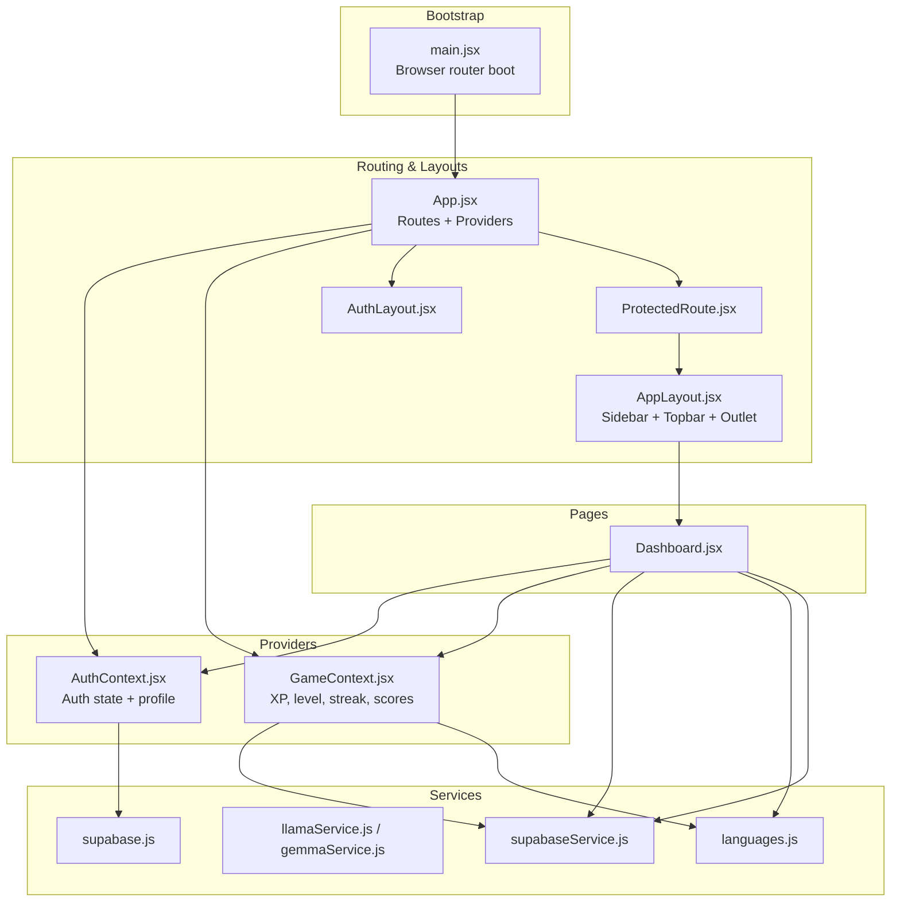
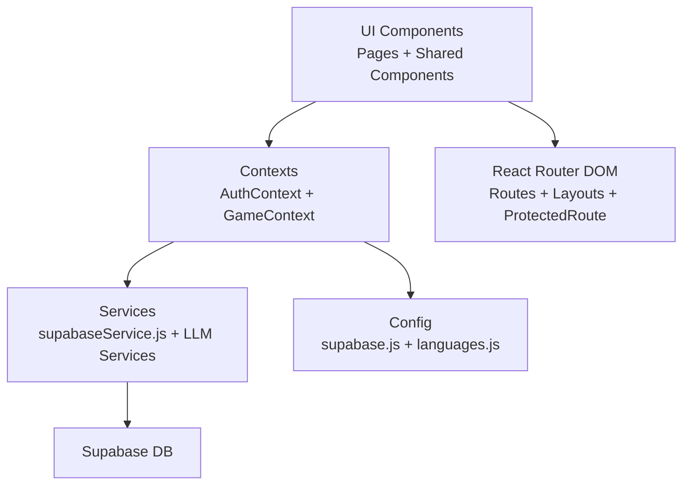
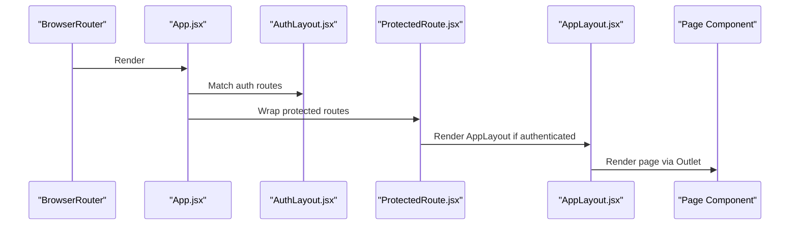
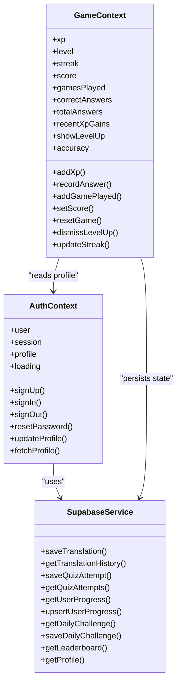
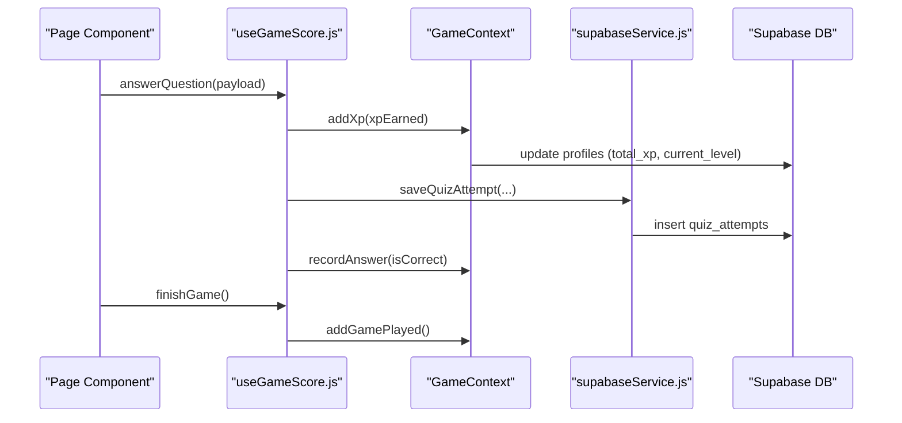
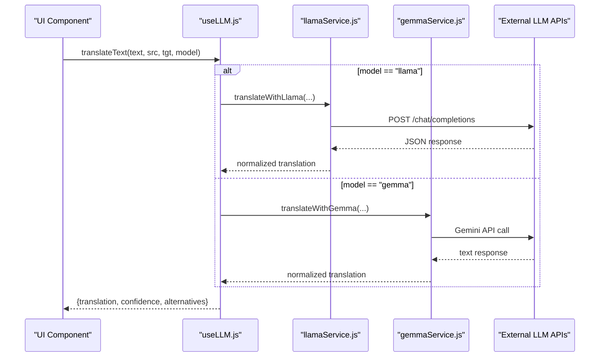
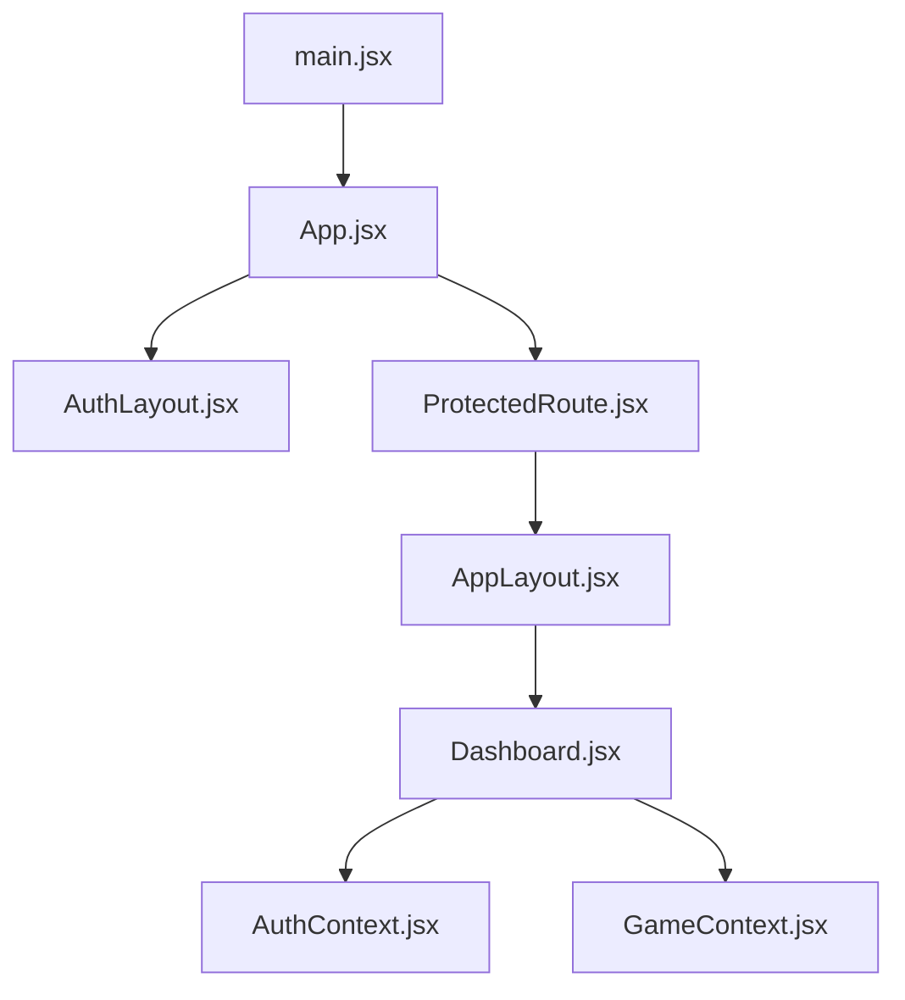
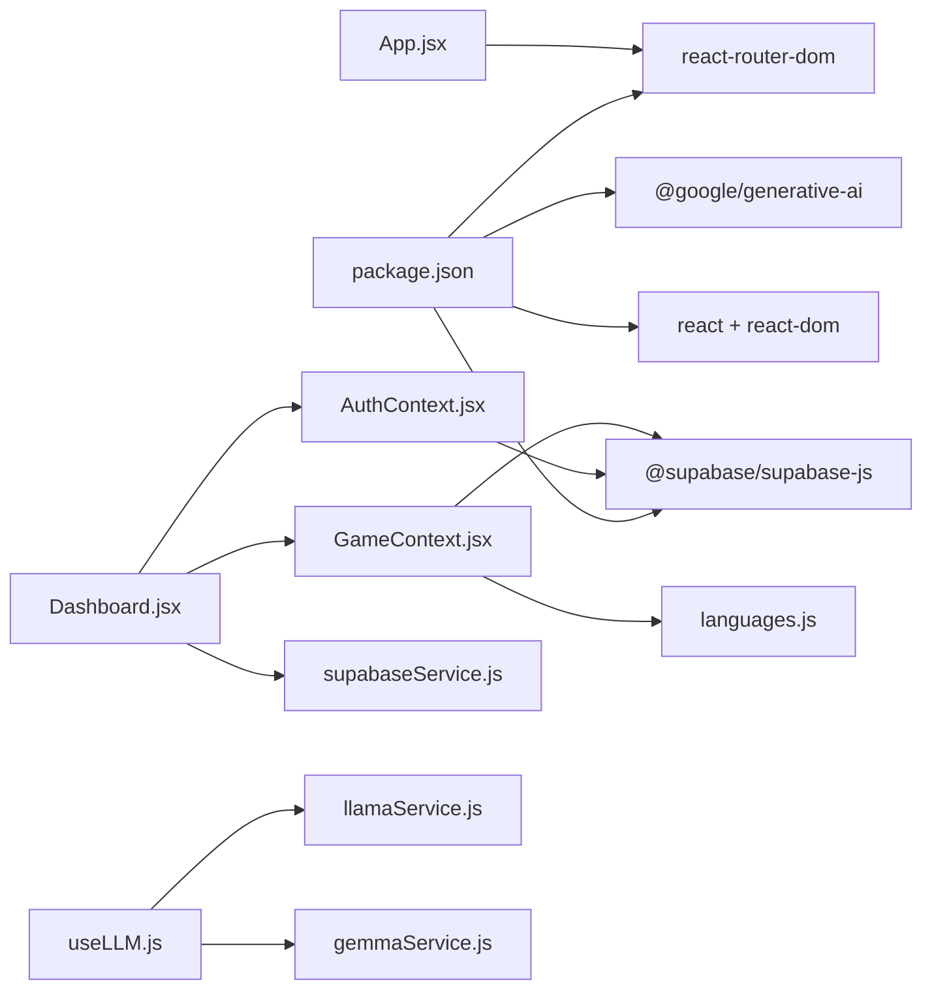

# Architecture Overview

<cite>
**Referenced Files in This Document**
- [main.jsx](file://src/main.jsx)
- [App.jsx](file://src/App.jsx)
- [AuthContext.jsx](file://src/contexts/AuthContext.jsx)
- [GameContext.jsx](file://src/contexts/GameContext.jsx)
- [ProtectedRoute.jsx](file://src/components/ProtectedRoute.jsx)
- [AuthLayout.jsx](file://src/layouts/AuthLayout.jsx)
- [AppLayout.jsx](file://src/layouts/AppLayout.jsx)
- [Dashboard.jsx](file://src/pages/dashboard/Dashboard.jsx)
- [supabaseService.js](file://src/services/supabaseService.js)
- [supabase.js](file://src/config/supabase.js)
- [languages.js](file://src/config/languages.js)
- [useGameScore.js](file://src/hooks/useGameScore.js)
- [useLLM.js](file://src/hooks/useLLM.js)
- [llamaService.js](file://src/services/llamaService.js)
- [gemmaService.js](file://src/services/gemmaService.js)
- [package.json](file://package.json)
</cite>

## Table of Contents
1. [Introduction](#introduction)
2. [Project Structure](#project-structure)
3. [Core Components](#core-components)
4. [Architecture Overview](#architecture-overview)
5. [Detailed Component Analysis](#detailed-component-analysis)
6. [Dependency Analysis](#dependency-analysis)
7. [Performance Considerations](#performance-considerations)
8. [Troubleshooting Guide](#troubleshooting-guide)
9. [Conclusion](#conclusion)

## Introduction
This document describes the system architecture of Flinggo-app, a React-based language learning application. The design emphasizes modern React patterns: Context API for global state, component composition via layout wrappers, and a clean service layer abstraction for data access and third-party integrations. It covers routing with React Router DOM, protected routes, and a provider pattern centered on AuthContext and GameContext. The document also explains data flow from user actions through contexts to services and the database, along with scalability, performance, and maintainability considerations.

## Project Structure
The application follows a feature-oriented structure with clear separation of concerns:
- Root bootstrap initializes the router and renders the App shell.
- App defines routes and wraps content with providers.
- Layouts encapsulate shared UI scaffolding and outlet rendering.
- Pages represent route targets and consume contexts and services.
- Contexts manage cross-cutting state and business logic.
- Services abstract data persistence and external LLM APIs.
- Config holds constants and client initialization.
- Hooks encapsulate reusable logic for gameplay scoring and LLM interactions.

**Diagram sources**
- [main.jsx:1-14](file://src/main.jsx#L1-L14)
- [App.jsx:1-50](file://src/App.jsx#L1-L50)
- [AuthLayout.jsx:1-17](file://src/layouts/AuthLayout.jsx#L1-L17)
- [AppLayout.jsx:1-42](file://src/layouts/AppLayout.jsx#L1-L42)
- [ProtectedRoute.jsx:1-18](file://src/components/ProtectedRoute.jsx#L1-L18)
- [AuthContext.jsx:1-101](file://src/contexts/AuthContext.jsx#L1-L101)
- [GameContext.jsx:1-141](file://src/contexts/GameContext.jsx#L1-L141)
- [Dashboard.jsx:1-151](file://src/pages/dashboard/Dashboard.jsx#L1-L151)
- [supabaseService.js:1-132](file://src/services/supabaseService.js#L1-L132)
- [supabase.js:1-7](file://src/config/supabase.js#L1-L7)
- [languages.js:1-30](file://src/config/languages.js#L1-L30)
- [llamaService.js:1-84](file://src/services/llamaService.js#L1-L84)
- [gemmaService.js:1-56](file://src/services/gemmaService.js#L1-L56)

**Section sources**
- [main.jsx:1-14](file://src/main.jsx#L1-L14)
- [App.jsx:1-50](file://src/App.jsx#L1-L50)

## Core Components
- Bootstrap and Routing
  - The application is bootstrapped inside a Browser router and mounts the App component. App defines nested routes, layout wrappers, and protected routes.
- Provider Pattern
  - AuthProvider manages authentication state, session lifecycle, profile fetching, and auth operations (sign-up, sign-in, sign-out, password reset, profile updates).
  - GameProvider manages learning metrics (XP, level, streak, score, answers), local state transitions via reducer, and persists updates to the database.
- Layout System
  - AuthLayout centers authentication forms and renders child routes.
  - AppLayout provides sidebar, topbar, theme persistence, and outlet rendering for authenticated pages.
- Protected Routes
  - ProtectedRoute checks auth state and either renders children or redirects to login, with a loading spinner during auth state resolution.
- Service Layer Abstraction
  - supabaseService.js centralizes database operations for translations, quizzes, progress, challenges, leaderboard, and profiles.
  - LLM services (llamaService.js, gemmaService.js) encapsulate external API calls behind unified interfaces consumed by hooks.

**Section sources**
- [App.jsx:19-49](file://src/App.jsx#L19-L49)
- [AuthContext.jsx:6-94](file://src/contexts/AuthContext.jsx#L6-L94)
- [GameContext.jsx:57-134](file://src/contexts/GameContext.jsx#L57-L134)
- [AuthLayout.jsx:3-16](file://src/layouts/AuthLayout.jsx#L3-L16)
- [AppLayout.jsx:17-41](file://src/layouts/AppLayout.jsx#L17-L41)
- [ProtectedRoute.jsx:4-17](file://src/components/ProtectedRoute.jsx#L4-L17)
- [supabaseService.js:1-132](file://src/services/supabaseService.js#L1-L132)
- [llamaService.js:1-84](file://src/services/llamaService.js#L1-L84)
- [gemmaService.js:1-56](file://src/services/gemmaService.js#L1-L56)

## Architecture Overview
The architecture applies a layered pattern:
- Presentation Layer: Pages and components render UI and orchestrate user interactions.
- Business Logic Layer: Contexts (AuthContext, GameContext) encapsulate domain logic and state transitions.
- Service Layer: Services abstract data access and external integrations.
- Data Persistence: Supabase client is configured centrally and used by services.

**Diagram sources**
- [App.jsx:1-50](file://src/App.jsx#L1-L50)
- [AuthContext.jsx:1-101](file://src/contexts/AuthContext.jsx#L1-L101)
- [GameContext.jsx:1-141](file://src/contexts/GameContext.jsx#L1-L141)
- [supabaseService.js:1-132](file://src/services/supabaseService.js#L1-L132)
- [supabase.js:1-7](file://src/config/supabase.js#L1-L7)
- [languages.js:1-30](file://src/config/languages.js#L1-L30)

## Detailed Component Analysis

### Routing Architecture and Layout System
- Router Initialization
  - The app is wrapped in a Browser router at the root, enabling declarative routing.
- Route Groups and Layouts
  - Authentication routes are grouped under AuthLayout, ensuring consistent branding and centering.
  - Protected routes are wrapped with ProtectedRoute and rendered inside AppLayout, which provides navigation and theme controls.
- Default Redirect
  - Wildcard routes redirect to the dashboard for graceful fallback.

**Diagram sources**
- [main.jsx:7-13](file://src/main.jsx#L7-L13)
- [App.jsx:25-44](file://src/App.jsx#L25-L44)
- [AuthLayout.jsx:3-16](file://src/layouts/AuthLayout.jsx#L3-L16)
- [ProtectedRoute.jsx:4-17](file://src/components/ProtectedRoute.jsx#L4-L17)
- [AppLayout.jsx:17-41](file://src/layouts/AppLayout.jsx#L17-L41)

**Section sources**
- [main.jsx:1-14](file://src/main.jsx#L1-L14)
- [App.jsx:1-50](file://src/App.jsx#L1-L50)
- [AuthLayout.jsx:1-17](file://src/layouts/AuthLayout.jsx#L1-L17)
- [ProtectedRoute.jsx:1-18](file://src/components/ProtectedRoute.jsx#L1-L18)
- [AppLayout.jsx:1-42](file://src/layouts/AppLayout.jsx#L1-L42)

### Provider Pattern: AuthContext and GameContext
- AuthContext Responsibilities
  - Initializes session, subscribes to auth state changes, loads profile, and exposes auth operations.
  - Provides user, session, profile, loading, and functions for sign-up, sign-in, sign-out, password reset, and profile updates.
- GameContext Responsibilities
  - Manages XP, level, streak, score, and answer statistics.
  - Uses a reducer to compute derived state and persist changes to the database via Supabase.
  - Exposes functions to add XP, record answers, increment games played, set/reset score, update streak, and dismiss level-up notifications.
- Composition and Coupling
  - GameContext depends on AuthContext for user identity and profile data.
  - Both contexts depend on Supabase client initialized in config.

**Diagram sources**
- [AuthContext.jsx:6-94](file://src/contexts/AuthContext.jsx#L6-L94)
- [GameContext.jsx:57-134](file://src/contexts/GameContext.jsx#L57-L134)
- [supabaseService.js:1-132](file://src/services/supabaseService.js#L1-L132)

**Section sources**
- [AuthContext.jsx:1-101](file://src/contexts/AuthContext.jsx#L1-L101)
- [GameContext.jsx:1-141](file://src/contexts/GameContext.jsx#L1-L141)

### Data Flow: From Actions to Services and Database
- Example: Quiz Scoring and Persistence
  - A page component uses a hook to track score and timing.
  - The hook calls context functions to update XP and answer statistics.
  - The hook saves the attempt to the database via a service function.
  - GameContext persists XP and level updates to the database.

**Diagram sources**
- [Dashboard.jsx:1-151](file://src/pages/dashboard/Dashboard.jsx#L1-L151)
- [useGameScore.js:23-55](file://src/hooks/useGameScore.js#L23-L55)
- [GameContext.jsx:76-119](file://src/contexts/GameContext.jsx#L76-L119)
- [supabaseService.js:32-45](file://src/services/supabaseService.js#L32-L45)

**Section sources**
- [Dashboard.jsx:1-151](file://src/pages/dashboard/Dashboard.jsx#L1-L151)
- [useGameScore.js:1-76](file://src/hooks/useGameScore.js#L1-L76)
- [GameContext.jsx:1-141](file://src/contexts/GameContext.jsx#L1-L141)
- [supabaseService.js:1-132](file://src/services/supabaseService.js#L1-L132)

### LLM Integration and Hook Orchestration
- Hook Responsibilities
  - useLLM encapsulates translation operations, exposing loading and error states alongside translation functions.
- Service Abstractions
  - llamaService.js and gemmaService.js wrap external API calls, parsing structured responses and normalizing outputs.
- Usage Pattern
  - Components call useLLM to trigger translations, which internally call service functions and surface errors.

**Diagram sources**
- [useLLM.js:4-37](file://src/hooks/useLLM.js#L4-L37)
- [llamaService.js:14-60](file://src/services/llamaService.js#L14-L60)
- [gemmaService.js:16-44](file://src/services/gemmaService.js#L16-L44)

**Section sources**
- [useLLM.js:1-38](file://src/hooks/useLLM.js#L1-L38)
- [llamaService.js:1-84](file://src/services/llamaService.js#L1-L84)
- [gemmaService.js:1-56](file://src/services/gemmaService.js#L1-L56)

### Component Hierarchy and Composition
- Root
  - main.jsx wraps the app in Browser router and renders App.
- App Shell
  - App.jsx defines routes, groups auth routes under AuthLayout, and protected routes under ProtectedRoute with AppLayout.
- Layouts
  - AuthLayout centers content and renders child routes.
  - AppLayout composes Sidebar, Topbar, theme persistence, and Outlet for page rendering.
- Pages
  - Dashboard.jsx consumes AuthContext and GameContext, queries recent activity via services, and navigates to game pages.

**Diagram sources**
- [main.jsx:1-14](file://src/main.jsx#L1-L14)
- [App.jsx:1-50](file://src/App.jsx#L1-L50)
- [AuthLayout.jsx:1-17](file://src/layouts/AuthLayout.jsx#L1-L17)
- [ProtectedRoute.jsx:1-18](file://src/components/ProtectedRoute.jsx#L1-L18)
- [AppLayout.jsx:1-42](file://src/layouts/AppLayout.jsx#L1-L42)
- [Dashboard.jsx:1-151](file://src/pages/dashboard/Dashboard.jsx#L1-L151)

**Section sources**
- [main.jsx:1-14](file://src/main.jsx#L1-L14)
- [App.jsx:1-50](file://src/App.jsx#L1-L50)
- [AppLayout.jsx:1-42](file://src/layouts/AppLayout.jsx#L1-L42)
- [Dashboard.jsx:1-151](file://src/pages/dashboard/Dashboard.jsx#L1-L151)

## Dependency Analysis
- Internal Dependencies
  - App.jsx depends on AuthProvider, GameProvider, ProtectedRoute, and layout/page components.
  - GameContext depends on AuthContext and Supabase client; uses language constants for XP calculations.
  - Pages depend on contexts and services; hooks depend on contexts and services.
- External Dependencies
  - React Router DOM for routing.
  - @supabase/supabase-js for backend/data access.
  - @google/generative-ai for Gemini API.
  - TailwindCSS/daisyUI for styling.

**Diagram sources**
- [package.json:11-30](file://package.json#L11-L30)
- [App.jsx:1-50](file://src/App.jsx#L1-L50)
- [AuthContext.jsx:1-101](file://src/contexts/AuthContext.jsx#L1-L101)
- [GameContext.jsx:1-141](file://src/contexts/GameContext.jsx#L1-L141)
- [languages.js:1-30](file://src/config/languages.js#L1-L30)
- [Dashboard.jsx:1-151](file://src/pages/dashboard/Dashboard.jsx#L1-L151)
- [supabaseService.js:1-132](file://src/services/supabaseService.js#L1-L132)
- [useLLM.js:1-38](file://src/hooks/useLLM.js#L1-L38)
- [llamaService.js:1-84](file://src/services/llamaService.js#L1-L84)
- [gemmaService.js:1-56](file://src/services/gemmaService.js#L1-L56)

**Section sources**
- [package.json:1-31](file://package.json#L1-L31)
- [App.jsx:1-50](file://src/App.jsx#L1-L50)

## Performance Considerations
- Context Granularity
  - Separate AuthContext and GameContext reduces unnecessary re-renders by scoping state to relevant domains.
- Local State vs Remote State
  - GameContext maintains local state and batches writes to Supabase, minimizing redundant network calls.
- Lazy Loading and Outlet Rendering
  - ProtectedRoute defers rendering until auth state resolves, avoiding partial UI flashes.
- Theme Persistence
  - AppLayout stores theme preference in localStorage to avoid repeated reads and improve UX.
- Recommendations
  - Consider memoizing expensive computations in contexts (e.g., derived stats) and using shallow comparisons to prevent re-renders.
  - Debounce or batch Supabase writes for rapid updates (e.g., streak increments) to reduce API calls.

## Troubleshooting Guide
- Auth State Resolution
  - ProtectedRoute displays a spinner while loading; ensure Supabase auth state change listeners are active and profile fetch completes.
- Missing Context Values
  - useAuth and useGame throw if called outside their respective providers; verify provider wrapping in App.jsx.
- Supabase Errors
  - Auth and Game operations surface errors; check environment variables for Supabase credentials and verify row-level policies.
- LLM API Failures
  - useLLM captures and surfaces error messages; confirm API keys and endpoint availability for Llama/Gemini.
- Navigation Issues
  - Ensure routes are declared under correct layouts and that default redirect points to a valid path.

**Section sources**
- [ProtectedRoute.jsx:4-17](file://src/components/ProtectedRoute.jsx#L4-L17)
- [AuthContext.jsx:96-100](file://src/contexts/AuthContext.jsx#L96-L100)
- [GameContext.jsx:136-140](file://src/contexts/GameContext.jsx#L136-L140)
- [supabase.js:1-7](file://src/config/supabase.js#L1-L7)
- [useLLM.js:8-20](file://src/hooks/useLLM.js#L8-L20)

## Conclusion
Flinggo-app employs a clean, modular architecture leveraging React Router DOM, Context API, and a dedicated service layer. The provider pattern isolates authentication and game state, while layouts and protected routes standardize navigation and access control. The service layer abstracts database and LLM integrations, promoting testability and maintainability. This design supports scalability by enabling incremental feature development, improved performance through selective re-renders and batching, and long-term maintainability via clear boundaries and predictable data flow.