# Authentication System

<cite>
**Referenced Files in This Document**
- [AuthContext.jsx](file://src/contexts/AuthContext.jsx)
- [supabase.js](file://src/config/supabase.js)
- [ProtectedRoute.jsx](file://src/components/ProtectedRoute.jsx)
- [AuthOnlyRoute.jsx](file://src/components/AuthOnlyRoute.jsx)
- [LoginPage.jsx](file://src/pages/auth/LoginPage.jsx)
- [RegisterPage.jsx](file://src/pages/auth/RegisterPage.jsx)
- [ForgotPasswordPage.jsx](file://src/pages/auth/ForgotPasswordPage.jsx)
- [App.jsx](file://src/App.jsx)
- [AuthLayout.jsx](file://src/layouts/AuthLayout.jsx)
- [AppLayout.jsx](file://src/layouts/AppLayout.jsx)
- [Sidebar.jsx](file://src/components/Sidebar.jsx)
- [package.json](file://package.json)
</cite>

## Update Summary
**Changes Made**
- Enhanced AuthContext with automatic profile creation and improved error handling
- Added new AuthOnlyRoute component for additional protection of game pages
- Updated registration workflow to include automatic profile setup on user signup
- Improved fetchProfile function with better error handling and fallback mechanisms
- Enhanced routing structure with dual protection layers for different page types

## Table of Contents
1. [Introduction](#introduction)
2. [Project Structure](#project-structure)
3. [Core Components](#core-components)
4. [Architecture Overview](#architecture-overview)
5. [Detailed Component Analysis](#detailed-component-analysis)
6. [Dependency Analysis](#dependency-analysis)
7. [Performance Considerations](#performance-considerations)
8. [Troubleshooting Guide](#troubleshooting-guide)
9. [Conclusion](#conclusion)

## Introduction
This document explains the Supabase-based authentication system powering the Flinggo application. It covers user registration, login, session management, password reset, protected routes, and state management patterns. The system now features enhanced automatic profile creation, dual-layer protection mechanisms, and improved error handling. It documents how authentication integrates with Supabase services, manages user profiles, and secures application pages through both session-based and route-level protections.

## Project Structure
The authentication system spans several modules with enhanced protection layers:
- Supabase client configuration
- Authentication context provider and hooks with automatic profile management
- Dual protection routing system (ProtectedRoute and AuthOnlyRoute)
- Authentication pages (login, register, forgot password)
- Layouts for auth and app experiences
- Navigation sidebar that responds to auth state

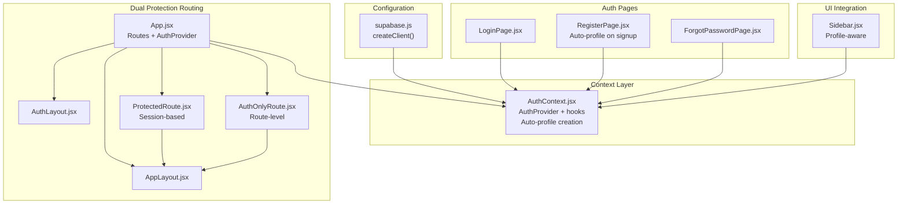

**Diagram sources**
- [supabase.js:1-7](file://src/config/supabase.js#L1-L7)
- [AuthContext.jsx:1-193](file://src/contexts/AuthContext.jsx#L1-L193)
- [App.jsx:1-84](file://src/App.jsx#L1-L84)
- [AuthLayout.jsx:1-17](file://src/layouts/AuthLayout.jsx#L1-L17)
- [AppLayout.jsx:1-42](file://src/layouts/AppLayout.jsx#L1-L42)
- [ProtectedRoute.jsx:1-18](file://src/components/ProtectedRoute.jsx#L1-L18)
- [AuthOnlyRoute.jsx:1-23](file://src/components/AuthOnlyRoute.jsx#L1-L23)
- [LoginPage.jsx:1-87](file://src/pages/auth/LoginPage.jsx#L1-L87)
- [RegisterPage.jsx:1-122](file://src/pages/auth/RegisterPage.jsx#L1-L122)
- [ForgotPasswordPage.jsx:1-72](file://src/pages/auth/ForgotPasswordPage.jsx#L1-L72)
- [Sidebar.jsx:1-130](file://src/components/Sidebar.jsx#L1-L130)

**Section sources**
- [App.jsx:19-84](file://src/App.jsx#L19-L84)
- [AuthContext.jsx:6-193](file://src/contexts/AuthContext.jsx#L6-L193)

## Core Components
- **Supabase client initialization**: Creates a Supabase client using Vite environment variables for URL and anonymous key.
- **Enhanced AuthContext provider**: Centralizes authentication state with automatic profile creation, exposes actions (signUp, signIn, signOut, resetPassword, updateProfile, fetchProfile, refreshProfile), and subscribes to Supabase auth state changes.
- **Dual protection routing**: Two-tier protection system - ProtectedRoute for session-based protection and AuthOnlyRoute for additional route-level security.
- **Enhanced auth pages**: Login, registration, and password reset forms with improved error handling and automatic profile setup.
- **Layouts**: Separate layouts for auth pages and the main app experience with profile-aware navigation.
- **Profile-aware sidebar**: Displays user profile information and provides sign-out action with enhanced user experience.

**Updated** Enhanced with automatic profile creation on user signup and improved error handling throughout the authentication flow.

Key implementation patterns:
- Session persistence via Supabase auth getSession and onAuthStateChange listeners.
- Automatic profile synchronization with fallback creation from the profiles table upon login.
- Controlled form components with local state and async action dispatch.
- Dual protection layers: ProtectedRoute checks session state, AuthOnlyRoute provides additional route-level validation.
- Enhanced error handling with detailed logging and user-friendly error messages.

**Section sources**
- [supabase.js:1-7](file://src/config/supabase.js#L1-L7)
- [AuthContext.jsx:6-193](file://src/contexts/AuthContext.jsx#L6-L193)
- [ProtectedRoute.jsx:1-18](file://src/components/ProtectedRoute.jsx#L1-L18)
- [AuthOnlyRoute.jsx:1-23](file://src/components/AuthOnlyRoute.jsx#L1-L23)
- [LoginPage.jsx:1-87](file://src/pages/auth/LoginPage.jsx#L1-L87)
- [RegisterPage.jsx:1-122](file://src/pages/auth/RegisterPage.jsx#L1-L122)
- [ForgotPasswordPage.jsx:1-72](file://src/pages/auth/ForgotPasswordPage.jsx#L1-L72)
- [Sidebar.jsx:19-34](file://src/components/Sidebar.jsx#L19-L34)

## Architecture Overview
The authentication architecture follows a dual-layer protection pattern:
- Configuration layer initializes the Supabase client.
- Context layer manages auth state with automatic profile creation and exposes enhanced actions.
- Dual routing layer defines both session-based and route-level protected routes.
- UI layer renders auth forms and protected content with profile awareness.
- Supabase backend handles credentials, sessions, password resets, and profile management.

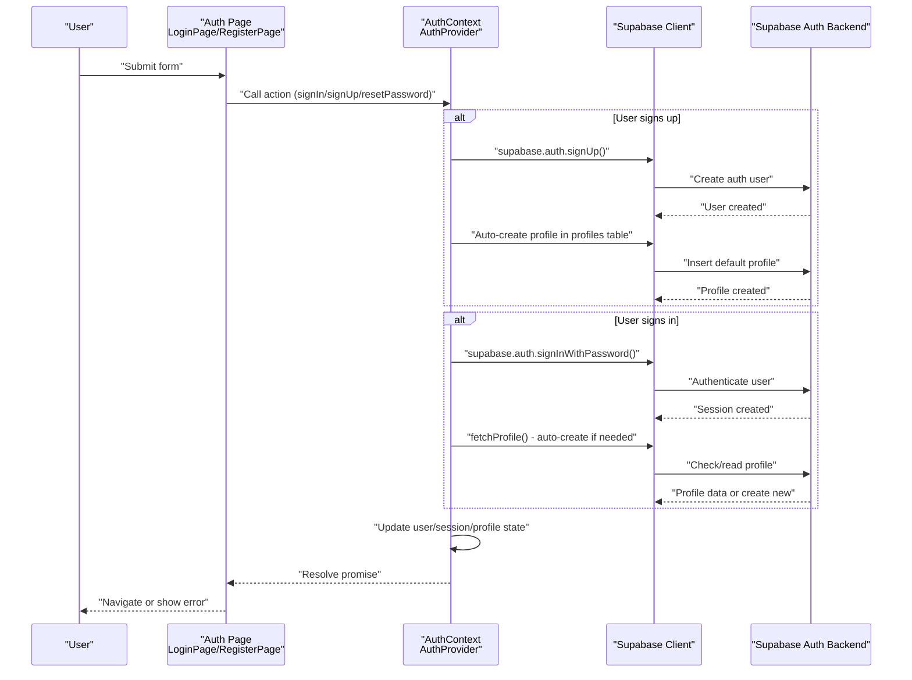

**Diagram sources**
- [LoginPage.jsx:14-26](file://src/pages/auth/LoginPage.jsx#L14-L26)
- [RegisterPage.jsx:17-39](file://src/pages/auth/RegisterPage.jsx#L17-L39)
- [ForgotPasswordPage.jsx:13-25](file://src/pages/auth/ForgotPasswordPage.jsx#L13-L25)
- [AuthContext.jsx:105-140](file://src/contexts/AuthContext.jsx#L105-L140)
- [AuthContext.jsx:13-64](file://src/contexts/AuthContext.jsx#L13-L64)
- [supabase.js:1-7](file://src/config/supabase.js#L1-L7)

## Detailed Component Analysis

### Enhanced AuthContext Provider
AuthContext centralizes authentication logic with automatic profile management:
- Initializes session on mount by calling getSession and subscribing to onAuthStateChange.
- **New**: Enhanced fetchProfile function with automatic profile creation when profiles don't exist.
- **New**: Improved signUp function with guaranteed profile creation and detailed error handling.
- Exposes actions for sign-up, sign-in, sign-out, password reset, profile update, and profile fetch.
- Maintains user, session, profile, and loading state with enhanced error recovery.
- Automatically synchronizes profile data from the profiles table after login with fallback creation.

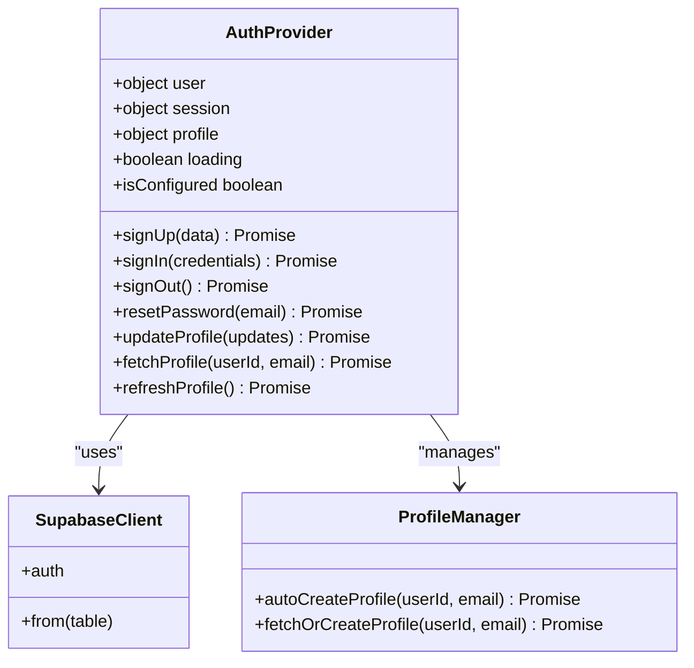

**Diagram sources**
- [AuthContext.jsx:6-193](file://src/contexts/AuthContext.jsx#L6-L193)
- [supabase.js:1-7](file://src/config/supabase.js#L1-L7)

**Section sources**
- [AuthContext.jsx:6-30](file://src/contexts/AuthContext.jsx#L6-L30)
- [AuthContext.jsx:12-64](file://src/contexts/AuthContext.jsx#L12-L64)
- [AuthContext.jsx:105-140](file://src/contexts/AuthContext.jsx#L105-L140)
- [AuthContext.jsx:177-185](file://src/contexts/AuthContext.jsx#L177-L185)

### Dual Protection Routing System
The authentication system now features two distinct protection mechanisms:

**ProtectedRoute**: Session-based protection for general application routes
- Reads user and loading from AuthContext.
- Renders a loading spinner while auth state is being resolved.
- Redirects to login if user is not authenticated.
- Renders children otherwise.

**AuthOnlyRoute**: Additional route-level protection for sensitive game pages
- Uses the same auth state checking as ProtectedRoute.
- Provides enhanced loading states with spinner animations.
- Redirects to login if user is not authenticated.
- Renders children for authenticated users.

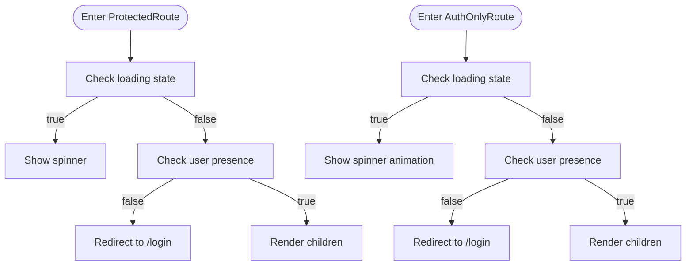

**Diagram sources**
- [ProtectedRoute.jsx:4-17](file://src/components/ProtectedRoute.jsx#L4-L17)
- [AuthOnlyRoute.jsx:9-22](file://src/components/AuthOnlyRoute.jsx#L9-L22)

**Section sources**
- [ProtectedRoute.jsx:1-18](file://src/components/ProtectedRoute.jsx#L1-L18)
- [AuthOnlyRoute.jsx:1-23](file://src/components/AuthOnlyRoute.jsx#L1-L23)

### Enhanced Login Workflow
The login flow with improved error handling:
- Collects email and password in LoginPage.
- Calls signIn from AuthContext with enhanced error handling.
- On success, navigates to the dashboard.
- Handles errors with detailed messages and disables the submit button during loading.

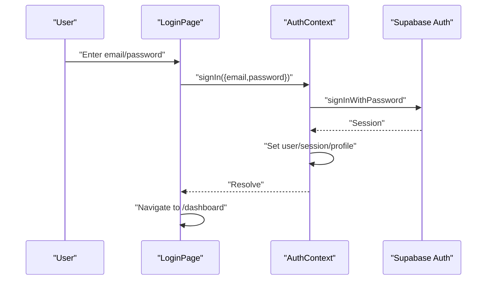

**Diagram sources**
- [LoginPage.jsx:14-26](file://src/pages/auth/LoginPage.jsx#L14-L26)
- [AuthContext.jsx:142-147](file://src/contexts/AuthContext.jsx#L142-L147)

**Section sources**
- [LoginPage.jsx:1-87](file://src/pages/auth/LoginPage.jsx#L1-L87)
- [AuthContext.jsx:142-147](file://src/contexts/AuthContext.jsx#L142-L147)

### Enhanced Registration Workflow
The registration flow with automatic profile creation:
- Validates password length and confirmation match in RegisterPage.
- **New**: Enhanced signUp function automatically creates a default profile row in the profiles table.
- **New**: Improved error handling with detailed messages for both auth and profile creation failures.
- Navigates to dashboard on successful registration with automatic profile setup.

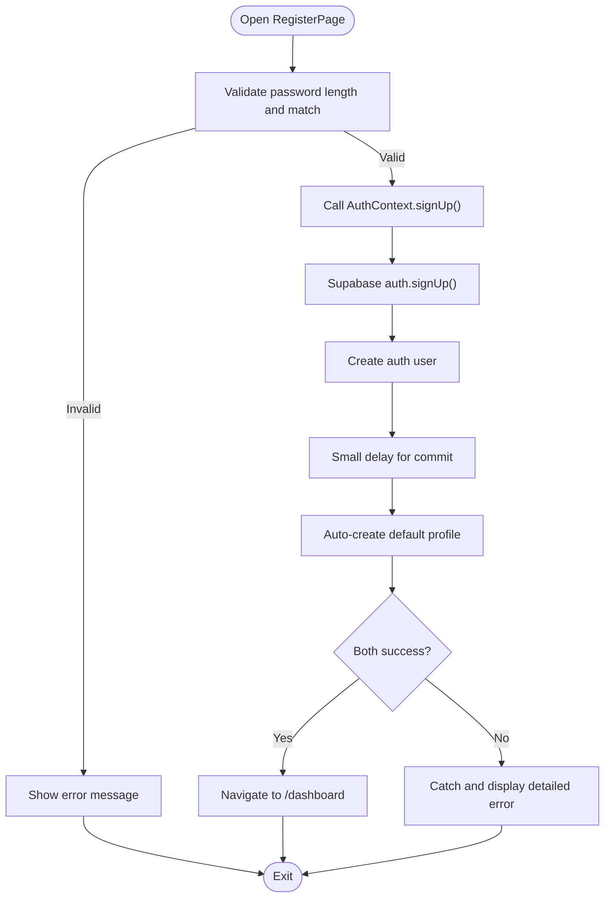

**Diagram sources**
- [RegisterPage.jsx:17-39](file://src/pages/auth/RegisterPage.jsx#L17-L39)
- [AuthContext.jsx:105-140](file://src/contexts/AuthContext.jsx#L105-L140)
- [AuthContext.jsx:13-64](file://src/contexts/AuthContext.jsx#L13-L64)

**Section sources**
- [RegisterPage.jsx:1-122](file://src/pages/auth/RegisterPage.jsx#L1-L122)
- [AuthContext.jsx:105-140](file://src/contexts/AuthContext.jsx#L105-L140)
- [AuthContext.jsx:13-64](file://src/contexts/AuthContext.jsx#L13-L64)

### Enhanced Password Reset Workflow
The password reset flow with improved user experience:
- Collects the user's email in ForgotPasswordPage.
- Calls resetPassword from AuthContext with enhanced error handling.
- Shows success message prompting the user to check their email.
- Provides clear feedback for both success and error states.

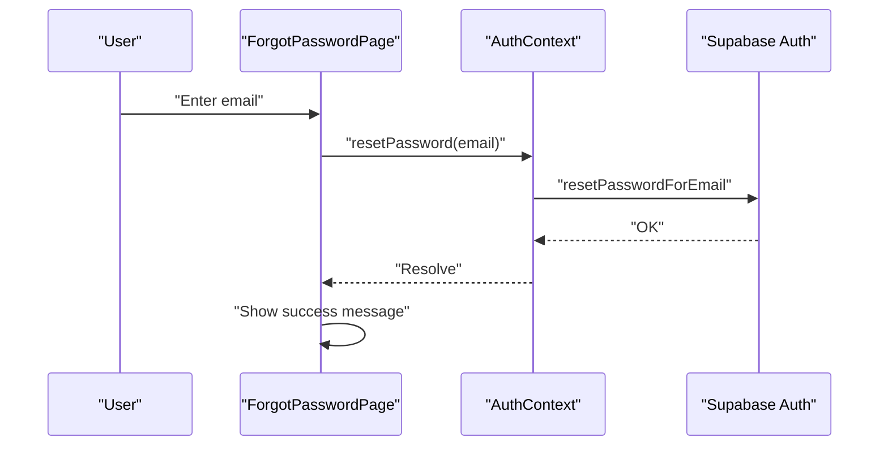

**Diagram sources**
- [ForgotPasswordPage.jsx:13-25](file://src/pages/auth/ForgotPasswordPage.jsx#L13-L25)
- [AuthContext.jsx:155-159](file://src/contexts/AuthContext.jsx#L155-L159)

**Section sources**
- [ForgotPasswordPage.jsx:1-72](file://src/pages/auth/ForgotPasswordPage.jsx#L1-L72)
- [AuthContext.jsx:155-159](file://src/contexts/AuthContext.jsx#L155-L159)

### Enhanced Session Management and Profile Sync
Enhanced session lifecycle with automatic profile management:
- On mount, retrieves the current session and sets user/session/profile accordingly.
- Subscribes to auth state changes to keep state synchronized.
- **New**: Enhanced fetchProfile function automatically creates profiles if they don't exist.
- **New**: Improved error handling with detailed logging and fallback mechanisms.
- Clears profile and stops loading when user logs out.

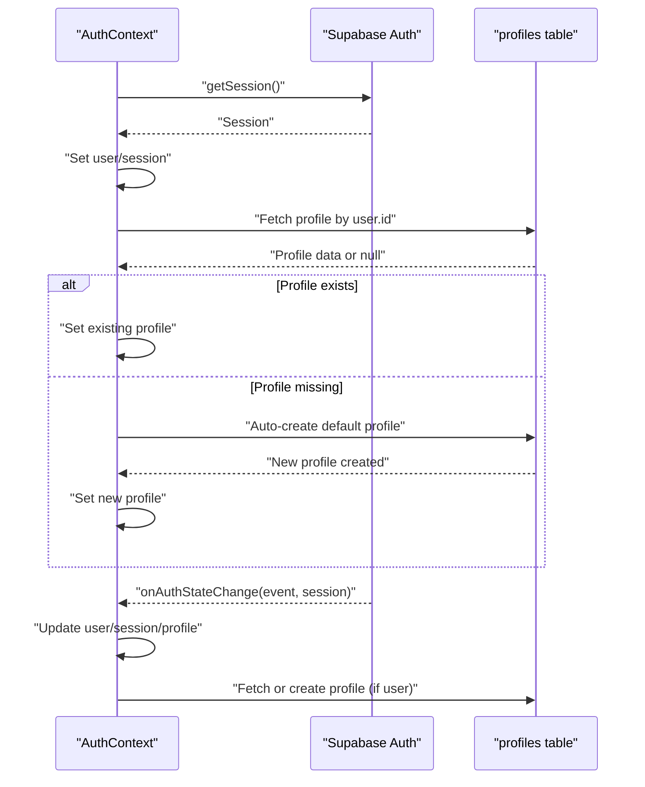

**Diagram sources**
- [AuthContext.jsx:66-103](file://src/contexts/AuthContext.jsx#L66-L103)
- [AuthContext.jsx:12-64](file://src/contexts/AuthContext.jsx#L12-L64)

**Section sources**
- [AuthContext.jsx:66-103](file://src/contexts/AuthContext.jsx#L66-L103)
- [AuthContext.jsx:12-64](file://src/contexts/AuthContext.jsx#L12-L64)

### Enhanced Protected Route Mechanism
Enhanced routing integration with dual protection layers:
- Public auth routes are wrapped in AuthLayout.
- General application routes are wrapped in ProtectedRoute with AppLayout.
- **New**: Game pages are wrapped in AuthOnlyRoute for additional protection.
- Unauthenticated users are redirected to login; authenticated users see protected content.
- **New**: Enhanced loading states with spinner animations for better user experience.

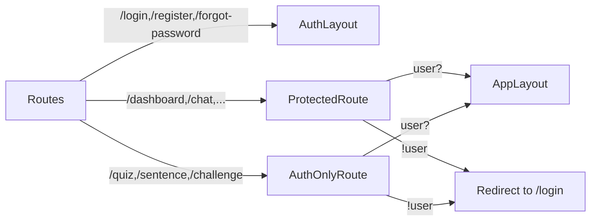

**Diagram sources**
- [App.jsx:44-75](file://src/App.jsx#L44-L75)
- [ProtectedRoute.jsx:4-17](file://src/components/ProtectedRoute.jsx#L4-L17)
- [AuthOnlyRoute.jsx:9-22](file://src/components/AuthOnlyRoute.jsx#L9-L22)
- [AuthLayout.jsx:3-16](file://src/layouts/AuthLayout.jsx#L3-L16)
- [AppLayout.jsx:17-41](file://src/layouts/AppLayout.jsx#L17-L41)

**Section sources**
- [App.jsx:19-84](file://src/App.jsx#L19-L84)
- [ProtectedRoute.jsx:1-18](file://src/components/ProtectedRoute.jsx#L1-L18)
- [AuthOnlyRoute.jsx:1-23](file://src/components/AuthOnlyRoute.jsx#L1-L23)

### Enhanced Sign-Out and Automatic Logout
Enhanced sign-out behavior with improved user experience:
- Calls signOut on AuthContext, which delegates to Supabase auth.
- **New**: Enhanced error handling with detailed logging.
- Sidebar triggers sign-out and navigates to login with improved user feedback.

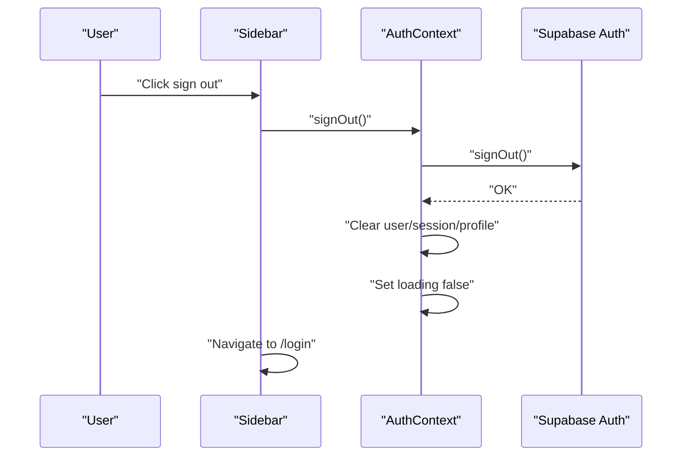

**Diagram sources**
- [Sidebar.jsx:31-34](file://src/components/Sidebar.jsx#L31-L34)
- [AuthContext.jsx:149-153](file://src/contexts/AuthContext.jsx#L149-L153)

**Section sources**
- [Sidebar.jsx:19-34](file://src/components/Sidebar.jsx#L19-L34)
- [AuthContext.jsx:149-153](file://src/contexts/AuthContext.jsx#L149-L153)

## Dependency Analysis
External dependencies and integrations remain largely unchanged:
- Supabase client library for authentication and database operations.
- React Router DOM for routing and navigation.
- Environment variables for Supabase URL and anonymous key.

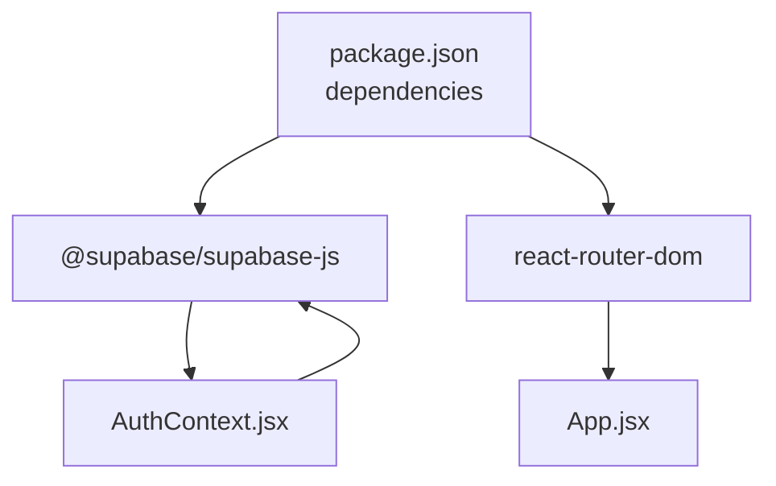

**Diagram sources**
- [package.json:11-21](file://package.json#L11-L21)
- [AuthContext.jsx:1-2](file://src/contexts/AuthContext.jsx#L1-L2)
- [App.jsx:1-6](file://src/App.jsx#L1-L6)

**Section sources**
- [package.json:11-21](file://package.json#L11-L21)
- [supabase.js:1-7](file://src/config/supabase.js#L1-L7)

## Performance Considerations
- Minimize unnecessary re-renders by keeping auth state granular and avoiding heavy computations in AuthContext.
- **New**: Enhanced fetchProfile function uses useCallback to prevent unnecessary re-creations.
- Debounce or throttle repeated auth state changes if needed.
- Use loading states to prevent redundant submissions during network requests.
- **New**: Enhanced error handling reduces unnecessary retries and improves user experience.
- Keep profile queries efficient by selecting only required fields from the profiles table.
- **New**: Automatic profile creation reduces subsequent fetchProfile calls by eliminating missing profile scenarios.

## Troubleshooting Guide
Common issues and enhanced resolutions:
- **Environment variables not loaded**: Ensure VITE_SUPABASE_URL and VITE_SUPABASE_ANON_KEY are set in the runtime environment.
- **Initial session not detected**: Verify that getSession resolves and that onAuthStateChange fires after login.
- **Profile not fetched**: **New**: Check that the profiles table exists and contains a row for the logged-in user ID, or rely on automatic creation.
- **Navigation loops after login**: Check ProtectedRoute and AuthOnlyRoute logic and ensure user state is properly set before navigation.
- **Password reset email not sent**: Validate that the email address is correct and that Supabase email settings are configured.
- **New**: **Profile creation fails**: Verify that the "Users can insert own profile" policy is correctly configured in Supabase.
- **New**: **Automatic profile creation not working**: Check that the fetchProfile function receives the correct user ID and email parameters.
- **New**: **Enhanced error messages**: Review console logs for detailed error information including "[Auth]" prefixed messages.

Security considerations:
- Enforce minimum password length and strong password policies at the UI and Supabase level.
- Use HTTPS in production to protect tokens and cookies.
- Avoid logging sensitive data such as tokens or passwords.
- Regularly review Supabase authentication and authorization policies.
- **New**: Implement rate limiting for authentication attempts to prevent abuse.

User experience patterns:
- Provide clear feedback for loading states and errors with enhanced messaging.
- **New**: Automatic profile creation eliminates the need for manual profile setup steps.
- Persist user preferences (e.g., theme) locally to improve continuity.
- Offer contextual help and links (e.g., "Forgot password?") to reduce friction.
- **New**: Enhanced loading states with spinner animations improve perceived performance.

## Conclusion
The enhanced authentication system leverages Supabase for secure user management, session persistence, and password reset workflows with automatic profile creation. The dual protection mechanism (ProtectedRoute and AuthOnlyRoute) provides robust security for different page types. AuthContext centralizes state and actions with improved error handling, while enhanced routing ensures both session-based and route-level protection. The automatic profile creation feature streamlines the user experience by eliminating manual profile setup requirements. By following the documented patterns and troubleshooting steps, developers can extend the system with additional features such as multi-factor authentication, custom claims, or advanced profile management while maintaining security and usability.