# Authentication System

<cite>
**Referenced Files in This Document**
- [AuthContext.jsx](file://src/contexts/AuthContext.jsx)
- [supabase.js](file://src/config/supabase.js)
- [ProtectedRoute.jsx](file://src/components/ProtectedRoute.jsx)
- [LoginPage.jsx](file://src/pages/auth/LoginPage.jsx)
- [RegisterPage.jsx](file://src/pages/auth/RegisterPage.jsx)
- [ForgotPasswordPage.jsx](file://src/pages/auth/ForgotPasswordPage.jsx)
- [App.jsx](file://src/App.jsx)
- [AuthLayout.jsx](file://src/layouts/AuthLayout.jsx)
- [AppLayout.jsx](file://src/layouts/AppLayout.jsx)
- [Sidebar.jsx](file://src/components/Sidebar.jsx)
- [package.json](file://package.json)
</cite>

## Table of Contents
1. [Introduction](#introduction)
2. [Project Structure](#project-structure)
3. [Core Components](#core-components)
4. [Architecture Overview](#architecture-overview)
5. [Detailed Component Analysis](#detailed-component-analysis)
6. [Dependency Analysis](#dependency-analysis)
7. [Performance Considerations](#performance-considerations)
8. [Troubleshooting Guide](#troubleshooting-guide)
9. [Conclusion](#conclusion)

## Introduction
This document explains the Supabase-based authentication system powering the Flinggo application. It covers user registration, login, session management, password reset, protected routes, and state management patterns. It also documents how authentication integrates with Supabase services, manages user profiles, and secures application pages. The goal is to help developers understand the authentication flow from user input to state updates and to provide guidance for extending and troubleshooting the system.

## Project Structure
The authentication system spans several modules:
- Supabase client configuration
- Authentication context provider and hooks
- Public and protected route definitions
- Authentication pages (login, register, forgot password)
- Layouts for auth and app experiences
- Protected route wrapper component
- Navigation sidebar that responds to auth state

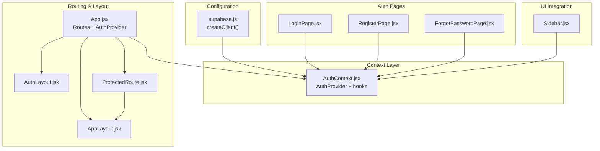

**Diagram sources**
- [supabase.js:1-7](file://src/config/supabase.js#L1-L7)
- [AuthContext.jsx:1-101](file://src/contexts/AuthContext.jsx#L1-L101)
- [App.jsx:1-50](file://src/App.jsx#L1-L50)
- [AuthLayout.jsx:1-17](file://src/layouts/AuthLayout.jsx#L1-L17)
- [AppLayout.jsx:1-42](file://src/layouts/AppLayout.jsx#L1-L42)
- [ProtectedRoute.jsx:1-18](file://src/components/ProtectedRoute.jsx#L1-L18)
- [LoginPage.jsx:1-80](file://src/pages/auth/LoginPage.jsx#L1-L80)
- [RegisterPage.jsx:1-115](file://src/pages/auth/RegisterPage.jsx#L1-L115)
- [ForgotPasswordPage.jsx:1-71](file://src/pages/auth/ForgotPasswordPage.jsx#L1-L71)
- [Sidebar.jsx:1-122](file://src/components/Sidebar.jsx#L1-L122)

**Section sources**
- [App.jsx:19-49](file://src/App.jsx#L19-L49)
- [AuthContext.jsx:6-30](file://src/contexts/AuthContext.jsx#L6-L30)

## Core Components
- Supabase client initialization: Creates a Supabase client using Vite environment variables for URL and anonymous key.
- AuthContext provider: Centralizes authentication state (user, session, profile, loading), exposes actions (signUp, signIn, signOut, resetPassword, updateProfile, fetchProfile), and subscribes to Supabase auth state changes.
- ProtectedRoute: Guards application routes by checking authentication state and redirecting unauthenticated users.
- Auth pages: Login, registration, and password reset forms wired to AuthContext actions.
- Layouts: Separate layouts for auth pages and the main app experience.
- Sidebar: Displays user profile information and provides sign-out action.

Key implementation patterns:
- Session persistence via Supabase auth getSession and onAuthStateChange listeners.
- Profile synchronization by fetching from the profiles table upon login.
- Controlled form components with local state and async action dispatch.
- ProtectedRoute renders a spinner while resolving initial auth state, then either renders children or redirects.

**Section sources**
- [supabase.js:1-7](file://src/config/supabase.js#L1-L7)
- [AuthContext.jsx:6-101](file://src/contexts/AuthContext.jsx#L6-L101)
- [ProtectedRoute.jsx:1-18](file://src/components/ProtectedRoute.jsx#L1-L18)
- [LoginPage.jsx:1-80](file://src/pages/auth/LoginPage.jsx#L1-L80)
- [RegisterPage.jsx:1-115](file://src/pages/auth/RegisterPage.jsx#L1-L115)
- [ForgotPasswordPage.jsx:1-71](file://src/pages/auth/ForgotPasswordPage.jsx#L1-L71)
- [Sidebar.jsx:19-34](file://src/components/Sidebar.jsx#L19-L34)

## Architecture Overview
The authentication architecture follows a layered pattern:
- Configuration layer initializes the Supabase client.
- Context layer manages auth state and exposes actions.
- Routing layer defines public and protected routes.
- UI layer renders auth forms and protected content.
- Supabase backend handles credentials, sessions, and password resets.

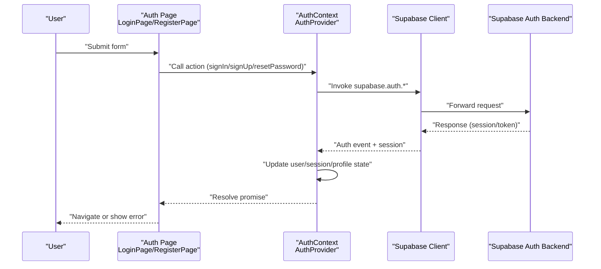

**Diagram sources**
- [LoginPage.jsx:13-25](file://src/pages/auth/LoginPage.jsx#L13-L25)
- [RegisterPage.jsx:16-38](file://src/pages/auth/RegisterPage.jsx#L16-L38)
- [ForgotPasswordPage.jsx:12-24](file://src/pages/auth/ForgotPasswordPage.jsx#L12-L24)
- [AuthContext.jsx:42-84](file://src/contexts/AuthContext.jsx#L42-L84)
- [supabase.js:1-7](file://src/config/supabase.js#L1-L7)

## Detailed Component Analysis

### AuthContext Provider
AuthContext centralizes authentication logic:
- Initializes session on mount by calling getSession and subscribing to onAuthStateChange.
- Exposes actions for sign-up, sign-in, sign-out, password reset, profile update, and profile fetch.
- Maintains user, session, profile, and loading state.
- Automatically synchronizes profile data from the profiles table after login.

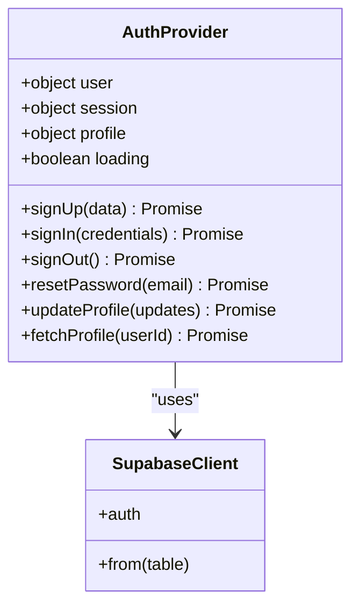

**Diagram sources**
- [AuthContext.jsx:6-101](file://src/contexts/AuthContext.jsx#L6-L101)
- [supabase.js:1-7](file://src/config/supabase.js#L1-L7)

**Section sources**
- [AuthContext.jsx:6-30](file://src/contexts/AuthContext.jsx#L6-L30)
- [AuthContext.jsx:32-40](file://src/contexts/AuthContext.jsx#L32-L40)
- [AuthContext.jsx:42-84](file://src/contexts/AuthContext.jsx#L42-L84)

### ProtectedRoute Component
ProtectedRoute enforces authentication for application routes:
- Reads user and loading from AuthContext.
- Renders a loading spinner while auth state is being resolved.
- Redirects to login if user is not authenticated.
- Renders children otherwise.

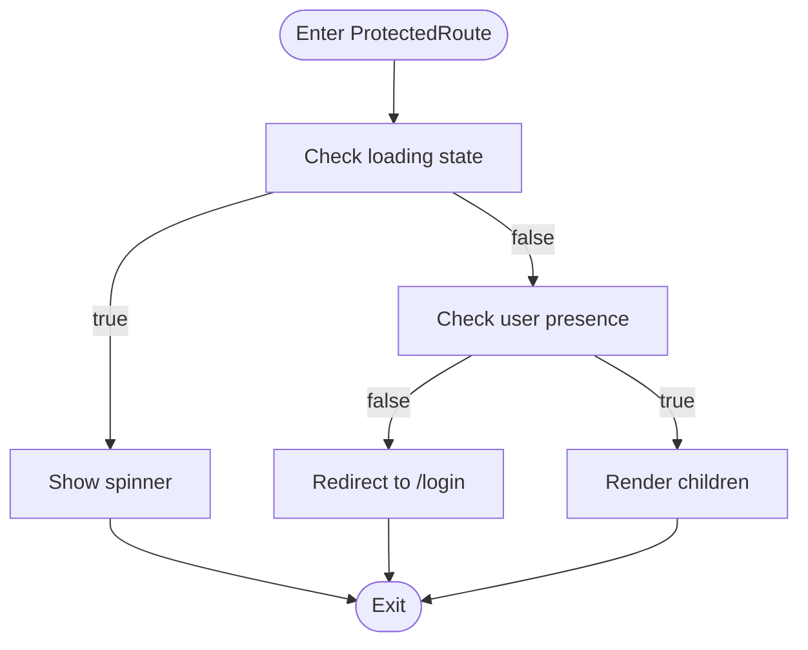

**Diagram sources**
- [ProtectedRoute.jsx:4-17](file://src/components/ProtectedRoute.jsx#L4-L17)

**Section sources**
- [ProtectedRoute.jsx:1-18](file://src/components/ProtectedRoute.jsx#L1-L18)

### Login Workflow
The login flow:
- Collects email and password in LoginPage.
- Calls signIn from AuthContext.
- On success, navigates to the dashboard.
- Handles errors and disables the submit button during loading.

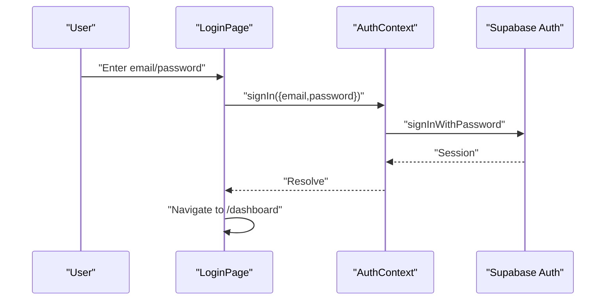

**Diagram sources**
- [LoginPage.jsx:13-25](file://src/pages/auth/LoginPage.jsx#L13-L25)
- [AuthContext.jsx:58-62](file://src/contexts/AuthContext.jsx#L58-L62)

**Section sources**
- [LoginPage.jsx:1-80](file://src/pages/auth/LoginPage.jsx#L1-L80)
- [AuthContext.jsx:58-62](file://src/contexts/AuthContext.jsx#L58-L62)

### Registration Workflow
The registration flow:
- Validates password length and confirmation match in RegisterPage.
- Calls signUp from AuthContext, which creates a user and inserts a default profile row.
- Navigates to login with a success indicator.

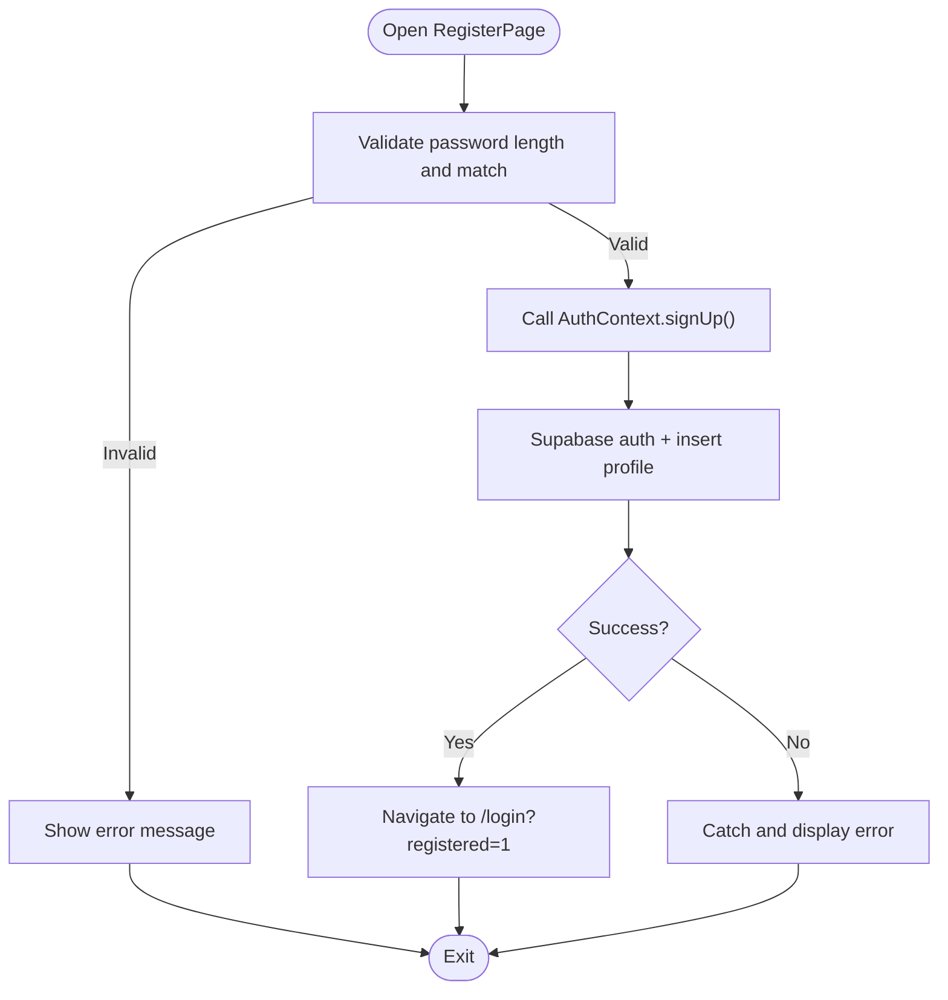

**Diagram sources**
- [RegisterPage.jsx:16-38](file://src/pages/auth/RegisterPage.jsx#L16-L38)
- [AuthContext.jsx:42-56](file://src/contexts/AuthContext.jsx#L42-L56)

**Section sources**
- [RegisterPage.jsx:1-115](file://src/pages/auth/RegisterPage.jsx#L1-L115)
- [AuthContext.jsx:42-56](file://src/contexts/AuthContext.jsx#L42-L56)

### Password Reset Workflow
The password reset flow:
- Collects the user's email in ForgotPasswordPage.
- Calls resetPassword from AuthContext.
- Shows a success message prompting the user to check their email.

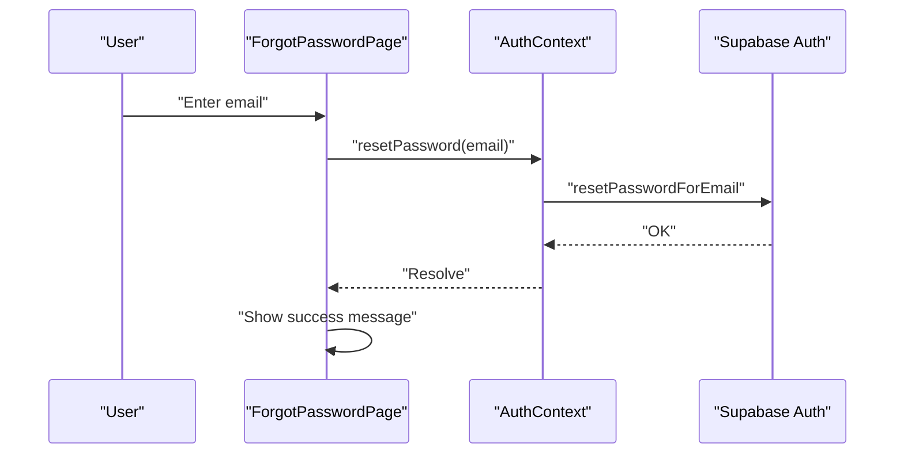

**Diagram sources**
- [ForgotPasswordPage.jsx:12-24](file://src/pages/auth/ForgotPasswordPage.jsx#L12-L24)
- [AuthContext.jsx:69-72](file://src/contexts/AuthContext.jsx#L69-L72)

**Section sources**
- [ForgotPasswordPage.jsx:1-71](file://src/pages/auth/ForgotPasswordPage.jsx#L1-L71)
- [AuthContext.jsx:69-72](file://src/contexts/AuthContext.jsx#L69-L72)

### Session Management and Profile Sync
Session lifecycle:
- On mount, retrieves the current session and sets user/session/profile accordingly.
- Subscribes to auth state changes to keep state synchronized.
- Fetches profile data from the profiles table when a user is present.
- Clears profile and stops loading when user logs out.

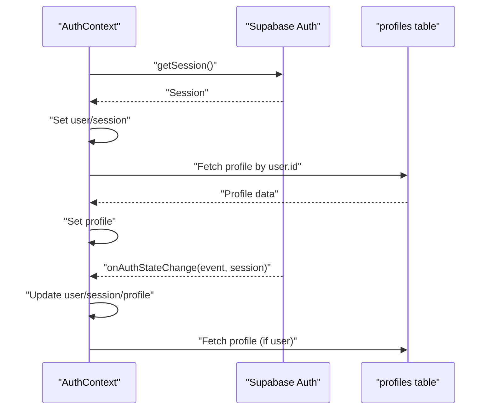

**Diagram sources**
- [AuthContext.jsx:12-30](file://src/contexts/AuthContext.jsx#L12-L30)
- [AuthContext.jsx:32-40](file://src/contexts/AuthContext.jsx#L32-L40)

**Section sources**
- [AuthContext.jsx:12-40](file://src/contexts/AuthContext.jsx#L12-L40)

### Protected Route Mechanism
Routing integration:
- Public auth routes are wrapped in AuthLayout.
- Application routes are wrapped in ProtectedRoute with AppLayout.
- Unauthenticated users are redirected to login; authenticated users see protected content.

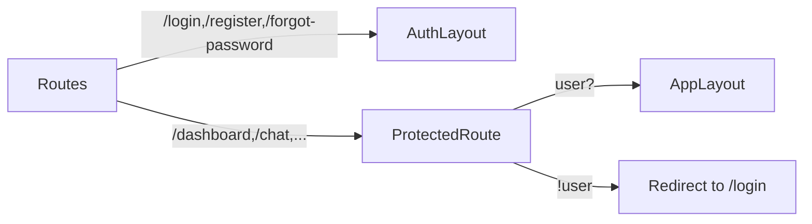

**Diagram sources**
- [App.jsx:24-41](file://src/App.jsx#L24-L41)
- [ProtectedRoute.jsx:4-17](file://src/components/ProtectedRoute.jsx#L4-L17)
- [AuthLayout.jsx:3-16](file://src/layouts/AuthLayout.jsx#L3-L16)
- [AppLayout.jsx:17-41](file://src/layouts/AppLayout.jsx#L17-L41)

**Section sources**
- [App.jsx:19-49](file://src/App.jsx#L19-L49)
- [ProtectedRoute.jsx:1-18](file://src/components/ProtectedRoute.jsx#L1-L18)

### Sign-Out and Automatic Logout
Sign-out behavior:
- Calls signOut on AuthContext, which delegates to Supabase auth.
- Sidebar triggers sign-out and navigates to login.

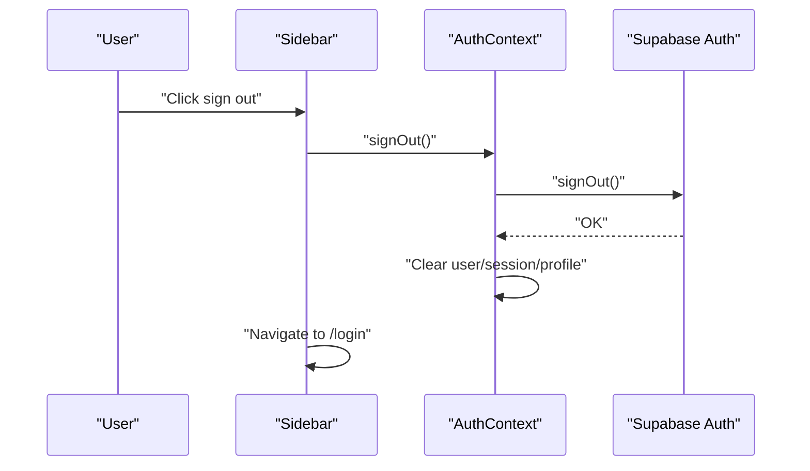

**Diagram sources**
- [Sidebar.jsx:31-34](file://src/components/Sidebar.jsx#L31-L34)
- [AuthContext.jsx:64-67](file://src/contexts/AuthContext.jsx#L64-L67)

**Section sources**
- [Sidebar.jsx:19-34](file://src/components/Sidebar.jsx#L19-L34)
- [AuthContext.jsx:64-67](file://src/contexts/AuthContext.jsx#L64-L67)

## Dependency Analysis
External dependencies and integrations:
- Supabase client library for authentication and database operations.
- React Router DOM for routing and navigation.
- Environment variables for Supabase URL and anonymous key.

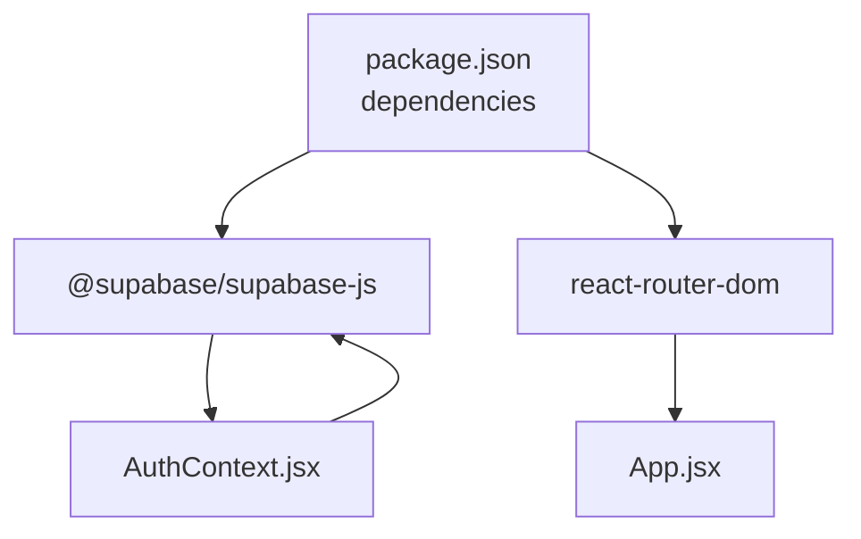

**Diagram sources**
- [package.json:11-21](file://package.json#L11-L21)
- [AuthContext.jsx:1-2](file://src/contexts/AuthContext.jsx#L1-L2)
- [App.jsx:1-6](file://src/App.jsx#L1-L6)

**Section sources**
- [package.json:11-21](file://package.json#L11-L21)
- [supabase.js:1-7](file://src/config/supabase.js#L1-L7)

## Performance Considerations
- Minimize unnecessary re-renders by keeping auth state granular and avoiding heavy computations in AuthContext.
- Debounce or throttle repeated auth state changes if needed.
- Use loading states to prevent redundant submissions during network requests.
- Keep profile queries efficient by selecting only required fields from the profiles table.

## Troubleshooting Guide
Common issues and resolutions:
- Environment variables not loaded: Ensure VITE_SUPABASE_URL and VITE_SUPABASE_ANON_KEY are set in the runtime environment.
- Initial session not detected: Verify that getSession resolves and that onAuthStateChange fires after login.
- Profile not fetched: Confirm that the profiles table exists and contains a row for the logged-in user ID.
- Navigation loops after login: Check ProtectedRoute logic and ensure user state is properly set before navigation.
- Password reset email not sent: Validate that the email address is correct and that Supabase email settings are configured.

Security considerations:
- Enforce minimum password length and strong password policies at the UI and Supabase level.
- Use HTTPS in production to protect tokens and cookies.
- Avoid logging sensitive data such as tokens or passwords.
- Regularly review Supabase authentication and authorization policies.

User experience patterns:
- Provide clear feedback for loading states and errors.
- Persist user preferences (e.g., theme) locally to improve continuity.
- Offer contextual help and links (e.g., "Forgot password?") to reduce friction.

## Conclusion
The authentication system leverages Supabase for secure user management, session persistence, and password reset workflows. AuthContext centralizes state and actions, ProtectedRoute enforces access control, and auth pages provide a seamless user experience. By following the documented patterns and troubleshooting steps, developers can extend the system with additional features such as multi-factor authentication, custom claims, or advanced profile management while maintaining security and usability.