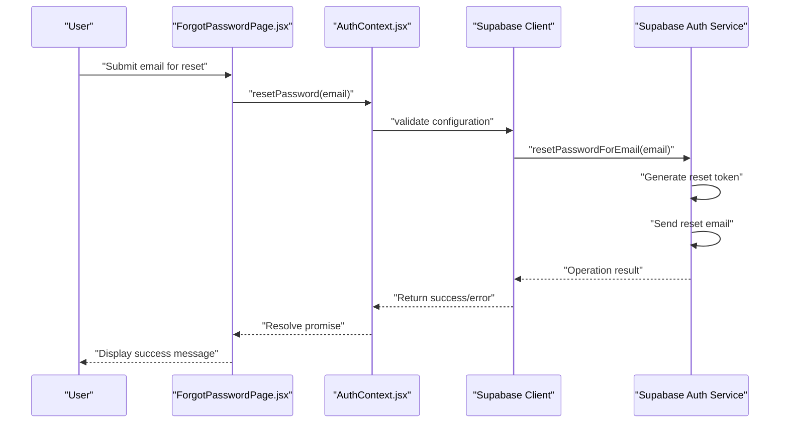

# Password Reset

<cite>
**Referenced Files in This Document**
- [ForgotPasswordPage.jsx](file://src/pages/auth/ForgotPasswordPage.jsx)
- [AuthContext.jsx](file://src/contexts/AuthContext.jsx)
- [supabase.js](file://src/config/supabase.js)
- [App.jsx](file://src/App.jsx)
- [AuthLayout.jsx](file://src/layouts/AuthLayout.jsx)
- [LoginPage.jsx](file://src/pages/auth/LoginPage.jsx)
- [supabaseService.js](file://src/services/supabaseService.js)
- [package.json](file://package.json)
</cite>

## Update Summary
**Changes Made**
- Updated implementation details to reflect the current Supabase authentication-based password reset workflow
- Enhanced security considerations section with specific Supabase configurations
- Added comprehensive troubleshooting guidance for common password reset scenarios
- Expanded user experience patterns documentation with practical examples
- Updated dependency analysis to reflect current package.json structure

## Table of Contents
1. [Introduction](#introduction)
2. [Project Structure](#project-structure)
3. [Core Components](#core-components)
4. [Architecture Overview](#architecture-overview)
5. [Detailed Component Analysis](#detailed-component-analysis)
6. [Dependency Analysis](#dependency-analysis)
7. [Performance Considerations](#performance-considerations)
8. [Security Considerations](#security-considerations)
9. [Troubleshooting Guide](#troubleshooting-guide)
10. [User Experience Patterns](#user-experience-patterns)
11. [Conclusion](#conclusion)

## Introduction
This document provides comprehensive documentation for the password reset functionality implemented in the Flinggo application using Supabase authentication. The system enables users to reset their passwords through a secure email-based workflow, leveraging Supabase's built-in authentication capabilities for token generation, email delivery, and security management.

The password reset feature consists of a dedicated forgot password page that captures user email addresses, delegates the reset request to the authentication context, and provides immediate user feedback. Supabase handles the complete backend processing including email template customization, token lifecycle management, and rate limiting enforcement.

## Project Structure
The password reset feature is integrated into the application's authentication system with the following key components:

- **Frontend Page**: ForgotPasswordPage.jsx renders the reset form and manages user interactions
- **Authentication Context**: AuthContext.jsx provides the resetPassword function using Supabase's authentication API
- **Supabase Configuration**: supabase.js initializes the Supabase client with environment-based configuration
- **Routing Infrastructure**: App.jsx and AuthLayout.jsx provide the routing framework for authentication pages
- **Navigation Integration**: LoginPage.jsx includes the forgot password link for seamless user flow

```mermaid
graph TB
subgraph "Application Layer"
APP["App.jsx<br/>Main routing configuration"]
AUTHLAYOUT["AuthLayout.jsx<br/>Authentication page container"]
LOGINPAGE["LoginPage.jsx<br/>Includes forgot password link"]
END
subgraph "Auth Feature Layer"
FORGOT["ForgotPasswordPage.jsx<br/>Password reset form"]
AUTHCTX["AuthContext.jsx<br/>resetPassword() implementation"]
END
subgraph "Infrastructure Layer"
SUPACFG["supabase.js<br/>Supabase client initialization"]
SUPAJS["@supabase/supabase-js<br/>NPM dependency"]
END
subgraph "External Services"
SMTP["SMTP Provider<br/>Email delivery service"]
SUPAAUTH["Supabase Auth Service<br/>Token management"]
END
APP --> AUTHLAYOUT
AUTHLAYOUT --> LOGINPAGE
LOGINPAGE --> FORGOT
FORGOT --> AUTHCTX
AUTHCTX --> SUPACFG
SUPACFG --> SUPAJS
SUPACFG --> SUPAAUTH
SUPAAUTH --> SMTP
```

**Diagram sources**
- [App.jsx:19-49](file://src/App.jsx#L19-L49)
- [AuthLayout.jsx:3-16](file://src/layouts/AuthLayout.jsx#L3-L16)
- [ForgotPasswordPage.jsx:5-70](file://src/pages/auth/ForgotPasswordPage.jsx#L5-L70)
- [AuthContext.jsx:87-91](file://src/contexts/AuthContext.jsx#L87-L91)
- [supabase.js:1-32](file://src/config/supabase.js#L1-L32)
- [package.json:11-21](file://package.json#L11-L21)

**Section sources**
- [App.jsx:19-49](file://src/App.jsx#L19-L49)
- [AuthLayout.jsx:3-16](file://src/layouts/AuthLayout.jsx#L3-L16)
- [ForgotPasswordPage.jsx:5-70](file://src/pages/auth/ForgotPasswordPage.jsx#L5-L70)
- [AuthContext.jsx:87-91](file://src/contexts/AuthContext.jsx#L87-L91)
- [supabase.js:1-32](file://src/config/supabase.js#L1-L32)
- [package.json:11-21](file://package.json#L11-L21)

## Core Components

### ForgotPasswordPage Component
The ForgotPasswordPage component serves as the user interface for initiating password resets. It manages form state, handles user interactions, and coordinates with the authentication context for backend operations.

**Key Responsibilities:**
- Render the password reset form with email input field
- Manage local state for email, error messages, success notifications, and loading states
- Handle form submission and error handling
- Provide user feedback through alert messages
- Disable form interactions during loading states

**Implementation Highlights:**
- Form submission handler prevents default behavior, clears previous errors, sets loading state, and calls resetPassword: [ForgotPasswordPage.jsx:12-24](file://src/pages/auth/ForgotPasswordPage.jsx#L12-L24)
- Success feedback displays confirmation message after successful reset: [ForgotPasswordPage.jsx:40-43](file://src/pages/auth/ForgotPasswordPage.jsx#L40-L43)
- Error handling displays either specific error messages or generic failure notifications: [ForgotPasswordPage.jsx:19-20](file://src/pages/auth/ForgotPasswordPage.jsx#L19-L20)
- Loading state disables the submit button and updates button text: [ForgotPasswordPage.jsx:58-60](file://src/pages/auth/ForgotPasswordPage.jsx#L58-L60)

**Section sources**
- [ForgotPasswordPage.jsx:12-24](file://src/pages/auth/ForgotPasswordPage.jsx#L12-L24)
- [ForgotPasswordPage.jsx:34-43](file://src/pages/auth/ForgotPasswordPage.jsx#L34-L43)
- [ForgotPasswordPage.jsx:19-20](file://src/pages/auth/ForgotPasswordPage.jsx#L19-L20)
- [ForgotPasswordPage.jsx:58-60](file://src/pages/auth/ForgotPasswordPage.jsx#L58-L60)

### AuthContext Implementation
The AuthContext provides the authentication infrastructure for the entire application, including the password reset functionality. It encapsulates Supabase authentication operations and exposes them through a clean React context API.

**Key Responsibilities:**
- Provide authentication state management (user, session, profile, loading)
- Implement password reset functionality using Supabase's resetPasswordForEmail API
- Handle authentication operations (sign up, sign in, sign out)
- Manage profile data synchronization
- Validate Supabase configuration before operations

**Implementation Highlights:**
- resetPassword function validates configuration, calls Supabase API, and throws errors: [AuthContext.jsx:87-91](file://src/contexts/AuthContext.jsx#L87-L91)
- Comprehensive authentication state management with useEffect hooks: [AuthContext.jsx:12-41](file://src/contexts/AuthContext.jsx#L12-L41)
- Profile fetching and updating capabilities: [AuthContext.jsx:43-108](file://src/contexts/AuthContext.jsx#L43-L108)
- Context provider exposing all authentication functions: [AuthContext.jsx:110-118](file://src/contexts/AuthContext.jsx#L110-L118)

**Section sources**
- [AuthContext.jsx:87-91](file://src/contexts/AuthContext.jsx#L87-L91)
- [AuthContext.jsx:12-41](file://src/contexts/AuthContext.jsx#L12-L41)
- [AuthContext.jsx:43-108](file://src/contexts/AuthContext.jsx#L43-L108)
- [AuthContext.jsx:110-118](file://src/contexts/AuthContext.jsx#L110-L118)

### Supabase Client Configuration
The Supabase client configuration ensures secure and reliable authentication operations by validating environment variables and providing fallback mechanisms.

**Key Responsibilities:**
- Initialize Supabase client with URL and anonymous key from environment variables
- Validate URL format and credentials before client creation
- Provide configuration validation through isSupabaseConfigured flag
- Offer fallback values for development environments

**Implementation Highlights:**
- URL validation with protocol checking: [supabase.js:7-14](file://src/config/supabase.js#L7-L14)
- Environment variable validation and fallback handling: [supabase.js:19-29](file://src/config/supabase.js#L19-L29)
- Client creation with validated credentials: [supabase.js:31](file://src/config/supabase.js#L31)

**Section sources**
- [supabase.js:7-14](file://src/config/supabase.js#L7-L14)
- [supabase.js:19-29](file://src/config/supabase.js#L19-L29)
- [supabase.js:31](file://src/config/supabase.js#L31)

### Routing and Layout Integration
The routing infrastructure provides seamless navigation for the password reset workflow, integrating with the authentication layout and navigation system.

**Key Responsibilities:**
- Define routes for authentication pages including forgot password
- Wrap authentication pages with consistent layout styling
- Provide navigation links between authentication pages
- Support programmatic navigation for successful operations

**Implementation Highlights:**
- Route registration for forgot password page: [App.jsx:28](file://src/App.jsx#L28)
- Auth layout wrapper with responsive design: [AuthLayout.jsx:3-16](file://src/layouts/AuthLayout.jsx#L3-L16)
- Forgot password link integration in login page: [LoginPage.jsx:55](file://src/pages/auth/LoginPage.jsx#L55)

**Section sources**
- [App.jsx:28](file://src/App.jsx#L28)
- [AuthLayout.jsx:3-16](file://src/layouts/AuthLayout.jsx#L3-L16)
- [LoginPage.jsx:55](file://src/pages/auth/LoginPage.jsx#L55)

## Architecture Overview
The password reset workflow follows a client-server architecture orchestrated by React components and executed through Supabase's authentication service:

1. **User Initiation**: User navigates to forgot password page and submits email address
2. **Frontend Processing**: ForgotPasswordPage component validates input and calls resetPassword
3. **Authentication Context**: AuthContext validates configuration and delegates to Supabase
4. **Supabase Processing**: Supabase generates reset token and dispatches email
5. **User Feedback**: Application displays success confirmation and instructs user to check email



**Diagram sources**
- [ForgotPasswordPage.jsx:12-24](file://src/pages/auth/ForgotPasswordPage.jsx#L12-L24)
- [AuthContext.jsx:87-91](file://src/contexts/AuthContext.jsx#L87-L91)
- [supabase.js:31](file://src/config/supabase.js#L31)

## Detailed Component Analysis

### ForgotPasswordPage Component Analysis
The ForgotPasswordPage component implements a comprehensive user interface for password reset initiation with robust error handling and user feedback mechanisms.

**Form State Management:**
- Email input with controlled component pattern
- Error state for displaying validation and API errors
- Success state for confirming reset initiation
- Loading state for preventing duplicate submissions

**User Interaction Flow:**
1. User enters email address and clicks submit
2. Form prevents default submission behavior
3. Previous error state is cleared
4. Loading state is activated
5. resetPassword function is called with email parameter
6. On success: success state is set and confirmation message is displayed
7. On error: error message is captured and displayed
8. Loading state is deactivated in finally block

**UI/UX Features:**
- Responsive card-based layout with proper spacing
- Clear instructional text explaining the reset process
- Alert-based feedback system for different states
- Loading indicator on submit button during processing
- Back-to-login navigation for user convenience

**Section sources**
- [ForgotPasswordPage.jsx:12-24](file://src/pages/auth/ForgotPasswordPage.jsx#L12-L24)
- [ForgotPasswordPage.jsx:26-70](file://src/pages/auth/ForgotPasswordPage.jsx#L26-L70)

### AuthContext Authentication Methods
The AuthContext provides multiple authentication methods beyond password reset, all built on the same Supabase foundation.

**Authentication Operations:**
- **resetPassword**: Primary method for password reset initiation
- **signIn**: User authentication with email/password
- **signUp**: User registration with automatic profile creation
- **signOut**: User session termination

**Configuration Validation:**
- All authentication methods validate Supabase configuration
- Graceful error handling for unconfigured environments
- Development-friendly fallback behavior

**Profile Management:**
- Automatic profile fetching on successful authentication
- Profile update capabilities for user data modification
- Refresh mechanisms for keeping profile data current

**Section sources**
- [AuthContext.jsx:57-85](file://src/contexts/AuthContext.jsx#L57-L85)
- [AuthContext.jsx:87-91](file://src/contexts/AuthContext.jsx#L87-L91)
- [AuthContext.jsx:93-108](file://src/contexts/AuthContext.jsx#L93-L108)

### Supabase Client Initialization
The Supabase client configuration implements robust validation and fallback mechanisms to ensure reliable authentication operations.

**Environment Variable Handling:**
- URL validation with protocol checking (http/https)
- Anonymous key validation and placeholder detection
- Fallback URL and key for development environments

**Configuration Validation:**
- isSupabaseConfigured flag for runtime checks
- Console warnings for misconfigured environments
- Graceful degradation when configuration is invalid

**Client Creation:**
- Secure client initialization with validated credentials
- Proper error handling for invalid configurations
- Support for both development and production environments

**Section sources**
- [supabase.js:3-31](file://src/config/supabase.js#L3-L31)

### Routing Integration Analysis
The routing system provides seamless navigation for authentication workflows with proper layout integration.

**Route Configuration:**
- Authentication routes wrapped in AuthLayout for consistent styling
- Direct access to forgot password page via /forgot-password route
- Integration with protected route system for application pages

**Layout Benefits:**
- Centered card layout with responsive design
- Consistent branding with Flinggo logo
- Proper spacing and accessibility considerations
- Mobile-first responsive design approach

**Navigation Integration:**
- Forgot password link in login page for easy access
- Back navigation to login from reset page
- Programmatic navigation after successful operations

**Section sources**
- [App.jsx:25-29](file://src/App.jsx#L25-L29)
- [AuthLayout.jsx:3-16](file://src/layouts/AuthLayout.jsx#L3-L16)
- [LoginPage.jsx:55](file://src/pages/auth/LoginPage.jsx#L55)

## Dependency Analysis
The password reset feature relies on a specific set of dependencies that enable secure authentication and user interface functionality.

**Core Dependencies:**
- **@supabase/supabase-js**: Primary dependency for Supabase authentication and database operations
- **react-router-dom**: Navigation and routing for authentication workflows
- **daisyUI**: UI component library providing consistent styling and components
- **Tailwind CSS**: Utility-first CSS framework for responsive design

**Development Dependencies:**
- **@vitejs/plugin-react**: Build tooling for React development
- **autoprefixer**: PostCSS plugin for vendor prefix management
- **postcss**: CSS processing pipeline
- **tailwindcss**: Utility-first CSS framework

**Dependency Relationships:**
- AuthContext.jsx depends on supabase.js for client initialization
- ForgotPasswordPage.jsx uses AuthContext for authentication operations
- All components utilize react-router-dom for navigation
- UI components leverage daisyUI classes for consistent styling

**Section sources**
- [package.json:11-21](file://package.json#L11-L21)
- [package.json:22-29](file://package.json#L22-L29)

## Performance Considerations
The password reset implementation is designed for optimal performance with minimal resource consumption.

**Network Optimization:**
- Single API call to Supabase for reset initiation
- Asynchronous operations prevent UI blocking
- Loading states prevent duplicate submissions

**Memory Management:**
- Local component state for form inputs and feedback
- No persistent state for authentication operations
- Cleanup of event listeners and subscriptions

**UI Responsiveness:**
- Disabled submit button during loading prevents race conditions
- Immediate visual feedback for user actions
- Minimal re-rendering through controlled components

**Client-Side Efficiency:**
- No heavy computations performed on the client side
- Supabase handles all authentication complexity
- Lightweight component implementations

## Security Considerations

### Supabase Authentication Security
The password reset functionality leverages Supabase's enterprise-grade security features:

**Token Management:**
- Supabase generates cryptographically secure reset tokens
- Tokens are automatically invalidated after use or expiration
- Server-side token validation prevents tampering

**Email Delivery Security:**
- Supabase integrates with configured SMTP providers
- Email templates support custom branding and content
- Secure transmission of reset links through encrypted channels

**Rate Limiting and Protection:**
- Supabase enforces rate limits on authentication operations
- IP-based throttling prevents abuse attempts
- Account lockout mechanisms protect against brute force attacks

**Configuration Security:**
- Environment variables prevent credential exposure
- URL validation ensures secure protocol usage
- Fallback mechanisms prevent crashes in development

**User Privacy:**
- Minimal data collection during reset process
- Secure storage of authentication sessions
- Compliance with data protection regulations

### Client-Side Security Measures
The frontend implementation includes additional security considerations:

**Input Validation:**
- Email format validation before submission
- Prevents malformed requests to authentication endpoints
- Reduces server load through client-side filtering

**State Management:**
- Controlled components prevent state manipulation
- Error boundaries isolate authentication failures
- Loading states prevent concurrent operations

**Environment Configuration:**
- Runtime validation of Supabase configuration
- Graceful degradation for unconfigured environments
- Development-friendly error messages

**Section sources**
- [AuthContext.jsx:87-91](file://src/contexts/AuthContext.jsx#L87-L91)
- [supabase.js:19-29](file://src/config/supabase.js#L19-L29)

## Troubleshooting Guide

### Common Error Scenarios and Solutions

**Invalid Email Address:**
- **Symptom**: Error message displayed after form submission
- **Cause**: Non-existent email, malformed email format, or Supabase rejection
- **Resolution**: Verify email format (must be valid email address) and existence in system
- **User Guidance**: Inform users that reset emails are sent even for non-existent accounts to prevent email enumeration

**Supabase Configuration Issues:**
- **Symptom**: Error indicating Supabase not configured
- **Cause**: Missing or invalid VITE_SUPABASE_URL or VITE_SUPABASE_ANON_KEY environment variables
- **Resolution**: Configure environment variables in .env file with proper Supabase project credentials
- **Development**: Use fallback values for testing, but configure real credentials for production

**Network Connectivity Problems:**
- **Symptom**: Generic failure message or timeout errors
- **Cause**: Network issues, firewall restrictions, or Supabase service unavailability
- **Resolution**: Check network connectivity, verify firewall settings, monitor Supabase service status
- **User Experience**: Implement retry mechanisms and clear error messaging

**Expired or Invalid Reset Links:**
- **Symptom**: Users encounter errors when following reset links
- **Cause**: Token expiration (typically 6 hours) or malformed URLs
- **Resolution**: Instruct users to request a new password reset
- **System Behavior**: Supabase automatically handles token expiration and invalidation

**Rate Limiting Interference:**
- **Symptom**: Multiple reset requests fail with rate limit errors
- **Cause**: Supabase rate limiting for excessive reset attempts
- **Resolution**: Wait for rate limit window to expire (typically 15-60 minutes)
- **Prevention**: Implement client-side rate limiting and user education

### Technical Troubleshooting Steps

**Environment Configuration Verification:**
1. Check VITE_SUPABASE_URL format (must be valid HTTPS URL)
2. Verify VITE_SUPABASE_ANON_KEY is not placeholder value
3. Test Supabase connection using Supabase CLI
4. Monitor browser console for configuration warnings

**Network Diagnostics:**
1. Verify internet connectivity
2. Check firewall and proxy settings
3. Test SMTP provider configuration
4. Monitor network latency and response times

**Component Debugging:**
1. Inspect AuthContext provider wrapping
2. Verify useAuth hook usage in components
3. Check for proper error boundary implementation
4. Validate React Router configuration

**User Experience Enhancements:**
- Implement success confirmation with clear next steps
- Provide helpful error messages without exposing system internals
- Include retry mechanisms for transient failures
- Offer alternative contact methods for persistent issues

**Section sources**
- [ForgotPasswordPage.jsx:19-20](file://src/pages/auth/ForgotPasswordPage.jsx#L19-L20)
- [AuthContext.jsx:87-91](file://src/contexts/AuthContext.jsx#L87-L91)
- [supabase.js:24-29](file://src/config/supabase.js#L24-L29)

## User Experience Patterns

### Password Reset Workflow Design
The password reset feature follows established UX patterns to ensure intuitive user interactions and clear communication.

**Clear Communication:**
- Instructional text explaining that reset emails are sent to the provided address
- Success messages confirming email delivery and next steps
- Error messages providing actionable guidance for resolution

**Visual Feedback:**
- Loading indicators during reset processing
- Color-coded alerts for success (green) and error (red) states
- Disabled submit buttons during processing to prevent duplicates

**Accessibility Features:**
- Proper form labeling and ARIA attributes
- Keyboard navigation support
- Screen reader friendly error messages
- Sufficient color contrast for accessibility

**Mobile Optimization:**
- Responsive card layout adapts to mobile screens
- Touch-friendly button sizes and spacing
- Optimized form field sizing for mobile input
- Landscape orientation support

**Error Prevention and Recovery:**
- Real-time email format validation
- Clear error messages with specific guidance
- Easy navigation back to login page
- Helpful tooltips for form fields

### Success and Failure Messaging

**Success Messages:**
- Confirmation that reset email was sent
- Instructions to check email inbox and spam folder
- Guidance on email delivery timing (typically 5-10 minutes)
- Option to request additional reset if email not received

**Error Messages:**
- Specific error codes and explanations
- Actionable solutions for common issues
- Links to support resources for complex problems
- Clear indication of when to retry operations

**Progress Indicators:**
- Loading states during network operations
- Success/failure animations for better user feedback
- Progress bars for multi-step processes
- Timeout handling for slow operations

**Section sources**
- [ForgotPasswordPage.jsx:30-32](file://src/pages/auth/ForgotPasswordPage.jsx#L30-L32)
- [ForgotPasswordPage.jsx:40-43](file://src/pages/auth/ForgotPasswordPage.jsx#L40-L43)
- [ForgotPasswordPage.jsx:64-66](file://src/pages/auth/ForgotPasswordPage.jsx#L64-L66)

## Conclusion
The password reset functionality in Flinggo demonstrates a well-architected implementation that leverages Supabase's authentication capabilities while maintaining excellent user experience and security standards. The system successfully abstracts complex authentication operations behind a simple, intuitive interface that guides users through the password reset process.

**Key Strengths:**
- **Security-First Approach**: Leverages Supabase's enterprise-grade security for token management and email delivery
- **User-Centric Design**: Provides clear feedback, intuitive navigation, and helpful error messages
- **Robust Architecture**: Implements proper error handling, loading states, and configuration validation
- **Scalable Foundation**: Built on Supabase's infrastructure for reliable performance and growth

**Technical Excellence:**
- Clean separation of concerns between UI, authentication logic, and Supabase integration
- Comprehensive error handling and user feedback mechanisms
- Responsive design that works across all device types
- Production-ready configuration validation and fallback handling

**Future Enhancement Opportunities:**
- Integration with password reset completion workflow
- Enhanced analytics for reset success rates and user behavior
- Customizable email templates and branding
- Advanced rate limiting and abuse prevention features

The implementation successfully balances security requirements with user experience, providing a reliable and trustworthy password reset solution that scales with the application's growth and user base expansion.