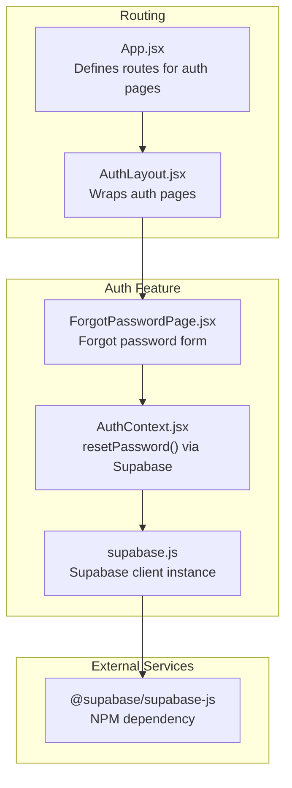
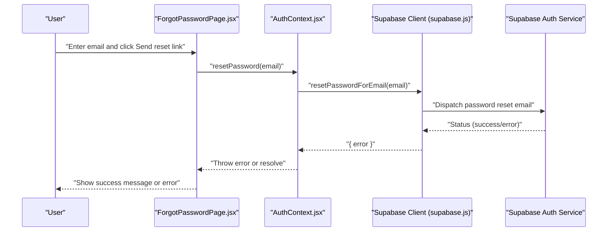
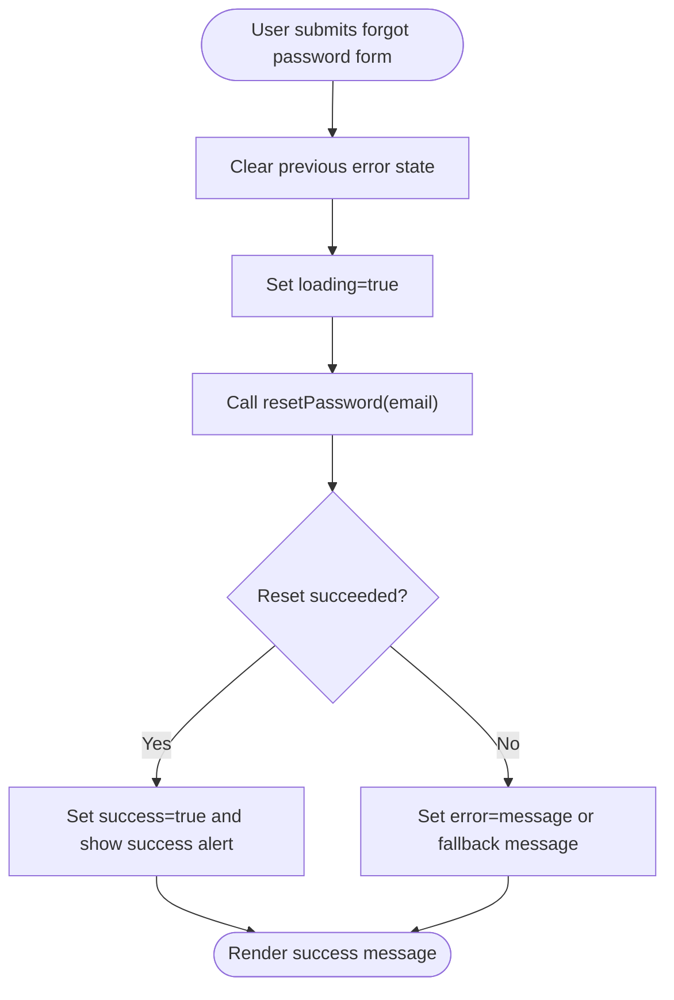
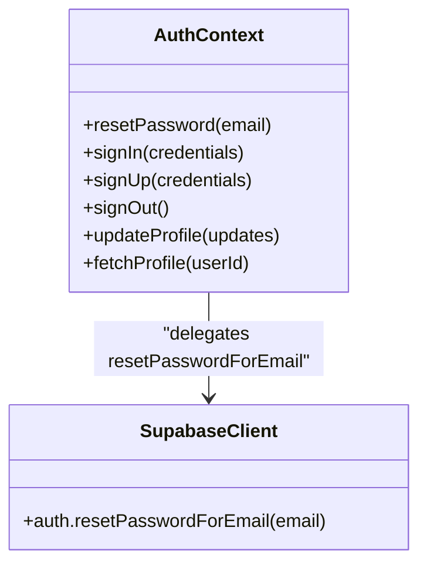
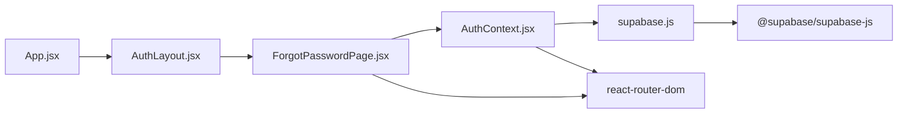

# Password Reset

<cite>
**Referenced Files in This Document**
- [ForgotPasswordPage.jsx](file://src/pages/auth/ForgotPasswordPage.jsx)
- [AuthContext.jsx](file://src/contexts/AuthContext.jsx)
- [supabase.js](file://src/config/supabase.js)
- [App.jsx](file://src/App.jsx)
- [AuthLayout.jsx](file://src/layouts/AuthLayout.jsx)
- [LoginPage.jsx](file://src/pages/auth/LoginPage.jsx)
- [supabaseService.js](file://src/services/supabaseService.js)
- [package.json](file://package.json)
</cite>

## Table of Contents
1. [Introduction](#introduction)
2. [Project Structure](#project-structure)
3. [Core Components](#core-components)
4. [Architecture Overview](#architecture-overview)
5. [Detailed Component Analysis](#detailed-component-analysis)
6. [Dependency Analysis](#dependency-analysis)
7. [Performance Considerations](#performance-considerations)
8. [Security Considerations](#security-considerations)
9. [Troubleshooting Guide](#troubleshooting-guide)
10. [User Experience Patterns](#user-experience-patterns)
11. [Conclusion](#conclusion)

## Introduction
This document provides comprehensive documentation for the password reset functionality implemented in the application. It explains how the forgot password page triggers Supabase's password reset mechanism, how email delivery is handled by Supabase, and how the frontend presents user feedback and redirects. It also covers the underlying Supabase client configuration, the authentication context that exposes the reset method, and the routing structure that makes the feature accessible.

## Project Structure
The password reset feature spans several key files:
- Frontend page: forgot password form and submission handling
- Authentication context: exposes the resetPassword function backed by Supabase
- Supabase client configuration: provides the Supabase instance used by the context
- Routing: defines the route for the forgot password page
- Layout: wraps the authentication pages with a consistent layout
- Additional services: unrelated to password reset but part of the broader Supabase integration

**Diagram sources**
- [App.jsx:19-49](file://src/App.jsx#L19-L49)
- [AuthLayout.jsx:3-16](file://src/layouts/AuthLayout.jsx#L3-L16)
- [ForgotPasswordPage.jsx:5-70](file://src/pages/auth/ForgotPasswordPage.jsx#L5-L70)
- [AuthContext.jsx:69-72](file://src/contexts/AuthContext.jsx#L69-L72)
- [supabase.js:1-7](file://src/config/supabase.js#L1-L7)
- [package.json:11-21](file://package.json#L11-L21)

**Section sources**
- [App.jsx:19-49](file://src/App.jsx#L19-L49)
- [AuthLayout.jsx:3-16](file://src/layouts/AuthLayout.jsx#L3-L16)
- [ForgotPasswordPage.jsx:5-70](file://src/pages/auth/ForgotPasswordPage.jsx#L5-L70)
- [AuthContext.jsx:69-72](file://src/contexts/AuthContext.jsx#L69-L72)
- [supabase.js:1-7](file://src/config/supabase.js#L1-L7)
- [package.json:11-21](file://package.json#L11-L21)

## Core Components
- ForgotPasswordPage: Renders the form, manages state for email, errors, success, and loading, and submits the reset request via the authentication context.
- AuthContext: Provides the resetPassword function that calls Supabase's resetPasswordForEmail API and throws any returned error.
- Supabase client: Created from environment variables and used by the context to perform the reset operation.
- Routing and layout: The forgot password page is mounted under the auth layout and route configuration.

Key implementation references:
- Forgot password form submission and state management: [ForgotPasswordPage.jsx:12-24](file://src/pages/auth/ForgotPasswordPage.jsx#L12-L24)
- Success and error feedback rendering: [ForgotPasswordPage.jsx:34-43](file://src/pages/auth/ForgotPasswordPage.jsx#L34-L43)
- Loading state and button behavior: [ForgotPasswordPage.jsx:58-60](file://src/pages/auth/ForgotPasswordPage.jsx#L58-L60)
- resetPassword function definition: [AuthContext.jsx:69-72](file://src/contexts/AuthContext.jsx#L69-L72)
- Supabase client creation: [supabase.js:3-6](file://src/config/supabase.js#L3-L6)
- Route registration for forgot password: [App.jsx:28](file://src/App.jsx#L28)

**Section sources**
- [ForgotPasswordPage.jsx:12-24](file://src/pages/auth/ForgotPasswordPage.jsx#L12-L24)
- [ForgotPasswordPage.jsx:34-43](file://src/pages/auth/ForgotPasswordPage.jsx#L34-L43)
- [ForgotPasswordPage.jsx:58-60](file://src/pages/auth/ForgotPasswordPage.jsx#L58-L60)
- [AuthContext.jsx:69-72](file://src/contexts/AuthContext.jsx#L69-L72)
- [supabase.js:3-6](file://src/config/supabase.js#L3-L6)
- [App.jsx:28](file://src/App.jsx#L28)

## Architecture Overview
The password reset workflow is a client-server interaction orchestrated by the frontend and executed by Supabase:
1. User visits the forgot password page and submits their email.
2. The page calls the resetPassword function from the authentication context.
3. The context invokes Supabase's resetPasswordForEmail API.
4. Supabase sends a password reset email to the provided address.
5. The frontend displays success feedback and directs the user to check their inbox.

**Diagram sources**
- [ForgotPasswordPage.jsx:12-24](file://src/pages/auth/ForgotPasswordPage.jsx#L12-L24)
- [AuthContext.jsx:69-72](file://src/contexts/AuthContext.jsx#L69-L72)
- [supabase.js:3-6](file://src/config/supabase.js#L3-L6)

## Detailed Component Analysis

### ForgotPasswordPage Component
Responsibilities:
- Render the forgot password form with email input and submit button.
- Manage local state for email, error, success, and loading.
- Submit the reset request and handle success and error outcomes.
- Provide user feedback via alerts and disable the button during loading.

Implementation highlights:
- Form submission handler prevents default, clears previous errors, sets loading, calls resetPassword, and toggles success state on completion: [ForgotPasswordPage.jsx:12-24](file://src/pages/auth/ForgotPasswordPage.jsx#L12-L24)
- Success feedback appears after a successful reset call: [ForgotPasswordPage.jsx:40-43](file://src/pages/auth/ForgotPasswordPage.jsx#L40-L43)
- Error feedback displays either the thrown error message or a generic failure message: [ForgotPasswordPage.jsx:19-20](file://src/pages/auth/ForgotPasswordPage.jsx#L19-L20)
- Loading state disables the button and updates the label: [ForgotPasswordPage.jsx:58-60](file://src/pages/auth/ForgotPasswordPage.jsx#L58-L60)

**Diagram sources**
- [ForgotPasswordPage.jsx:12-24](file://src/pages/auth/ForgotPasswordPage.jsx#L12-L24)
- [ForgotPasswordPage.jsx:34-43](file://src/pages/auth/ForgotPasswordPage.jsx#L34-L43)
- [ForgotPasswordPage.jsx:19-20](file://src/pages/auth/ForgotPasswordPage.jsx#L19-L20)

**Section sources**
- [ForgotPasswordPage.jsx:12-24](file://src/pages/auth/ForgotPasswordPage.jsx#L12-L24)
- [ForgotPasswordPage.jsx:34-43](file://src/pages/auth/ForgotPasswordPage.jsx#L34-L43)
- [ForgotPasswordPage.jsx:19-20](file://src/pages/auth/ForgotPasswordPage.jsx#L19-L20)
- [ForgotPasswordPage.jsx:58-60](file://src/pages/auth/ForgotPasswordPage.jsx#L58-L60)

### AuthContext Implementation
Responsibilities:
- Expose authentication-related functions to the application.
- Provide resetPassword by delegating to Supabase's resetPasswordForEmail API.
- Throw errors returned by Supabase to be handled by the caller.

Implementation highlights:
- resetPassword function performs the API call and rethrows any error: [AuthContext.jsx:69-72](file://src/contexts/AuthContext.jsx#L69-L72)
- The function is exposed via the context provider for consumption by components: [AuthContext.jsx:88-89](file://src/contexts/AuthContext.jsx#L88-L89)

**Diagram sources**
- [AuthContext.jsx:69-72](file://src/contexts/AuthContext.jsx#L69-L72)
- [supabase.js:3-6](file://src/config/supabase.js#L3-L6)

**Section sources**
- [AuthContext.jsx:69-72](file://src/contexts/AuthContext.jsx#L69-L72)
- [AuthContext.jsx:88-89](file://src/contexts/AuthContext.jsx#L88-L89)

### Supabase Client Configuration
Responsibilities:
- Initialize the Supabase client using Vite environment variables.
- Provide a singleton instance consumed by the authentication context.

Implementation highlights:
- Client creation with URL and anonymous key from environment: [supabase.js:3-6](file://src/config/supabase.js#L3-L6)
- NPM dependency for Supabase JS SDK: [@supabase/supabase-js](file://package.json#L13)

**Section sources**
- [supabase.js:3-6](file://src/config/supabase.js#L3-L6)
- [package.json:13](file://package.json#L13)

### Routing and Layout Integration
Responsibilities:
- Mount the forgot password page under the auth layout.
- Ensure the page is reachable via the "/forgot-password" route.

Implementation highlights:
- Route registration for forgot password: [App.jsx:28](file://src/App.jsx#L28)
- Auth layout wrapper for auth pages: [AuthLayout.jsx:3-16](file://src/layouts/AuthLayout.jsx#L3-L16)
- Access to forgot password link from the login page: [LoginPage.jsx:55](file://src/pages/auth/LoginPage.jsx#L55)

**Section sources**
- [App.jsx:28](file://src/App.jsx#L28)
- [AuthLayout.jsx:3-16](file://src/layouts/AuthLayout.jsx#L3-L16)
- [LoginPage.jsx:55](file://src/pages/auth/LoginPage.jsx#L55)

## Dependency Analysis
The password reset feature depends on:
- React Router for routing and navigation
- Supabase client for authentication operations
- DaisyUI for UI components and styling

**Diagram sources**
- [ForgotPasswordPage.jsx:3](file://src/pages/auth/ForgotPasswordPage.jsx#L3)
- [AuthContext.jsx:2](file://src/contexts/AuthContext.jsx#L2)
- [supabase.js:1](file://src/config/supabase.js#L1)
- [package.json:13](file://package.json#L13)
- [App.jsx:1](file://src/App.jsx#L1)
- [AuthLayout.jsx:1](file://src/layouts/AuthLayout.jsx#L1)
- [package.json:20](file://package.json#L20)

**Section sources**
- [ForgotPasswordPage.jsx:3](file://src/pages/auth/ForgotPasswordPage.jsx#L3)
- [AuthContext.jsx:2](file://src/contexts/AuthContext.jsx#L2)
- [supabase.js:1](file://src/config/supabase.js#L1)
- [package.json:13](file://package.json#L13)
- [package.json:20](file://package.json#L20)
- [App.jsx:1](file://src/App.jsx#L1)
- [AuthLayout.jsx:1](file://src/layouts/AuthLayout.jsx#L1)

## Performance Considerations
- Network latency: The reset operation is an asynchronous network call to Supabase. Keep the UI responsive by disabling the submit button while loading.
- Minimal re-renders: The form state is scoped to the component, avoiding unnecessary propagation to parent components.
- No client-side heavy computation: The reset logic is delegated to Supabase, keeping the client lightweight.

## Security Considerations
- Reset token management: Supabase generates and manages reset tokens server-side. The client does not handle tokens directly.
- Email delivery: Supabase sends the reset email; ensure your Supabase project is configured with a valid SMTP provider.
- Rate limiting: Supabase enforces rate limits on authentication operations. Excessive requests may be throttled by the service.
- Token expiration: Supabase controls token lifetime and expiration. The client should inform users if a reset link expires and guide them to request a new reset.
- Environment variables: Ensure Vite environment variables for Supabase URL and anon key are properly configured and not exposed in client bundles.

Note: The current implementation does not include explicit client-side token validation or expiration handling. Users who receive an expired link should be guided to request another reset.

**Section sources**
- [AuthContext.jsx:69-72](file://src/contexts/AuthContext.jsx#L69-L72)
- [supabase.js:3-6](file://src/config/supabase.js#L3-L6)

## Troubleshooting Guide
Common scenarios and handling:
- Invalid email:
  - Symptom: Error message displayed after submission.
  - Cause: Supabase may reject non-existent or malformed emails.
  - Action: Prompt the user to verify the email format and existence.
  - Reference: [ForgotPasswordPage.jsx:19-20](file://src/pages/auth/ForgotPasswordPage.jsx#L19-L20)
- System failures:
  - Symptom: Generic failure message shown.
  - Cause: Network issues or Supabase service unavailability.
  - Action: Retry after a short delay or check service status.
  - Reference: [ForgotPasswordPage.jsx:19-20](file://src/pages/auth/ForgotPasswordPage.jsx#L19-L20)
- Expired or invalid reset links:
  - Symptom: User follows link but encounters errors when changing password.
  - Cause: Token expired or malformed.
  - Action: Advise the user to request a new password reset.
  - Reference: [ForgotPasswordPage.jsx:40-43](file://src/pages/auth/ForgotPasswordPage.jsx#L40-L43)

Operational references:
- Success feedback after reset: [ForgotPasswordPage.jsx:40-43](file://src/pages/auth/ForgotPasswordPage.jsx#L40-L43)
- Error feedback and fallback message: [ForgotPasswordPage.jsx:19-20](file://src/pages/auth/ForgotPasswordPage.jsx#L19-L20)

**Section sources**
- [ForgotPasswordPage.jsx:19-20](file://src/pages/auth/ForgotPasswordPage.jsx#L19-L20)
- [ForgotPasswordPage.jsx:40-43](file://src/pages/auth/ForgotPasswordPage.jsx#L40-L43)

## User Experience Patterns
- Clear messaging: The page communicates that a reset link will be sent to the provided email address.
- Immediate feedback: Success and error alerts help users understand the outcome of their action.
- Loading state: The submit button is disabled and labeled appropriately during the reset process.
- Navigation: A link back to the login page allows users to return easily.

References:
- Instructional text: [ForgotPasswordPage.jsx:30-32](file://src/pages/auth/ForgotPasswordPage.jsx#L30-L32)
- Success alert: [ForgotPasswordPage.jsx:40-43](file://src/pages/auth/ForgotPasswordPage.jsx#L40-L43)
- Back-to-login link: [ForgotPasswordPage.jsx:64-66](file://src/pages/auth/ForgotPasswordPage.jsx#L64-L66)

**Section sources**
- [ForgotPasswordPage.jsx:30-32](file://src/pages/auth/ForgotPasswordPage.jsx#L30-L32)
- [ForgotPasswordPage.jsx:40-43](file://src/pages/auth/ForgotPasswordPage.jsx#L40-L43)
- [ForgotPasswordPage.jsx:64-66](file://src/pages/auth/ForgotPasswordPage.jsx#L64-L66)

## Conclusion
The password reset functionality leverages Supabase's built-in password reset capabilities through a clean, minimal frontend interface. The forgot password page captures the user's email, delegates the reset request to the authentication context, and provides immediate feedback. Supabase handles email delivery, token generation, and expiration policies. The implementation is straightforward, secure, and user-friendly, with room to enhance client-side UX for token expiration scenarios by guiding users to initiate a new reset.