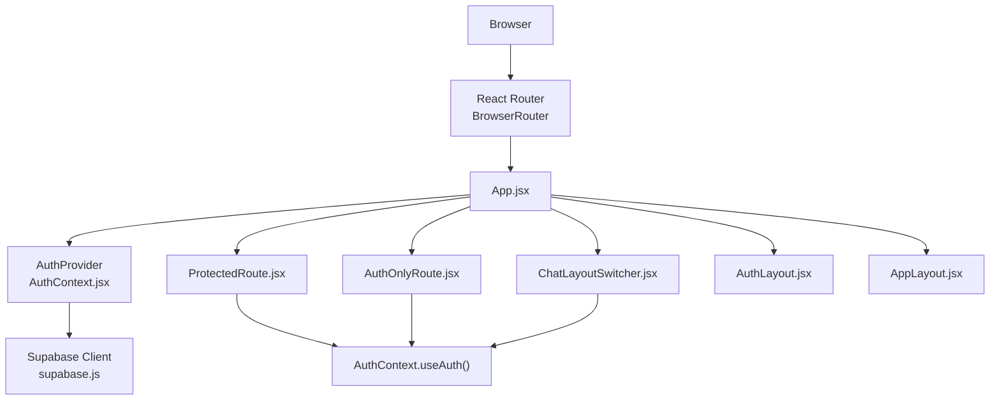
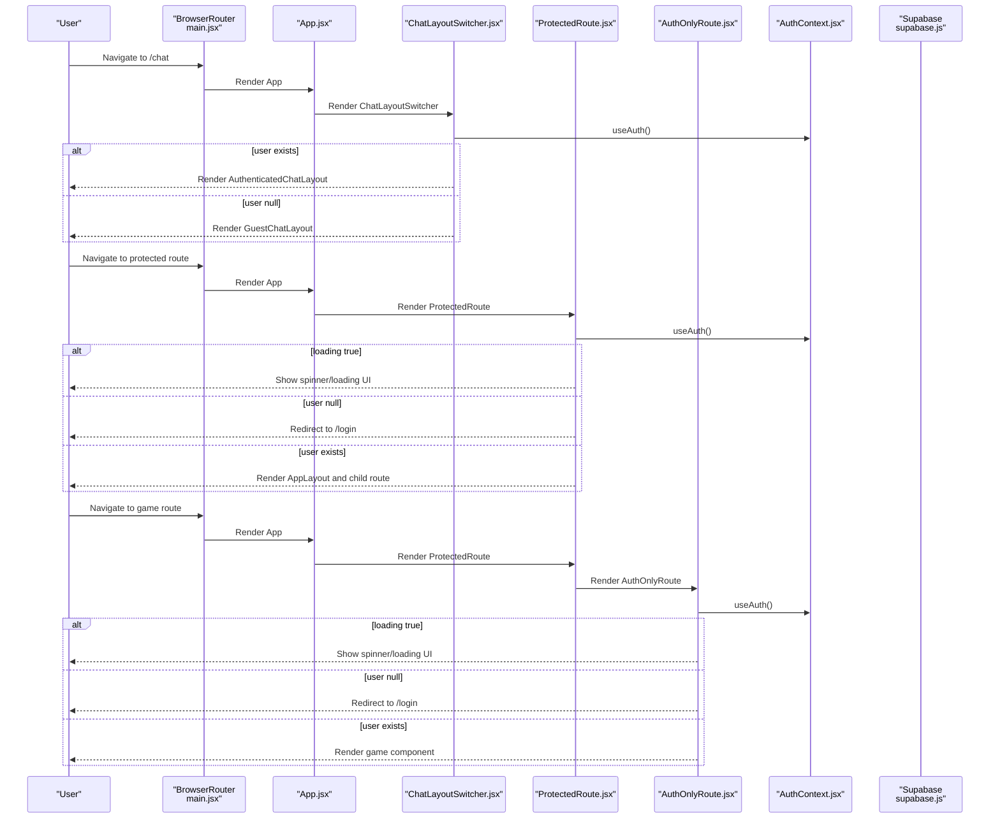
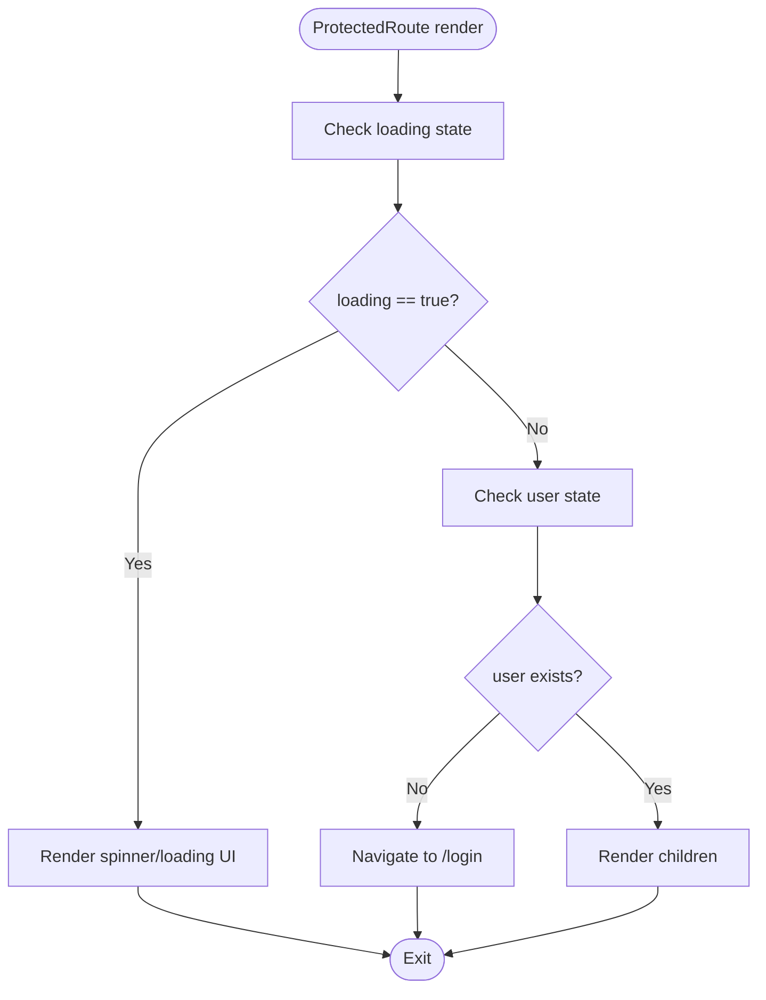
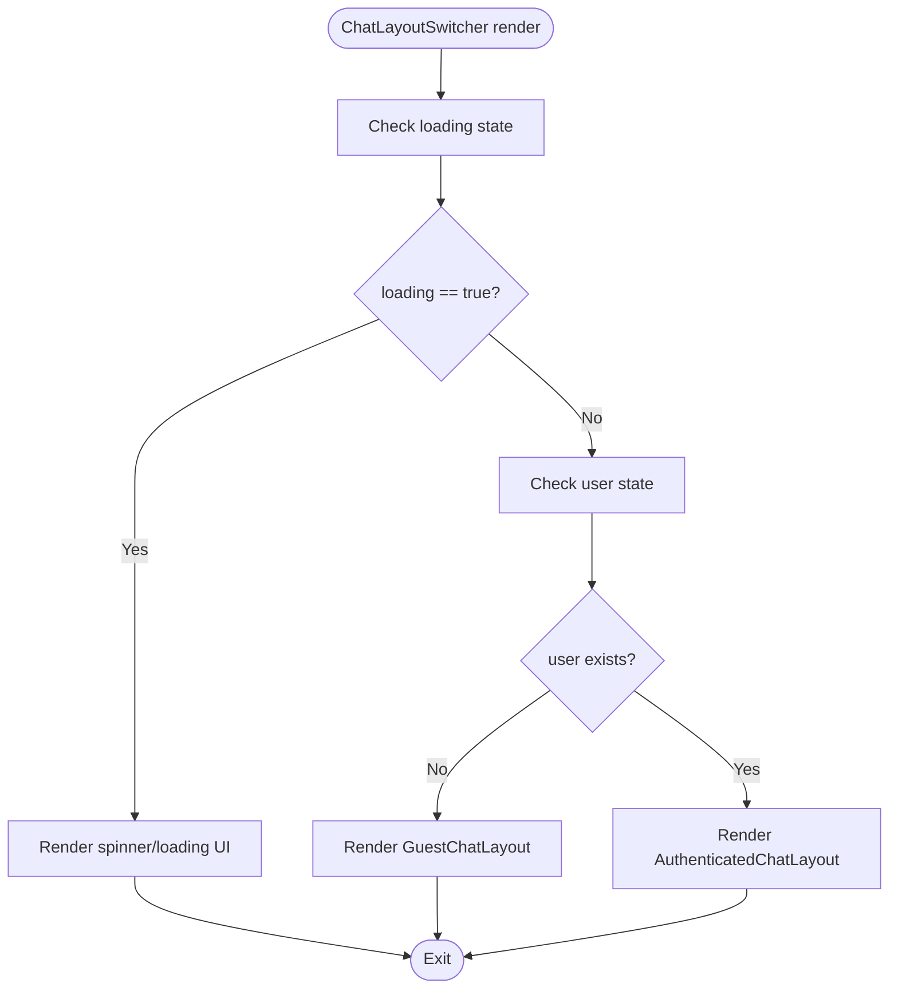
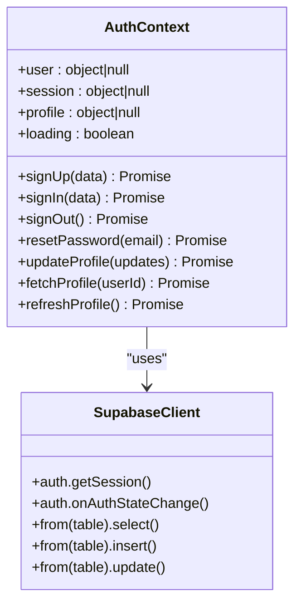
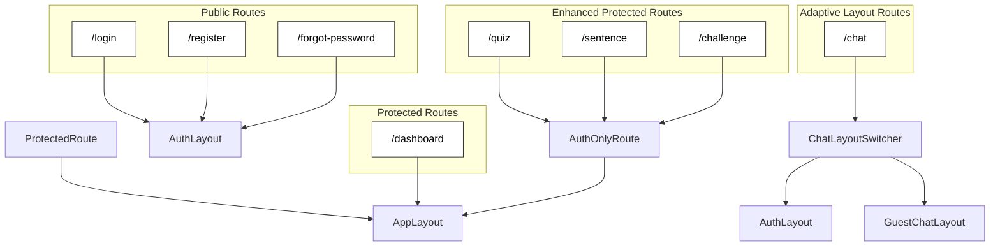
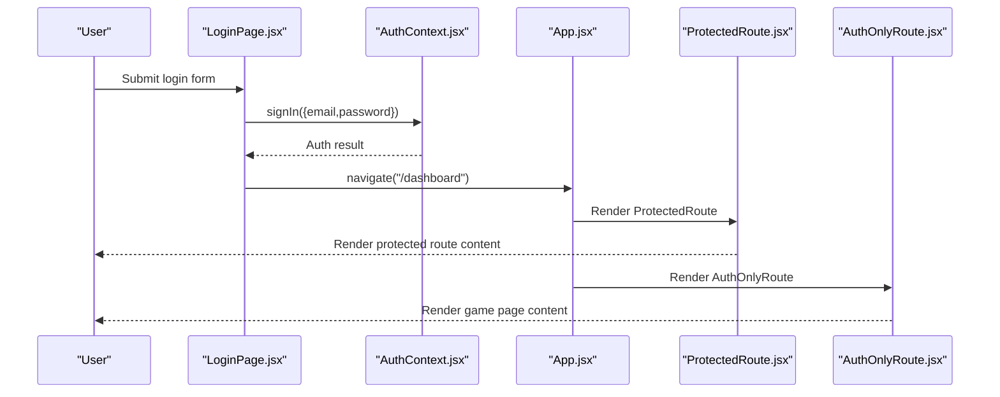
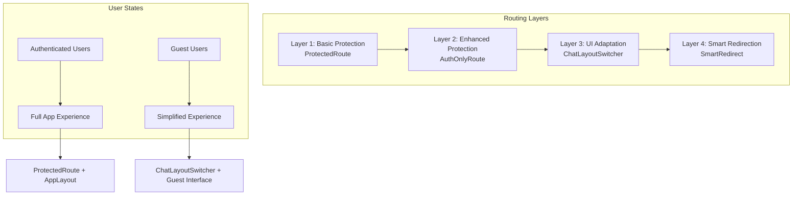
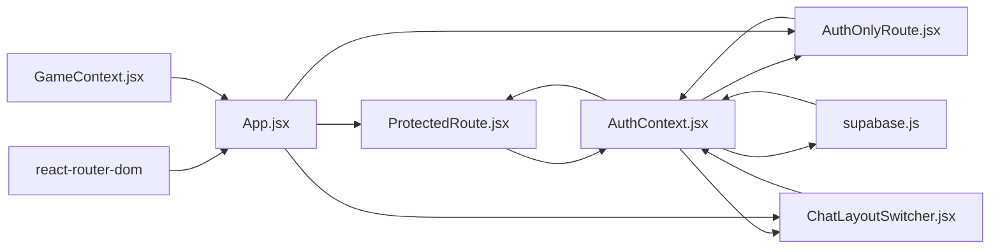

# Protected Routing Implementation

<cite>
**Referenced Files in This Document**
- [ProtectedRoute.jsx](file://src/components/ProtectedRoute.jsx)
- [AuthOnlyRoute.jsx](file://src/components/AuthOnlyRoute.jsx)
- [AuthContext.jsx](file://src/contexts/AuthContext.jsx)
- [App.jsx](file://src/App.jsx)
- [main.jsx](file://src/main.jsx)
- [AppLayout.jsx](file://src/layouts/AppLayout.jsx)
- [AuthLayout.jsx](file://src/layouts/AuthLayout.jsx)
- [ChatLayoutSwitcher.jsx](file://src/layouts/ChatLayoutSwitcher.jsx)
- [LoginPage.jsx](file://src/pages/auth/LoginPage.jsx)
- [Dashboard.jsx](file://src/pages/dashboard/Dashboard.jsx)
- [GameContext.jsx](file://src/contexts/GameContext.jsx)
- [TranslationChat.jsx](file://src/pages/chat/TranslationChat.jsx)
- [supabase.js](file://src/config/supabase.js)
- [package.json](file://package.json)
</cite>

## Update Summary
**Changes Made**
- Added comprehensive documentation for the new AuthOnlyRoute component
- Updated routing architecture to reflect enhanced layout switching capabilities
- Enhanced authentication state management documentation with dual protection layers
- Added ChatLayoutSwitcher component documentation for automatic layout adaptation
- Updated routing protection mechanisms with improved user experience patterns
- Expanded integration examples covering both ProtectedRoute and AuthOnlyRoute scenarios

## Table of Contents
1. [Introduction](#introduction)
2. [Project Structure](#project-structure)
3. [Core Components](#core-components)
4. [Architecture Overview](#architecture-overview)
5. [Detailed Component Analysis](#detailed-component-analysis)
6. [Enhanced Routing Architecture](#enhanced-routing-architecture)
7. [Dependency Analysis](#dependency-analysis)
8. [Performance Considerations](#performance-considerations)
9. [Troubleshooting Guide](#troubleshooting-guide)
10. [Conclusion](#conclusion)

## Introduction
This document explains the protected routing system used to secure application routes in the Flinggo app. The system now features two distinct routing protection mechanisms: ProtectedRoute for basic authentication protection and AuthOnlyRoute for enhanced protection with automatic layout switching. The architecture integrates React Router with Supabase authentication, providing seamless user experience across different authentication states while maintaining robust security boundaries.

## Project Structure
The protected routing system spans several key files with enhanced architecture:
- Application bootstrap initializes React Router and providers
- Authentication context manages user session and profile state
- ProtectedRoute provides basic authentication protection
- AuthOnlyRoute offers enhanced protection with layout switching
- ChatLayoutSwitcher automatically adapts UI based on authentication status
- App routes define public, protected, and enhanced protected areas
- Layouts wrap route groups to apply shared UI and protection

**Diagram sources**
- [main.jsx:7-13](file://src/main.jsx#L7-L13)
- [App.jsx:19-49](file://src/App.jsx#L19-L49)
- [AuthContext.jsx:6-30](file://src/contexts/AuthContext.jsx#L6-L30)
- [ProtectedRoute.jsx:4-16](file://src/components/ProtectedRoute.jsx#L4-L16)
- [AuthOnlyRoute.jsx:9-22](file://src/components/AuthOnlyRoute.jsx#L9-L22)
- [ChatLayoutSwitcher.jsx:17-29](file://src/layouts/ChatLayoutSwitcher.jsx#L17-L29)
- [supabase.js:1-7](file://src/config/supabase.js#L1-L7)

**Section sources**
- [main.jsx:1-14](file://src/main.jsx#L1-L14)
- [App.jsx:19-49](file://src/App.jsx#L19-L49)

## Core Components
The routing system now features two complementary protection mechanisms:

### ProtectedRoute Component
A route wrapper that provides basic authentication protection:
- Checks authentication state using useAuth hook
- Displays loading spinner while authentication is initializing
- Redirects unauthenticated users to /login
- Renders children when user is authenticated

### AuthOnlyRoute Component  
Enhanced route protection with automatic layout switching:
- Provides the same authentication checks as ProtectedRoute
- Designed specifically for game pages requiring extra protection
- Automatically adapts to authentication state for optimal user experience
- Returns children when user is authenticated, otherwise redirects to /login

### ChatLayoutSwitcher Component
Automatic layout adaptation based on authentication status:
- Switches between authenticated and guest layouts for the /chat route
- Maintains consistent component rendering while adapting UI chrome
- Ensures logged-in users see full application features
- Provides guest users with simplified interface and CTA buttons

Key behaviors:
- **Dual protection layers**: Basic protection via ProtectedRoute and enhanced protection via AuthOnlyRoute
- **Automatic layout switching**: ChatLayoutSwitcher adapts UI based on authentication state
- **Consistent component rendering**: Same components work seamlessly across different layouts
- **Enhanced user experience**: Different UI treatments for authenticated vs guest users
- **Loading state handling**: Both components provide spinner-based loading indicators
- **Fallback UI patterns**: Graceful degradation during authentication checks

**Section sources**
- [ProtectedRoute.jsx:4-16](file://src/components/ProtectedRoute.jsx#L4-L16)
- [AuthOnlyRoute.jsx:9-22](file://src/components/AuthOnlyRoute.jsx#L9-L22)
- [ChatLayoutSwitcher.jsx:17-29](file://src/layouts/ChatLayoutSwitcher.jsx#L17-L29)
- [AuthContext.jsx:6-30](file://src/contexts/AuthContext.jsx#L6-L30)
- [App.jsx:24-41](file://src/App.jsx#L24-L41)

## Architecture Overview
The enhanced protected routing architecture integrates multiple layers of protection and automatic UI adaptation. Public routes (login/register/forgot-password) are exposed without protection, while protected routes use ProtectedRoute with AppLayout. Game pages receive additional protection through AuthOnlyRoute for enhanced security. The /chat route uses ChatLayoutSwitcher to automatically adapt between authenticated and guest experiences.

**Diagram sources**
- [main.jsx:7-13](file://src/main.jsx#L7-L13)
- [App.jsx:31-41](file://src/App.jsx#L31-L41)
- [ChatLayoutSwitcher.jsx:17-29](file://src/layouts/ChatLayoutSwitcher.jsx#L17-L29)
- [ProtectedRoute.jsx:4-16](file://src/components/ProtectedRoute.jsx#L4-L16)
- [AuthOnlyRoute.jsx:9-22](file://src/components/AuthOnlyRoute.jsx#L9-L22)
- [AuthContext.jsx:12-30](file://src/contexts/AuthContext.jsx#L12-L30)
- [supabase.js:1-7](file://src/config/supabase.js#L1-L7)

## Detailed Component Analysis

### ProtectedRoute Component
ProtectedRoute serves as the foundation for route protection:
- Imports Navigate from react-router-dom for redirection
- Uses useAuth to access user and loading state
- Returns a spinner UI while loading is true
- Redirects to /login if user is null
- Renders children otherwise

**Diagram sources**
- [ProtectedRoute.jsx:4-16](file://src/components/ProtectedRoute.jsx#L4-L16)

**Section sources**
- [ProtectedRoute.jsx:1-18](file://src/components/ProtectedRoute.jsx#L1-L18)

### AuthOnlyRoute Component
AuthOnlyRoute provides enhanced protection for sensitive game pages:
- Identical authentication logic to ProtectedRoute
- Specifically designed for game components requiring extra security
- Automatic layout switching capability for optimal user experience
- Consistent loading state handling with spinner UI
- Seamless integration with existing routing architecture

**Diagram sources**
- [AuthOnlyRoute.jsx:9-22](file://src/components/AuthOnlyRoute.jsx#L9-L22)

**Section sources**
- [AuthOnlyRoute.jsx:1-23](file://src/components/AuthOnlyRoute.jsx#L1-L23)

### ChatLayoutSwitcher Component
Automatic layout adaptation for the /chat route:
- Monitors authentication state via useAuth hook
- Renders AuthenticatedChatLayout for logged-in users
- Renders GuestChatLayout for anonymous users
- Maintains consistent TranslationChat component across layouts
- Provides different UI experiences based on user authentication status

**Diagram sources**
- [ChatLayoutSwitcher.jsx:17-29](file://src/layouts/ChatLayoutSwitcher.jsx#L17-L29)

**Section sources**
- [ChatLayoutSwitcher.jsx:1-118](file://src/layouts/ChatLayoutSwitcher.jsx#L1-L118)

### AuthContext and Authentication State Management
AuthContext centralizes authentication logic with enhanced capabilities:
- Initializes session and subscribes to auth state changes via Supabase
- Loads user, session, and profile data with auto-creation support
- Exposes sign-in/sign-up/sign-out/reset-password/update-profile functions
- Manages loading state during initial session retrieval and auth transitions
- Supports both ProtectedRoute and AuthOnlyRoute protection mechanisms

**Diagram sources**
- [AuthContext.jsx:6-94](file://src/contexts/AuthContext.jsx#L6-L94)
- [supabase.js:1-7](file://src/config/supabase.js#L1-L7)

**Section sources**
- [AuthContext.jsx:1-193](file://src/contexts/AuthContext.jsx#L1-L193)

### Application Routing and Enhanced Layout Integration
App defines three major route groups with enhanced protection:
- **Auth routes**: Wrapped in AuthLayout and exposed publicly
- **Protected routes**: Wrapped in ProtectedRoute with AppLayout for general protected pages
- **Enhanced protected routes**: Wrapped in AuthOnlyRoute for game pages requiring extra security
- **Chat route**: Wrapped in ChatLayoutSwitcher for automatic layout adaptation

**Diagram sources**
- [App.jsx:24-44](file://src/App.jsx#L24-L44)
- [AuthLayout.jsx:3-16](file://src/layouts/AuthLayout.jsx#L3-L16)
- [AppLayout.jsx:17-41](file://src/layouts/AppLayout.jsx#L17-L41)
- [ChatLayoutSwitcher.jsx:17-29](file://src/layouts/ChatLayoutSwitcher.jsx#L17-L29)

**Section sources**
- [App.jsx:19-84](file://src/App.jsx#L19-L84)

### Login Flow and Navigation Protection
The login page demonstrates how successful authentication leads to protected route navigation:
- Handles form submission and calls sign-in from AuthContext
- On success, navigates to /dashboard for ProtectedRoute
- AuthOnlyRoute provides additional protection for game pages
- ChatLayoutSwitcher automatically adapts /chat route experience

**Diagram sources**
- [LoginPage.jsx:13-25](file://src/pages/auth/LoginPage.jsx#L13-L25)
- [AuthContext.jsx:58-62](file://src/contexts/AuthContext.jsx#L58-L62)
- [App.jsx:32-41](file://src/App.jsx#L32-L41)
- [ProtectedRoute.jsx:4-16](file://src/components/ProtectedRoute.jsx#L4-L16)
- [AuthOnlyRoute.jsx:9-22](file://src/components/AuthOnlyRoute.jsx#L9-L22)

**Section sources**
- [LoginPage.jsx:1-80](file://src/pages/auth/LoginPage.jsx#L1-L80)

### Protected Page Example: Dashboard
Dashboard illustrates how protected pages consume authentication and game state:
- Reads user and profile from AuthContext
- Integrates with GameContext for XP, level, and streak data
- Demonstrates loading states and fallback UI patterns
- Works seamlessly with AppLayout protection

**Section sources**
- [Dashboard.jsx:9-25](file://src/pages/dashboard/Dashboard.jsx#L9-L25)
- [GameContext.jsx:57-73](file://src/contexts/GameContext.jsx#L57-L73)

### Enhanced Protected Page Example: Game Pages
Game pages demonstrate AuthOnlyRoute protection:
- VocabularyQuiz wrapped in AuthOnlyRoute for enhanced security
- SentenceArrangement wrapped in AuthOnlyRoute for consistent protection
- DailyChallenge wrapped in AuthOnlyRoute for gamified experience
- All game pages benefit from automatic layout switching and protection

**Section sources**
- [App.jsx:67-70](file://src/App.jsx#L67-L70)
- [TranslationChat.jsx:17-41](file://src/pages/chat/TranslationChat.jsx#L17-L41)

## Enhanced Routing Architecture
The routing system now features a multi-layered protection approach:

### Layer 1: Basic Authentication Protection
- ProtectedRoute handles general route protection
- Provides consistent loading states and redirect logic
- Works with AppLayout for shared UI elements

### Layer 2: Enhanced Authentication Protection  
- AuthOnlyRoute adds extra security layer for sensitive pages
- Particularly useful for game components requiring stricter access control
- Maintains consistency with existing ProtectedRoute patterns

### Layer 3: Automatic UI Adaptation
- ChatLayoutSwitcher provides seamless experience across authentication states
- Maintains component consistency while adapting UI chrome
- Ensures optimal user experience regardless of authentication status

### Layer 4: Smart Redirection
- SmartRedirect component handles root path based on authentication state
- Redirects authenticated users to /dashboard
- Redirects guests to /chat for immediate access

**Diagram sources**
- [App.jsx:27-37](file://src/App.jsx#L27-L37)
- [ChatLayoutSwitcher.jsx:17-29](file://src/layouts/ChatLayoutSwitcher.jsx#L17-L29)
- [ProtectedRoute.jsx:4-16](file://src/components/ProtectedRoute.jsx#L4-L16)
- [AuthOnlyRoute.jsx:9-22](file://src/components/AuthOnlyRoute.jsx#L9-L22)

**Section sources**
- [App.jsx:22-37](file://src/App.jsx#L22-L37)
- [ChatLayoutSwitcher.jsx:8-29](file://src/layouts/ChatLayoutSwitcher.jsx#L8-L29)

## Dependency Analysis
The enhanced protected routing system relies on:
- React Router for declarative routing and navigation
- AuthContext for centralized authentication state and actions
- Supabase client for session management and profile queries
- Providers (AuthProvider, GameProvider) to supply context to components
- Enhanced components for specialized protection and UI adaptation

**Diagram sources**
- [package.json:20](file://package.json#L20)
- [App.jsx:19-84](file://src/App.jsx#L19-L84)
- [AuthContext.jsx:6-30](file://src/contexts/AuthContext.jsx#L6-L30)
- [ProtectedRoute.jsx:4-16](file://src/components/ProtectedRoute.jsx#L4-L16)
- [AuthOnlyRoute.jsx:9-22](file://src/components/AuthOnlyRoute.jsx#L9-L22)
- [ChatLayoutSwitcher.jsx:17-29](file://src/layouts/ChatLayoutSwitcher.jsx#L17-L29)
- [supabase.js:1-7](file://src/config/supabase.js#L1-L7)
- [GameContext.jsx:57-73](file://src/contexts/GameContext.jsx#L57-L73)

**Section sources**
- [package.json:11-31](file://package.json#L11-L31)
- [App.jsx:19-84](file://src/App.jsx#L19-L84)

## Performance Considerations
- **Minimize re-renders**: Keep ProtectedRoute and AuthOnlyRoute lightweight; avoid heavy computations inside them.
- **Efficient loading UX**: Both components provide spinner-based loading indicators to prevent unnecessary UI thrashing.
- **Debounce auth state changes**: AuthContext consolidates session retrieval and subscription updates.
- **Lazy loading**: Consider lazy-loading protected route components to reduce initial bundle size.
- **Graceful degradation**: If Supabase is unavailable, rely on local state and clear error messaging; both protection components continue to protect routes.
- **Layout switching optimization**: ChatLayoutSwitcher efficiently switches between layouts without component re-rendering.
- **Memory management**: Proper cleanup of auth subscriptions prevents memory leaks during navigation.

## Troubleshooting Guide
Common issues and resolutions:
- **Blank screen on first load**: Verify both ProtectedRoute and AuthOnlyRoute spinners are shown while loading is true.
- **Unexpected redirect to login**: Confirm AuthContext properly sets user after onAuthStateChange for both protection layers.
- **Auth state not updating**: Ensure Supabase auth subscription is active and not unsubscribed prematurely.
- **Profile not loading**: Check that fetchProfile resolves and sets profile state before setting loading to false.
- **Layout switching issues**: Verify ChatLayoutSwitcher correctly identifies user state and renders appropriate layout.
- **Navigation loops**: Ensure default route redirects to appropriate public page based on authentication state.
- **Enhanced protection bypass attempts**: AuthOnlyRoute provides additional security layer for game components.

**Section sources**
- [ProtectedRoute.jsx:7-13](file://src/components/ProtectedRoute.jsx#L7-L13)
- [AuthOnlyRoute.jsx:12-18](file://src/components/AuthOnlyRoute.jsx#L12-L18)
- [AuthContext.jsx:12-30](file://src/contexts/AuthContext.jsx#L12-L30)
- [App.jsx:43-44](file://src/App.jsx#L43-L44)
- [ChatLayoutSwitcher.jsx:17-29](file://src/layouts/ChatLayoutSwitcher.jsx#L17-L29)

## Conclusion
The enhanced protected routing system leverages multiple complementary components to provide robust security and excellent user experience. The addition of AuthOnlyRoute and ChatLayoutSwitcher creates a sophisticated multi-layered protection architecture that adapts to user authentication state while maintaining security boundaries. ProtectedRoute handles basic authentication needs, AuthOnlyRoute provides enhanced protection for sensitive game pages, and ChatLayoutSwitcher ensures optimal user experience across different authentication states. The architecture supports easy extension for role-based access control and custom authorization logic while maintaining clean separation between public, protected, and enhanced protected areas.

**Updated** Enhanced documentation reflects the new AuthOnlyRoute component and ChatLayoutSwitcher architecture, providing comprehensive coverage of the multi-layered protection system with automatic UI adaptation capabilities.