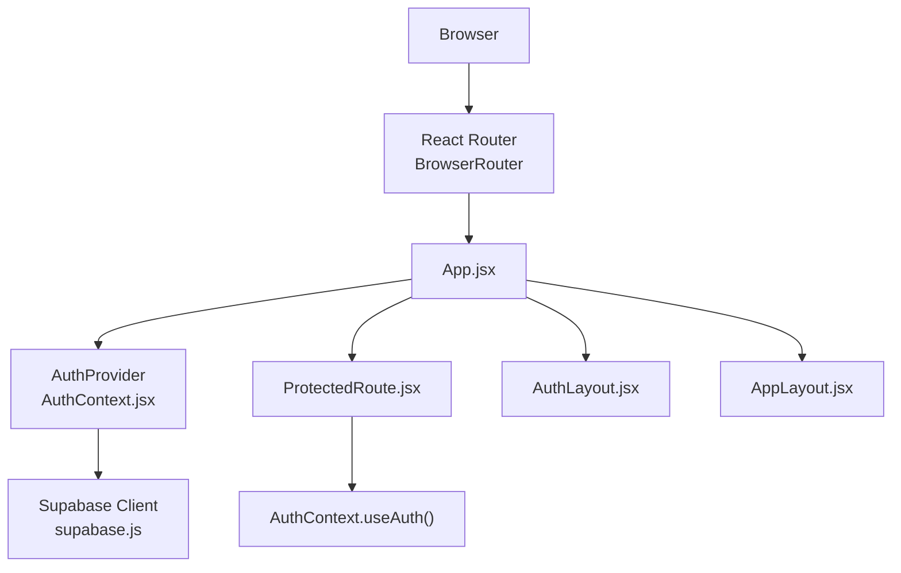
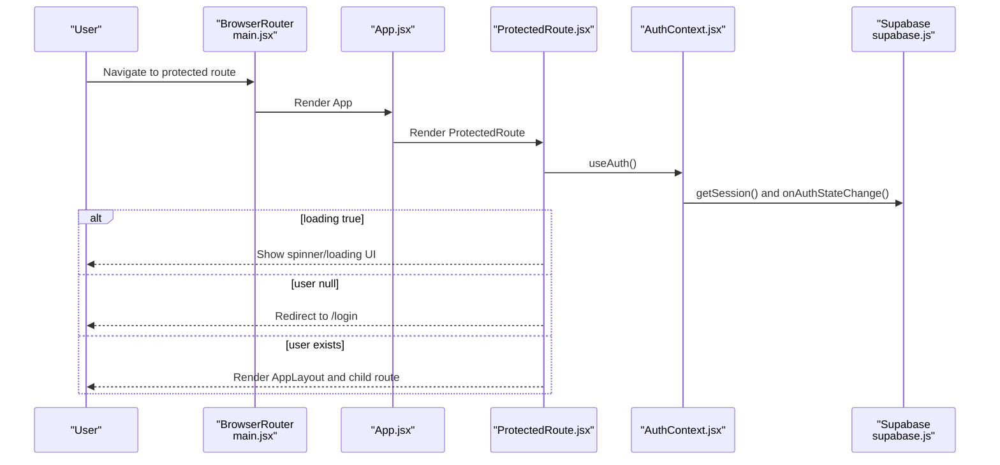
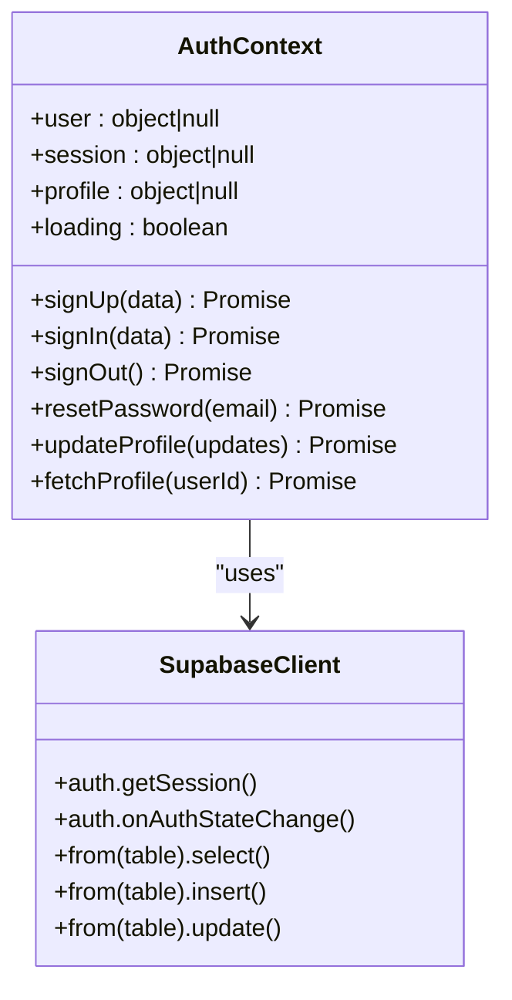
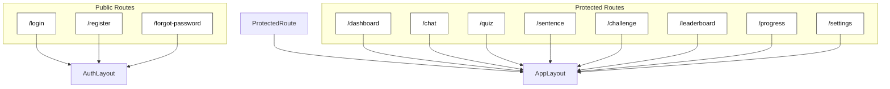
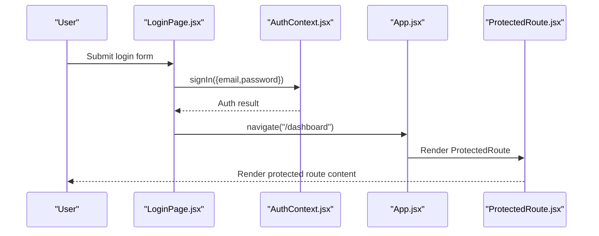
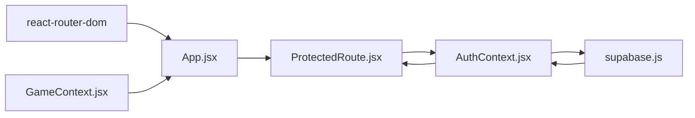

# Protected Routing Implementation

<cite>
**Referenced Files in This Document**
- [ProtectedRoute.jsx](file://src/components/ProtectedRoute.jsx)
- [AuthContext.jsx](file://src/contexts/AuthContext.jsx)
- [App.jsx](file://src/App.jsx)
- [main.jsx](file://src/main.jsx)
- [AppLayout.jsx](file://src/layouts/AppLayout.jsx)
- [AuthLayout.jsx](file://src/layouts/AuthLayout.jsx)
- [LoginPage.jsx](file://src/pages/auth/LoginPage.jsx)
- [Dashboard.jsx](file://src/pages/dashboard/Dashboard.jsx)
- [GameContext.jsx](file://src/contexts/GameContext.jsx)
- [supabase.js](file://src/config/supabase.js)
- [package.json](file://package.json)
</cite>

## Table of Contents
1. [Introduction](#introduction)
2. [Project Structure](#project-structure)
3. [Core Components](#core-components)
4. [Architecture Overview](#architecture-overview)
5. [Detailed Component Analysis](#detailed-component-analysis)
6. [Dependency Analysis](#dependency-analysis)
7. [Performance Considerations](#performance-considerations)
8. [Troubleshooting Guide](#troubleshooting-guide)
9. [Conclusion](#conclusion)

## Introduction
This document explains the protected routing system used to secure application routes in the Flinggo app. It focuses on the ProtectedRoute component, its integration with React Router, authentication state management via AuthContext, and how the overall routing structure enforces access control. The documentation covers authentication checking, redirect logic, conditional rendering, loading states, fallback UI patterns, and practical examples for protecting different route types, nested protected routes, and extending the system for role-based access control and custom authorization logic.

## Project Structure
The protected routing system spans several key files:
- Application bootstrap initializes React Router and providers
- Authentication context manages user session and profile state
- ProtectedRoute enforces access control for protected routes
- App routes define public and protected areas
- Layouts wrap route groups to apply shared UI and protection

**Diagram sources**
- [main.jsx:7-13](file://src/main.jsx#L7-L13)
- [App.jsx:19-49](file://src/App.jsx#L19-L49)
- [AuthContext.jsx:6-30](file://src/contexts/AuthContext.jsx#L6-L30)
- [ProtectedRoute.jsx:4-16](file://src/components/ProtectedRoute.jsx#L4-L16)
- [supabase.js:1-7](file://src/config/supabase.js#L1-L7)

**Section sources**
- [main.jsx:1-14](file://src/main.jsx#L1-L14)
- [App.jsx:19-49](file://src/App.jsx#L19-L49)

## Core Components
- ProtectedRoute: A route wrapper that checks authentication state and either renders children or redirects unauthenticated users to the login page. It displays a spinner while authentication is initializing.
- AuthContext: Provides authentication state (user, session, profile, loading) and exposes sign-in/sign-up/sign-out/reset-password/update-profile functions. It listens to Supabase auth state changes and loads user profile data.
- App routing: Defines public auth routes under AuthLayout and protected routes under ProtectedRoute with AppLayout, ensuring all protected pages share a common layout and protection.

Key behaviors:
- Authentication dependency: ProtectedRoute depends on user and loading from AuthContext.
- Redirect logic: Unauthenticated users are redirected to /login.
- Conditional rendering: Children are rendered only when user exists and loading is false.
- Loading state handling: A centered spinner UI prevents blank screen during auth initialization.
- Fallback UI pattern: Minimal spinner-based loader during authentication checks.

**Section sources**
- [ProtectedRoute.jsx:4-16](file://src/components/ProtectedRoute.jsx#L4-L16)
- [AuthContext.jsx:6-30](file://src/contexts/AuthContext.jsx#L6-L30)
- [App.jsx:24-41](file://src/App.jsx#L24-L41)

## Architecture Overview
The protected routing architecture integrates React Router with Supabase authentication and shared layouts. Public routes (login/register/forgot-password) are exposed without protection, while protected routes are wrapped with ProtectedRoute and AppLayout. Authenticated state is managed centrally and consumed by ProtectedRoute to decide navigation.

**Diagram sources**
- [main.jsx:7-13](file://src/main.jsx#L7-L13)
- [App.jsx:31-41](file://src/App.jsx#L31-L41)
- [ProtectedRoute.jsx:4-16](file://src/components/ProtectedRoute.jsx#L4-L16)
- [AuthContext.jsx:12-30](file://src/contexts/AuthContext.jsx#L12-L30)
- [supabase.js:1-7](file://src/config/supabase.js#L1-L7)

## Detailed Component Analysis

### ProtectedRoute Component
ProtectedRoute is a thin wrapper around route children that enforces authentication:
- Imports Navigate from react-router-dom for redirection
- Uses useAuth to access user and loading state
- Returns a spinner UI while loading is true
- Redirects to /login if user is null
- Renders children otherwise

**Diagram sources**
- [ProtectedRoute.jsx:4-16](file://src/components/ProtectedRoute.jsx#L4-L16)

**Section sources**
- [ProtectedRoute.jsx:1-18](file://src/components/ProtectedRoute.jsx#L1-L18)

### AuthContext and Authentication State Management
AuthContext centralizes authentication logic:
- Initializes session and subscribes to auth state changes via Supabase
- Loads user, session, and profile data
- Exposes sign-in/sign-up/sign-out/reset-password/update-profile functions
- Manages loading state during initial session retrieval and auth transitions

**Diagram sources**
- [AuthContext.jsx:6-94](file://src/contexts/AuthContext.jsx#L6-L94)
- [supabase.js:1-7](file://src/config/supabase.js#L1-L7)

**Section sources**
- [AuthContext.jsx:1-101](file://src/contexts/AuthContext.jsx#L1-L101)

### Application Routing and Layout Integration
App defines two major route groups:
- Auth routes: Wrapped in AuthLayout and exposed publicly
- Protected routes: Wrapped in ProtectedRoute with AppLayout, ensuring all protected pages share a common layout and protection

**Diagram sources**
- [App.jsx:24-44](file://src/App.jsx#L24-L44)
- [AuthLayout.jsx:3-16](file://src/layouts/AuthLayout.jsx#L3-L16)
- [AppLayout.jsx:17-41](file://src/layouts/AppLayout.jsx#L17-L41)

**Section sources**
- [App.jsx:19-49](file://src/App.jsx#L19-L49)

### Login Flow and Navigation Protection
The login page demonstrates how successful authentication leads to protected route navigation:
- Handles form submission and calls sign-in from AuthContext
- On success, navigates to /dashboard
- Displays errors and loading states during submission

**Diagram sources**
- [LoginPage.jsx:13-25](file://src/pages/auth/LoginPage.jsx#L13-L25)
- [AuthContext.jsx:58-62](file://src/contexts/AuthContext.jsx#L58-L62)
- [App.jsx:32-41](file://src/App.jsx#L32-L41)
- [ProtectedRoute.jsx:4-16](file://src/components/ProtectedRoute.jsx#L4-L16)

**Section sources**
- [LoginPage.jsx:1-80](file://src/pages/auth/LoginPage.jsx#L1-L80)

### Protected Page Example: Dashboard
Dashboard illustrates how protected pages consume authentication and game state:
- Reads user and profile from AuthContext
- Integrates with GameContext for XP, level, and streak data
- Demonstrates loading states and fallback UI patterns

**Section sources**
- [Dashboard.jsx:9-25](file://src/pages/dashboard/Dashboard.jsx#L9-L25)
- [GameContext.jsx:57-73](file://src/contexts/GameContext.jsx#L57-L73)

## Dependency Analysis
The protected routing system relies on:
- React Router for declarative routing and navigation
- AuthContext for centralized authentication state and actions
- Supabase client for session management and profile queries
- Providers (AuthProvider, GameProvider) to supply context to components

**Diagram sources**
- [package.json:20](file://package.json#L20)
- [App.jsx:19-49](file://src/App.jsx#L19-L49)
- [AuthContext.jsx:6-30](file://src/contexts/AuthContext.jsx#L6-L30)
- [ProtectedRoute.jsx:4-16](file://src/components/ProtectedRoute.jsx#L4-L16)
- [supabase.js:1-7](file://src/config/supabase.js#L1-L7)
- [GameContext.jsx:57-73](file://src/contexts/GameContext.jsx#L57-L73)

**Section sources**
- [package.json:11-31](file://package.json#L11-L31)
- [App.jsx:19-49](file://src/App.jsx#L19-L49)

## Performance Considerations
- Minimize re-renders: Keep ProtectedRoute lightweight; avoid heavy computations inside it.
- Efficient loading UX: The spinner prevents unnecessary UI thrashing during auth initialization.
- Debounce auth state changes: AuthContext consolidates session retrieval and subscription updates.
- Lazy loading: Consider lazy-loading protected route components to reduce initial bundle size.
- Graceful degradation: If Supabase is unavailable, rely on local state and clear error messaging; ProtectedRoute continues to protect routes even if backend calls fail.

## Troubleshooting Guide
Common issues and resolutions:
- Blank screen on first load: Verify ProtectedRoute spinner is shown while loading is true.
- Unexpected redirect to login: Confirm AuthContext properly sets user after onAuthStateChange.
- Auth state not updating: Ensure Supabase auth subscription is active and not unsubscribed prematurely.
- Profile not loading: Check that fetchProfile resolves and sets profile state before setting loading to false.
- Navigation loops: Ensure default route redirects to a public page (/login) when appropriate.

**Section sources**
- [ProtectedRoute.jsx:7-13](file://src/components/ProtectedRoute.jsx#L7-L13)
- [AuthContext.jsx:12-30](file://src/contexts/AuthContext.jsx#L12-L30)
- [App.jsx:43-44](file://src/App.jsx#L43-L44)

## Conclusion
The protected routing system leverages a small but powerful ProtectedRoute component integrated with AuthContext and React Router. It ensures that only authenticated users can access protected routes, provides a smooth loading experience, and maintains a clean separation between public and protected areas. The architecture supports easy extension for role-based access control and custom authorization logic by enhancing AuthContext and ProtectedRoute with additional checks and policies.