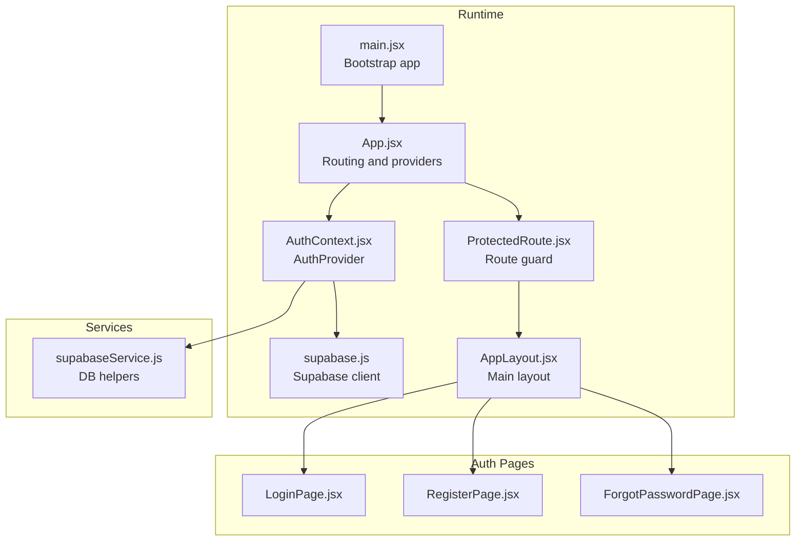
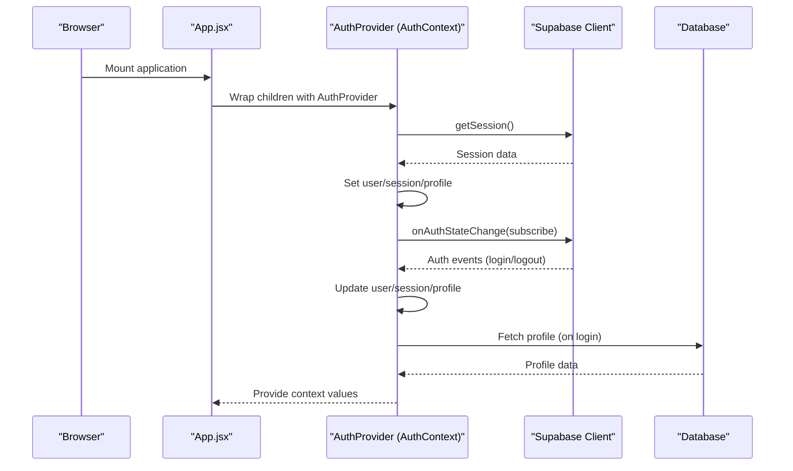
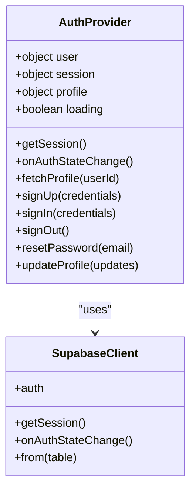
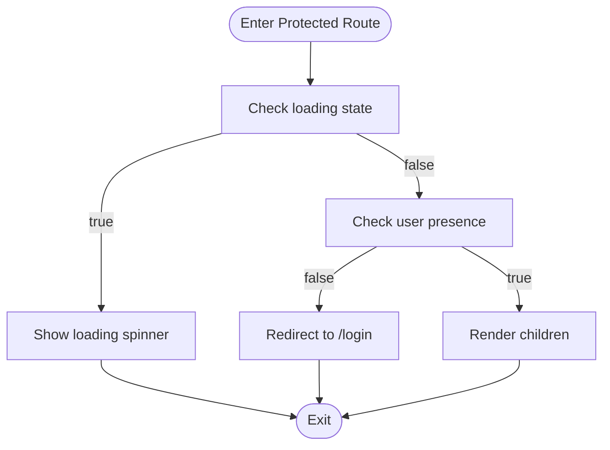
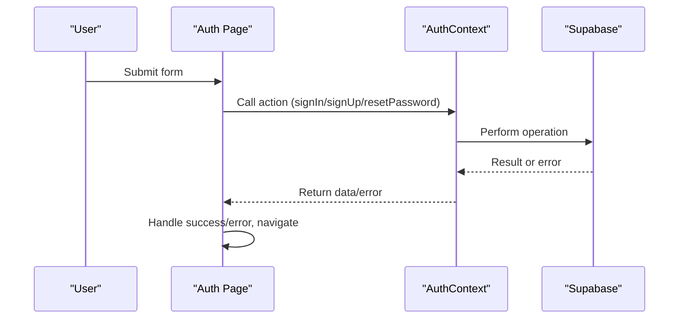
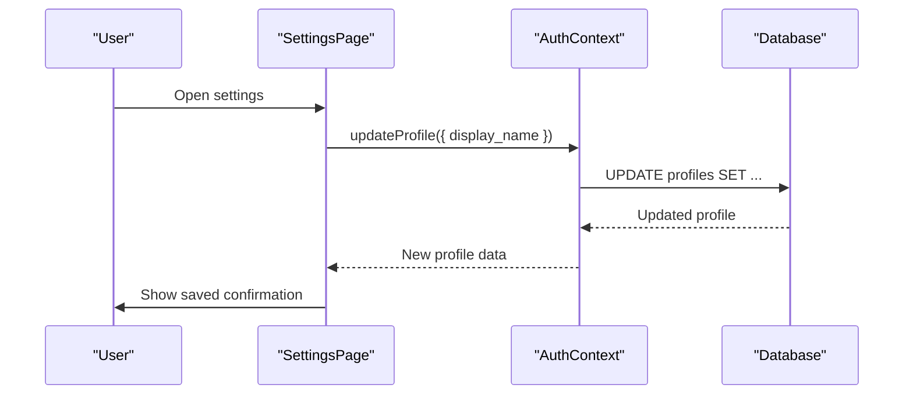
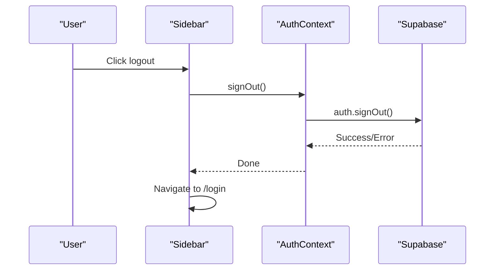
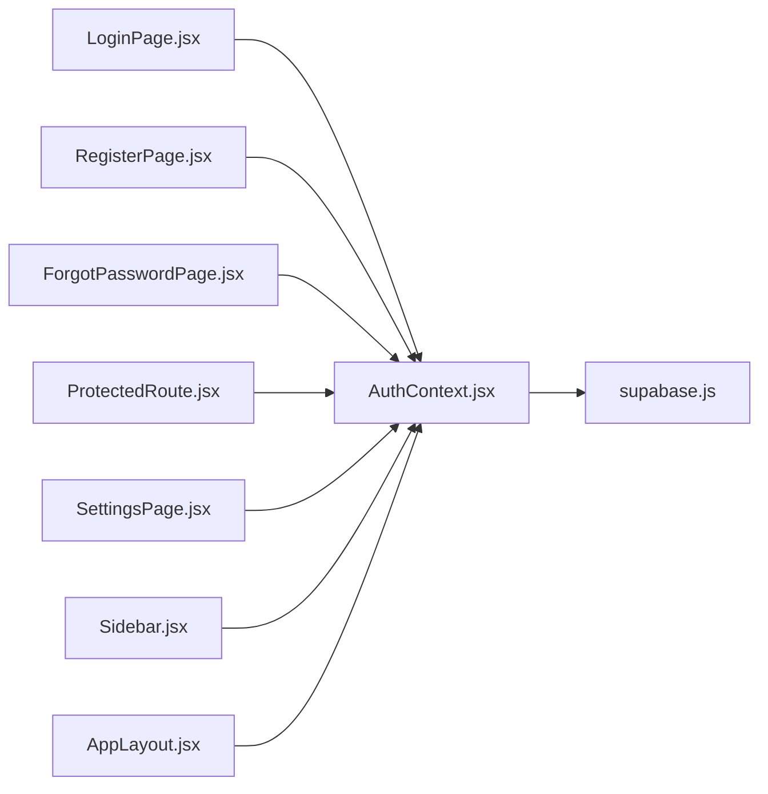

# Session Management and Security

<cite>
**Referenced Files in This Document**
- [AuthContext.jsx](file://src/contexts/AuthContext.jsx)
- [supabase.js](file://src/config/supabase.js)
- [supabaseService.js](file://src/services/supabaseService.js)
- [LoginPage.jsx](file://src/pages/auth/LoginPage.jsx)
- [RegisterPage.jsx](file://src/pages/auth/RegisterPage.jsx)
- [ForgotPasswordPage.jsx](file://src/pages/auth/ForgotPasswordPage.jsx)
- [ProtectedRoute.jsx](file://src/components/ProtectedRoute.jsx)
- [App.jsx](file://src/App.jsx)
- [main.jsx](file://src/main.jsx)
- [AppLayout.jsx](file://src/layouts/AppLayout.jsx)
- [SettingsPage.jsx](file://src/pages/dashboard/SettingsPage.jsx)
- [Sidebar.jsx](file://src/components/Sidebar.jsx)
- [package.json](file://package.json)
</cite>

## Table of Contents
1. [Introduction](#introduction)
2. [Project Structure](#project-structure)
3. [Core Components](#core-components)
4. [Architecture Overview](#architecture-overview)
5. [Detailed Component Analysis](#detailed-component-analysis)
6. [Dependency Analysis](#dependency-analysis)
7. [Performance Considerations](#performance-considerations)
8. [Security Considerations](#security-considerations)
9. [Troubleshooting Guide](#troubleshooting-guide)
10. [Conclusion](#conclusion)

## Introduction
This document explains the session management and security implementation of the application, focusing on the AuthContext provider and its integration with Supabase for authentication state management. It covers initialization of sessions, real-time auth state monitoring, automatic profile synchronization, protected routing, and logout/cleanup. It also outlines token management, secure storage practices, loading states, error recovery, and security considerations such as session validation and protection against session hijacking.

## Project Structure
The authentication and session management logic is centered around a React context provider that wraps the application and integrates with Supabase for authentication and database operations. Authentication-aware pages and protected routes ensure that only authenticated users can access protected areas.

**Diagram sources**
- [main.jsx:1-14](file://src/main.jsx#L1-L14)
- [App.jsx:1-50](file://src/App.jsx#L1-L50)
- [AuthContext.jsx:1-101](file://src/contexts/AuthContext.jsx#L1-L101)
- [supabase.js:1-7](file://src/config/supabase.js#L1-L7)
- [ProtectedRoute.jsx:1-18](file://src/components/ProtectedRoute.jsx#L1-L18)
- [AppLayout.jsx:1-42](file://src/layouts/AppLayout.jsx#L1-L42)
- [LoginPage.jsx:1-80](file://src/pages/auth/LoginPage.jsx#L1-L80)
- [RegisterPage.jsx:1-115](file://src/pages/auth/RegisterPage.jsx#L1-L115)
- [ForgotPasswordPage.jsx:1-71](file://src/pages/auth/ForgotPasswordPage.jsx#L1-L71)
- [supabaseService.js:1-132](file://src/services/supabaseService.js#L1-L132)

**Section sources**
- [main.jsx:1-14](file://src/main.jsx#L1-L14)
- [App.jsx:1-50](file://src/App.jsx#L1-L50)
- [AuthContext.jsx:1-101](file://src/contexts/AuthContext.jsx#L1-L101)
- [supabase.js:1-7](file://src/config/supabase.js#L1-L7)
- [ProtectedRoute.jsx:1-18](file://src/components/ProtectedRoute.jsx#L1-L18)
- [AppLayout.jsx:1-42](file://src/layouts/AppLayout.jsx#L1-L42)
- [LoginPage.jsx:1-80](file://src/pages/auth/LoginPage.jsx#L1-L80)
- [RegisterPage.jsx:1-115](file://src/pages/auth/RegisterPage.jsx#L1-L115)
- [ForgotPasswordPage.jsx:1-71](file://src/pages/auth/ForgotPasswordPage.jsx#L1-L71)
- [supabaseService.js:1-132](file://src/services/supabaseService.js#L1-L132)

## Core Components
- AuthContext provider maintains authentication state (user, session, profile, loading) and exposes actions for sign-up, sign-in, sign-out, password reset, profile fetch/update, and profile update.
- Supabase client is configured with environment variables for URL and anonymous key.
- ProtectedRoute enforces authentication for protected routes and displays a loading spinner while initial session is being resolved.
- Auth pages (login, register, forgot password) integrate with AuthContext to trigger authentication operations.

Key responsibilities:
- Initial session retrieval and real-time auth state monitoring via Supabase onAuthStateChange.
- Automatic profile fetching upon successful authentication.
- Exposing state and actions to all components via context.
- Providing route guards for protected content.

**Section sources**
- [AuthContext.jsx:6-101](file://src/contexts/AuthContext.jsx#L6-L101)
- [supabase.js:1-7](file://src/config/supabase.js#L1-L7)
- [ProtectedRoute.jsx:4-17](file://src/components/ProtectedRoute.jsx#L4-L17)
- [LoginPage.jsx:5-25](file://src/pages/auth/LoginPage.jsx#L5-L25)
- [RegisterPage.jsx:5-38](file://src/pages/auth/RegisterPage.jsx#L5-L38)
- [ForgotPasswordPage.jsx:5-24](file://src/pages/auth/ForgotPasswordPage.jsx#L5-L24)

## Architecture Overview
The authentication architecture centers on a single AuthProvider that initializes the session, subscribes to auth state changes, and synchronizes profile data. ProtectedRoute ensures only authenticated users can access protected pages. Auth pages coordinate with AuthContext to perform authentication operations.

**Diagram sources**
- [App.jsx:19-49](file://src/App.jsx#L19-L49)
- [AuthContext.jsx:12-30](file://src/contexts/AuthContext.jsx#L12-L30)
- [AuthContext.jsx:32-40](file://src/contexts/AuthContext.jsx#L32-L40)

## Detailed Component Analysis

### AuthContext Provider
The provider manages:
- State: user, session, profile, loading.
- Initialization: retrieves initial session and sets state accordingly.
- Real-time monitoring: subscribes to Supabase auth state changes and updates state.
- Profile sync: fetches profile after successful login.
- Actions: sign-up, sign-in, sign-out, reset password, fetch profile, update profile.

**Diagram sources**
- [AuthContext.jsx:6-101](file://src/contexts/AuthContext.jsx#L6-L101)
- [supabase.js:1-7](file://src/config/supabase.js#L1-L7)

Implementation highlights:
- Initial session retrieval and conditional profile fetch.
- Subscription to auth state changes for real-time updates.
- Loading state management during initialization and profile fetch.
- Error propagation from Supabase operations to callers.

**Section sources**
- [AuthContext.jsx:6-101](file://src/contexts/AuthContext.jsx#L6-L101)

### ProtectedRoute
Enforces authentication for protected routes:
- Displays a loading spinner while initial session resolution is in progress.
- Redirects unauthenticated users to the login page.
- Renders children when authenticated.

**Diagram sources**
- [ProtectedRoute.jsx:4-17](file://src/components/ProtectedRoute.jsx#L4-L17)

**Section sources**
- [ProtectedRoute.jsx:4-17](file://src/components/ProtectedRoute.jsx#L4-L17)

### Auth Pages Integration
- LoginPage: triggers sign-in action and navigates on success.
- RegisterPage: validates form, triggers sign-up, and navigates on success.
- ForgotPasswordPage: triggers password reset and shows success feedback.

**Diagram sources**
- [LoginPage.jsx:13-25](file://src/pages/auth/LoginPage.jsx#L13-L25)
- [RegisterPage.jsx:16-38](file://src/pages/auth/RegisterPage.jsx#L16-L38)
- [ForgotPasswordPage.jsx:12-24](file://src/pages/auth/ForgotPasswordPage.jsx#L12-L24)
- [AuthContext.jsx:42-72](file://src/contexts/AuthContext.jsx#L42-L72)

**Section sources**
- [LoginPage.jsx:13-25](file://src/pages/auth/LoginPage.jsx#L13-L25)
- [RegisterPage.jsx:16-38](file://src/pages/auth/RegisterPage.jsx#L16-L38)
- [ForgotPasswordPage.jsx:12-24](file://src/pages/auth/ForgotPasswordPage.jsx#L12-L24)
- [AuthContext.jsx:42-72](file://src/contexts/AuthContext.jsx#L42-L72)

### Profile Synchronization and Settings
- Profile is fetched automatically after login and updated via updateProfile.
- Settings page allows updating display name and signing out.

**Diagram sources**
- [SettingsPage.jsx:12-23](file://src/pages/dashboard/SettingsPage.jsx#L12-L23)
- [AuthContext.jsx:74-84](file://src/contexts/AuthContext.jsx#L74-L84)

**Section sources**
- [SettingsPage.jsx:12-23](file://src/pages/dashboard/SettingsPage.jsx#L12-L23)
- [AuthContext.jsx:74-84](file://src/contexts/AuthContext.jsx#L74-L84)

### Logout and Cleanup
- Sign-out is performed via Supabase auth sign-out.
- Sidebar triggers sign-out and navigates to login.

**Diagram sources**
- [Sidebar.jsx:31-34](file://src/components/Sidebar.jsx#L31-L34)
- [AuthContext.jsx:64-67](file://src/contexts/AuthContext.jsx#L64-L67)

**Section sources**
- [Sidebar.jsx:31-34](file://src/components/Sidebar.jsx#L31-L34)
- [AuthContext.jsx:64-67](file://src/contexts/AuthContext.jsx#L64-L67)

## Dependency Analysis
- AuthContext depends on Supabase client for authentication and database operations.
- Auth pages depend on AuthContext for authentication actions.
- ProtectedRoute depends on AuthContext for user state and loading state.
- AppLayout and other components consume context values for rendering UI and enabling features.

**Diagram sources**
- [AuthContext.jsx:1-101](file://src/contexts/AuthContext.jsx#L1-L101)
- [supabase.js:1-7](file://src/config/supabase.js#L1-L7)
- [LoginPage.jsx:1-80](file://src/pages/auth/LoginPage.jsx#L1-L80)
- [RegisterPage.jsx:1-115](file://src/pages/auth/RegisterPage.jsx#L1-L115)
- [ForgotPasswordPage.jsx:1-71](file://src/pages/auth/ForgotPasswordPage.jsx#L1-L71)
- [ProtectedRoute.jsx:1-18](file://src/components/ProtectedRoute.jsx#L1-L18)
- [SettingsPage.jsx:1-41](file://src/pages/dashboard/SettingsPage.jsx#L1-L41)
- [Sidebar.jsx:1-66](file://src/components/Sidebar.jsx#L1-L66)
- [AppLayout.jsx:1-42](file://src/layouts/AppLayout.jsx#L1-L42)

**Section sources**
- [AuthContext.jsx:1-101](file://src/contexts/AuthContext.jsx#L1-L101)
- [supabase.js:1-7](file://src/config/supabase.js#L1-L7)
- [LoginPage.jsx:1-80](file://src/pages/auth/LoginPage.jsx#L1-L80)
- [RegisterPage.jsx:1-115](file://src/pages/auth/RegisterPage.jsx#L1-L115)
- [ForgotPasswordPage.jsx:1-71](file://src/pages/auth/ForgotPasswordPage.jsx#L1-L71)
- [ProtectedRoute.jsx:1-18](file://src/components/ProtectedRoute.jsx#L1-L18)
- [SettingsPage.jsx:1-41](file://src/pages/dashboard/SettingsPage.jsx#L1-L41)
- [Sidebar.jsx:1-66](file://src/components/Sidebar.jsx#L1-L66)
- [AppLayout.jsx:1-42](file://src/layouts/AppLayout.jsx#L1-L42)

## Performance Considerations
- Minimize unnecessary re-renders by keeping authentication state granular and avoiding heavy computations in the provider.
- Debounce or batch profile updates to reduce database writes.
- Use loading states to prevent redundant operations during initialization and transitions.
- Offload heavy tasks to services or background threads where appropriate.

## Security Considerations
- Environment variables: Supabase URL and anonymous key are loaded from environment variables. Ensure these are properly configured and not exposed in client-side code.
- Token management: Supabase handles JWT tokens internally. Rely on Supabase’s built-in token refresh and validation mechanisms.
- Secure storage: No sensitive data is stored in local storage in the current implementation; authentication state is maintained in memory and synchronized via Supabase.
- Session validation: The provider listens to auth state changes to keep the client state in sync with the server.
- Protection against session hijacking: Use HTTPS in production, enforce secure cookies on the server, and avoid storing tokens in insecure locations.
- Inactivity handling: Implement idle timers to detect inactivity and trigger logout or token refresh prompts.
- Password policies: Enforce strong passwords and consider rate limiting for authentication attempts.

## Troubleshooting Guide
Common issues and resolutions:
- Initial session not detected: Verify environment variables for Supabase URL and anonymous key are set correctly.
- Auth state not updating: Ensure onAuthStateChange subscription is active and not unsubscribed prematurely.
- Profile not loading: Confirm database permissions and that the profiles table exists with the expected schema.
- Navigation loops: Check ProtectedRoute logic and ensure redirects occur only when user is null and loading is false.
- Error handling: Surface errors from Supabase operations to users and log them for debugging.

**Section sources**
- [AuthContext.jsx:12-30](file://src/contexts/AuthContext.jsx#L12-L30)
- [ProtectedRoute.jsx:7-13](file://src/components/ProtectedRoute.jsx#L7-L13)
- [LoginPage.jsx:20-24](file://src/pages/auth/LoginPage.jsx#L20-L24)
- [RegisterPage.jsx:33-37](file://src/pages/auth/RegisterPage.jsx#L33-L37)
- [ForgotPasswordPage.jsx:19-23](file://src/pages/auth/ForgotPasswordPage.jsx#L19-L23)

## Conclusion
The application’s session management leverages a centralized AuthContext provider integrated with Supabase for robust authentication state handling. It initializes sessions, monitors auth state changes in real time, synchronizes user profiles, and enforces route protection. By following the outlined security practices and troubleshooting steps, the system maintains secure and reliable authentication across components.