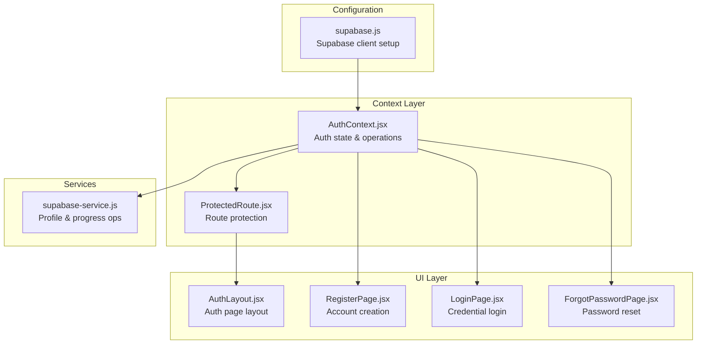
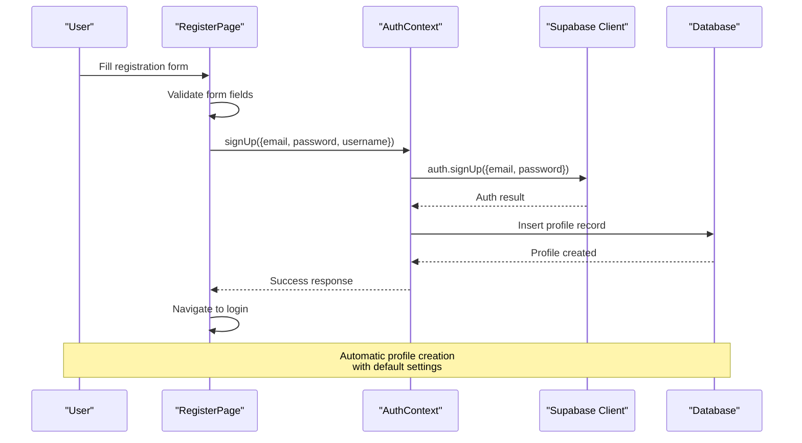
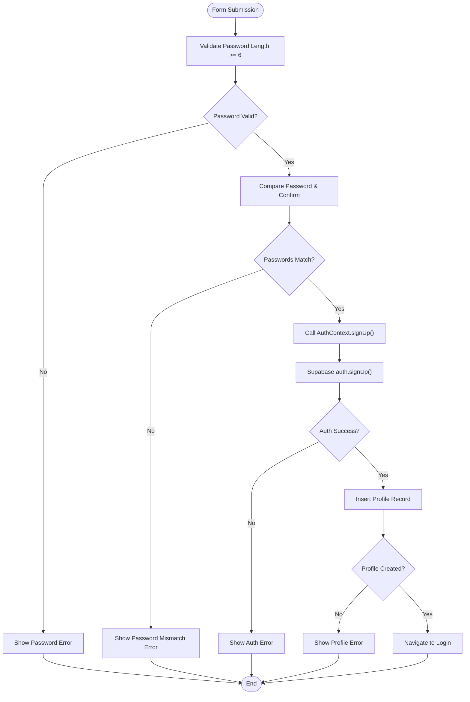
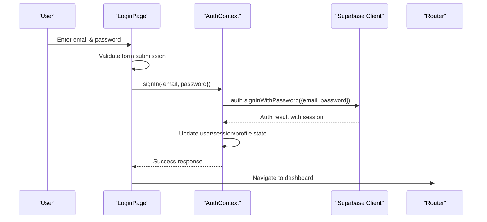
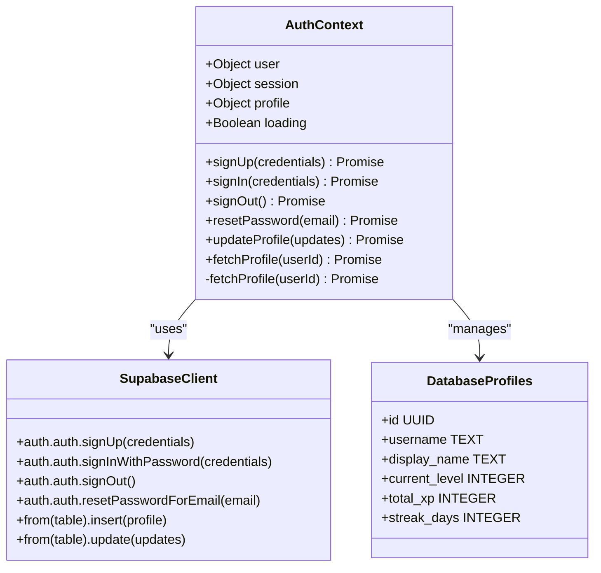
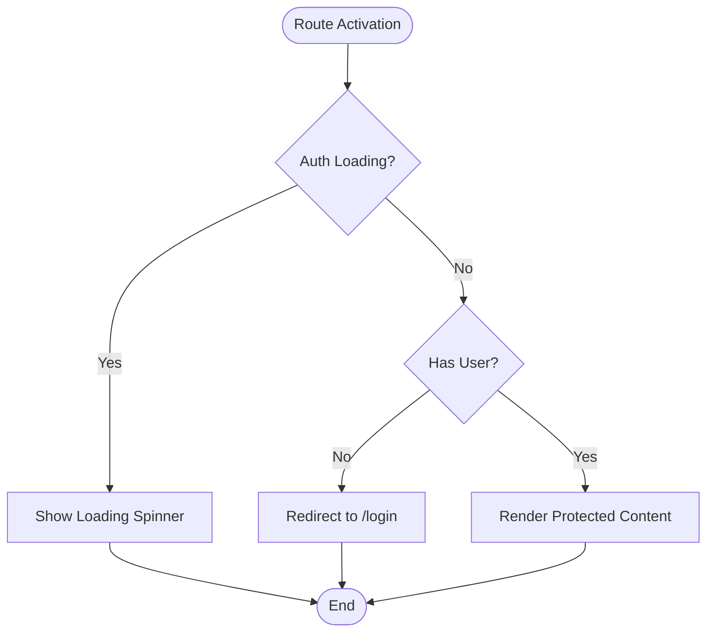
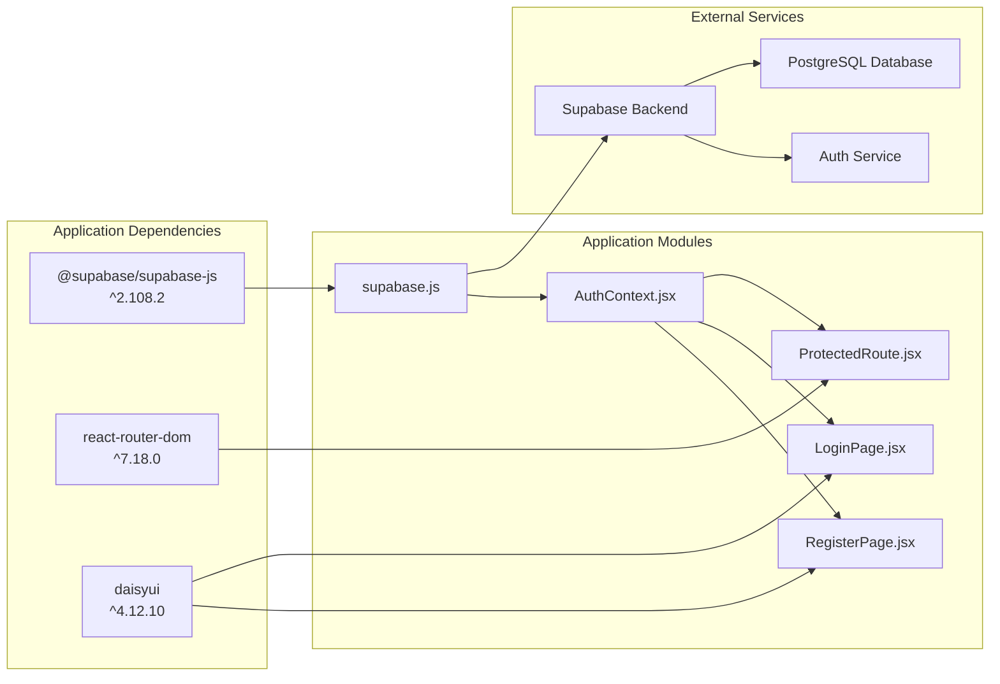

# User Registration and Login

<cite>
**Referenced Files in This Document**
- [supabase.js](file://src/config/supabase.js)
- [AuthContext.jsx](file://src/contexts/AuthContext.jsx)
- [RegisterPage.jsx](file://src/pages/auth/RegisterPage.jsx)
- [LoginPage.jsx](file://src/pages/auth/LoginPage.jsx)
- [ForgotPasswordPage.jsx](file://src/pages/auth/ForgotPasswordPage.jsx)
- [ProtectedRoute.jsx](file://src/components/ProtectedRoute.jsx)
- [AuthLayout.jsx](file://src/layouts/AuthLayout.jsx)
- [App.jsx](file://src/App.jsx)
- [supabase-service.js](file://src/services/supabaseService.js)
- [supabase-schema.sql](file://supabase-schema.sql)
- [package.json](file://package.json)
</cite>

## Table of Contents
1. [Introduction](#introduction)
2. [Project Structure](#project-structure)
3. [Core Components](#core-components)
4. [Architecture Overview](#architecture-overview)
5. [Detailed Component Analysis](#detailed-component-analysis)
6. [Dependency Analysis](#dependency-analysis)
7. [Performance Considerations](#performance-considerations)
8. [Security Considerations](#security-considerations)
9. [Troubleshooting Guide](#troubleshooting-guide)
10. [Best Practices and Extensions](#best-practices-and-extensions)
11. [Conclusion](#conclusion)

## Introduction
This document provides comprehensive documentation for the user registration and login functionality in the Flinggo application. It covers the complete authentication flow from user input through Supabase API calls to state management, including the signUp and signIn functions, form handling, validation, error handling, and security considerations. The documentation explains how the system integrates React context, Supabase client configuration, and protected routing to deliver a seamless authentication experience.

## Project Structure
The authentication system is organized around several key modules:
- Supabase client configuration for connecting to the backend
- Authentication context managing user state and auth operations
- Dedicated pages for registration, login, and password reset
- Protected route wrapper for securing application routes
- Layout components for authentication views
- Supporting service utilities for profile and progress operations

**Diagram sources**
- [supabase.js:1-7](file://src/config/supabase.js#L1-L7)
- [AuthContext.jsx:1-101](file://src/contexts/AuthContext.jsx#L1-L101)
- [ProtectedRoute.jsx:1-18](file://src/components/ProtectedRoute.jsx#L1-L18)
- [AuthLayout.jsx:1-17](file://src/layouts/AuthLayout.jsx#L1-L17)
- [RegisterPage.jsx:1-115](file://src/pages/auth/RegisterPage.jsx#L1-L115)
- [LoginPage.jsx:1-80](file://src/pages/auth/LoginPage.jsx#L1-L80)
- [ForgotPasswordPage.jsx:1-71](file://src/pages/auth/ForgotPasswordPage.jsx#L1-L71)
- [supabase-service.js:1-132](file://src/services/supabaseService.js#L1-L132)

**Section sources**
- [App.jsx:19-49](file://src/App.jsx#L19-L49)
- [package.json:11-21](file://package.json#L11-L21)

## Core Components
The authentication system centers on four primary components:

### Supabase Client Configuration
The Supabase client is configured using environment variables for secure credentials storage. The client provides the foundation for all authentication operations including sign-up, sign-in, session management, and password reset.

### Authentication Context
The AuthContext manages:
- User session state and profile data
- Authentication lifecycle (initialization, change events)
- Core authentication operations (signUp, signIn, signOut, resetPassword)
- Profile CRUD operations
- Loading state management during auth transitions

### Authentication Pages
Three dedicated pages handle the user-facing authentication flows:
- Registration form with validation and error handling
- Login form with credential validation
- Password reset form with success/error feedback

### Protected Routing
The ProtectedRoute component ensures that only authenticated users can access protected application routes, while providing loading states during session initialization.

**Section sources**
- [supabase.js:1-7](file://src/config/supabase.js#L1-L7)
- [AuthContext.jsx:6-101](file://src/contexts/AuthContext.jsx#L6-L101)
- [RegisterPage.jsx:5-115](file://src/pages/auth/RegisterPage.jsx#L5-L115)
- [LoginPage.jsx:5-80](file://src/pages/auth/LoginPage.jsx#L5-L80)
- [ForgotPasswordPage.jsx:5-71](file://src/pages/auth/ForgotPasswordPage.jsx#L5-L71)
- [ProtectedRoute.jsx:4-17](file://src/components/ProtectedRoute.jsx#L4-L17)

## Architecture Overview
The authentication architecture follows a layered approach with clear separation of concerns:

**Diagram sources**
- [RegisterPage.jsx:16-38](file://src/pages/auth/RegisterPage.jsx#L16-L38)
- [AuthContext.jsx:42-56](file://src/contexts/AuthContext.jsx#L42-L56)
- [supabase.js:1-7](file://src/config/supabase.js#L1-L7)

The system initializes authentication state on application load, subscribes to auth state changes, and maintains synchronized user and profile data. Session persistence is handled automatically by Supabase, with the context layer ensuring consistent state across the application.

**Section sources**
- [AuthContext.jsx:12-30](file://src/contexts/AuthContext.jsx#L12-L30)
- [AuthContext.jsx:32-40](file://src/contexts/AuthContext.jsx#L32-L40)

## Detailed Component Analysis

### Registration Flow Analysis
The registration process involves comprehensive client-side validation followed by server-side authentication and profile creation.

**Diagram sources**
- [RegisterPage.jsx:16-38](file://src/pages/auth/RegisterPage.jsx#L16-L38)
- [AuthContext.jsx:42-56](file://src/contexts/AuthContext.jsx#L42-L56)

#### Registration Implementation Details
The registration function performs the following steps:
1. Client-side validation for password length and confirmation match
2. Supabase authentication sign-up operation
3. Automatic profile creation in the profiles table with default settings
4. Navigation to the login page upon successful completion

The profile creation includes default values for user settings such as current level, total XP, and streak days, ensuring new users have a complete profile immediately after registration.

**Section sources**
- [RegisterPage.jsx:16-38](file://src/pages/auth/RegisterPage.jsx#L16-L38)
- [AuthContext.jsx:42-56](file://src/contexts/AuthContext.jsx#L42-L56)

### Login Flow Analysis
The login process focuses on credential validation and session establishment.

**Diagram sources**
- [LoginPage.jsx:13-25](file://src/pages/auth/LoginPage.jsx#L13-L25)
- [AuthContext.jsx:58-62](file://src/contexts/AuthContext.jsx#L58-L62)

#### Login Implementation Details
The login function handles:
- Form submission with loading state management
- Credential validation through Supabase authentication
- Session establishment and state synchronization
- Navigation to the protected dashboard route

The system leverages Supabase's built-in session management, eliminating the need for manual token handling while providing robust session persistence across browser sessions.

**Section sources**
- [LoginPage.jsx:13-25](file://src/pages/auth/LoginPage.jsx#L13-L25)
- [AuthContext.jsx:58-62](file://src/contexts/AuthContext.jsx#L58-L62)

### Authentication Context Operations
The AuthContext provides centralized management of authentication operations and state synchronization.

**Diagram sources**
- [AuthContext.jsx:42-84](file://src/contexts/AuthContext.jsx#L42-L84)
- [supabase.js:1-7](file://src/config/supabase.js#L1-L7)

#### Key Operations
- **signUp**: Creates user account and initializes profile with defaults
- **signIn**: Establishes session using email/password credentials
- **signOut**: Terminates active session
- **resetPassword**: Sends password reset email
- **updateProfile**: Modifies user profile attributes
- **fetchProfile**: Retrieves current user profile data

**Section sources**
- [AuthContext.jsx:42-84](file://src/contexts/AuthContext.jsx#L42-L84)

### Protected Route Implementation
The ProtectedRoute component ensures application security by controlling access to protected routes.

**Diagram sources**
- [ProtectedRoute.jsx:4-17](file://src/components/ProtectedRoute.jsx#L4-L17)

**Section sources**
- [ProtectedRoute.jsx:4-17](file://src/components/ProtectedRoute.jsx#L4-L17)

## Dependency Analysis
The authentication system relies on several key dependencies and external services:

**Diagram sources**
- [package.json:11-21](file://package.json#L11-L21)
- [supabase.js:1-7](file://src/config/supabase.js#L1-L7)
- [AuthContext.jsx:1-3](file://src/contexts/AuthContext.jsx#L1-L3)

**Section sources**
- [package.json:11-21](file://package.json#L11-L21)

## Performance Considerations
The authentication system incorporates several performance optimizations:

- **Lazy Loading**: Authentication context is initialized only once at application startup
- **Efficient State Updates**: Minimal re-renders through targeted state updates
- **Session Persistence**: Supabase handles session caching to reduce network requests
- **Conditional Rendering**: Loading states prevent unnecessary computations during auth transitions
- **Database Indexing**: Strategic indexing on frequently queried columns (user_id, XP rankings)

## Security Considerations

### Password Handling
- Passwords are transmitted securely using HTTPS encryption
- Client-side validation prevents weak passwords (minimum 6 characters)
- Supabase handles password hashing and salt generation server-side
- No plaintext password storage occurs in the client application

### Email Verification
- Supabase provides built-in email verification capabilities
- The system can be extended to require email verification before account activation
- Verification links are sent securely via Supabase's email service

### Session Security
- Supabase manages secure session tokens with appropriate expiration policies
- Session state is synchronized across browser tabs and windows
- Protected routes prevent unauthorized access to sensitive areas
- Automatic logout on session expiration

### Data Protection
- Row-level security policies protect user data privacy
- Profile data is only accessible to authorized users
- Database constraints prevent duplicate usernames and invalid data
- Environment variables store sensitive Supabase credentials

**Section sources**
- [supabase-schema.sql:17-25](file://supabase-schema.sql#L17-L25)
- [supabase-schema.sql:41-45](file://supabase-schema.sql#L41-L45)

## Troubleshooting Guide

### Common Registration Issues
- **Password Too Short**: Ensure passwords meet minimum 6-character requirement
- **Password Mismatch**: Verify password and confirmation fields match exactly
- **Email Already Exists**: Check for existing accounts before attempting registration
- **Network Errors**: Verify internet connectivity and Supabase service availability

### Common Login Issues
- **Invalid Credentials**: Confirm email and password combination is correct
- **Account Not Verified**: Check email for verification instructions
- **Session Expired**: Re-authenticate if session has timed out
- **Account Locked**: Contact support if account appears locked

### Debugging Authentication State
- Check browser console for Supabase error messages
- Verify environment variables are properly configured
- Monitor network tab for authentication API responses
- Use Supabase dashboard to inspect user records and authentication logs

### Form Validation Errors
- Password validation errors indicate client-side validation failures
- Network errors suggest backend communication issues
- Success indicators show proper authentication flow completion

**Section sources**
- [RegisterPage.jsx:20-27](file://src/pages/auth/RegisterPage.jsx#L20-L27)
- [RegisterPage.jsx:33-37](file://src/pages/auth/RegisterPage.jsx#L33-L37)
- [LoginPage.jsx:20-24](file://src/pages/auth/LoginPage.jsx#L20-L24)

## Best Practices and Extensions

### Form Enhancement Recommendations
- Add real-time validation feedback for improved user experience
- Implement CAPTCHA for bot prevention on registration forms
- Add password strength meter for better security education
- Include email format validation before submission
- Add field-specific error messages for better user guidance

### Security Enhancements
- Implement rate limiting for authentication attempts
- Add two-factor authentication support
- Integrate email verification workflow
- Add account lockout mechanisms after failed attempts
- Implement password history requirements

### User Experience Improvements
- Add loading spinners during authentication operations
- Implement success notifications for completed actions
- Add remember me functionality for session persistence
- Include social login options (Google, GitHub)
- Add account recovery options for forgotten credentials

### Database Schema Extensions
- Add user preferences table for customizable settings
- Implement audit logging for authentication events
- Add device fingerprinting for suspicious activity detection
- Include account activity timestamps for monitoring

### Testing Strategies
- Unit tests for form validation logic
- Integration tests for Supabase authentication flows
- End-to-end tests for complete registration/login cycles
- Security testing for vulnerability assessment
- Performance testing under load conditions

**Section sources**
- [AuthContext.jsx:42-84](file://src/contexts/AuthContext.jsx#L42-L84)
- [supabase-schema.sql:4-15](file://supabase-schema.sql#L4-L15)

## Conclusion
The Flinggo authentication system provides a robust, secure, and user-friendly foundation for user registration and login. Built on Supabase's reliable infrastructure, the system offers comprehensive authentication capabilities with clean separation of concerns, efficient state management, and strong security practices. The modular architecture enables easy extension and enhancement while maintaining consistency across the application. The implementation demonstrates best practices in modern React applications, combining Supabase's powerful backend services with React's component-based architecture to deliver a seamless user experience.