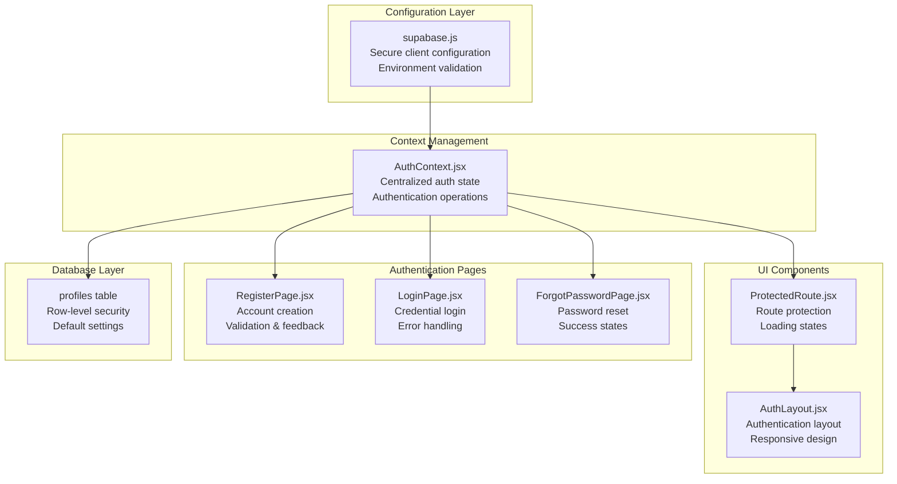
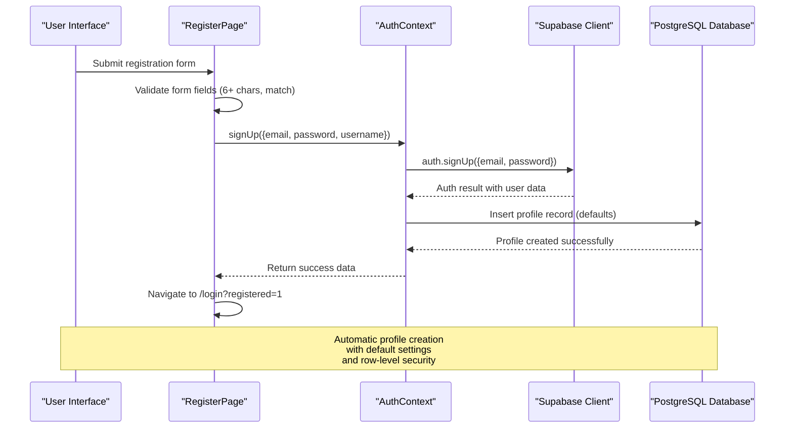
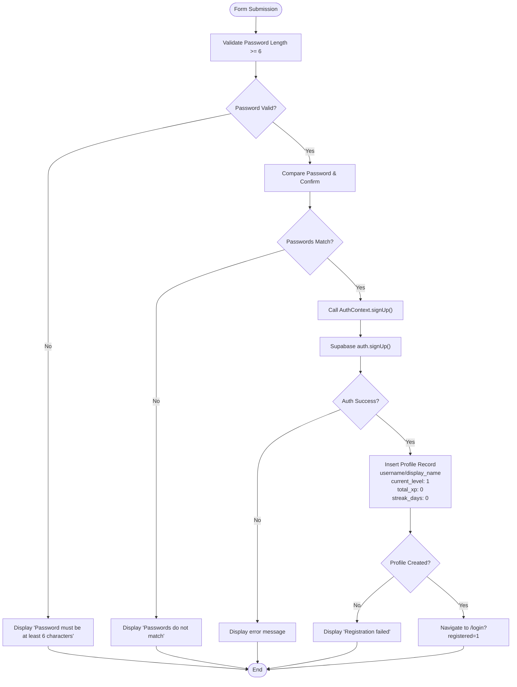
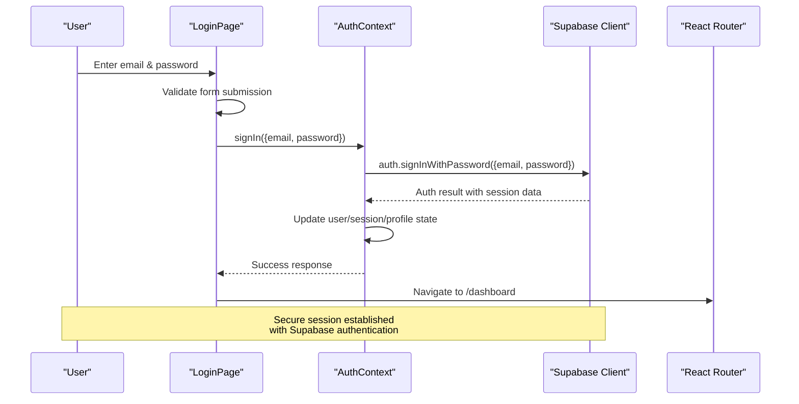
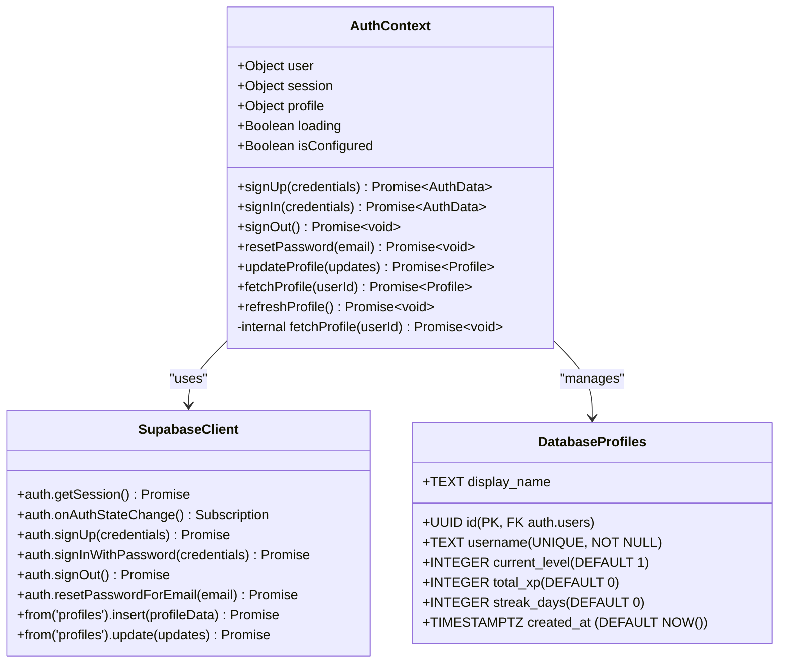
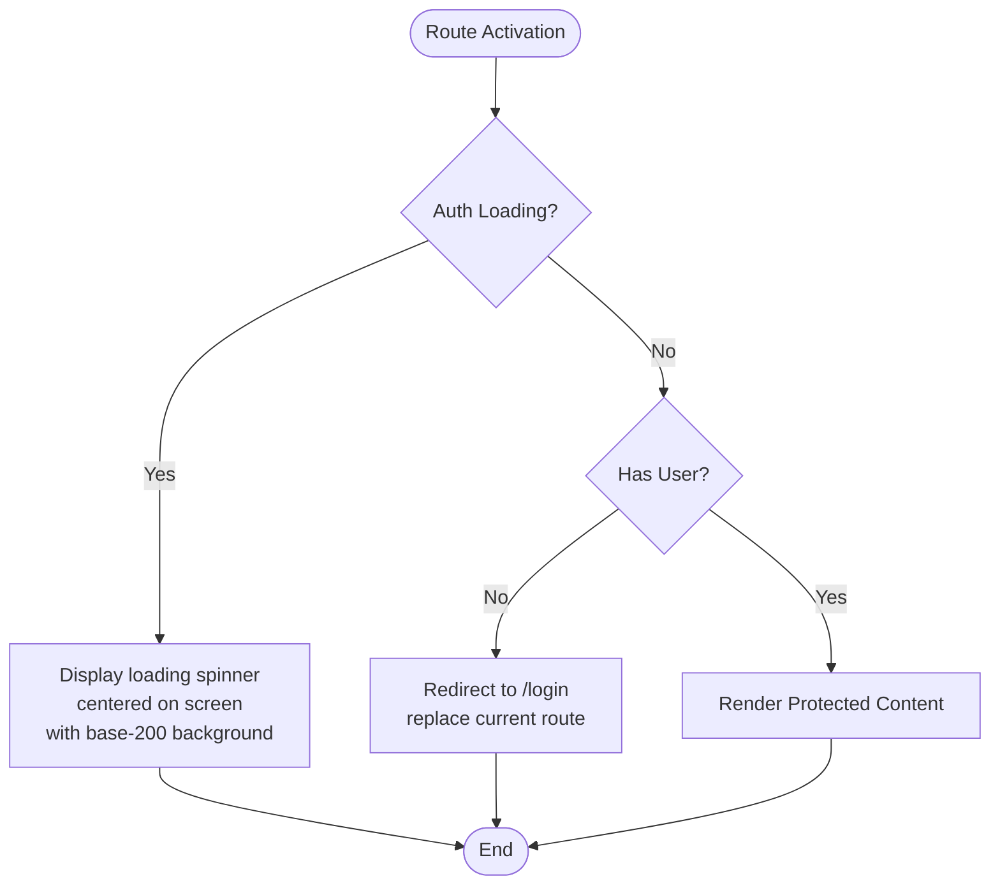
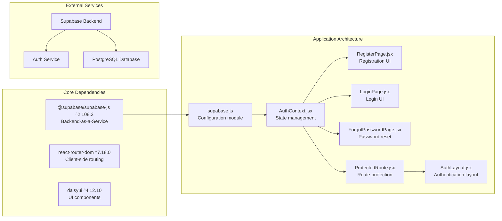

# User Registration and Login

<cite>
**Referenced Files in This Document**
- [supabase.js](file://src/config/supabase.js)
- [AuthContext.jsx](file://src/contexts/AuthContext.jsx)
- [RegisterPage.jsx](file://src/pages/auth/RegisterPage.jsx)
- [LoginPage.jsx](file://src/pages/auth/LoginPage.jsx)
- [ForgotPasswordPage.jsx](file://src/pages/auth/ForgotPasswordPage.jsx)
- [ProtectedRoute.jsx](file://src/components/ProtectedRoute.jsx)
- [AuthLayout.jsx](file://src/layouts/AuthLayout.jsx)
- [App.jsx](file://src/App.jsx)
- [supabase-schema.sql](file://supabase-schema.sql)
- [package.json](file://package.json)
</cite>

## Update Summary
**Changes Made**
- Complete rewrite of authentication system with new Supabase integration
- Updated AuthContext.jsx with comprehensive authentication operations
- Enhanced ProtectedRoute.jsx with loading state management
- Added password reset functionality
- Improved error handling and validation
- Updated database schema for profiles table with row-level security

## Table of Contents
1. [Introduction](#introduction)
2. [Project Structure](#project-structure)
3. [Core Components](#core-components)
4. [Architecture Overview](#architecture-overview)
5. [Detailed Component Analysis](#detailed-component-analysis)
6. [Dependency Analysis](#dependency-analysis)
7. [Performance Considerations](#performance-considerations)
8. [Security Considerations](#security-considerations)
9. [Troubleshooting Guide](#troubleshooting-guide)
10. [Best Practices and Extensions](#best-practices-and-extensions)
11. [Conclusion](#conclusion)

## Introduction
This document provides comprehensive documentation for the user registration and login functionality in the Flinggo application. The authentication system has been completely rewritten with a modern Supabase integration, featuring a robust context-based architecture that manages user sessions, profile data, and authentication operations. The system provides seamless user registration, login, password reset functionality, and comprehensive error handling with enhanced security measures.

## Project Structure
The authentication system is organized around a modern React context architecture with Supabase integration:

**Diagram sources**
- [supabase.js:1-32](file://src/config/supabase.js#L1-L32)
- [AuthContext.jsx:1-126](file://src/contexts/AuthContext.jsx#L1-L126)
- [ProtectedRoute.jsx:1-18](file://src/components/ProtectedRoute.jsx#L1-L18)
- [AuthLayout.jsx:1-17](file://src/layouts/AuthLayout.jsx#L1-L17)
- [RegisterPage.jsx:1-115](file://src/pages/auth/RegisterPage.jsx#L1-L115)
- [LoginPage.jsx:1-80](file://src/pages/auth/LoginPage.jsx#L1-L80)
- [ForgotPasswordPage.jsx:1-71](file://src/pages/auth/ForgotPasswordPage.jsx#L1-L71)

**Section sources**
- [App.jsx:19-49](file://src/App.jsx#L19-L49)
- [package.json:11-21](file://package.json#L11-L21)

## Core Components
The authentication system consists of five primary components working together:

### Supabase Configuration
The Supabase client is configured with environment validation and fallback mechanisms for secure credential storage. The configuration includes URL validation, anonymous key checking, and graceful degradation when environment variables are missing.

### Authentication Context
The AuthContext provides comprehensive authentication management including:
- User session state and profile data synchronization
- Real-time auth state change subscriptions
- Complete authentication lifecycle management
- Profile CRUD operations with database integration
- Loading state management during initialization and operations

### Authentication Pages
Four dedicated pages handle the complete user authentication flow:
- Registration form with comprehensive validation
- Login form with credential validation and navigation
- Password reset form with success/error feedback
- Authentication layout with responsive design

### Protected Routing
The ProtectedRoute component ensures application security with loading states and proper user redirection during authentication initialization.

**Section sources**
- [supabase.js:1-32](file://src/config/supabase.js#L1-L32)
- [AuthContext.jsx:6-126](file://src/contexts/AuthContext.jsx#L6-L126)
- [RegisterPage.jsx:5-115](file://src/pages/auth/RegisterPage.jsx#L5-L115)
- [LoginPage.jsx:5-80](file://src/pages/auth/LoginPage.jsx#L5-L80)
- [ForgotPasswordPage.jsx:5-71](file://src/pages/auth/ForgotPasswordPage.jsx#L5-L71)
- [ProtectedRoute.jsx:4-17](file://src/components/ProtectedRoute.jsx#L4-L17)

## Architecture Overview
The authentication architecture follows a modern React context pattern with Supabase backend integration:

**Diagram sources**
- [RegisterPage.jsx:16-38](file://src/pages/auth/RegisterPage.jsx#L16-L38)
- [AuthContext.jsx:57-72](file://src/contexts/AuthContext.jsx#L57-L72)
- [supabase.js:1-32](file://src/config/supabase.js#L1-L32)

The system initializes authentication state on application load, establishes real-time subscriptions for auth state changes, and maintains synchronized user and profile data across the application. Session persistence is handled automatically by Supabase with comprehensive error handling and loading state management.

**Section sources**
- [AuthContext.jsx:12-41](file://src/contexts/AuthContext.jsx#L12-L41)
- [AuthContext.jsx:43-55](file://src/contexts/AuthContext.jsx#L43-L55)

## Detailed Component Analysis

### Registration Flow Analysis
The registration process implements comprehensive client-side validation followed by server-side authentication and automatic profile creation.

**Diagram sources**
- [RegisterPage.jsx:16-38](file://src/pages/auth/RegisterPage.jsx#L16-L38)
- [AuthContext.jsx:57-72](file://src/contexts/AuthContext.jsx#L57-L72)

#### Registration Implementation Details
The registration function performs the following critical steps:
1. **Client-side validation**: Password length validation (minimum 6 characters) and password confirmation matching
2. **Supabase authentication**: Secure sign-up operation with encrypted credentials
3. **Automatic profile creation**: Database insertion with default user settings
4. **Navigation handling**: Redirect to login page with success indicator

The profile creation includes comprehensive default values for user settings including current level (1), total XP (0), streak days (0), and automatic timestamp generation, ensuring new users have a complete profile immediately after registration.

**Section sources**
- [RegisterPage.jsx:16-38](file://src/pages/auth/RegisterPage.jsx#L16-L38)
- [AuthContext.jsx:57-72](file://src/contexts/AuthContext.jsx#L57-L72)
- [supabase-schema.sql:4-15](file://supabase-schema.sql#L4-L15)

### Login Flow Analysis
The login process focuses on secure credential validation and session establishment with comprehensive error handling.

**Diagram sources**
- [LoginPage.jsx:13-25](file://src/pages/auth/LoginPage.jsx#L13-L25)
- [AuthContext.jsx:74-79](file://src/contexts/AuthContext.jsx#L74-L79)

#### Login Implementation Details
The login function handles:
- **Form submission**: Controlled state management for email and password
- **Loading states**: Visual feedback during authentication operations
- **Credential validation**: Supabase authentication with encrypted credentials
- **Session establishment**: Automatic session creation and state synchronization
- **Navigation**: Protected route navigation to dashboard

The system leverages Supabase's built-in session management with automatic token handling, session persistence across browser sessions, and real-time state synchronization.

**Section sources**
- [LoginPage.jsx:13-25](file://src/pages/auth/LoginPage.jsx#L13-L25)
- [AuthContext.jsx:74-79](file://src/contexts/AuthContext.jsx#L74-L79)

### Authentication Context Operations
The AuthContext provides centralized management of all authentication operations with comprehensive state synchronization and error handling.

**Diagram sources**
- [AuthContext.jsx:57-108](file://src/contexts/AuthContext.jsx#L57-L108)
- [supabase.js:1-32](file://src/config/supabase.js#L1-L32)

#### Key Operations
- **signUp**: Creates user account with automatic profile initialization
- **signIn**: Establishes session using secure credential authentication
- **signOut**: Terminates active session with error handling
- **resetPassword**: Sends password reset email via Supabase
- **updateProfile**: Modifies user profile attributes with validation
- **fetchProfile**: Retrieves current user profile data with error handling
- **refreshProfile**: Updates profile data after game activity

**Section sources**
- [AuthContext.jsx:57-108](file://src/contexts/AuthContext.jsx#L57-L108)

### Protected Route Implementation
The ProtectedRoute component ensures application security with comprehensive loading state management and user redirection.

**Diagram sources**
- [ProtectedRoute.jsx:4-17](file://src/components/ProtectedRoute.jsx#L4-L17)

**Section sources**
- [ProtectedRoute.jsx:4-17](file://src/components/ProtectedRoute.jsx#L4-L17)

## Dependency Analysis
The authentication system relies on modern React patterns and Supabase infrastructure:

**Diagram sources**
- [package.json:11-21](file://package.json#L11-L21)
- [supabase.js:1-32](file://src/config/supabase.js#L1-L32)
- [AuthContext.jsx:1-3](file://src/contexts/AuthContext.jsx#L1-L3)

**Section sources**
- [package.json:11-21](file://package.json#L11-L21)

## Performance Considerations
The authentication system incorporates several performance optimizations:

- **Lazy Loading**: Authentication context initialized only once at application startup
- **Efficient State Updates**: Minimal re-renders through targeted state updates and context separation
- **Session Persistence**: Supabase handles intelligent session caching to reduce network requests
- **Real-time Subscriptions**: Efficient auth state change subscriptions with proper cleanup
- **Conditional Rendering**: Loading states prevent unnecessary computations during auth transitions
- **Database Optimization**: Strategic indexing on frequently queried columns (user_id, XP rankings)
- **Environment Validation**: Graceful fallbacks prevent runtime crashes and improve reliability

## Security Considerations

### Password Handling
- **Encrypted Transmission**: All authentication data transmitted via HTTPS encryption
- **Client-side Validation**: Prevents weak passwords (minimum 6 characters enforced)
- **Server-side Hashing**: Supabase handles password hashing and salt generation
- **No Plaintext Storage**: Client application never stores plaintext passwords
- **Secure Reset**: Password reset emails sent securely via Supabase email service

### Email Verification
- **Built-in Verification**: Supabase provides native email verification capabilities
- **Extensible Workflow**: System designed to support email verification requirements
- **Verification Links**: Secure email delivery through Supabase authentication service

### Session Security
- **Automatic Token Management**: Supabase handles secure session tokens with expiration policies
- **Real-time Synchronization**: Session state synchronized across browser tabs/windows
- **Protected Routes**: Comprehensive route protection preventing unauthorized access
- **Automatic Logout**: Session termination on expiration with proper cleanup

### Data Protection
- **Row-Level Security**: PostgreSQL RLS protects user data privacy
- **Profile Isolation**: Users can only access their own profile data
- **Database Constraints**: Prevents duplicate usernames and validates data integrity
- **Environment Security**: Sensitive Supabase credentials stored in environment variables
- **Graceful Degradation**: System continues with limited functionality when not configured

**Section sources**
- [supabase-schema.sql:17-25](file://supabase-schema.sql#L17-L25)
- [supabase-schema.sql:41-45](file://supabase-schema.sql#L41-L45)
- [supabase.js:24-29](file://src/config/supabase.js#L24-L29)

## Troubleshooting Guide

### Common Registration Issues
- **Password Too Short**: Ensure passwords meet minimum 6-character requirement
- **Password Mismatch**: Verify password and confirmation fields match exactly
- **Email Already Exists**: Check for existing accounts before attempting registration
- **Network Connectivity**: Verify internet connection and Supabase service availability
- **Environment Variables**: Check .env file contains valid VITE_SUPABASE_URL and VITE_SUPABASE_ANON_KEY

### Common Login Issues
- **Invalid Credentials**: Confirm email and password combination is correct
- **Account Not Verified**: Check email for verification instructions (if enabled)
- **Session Expired**: Re-authenticate if session has timed out
- **Account Locked**: Contact support if account appears locked
- **Supabase Not Configured**: Check console for configuration warnings

### Debugging Authentication State
- **Browser Console**: Check for Supabase error messages and configuration warnings
- **Network Tab**: Monitor authentication API responses and status codes
- **Supabase Dashboard**: Inspect user records and authentication logs
- **Environment Validation**: Verify URL validation and key checking logic

### Form Validation Errors
- **Password Validation**: Indicates client-side validation failures
- **Network Errors**: Suggest backend communication issues
- **Success Indicators**: Show proper authentication flow completion
- **Loading States**: Prevent multiple submissions during authentication

### Supabase Configuration Issues
- **Fallback URLs**: System uses placeholder URLs when environment variables missing
- **Configuration Warnings**: Console displays clear configuration guidance
- **Graceful Degradation**: Application continues with limited functionality
- **Environment Setup**: Follow .env file instructions for proper configuration

**Section sources**
- [RegisterPage.jsx:20-27](file://src/pages/auth/RegisterPage.jsx#L20-L27)
- [RegisterPage.jsx:33-37](file://src/pages/auth/RegisterPage.jsx#L33-L37)
- [LoginPage.jsx:20-24](file://src/pages/auth/LoginPage.jsx#L20-L24)
- [supabase.js:24-29](file://src/config/supabase.js#L24-L29)

## Best Practices and Extensions

### Form Enhancement Recommendations
- **Real-time Validation**: Add live validation feedback for improved user experience
- **CAPTCHA Integration**: Implement bot prevention for registration forms
- **Password Strength Meter**: Provide visual password strength indication
- **Email Format Validation**: Add client-side email validation before submission
- **Field-specific Error Messages**: Implement granular error messaging for better guidance

### Security Enhancements
- **Rate Limiting**: Implement authentication attempt rate limiting
- **Two-Factor Authentication**: Add 2FA support for enhanced security
- **Email Verification**: Enable mandatory email verification workflow
- **Account Lockout**: Add automatic lockout after failed attempts
- **Password History**: Implement password reuse prevention

### User Experience Improvements
- **Loading Spinners**: Enhanced loading states during authentication operations
- **Success Notifications**: Implement toast notifications for completed actions
- **Remember Me**: Add session persistence options
- **Social Login**: Integrate Google, GitHub authentication options
- **Account Recovery**: Add comprehensive account recovery workflows

### Database Schema Extensions
- **User Preferences**: Add preferences table for customizable settings
- **Audit Logging**: Implement comprehensive authentication event logging
- **Device Fingerprinting**: Add suspicious activity detection
- **Activity Timestamps**: Include detailed user activity tracking
- **Security Events**: Track failed authentication attempts

### Testing Strategies
- **Unit Tests**: Test form validation logic and authentication flows
- **Integration Tests**: Verify Supabase authentication integration
- **End-to-end Tests**: Test complete registration/login workflows
- **Security Testing**: Assess vulnerability exposure and mitigation
- **Performance Testing**: Evaluate authentication under load conditions

### Monitoring and Analytics
- **Authentication Metrics**: Track user registration and login patterns
- **Error Tracking**: Monitor authentication failure rates and patterns
- **User Journey Analytics**: Analyze authentication flow completion rates
- **Security Monitoring**: Detect and respond to suspicious authentication patterns

**Section sources**
- [AuthContext.jsx:57-108](file://src/contexts/AuthContext.jsx#L57-L108)
- [supabase-schema.sql:4-15](file://supabase-schema.sql#L4-L15)

## Conclusion
The Flinggo authentication system provides a modern, secure, and scalable foundation for user registration and login. Built on Supabase's enterprise-grade infrastructure, the system offers comprehensive authentication capabilities with clean separation of concerns, efficient state management, and robust security practices. The modular architecture enables easy extension and enhancement while maintaining consistency across the application.

The complete rewrite introduces significant improvements including comprehensive error handling, real-time authentication state management, automatic profile creation, and enhanced security measures. The system demonstrates best practices in modern React applications, combining Supabase's powerful backend services with React's component-based architecture to deliver a seamless and secure user experience.

Key strengths of the new system include:
- **Robust Configuration Management**: Environment validation with graceful fallbacks
- **Comprehensive Error Handling**: User-friendly error messages and debugging support
- **Enhanced Security**: Row-level security, encrypted communications, and secure session management
- **Modern Architecture**: Context-based state management with real-time synchronization
- **Scalable Design**: Modular components ready for future enhancements

The implementation serves as a solid foundation for the Flinggo language learning platform, providing reliable user authentication while maintaining excellent performance and security standards.