# Component Library

<cite>
**Referenced Files in This Document**
- [ChatBubble.jsx](file://src/components/ChatBubble.jsx)
- [FeedbackToast.jsx](file://src/components/FeedbackToast.jsx)
- [LanguageSelector.jsx](file://src/components/LanguageSelector.jsx)
- [LevelProgress.jsx](file://src/components/LevelProgress.jsx)
- [ModelToggle.jsx](file://src/components/ModelToggle.jsx)
- [ScoreBadge.jsx](file://src/components/ScoreBadge.jsx)
- [LeaderboardCard.jsx](file://src/components/LeaderboardCard.jsx)
- [LanguageProgress.jsx](file://src/components/LanguageProgress.jsx)
- [StatsRow.jsx](file://src/components/StatsRow.jsx)
- [WeeklyChart.jsx](file://src/components/WeeklyChart.jsx)
- [Sidebar.jsx](file://src/components/Sidebar.jsx)
- [Topbar.jsx](file://src/components/Topbar.jsx)
- [ProtectedRoute.jsx](file://src/components/ProtectedRoute.jsx)
- [ActivityLog.jsx](file://src/components/ActivityLog.jsx)
- [mockData.js](file://src/data/mockData.js)
- [languages.js](file://src/config/languages.js)
- [AuthContext.jsx](file://src/contexts/AuthContext.jsx)
- [GameContext.jsx](file://src/contexts/GameContext.jsx)
</cite>

## Table of Contents
1. [Introduction](#introduction)
2. [Project Structure](#project-structure)
3. [Core Components](#core-components)
4. [Architecture Overview](#architecture-overview)
5. [Detailed Component Analysis](#detailed-component-analysis)
6. [Dependency Analysis](#dependency-analysis)
7. [Performance Considerations](#performance-considerations)
8. [Troubleshooting Guide](#troubleshooting-guide)
9. [Conclusion](#conclusion)
10. [Appendices](#appendices)

## Introduction
This document describes the shared component library that powers Flinggo's user interface. It focuses on reusable UI components, their props, events, styling conventions using Tailwind CSS and DaisyUI, accessibility, composition patterns, and integration with the application's routing and context layers. Specialized components such as the feedback toast, progress indicators, leaderboard cards, chat bubbles, language selectors, model toggles, and score badges are documented alongside layout scaffolding (sidebar and topbar), navigation guards, and interactive widgets.

## Project Structure
The component library resides under src/components and is composed of:
- Layout and navigation: Sidebar, Topbar
- Content cards and lists: LeaderboardCard, LanguageProgress, WeeklyChart, StatsRow, ActivityLog
- Interactive widgets: LanguageSelector, ModelToggle
- Feedback and progress: FeedbackToast, LevelProgress, ScoreBadge
- Routing guard: ProtectedRoute
- Chat messaging: ChatBubble

These components are integrated into page layouts and consumed by page components throughout the application.

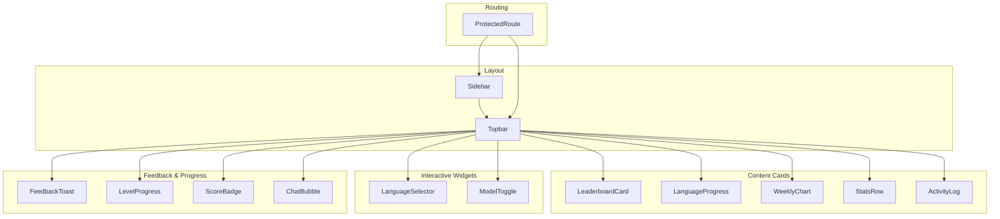

**Diagram sources**
- [Sidebar.jsx:36-120](file://src/components/Sidebar.jsx#L36-L120)
- [Topbar.jsx:11-54](file://src/components/Topbar.jsx#L11-L54)
- [LeaderboardCard.jsx:5-46](file://src/components/LeaderboardCard.jsx#L5-L46)
- [LanguageProgress.jsx:3-34](file://src/components/LanguageProgress.jsx#L3-L34)
- [WeeklyChart.jsx:5-32](file://src/components/WeeklyChart.jsx#L5-L32)
- [StatsRow.jsx:3-16](file://src/components/StatsRow.jsx#L3-L16)
- [ActivityLog.jsx:3-27](file://src/components/ActivityLog.jsx#L3-L27)
- [LanguageSelector.jsx:3-48](file://src/components/LanguageSelector.jsx#L3-L48)
- [ModelToggle.jsx:7-23](file://src/components/ModelToggle.jsx#L7-L23)
- [FeedbackToast.jsx:4-37](file://src/components/FeedbackToast.jsx#L4-L37)
- [LevelProgress.jsx:3-16](file://src/components/LevelProgress.jsx#L3-L16)
- [ScoreBadge.jsx:3-17](file://src/components/ScoreBadge.jsx#L3-L17)
- [ChatBubble.jsx:3-29](file://src/components/ChatBubble.jsx#L3-L29)
- [ProtectedRoute.jsx:4-16](file://src/components/ProtectedRoute.jsx#L4-L16)

**Section sources**
- [Sidebar.jsx:1-122](file://src/components/Sidebar.jsx#L1-L122)
- [Topbar.jsx:1-57](file://src/components/Topbar.jsx#L1-L57)
- [LeaderboardCard.jsx:1-48](file://src/components/LeaderboardCard.jsx#L1-L48)
- [LanguageProgress.jsx:1-36](file://src/components/LanguageProgress.jsx#L1-L36)
- [WeeklyChart.jsx:1-34](file://src/components/WeeklyChart.jsx#L1-L34)
- [StatsRow.jsx:1-17](file://src/components/StatsRow.jsx#L1-L17)
- [ActivityLog.jsx:1-29](file://src/components/ActivityLog.jsx#L1-L29)
- [LanguageSelector.jsx:1-49](file://src/components/LanguageSelector.jsx#L1-L49)
- [ModelToggle.jsx:1-25](file://src/components/ModelToggle.jsx#L1-L25)
- [FeedbackToast.jsx:1-39](file://src/components/FeedbackToast.jsx#L1-L39)
- [LevelProgress.jsx:1-18](file://src/components/LevelProgress.jsx#L1-L18)
- [ScoreBadge.jsx:1-37](file://src/components/ScoreBadge.jsx#L1-L37)
- [ChatBubble.jsx:1-32](file://src/components/ChatBubble.jsx#L1-L32)
- [ProtectedRoute.jsx:1-18](file://src/components/ProtectedRoute.jsx#L1-L18)

## Core Components
This section documents the primary reusable components, their props/events, styling, and usage patterns.

- FeedbackToast
  - Purpose: Non-blocking feedback indicator with animation and auto-dismiss.
  - Props:
    - show: boolean, controls visibility
    - isCorrect: boolean, toggles success/error styling
    - message: string, optional contextual message
    - onDone: function, callback after auto-hide completes
  - Events: none (callback-driven)
  - Styling: Uses DaisyUI alert variants and Tailwind utilities; positioned via toast utilities.
  - Accessibility: Animated presence; relies on semantic alert roles via DaisyUI.
  - Usage pattern: Controlled visibility; triggers onDone to notify parent.
  - Example reference: [FeedbackToast.jsx:4-37](file://src/components/FeedbackToast.jsx#L4-L37)

- LeaderboardCard
  - Purpose: Displays weekly leaderboard entries with ranking, avatars, streak, and points.
  - Props: none (renders from mock data)
  - Events: none
  - Styling: Card container with base palette; badges and rings for "me" row; responsive spacing.
  - Accessibility: List semantics via ul/li; truncation for long names.
  - Usage pattern: Render inside dashboard card grids; integrates with user identity via mock data.
  - Example reference: [LeaderboardCard.jsx:5-46](file://src/components/LeaderboardCard.jsx#L5-L46), [mockData.js](file://src/data/mockData.js)

- LanguageProgress
  - Purpose: Shows progress bars per language with percentage and flags.
  - Props: none (renders from mock data)
  - Events: none
  - Styling: Progress bars with color variants mapped by language; compact horizontal layout.
  - Accessibility: Semantic progress element; readable labels.
  - Usage pattern: Dashboard summary; supports multiple languages.
  - Example reference: [LanguageProgress.jsx:3-34](file://src/components/LanguageProgress.jsx#L3-L34), [mockData.js](file://src/data/mockData.js)

- LevelProgress
  - Purpose: Displays current level and XP progress within the level.
  - Props:
    - xp: number, total XP (optional; falls back to derived level)
    - level: number, overrides computed level
  - Events: none
  - Styling: Compact inline layout with progress bar and badge.
  - Accessibility: Progress element with numeric labels.
  - Usage pattern: Topbar or profile panels; integrates with game XP.
  - Example reference: [LevelProgress.jsx:3-16](file://src/components/LevelProgress.jsx#L3-L16), [languages.js](file://src/config/languages.js)

- ScoreBadge
  - Purpose: Animated score display badge; includes XP gain popup variant.
  - Props:
    - score: number
    - label: string, default "Score"
    - show: boolean, controls visibility
  - Events: none
  - Styling: Large primary badge with star icon; animated entrance.
  - Accessibility: Static badge; ensure sufficient contrast.
  - Usage pattern: Game screens; can be combined with XP gain popup.
  - Example reference: [ScoreBadge.jsx:3-17](file://src/components/ScoreBadge.jsx#L3-L17)

- StatsRow
  - Purpose: Grid of stat cards with icons, labels, values, and deltas.
  - Props: none (renders from mock data)
  - Events: none
  - Styling: Responsive grid (2–4 columns); stat card styling via DaisyUI.
  - Accessibility: Semantic stat elements; readable typography.
  - Usage pattern: Dashboard overview; responsive layout adapts to screen size.
  - Example reference: [StatsRow.jsx:3-16](file://src/components/StatsRow.jsx#L3-L16), [mockData.js](file://src/data/mockData.js)

- WeeklyChart
  - Purpose: Bar chart-like visualization of weekly activity.
  - Props: none (renders from mock data)
  - Events: none
  - Styling: Flexible bars sized by percentage; today highlighted differently.
  - Accessibility: Chart-like visualization; rely on labels and totals.
  - Usage pattern: Dashboard; shows recent activity trend.
  - Example reference: [WeeklyChart.jsx:5-32](file://src/components/WeeklyChart.jsx#L5-L32), [mockData.js](file://src/data/mockData.js)

- Sidebar
  - Purpose: Navigation sidebar with theme toggle, user info, and links.
  - Props:
    - isDark: boolean, theme state
    - setIsDark: function, updates theme
  - Events: none
  - Styling: Fixed width, sticky positioning; menu items highlight based on route.
  - Accessibility: Keyboard navigable menus; proper contrast in dark/light modes.
  - Usage pattern: AppLayout; integrates with Auth and Game contexts.
  - Example reference: [Sidebar.jsx:19-119](file://src/components/Sidebar.jsx#L19-L119)

- Topbar
  - Purpose: Header with title, XP badge, level, theme toggle, notifications, and avatar.
  - Props:
    - title: string
    - subtitle: string
    - isDark: boolean
    - setIsDark: function
  - Events: none
  - Styling: Sticky header; badges and icons aligned; theme toggle swap.
  - Accessibility: Clear labels; focusable controls.
  - Usage pattern: Page layouts; displays global app metrics.
  - Example reference: [Topbar.jsx:4-54](file://src/components/Topbar.jsx#L4-L54)

- ActivityLog
  - Purpose: Timeline of recent user activities.
  - Props: none (renders from mock data)
  - Events: none
  - Styling: Divided list with icons and timestamps.
  - Accessibility: List semantics; readable labels.
  - Usage pattern: Dashboard; tracks learning actions.
  - Example reference: [ActivityLog.jsx:3-27](file://src/components/ActivityLog.jsx#L3-L27), [mockData.js](file://src/data/mockData.js)

- ChatBubble
  - Purpose: Message bubble with model metadata, explanation, confidence, and timestamp.
  - Props:
    - message: object with text and optional fields (model, explanation, confidence)
    - isUser: boolean, aligns bubble left/right
    - timestamp: string, optional footer
  - Events: none
  - Styling: DaisyUI chat classes; primary vs neutral variants; badges for model.
  - Accessibility: Readable text; semantic structure.
  - Usage pattern: Translation chat; supports multiple AI models.
  - Example reference: [ChatBubble.jsx:3-29](file://src/components/ChatBubble.jsx#L3-L29)

- LanguageSelector
  - Purpose: Dual-language selector with swap action.
  - Props:
    - sourceLang: string
    - targetLang: string
    - onSourceChange: function
    - onTargetChange: function
    - onSwap: function
  - Events: change handlers invoked on selection
  - Styling: Select inputs with flags; centered swap button.
  - Accessibility: Native selects; clear labels.
  - Usage pattern: Translation chat; ensures distinct source/target.
  - Example reference: [LanguageSelector.jsx:3-48](file://src/components/LanguageSelector.jsx#L3-L48), [languages.js](file://src/config/languages.js)

- ModelToggle
  - Purpose: Toggle between Llama, Gemma, and comparison modes.
  - Props:
    - mode: string, active mode id
    - onChange: function
  - Events: button clicks trigger change
  - Styling: Joined buttons with primary/outline states.
  - Accessibility: Button group; visible focus states.
  - Usage pattern: Chat interface; model preference.
  - Example reference: [ModelToggle.jsx:7-23](file://src/components/ModelToggle.jsx#L7-L23)

- ProtectedRoute
  - Purpose: Route guard protecting authenticated routes.
  - Props:
    - children: React node
  - Events: none
  - Styling: Spinner during auth check
  - Accessibility: Loading spinner; ensure skip-link for focus.
  - Usage pattern: Wraps page components; redirects unauthenticated users.
  - Example reference: [ProtectedRoute.jsx:4-16](file://src/components/ProtectedRoute.jsx#L4-L16)

**Section sources**
- [FeedbackToast.jsx:1-39](file://src/components/FeedbackToast.jsx#L1-L39)
- [LeaderboardCard.jsx:1-48](file://src/components/LeaderboardCard.jsx#L1-L48)
- [LanguageProgress.jsx:1-36](file://src/components/LanguageProgress.jsx#L1-L36)
- [LevelProgress.jsx:1-18](file://src/components/LevelProgress.jsx#L1-L18)
- [ScoreBadge.jsx:1-37](file://src/components/ScoreBadge.jsx#L1-L37)
- [StatsRow.jsx:1-17](file://src/components/StatsRow.jsx#L1-L17)
- [WeeklyChart.jsx:1-34](file://src/components/WeeklyChart.jsx#L1-L34)
- [Sidebar.jsx:1-122](file://src/components/Sidebar.jsx#L1-L122)
- [Topbar.jsx:1-57](file://src/components/Topbar.jsx#L1-L57)
- [ActivityLog.jsx:1-29](file://src/components/ActivityLog.jsx#L1-L29)
- [ChatBubble.jsx:1-32](file://src/components/ChatBubble.jsx#L1-L32)
- [LanguageSelector.jsx:1-49](file://src/components/LanguageSelector.jsx#L1-L49)
- [ModelToggle.jsx:1-25](file://src/components/ModelToggle.jsx#L1-L25)
- [ProtectedRoute.jsx:1-18](file://src/components/ProtectedRoute.jsx#L1-L18)
- [mockData.js](file://src/data/mockData.js)
- [languages.js](file://src/config/languages.js)

## Architecture Overview
The component library integrates with routing, contexts, and page layouts to form cohesive UI experiences.

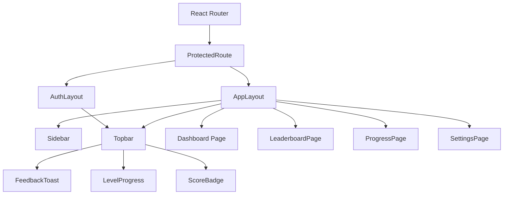

**Diagram sources**
- [ProtectedRoute.jsx:4-16](file://src/components/ProtectedRoute.jsx#L4-L16)
- [Sidebar.jsx:36-120](file://src/components/Sidebar.jsx#L36-L120)
- [Topbar.jsx:11-54](file://src/components/Topbar.jsx#L11-L54)
- [FeedbackToast.jsx:18-37](file://src/components/FeedbackToast.jsx#L18-L37)
- [LevelProgress.jsx:8-16](file://src/components/LevelProgress.jsx#L8-L16)
- [ScoreBadge.jsx:7-16](file://src/components/ScoreBadge.jsx#L7-L16)

**Section sources**
- [ProtectedRoute.jsx:1-18](file://src/components/ProtectedRoute.jsx#L1-L18)
- [Sidebar.jsx:1-122](file://src/components/Sidebar.jsx#L1-L122)
- [Topbar.jsx:1-57](file://src/components/Topbar.jsx#L1-L57)
- [FeedbackToast.jsx:1-39](file://src/components/FeedbackToast.jsx#L1-L39)
- [LevelProgress.jsx:1-18](file://src/components/LevelProgress.jsx#L1-L18)
- [ScoreBadge.jsx:1-37](file://src/components/ScoreBadge.jsx#L1-L37)

## Detailed Component Analysis

### FeedbackToast
- Props: show, isCorrect, message, onDone
- Behavior: Auto-hides after delay; animates in/out
- Styling: Alert success/error; toast positioning; shadow
- Composition: Used in game/chat flows to surface correctness
- Accessibility: Animated presence; ensure messages are concise

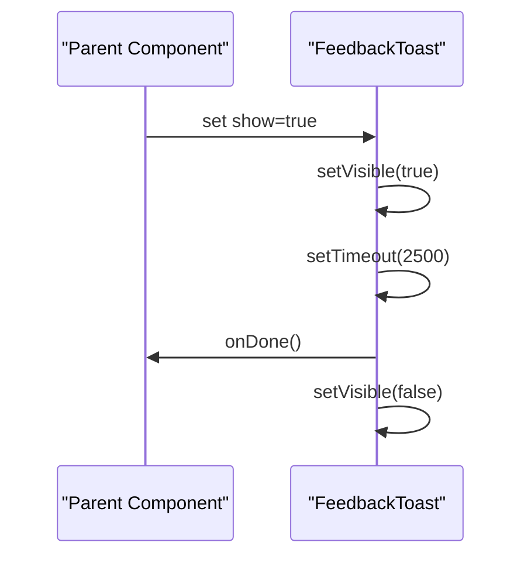

**Diagram sources**
- [FeedbackToast.jsx:7-16](file://src/components/FeedbackToast.jsx#L7-L16)

**Section sources**
- [FeedbackToast.jsx:1-39](file://src/components/FeedbackToast.jsx#L1-L39)

### LevelProgress
- Props: xp, level
- Behavior: Computes current level and progress percentage
- Styling: Badge + progress bar; numeric labels
- Composition: Appears in Topbar and profile panels

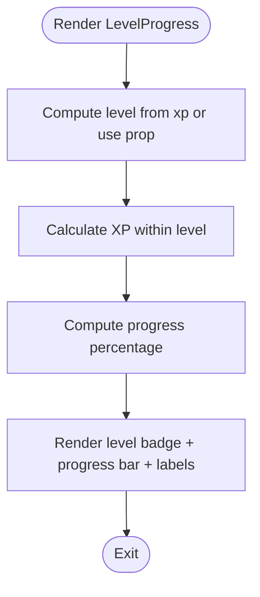

**Diagram sources**
- [LevelProgress.jsx:3-6](file://src/components/LevelProgress.jsx#L3-L6)

**Section sources**
- [LevelProgress.jsx:1-18](file://src/components/LevelProgress.jsx#L1-L18)
- [languages.js](file://src/config/languages.js)

### ScoreBadge and XpGainPopup
- Props:
  - ScoreBadge: score, label, show
  - XpGainPopup: amount, show
- Behavior: Animated entrance; XP popup floats upward
- Styling: Large primary badge; absolute positioning for popup
- Composition: ScoreBadge in dashboards; popup used during gameplay

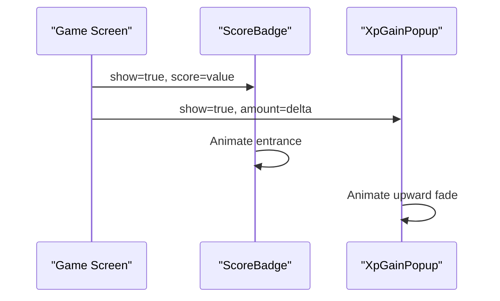

**Diagram sources**
- [ScoreBadge.jsx:3-17](file://src/components/ScoreBadge.jsx#L3-L17)
- [ScoreBadge.jsx:20-36](file://src/components/ScoreBadge.jsx#L20-L36)

**Section sources**
- [ScoreBadge.jsx:1-37](file://src/components/ScoreBadge.jsx#L1-L37)

### LanguageSelector
- Props: sourceLang, targetLang, onSourceChange, onTargetChange, onSwap
- Behavior: Filters target options to exclude source; swap handler
- Styling: Two selects with labels; centered swap button
- Composition: Used in chat pages for language pair selection

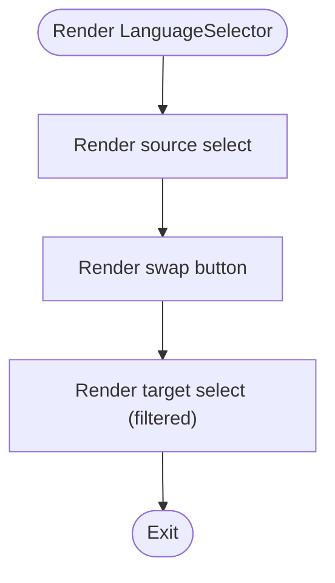

**Diagram sources**
- [LanguageSelector.jsx:3-48](file://src/components/LanguageSelector.jsx#L3-L48)
- [languages.js](file://src/config/languages.js)

**Section sources**
- [LanguageSelector.jsx:1-49](file://src/components/LanguageSelector.jsx#L1-L49)
- [languages.js](file://src/config/languages.js)

### ModelToggle
- Props: mode, onChange
- Behavior: Highlights active mode; invokes change handler
- Styling: Joined buttons with primary/outline
- Composition: Chat toolbar for model preference

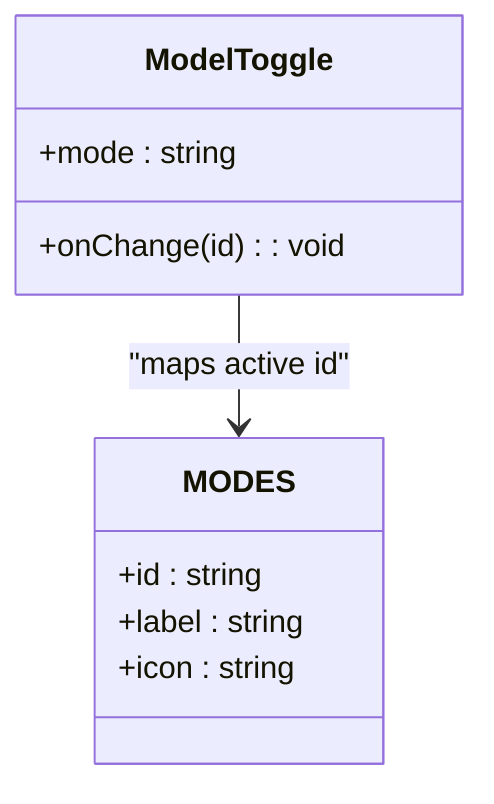

**Diagram sources**
- [ModelToggle.jsx:7-23](file://src/components/ModelToggle.jsx#L7-L23)

**Section sources**
- [ModelToggle.jsx:1-25](file://src/components/ModelToggle.jsx#L1-L25)

### ProtectedRoute
- Props: children
- Behavior: Redirects unauthenticated users; shows spinner while loading
- Styling: Centered spinner overlay
- Composition: Wraps page components requiring auth

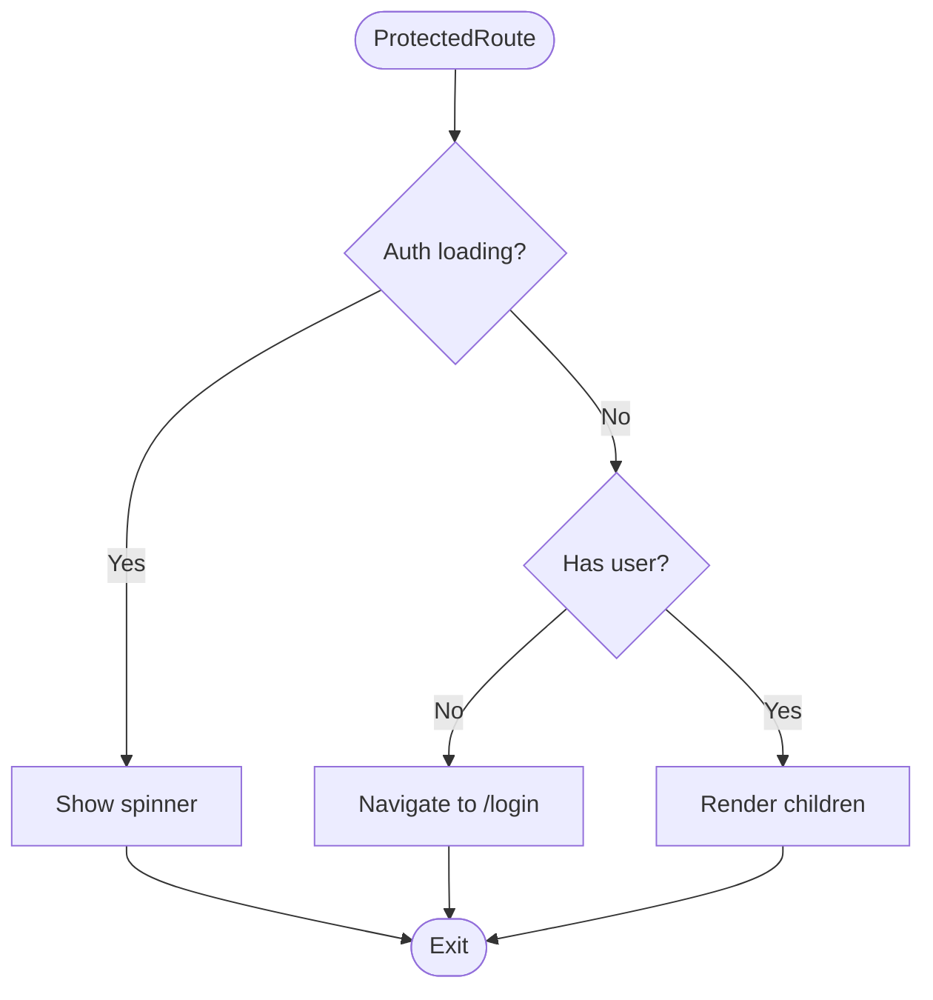

**Diagram sources**
- [ProtectedRoute.jsx:4-16](file://src/components/ProtectedRoute.jsx#L4-L16)

**Section sources**
- [ProtectedRoute.jsx:1-18](file://src/components/ProtectedRoute.jsx#L1-L18)

### ChatBubble
- Props: message, isUser, timestamp
- Behavior: Renders model badge, explanation, confidence; optional timestamp
- Styling: DaisyUI chat classes; primary vs neutral variants
- Composition: Core chat message renderer

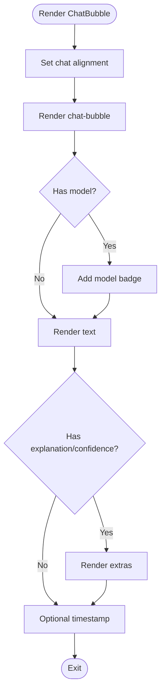

**Diagram sources**
- [ChatBubble.jsx:3-29](file://src/components/ChatBubble.jsx#L3-L29)

**Section sources**
- [ChatBubble.jsx:1-32](file://src/components/ChatBubble.jsx#L1-L32)

### Sidebar and Topbar Integration
- Sidebar:
  - Props: isDark, setIsDark
  - Integrates with AuthContext and GameContext for profile and level
  - Navigation items and account items drive routing
- Topbar:
  - Props: title, subtitle, isDark, setIsDark
  - Displays XP and level badges; theme toggle; notification and avatar

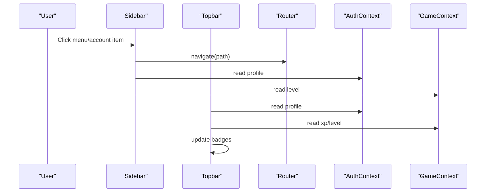

**Diagram sources**
- [Sidebar.jsx:19-119](file://src/components/Sidebar.jsx#L19-L119)
- [Topbar.jsx:4-54](file://src/components/Topbar.jsx#L4-L54)
- [AuthContext.jsx](file://src/contexts/AuthContext.jsx)
- [GameContext.jsx](file://src/contexts/GameContext.jsx)

**Section sources**
- [Sidebar.jsx:1-122](file://src/components/Sidebar.jsx#L1-L122)
- [Topbar.jsx:1-57](file://src/components/Topbar.jsx#L1-L57)
- [AuthContext.jsx](file://src/contexts/AuthContext.jsx)
- [GameContext.jsx](file://src/contexts/GameContext.jsx)

## Dependency Analysis
Key internal dependencies:
- Components depend on mock data for rendering lists and charts.
- LanguageSelector depends on languages configuration.
- LevelProgress depends on language configuration for level thresholds.
- Sidebar and Topbar consume AuthContext and GameContext.
- ProtectedRoute consumes AuthContext and react-router-dom.

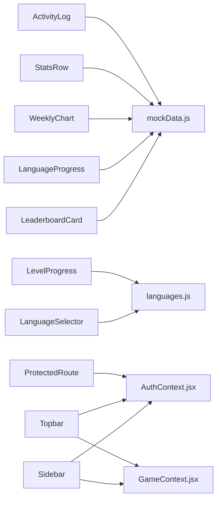

**Diagram sources**
- [LeaderboardCard.jsx](file://src/components/LeaderboardCard.jsx#L1)
- [LanguageProgress.jsx](file://src/components/LanguageProgress.jsx#L1)
- [WeeklyChart.jsx](file://src/components/WeeklyChart.jsx#L1)
- [StatsRow.jsx](file://src/components/StatsRow.jsx#L1)
- [ActivityLog.jsx](file://src/components/ActivityLog.jsx#L1)
- [LanguageSelector.jsx](file://src/components/LanguageSelector.jsx#L1)
- [languages.js](file://src/config/languages.js)
- [LevelProgress.jsx](file://src/components/LevelProgress.jsx#L1)
- [Sidebar.jsx:1-3](file://src/components/Sidebar.jsx#L1-L3)
- [Topbar.jsx:1-2](file://src/components/Topbar.jsx#L1-L2)
- [ProtectedRoute.jsx:1-2](file://src/components/ProtectedRoute.jsx#L1-L2)
- [AuthContext.jsx](file://src/contexts/AuthContext.jsx)
- [GameContext.jsx](file://src/contexts/GameContext.jsx)

**Section sources**
- [LeaderboardCard.jsx:1-48](file://src/components/LeaderboardCard.jsx#L1-L48)
- [LanguageProgress.jsx:1-36](file://src/components/LanguageProgress.jsx#L1-L36)
- [WeeklyChart.jsx:1-34](file://src/components/WeeklyChart.jsx#L1-L34)
- [StatsRow.jsx:1-17](file://src/components/StatsRow.jsx#L1-L17)
- [ActivityLog.jsx:1-29](file://src/components/ActivityLog.jsx#L1-L29)
- [LanguageSelector.jsx:1-49](file://src/components/LanguageSelector.jsx#L1-L49)
- [languages.js](file://src/config/languages.js)
- [LevelProgress.jsx:1-18](file://src/components/LevelProgress.jsx#L1-L18)
- [Sidebar.jsx:1-122](file://src/components/Sidebar.jsx#L1-L122)
- [Topbar.jsx:1-57](file://src/components/Topbar.jsx#L1-L57)
- [ProtectedRoute.jsx:1-18](file://src/components/ProtectedRoute.jsx#L1-L18)
- [AuthContext.jsx](file://src/contexts/AuthContext.jsx)
- [GameContext.jsx](file://src/contexts/GameContext.jsx)

## Performance Considerations
- Prefer controlled components (e.g., FeedbackToast) to avoid unnecessary re-renders.
- Memoize expensive computations (e.g., level calculation) at the provider or component boundary.
- Use minimal state updates; batch UI updates where possible.
- Keep animations lightweight (as implemented with Framer Motion) and avoid heavy transforms on large lists.
- Defer non-critical data fetching to background to keep UI responsive.
- Use responsive utilities (grid, flex) to minimize layout thrashing.

## Troubleshooting Guide
- FeedbackToast does not hide:
  - Ensure show prop toggles off and onDone is called after animation completes.
  - Reference: [FeedbackToast.jsx:7-16](file://src/components/FeedbackToast.jsx#L7-L16)
- LanguageSelector target list empty:
  - Verify sourceLang is set; target options filter by exclusion.
  - Reference: [LanguageSelector.jsx:39-44](file://src/components/LanguageSelector.jsx#L39-L44)
- LevelProgress shows incorrect level:
  - Confirm xp prop or computed level; ensure constants align with configuration.
  - Reference: [LevelProgress.jsx:3-6](file://src/components/LevelProgress.jsx#L3-L6), [languages.js](file://src/config/languages.js)
- ProtectedRoute infinite spinner:
  - Check AuthContext loading state and user presence.
  - Reference: [ProtectedRoute.jsx:7-13](file://src/components/ProtectedRoute.jsx#L7-L13)
- Sidebar navigation not highlighting:
  - Ensure useLocation matches item paths and navigate is used for routing.
  - Reference: [Sidebar.jsx:20-34](file://src/components/Sidebar.jsx#L20-L34)

**Section sources**
- [FeedbackToast.jsx:1-39](file://src/components/FeedbackToast.jsx#L1-L39)
- [LanguageSelector.jsx:1-49](file://src/components/LanguageSelector.jsx#L1-L49)
- [LevelProgress.jsx:1-18](file://src/components/LevelProgress.jsx#L1-L18)
- [ProtectedRoute.jsx:1-18](file://src/components/ProtectedRoute.jsx#L1-L18)
- [Sidebar.jsx:1-122](file://src/components/Sidebar.jsx#L1-L122)

## Conclusion
The component library emphasizes composability, consistent styling with Tailwind and DaisyUI, and clear separation of concerns. Components integrate with contexts and routing to deliver a cohesive user experience. By following established patterns—controlled props, minimal state, responsive design, and accessibility—the library remains maintainable and extensible.

## Appendices

### Styling Conventions and Accessibility
- Tailwind and DaisyUI:
  - Base palette: bg-base-100, border-base-300, text-base-content
  - Alerts: alert-success, alert-error
  - Badges: badge-primary, badge-ghost
  - Progress: progress-primary, progress-warning, progress-error, progress-secondary
  - Cards: card bg-base-100 border border-base-300
- Responsive patterns:
  - Grids adapt columns (e.g., StatsRow)
  - Flex utilities for alignment and spacing
- Accessibility:
  - Semantic HTML (progress, ul/li)
  - Sufficient color contrast
  - Focusable controls and keyboard navigation
  - Animated transitions should be reduced for motion sensitivity

**Section sources**
- [StatsRow.jsx:5-14](file://src/components/StatsRow.jsx#L5-L14)
- [LeaderboardCard.jsx:7-40](file://src/components/LeaderboardCard.jsx#L7-L40)
- [LanguageProgress.jsx:14-26](file://src/components/LanguageProgress.jsx#L14-L26)
- [WeeklyChart.jsx:17-21](file://src/components/WeeklyChart.jsx#L17-L21)
- [ChatBubble.jsx:10-28](file://src/components/ChatBubble.jsx#L10-L28)

### Theming Support
- Theme toggle in Sidebar and Topbar switches isDark state.
- DaisyUI swap components provide visual feedback.
- Maintain consistent color tokens across light/dark modes.

**Section sources**
- [Sidebar.jsx:88-102](file://src/components/Sidebar.jsx#L88-L102)
- [Topbar.jsx:29-38](file://src/components/Topbar.jsx#L29-L38)

### Creating New Components
- Follow naming and folder placement conventions.
- Define clear props and defaults; favor controlled components.
- Use Tailwind and DaisyUI utilities consistently.
- Export standalone components; avoid implicit dependencies.
- Add tests for critical logic (e.g., calculations, state transitions).
- Document props/events and usage in this guide.

### Extending Existing Components
- Preserve design system integrity: keep base classes and variants.
- Pass through className only when necessary; avoid destructive overrides.
- Compose higher-order wrappers around existing components when needed.
- Keep animations minimal and performant.