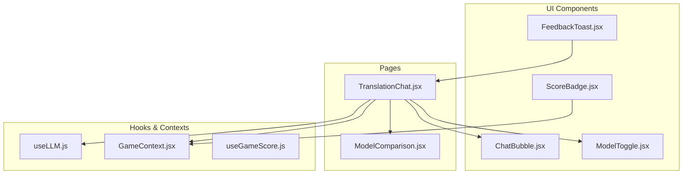
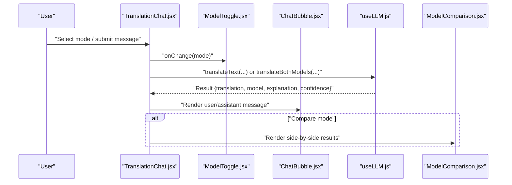
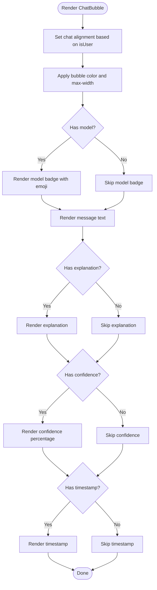
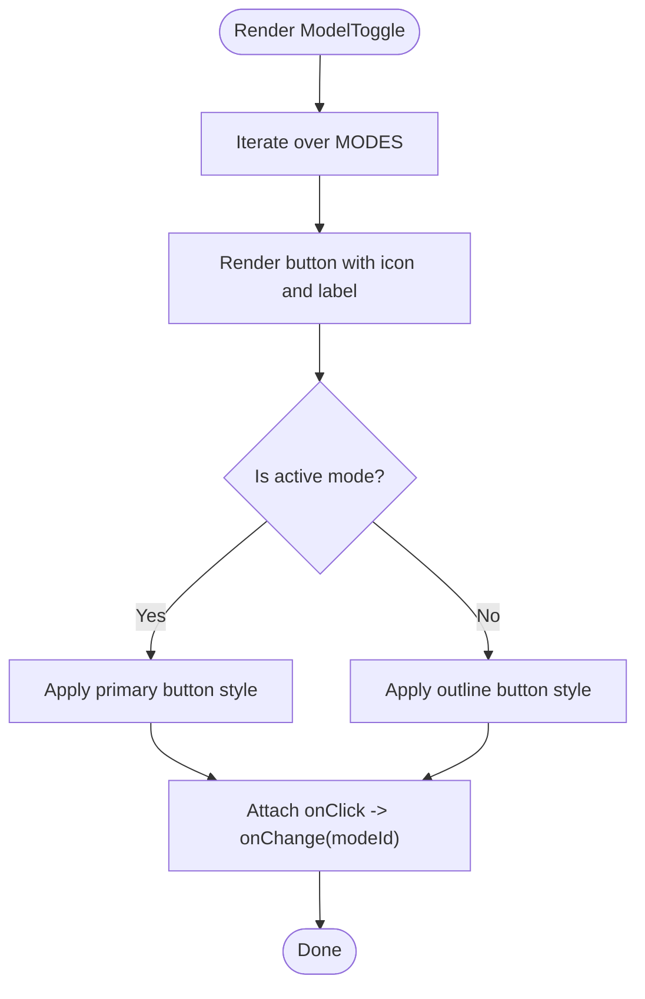
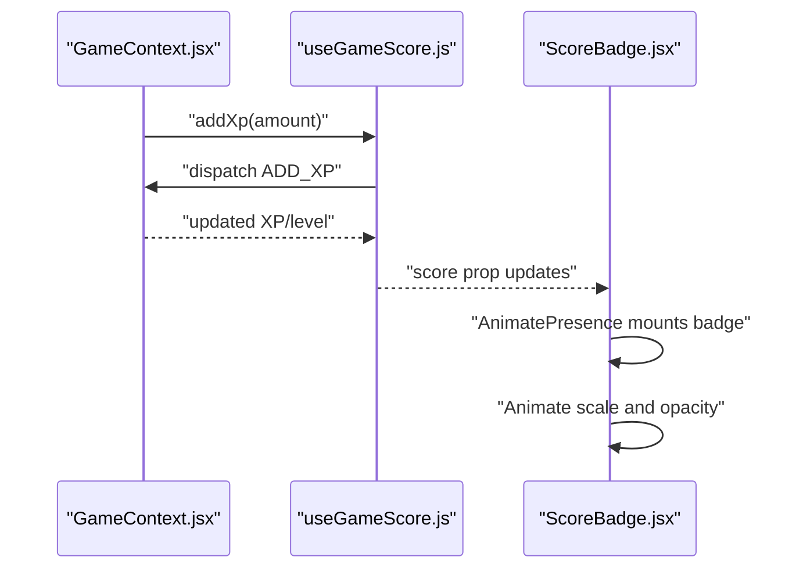
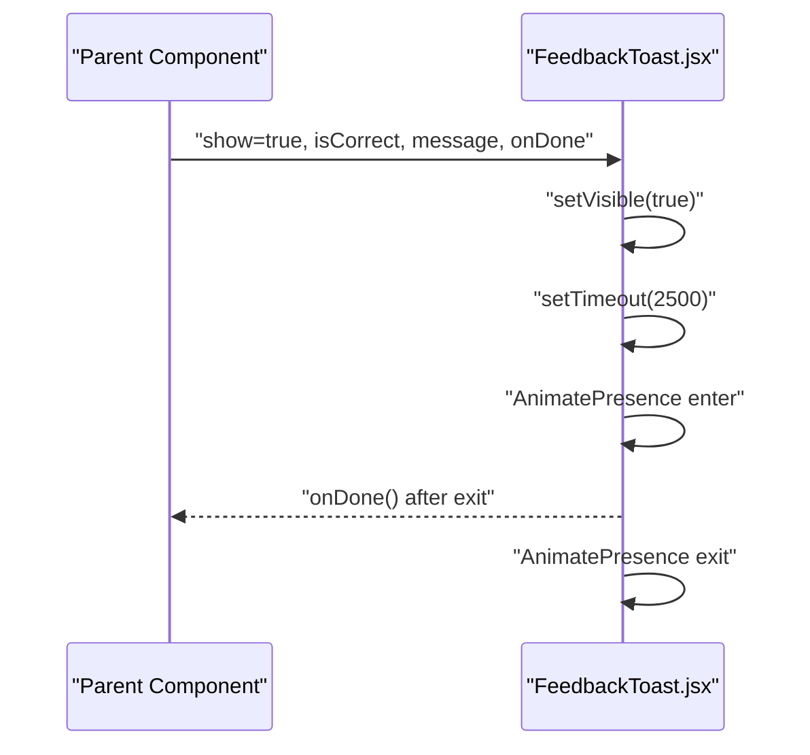
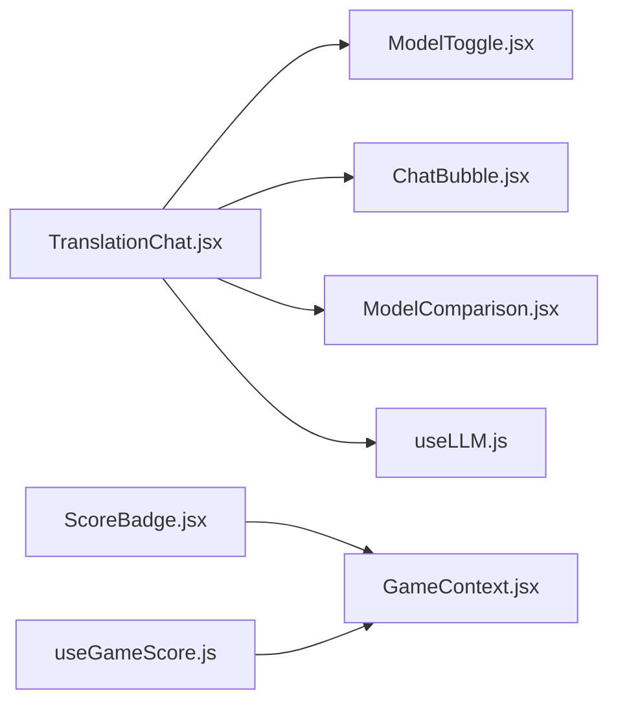

# Interactive Components

<cite>
**Referenced Files in This Document**
- [ChatBubble.jsx](file://src/components/ChatBubble.jsx)
- [ModelToggle.jsx](file://src/components/ModelToggle.jsx)
- [ScoreBadge.jsx](file://src/components/ScoreBadge.jsx)
- [FeedbackToast.jsx](file://src/components/FeedbackToast.jsx)
- [TranslationChat.jsx](file://src/pages/chat/TranslationChat.jsx)
- [useLLM.js](file://src/hooks/useLLM.js)
- [GameContext.jsx](file://src/contexts/GameContext.jsx)
- [useGameScore.js](file://src/hooks/useGameScore.js)
- [ModelComparison.jsx](file://src/pages/chat/ModelComparison.jsx)
</cite>

## Table of Contents
1. [Introduction](#introduction)
2. [Project Structure](#project-structure)
3. [Core Components](#core-components)
4. [Architecture Overview](#architecture-overview)
5. [Detailed Component Analysis](#detailed-component-analysis)
6. [Dependency Analysis](#dependency-analysis)
7. [Performance Considerations](#performance-considerations)
8. [Troubleshooting Guide](#troubleshooting-guide)
9. [Conclusion](#conclusion)
10. [Appendices](#appendices)

## Introduction
This document focuses on four interactive UI components that drive user engagement and feedback in the application:
- ChatBubble: renders translation messages with model metadata, explanations, and confidence indicators.
- ModelToggle: allows users to select translation models or compare outputs.
- ScoreBadge: displays scores with subtle entrance animations and optional XP gain popups.
- FeedbackToast: shows contextual feedback notifications with auto-dismiss and exit animations.

It explains rendering logic, styling variants, interaction patterns, state management, and integration with application state and services. Accessibility and animation considerations are included to guide customization and best practices.

## Project Structure
These components are primarily used within the translation chat page, which orchestrates user input, model selection, and message rendering. Hooks and contexts manage LLM calls and game-related scoring.

**Diagram sources**
- [TranslationChat.jsx](file://src/pages/chat/TranslationChat.jsx)
- [ChatBubble.jsx](file://src/components/ChatBubble.jsx)
- [ModelToggle.jsx](file://src/components/ModelToggle.jsx)
- [ModelComparison.jsx](file://src/pages/chat/ModelComparison.jsx)
- [useLLM.js](file://src/hooks/useLLM.js)
- [GameContext.jsx](file://src/contexts/GameContext.jsx)
- [useGameScore.js](file://src/hooks/useGameScore.js)
- [ScoreBadge.jsx](file://src/components/ScoreBadge.jsx)
- [FeedbackToast.jsx](file://src/components/FeedbackToast.jsx)

**Section sources**
- [TranslationChat.jsx](file://src/pages/chat/TranslationChat.jsx)
- [useLLM.js](file://src/hooks/useLLM.js)
- [GameContext.jsx](file://src/contexts/GameContext.jsx)
- [useGameScore.js](file://src/hooks/useGameScore.js)

## Core Components
- ChatBubble: Renders user and assistant messages with optional model badges, explanations, confidence percentages, and timestamps. Uses Framer Motion for entrance animations and Tailwind classes for responsive chat alignment and bubble styles.
- ModelToggle: Provides three modes (Llama 3, Gemma 3, Compare Both) with icon and label per option. Highlights the active selection and triggers a callback to update mode.
- ScoreBadge: Displays a labeled score with a badge layout and entrance animation. Includes an XP gain popup variant with floating upward animation and transient visibility.
- FeedbackToast: Presents contextual feedback (success/error) with icons and optional message text. Auto-hides after a fixed duration and triggers a completion callback.

**Section sources**
- [ChatBubble.jsx](file://src/components/ChatBubble.jsx)
- [ModelToggle.jsx](file://src/components/ModelToggle.jsx)
- [ScoreBadge.jsx](file://src/components/ScoreBadge.jsx)
- [FeedbackToast.jsx](file://src/components/FeedbackToast.jsx)

## Architecture Overview
The translation chat integrates UI components with LLM hooks and game contexts to deliver a cohesive user experience. The page manages state for messages, languages, and mode, while components focus on rendering and interaction.

**Diagram sources**
- [TranslationChat.jsx](file://src/pages/chat/TranslationChat.jsx)
- [ModelToggle.jsx](file://src/components/ModelToggle.jsx)
- [ChatBubble.jsx](file://src/components/ChatBubble.jsx)
- [useLLM.js](file://src/hooks/useLLM.js)
- [ModelComparison.jsx](file://src/pages/chat/ModelComparison.jsx)

## Detailed Component Analysis

### ChatBubble Component
- Purpose: Render individual chat messages with optional metadata and styling variants.
- Props:
  - message: object containing text, model, explanation, confidence.
  - isUser: boolean to align chat and choose bubble color.
  - timestamp: optional string to display message footer.
- Rendering logic:
  - Uses Framer Motion to animate opacity and vertical position on mount.
  - Conditionally renders model badge (with emoji), explanation, and confidence percentage.
  - Timestamp rendered below the bubble when provided.
- Styling variants:
  - Alignment via chat-start/chat-end.
  - Color via chat-bubble-primary (user) vs chat-bubble-neutral (assistant).
  - Max width and wrapping for readability.
- Interaction patterns:
  - No internal user interactions; props-driven rendering.
- Accessibility:
  - Uses semantic paragraph tags for readable text.
  - Whitespace preservation for preformatted content.
- Usage example path:
  - [TranslationChat.jsx](file://src/pages/chat/TranslationChat.jsx)

**Diagram sources**
- [ChatBubble.jsx](file://src/components/ChatBubble.jsx)

**Section sources**
- [ChatBubble.jsx](file://src/components/ChatBubble.jsx)
- [TranslationChat.jsx](file://src/pages/chat/TranslationChat.jsx)

### ModelToggle Component
- Purpose: Allow users to pick a translation model or compare outputs.
- Modes:
  - Llama 3: llama
  - Gemma 3: gemma
  - Compare Both: compare
- Props:
  - mode: currently selected mode.
  - onChange: callback receiving the chosen mode id.
- Rendering logic:
  - Renders a join group of buttons.
  - Active button uses primary styling; others use outline styling.
  - Responsive label visibility (hidden on small screens).
- Interaction patterns:
  - Clicking a button invokes onChange with the mode id.
- Accessibility:
  - Buttons are keyboard focusable; ensure visible focus styles via Tailwind defaults.
- Usage example path:
  - [TranslationChat.jsx](file://src/pages/chat/TranslationChat.jsx)

**Diagram sources**
- [ModelToggle.jsx](file://src/components/ModelToggle.jsx)

**Section sources**
- [ModelToggle.jsx](file://src/components/ModelToggle.jsx)
- [TranslationChat.jsx](file://src/pages/chat/TranslationChat.jsx)

### ScoreBadge Component
- Purpose: Display a labeled score with animated entrance; optionally show XP gain popup.
- Props:
  - score: numeric score to display.
  - label: optional label text (default "Score").
  - show: boolean to toggle visibility (AnimatePresence).
- Variants:
  - ScoreBadge: badge layout with entrance animation.
  - XpGainPopup: floating XP gain text with upward fade-out animation.
- Rendering logic:
  - Uses AnimatePresence to mount/unmount based on show flag.
  - ScoreBadge animates scale and opacity on appear.
  - XpGainPopup animates opacity and vertical offset with a fixed duration.
- Styling:
  - Badge sizing and spacing via Tailwind badge utilities.
  - Pointer-events disabled to avoid interfering with underlying interactions.
- Accessibility:
  - Static badge; ensure sufficient color contrast and readable sizes.
- Integration:
  - GameContext manages XP and level updates; ScoreBadge can reflect computed score or XP.
- Usage example path:
  - [ScoreBadge.jsx](file://src/components/ScoreBadge.jsx)
  - [GameContext.jsx](file://src/contexts/GameContext.jsx)
  - [useGameScore.js](file://src/hooks/useGameScore.js)

**Diagram sources**
- [GameContext.jsx](file://src/contexts/GameContext.jsx)
- [useGameScore.js](file://src/hooks/useGameScore.js)
- [ScoreBadge.jsx](file://src/components/ScoreBadge.jsx)

**Section sources**
- [ScoreBadge.jsx](file://src/components/ScoreBadge.jsx)
- [GameContext.jsx](file://src/contexts/GameContext.jsx)
- [useGameScore.js](file://src/hooks/useGameScore.js)

### FeedbackToast Component
- Purpose: Show contextual feedback (success/error) with auto-dismiss and exit animation.
- Props:
  - show: boolean controlling visibility.
  - isCorrect: boolean to select success/error styling.
  - message: optional string to display beneath header.
  - onDone: callback invoked after auto-dismiss completes.
- Rendering logic:
  - Tracks local visible state synchronized with show prop.
  - On mount with show=true, sets a timer to hide and call onDone.
  - Uses AnimatePresence to animate enter/exit transitions.
- Styling variants:
  - Success vs error alert styles based on isCorrect.
  - Toast positioning via toast-top and toast-end.
- Interaction handling:
  - No user-triggered dismissal; relies on automatic timeout.
  - onDone callback enables parent orchestration (e.g., advancing steps).
- Accessibility:
  - Static toast; ensure sufficient contrast and concise messages.
  - Keep messages short and actionable.
- Usage example path:
  - [TranslationChat.jsx](file://src/pages/chat/TranslationChat.jsx)

**Diagram sources**
- [FeedbackToast.jsx](file://src/components/FeedbackToast.jsx)
- [TranslationChat.jsx](file://src/pages/chat/TranslationChat.jsx)

**Section sources**
- [FeedbackToast.jsx](file://src/components/FeedbackToast.jsx)
- [TranslationChat.jsx](file://src/pages/chat/TranslationChat.jsx)

## Dependency Analysis
- TranslationChat orchestrates:
  - ModelToggle drives mode selection.
  - useLLM handles translation requests and loading states.
  - ChatBubble renders messages and ModelComparison renders comparative results.
- GameContext and useGameScore manage XP and score computation for gamified experiences.
- ScoreBadge consumes score and XP signals from the game system.

**Diagram sources**
- [TranslationChat.jsx](file://src/pages/chat/TranslationChat.jsx)
- [ModelToggle.jsx](file://src/components/ModelToggle.jsx)
- [ChatBubble.jsx](file://src/components/ChatBubble.jsx)
- [ModelComparison.jsx](file://src/pages/chat/ModelComparison.jsx)
- [useLLM.js](file://src/hooks/useLLM.js)
- [ScoreBadge.jsx](file://src/components/ScoreBadge.jsx)
- [GameContext.jsx](file://src/contexts/GameContext.jsx)
- [useGameScore.js](file://src/hooks/useGameScore.js)

**Section sources**
- [TranslationChat.jsx](file://src/pages/chat/TranslationChat.jsx)
- [useLLM.js](file://src/hooks/useLLM.js)
- [GameContext.jsx](file://src/contexts/GameContext.jsx)
- [useGameScore.js](file://src/hooks/useGameScore.js)

## Performance Considerations
- ChatBubble:
  - Uses minimal re-renders by accepting message as a memoized object; ensure upstream memoization to prevent unnecessary renders.
  - Animation cost is low; keep message count manageable.
- ModelToggle:
  - Small static list; performance impact negligible.
- ScoreBadge:
  - AnimatePresence adds/removes DOM nodes; batch updates if rendering many badges.
- FeedbackToast:
  - Short lifecycle; timer cleanup prevents leaks.

[No sources needed since this section provides general guidance]

## Troubleshooting Guide
- ChatBubble does not render model badge:
  - Verify message.model is present and matches expected values.
  - Confirm emoji fallback and Tailwind badge classes are applied.
- ModelToggle click has no effect:
  - Ensure onChange receives a function and updates the parent mode state.
- ScoreBadge not appearing:
  - Check show prop is true and AnimatePresence conditions are met.
- FeedbackToast not hiding:
  - Confirm show prop toggles and onDone is supplied to reset visibility in the parent.

**Section sources**
- [ChatBubble.jsx](file://src/components/ChatBubble.jsx)
- [ModelToggle.jsx](file://src/components/ModelToggle.jsx)
- [ScoreBadge.jsx](file://src/components/ScoreBadge.jsx)
- [FeedbackToast.jsx](file://src/components/FeedbackToast.jsx)

## Conclusion
These interactive components form the backbone of user engagement in the translation chat and gamified features. They emphasize clear visual feedback, smooth animations, and straightforward state integration. By following the usage patterns and accessibility guidelines outlined here, developers can extend and customize the components while maintaining a consistent user experience.

[No sources needed since this section summarizes without analyzing specific files]

## Appendices

### Component Prop Reference
- ChatBubble
  - message: { text, model?, explanation?, confidence? }
  - isUser: boolean
  - timestamp: string?
- ModelToggle
  - mode: "llama" | "gemma" | "compare"
  - onChange: (modeId) => void
- ScoreBadge
  - score: number
  - label: string (default "Score")
  - show: boolean (default true)
- FeedbackToast
  - show: boolean
  - isCorrect: boolean
  - message: string?
  - onDone: () => void

**Section sources**
- [ChatBubble.jsx](file://src/components/ChatBubble.jsx)
- [ModelToggle.jsx](file://src/components/ModelToggle.jsx)
- [ScoreBadge.jsx](file://src/components/ScoreBadge.jsx)
- [FeedbackToast.jsx](file://src/components/FeedbackToast.jsx)