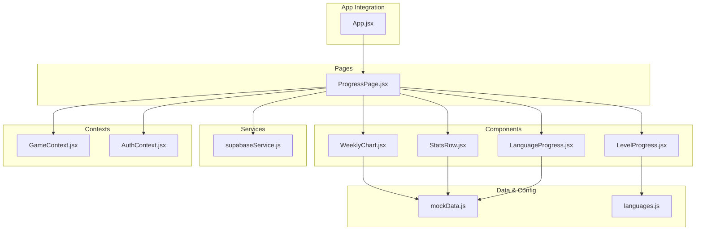
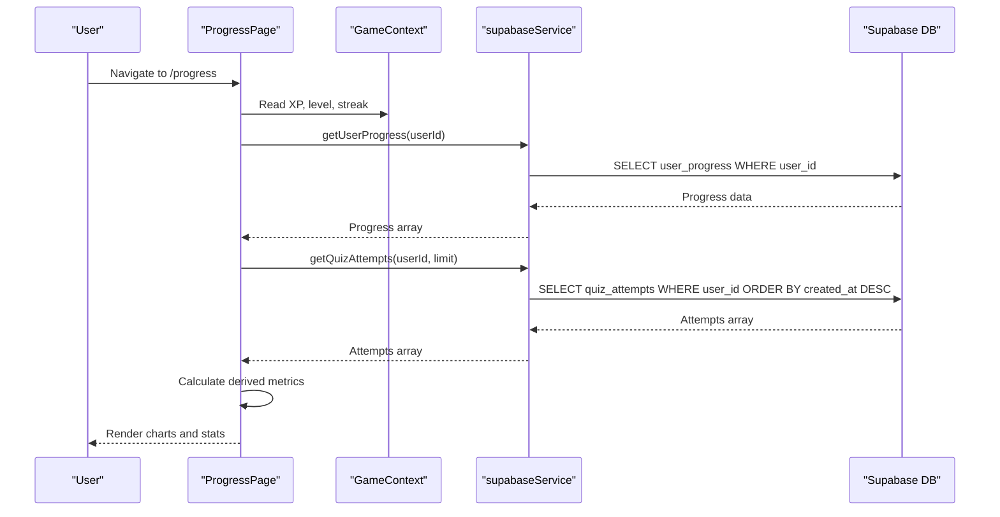
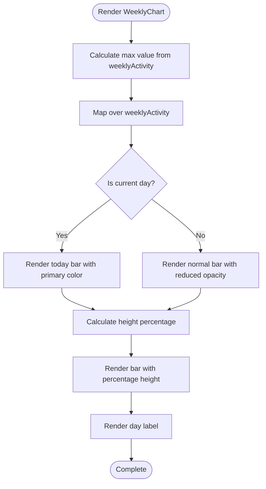
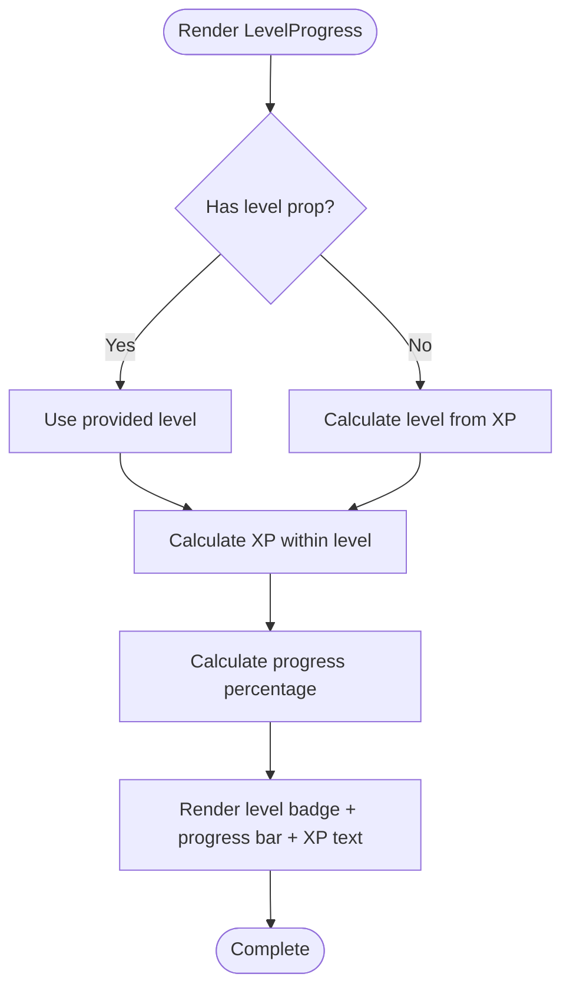
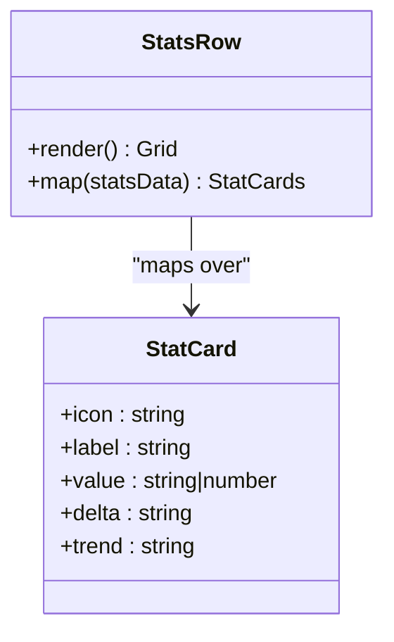
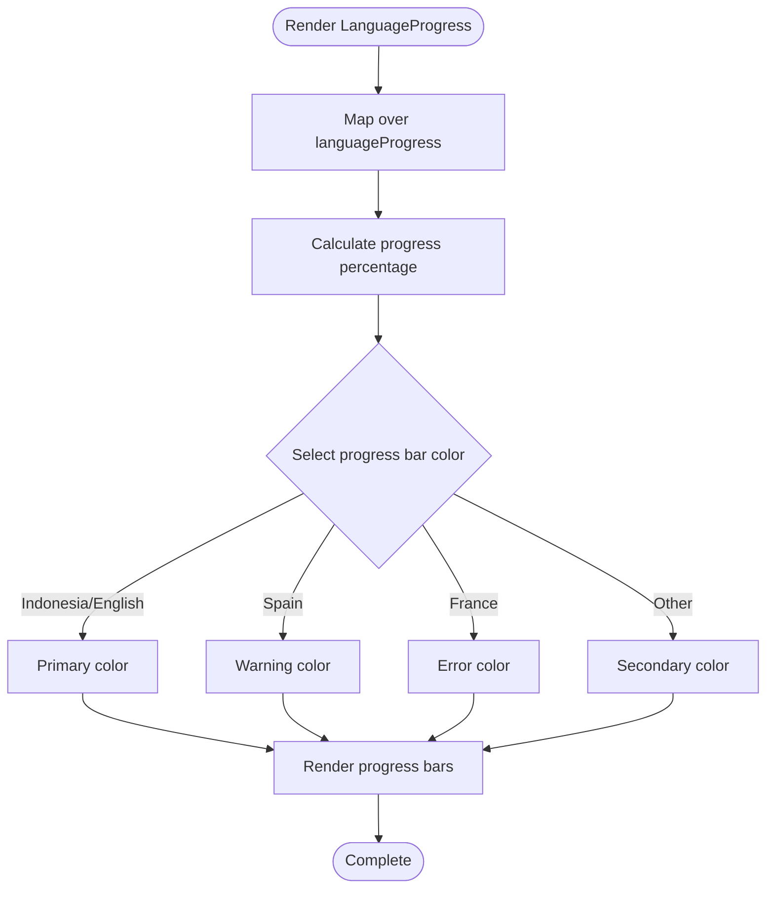
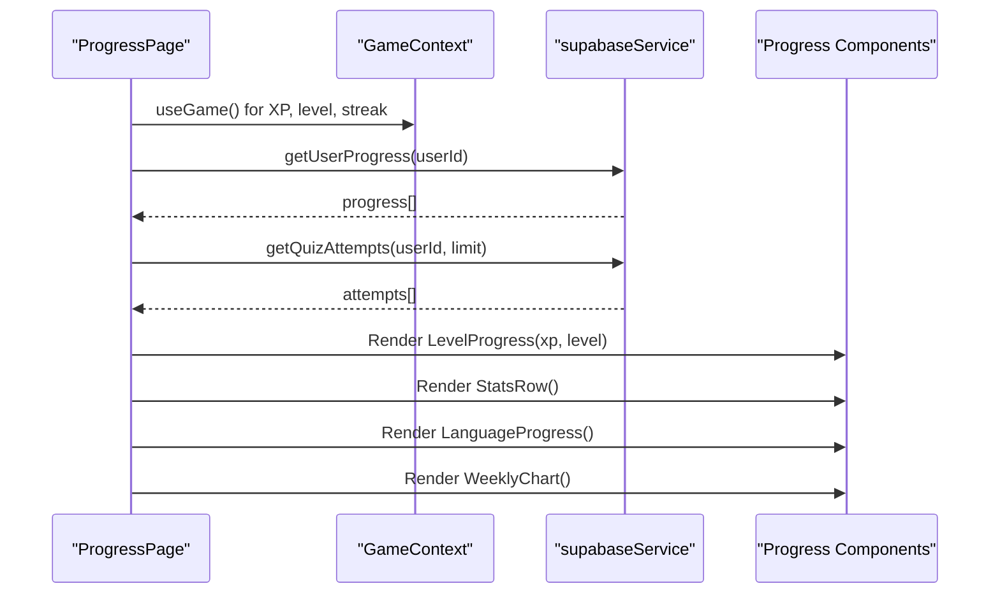
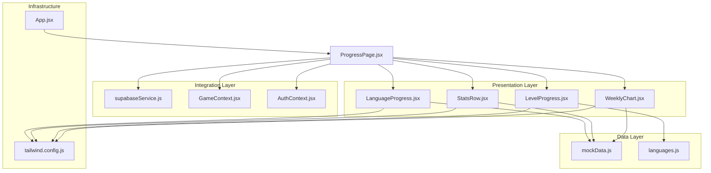

# Progress and Analytics Components

<cite>
**Referenced Files in This Document**
- [WeeklyChart.jsx](file://src/components/WeeklyChart.jsx)
- [LevelProgress.jsx](file://src/components/LevelProgress.jsx)
- [StatsRow.jsx](file://src/components/StatsRow.jsx)
- [LanguageProgress.jsx](file://src/components/LanguageProgress.jsx)
- [ProgressPage.jsx](file://src/pages/dashboard/ProgressPage.jsx)
- [mockData.js](file://src/data/mockData.js)
- [languages.js](file://src/config/languages.js)
- [supabaseService.js](file://src/services/supabaseService.js)
- [GameContext.jsx](file://src/contexts/GameContext.jsx)
- [AuthContext.jsx](file://src/contexts/AuthContext.jsx)
- [App.jsx](file://src/App.jsx)
- [tailwind.config.js](file://tailwind.config.js)
</cite>

## Table of Contents
1. [Introduction](#introduction)
2. [Project Structure](#project-structure)
3. [Core Components](#core-components)
4. [Architecture Overview](#architecture-overview)
5. [Detailed Component Analysis](#detailed-component-analysis)
6. [Dependency Analysis](#dependency-analysis)
7. [Performance Considerations](#performance-considerations)
8. [Troubleshooting Guide](#troubleshooting-guide)
9. [Conclusion](#conclusion)
10. [Appendices](#appendices)

## Introduction
This document provides comprehensive documentation for the progress and analytics visualization components in the application. It covers:
- WeeklyChart: bar-style weekly activity visualization with responsive layout and analytics integration
- LevelProgress: XP-based level progression display with progress bars and completion indicators
- StatsRow: dashboard statistics cards with metric formatting and delta indicators
- LanguageProgress: language proficiency tracking with color-coded progress bars and learning pathway visualization

The documentation explains data visualization patterns, chart types, responsive behavior, analytics integration, styling approaches, and accessibility considerations.

## Project Structure
The progress and analytics components are organized under the components directory and integrated into the dashboard page. They rely on mock data for local development and Supabase for production data.

**Diagram sources**
- [WeeklyChart.jsx:1-34](file://src/components/WeeklyChart.jsx#L1-L34)
- [LevelProgress.jsx:1-18](file://src/components/LevelProgress.jsx#L1-L18)
- [StatsRow.jsx:1-17](file://src/components/StatsRow.jsx#L1-L17)
- [LanguageProgress.jsx:1-36](file://src/components/LanguageProgress.jsx#L1-L36)
- [ProgressPage.jsx:1-114](file://src/pages/dashboard/ProgressPage.jsx#L1-L114)
- [mockData.js:1-47](file://src/data/mockData.js#L1-L47)
- [languages.js:1-30](file://src/config/languages.js#L1-L30)
- [supabaseService.js:1-132](file://src/services/supabaseService.js#L1-L132)
- [GameContext.jsx:1-141](file://src/contexts/GameContext.jsx#L1-L141)
- [AuthContext.jsx:1-101](file://src/contexts/AuthContext.jsx#L1-L101)
- [App.jsx:1-50](file://src/App.jsx#L1-L50)

**Section sources**
- [WeeklyChart.jsx:1-34](file://src/components/WeeklyChart.jsx#L1-L34)
- [LevelProgress.jsx:1-18](file://src/components/LevelProgress.jsx#L1-L18)
- [StatsRow.jsx:1-17](file://src/components/StatsRow.jsx#L1-L17)
- [LanguageProgress.jsx:1-36](file://src/components/LanguageProgress.jsx#L1-L36)
- [ProgressPage.jsx:1-114](file://src/pages/dashboard/ProgressPage.jsx#L1-L114)
- [mockData.js:1-47](file://src/data/mockData.js#L1-L47)
- [languages.js:1-30](file://src/config/languages.js#L1-L30)
- [supabaseService.js:1-132](file://src/services/supabaseService.js#L1-L132)
- [GameContext.jsx:1-141](file://src/contexts/GameContext.jsx#L1-L141)
- [AuthContext.jsx:1-101](file://src/contexts/AuthContext.jsx#L1-L101)
- [App.jsx:1-50](file://src/App.jsx#L1-L50)

## Core Components
This section documents the four key components that visualize user progress and performance metrics.

### WeeklyChart Component
- Purpose: Renders a weekly activity bar chart showing session counts across seven days
- Data source: Uses weeklyActivity from mockData.js
- Visualization pattern: Dynamic bar heights calculated from maximum value, with today highlighted
- Responsive behavior: Flex layout with gap scaling, percentage-based heights
- Analytics integration: Displays total weekly sessions below the chart

Key implementation patterns:
- Calculates maximum value across all days for normalization
- Uses percentage-based height computation for each bar
- Highlights the current day with primary color
- Responsive typography with small text for day labels

**Section sources**
- [WeeklyChart.jsx:1-34](file://src/components/WeeklyChart.jsx#L1-L34)
- [mockData.js:23-31](file://src/data/mockData.js#L23-L31)

### LevelProgress Component
- Purpose: Shows current level and XP progress within the level
- Data source: Accepts xp and level props, calculates current level if not provided
- Visualization pattern: Badge with level number, progress bar for XP within level, XP display
- Calculation logic: Uses LEVEL_XP constant and calcLevel function from languages.js

Key implementation patterns:
- Progress calculation: XP within current level divided by LEVEL_XP
- Dynamic progress bar with primary color
- Badge-based level indicator with bold font
- Real-time XP updates through GameContext

**Section sources**
- [LevelProgress.jsx:1-18](file://src/components/LevelProgress.jsx#L1-L18)
- [languages.js:27-29](file://src/config/languages.js#L27-L29)

### StatsRow Component
- Purpose: Displays key statistics cards in a responsive grid layout
- Data source: Uses statsData from mockData.js
- Visualization pattern: Grid layout with icons, labels, values, and delta indicators
- Responsive behavior: Two columns on small screens, four columns on medium screens and above

Key implementation patterns:
- Grid-based responsive layout using Tailwind CSS
- Stat card structure with figure, title, value, and description
- Delta indicators showing trends with success color
- Icon integration for visual emphasis

**Section sources**
- [StatsRow.jsx:1-17](file://src/components/StatsRow.jsx#L1-L17)
- [mockData.js:1-6](file://src/data/mockData.js#L1-L6)

### LanguageProgress Component
- Purpose: Visualizes proficiency across multiple languages with color-coded progress bars
- Data source: Uses languageProgress from mockData.js
- Visualization pattern: Flag icons, language names, progress bars, and percentage displays
- Color-coding: Different progress bar colors based on language

Key implementation patterns:
- Dynamic progress bar classes based on language name
- Percentage-based progress values
- Compact horizontal layout with proportional spacing
- Flag emojis for visual language identification

**Section sources**
- [LanguageProgress.jsx:1-36](file://src/components/LanguageProgress.jsx#L1-L36)
- [mockData.js:8-14](file://src/data/mockData.js#L8-L14)

## Architecture Overview
The progress and analytics components integrate with the application's data flow through context providers and service layers.

**Diagram sources**
- [ProgressPage.jsx:15-25](file://src/pages/dashboard/ProgressPage.jsx#L15-L25)
- [supabaseService.js:62-68](file://src/services/supabaseService.js#L62-L68)
- [supabaseService.js:47-58](file://src/services/supabaseService.js#L47-L58)
- [GameContext.jsx:125-133](file://src/contexts/GameContext.jsx#L125-L133)

**Section sources**
- [ProgressPage.jsx:1-114](file://src/pages/dashboard/ProgressPage.jsx#L1-L114)
- [supabaseService.js:1-132](file://src/services/supabaseService.js#L1-L132)
- [GameContext.jsx:1-141](file://src/contexts/GameContext.jsx#L1-L141)

## Detailed Component Analysis

### WeeklyChart Component Analysis
The WeeklyChart component implements a bar chart visualization with the following characteristics:

**Diagram sources**
- [WeeklyChart.jsx:3-25](file://src/components/WeeklyChart.jsx#L3-L25)

Implementation highlights:
- Dynamic height calculation using Math.round and percentage-based styles
- Conditional styling for today's bar using isToday flag
- Responsive flex layout with gap scaling for mobile devices
- Percentage-based height computation prevents overflow issues

**Section sources**
- [WeeklyChart.jsx:1-34](file://src/components/WeeklyChart.jsx#L1-L34)

### LevelProgress Component Analysis
The LevelProgress component handles XP-based level progression:

**Diagram sources**
- [LevelProgress.jsx:3-6](file://src/components/LevelProgress.jsx#L3-L6)

Key features:
- Dynamic level calculation using calcLevel function
- Progress percentage computed from XP modulo LEVEL_XP
- Real-time updates through GameContext state management
- Consistent styling with primary color scheme

**Section sources**
- [LevelProgress.jsx:1-18](file://src/components/LevelProgress.jsx#L1-L18)
- [languages.js:27-29](file://src/config/languages.js#L27-L29)

### StatsRow Component Analysis
The StatsRow component creates a responsive statistics grid:

**Diagram sources**
- [StatsRow.jsx:3-14](file://src/components/StatsRow.jsx#L3-L14)
- [mockData.js:1-6](file://src/data/mockData.js#L1-L6)

Responsive behavior:
- Two-column layout on small screens using grid-cols-2
- Four-column layout on medium screens using md:grid-cols-4
- Consistent padding and typography scaling across breakpoints

**Section sources**
- [StatsRow.jsx:1-17](file://src/components/StatsRow.jsx#L1-L17)
- [mockData.js:1-6](file://src/data/mockData.js#L1-L6)

### LanguageProgress Component Analysis
The LanguageProgress component visualizes multi-language proficiency:

**Diagram sources**
- [LanguageProgress.jsx:8-29](file://src/components/LanguageProgress.jsx#L8-L29)

Implementation patterns:
- Dynamic class selection based on language name
- Percentage-based progress values from languageProgress data
- Flag emoji integration for visual language identification
- Compact horizontal layout with proportional spacing

**Section sources**
- [LanguageProgress.jsx:1-36](file://src/components/LanguageProgress.jsx#L1-L36)
- [mockData.js:8-14](file://src/data/mockData.js#L8-L14)

### ProgressPage Integration Patterns
The ProgressPage orchestrates all progress components and integrates with backend services:

**Diagram sources**
- [ProgressPage.jsx:8-25](file://src/pages/dashboard/ProgressPage.jsx#L8-L25)
- [GameContext.jsx:125-133](file://src/contexts/GameContext.jsx#L125-L133)
- [supabaseService.js:62-68](file://src/services/supabaseService.js#L62-L68)
- [supabaseService.js:47-58](file://src/services/supabaseService.js#L47-L58)

Key integration points:
- Real-time XP and level updates through GameContext
- Backend data fetching for user progress and quiz attempts
- Derived metrics calculation for accuracy and activity breakdown
- Loading states and error handling for async operations

**Section sources**
- [ProgressPage.jsx:1-114](file://src/pages/dashboard/ProgressPage.jsx#L1-L114)
- [GameContext.jsx:1-141](file://src/contexts/GameContext.jsx#L1-L141)
- [supabaseService.js:1-132](file://src/services/supabaseService.js#L1-L132)

## Dependency Analysis
The components share common dependencies and follow a layered architecture:

**Diagram sources**
- [WeeklyChart.jsx:1-34](file://src/components/WeeklyChart.jsx#L1-L34)
- [LevelProgress.jsx:1-18](file://src/components/LevelProgress.jsx#L1-L18)
- [StatsRow.jsx:1-17](file://src/components/StatsRow.jsx#L1-L17)
- [LanguageProgress.jsx:1-36](file://src/components/LanguageProgress.jsx#L1-L36)
- [mockData.js:1-47](file://src/data/mockData.js#L1-L47)
- [languages.js:1-30](file://src/config/languages.js#L1-L30)
- [supabaseService.js:1-132](file://src/services/supabaseService.js#L1-L132)
- [GameContext.jsx:1-141](file://src/contexts/GameContext.jsx#L1-L141)
- [AuthContext.jsx:1-101](file://src/contexts/AuthContext.jsx#L1-L101)
- [tailwind.config.js:1-66](file://tailwind.config.js#L1-L66)
- [App.jsx:1-50](file://src/App.jsx#L1-L50)

**Section sources**
- [mockData.js:1-47](file://src/data/mockData.js#L1-L47)
- [languages.js:1-30](file://src/config/languages.js#L1-L30)
- [supabaseService.js:1-132](file://src/services/supabaseService.js#L1-L132)
- [GameContext.jsx:1-141](file://src/contexts/GameContext.jsx#L1-L141)
- [AuthContext.jsx:1-101](file://src/contexts/AuthContext.jsx#L1-L101)
- [tailwind.config.js:1-66](file://tailwind.config.js#L1-L66)
- [App.jsx:1-50](file://src/App.jsx#L1-L50)

## Performance Considerations
- Data normalization: WeeklyChart calculates maximum value once per render to avoid repeated computations
- Efficient rendering: Components use simple mapping over arrays without complex transformations
- Memory management: ProgressPage uses React state hooks for efficient updates
- Network optimization: ProgressPage batches data fetching using Promise.all
- Responsive design: Tailwind CSS utility classes minimize custom CSS overhead
- Accessibility: Components use semantic HTML and proper contrast ratios through theme configuration

## Troubleshooting Guide
Common issues and solutions:

### Data Binding Issues
- Symptoms: Components show empty or incorrect data
- Solutions: Verify mockData exports match component expectations, check data structure consistency

### Chart Rendering Problems
- Symptoms: Bars not displaying correctly or wrong heights
- Solutions: Ensure max value calculation handles zero values, verify percentage calculations

### Progress Updates Not Reflecting
- Symptoms: LevelProgress not updating with new XP
- Solutions: Confirm GameContext state updates are dispatched, check XP calculation logic

### Responsive Layout Breaks
- Symptoms: Components overlap or text becomes unreadable
- Solutions: Review Tailwind breakpoint classes, verify container widths

**Section sources**
- [WeeklyChart.jsx:3-25](file://src/components/WeeklyChart.jsx#L3-L25)
- [LevelProgress.jsx:3-6](file://src/components/LevelProgress.jsx#L3-L6)
- [ProgressPage.jsx:15-25](file://src/pages/dashboard/ProgressPage.jsx#L15-L25)

## Conclusion
The progress and analytics components provide a comprehensive visualization system for user engagement metrics. They demonstrate clean separation of concerns with mock data for development and Supabase integration for production. The components utilize responsive design patterns, efficient data binding, and consistent styling through Tailwind CSS and daisyUI themes. The architecture supports real-time updates and provides a solid foundation for extending analytics capabilities.

## Appendices

### Styling and Theming
The application uses a custom theme with brand colors and daisyUI integration:

- Primary color: Brand purple (#534AB7)
- Secondary color: Emerald green (#1D9E75)
- Accent color: Orange (#EF9F27)
- Base colors: Light and dark variants for both light and dark modes
- Typography: Consistent sizing with responsive adjustments
- Spacing: Grid-based layout with consistent padding and margins

**Section sources**
- [tailwind.config.js:20-64](file://tailwind.config.js#L20-L64)

### Data Flow Summary
- Authentication: User session managed through AuthContext
- Game state: XP, level, streak maintained in GameContext
- Progress data: Fetched from Supabase user_progress table
- Quiz attempts: Retrieved from Supabase quiz_attempts table
- Local development: Mock data used when backend is unavailable

**Section sources**
- [AuthContext.jsx:12-40](file://src/contexts/AuthContext.jsx#L12-L40)
- [GameContext.jsx:57-73](file://src/contexts/GameContext.jsx#L57-L73)
- [supabaseService.js:62-68](file://src/services/supabaseService.js#L62-L68)
- [supabaseService.js:47-58](file://src/services/supabaseService.js#L47-L58)