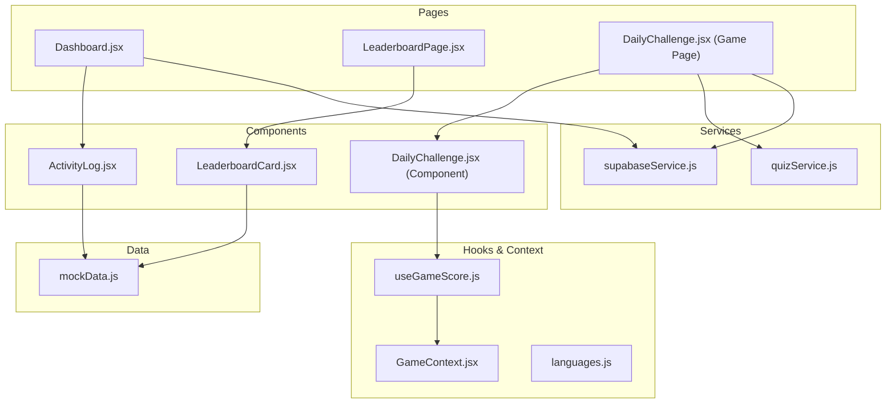
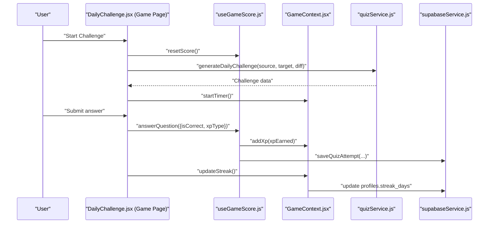
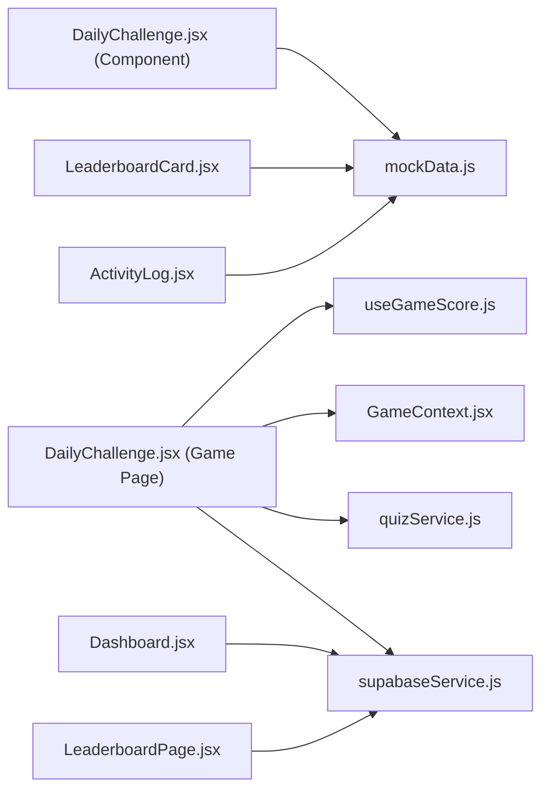

# Specialized Components

<cite>
**Referenced Files in This Document**
- [ActivityLog.jsx](file://src/components/ActivityLog.jsx)
- [DailyChallenge.jsx](file://src/components/DailyChallenge.jsx)
- [LeaderboardCard.jsx](file://src/components/LeaderboardCard.jsx)
- [mockData.js](file://src/data/mockData.js)
- [supabaseService.js](file://src/services/supabaseService.js)
- [Dashboard.jsx](file://src/pages/dashboard/Dashboard.jsx)
- [LeaderboardPage.jsx](file://src/pages/dashboard/LeaderboardPage.jsx)
- [DailyChallenge.jsx](file://src/pages/games/DailyChallenge.jsx)
- [useGameScore.js](file://src/hooks/useGameScore.js)
- [GameContext.jsx](file://src/contexts/GameContext.jsx)
- [languages.js](file://src/config/languages.js)
- [quizService.js](file://src/services/quizService.js)
- [ScoreBadge.jsx](file://src/components/ScoreBadge.jsx)
- [FeedbackToast.jsx](file://src/components/FeedbackToast.jsx)
</cite>

## Table of Contents
1. [Introduction](#introduction)
2. [Project Structure](#project-structure)
3. [Core Components](#core-components)
4. [Architecture Overview](#architecture-overview)
5. [Detailed Component Analysis](#detailed-component-analysis)
6. [Dependency Analysis](#dependency-analysis)
7. [Performance Considerations](#performance-considerations)
8. [Troubleshooting Guide](#troubleshooting-guide)
9. [Conclusion](#conclusion)
10. [Appendices](#appendices)

## Introduction
This document focuses on three specialized UI components that power key application features:
- ActivityLog: displays recent user activity with icons, labels, sublabels, and timestamps.
- DailyChallenge: presents a timed, gamified translation challenge with selection feedback, scoring, and streak integration.
- LeaderboardCard: renders a weekly leaderboard with ranking visualization, user comparison, and social competitive display.

It explains event tracking display, log entry formatting, filtering capabilities, historical data presentation, challenge display, timer integration, progress tracking, gamification elements, ranking visualization, user comparison features, and competitive display patterns. It also covers usage examples, data integration patterns, real-time updates, styling customization, performance optimization, and accessibility considerations.

## Project Structure
The components are implemented as reusable React functional components and integrated into page-level views. They rely on:
- Mock data for quick prototyping and local development.
- Supabase service layer for persistent data operations.
- Game context and hooks for scoring, streak tracking, and XP management.
- Configuration constants for languages, difficulty levels, and XP rewards.

**Diagram sources**
- [ActivityLog.jsx:1-29](file://src/components/ActivityLog.jsx#L1-L29)
- [DailyChallenge.jsx:1-57](file://src/components/DailyChallenge.jsx#L1-L57)
- [LeaderboardCard.jsx:1-48](file://src/components/LeaderboardCard.jsx#L1-L48)
- [Dashboard.jsx:1-151](file://src/pages/dashboard/Dashboard.jsx#L1-L151)
- [LeaderboardPage.jsx:1-78](file://src/pages/dashboard/LeaderboardPage.jsx#L1-L78)
- [DailyChallenge.jsx:1-249](file://src/pages/games/DailyChallenge.jsx#L1-L249)
- [useGameScore.js:1-76](file://src/hooks/useGameScore.js#L1-L76)
- [GameContext.jsx:1-141](file://src/contexts/GameContext.jsx#L1-L141)
- [languages.js:1-30](file://src/config/languages.js#L1-L30)
- [quizService.js:1-154](file://src/services/quizService.js#L1-L154)
- [supabaseService.js:1-132](file://src/services/supabaseService.js#L1-L132)
- [mockData.js:1-47](file://src/data/mockData.js#L1-L47)

**Section sources**
- [ActivityLog.jsx:1-29](file://src/components/ActivityLog.jsx#L1-L29)
- [DailyChallenge.jsx:1-57](file://src/components/DailyChallenge.jsx#L1-L57)
- [LeaderboardCard.jsx:1-48](file://src/components/LeaderboardCard.jsx#L1-L48)
- [Dashboard.jsx:1-151](file://src/pages/dashboard/Dashboard.jsx#L1-L151)
- [LeaderboardPage.jsx:1-78](file://src/pages/dashboard/LeaderboardPage.jsx#L1-L78)
- [DailyChallenge.jsx:1-249](file://src/pages/games/DailyChallenge.jsx#L1-L249)
- [useGameScore.js:1-76](file://src/hooks/useGameScore.js#L1-L76)
- [GameContext.jsx:1-141](file://src/contexts/GameContext.jsx#L1-L141)
- [languages.js:1-30](file://src/config/languages.js#L1-L30)
- [quizService.js:1-154](file://src/services/quizService.js#L1-L154)
- [supabaseService.js:1-132](file://src/services/supabaseService.js#L1-L132)
- [mockData.js:1-47](file://src/data/mockData.js#L1-L47)

## Core Components
- ActivityLog: Renders a compact card with a list of recent activity entries. Each entry includes an icon, a primary label, a secondary sublabel, and a time indicator. It uses Tailwind classes for layout and typography.
- DailyChallenge (Component): Provides a static preview of a daily challenge with options and immediate feedback styling. It demonstrates selection logic and visual feedback for correct/incorrect answers.
- LeaderboardCard: Displays a weekly leaderboard with top ranks, avatars, streak indicators, and personalized highlighting for the current user.

These components are designed to be self-contained and styled via Tailwind utilities, enabling easy customization for different layouts.

**Section sources**
- [ActivityLog.jsx:1-29](file://src/components/ActivityLog.jsx#L1-L29)
- [DailyChallenge.jsx:1-57](file://src/components/DailyChallenge.jsx#L1-L57)
- [LeaderboardCard.jsx:1-48](file://src/components/LeaderboardCard.jsx#L1-L48)

## Architecture Overview
The specialized components integrate with page-level views and shared services:
- Page-level components orchestrate data fetching, state transitions, and rendering of specialized components.
- Services encapsulate database operations for activities, challenges, and leaderboard data.
- Hooks and context manage scoring, streaks, XP, and game state.
- Configuration constants define languages, difficulty levels, and XP reward mechanics.

**Diagram sources**
- [DailyChallenge.jsx:1-249](file://src/pages/games/DailyChallenge.jsx#L1-L249)
- [useGameScore.js:1-76](file://src/hooks/useGameScore.js#L1-L76)
- [GameContext.jsx:1-141](file://src/contexts/GameContext.jsx#L1-L141)
- [quizService.js:1-154](file://src/services/quizService.js#L1-L154)
- [supabaseService.js:1-132](file://src/services/supabaseService.js#L1-L132)

## Detailed Component Analysis

### ActivityLog Component
Purpose:
- Display recent user activity events with a clean, scrollable list.
- Provide a “View all” action to navigate to the full activity history.

Key behaviors:
- Iterates over a predefined activity log dataset.
- Formats each entry with an icon, label, sublabel, and time.
- Uses Tailwind utilities for responsive layout and typography.

Filtering and historical data:
- The current component uses a static dataset. For production, replace with dynamic data fetched from the backend (e.g., quiz attempts or translation history) and apply filters by time window or activity type.

Styling customization:
- Adjust card padding, typography sizes, and spacing via Tailwind utilities.
- Swap icons or change color accents by updating the dataset or adding props.

Accessibility:
- Ensure sufficient color contrast for labels and sublabels.
- Provide focus styles for the “View all” button.

Usage example:
- Integrate into a dashboard page to show recent activity alongside stats and quick actions.

**Section sources**
- [ActivityLog.jsx:1-29](file://src/components/ActivityLog.jsx#L1-L29)
- [mockData.js:16-21](file://src/data/mockData.js#L16-L21)
- [Dashboard.jsx:112-147](file://src/pages/dashboard/Dashboard.jsx#L112-L147)

### DailyChallenge Component (Preview)
Purpose:
- Present a single-choice challenge with immediate feedback and visual cues.

Key behaviors:
- Maintains selection state and computes button classes based on selection and correctness.
- Displays a feedback alert indicating correctness and provides the correct answer when applicable.

Gamification elements:
- Immediate feedback improves engagement.
- Button styling differentiates correct, incorrect, and locked states.

Styling customization:
- Modify button classes, alert styles, and badges to match brand guidelines.
- Add animations or transitions for selection feedback.

Accessibility:
- Ensure keyboard navigation for option buttons.
- Provide ARIA attributes for feedback alerts.

Usage example:
- Use in a dashboard widget to encourage daily participation.

**Section sources**
- [DailyChallenge.jsx:1-57](file://src/components/DailyChallenge.jsx#L1-L57)
- [mockData.js:33-38](file://src/data/mockData.js#L33-L38)

### DailyChallenge (Game Page)
Purpose:
- Full-featured timed translation challenge with setup, gameplay, and results screens.

Key behaviors:
- Setup screen allows selecting source/target languages and difficulty, with XP multiplier hints.
- Gameplay screen displays the prompt, hint, user input, submission logic, and correctness feedback.
- Results screen shows elapsed time and total XP earned.

Timer integration:
- A client-side timer counts seconds while the challenge is active.
- Timer is paused during feedback and cleared on completion.

Progress tracking:
- Scoring tracked via a hook that accumulates XP and records answers.
- Streak updated upon successful completion.

Gamification elements:
- Difficulty affects XP multiplier.
- XP gain is visually indicated and persisted.
- Streak banner encourages continued play.

Real-time updates:
- Timer updates every second.
- Feedback toast appears after submission and auto-dismisses.

Data integration patterns:
- Generates challenges via a service that queries LLMs.
- Persists quiz attempts and XP gains to the database.

**Section sources**
- [DailyChallenge.jsx:1-249](file://src/pages/games/DailyChallenge.jsx#L1-L249)
- [useGameScore.js:1-76](file://src/hooks/useGameScore.js#L1-L76)
- [GameContext.jsx:1-141](file://src/contexts/GameContext.jsx#L1-L141)
- [languages.js:14-25](file://src/config/languages.js#L14-L25)
- [quizService.js:66-88](file://src/services/quizService.js#L66-L88)
- [supabaseService.js:32-58](file://src/services/supabaseService.js#L32-L58)

### LeaderboardCard Component
Purpose:
- Display a weekly leaderboard with top-ranked users, personal highlighting, and streak indicators.

Key behaviors:
- Renders a list of leaderboard entries with rank badges (medals for top 3).
- Highlights the current user’s row and adjusts text colors accordingly.
- Shows user initials, name, streak, and points.

User comparison features:
- Personal row is visually distinct (highlighted ring and background).
- Current user is marked for easy identification.

Competitive display patterns:
- Rank badges use emojis for top 3 and numeric labels for others.
- Points are localized for readability.

Styling customization:
- Adjust avatar sizes, badge styles, and row paddings.
- Change highlight colors and borders to align with branding.

Accessibility:
- Ensure readable contrast for highlighted rows and badges.
- Provide clear labels for “You” marker.

Usage example:
- Place in a dashboard or leaderboard page to showcase weekly competition.

**Section sources**
- [LeaderboardCard.jsx:1-48](file://src/components/LeaderboardCard.jsx#L1-L48)
- [mockData.js:40-46](file://src/data/mockData.js#L40-L46)
- [LeaderboardPage.jsx:1-78](file://src/pages/dashboard/LeaderboardPage.jsx#L1-L78)

### LeaderboardPage Integration
Purpose:
- Fetch and render a full leaderboard with server-side data.

Key behaviors:
- Loads leaderboard data from the backend and maps it to a display-friendly structure.
- Highlights the current user and shows initials derived from display name.

Filtering and historical data:
- Uses a backend endpoint to retrieve top players ordered by XP.
- Supports pagination limits for performance.

**Section sources**
- [LeaderboardPage.jsx:1-78](file://src/pages/dashboard/LeaderboardPage.jsx#L1-L78)
- [supabaseService.js:111-119](file://src/services/supabaseService.js#L111-L119)

## Dependency Analysis
The components depend on shared services, hooks, and context for data and state management. The following diagram shows key dependencies:

**Diagram sources**
- [DailyChallenge.jsx:1-57](file://src/components/DailyChallenge.jsx#L1-L57)
- [LeaderboardCard.jsx:1-48](file://src/components/LeaderboardCard.jsx#L1-L48)
- [DailyChallenge.jsx:1-249](file://src/pages/games/DailyChallenge.jsx#L1-L249)
- [useGameScore.js:1-76](file://src/hooks/useGameScore.js#L1-L76)
- [GameContext.jsx:1-141](file://src/contexts/GameContext.jsx#L1-L141)
- [quizService.js:1-154](file://src/services/quizService.js#L1-L154)
- [supabaseService.js:1-132](file://src/services/supabaseService.js#L1-L132)
- [ActivityLog.jsx:1-29](file://src/components/ActivityLog.jsx#L1-L29)
- [Dashboard.jsx:1-151](file://src/pages/dashboard/Dashboard.jsx#L1-L151)
- [LeaderboardPage.jsx:1-78](file://src/pages/dashboard/LeaderboardPage.jsx#L1-L78)
- [mockData.js:1-47](file://src/data/mockData.js#L1-L47)

**Section sources**
- [DailyChallenge.jsx:1-57](file://src/components/DailyChallenge.jsx#L1-L57)
- [LeaderboardCard.jsx:1-48](file://src/components/LeaderboardCard.jsx#L1-L48)
- [DailyChallenge.jsx:1-249](file://src/pages/games/DailyChallenge.jsx#L1-L249)
- [useGameScore.js:1-76](file://src/hooks/useGameScore.js#L1-L76)
- [GameContext.jsx:1-141](file://src/contexts/GameContext.jsx#L1-L141)
- [quizService.js:1-154](file://src/services/quizService.js#L1-L154)
- [supabaseService.js:1-132](file://src/services/supabaseService.js#L1-L132)
- [ActivityLog.jsx:1-29](file://src/components/ActivityLog.jsx#L1-L29)
- [Dashboard.jsx:1-151](file://src/pages/dashboard/Dashboard.jsx#L1-L151)
- [LeaderboardPage.jsx:1-78](file://src/pages/dashboard/LeaderboardPage.jsx#L1-L78)
- [mockData.js:1-47](file://src/data/mockData.js#L1-L47)

## Performance Considerations
- ActivityLog and LeaderboardCard lists:
  - Prefer virtualization for large datasets to reduce DOM nodes.
  - Memoize list items to prevent unnecessary re-renders.
- DailyChallenge (Game Page):
  - Debounce timer updates to minimize re-renders.
  - Avoid heavy computations in render; compute derived values in effects or hooks.
- Data fetching:
  - Paginate leaderboard and recent activity to limit payload size.
  - Cache frequently accessed data (e.g., user profile) to reduce network calls.
- Styling:
  - Use Tailwind utilities efficiently; avoid deeply nested classes.
  - Extract repeated class sets into variables to improve readability and performance.

[No sources needed since this section provides general guidance]

## Troubleshooting Guide
Common issues and resolutions:
- ActivityLog not showing data:
  - Verify the dataset is imported and the list iteration is correct.
  - Ensure Tailwind classes are applied and no layout conflicts hide content.
- DailyChallenge feedback not appearing:
  - Confirm the selection state is toggled and feedback conditions are met.
  - Check that the feedback alert condition evaluates to true when submission occurs.
- LeaderboardCard missing highlights:
  - Ensure the current user property is set and compared correctly.
  - Verify that the highlight classes are applied conditionally.
- Timer not updating:
  - Confirm the interval is started and cleared appropriately on unmount.
  - Ensure the timer state is updated only when the challenge is active.
- Streak not incrementing:
  - Verify the last active date check prevents multiple increments per day.
  - Confirm the backend update succeeds and XP bonus is awarded.

**Section sources**
- [DailyChallenge.jsx:46-48](file://src/pages/games/DailyChallenge.jsx#L46-L48)
- [GameContext.jsx:107-119](file://src/contexts/GameContext.jsx#L107-L119)
- [supabaseService.js:111-119](file://src/services/supabaseService.js#L111-L119)

## Conclusion
The specialized components deliver focused, reusable UI for activity tracking, gamified challenges, and competitive leaderboards. By integrating with services, hooks, and context, they support scalable data flows, real-time updates, and consistent styling. Extending these components involves replacing static datasets with dynamic data, enhancing feedback mechanisms, and optimizing rendering performance.

[No sources needed since this section summarizes without analyzing specific files]

## Appendices

### Component Usage Patterns
- ActivityLog:
  - Place in dashboards to surface recent activity.
  - Replace static dataset with backend-fetched quiz attempts or translation history.
- DailyChallenge (Component):
  - Embed in widgets to promote daily participation.
  - Extend with timers and scoring for interactive demos.
- DailyChallenge (Game Page):
  - Use as the primary screen for timed challenges.
  - Integrate with scoring hooks and context for XP and streak tracking.
- LeaderboardCard:
  - Display in dashboards and leaderboard pages.
  - Highlight the current user and localize scores for readability.

[No sources needed since this section provides general guidance]

### Accessibility Checklist
- Ensure sufficient color contrast for text and backgrounds.
- Provide keyboard navigation for interactive elements (buttons, selects).
- Add ARIA roles and labels for feedback alerts and progress indicators.
- Use semantic HTML and landmarks for screen reader support.
- Test with assistive technologies and adjust focus styles accordingly.

[No sources needed since this section provides general guidance]