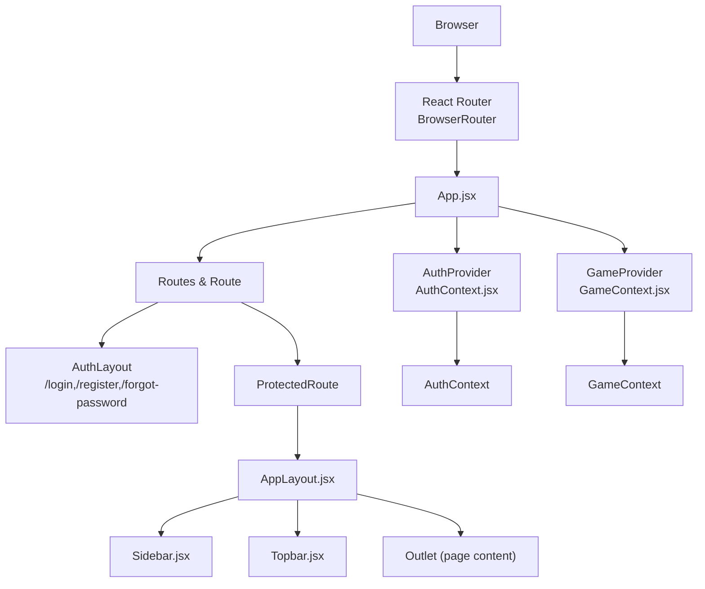
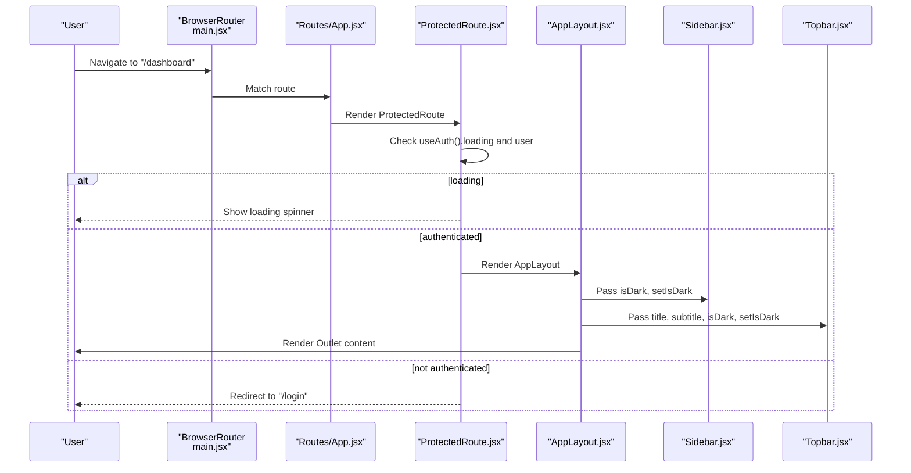
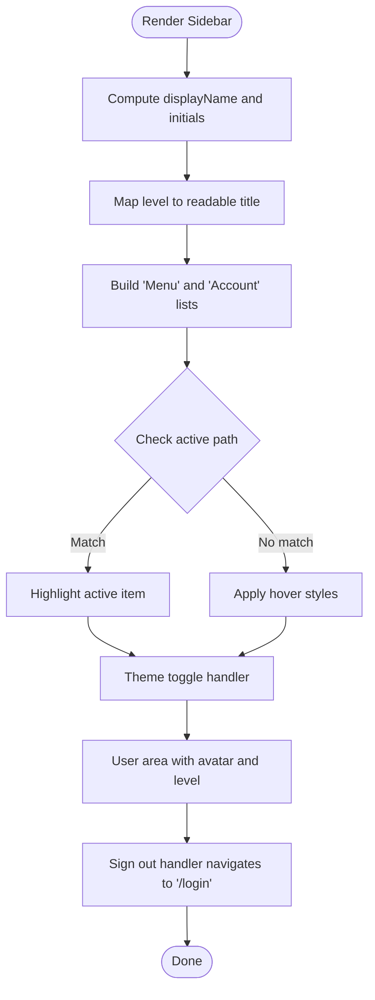
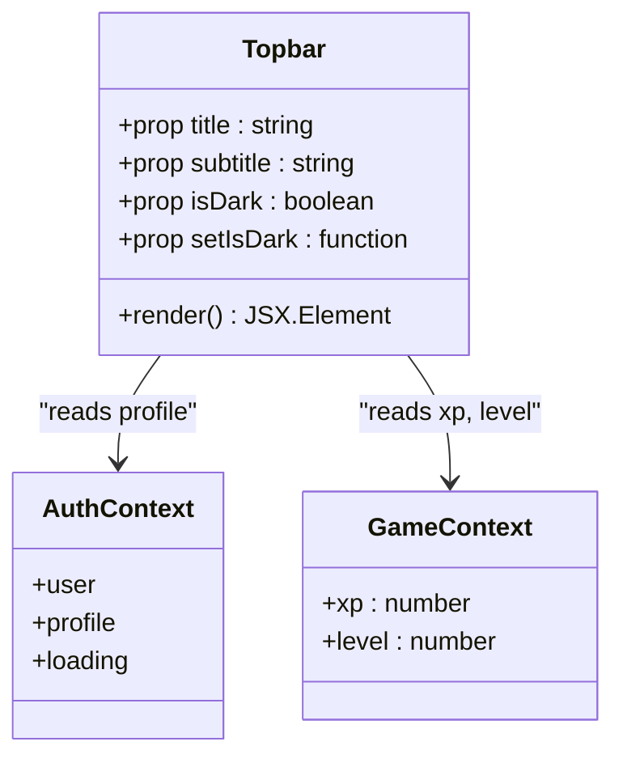
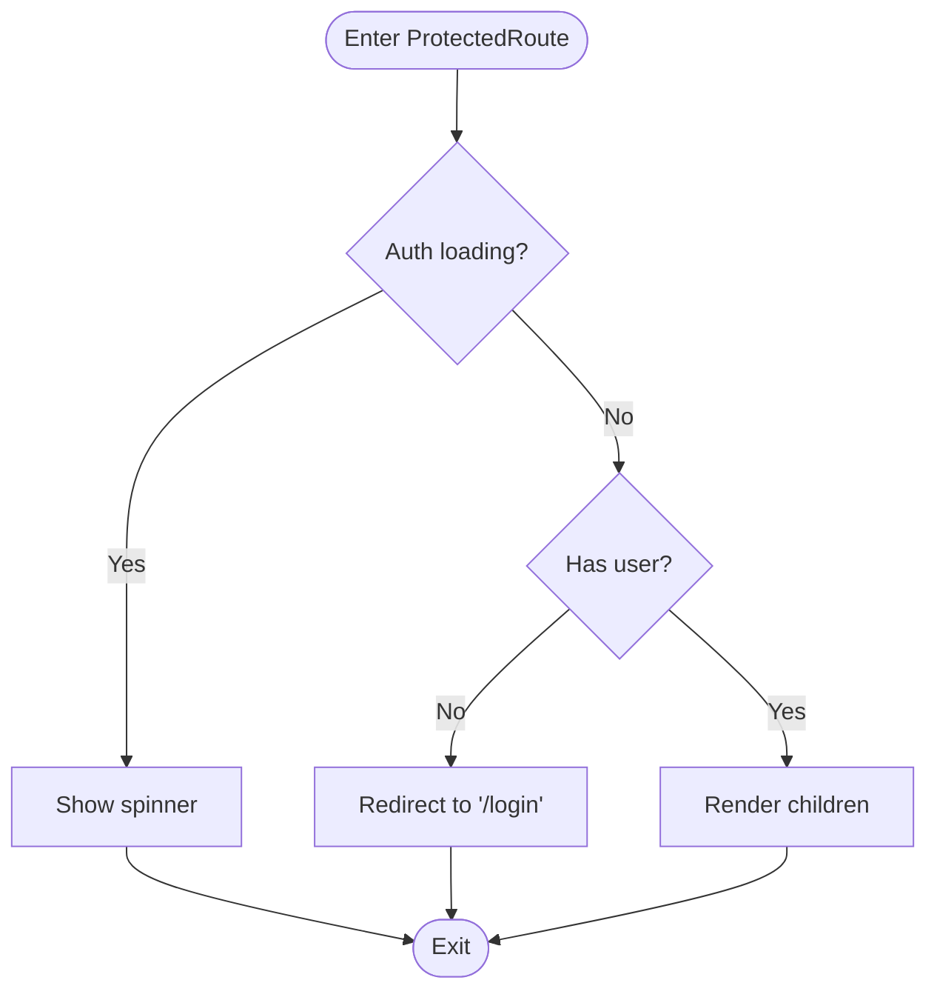
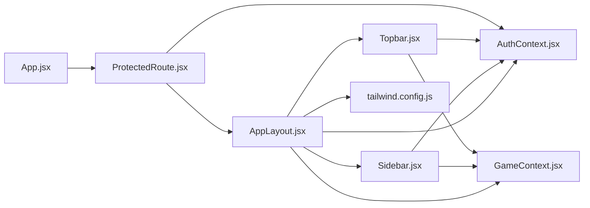

# UI Foundation Components

<cite>
**Referenced Files in This Document**
- [Sidebar.jsx](file://src/components/Sidebar.jsx)
- [Topbar.jsx](file://src/components/Topbar.jsx)
- [ProtectedRoute.jsx](file://src/components/ProtectedRoute.jsx)
- [AppLayout.jsx](file://src/layouts/AppLayout.jsx)
- [App.jsx](file://src/App.jsx)
- [AuthContext.jsx](file://src/contexts/AuthContext.jsx)
- [GameContext.jsx](file://src/contexts/GameContext.jsx)
- [tailwind.config.js](file://tailwind.config.js)
- [main.jsx](file://src/main.jsx)
</cite>

## Table of Contents
1. [Introduction](#introduction)
2. [Project Structure](#project-structure)
3. [Core Components](#core-components)
4. [Architecture Overview](#architecture-overview)
5. [Detailed Component Analysis](#detailed-component-analysis)
6. [Dependency Analysis](#dependency-analysis)
7. [Performance Considerations](#performance-considerations)
8. [Troubleshooting Guide](#troubleshooting-guide)
9. [Conclusion](#conclusion)
10. [Appendices](#appendices)

## Introduction
This document describes the foundational UI components that form the application’s structural framework. It focuses on three pillars:
- Sidebar: Navigation patterns, menu items, and user area behavior
- Topbar: User interaction elements, XP/level badges, notifications, and branding
- ProtectedRoute: Authentication gating, redirect logic, and route protection strategies

It also covers styling via Tailwind CSS and daisyUI, responsive design considerations, accessibility features, customization patterns, and secure routing integration with the overall application layout.

## Project Structure
The UI foundation is composed of:
- Layout container that orchestrates Sidebar and Topbar
- Authentication and game state providers feeding contextual data to UI components
- ProtectedRoute enforcing authentication at the routing level
- Tailwind/daisyUI configuration enabling theme switching and consistent design tokens

**Diagram sources**
- [main.jsx:7-13](file://src/main.jsx#L7-L13)
- [App.jsx:19-49](file://src/App.jsx#L19-L49)
- [AppLayout.jsx:17-41](file://src/layouts/AppLayout.jsx#L17-L41)
- [Sidebar.jsx:19-121](file://src/components/Sidebar.jsx#L19-L121)
- [Topbar.jsx:4-56](file://src/components/Topbar.jsx#L4-L56)
- [AuthContext.jsx:6-94](file://src/contexts/AuthContext.jsx#L6-L94)
- [GameContext.jsx:57-134](file://src/contexts/GameContext.jsx#L57-L134)

**Section sources**
- [main.jsx:7-13](file://src/main.jsx#L7-L13)
- [App.jsx:19-49](file://src/App.jsx#L19-L49)
- [AppLayout.jsx:17-41](file://src/layouts/AppLayout.jsx#L17-L41)

## Core Components
This section documents the three core components and their roles in the application layout.

- Sidebar
  - Purpose: Provides primary navigation, account actions, theme toggle, and user profile/sign-out
  - Navigation items: Dashboard, Translation Chat, Vocabulary Quiz, Sentence Builder, Daily Challenge, Leaderboard, My Progress, Settings
  - Behavior: Highlights active route, computes user initials and level title, handles sign-out and navigation
  - Styling: Uses Tailwind with daisyUI components and theme-aware base colors

- Topbar
  - Purpose: Displays page title/subtitle, XP and level badges, dark/light mode toggle, notification indicator, and avatar
  - Data: Pulls user profile and game stats (XP, level) from contexts
  - Styling: Compact horizontal bar with badges and interactive controls

- ProtectedRoute
  - Purpose: Guards protected routes by checking authentication state
  - Behavior: Renders a loading spinner while auth initializes, redirects unauthenticated users to login, otherwise renders children
  - Integration: Wraps AppLayout in the route configuration

**Section sources**
- [Sidebar.jsx:5-17](file://src/components/Sidebar.jsx#L5-L17)
- [Sidebar.jsx:19-121](file://src/components/Sidebar.jsx#L19-L121)
- [Topbar.jsx:4-56](file://src/components/Topbar.jsx#L4-L56)
- [ProtectedRoute.jsx:4-17](file://src/components/ProtectedRoute.jsx#L4-L17)
- [AppLayout.jsx:6-15](file://src/layouts/AppLayout.jsx#L6-L15)

## Architecture Overview
The application enforces authentication at the routing level and composes the UI with a shared layout. The layout manages theme persistence and page metadata for the Topbar.

**Diagram sources**
- [main.jsx:7-13](file://src/main.jsx#L7-L13)
- [App.jsx:32-41](file://src/App.jsx#L32-L41)
- [ProtectedRoute.jsx:4-17](file://src/components/ProtectedRoute.jsx#L4-L17)
- [AppLayout.jsx:17-41](file://src/layouts/AppLayout.jsx#L17-L41)
- [Sidebar.jsx:19-121](file://src/components/Sidebar.jsx#L19-L121)
- [Topbar.jsx:4-56](file://src/components/Topbar.jsx#L4-L56)

## Detailed Component Analysis

### Sidebar Component
- Navigation patterns
  - Static menu groups: “Menu” and “Account”
  - Active state highlighting based on current pathname
  - Click handlers trigger programmatic navigation via router
  - Badge support for prominent items (e.g., AI)
- Menu items
  - Dashboard, Translation Chat, Vocabulary Quiz, Sentence Builder, Daily Challenge
  - Leaderboard, My Progress, Settings
- User area
  - Displays user initials and computed level title derived from XP/level
  - Sign-out triggers auth service and navigates to login
- Responsive behavior
  - Fixed width sidebar with scrollable navigation area
  - Sticky positioning ensures it remains visible during vertical scrolling
- Styling and accessibility
  - Uses Tailwind spacing, color tokens, and daisyUI components
  - Interactive elements use hover/focus states; icons provide visual cues
- Customization guide
  - Add/remove items by editing static arrays
  - Extend with dynamic items using context-provided profile/game data
  - Integrate badges or counters by adding conditional rendering logic

**Diagram sources**
- [Sidebar.jsx:19-34](file://src/components/Sidebar.jsx#L19-L34)
- [Sidebar.jsx:44-86](file://src/components/Sidebar.jsx#L44-L86)
- [Sidebar.jsx:88-119](file://src/components/Sidebar.jsx#L88-L119)

**Section sources**
- [Sidebar.jsx:5-17](file://src/components/Sidebar.jsx#L5-L17)
- [Sidebar.jsx:19-121](file://src/components/Sidebar.jsx#L19-L121)

### Topbar Component
- User interaction elements
  - XP badge and level badge display live game stats
  - Dark/light mode toggle synchronized with layout state
  - Notification indicator with small dot badge
  - Avatar button for user profile/quick actions
- Branding features
  - Page title and optional subtitle from AppLayout metadata
  - Consistent use of badges and icons for visual hierarchy
- Styling and responsiveness
  - Horizontal layout with flexible title area and fixed-width controls
  - Badge sizes adapt to content density
- Accessibility
  - Buttons use semantic roles and focus states
  - Icons accompanied by descriptive titles on interactive elements

**Diagram sources**
- [Topbar.jsx:4-56](file://src/components/Topbar.jsx#L4-L56)
- [AuthContext.jsx:86-93](file://src/contexts/AuthContext.jsx#L86-L93)
- [GameContext.jsx:125-133](file://src/contexts/GameContext.jsx#L125-L133)

**Section sources**
- [Topbar.jsx:4-56](file://src/components/Topbar.jsx#L4-L56)

### ProtectedRoute Component
- Authentication gating mechanism
  - Reads authentication state from AuthContext
  - Handles initialization phase with a loading spinner
  - Redirects to login when user is absent
- Redirect logic
  - Uses React Router’s Navigate to enforce redirection
  - Replace flag ensures clean browser history
- Route protection strategies
  - Wrap any layout or page requiring authentication
  - Keep sensitive data fetching inside protected components/pages
- Integration patterns
  - Applied around AppLayout in route configuration
  - Works alongside context providers to ensure consistent state

**Diagram sources**
- [ProtectedRoute.jsx:4-17](file://src/components/ProtectedRoute.jsx#L4-L17)
- [App.jsx:32-32](file://src/App.jsx#L32-L32)

**Section sources**
- [ProtectedRoute.jsx:4-17](file://src/components/ProtectedRoute.jsx#L4-L17)
- [App.jsx:32-32](file://src/App.jsx#L32-L32)

### AppLayout Integration
- Theme management
  - Persists theme preference in local storage
  - Applies data-theme attribute for daisyUI theme switching
- Dynamic page metadata
  - Maps current path to title and subtitle for Topbar
  - Defaults to dashboard metadata if path not found
- Composition
  - Hosts Sidebar and Topbar, delegates outlet rendering to child routes

**Section sources**
- [AppLayout.jsx:17-41](file://src/layouts/AppLayout.jsx#L17-L41)

## Dependency Analysis
The UI foundation components depend on:
- Routing and layout orchestration
- Authentication and game state providers
- Tailwind/daisyUI for styling and theme tokens

**Diagram sources**
- [App.jsx:19-49](file://src/App.jsx#L19-L49)
- [ProtectedRoute.jsx:4-17](file://src/components/ProtectedRoute.jsx#L4-L17)
- [AppLayout.jsx:17-41](file://src/layouts/AppLayout.jsx#L17-L41)
- [Sidebar.jsx:19-121](file://src/components/Sidebar.jsx#L19-L121)
- [Topbar.jsx:4-56](file://src/components/Topbar.jsx#L4-L56)
- [AuthContext.jsx:6-94](file://src/contexts/AuthContext.jsx#L6-L94)
- [GameContext.jsx:57-134](file://src/contexts/GameContext.jsx#L57-L134)
- [tailwind.config.js:20-64](file://tailwind.config.js#L20-L64)

**Section sources**
- [App.jsx:19-49](file://src/App.jsx#L19-L49)
- [AppLayout.jsx:17-41](file://src/layouts/AppLayout.jsx#L17-L41)
- [tailwind.config.js:20-64](file://tailwind.config.js#L20-L64)

## Performance Considerations
- Rendering cost
  - Sidebar and Topbar re-render on theme and context changes; keep render trees shallow
  - Avoid heavy computations in render; memoize derived values (e.g., level titles)
- Navigation
  - Programmatic navigation via router avoids unnecessary re-renders compared to anchor tags
- Theme switching
  - Local storage reads/writes occur on toggle; batch updates to minimize layout thrash
- Accessibility
  - Prefer native buttons for interactive elements; ensure keyboard focus order is logical
  - Provide visible focus indicators and ARIA attributes where appropriate

## Troubleshooting Guide
- ProtectedRoute shows loading spinner indefinitely
  - Ensure AuthProvider wraps the application and AuthContext is initialized
  - Verify Supabase session retrieval completes without errors
- Redirect loops to login
  - Confirm that authenticated sessions persist and profile data loads
  - Check that sign-in/sign-out flows update context state correctly
- Sidebar highlights wrong item
  - Ensure route paths match nav item paths exactly
  - Confirm useLocation reflects the current route after navigation
- Theme toggle does not persist
  - Verify local storage availability and correct key usage
  - Confirm AppLayout applies data-theme attribute consistently
- Topbar badges not updating
  - Ensure GameProvider is mounted and GameContext updates XP/level
  - Check that Topbar consumes the latest values from context

**Section sources**
- [ProtectedRoute.jsx:7-15](file://src/components/ProtectedRoute.jsx#L7-L15)
- [AuthContext.jsx:12-30](file://src/contexts/AuthContext.jsx#L12-L30)
- [GameContext.jsx:57-73](file://src/contexts/GameContext.jsx#L57-L73)
- [AppLayout.jsx:18-24](file://src/layouts/AppLayout.jsx#L18-L24)

## Conclusion
The UI foundation components provide a cohesive, secure, and accessible layout for the application. Sidebar and Topbar deliver consistent navigation and user feedback, while ProtectedRoute ensures robust authentication gating. Tailwind CSS and daisyUI enable rapid development with theme-aware styling and responsive behavior. The design supports easy customization of navigation, extension of sidebar functionality, and secure routing patterns.

## Appendices

### Styling Approaches Using Tailwind CSS and DaisyUI
- Design tokens
  - Primary, secondary, accent, neutral, and base palette defined per theme
  - Base colors for backgrounds, borders, and content contrast
- Component classes
  - Use badge variants for XP/level and notification indicators
  - Leverage swap toggles for theme switching
  - Apply menu and avatar utilities for consistent spacing and alignment
- Responsive design
  - Utilize responsive utilities to adjust layout on smaller screens
  - Keep interactive elements sized appropriately for touch targets
- Accessibility
  - Ensure sufficient color contrast against base backgrounds
  - Provide focus-visible outlines and clear hover/focus states

**Section sources**
- [tailwind.config.js:20-64](file://tailwind.config.js#L20-L64)
- [Sidebar.jsx:37-119](file://src/components/Sidebar.jsx#L37-L119)
- [Topbar.jsx:12-56](file://src/components/Topbar.jsx#L12-L56)

### Customizing Navigation Behavior and Extending Sidebar Functionality
- Add new navigation items
  - Extend the static arrays with new entries and ensure matching routes exist
  - Use conditional rendering for dynamic items based on user role or progress
- Integrate badges/counters
  - Add badge rendering logic for items reflecting unread counts or achievements
- Enhance user area
  - Expand profile actions or integrate quick-access menus
  - Connect sign-out to additional cleanup tasks if needed

**Section sources**
- [Sidebar.jsx:5-17](file://src/components/Sidebar.jsx#L5-L17)
- [Sidebar.jsx:44-86](file://src/components/Sidebar.jsx#L44-L86)

### Implementing Secure Routing Patterns
- Wrap layouts and pages requiring authentication with ProtectedRoute
- Ensure providers (AuthProvider, GameProvider) are mounted at the root
- Use explicit redirects to login for unauthenticated users
- Avoid rendering sensitive content until auth state is confirmed

**Section sources**
- [App.jsx:32-41](file://src/App.jsx#L32-L41)
- [ProtectedRoute.jsx:4-17](file://src/components/ProtectedRoute.jsx#L4-L17)