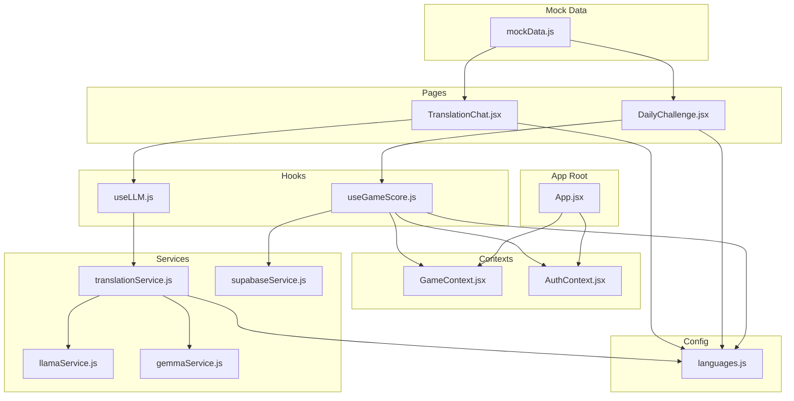
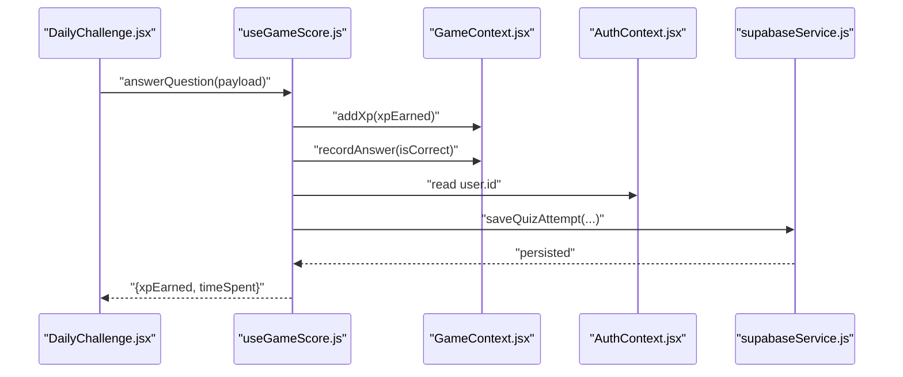
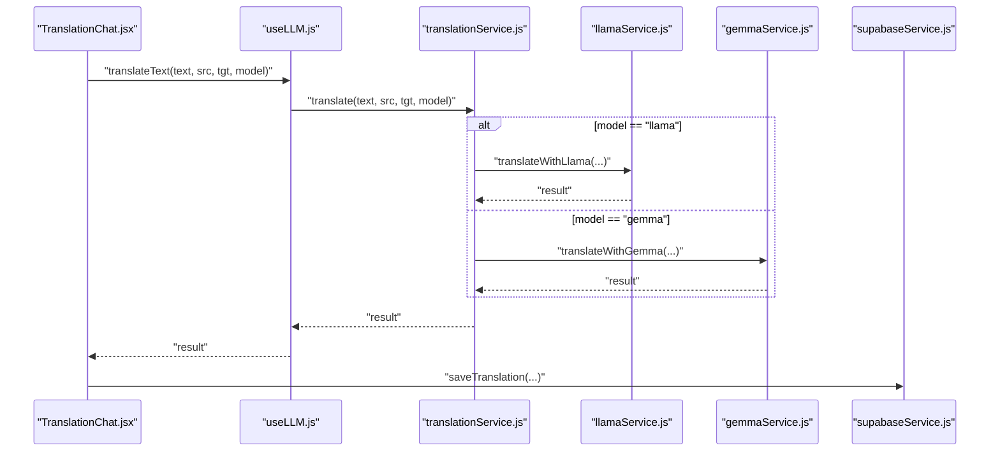
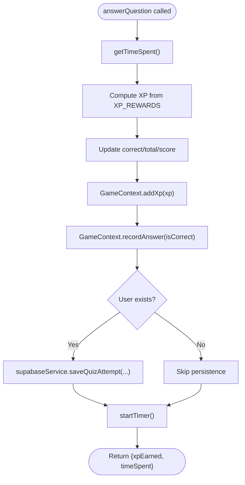
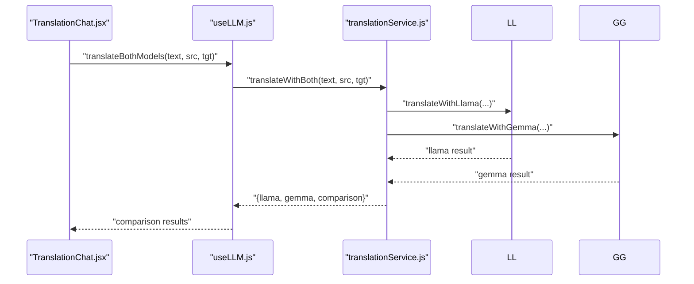
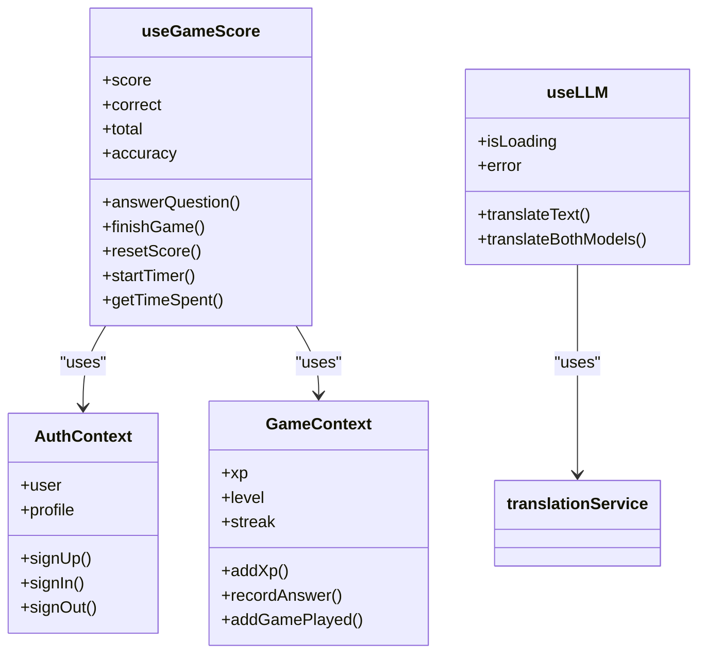
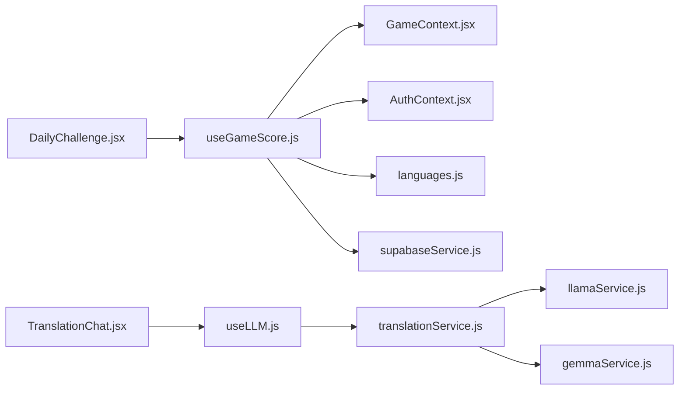

# Custom Hooks and Utilities

<cite>
**Referenced Files in This Document**
- [useGameScore.js](file://src/hooks/useGameScore.js)
- [useLLM.js](file://src/hooks/useLLM.js)
- [GameContext.jsx](file://src/contexts/GameContext.jsx)
- [AuthContext.jsx](file://src/contexts/AuthContext.jsx)
- [languages.js](file://src/config/languages.js)
- [supabaseService.js](file://src/services/supabaseService.js)
- [translationService.js](file://src/services/translationService.js)
- [llamaService.js](file://src/services/llamaService.js)
- [gemmaService.js](file://src/services/gemmaService.js)
- [mockData.js](file://src/data/mockData.js)
- [DailyChallenge.jsx](file://src/pages/games/DailyChallenge.jsx)
- [TranslationChat.jsx](file://src/pages/chat/TranslationChat.jsx)
- [App.jsx](file://src/App.jsx)
</cite>

## Update Summary
**Changes Made**
- Added comprehensive documentation for the new useGameScore hook for gamification state management
- Added comprehensive documentation for the new useLLM hook for AI model interaction
- Updated architecture diagrams to reflect the new hook integration patterns
- Enhanced dependency analysis with detailed service integrations
- Expanded troubleshooting guide with hook-specific guidance
- Updated performance considerations with memoization strategies

## Table of Contents
1. [Introduction](#introduction)
2. [Project Structure](#project-structure)
3. [Core Components](#core-components)
4. [Architecture Overview](#architecture-overview)
5. [Detailed Component Analysis](#detailed-component-analysis)
6. [Dependency Analysis](#dependency-analysis)
7. [Performance Considerations](#performance-considerations)
8. [Troubleshooting Guide](#troubleshooting-guide)
9. [Conclusion](#conclusion)
10. [Appendices](#appendices)

## Introduction
This document explains the custom hooks and utility functions that power game scoring and AI translation workflows in the application. It focuses on:
- useGameScore: a hook for managing quiz/game state, timing, XP calculation, and persistence
- useLLM: a hook for orchestrating AI-powered translation with Llama and Gemma models
- Supporting utilities: context providers, configuration, services, and mock data
- Hook composition patterns, dependency management, performance optimization, and testing strategies
- Practical usage patterns in components and guidance for extending or creating new hooks

## Project Structure
The relevant parts of the codebase are organized by domain:
- Hooks: src/hooks
- Context Providers: src/contexts
- Services: src/services
- Configuration: src/config
- Mock data: src/data
- Pages/components using hooks: src/pages and src/components



**Diagram sources**
- [App.jsx:19-49](file://src/App.jsx#L19-L49)
- [useGameScore.js:7-75](file://src/hooks/useGameScore.js#L7-L75)
- [useLLM.js:4-36](file://src/hooks/useLLM.js#L4-L36)
- [GameContext.jsx:57-134](file://src/contexts/GameContext.jsx#L57-L134)
- [AuthContext.jsx:6-94](file://src/contexts/AuthContext.jsx#L6-L94)
- [translationService.js:12-72](file://src/services/translationService.js#L12-L72)
- [llamaService.js:14-60](file://src/services/llamaService.js#L14-L60)
- [gemmaService.js:16-44](file://src/services/gemmaService.js#L16-L44)
- [supabaseService.js:32-58](file://src/services/supabaseService.js#L32-L58)
- [languages.js:20-29](file://src/config/languages.js#L20-L29)
- [mockData.js:1-47](file://src/data/mockData.js#L1-L47)
- [DailyChallenge.jsx:24-80](file://src/pages/games/DailyChallenge.jsx#L24-L80)
- [TranslationChat.jsx:13-98](file://src/pages/chat/TranslationChat.jsx#L13-L98)

**Section sources**
- [App.jsx:19-49](file://src/App.jsx#L19-L49)

## Core Components
- useGameScore: centralizes quiz/game scoring, timing, XP rewards, and persistence
- useLLM: encapsulates translation operations, loading/error states, and dual-model comparison
- Context providers: GameContext and AuthContext supply shared state and actions
- Services: translationService coordinates model-specific services and comparison logic
- Configuration: languages defines XP rewards and level calculation
- Persistence: supabaseService persists quiz attempts and translations
- Mock data: mockData supplies static datasets for dashboards and development

**Section sources**
- [useGameScore.js:7-75](file://src/hooks/useGameScore.js#L7-L75)
- [useLLM.js:4-36](file://src/hooks/useLLM.js#L4-L36)
- [GameContext.jsx:20-55](file://src/contexts/GameContext.jsx#L20-L55)
- [AuthContext.jsx:6-94](file://src/contexts/AuthContext.jsx#L6-L94)
- [translationService.js:12-72](file://src/services/translationService.js#L12-L72)
- [languages.js:20-29](file://src/config/languages.js#L20-L29)
- [supabaseService.js:32-58](file://src/services/supabaseService.js#L32-L58)
- [mockData.js:1-47](file://src/data/mockData.js#L1-L47)

## Architecture Overview
The hooks integrate with context providers and services to deliver cohesive functionality:
- useGameScore depends on GameContext for XP/streak and on AuthContext for user identity
- useLLM depends on translationService, which selects between llamaService and gemmaService
- Both hooks persist outcomes via supabaseService when a user is present
- Components orchestrate hook usage to render UI and manage user interactions



**Diagram sources**
- [DailyChallenge.jsx:70-76](file://src/pages/games/DailyChallenge.jsx#L70-L76)
- [useGameScore.js:23-55](file://src/hooks/useGameScore.js#L23-L55)
- [GameContext.jsx:76-85](file://src/contexts/GameContext.jsx#L76-L85)
- [supabaseService.js:32-45](file://src/services/supabaseService.js#L32-L45)



**Diagram sources**
- [TranslationChat.jsx:67-88](file://src/pages/chat/TranslationChat.jsx#L67-L88)
- [useLLM.js:8-20](file://src/hooks/useLLM.js#L8-L20)
- [translationService.js:12-20](file://src/services/translationService.js#L12-L20)
- [llamaService.js:14-60](file://src/services/llamaService.js#L14-L60)
- [gemmaService.js:16-44](file://src/services/gemmaService.js#L16-L44)
- [supabaseService.js:5-17](file://src/services/supabaseService.js#L5-L17)

## Detailed Component Analysis

### useGameScore Hook
Purpose:
- Track score, correct answers, total attempts, and derived accuracy
- Measure time spent per question and compute XP rewards
- Persist quiz attempts to the database when a user is logged in
- Coordinate with GameContext for XP/streak and with AuthContext for user identity

Key behaviors:
- Timer management via useRef and memoized callbacks
- XP reward calculation using XP_REWARDS from languages configuration
- Asynchronous persistence via supabaseService.saveQuizAttempt
- Composition with GameContext actions: addXp, recordAnswer, addGamePlayed

Usage pattern in components:
- Initialize/reset score and timer
- On answer submission, call answerQuestion with question metadata and correctness
- At game end, call finishGame to compute final stats
- Reset state between sessions with resetScore



**Diagram sources**
- [useGameScore.js:23-55](file://src/hooks/useGameScore.js#L23-L55)
- [languages.js:20-25](file://src/config/languages.js#L20-L25)
- [supabaseService.js:32-45](file://src/services/supabaseService.js#L32-L45)

**Section sources**
- [useGameScore.js:7-75](file://src/hooks/useGameScore.js#L7-L75)
- [languages.js:20-29](file://src/config/languages.js#L20-L29)
- [supabaseService.js:32-58](file://src/services/supabaseService.js#L32-L58)
- [DailyChallenge.jsx:24-80](file://src/pages/games/DailyChallenge.jsx#L24-L80)

### useLLM Hook
Purpose:
- Provide a unified interface for translation using either Llama or Gemma
- Support dual-model comparison for evaluation and insight
- Manage loading and error states consistently

Key behaviors:
- translateText: single-model translation with error propagation and cleanup
- translateBothModels: parallel execution of both models and comparison metrics
- Error handling: capture error messages and surface them to callers
- Loading state: setIsLoading in try/catch/finally blocks



**Diagram sources**
- [useLLM.js:22-34](file://src/hooks/useLLM.js#L22-L34)
- [translationService.js:25-42](file://src/services/translationService.js#L25-L42)
- [llamaService.js:14-60](file://src/services/llamaService.js#L14-L60)
- [gemmaService.js:16-44](file://src/services/gemmaService.js#L16-L44)

**Section sources**
- [useLLM.js:4-36](file://src/hooks/useLLM.js#L4-L36)
- [translationService.js:12-72](file://src/services/translationService.js#L12-L72)
- [TranslationChat.jsx:13-98](file://src/pages/chat/TranslationChat.jsx#L13-L98)

### Context Providers and Composition
- GameContext manages XP, level, streak, and game statistics; exposes actions to mutate state and persist to Supabase
- AuthContext manages authentication state and user profile; used by useGameScore to persist quiz attempts
- useGameScore composes useAuth and useGame to access user identity and game actions
- useLLM composes translationService, which composes model-specific services



**Diagram sources**
- [AuthContext.jsx:6-94](file://src/contexts/AuthContext.jsx#L6-L94)
- [GameContext.jsx:57-134](file://src/contexts/GameContext.jsx#L57-L134)
- [useGameScore.js:7-75](file://src/hooks/useGameScore.js#L7-L75)
- [useLLM.js:4-36](file://src/hooks/useLLM.js#L4-L36)

**Section sources**
- [GameContext.jsx:20-55](file://src/contexts/GameContext.jsx#L20-L55)
- [AuthContext.jsx:6-94](file://src/contexts/AuthContext.jsx#L6-L94)
- [useGameScore.js:7-75](file://src/hooks/useGameScore.js#L7-L75)
- [useLLM.js:4-36](file://src/hooks/useLLM.js#L4-L36)

### Utility Functions and Mock Data Management
- languages.js: XP_REWARDS and calcLevel define scoring mechanics
- supabaseService.js: CRUD helpers for quiz attempts, translation history, progress, challenges, leaderboard, and profiles
- translationService.js: orchestrates model selection and comparison
- mockData.js: static datasets for stats, progress, activity log, weekly chart, daily challenge, and leaderboard used in development/testing

Integration patterns:
- Components import mock data for local development and fallback scenarios
- Services persist real data to Supabase in production environments

**Section sources**
- [languages.js:20-29](file://src/config/languages.js#L20-L29)
- [supabaseService.js:5-132](file://src/services/supabaseService.js#L5-L132)
- [translationService.js:12-72](file://src/services/translationService.js#L12-L72)
- [mockData.js:1-47](file://src/data/mockData.js#L1-L47)

## Dependency Analysis
- useGameScore depends on:
  - GameContext for XP/streak and answer recording
  - AuthContext for user identity
  - languages XP_REWARDS for XP computation
  - supabaseService for persistence
- useLLM depends on:
  - translationService for orchestration
  - llamaService and gemmaService for model-specific logic
- Pages depend on hooks and pass parameters (e.g., quizType, model selection)



**Diagram sources**
- [useGameScore.js:7-75](file://src/hooks/useGameScore.js#L7-L75)
- [useLLM.js:4-36](file://src/hooks/useLLM.js#L4-L36)
- [translationService.js:12-20](file://src/services/translationService.js#L12-L20)
- [llamaService.js:14-60](file://src/services/llamaService.js#L14-L60)
- [gemmaService.js:16-44](file://src/services/gemmaService.js#L16-L44)
- [DailyChallenge.jsx:24-80](file://src/pages/games/DailyChallenge.jsx#L24-L80)
- [TranslationChat.jsx:13-98](file://src/pages/chat/TranslationChat.jsx#L13-L98)

**Section sources**
- [useGameScore.js:7-75](file://src/hooks/useGameScore.js#L7-L75)
- [useLLM.js:4-36](file://src/hooks/useLLM.js#L4-L36)
- [translationService.js:12-72](file://src/services/translationService.js#L12-L72)

## Performance Considerations
- Memoization:
  - useGameScore uses useCallback for answerQuestion, finishGame, resetScore, startTimer, and getTimeSpent to prevent unnecessary re-renders
  - useLLM uses useCallback for translateText and translateBothModels
- Ref-based timers:
  - useGameScore stores start time in a ref to avoid state churn during timing calculations
- Parallel model comparisons:
  - useLLM and translationService use Promise.allSettled to run both models concurrently and compute comparison metrics efficiently
- Conditional persistence:
  - useGameScore only persists when a user is present, avoiding redundant network calls
- Minimal state updates:
  - useGameScore updates counts and score atomically within setState callbacks to ensure consistent derived values

**Section sources**
- [useGameScore.js:15-21](file://src/hooks/useGameScore.js#L15-L21)
- [useGameScore.js:23-55](file://src/hooks/useGameScore.js#L23-L55)
- [useGameScore.js:57-68](file://src/hooks/useGameScore.js#L57-L68)
- [useLLM.js:8-20](file://src/hooks/useLLM.js#L8-L20)
- [translationService.js:29-42](file://src/services/translationService.js#L29-L42)

## Troubleshooting Guide
Common issues and resolutions:
- Missing context provider:
  - useGameScore must be used within GameProvider; useLLM must be used within App with providers mounted
- API errors:
  - useLLM surfaces error messages; ensure environment variables for API keys are configured
- Persistence failures:
  - useGameScore catches errors when saving quiz attempts but does not block UI flow
- Streak updates:
  - GameContext.updateStreak checks last active date and awards XP only once per day

Testing strategies:
- Unit tests for hooks:
  - Test useGameScore behavior by mocking GameContext and AuthContext
  - Test useLLM behavior by mocking translationService and model services
- Integration tests:
  - Verify that answerQuestion triggers addXp and saves to Supabase
  - Verify that translateText and translateBothModels update isLoading and error states
- Snapshot tests for UI:
  - Render components with hooks and assert UI state transitions (loading, error, success)

**Section sources**
- [GameContext.jsx:136-140](file://src/contexts/GameContext.jsx#L136-L140)
- [useLLM.js:14-16](file://src/hooks/useLLM.js#L14-L16)
- [useGameScore.js:48-50](file://src/hooks/useGameScore.js#L48-L50)
- [GameContext.jsx:107-119](file://src/contexts/GameContext.jsx#L107-L119)

## Conclusion
The hooks and supporting infrastructure provide a clean separation of concerns:
- useGameScore encapsulates game-scoring logic and integrates with context and persistence
- useLLM abstracts AI model interactions and comparison
- Context providers and services ensure consistent state and reliable data operations
- Mock data enables rapid development and testing without backend dependencies

## Appendices

### Hook Composition Patterns
- useGameScore composes useAuth and useGame to access user and game actions
- useLLM composes translationService to abstract model selection and comparison
- Components call hook methods and pass parameters (e.g., quizType, model) to tailor behavior

**Section sources**
- [useGameScore.js:7-9](file://src/hooks/useGameScore.js#L7-L9)
- [useLLM.js:1-2](file://src/hooks/useLLM.js#L1-L2)
- [DailyChallenge.jsx:24](file://src/pages/games/DailyChallenge.jsx#L24)
- [TranslationChat.jsx:13](file://src/pages/chat/TranslationChat.jsx#L13)

### Creating New Custom Hooks
Guidance:
- Encapsulate state and side effects in a single hook
- Expose only the minimal API needed by consumers
- Use useCallback for returned functions to optimize renders
- Compose with existing contexts/services rather than duplicating logic
- Keep persistence optional and gated by user presence
- Document parameters, return values, and error handling

**Section sources**
- [useGameScore.js:7-75](file://src/hooks/useGameScore.js#L7-L75)
- [useLLM.js:4-36](file://src/hooks/useLLM.js#L4-L36)

### Extending Existing Hooks
- To add new scoring rules, update languages XP_REWARDS and calcLevel, then reuse in useGameScore
- To support additional models, extend translationService and model-specific services, then expose via useLLM
- To persist new events, add a new service function in supabaseService and call it from the appropriate hook

**Section sources**
- [languages.js:20-29](file://src/config/languages.js#L20-L29)
- [translationService.js:12-72](file://src/services/translationService.js#L12-L72)
- [supabaseService.js:5-132](file://src/services/supabaseService.js#L5-L132)

### Mock Data Usage
- Import mock datasets from mockData.js for development and demo pages
- Replace mock data with real-time data fetched from services in production
- Use mock data to simulate UI states and test rendering without backend connectivity

**Section sources**
- [mockData.js:1-47](file://src/data/mockData.js#L1-L47)
- [DailyChallenge.jsx:1-28](file://src/pages/games/DailyChallenge.jsx#L1-L28)
- [TranslationChat.jsx:1-197](file://src/pages/chat/TranslationChat.jsx#L1-L197)

### Hook Implementation Details

#### useGameScore Implementation Deep Dive
The useGameScore hook provides comprehensive game state management with the following key features:

**State Management:**
- Score tracking with atomic updates to prevent race conditions
- Correct/total answer counters with automatic accuracy calculation
- Timer management using useRef for optimal performance
- Derived state computation that recalculates only when dependencies change

**XP Reward System:**
- Configurable XP rewards based on question type (vocabulary, sentence, challenge)
- Integration with GameContext for global XP tracking and level progression
- Streak bonus calculations and level-up detection

**Persistence Strategy:**
- Conditional persistence only when user is authenticated
- Structured data export for quiz attempts with metadata
- Upsert operations for user progress tracking across languages

**Usage Pattern:**
```javascript
const { score, answerQuestion, finishGame, resetScore } = useGameScore("challenge", targetLang);
```

#### useLLM Implementation Deep Dive
The useLLM hook abstracts complex AI model interactions with a clean interface:

**Model Abstraction:**
- Unified interface for both Llama and Gemma models
- Automatic model selection based on user preference
- Consistent response format regardless of underlying model

**Comparison Features:**
- Parallel execution of both models for comprehensive evaluation
- Built-in comparison metrics including word similarity and confidence scores
- Structured comparison data for informed decision-making

**Error Handling:**
- Comprehensive error propagation with meaningful error messages
- Loading state management for smooth user experience
- Graceful degradation when models are unavailable

**Usage Pattern:**
```javascript
const { translateText, translateBothModels, isLoading, error } = useLLM();
```

### Integration Examples

#### Game Scoring Integration
Components integrate useGameScore through simple composition:

```javascript
// DailyChallenge.jsx integration
const { score, answerQuestion, finishGame, resetScore, startTimer } = useGameScore("challenge", targetLang);

// Answer submission
await answerQuestion({
  questionData: challenge,
  userAnswer: userAnswer,
  correctAnswer: challenge.correct_answer,
  isCorrect,
  xpType: "dailyChallenge",
});
```

#### AI Translation Integration
Components integrate useLLM for seamless AI interactions:

```javascript
// TranslationChat.jsx integration
const { translateText, translateBothModels, isLoading } = useLLM();

// Single model translation
const result = await translateText(text, sourceLang, targetLang, mode);

// Dual model comparison
const comparison = await translateBothModels(text, sourceLang, targetLang);
```

### Performance Optimization Strategies

#### Memoization Patterns
Both hooks employ strategic memoization to prevent unnecessary re-renders:

**useGameScore Optimizations:**
- useCallback for all exported functions to prevent prop drift
- useRef for timer state to avoid triggering re-renders
- Derived state computation with dependency arrays

**useLLM Optimizations:**
- useCallback for async functions to maintain referential equality
- State management with minimal updates
- Efficient error handling without state churn

#### Memory Management
- Proper cleanup of intervals and timeouts in components
- Cleanup of event listeners in useEffect return functions
- Prevention of memory leaks in long-running operations

### Testing Strategies

#### Unit Testing Hooks
**useGameScore Testing:**
- Mock GameContext and AuthContext providers
- Test XP calculation with different question types
- Verify persistence behavior with and without user authentication
- Test timer functionality and accuracy calculations

**useLLM Testing:**
- Mock translationService responses
- Test error handling scenarios
- Verify loading state transitions
- Test dual-model comparison functionality

#### Integration Testing
- End-to-end testing of game flows with useGameScore
- Real API testing with useLLM
- Context provider integration validation
- Service layer integration verification

### Security Considerations
- API key management through environment variables
- Input sanitization for user-generated content
- Secure storage of authentication tokens
- Protection against XSS and injection attacks

### Accessibility Features
- Keyboard navigation support in game interfaces
- Screen reader compatibility for AI responses
- High contrast mode support
- Focus management in modal dialogs