# Mock Data System

<cite>
**Referenced Files in This Document**
- [mockData.js](file://src/data/mockData.js)
- [supabaseService.js](file://src/services/supabaseService.js)
- [supabase.js](file://src/config/supabase.js)
- [supabase-schema.sql](file://supabase-schema.sql)
- [VocabularyQuiz.jsx](file://src/pages/games/VocabularyQuiz.jsx)
- [DailyChallenge.jsx](file://src/components/DailyChallenge.jsx)
- [ActivityLog.jsx](file://src/components/ActivityLog.jsx)
- [StatsRow.jsx](file://src/components/StatsRow.jsx)
- [WeeklyChart.jsx](file://src/components/WeeklyChart.jsx)
- [LeaderboardCard.jsx](file://src/components/LeaderboardCard.jsx)
- [Dashboard.jsx](file://src/pages/dashboard/Dashboard.jsx)
- [TranslationChat.jsx](file://src/pages/chat/TranslationChat.jsx)
- [quizService.js](file://src/services/quizService.js)
</cite>

## Table of Contents
1. [Introduction](#introduction)
2. [Project Structure](#project-structure)
3. [Core Components](#core-components)
4. [Architecture Overview](#architecture-overview)
5. [Detailed Component Analysis](#detailed-component-analysis)
6. [Dependency Analysis](#dependency-analysis)
7. [Performance Considerations](#performance-considerations)
8. [Troubleshooting Guide](#troubleshooting-guide)
9. [Conclusion](#conclusion)
10. [Appendices](#appendices)

## Introduction
This document describes the mock data system used for testing and development environments in the application. It explains how mock data isolates components during development, enables offline testing, and provides consistent test scenarios. It documents the structure and organization of mock data (user profiles, game statistics, translation histories, and quiz content), the generation patterns and schemas, and realistic simulation techniques. It also shows how mock data integrates with the Supabase service layer, enabling seamless switching between mock and real data sources. Finally, it covers the lifecycle of mock data, testing strategies leveraging mock data, maintenance guidelines, performance considerations, and best practices for extending the system.

## Project Structure
The mock data system is organized around a central module exporting reusable datasets and is consumed by components and services across the application. The Supabase service layer provides the canonical interface for data operations, while mock data is used primarily for UI scaffolding and development-time scenarios.

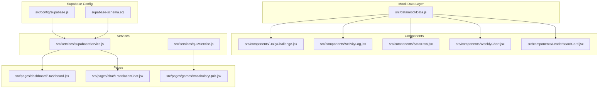

**Diagram sources**
- [mockData.js:1-47](file://src/data/mockData.js#L1-L47)
- [DailyChallenge.jsx:1-40](file://src/components/DailyChallenge.jsx#L1-L40)
- [ActivityLog.jsx:1-28](file://src/components/ActivityLog.jsx#L1-L28)
- [StatsRow.jsx:1-16](file://src/components/StatsRow.jsx#L1-L16)
- [WeeklyChart.jsx:1-33](file://src/components/WeeklyChart.jsx#L1-L33)
- [LeaderboardCard.jsx:1-48](file://src/components/LeaderboardCard.jsx#L1-L48)
- [Dashboard.jsx:1-151](file://src/pages/dashboard/Dashboard.jsx#L1-L151)
- [TranslationChat.jsx:1-197](file://src/pages/chat/TranslationChat.jsx#L1-L197)
- [VocabularyQuiz.jsx:1-215](file://src/pages/games/VocabularyQuiz.jsx#L1-L215)
- [supabaseService.js:1-132](file://src/services/supabaseService.js#L1-L132)
- [quizService.js:1-154](file://src/services/quizService.js#L1-L154)
- [supabase.js:1-7](file://src/config/supabase.js#L1-L7)
- [supabase-schema.sql:1-119](file://supabase-schema.sql#L1-L119)

**Section sources**
- [mockData.js:1-47](file://src/data/mockData.js#L1-L47)
- [supabaseService.js:1-132](file://src/services/supabaseService.js#L1-L132)
- [supabase.js:1-7](file://src/config/supabase.js#L1-L7)
- [supabase-schema.sql:1-119](file://supabase-schema.sql#L1-L119)

## Core Components
The mock data module exports several datasets used across components:
- Game statistics and quick stats cards
- Language progress indicators
- Recent activity log entries
- Weekly activity chart data
- Daily challenge content
- Leaderboard entries

These datasets are designed to be small, static, and deterministic, enabling reliable UI rendering and testing without network dependencies.

**Section sources**
- [mockData.js:1-47](file://src/data/mockData.js#L1-L47)

## Architecture Overview
The mock data system operates alongside the Supabase service layer. Components import mock datasets for development and UI scaffolding, while services use Supabase APIs for persistent data operations. This separation allows developers to switch between mock and real data by adjusting imports and service calls.

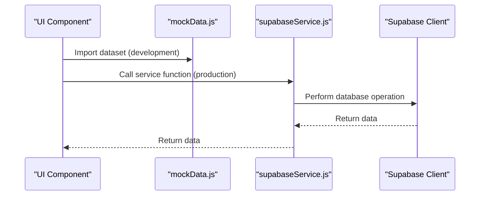

**Diagram sources**
- [mockData.js:1-47](file://src/data/mockData.js#L1-L47)
- [supabaseService.js:1-132](file://src/services/supabaseService.js#L1-L132)
- [supabase.js:1-7](file://src/config/supabase.js#L1-L7)

## Detailed Component Analysis

### Mock Data Module
The mock data module defines datasets for:
- Statistics rows and quick stats
- Language progress bars
- Activity logs
- Weekly activity charts
- Daily challenge questions
- Leaderboard entries

These datasets are exported as constants and imported directly by components for rendering.

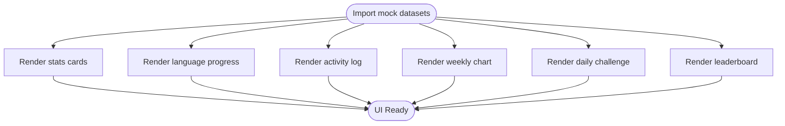

**Diagram sources**
- [mockData.js:1-47](file://src/data/mockData.js#L1-L47)

**Section sources**
- [mockData.js:1-47](file://src/data/mockData.js#L1-L47)

### Daily Challenge Component
The daily challenge component consumes the mock daily challenge dataset to present a fixed question and options for development and testing.

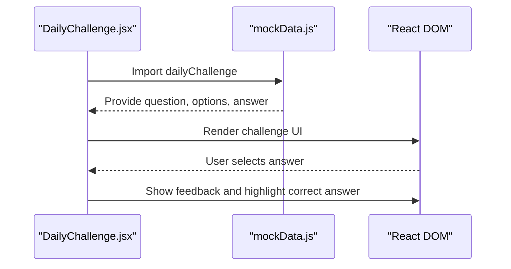

**Diagram sources**
- [DailyChallenge.jsx:1-40](file://src/components/DailyChallenge.jsx#L1-L40)
- [mockData.js:33-38](file://src/data/mockData.js#L33-L38)

**Section sources**
- [DailyChallenge.jsx:1-40](file://src/components/DailyChallenge.jsx#L1-L40)
- [mockData.js:33-38](file://src/data/mockData.js#L33-L38)

### Activity Log Component
The activity log component renders recent activity entries using the mock activity log dataset.

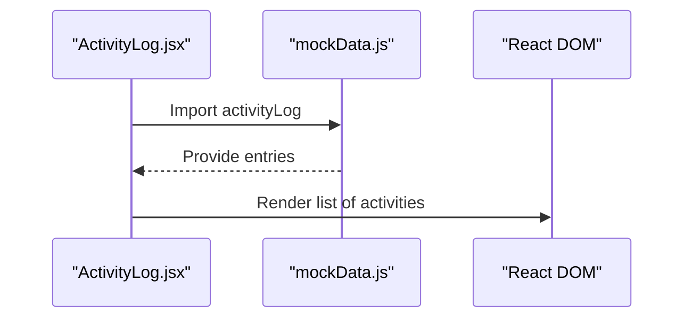

**Diagram sources**
- [ActivityLog.jsx:1-28](file://src/components/ActivityLog.jsx#L1-L28)
- [mockData.js:16-21](file://src/data/mockData.js#L16-L21)

**Section sources**
- [ActivityLog.jsx:1-28](file://src/components/ActivityLog.jsx#L1-L28)
- [mockData.js:16-21](file://src/data/mockData.js#L16-L21)

### Stats Row Component
The stats row component displays quick stats using the mock statistics dataset.

**Diagram sources**
- [StatsRow.jsx:1-16](file://src/components/StatsRow.jsx#L1-L16)
- [mockData.js:1-6](file://src/data/mockData.js#L1-L6)

**Section sources**
- [StatsRow.jsx:1-16](file://src/components/StatsRow.jsx#L1-L16)
- [mockData.js:1-6](file://src/data/mockData.js#L1-L6)

### Weekly Chart Component
The weekly chart component renders a bar chart using the mock weekly activity dataset.

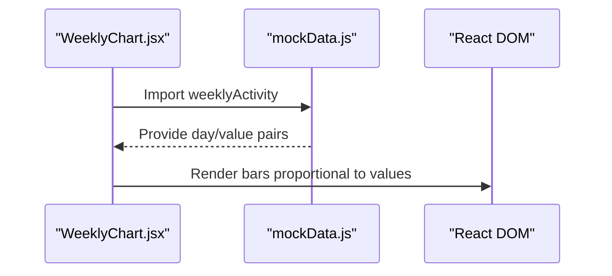

**Diagram sources**
- [WeeklyChart.jsx:1-33](file://src/components/WeeklyChart.jsx#L1-L33)
- [mockData.js:23-31](file://src/data/mockData.js#L23-L31)

**Section sources**
- [WeeklyChart.jsx:1-33](file://src/components/WeeklyChart.jsx#L1-L33)
- [mockData.js:23-31](file://src/data/mockData.js#L23-L31)

### Leaderboard Card Component
The leaderboard card component renders top users using the mock leaderboard dataset.

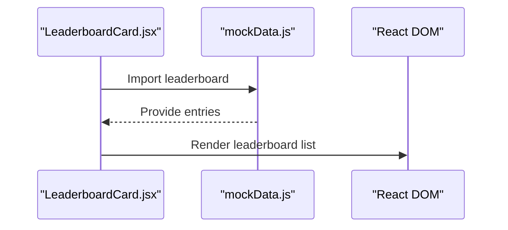

**Diagram sources**
- [LeaderboardCard.jsx:1-48](file://src/components/LeaderboardCard.jsx#L1-L48)
- [mockData.js:40-46](file://src/data/mockData.js#L40-L46)

**Section sources**
- [LeaderboardCard.jsx:1-48](file://src/components/LeaderboardCard.jsx#L1-L48)
- [mockData.js:40-46](file://src/data/mockData.js#L40-L46)

### Dashboard Integration
The dashboard page uses the Supabase service layer to fetch recent quiz attempts and display them. While mock data is not used here, the service layer remains the canonical source for live data.

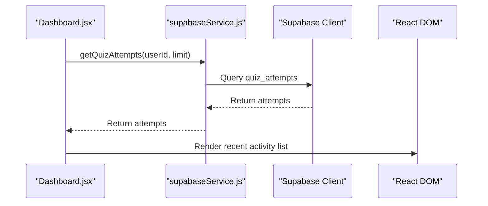

**Diagram sources**
- [Dashboard.jsx:1-151](file://src/pages/dashboard/Dashboard.jsx#L1-L151)
- [supabaseService.js:47-58](file://src/services/supabaseService.js#L47-L58)

**Section sources**
- [Dashboard.jsx:1-151](file://src/pages/dashboard/Dashboard.jsx#L1-L151)
- [supabaseService.js:47-58](file://src/services/supabaseService.js#L47-L58)

### Translation Chat Integration
The translation chat page uses the Supabase service layer to persist translation history. Mock data is not used here for persistence, but the service layer handles real-time data storage.

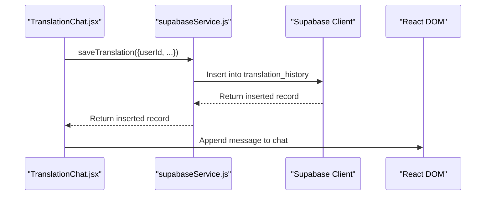

**Diagram sources**
- [TranslationChat.jsx:1-197](file://src/pages/chat/TranslationChat.jsx#L1-L197)
- [supabaseService.js:5-17](file://src/services/supabaseService.js#L5-L17)

**Section sources**
- [TranslationChat.jsx:1-197](file://src/pages/chat/TranslationChat.jsx#L1-L197)
- [supabaseService.js:5-17](file://src/services/supabaseService.js#L5-L17)

### Quiz Content Generation and Fallbacks
The quiz service generates vocabulary quiz content using LLMs and falls back to mock-like datasets when parsing fails. These fallbacks resemble the mock data structure and are used to ensure consistent UI rendering even when external services are unavailable.

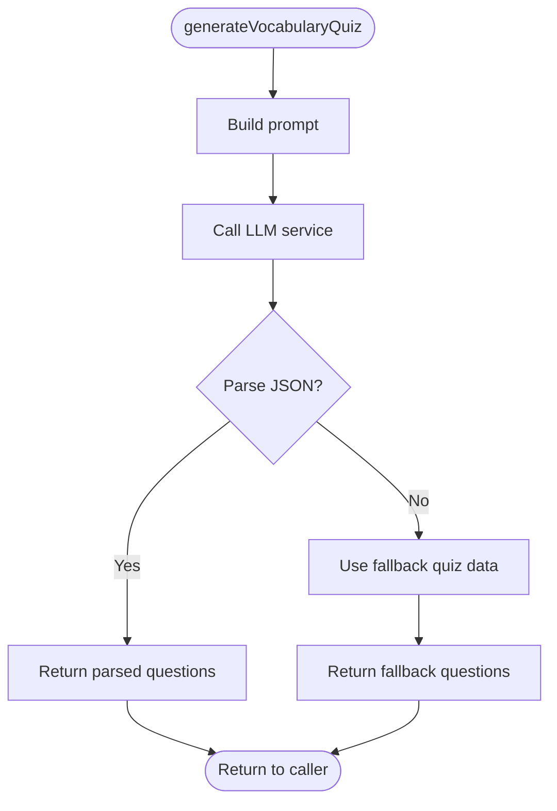

**Diagram sources**
- [quizService.js:1-32](file://src/services/quizService.js#L1-L32)
- [quizService.js:95-113](file://src/services/quizService.js#L95-L113)

**Section sources**
- [quizService.js:1-32](file://src/services/quizService.js#L1-L32)
- [quizService.js:95-113](file://src/services/quizService.js#L95-L113)

## Dependency Analysis
The mock data module is a pure data export and has no runtime dependencies. Components depend on it for UI scaffolding, while services depend on Supabase for persistent data. The Supabase client is configured via environment variables and provides the connection to the database.

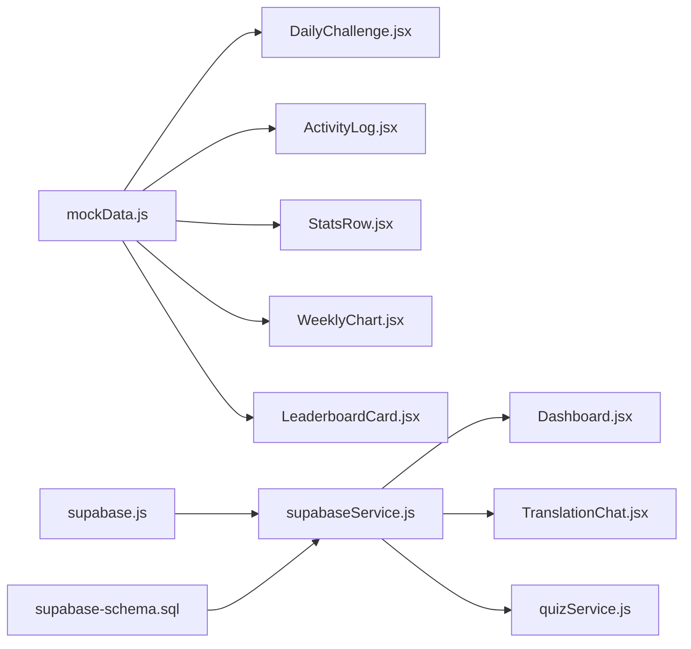

**Diagram sources**
- [mockData.js:1-47](file://src/data/mockData.js#L1-L47)
- [DailyChallenge.jsx:1-40](file://src/components/DailyChallenge.jsx#L1-L40)
- [ActivityLog.jsx:1-28](file://src/components/ActivityLog.jsx#L1-L28)
- [StatsRow.jsx:1-16](file://src/components/StatsRow.jsx#L1-L16)
- [WeeklyChart.jsx:1-33](file://src/components/WeeklyChart.jsx#L1-L33)
- [LeaderboardCard.jsx:1-48](file://src/components/LeaderboardCard.jsx#L1-L48)
- [Dashboard.jsx:1-151](file://src/pages/dashboard/Dashboard.jsx#L1-L151)
- [TranslationChat.jsx:1-197](file://src/pages/chat/TranslationChat.jsx#L1-L197)
- [supabaseService.js:1-132](file://src/services/supabaseService.js#L1-L132)
- [quizService.js:1-154](file://src/services/quizService.js#L1-L154)
- [supabase.js:1-7](file://src/config/supabase.js#L1-L7)
- [supabase-schema.sql:1-119](file://supabase-schema.sql#L1-L119)

**Section sources**
- [supabase.js:1-7](file://src/config/supabase.js#L1-L7)
- [supabase-schema.sql:1-119](file://supabase-schema.sql#L1-L119)

## Performance Considerations
- Memory footprint: Mock datasets are small arrays of plain objects, minimizing memory overhead.
- Access patterns: Components import datasets directly, avoiding network requests and enabling fast rendering.
- Caching: Since datasets are static, repeated access does not incur additional costs.
- Large datasets: If expanding mock data, consider lazy-loading or pagination to avoid blocking the UI.
- Real-time data: Prefer Supabase for dynamic data requiring synchronization across users.

[No sources needed since this section provides general guidance]

## Troubleshooting Guide
- Missing mock data: Verify imports in components and ensure datasets are exported from the mock data module.
- Incorrect data shape: Compare component expectations with the mock data structure to prevent runtime errors.
- Service vs. mock confusion: Confirm whether a component should use Supabase services or mock data for the given environment.
- Environment configuration: Ensure Supabase client is configured correctly for production data operations.

**Section sources**
- [mockData.js:1-47](file://src/data/mockData.js#L1-L47)
- [supabaseService.js:1-132](file://src/services/supabaseService.js#L1-L132)

## Conclusion
The mock data system provides a lightweight, deterministic foundation for UI development and testing. By separating mock datasets from Supabase services, the application maintains flexibility to switch between development scaffolding and production data sources. This separation improves isolation, enables offline testing, and simplifies scenario reproduction for consistent test outcomes.

[No sources needed since this section summarizes without analyzing specific files]

## Appendices

### Mock Data Lifecycle
- Creation: Define datasets in the mock data module with clear shapes and representative values.
- Modification: Update datasets to reflect new UI requirements or test scenarios; maintain backward compatibility where possible.
- Cleanup: Remove unused datasets and ensure imports are scoped to components that require them.

[No sources needed since this section provides general guidance]

### Testing Strategies Leveraging Mock Data
- Unit testing: Use mock datasets to render components in isolation and assert UI correctness.
- Integration testing: Combine mock datasets with service mocks to simulate end-to-end flows without external dependencies.
- Component testing: Focus on rendering and interaction logic using mock data to validate behavior under various conditions.

[No sources needed since this section provides general guidance]

### Maintaining Mock Data Consistency
- Version control: Track changes to datasets alongside component updates.
- Naming conventions: Use descriptive names for datasets and align field names with service schemas.
- Validation: Add simple assertions in tests to verify dataset shapes match component expectations.

[No sources needed since this section provides general guidance]

### Extending the Mock Data System
- New datasets: Add structured datasets to the mock data module aligned with new features.
- Service alignment: Mirror mock data structures in service schemas to enable seamless switching between mock and real data.
- Best practices: Keep datasets small, deterministic, and representative; avoid heavy computations in mock data.

[No sources needed since this section provides general guidance]