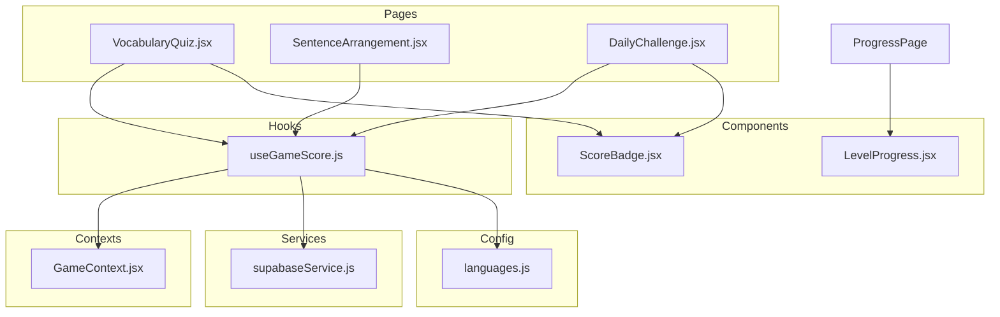
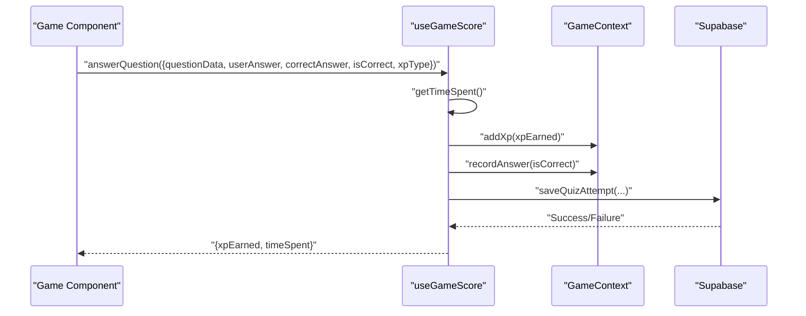
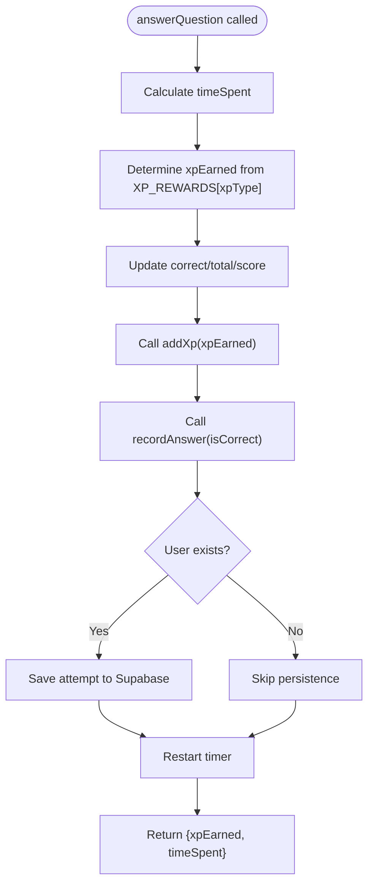
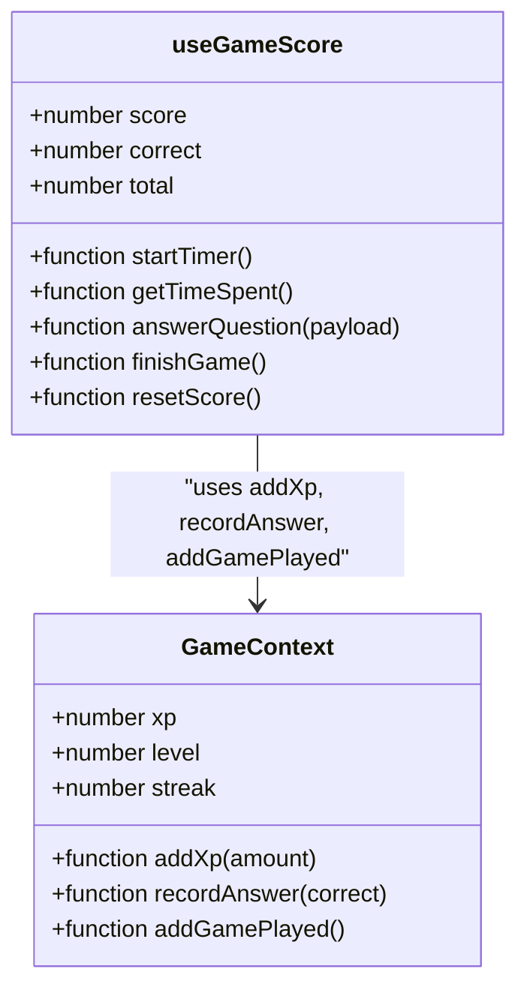
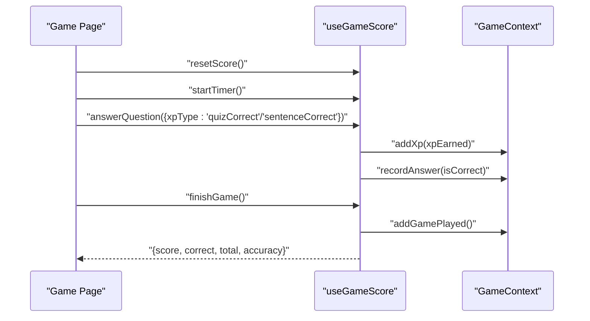
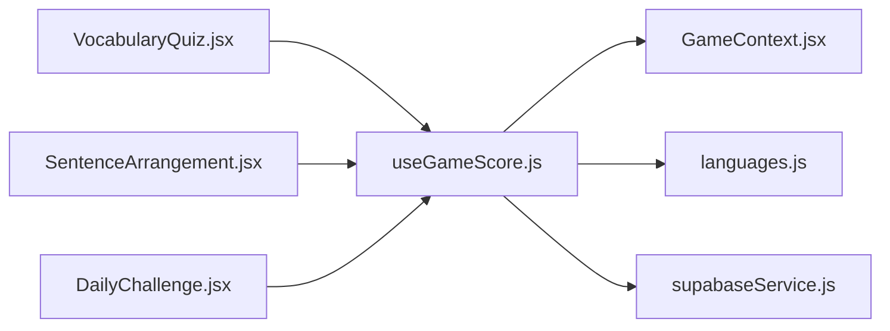

# useGameScore Hook

<cite>
**Referenced Files in This Document**
- [useGameScore.js](file://src/hooks/useGameScore.js)
- [GameContext.jsx](file://src/contexts/GameContext.jsx)
- [VocabularyQuiz.jsx](file://src/pages/games/VocabularyQuiz.jsx)
- [SentenceArrangement.jsx](file://src/pages/games/SentenceArrangement.jsx)
- [DailyChallenge.jsx](file://src/pages/games/DailyChallenge.jsx)
- [ScoreBadge.jsx](file://src/components/ScoreBadge.jsx)
- [LevelProgress.jsx](file://src/components/LevelProgress.jsx)
- [ProgressPage.jsx](file://src/pages/dashboard/ProgressPage.jsx)
- [supabaseService.js](file://src/services/supabaseService.js)
- [languages.js](file://src/config/languages.js)
</cite>

## Table of Contents
1. [Introduction](#introduction)
2. [Project Structure](#project-structure)
3. [Core Components](#core-components)
4. [Architecture Overview](#architecture-overview)
5. [Detailed Component Analysis](#detailed-component-analysis)
6. [Dependency Analysis](#dependency-analysis)
7. [Performance Considerations](#performance-considerations)
8. [Troubleshooting Guide](#troubleshooting-guide)
9. [Conclusion](#conclusion)

## Introduction
The useGameScore custom hook is a centralized state management solution for tracking and calculating game-related statistics during interactive language learning activities. It manages score accumulation, correctness tracking, timing metrics, and integrates with the global GameContext for XP and level progression. The hook provides a simple API for components to record answers, calculate XP rewards, persist attempts to the database, and compute derived metrics like accuracy and time spent.

## Project Structure
The useGameScore hook resides in the hooks directory and is consumed by game pages under the pages/games directory. It interacts with GameContext for XP and streak management, and with Supabase services for persistence. UI components like ScoreBadge and LevelProgress visualize the game state.

**Diagram sources**
- [useGameScore.js:1-76](file://src/hooks/useGameScore.js#L1-L76)
- [GameContext.jsx:1-141](file://src/contexts/GameContext.jsx#L1-L141)
- [VocabularyQuiz.jsx:1-80](file://src/pages/games/VocabularyQuiz.jsx#L1-L80)
- [SentenceArrangement.jsx:1-117](file://src/pages/games/SentenceArrangement.jsx#L1-L117)
- [DailyChallenge.jsx:1-31](file://src/pages/games/DailyChallenge.jsx#L1-L31)
- [ScoreBadge.jsx:1-36](file://src/components/ScoreBadge.jsx#L1-L36)
- [LevelProgress.jsx:1-17](file://src/components/LevelProgress.jsx#L1-L17)
- [supabaseService.js](file://src/services/supabaseService.js)
- [languages.js](file://src/config/languages.js)

**Section sources**
- [useGameScore.js:1-76](file://src/hooks/useGameScore.js#L1-L76)
- [GameContext.jsx:1-141](file://src/contexts/GameContext.jsx#L1-L141)

## Core Components
The useGameScore hook encapsulates:
- Local game state: score, correct answers, total attempts, and timing via a ref
- Timer utilities: startTimer and getTimeSpent
- Answer processing: answerQuestion with XP calculation and persistence
- Game lifecycle: finishGame and resetScore
- Derived metrics: accuracy computed from correct/total

Key exported values include score, correct, total, accuracy, and functions: answerQuestion, finishGame, resetScore, startTimer, getTimeSpent.

**Section sources**
- [useGameScore.js:7-76](file://src/hooks/useGameScore.js#L7-L76)

## Architecture Overview
The hook orchestrates local game state with global XP/streak state managed by GameContext. It calculates XP rewards based on XP_REWARDS configuration and persists quiz attempts to Supabase asynchronously. Components integrate by destructuring the hook's return values and invoking the provided functions.

**Diagram sources**
- [useGameScore.js:23-55](file://src/hooks/useGameScore.js#L23-L55)
- [GameContext.jsx:75-89](file://src/contexts/GameContext.jsx#L75-L89)
- [supabaseService.js](file://src/services/supabaseService.js)

## Detailed Component Analysis

### Internal State Management
- score: Accumulated XP from correct answers
- correct: Count of correct answers
- total: Total attempts processed
- startTimeRef: Tracks the last answer time for timing metrics
- accuracy: Computed as 0 when total is 0, otherwise rounded percentage

State updates are performed via React setters, ensuring re-renders when counts change. The hook avoids storing derived values in refs to maintain predictable re-renders.

**Section sources**
- [useGameScore.js:10-13](file://src/hooks/useGameScore.js#L10-L13)
- [useGameScore.js:70-74](file://src/hooks/useGameScore.js#L70-L74)

### Timer Utilities
- startTimer resets the internal timer reference to the current time
- getTimeSpent computes elapsed seconds since the last answer

These utilities enable precise timing of user interactions and are used to attach timeSpentSec to saved quiz attempts.

**Section sources**
- [useGameScore.js:15-21](file://src/hooks/useGameScore.js#L15-L21)

### Answer Processing and XP Calculation
The answerQuestion function:
- Calculates timeSpent using getTimeSpent
- Determines xpEarned from XP_REWARDS using the provided xpType (default "quizCorrect")
- Updates correct, total, and score counters
- Calls addXp and recordAnswer from GameContext
- Persists the attempt to Supabase if a user exists
- Restarts the timer after processing

XP_REWARDS is imported from languages configuration, allowing per-game-type reward customization.

**Diagram sources**
- [useGameScore.js:23-55](file://src/hooks/useGameScore.js#L23-L55)
- [languages.js](file://src/config/languages.js)

**Section sources**
- [useGameScore.js:23-55](file://src/hooks/useGameScore.js#L23-L55)

### Game Lifecycle Functions
- finishGame increments gamesPlayed via GameContext and returns current score, correct, total, and accuracy
- resetScore clears local counters and restarts the timer

These functions provide standardized ways to finalize and reset game sessions.

**Section sources**
- [useGameScore.js:57-68](file://src/hooks/useGameScore.js#L57-L68)
- [GameContext.jsx:91-93](file://src/contexts/GameContext.jsx#L91-L93)

### Integration with GameContext Provider
The hook consumes useGame from GameContext to access:
- addXp: Updates global XP and triggers level calculation
- recordAnswer: Updates global correctness metrics
- addGamePlayed: Increments total games played

This ensures consistency between local game state and global XP/level progression.

**Diagram sources**
- [useGameScore.js:8-9](file://src/hooks/useGameScore.js#L8-L9)
- [GameContext.jsx:126-129](file://src/contexts/GameContext.jsx#L126-L129)

**Section sources**
- [useGameScore.js:8-9](file://src/hooks/useGameScore.js#L8-L9)
- [GameContext.jsx:126-129](file://src/contexts/GameContext.jsx#L126-L129)

### Component Consumption Patterns
Games consume the hook by destructuring returned values and invoking functions during gameplay:

- VocabularyQuiz demonstrates:
  - Resetting score and starting timer before generating questions
  - Recording answers with appropriate xpType
  - Navigating to results upon completion

- SentenceArrangement mirrors the pattern with sentence-specific feedback and XP type.

- DailyChallenge integrates with GameContext for streak updates alongside useGameScore.

**Diagram sources**
- [VocabularyQuiz.jsx:19](file://src/pages/games/VocabularyQuiz.jsx#L19)
- [SentenceArrangement.jsx:22](file://src/pages/games/SentenceArrangement.jsx#L22)
- [DailyChallenge.jsx:24](file://src/pages/games/DailyChallenge.jsx#L24)
- [useGameScore.js:57-61](file://src/hooks/useGameScore.js#L57-L61)
- [GameContext.jsx:91-93](file://src/contexts/GameContext.jsx#L91-L93)

**Section sources**
- [VocabularyQuiz.jsx:19-68](file://src/pages/games/VocabularyQuiz.jsx#L19-L68)
- [SentenceArrangement.jsx:22-102](file://src/pages/games/SentenceArrangement.jsx#L22-L102)
- [DailyChallenge.jsx:24](file://src/pages/games/DailyChallenge.jsx#L24)

### UI Integration and Metrics Display
- ScoreBadge displays the current score during gameplay
- LevelProgress shows XP progression and current level
- ProgressPage aggregates XP, accuracy, and streak for overview

These components rely on the global state from GameContext, while useGameScore maintains local game metrics for immediate feedback.

**Section sources**
- [ScoreBadge.jsx:3-17](file://src/components/ScoreBadge.jsx#L3-L17)
- [LevelProgress.jsx:3-16](file://src/components/LevelProgress.jsx#L3-L16)
- [ProgressPage.jsx:39-57](file://src/pages/dashboard/ProgressPage.jsx#L39-L57)

## Dependency Analysis
The hook depends on:
- GameContext for XP and streak management
- AuthContext indirectly via GameContext for user-aware persistence
- XP_REWARDS configuration for XP calculations
- Supabase service for saving quiz attempts

**Diagram sources**
- [useGameScore.js:2-5](file://src/hooks/useGameScore.js#L2-L5)
- [GameContext.jsx:1-4](file://src/contexts/GameContext.jsx#L1-L4)
- [VocabularyQuiz.jsx:5](file://src/pages/games/VocabularyQuiz.jsx#L5)
- [SentenceArrangement.jsx:5](file://src/pages/games/SentenceArrangement.jsx#L5)
- [DailyChallenge.jsx:5](file://src/pages/games/DailyChallenge.jsx#L5)

**Section sources**
- [useGameScore.js:2-5](file://src/hooks/useGameScore.js#L2-L5)
- [GameContext.jsx:1-4](file://src/contexts/GameContext.jsx#L1-L4)

## Performance Considerations
- useCallback usage: All functions (answerQuestion, finishGame, resetScore, startTimer, getTimeSpent) are memoized to prevent unnecessary re-renders and re-creations across renders.
- Minimal state updates: Only essential counters are stateful; derived metrics (accuracy) are computed inline to avoid redundant state.
- Asynchronous persistence: Supabase saves occur outside the synchronous answer flow to keep UI responsive.
- Timer precision: Using Date.now() provides millisecond precision; rounding to seconds reduces noise in persisted data.

Best practices:
- Pass minimal props to components; destructure only needed values from the hook return object.
- Avoid calling answerQuestion multiple times in rapid succession; guard with UI state to prevent duplicate submissions.
- Use resetScore at the start of new game sessions to ensure accurate timing and clean counters.

**Section sources**
- [useGameScore.js:15-21](file://src/hooks/useGameScore.js#L15-L21)
- [useGameScore.js:23-55](file://src/hooks/useGameScore.js#L23-L55)
- [useGameScore.js:57-68](file://src/hooks/useGameScore.js#L57-L68)

## Troubleshooting Guide
Common issues and resolutions:
- Missing GameContext provider: Ensure GameProvider wraps app or game pages. The useGame hook throws an error if used outside GameProvider.
- No user context for persistence: When user is null, answerQuestion skips Supabase save but still updates local and global state.
- Zero division in accuracy: The hook returns 0 when total is 0; ensure to guard UI rendering when total is 0.
- XP not updating globally: Verify that addXp is invoked and that GameContext reducer handles ADD_XP correctly.
- Streak not incrementing: updateStreak requires a different last_active_date from today; ensure profile data is loaded and user is authenticated.

Debugging tips:
- Log returned values from answerQuestion to confirm xpEarned and timeSpent.
- Inspect GameContext state for xp, level, streak, and recentXpGains.
- Check Supabase profiles table for updated total_xp and current_level after XP gains.

**Section sources**
- [GameContext.jsx:136-140](file://src/contexts/GameContext.jsx#L136-L140)
- [useGameScore.js:36-51](file://src/hooks/useGameScore.js#L36-L51)
- [GameContext.jsx:107-119](file://src/contexts/GameContext.jsx#L107-L119)

## Conclusion
The useGameScore hook provides a robust, reusable foundation for managing game state during language learning exercises. By combining local counters with global XP/streak tracking, it enables accurate scoring, persistence, and real-time feedback. Its API is designed for simplicity and composability, supporting diverse game types while maintaining consistency with the broader GameContext ecosystem. Following the recommended patterns and performance practices ensures reliable behavior across components and smooth user experiences.