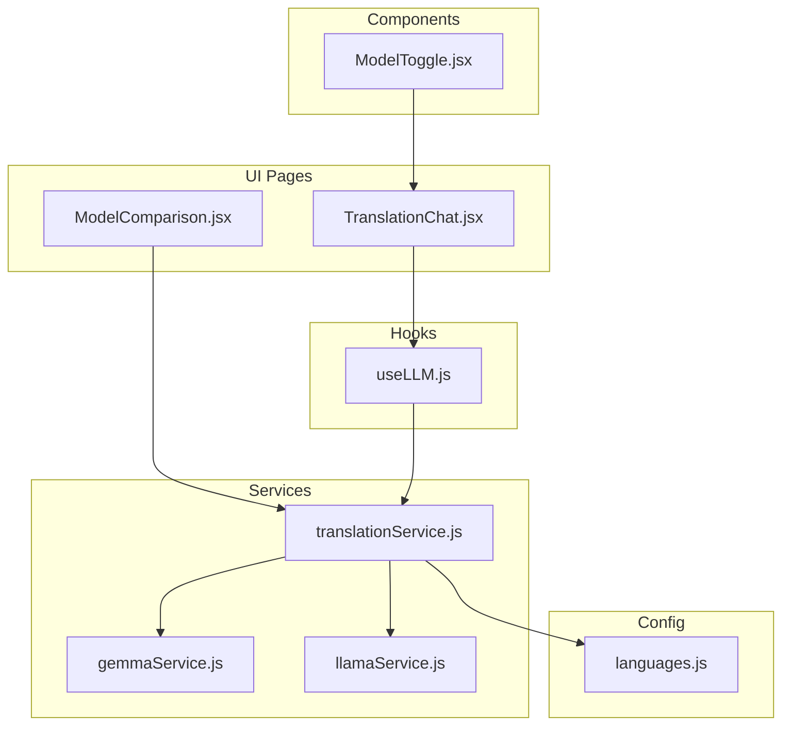
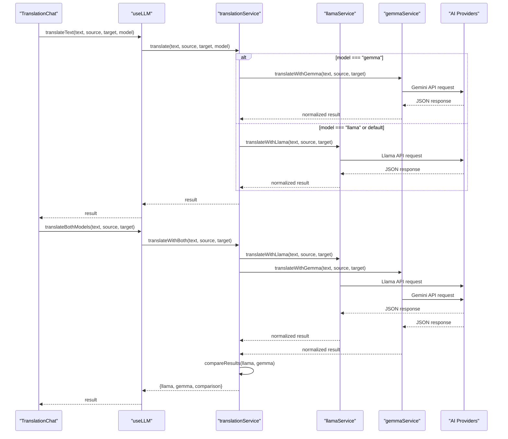
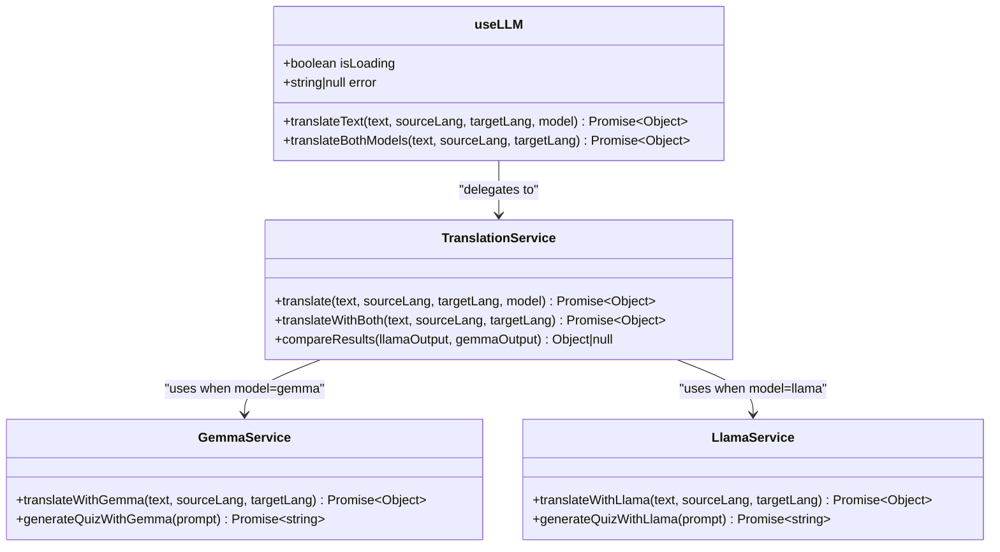
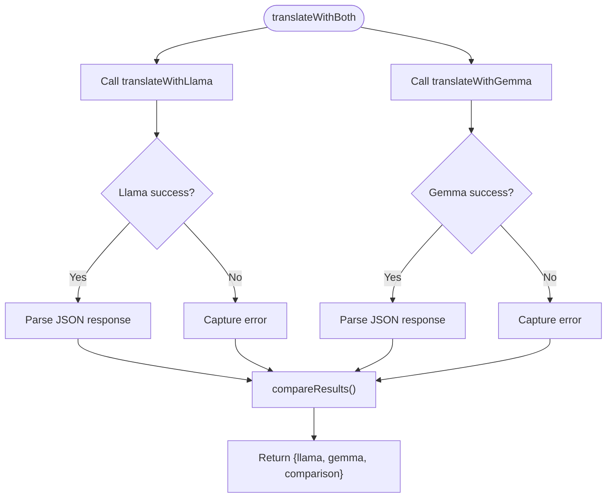
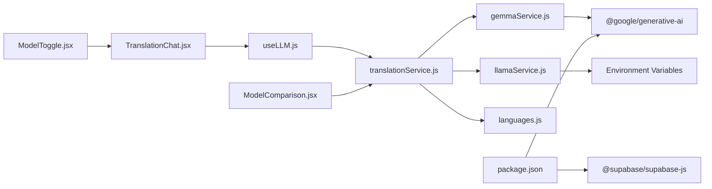

# useLLM Hook

<cite>
**Referenced Files in This Document**
- [useLLM.js](file://src/hooks/useLLM.js)
- [translationService.js](file://src/services/translationService.js)
- [gemmaService.js](file://src/services/gemmaService.js)
- [llamaService.js](file://src/services/llamaService.js)
- [TranslationChat.jsx](file://src/pages/chat/TranslationChat.jsx)
- [ModelComparison.jsx](file://src/pages/chat/ModelComparison.jsx)
- [ModelToggle.jsx](file://src/components/ModelToggle.jsx)
- [languages.js](file://src/config/languages.js)
- [package.json](file://package.json)
</cite>

## Table of Contents
1. [Introduction](#introduction)
2. [Project Structure](#project-structure)
3. [Core Components](#core-components)
4. [Architecture Overview](#architecture-overview)
5. [Detailed Component Analysis](#detailed-component-analysis)
6. [Dependency Analysis](#dependency-analysis)
7. [Performance Considerations](#performance-considerations)
8. [Troubleshooting Guide](#troubleshooting-guide)
9. [Conclusion](#conclusion)
10. [Appendices](#appendices)

## Introduction
This document provides comprehensive documentation for the useLLM custom hook that orchestrates AI model interactions for translation tasks. It explains how the hook coordinates between two AI providers (Gemma and Llama), handles API requests, manages model switching, and integrates with translation services. The documentation covers state management, error handling, response processing, caching mechanisms, retry logic, timeout handling, performance optimization strategies, and extension guidelines for adding additional AI models.

## Project Structure
The useLLM hook resides in the hooks directory and integrates with service modules under services. The primary UI components that consume the hook are located in the pages/chat directory, including TranslationChat and ModelComparison. The ModelToggle component provides user controls for switching between models and comparison modes.

**Diagram sources**
- [useLLM.js:1-38](file://src/hooks/useLLM.js#L1-L38)
- [translationService.js:1-73](file://src/services/translationService.js#L1-L73)
- [gemmaService.js:1-56](file://src/services/gemmaService.js#L1-L56)
- [llamaService.js:1-84](file://src/services/llamaService.js#L1-L84)
- [TranslationChat.jsx:1-197](file://src/pages/chat/TranslationChat.jsx#L1-L197)
- [ModelComparison.jsx:1-81](file://src/pages/chat/ModelComparison.jsx#L1-L81)
- [ModelToggle.jsx:1-25](file://src/components/ModelToggle.jsx#L1-L25)
- [languages.js:1-30](file://src/config/languages.js#L1-L30)

**Section sources**
- [useLLM.js:1-38](file://src/hooks/useLLM.js#L1-L38)
- [translationService.js:1-73](file://src/services/translationService.js#L1-L73)
- [gemmaService.js:1-56](file://src/services/gemmaService.js#L1-L56)
- [llamaService.js:1-84](file://src/services/llamaService.js#L1-L84)
- [TranslationChat.jsx:1-197](file://src/pages/chat/TranslationChat.jsx#L1-L197)
- [ModelComparison.jsx:1-81](file://src/pages/chat/ModelComparison.jsx#L1-L81)
- [ModelToggle.jsx:1-25](file://src/components/ModelToggle.jsx#L1-L25)
- [languages.js:1-30](file://src/config/languages.js#L1-L30)

## Core Components
- useLLM hook: Provides state management for loading and error states, and exposes two primary functions:
  - translateText: Executes translation using a specified model (default: Llama)
  - translateBothModels: Executes parallel translation using both models for comparison
- translationService: Centralized orchestration layer that routes requests to provider-specific services and performs result comparison
- gemmaService: Provider-specific implementation for Google Generative AI (Gemini)
- llamaService: Provider-specific implementation for Meta AI API (Llama)
- TranslationChat page: Consumes the hook to power real-time translation chat with model switching
- ModelComparison component: Renders side-by-side model outputs and comparison metrics
- ModelToggle component: UI control for switching between models and comparison mode

Key capabilities:
- Model selection: Supports "llama", "gemma", and "compare" modes
- Parallel execution: Compares outputs from both models with Promise.allSettled
- Robust error handling: Catches provider errors and surfaces meaningful messages
- Response normalization: Ensures consistent output structure across providers
- Confidence scoring: Extracts and exposes confidence metrics from provider responses

**Section sources**
- [useLLM.js:4-37](file://src/hooks/useLLM.js#L4-L37)
- [translationService.js:12-42](file://src/services/translationService.js#L12-L42)
- [gemmaService.js:16-45](file://src/services/gemmaService.js#L16-L45)
- [llamaService.js:14-60](file://src/services/llamaService.js#L14-L60)
- [TranslationChat.jsx:13-98](file://src/pages/chat/TranslationChat.jsx#L13-L98)
- [ModelComparison.jsx:3-78](file://src/pages/chat/ModelComparison.jsx#L3-L78)
- [ModelToggle.jsx:7-23](file://src/components/ModelToggle.jsx#L7-L23)

## Architecture Overview
The useLLM hook follows a layered architecture with clear separation of concerns:

**Diagram sources**
- [useLLM.js:8-34](file://src/hooks/useLLM.js#L8-L34)
- [translationService.js:12-42](file://src/services/translationService.js#L12-L42)
- [gemmaService.js:16-45](file://src/services/gemmaService.js#L16-L45)
- [llamaService.js:14-60](file://src/services/llamaService.js#L14-L60)

The architecture ensures:
- Single source of truth for state management in the hook
- Clear separation between UI logic and AI provider specifics
- Consistent error propagation and user feedback
- Flexible model selection and comparison capabilities

**Section sources**
- [useLLM.js:1-38](file://src/hooks/useLLM.js#L1-L38)
- [translationService.js:1-73](file://src/services/translationService.js#L1-L73)
- [gemmaService.js:1-56](file://src/services/gemmaService.js#L1-L56)
- [llamaService.js:1-84](file://src/services/llamaService.js#L1-L84)

## Detailed Component Analysis

### useLLM Hook Implementation
The hook encapsulates state management and provides two primary functions:

**Diagram sources**
- [useLLM.js:4-37](file://src/hooks/useLLM.js#L4-L37)
- [translationService.js:12-72](file://src/services/translationService.js#L12-L72)
- [gemmaService.js:16-55](file://src/services/gemmaService.js#L16-L55)
- [llamaService.js:14-83](file://src/services/llamaService.js#L14-L83)

Key implementation patterns:
- State management: Uses React useState for isLoading and error tracking
- Callback memoization: Uses useCallback to prevent unnecessary re-renders
- Error boundary: Catches provider errors and surfaces user-friendly messages
- Loading indicators: Coordinates UI loading states during async operations

**Section sources**
- [useLLM.js:4-37](file://src/hooks/useLLM.js#L4-L37)

### Translation Service Orchestration
The translationService module serves as the central coordinator:

**Diagram sources**
- [translationService.js:25-42](file://src/services/translationService.js#L25-L42)
- [translationService.js:47-72](file://src/services/translationService.js#L47-L72)

Processing logic:
- Parallel execution: Uses Promise.allSettled to execute both providers concurrently
- Result normalization: Ensures consistent structure regardless of provider response format
- Comparison metrics: Computes word similarity, counts, and confidence scores
- Fallback handling: Provides structured error objects when providers fail

**Section sources**
- [translationService.js:12-42](file://src/services/translationService.js#L12-L42)
- [translationService.js:47-72](file://src/services/translationService.js#L47-L72)

### Provider-Specific Services
Each provider implements standardized functions with consistent output formats:

Gemma Service (Google Generative AI):
- Model: gemma-3-27b-it
- Authentication: Uses VITE_GOOGLE_AI_API_KEY environment variable
- Output parsing: Validates and extracts translation, confidence, explanation, and alternatives
- Error handling: Graceful fallback with default confidence values

Llama Service (Meta AI API):
- Endpoint: https://api.llama.com/v1/chat/completions
- Authentication: Uses VITE_META_AI_API_KEY environment variable
- Request configuration: Includes system prompts, temperature, and token limits
- Response processing: Parses JSON content from provider response

**Section sources**
- [gemmaService.js:16-45](file://src/services/gemmaService.js#L16-L45)
- [llamaService.js:14-60](file://src/services/llamaService.js#L14-L60)

### UI Integration Patterns
The TranslationChat component demonstrates practical usage patterns:

Real-time translation chat:
- Model switching: Integrates with ModelToggle to switch between Llama, Gemma, and comparison modes
- Loading states: Displays loading indicators during API requests
- Error feedback: Shows user-friendly error messages when requests fail
- Persistence: Saves translation history when user is authenticated

Model comparison interface:
- Side-by-side rendering: Displays Llama and Gemma outputs in separate cards
- Confidence visualization: Shows confidence percentages for each model
- Comparative metrics: Presents word similarity, word counts, and character counts
- Alternative suggestions: Displays alternative translations when available

**Section sources**
- [TranslationChat.jsx:13-98](file://src/pages/chat/TranslationChat.jsx#L13-L98)
- [ModelComparison.jsx:3-78](file://src/pages/chat/ModelComparison.jsx#L3-L78)
- [ModelToggle.jsx:7-23](file://src/components/ModelToggle.jsx#L7-L23)

## Dependency Analysis
The useLLM ecosystem exhibits clean dependency relationships:

**Diagram sources**
- [useLLM.js:1-3](file://src/hooks/useLLM.js#L1-L3)
- [translationService.js:1-3](file://src/services/translationService.js#L1-L3)
- [gemmaService.js:1](file://src/services/gemmaService.js#L1)
- [llamaService.js:1](file://src/services/llamaService.js#L1)
- [package.json:11-20](file://package.json#L11-L20)

Dependency characteristics:
- Low coupling: useLLM depends only on translationService, not on provider specifics
- Cohesion: Each service module encapsulates provider-specific logic
- External dependencies: Google Generative AI SDK and environment variables
- Configuration: Language definitions centralized in languages.js

**Section sources**
- [useLLM.js:1-3](file://src/hooks/useLLM.js#L1-L3)
- [translationService.js:1-3](file://src/services/translationService.js#L1-L3)
- [gemmaService.js:1](file://src/services/gemmaService.js#L1)
- [llamaService.js:1](file://src/services/llamaService.js#L1)
- [package.json:11-20](file://package.json#L11-L20)

## Performance Considerations
Current implementation strengths:
- Concurrent execution: translateBothModels uses Promise.allSettled for optimal parallelism
- Minimal state updates: useCallback prevents unnecessary re-renders
- Efficient comparison: Lightweight word overlap calculation for similarity metrics

Optimization opportunities:
- Request batching: Group multiple translation requests within short time windows
- Response caching: Implement TTL-based cache for repeated translations
- Retry logic: Add exponential backoff for transient failures
- Timeout handling: Set request timeouts to prevent hanging promises
- Memory management: Limit chat history length and dispose of old results
- Network optimization: Implement connection pooling and keep-alive

Cost optimization strategies:
- Rate limiting: Respect provider quotas and implement client-side throttling
- Model selection: Prefer lower-cost models for routine translations
- Batch processing: Combine multiple small requests into larger batches
- Caching: Reduce redundant API calls through intelligent caching
- Monitoring: Track usage patterns to optimize resource allocation

[No sources needed since this section provides general guidance]

## Troubleshooting Guide
Common error scenarios and resolutions:

API key configuration:
- Missing environment variables: Ensure VITE_GOOGLE_AI_API_KEY and VITE_META_AI_API_KEY are set
- Invalid credentials: Verify API keys have proper permissions for respective services
- Network connectivity: Check firewall settings and proxy configurations

Response parsing errors:
- Malformed JSON: Provider responses may not always be valid JSON; fallback logic handles this gracefully
- Empty responses: Implement retry logic for empty or partial responses
- Timeout handling: Add timeout wrappers around fetch calls

UI error handling:
- Loading states: isLoading prevents duplicate submissions during ongoing requests
- Error surfacing: Error messages are propagated to the UI for user feedback
- Graceful degradation: Comparison mode continues even if one provider fails

Debugging techniques:
- Console logging: Add structured logs for request/response cycles
- Network inspection: Monitor API calls in browser developer tools
- State inspection: Use React DevTools to monitor hook state changes
- Error boundaries: Implement higher-level error boundaries for unhandled exceptions

**Section sources**
- [useLLM.js:14-16](file://src/hooks/useLLM.js#L14-L16)
- [translationService.js:34-41](file://src/services/translationService.js#L34-L41)
- [gemmaService.js:27-44](file://src/services/gemmaService.js#L27-L44)
- [llamaService.js:34-37](file://src/services/llamaService.js#L34-L37)

## Conclusion
The useLLM hook provides a robust foundation for AI-powered translation with excellent extensibility. Its layered architecture cleanly separates concerns, enabling seamless integration with multiple AI providers while maintaining consistent user experiences. The implementation demonstrates strong error handling, parallel execution capabilities, and flexible model selection. With proper caching, retry logic, and performance optimizations, this hook can support scalable translation applications with cost-effective AI interactions.

## Appendices

### API Usage Examples
Real-world usage patterns demonstrated in the codebase:

Translation chat with single model:
- Mode switching: Users can toggle between Llama, Gemma, and comparison modes
- Real-time feedback: Loading indicators and error messages enhance user experience
- History persistence: Translation results are saved when users are authenticated

Model comparison feature:
- Side-by-side outputs: Llama and Gemma results displayed in parallel cards
- Comparative metrics: Word similarity, counts, and confidence scores
- Alternative suggestions: Display of alternative translations when available

Extension guidelines for additional AI models:
- Service implementation: Create a new service module following existing patterns
- Hook integration: Add model option to translationService routing
- UI integration: Extend ModelToggle component with new model options
- Configuration: Update environment variables and endpoint configurations
- Testing: Implement comprehensive test coverage for new model interactions

**Section sources**
- [TranslationChat.jsx:46-98](file://src/pages/chat/TranslationChat.jsx#L46-L98)
- [ModelComparison.jsx:56-77](file://src/pages/chat/ModelComparison.jsx#L56-L77)
- [ModelToggle.jsx:1-25](file://src/components/ModelToggle.jsx#L1-L25)