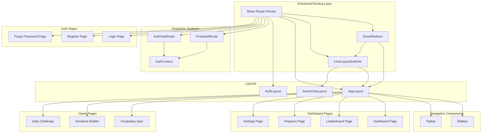
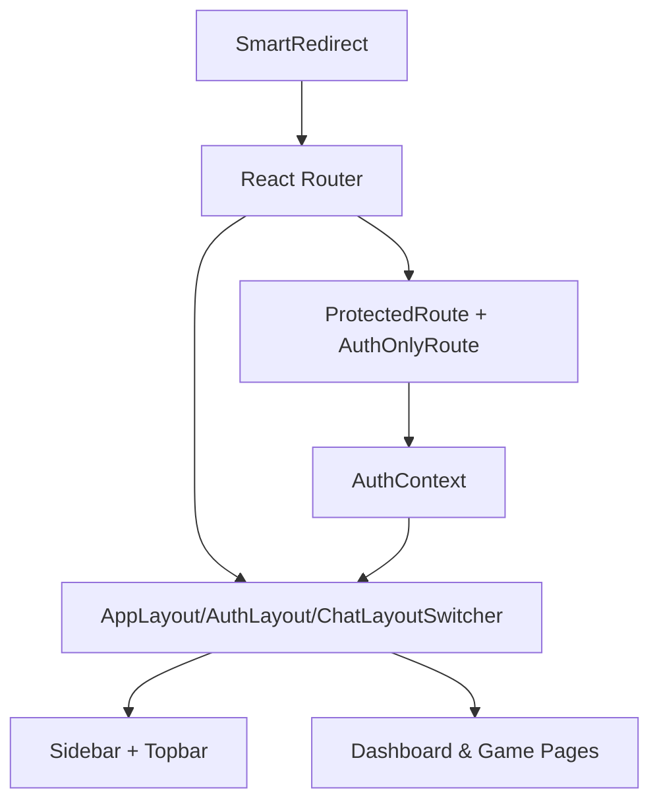
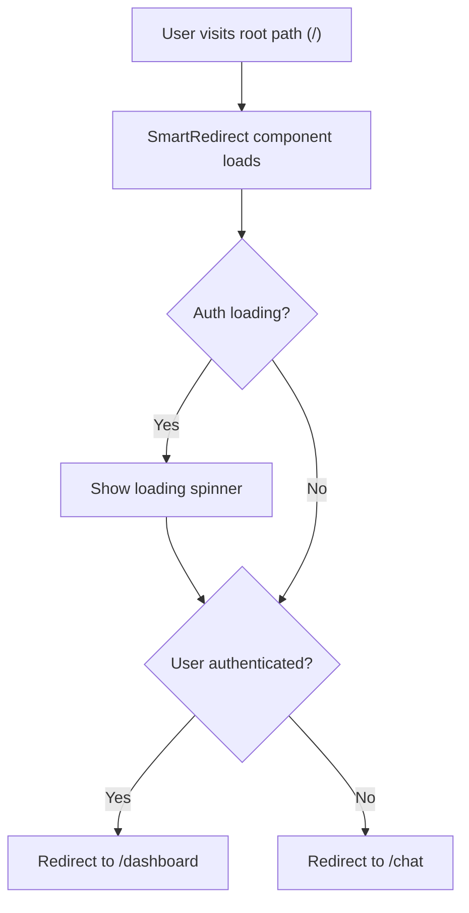
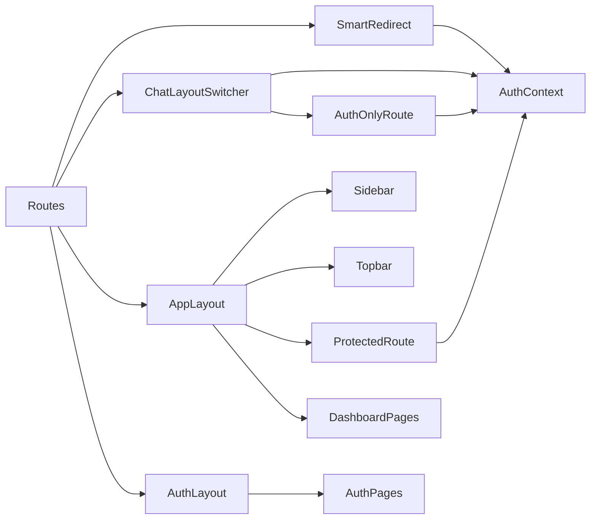

# Dashboard and Navigation

<cite>
**Referenced Files in This Document**
- [App.jsx](file://src/App.jsx)
- [main.jsx](file://src/main.jsx)
- [AppLayout.jsx](file://src/layouts/AppLayout.jsx)
- [AuthLayout.jsx](file://src/layouts/AuthLayout.jsx)
- [ChatLayoutSwitcher.jsx](file://src/layouts/ChatLayoutSwitcher.jsx)
- [Sidebar.jsx](file://src/components/Sidebar.jsx)
- [Topbar.jsx](file://src/components/Topbar.jsx)
- [ProtectedRoute.jsx](file://src/components/ProtectedRoute.jsx)
- [AuthOnlyRoute.jsx](file://src/components/AuthOnlyRoute.jsx)
- [AuthContext.jsx](file://src/contexts/AuthContext.jsx)
- [Dashboard.jsx](file://src/pages/dashboard/Dashboard.jsx)
- [LeaderboardPage.jsx](file://src/pages/dashboard/LeaderboardPage.jsx)
- [ProgressPage.jsx](file://src/pages/dashboard/ProgressPage.jsx)
- [SettingsPage.jsx](file://src/pages/dashboard/SettingsPage.jsx)
- [LoginPage.jsx](file://src/pages/auth/LoginPage.jsx)
- [RegisterPage.jsx](file://src/pages/auth/RegisterPage.jsx)
- [ForgotPasswordPage.jsx](file://src/pages/auth/ForgotPasswordPage.jsx)
- [TranslationChat.jsx](file://src/pages/chat/TranslationChat.jsx)
- [DailyChallenge.jsx](file://src/pages/games/DailyChallenge.jsx)
- [VocabularyQuiz.jsx](file://src/pages/games/VocabularyQuiz.jsx)
- [SentenceArrangement.jsx](file://src/pages/games/SentenceArrangement.jsx)
</cite>

## Update Summary
**Changes Made**
- Added SmartRedirect component for automatic user redirection based on authentication status
- Enhanced routing system with dual protection mechanisms: ProtectedRoute and AuthOnlyRoute
- Implemented ChatLayoutSwitcher for adaptive chat experience based on authentication state
- Improved game page protection with dedicated AuthOnlyRoute component
- Updated routing architecture to support both authenticated and guest user flows

## Table of Contents
1. [Introduction](#introduction)
2. [Project Structure](#project-structure)
3. [Core Components](#core-components)
4. [Architecture Overview](#architecture-overview)
5. [Detailed Component Analysis](#detailed-component-analysis)
6. [Dependency Analysis](#dependency-analysis)
7. [Performance Considerations](#performance-considerations)
8. [Accessibility and Keyboard Navigation](#accessibility-and-keyboard-navigation)
9. [Customization Guide](#customization-guide)
10. [Troubleshooting Guide](#troubleshooting-guide)
11. [Conclusion](#conclusion)

## Introduction
This document provides comprehensive documentation for the enhanced dashboard and navigation system. The system now features an improved routing architecture with automatic user redirection, dual protection mechanisms for different page types, and adaptive layouts for both authenticated and guest users. It explains the main dashboard layout implementation, sidebar navigation structure, topbar components, protected route mechanisms, responsive design patterns, and accessibility features. The documentation covers how navigation integrates with routing and authentication, and offers practical guidance for extending the system with new dashboard features while maintaining a consistent user experience.

## Project Structure
The enhanced dashboard and navigation system spans several key areas with improved routing architecture:
- Layouts define the overall page containers and wrappers, including adaptive chat layouts
- Components implement reusable UI elements like the sidebar and topbar
- SmartRedirect handles automatic user redirection based on authentication status
- ProtectedRoute enforces authentication-based access control for main dashboard pages
- AuthOnlyRoute provides additional protection for game pages
- ChatLayoutSwitcher manages layout switching between authenticated and guest experiences
- Pages represent distinct dashboard features and routes with different protection levels

**Diagram sources**
- [App.jsx](file://src/App.jsx)
- [main.jsx](file://src/main.jsx)
- [AppLayout.jsx](file://src/layouts/AppLayout.jsx)
- [AuthLayout.jsx](file://src/layouts/AuthLayout.jsx)
- [ChatLayoutSwitcher.jsx](file://src/layouts/ChatLayoutSwitcher.jsx)
- [Sidebar.jsx](file://src/components/Sidebar.jsx)
- [Topbar.jsx](file://src/components/Topbar.jsx)
- [ProtectedRoute.jsx](file://src/components/ProtectedRoute.jsx)
- [AuthOnlyRoute.jsx](file://src/components/AuthOnlyRoute.jsx)
- [AuthContext.jsx](file://src/contexts/AuthContext.jsx)
- [Dashboard.jsx](file://src/pages/dashboard/Dashboard.jsx)
- [LeaderboardPage.jsx](file://src/pages/dashboard/LeaderboardPage.jsx)
- [ProgressPage.jsx](file://src/pages/dashboard/ProgressPage.jsx)
- [SettingsPage.jsx](file://src/pages/dashboard/SettingsPage.jsx)
- [LoginPage.jsx](file://src/pages/auth/LoginPage.jsx)
- [RegisterPage.jsx](file://src/pages/auth/RegisterPage.jsx)
- [ForgotPasswordPage.jsx](file://src/pages/auth/ForgotPasswordPage.jsx)
- [TranslationChat.jsx](file://src/pages/chat/TranslationChat.jsx)
- [DailyChallenge.jsx](file://src/pages/games/DailyChallenge.jsx)
- [VocabularyQuiz.jsx](file://src/pages/games/VocabularyQuiz.jsx)
- [SentenceArrangement.jsx](file://src/pages/games/SentenceArrangement.jsx)

**Section sources**
- [App.jsx](file://src/App.jsx)
- [main.jsx](file://src/main.jsx)

## Core Components
This section documents the primary building blocks of the enhanced dashboard and navigation system.

- **SmartRedirect**: Automatically redirects users based on authentication status - authenticated users go to /dashboard, guests go to /chat
- **AppLayout**: Provides the main container for authenticated pages, embedding the sidebar and topbar, and rendering routed content
- **ChatLayoutSwitcher**: Dynamically switches between authenticated AppLayout and guest-oriented layout for the chat route
- **Sidebar**: Implements the left navigation panel with links to dashboard features and actions
- **Topbar**: Hosts user profile, notifications, and quick actions
- **ProtectedRoute**: Guards main dashboard routes requiring authentication
- **AuthOnlyRoute**: Provides additional protection for game pages with extra security measures
- **AuthContext**: Centralizes authentication state and methods for login/logout
- **Dashboard pages**: Feature-specific pages such as leaderboard, progress, and settings
- **Game pages**: Interactive learning activities with enhanced protection

Key implementation patterns:
- Composition via layouts ensures consistent header, navigation, and content areas
- SmartRedirect eliminates manual root path handling and provides seamless user experience
- Dual protection system allows flexible security levels for different page types
- ChatLayoutSwitcher enables rich authenticated experience while maintaining guest accessibility
- Responsive breakpoints and mobile-friendly toggles enable seamless cross-device navigation

**Section sources**
- [App.jsx](file://src/App.jsx)
- [AppLayout.jsx](file://src/layouts/AppLayout.jsx)
- [ChatLayoutSwitcher.jsx](file://src/layouts/ChatLayoutSwitcher.jsx)
- [Sidebar.jsx](file://src/components/Sidebar.jsx)
- [Topbar.jsx](file://src/components/Topbar.jsx)
- [ProtectedRoute.jsx](file://src/components/ProtectedRoute.jsx)
- [AuthOnlyRoute.jsx](file://src/components/AuthOnlyRoute.jsx)
- [AuthContext.jsx](file://src/contexts/AuthContext.jsx)
- [Dashboard.jsx](file://src/pages/dashboard/Dashboard.jsx)
- [LeaderboardPage.jsx](file://src/pages/dashboard/LeaderboardPage.jsx)
- [ProgressPage.jsx](file://src/pages/dashboard/ProgressPage.jsx)
- [SettingsPage.jsx](file://src/pages/dashboard/SettingsPage.jsx)
- [VocabularyQuiz.jsx](file://src/pages/games/VocabularyQuiz.jsx)
- [SentenceArrangement.jsx](file://src/pages/games/SentenceArrangement.jsx)
- [DailyChallenge.jsx](file://src/pages/games/DailyChallenge.jsx)

## Architecture Overview
The enhanced navigation and dashboard architecture follows a sophisticated layered approach with intelligent user flow management:
- **SmartRedirect layer**: Handles automatic user redirection based on authentication status
- **Routing layer**: Defines available routes with appropriate protection mechanisms
- **Layout layer**: Composes AppLayout, AuthLayout, or ChatLayoutSwitcher around page components
- **Navigation layer**: Provides Sidebar and Topbar integrated within AppLayout
- **Protection layer**: Implements dual protection system with ProtectedRoute and AuthOnlyRoute
- **Access control layer**: Enforces authentication via AuthContext with loading states
- **Page layer**: Implements feature-specific dashboards, games, and authentication pages

**Diagram sources**
- [App.jsx](file://src/App.jsx)
- [AppLayout.jsx](file://src/layouts/AppLayout.jsx)
- [AuthLayout.jsx](file://src/layouts/AuthLayout.jsx)
- [ChatLayoutSwitcher.jsx](file://src/layouts/ChatLayoutSwitcher.jsx)
- [Sidebar.jsx](file://src/components/Sidebar.jsx)
- [Topbar.jsx](file://src/components/Topbar.jsx)
- [ProtectedRoute.jsx](file://src/components/ProtectedRoute.jsx)
- [AuthOnlyRoute.jsx](file://src/components/AuthOnlyRoute.jsx)
- [AuthContext.jsx](file://src/contexts/AuthContext.jsx)

## Detailed Component Analysis

### SmartRedirect: Automatic User Redirection
SmartRedirect provides intelligent automatic redirection based on user authentication status:
- **Purpose**: Eliminates manual root path handling and provides seamless user experience
- **Logic**: Redirects authenticated users to /dashboard and guests to /chat
- **Loading state**: Displays spinner while authentication state is being determined
- **Fallback**: Uses loading state to prevent race conditions during authentication checks

Integration points:
- Serves as the default route handler for wildcard paths
- Works seamlessly with AuthContext to determine user status
- Provides instant user experience without manual navigation

**Diagram sources**
- [App.jsx](file://src/App.jsx)

**Section sources**
- [App.jsx](file://src/App.jsx)

### ChatLayoutSwitcher: Adaptive Chat Experience
ChatLayoutSwitcher provides dynamic layout switching based on user authentication:
- **Authenticated users**: Render AppLayout with full sidebar and topbar functionality
- **Guest users**: Render GuestChatLayout with hero header, feature strip, and CTA bar
- **Consistent content**: Same TranslationChat component renders in both layouts
- **Smooth transitions**: Uses Framer Motion for elegant layout switching animations

Layout differences:
- **Authenticated**: Rich dashboard experience with navigation and user controls
- **Guest**: Simplified experience focused on conversion and engagement
- **Theme consistency**: Both layouts maintain consistent dark/light mode settings

**Section sources**
- [ChatLayoutSwitcher.jsx](file://src/layouts/ChatLayoutSwitcher.jsx)

### AppLayout: Main Dashboard Container
AppLayout serves as the primary wrapper for authenticated pages with enhanced metadata management:
- **Metadata system**: Maintains page-specific titles and subtitles for dynamic topbar content
- **Theme management**: Supports both light and dark themes with persistent user preferences
- **Responsive behavior**: Uses Tailwind classes and media queries for optimal mobile experience
- **Layout integration**: Seamlessly works with both ProtectedRoute and AuthOnlyRoute protection layers

Enhanced features:
- **Dynamic page metadata**: Automatically sets titles and subtitles based on current route
- **Theme persistence**: Saves user theme preference to localStorage
- **Consistent styling**: Maintains consistent design language across all dashboard pages

**Section sources**
- [AppLayout.jsx](file://src/layouts/AppLayout.jsx)

### Sidebar: Navigation Structure
Sidebar organizes navigation items for dashboard features with enhanced user information:
- **Menu items**: Dashboard, Translation Chat, Vocabulary Quiz, Sentence Builder, Daily Challenge
- **Account items**: Leaderboard, My Progress, Settings
- **User integration**: Displays user profile information and level progression
- **Active state management**: Uses location-aware logic to highlight current route
- **Responsive design**: Adapts to mobile viewport with collapsible behavior

Enhanced features:
- **Dynamic user badges**: Shows user level and display name
- **Interactive elements**: Supports hover effects and smooth animations
- **Accessibility**: Maintains proper focus management and keyboard navigation

**Section sources**
- [Sidebar.jsx](file://src/components/Sidebar.jsx)

### Topbar: User Profile and Quick Actions
Topbar displays user-centric information and provides quick access to dashboard features:
- **Dynamic content**: Shows page-specific titles and subtitles from AppLayout metadata
- **User profile**: Displays avatar, display name, and level information
- **Theme control**: Provides toggle for dark/light mode
- **Quick actions**: Offers shortcuts to frequently used features
- **Responsive behavior**: Adapts to different screen sizes and orientations

**Section sources**
- [Topbar.jsx](file://src/components/Topbar.jsx)

### ProtectedRoute: Main Dashboard Access Control
ProtectedRoute enforces authentication for core dashboard functionality:
- **Primary protection**: Guards main dashboard routes requiring authentication
- **Loading states**: Displays spinner while authentication state is being determined
- **Graceful redirects**: Redirects unauthenticated users to login page
- **Child rendering**: Allows authenticated users to proceed to protected routes

Integration with enhanced system:
- **Works with AppLayout**: Provides protection layer for main dashboard navigation
- **Complements AuthOnlyRoute**: Handles different security requirements for various page types
- **Centralized auth logic**: Delegates authentication state to AuthContext

**Section sources**
- [ProtectedRoute.jsx](file://src/components/ProtectedRoute.jsx)

### AuthOnlyRoute: Enhanced Game Page Protection
AuthOnlyRoute provides additional security for interactive game pages:
- **Enhanced protection**: Extra layer of security for game-related activities
- **Loading states**: Displays spinner while authentication state is being determined
- **Graceful redirects**: Redirects unauthenticated users to login page with appropriate messaging
- **Child rendering**: Allows authenticated users to access game pages safely

Unique features:
- **Game-specific security**: Ensures game activities are protected beyond basic authentication
- **User experience**: Provides clear feedback when users attempt to access protected game content
- **Integration**: Works seamlessly with game context providers for score tracking and progress

**Section sources**
- [AuthOnlyRoute.jsx](file://src/components/AuthOnlyRoute.jsx)

### Dashboard Pages: Feature Organization
Dashboard pages represent distinct functional areas with enhanced navigation:
- **Dashboard**: Overview of recent activity, progress tracking, and quick play options
- **Leaderboard**: Rankings and achievements with social comparison features
- **Progress**: Learning metrics, analytics, and milestone tracking
- **Settings**: Account preferences, configuration options, and user management

Enhanced features:
- **Quick play integration**: Direct navigation to game pages from dashboard
- **Progress visualization**: Integrated charts and statistics for learning metrics
- **Activity tracking**: Recent activity feed showing user engagement patterns

**Section sources**
- [Dashboard.jsx](file://src/pages/dashboard/Dashboard.jsx)
- [LeaderboardPage.jsx](file://src/pages/dashboard/LeaderboardPage.jsx)
- [ProgressPage.jsx](file://src/pages/dashboard/ProgressPage.jsx)
- [SettingsPage.jsx](file://src/pages/dashboard/SettingsPage.jsx)

### Game Pages: Interactive Learning Activities
Game pages provide engaging learning experiences with enhanced protection:
- **Vocabulary Quiz**: Interactive vocabulary learning with multiple languages and difficulty levels
- **Sentence Builder**: Grammar practice through sentence construction activities
- **Daily Challenge**: Timed translation challenges with streak tracking

Enhanced features:
- **AuthOnlyRoute protection**: Additional security layer for game activities
- **Progress tracking**: Integrated scoring system with XP rewards
- **Adaptive difficulty**: Dynamic adjustment based on user performance
- **Timed challenges**: Real-time feedback and performance measurement

**Section sources**
- [VocabularyQuiz.jsx](file://src/pages/games/VocabularyQuiz.jsx)
- [SentenceArrangement.jsx](file://src/pages/games/SentenceArrangement.jsx)
- [DailyChallenge.jsx](file://src/pages/games/DailyChallenge.jsx)

### Authentication Pages: Onboarding and Session Management
Authentication pages support user lifecycle with enhanced security:
- **LoginPage**: Credentials-based sign-in with validation and error handling
- **RegisterPage**: New user registration with profile creation
- **ForgotPasswordPage**: Password reset flow with email verification

These pages are wrapped with AuthLayout and are not protected by ProtectedRoute or AuthOnlyRoute, allowing unrestricted access for user onboarding.

**Section sources**
- [LoginPage.jsx](file://src/pages/auth/LoginPage.jsx)
- [RegisterPage.jsx](file://src/pages/auth/RegisterPage.jsx)
- [ForgotPasswordPage.jsx](file://src/pages/auth/ForgotPasswordPage.jsx)

## Dependency Analysis
The enhanced navigation and dashboard system exhibits sophisticated separation of concerns with intelligent dependency management:
- **SmartRedirect** depends on AuthContext for authentication state determination
- **ChatLayoutSwitcher** depends on AuthContext for layout decision-making
- **Routing layer** orchestrates SmartRedirect, ChatLayoutSwitcher, and AppLayout
- **Layouts** depend on navigation components and metadata systems
- **Protection layer** depends on AuthContext for authentication enforcement
- **Pages** depend on appropriate layout and protection mechanisms
- **Game pages** additionally depend on game context providers

**Diagram sources**
- [App.jsx](file://src/App.jsx)
- [AppLayout.jsx](file://src/layouts/AppLayout.jsx)
- [AuthLayout.jsx](file://src/layouts/AuthLayout.jsx)
- [ChatLayoutSwitcher.jsx](file://src/layouts/ChatLayoutSwitcher.jsx)
- [Sidebar.jsx](file://src/components/Sidebar.jsx)
- [Topbar.jsx](file://src/components/Topbar.jsx)
- [ProtectedRoute.jsx](file://src/components/ProtectedRoute.jsx)
- [AuthOnlyRoute.jsx](file://src/components/AuthOnlyRoute.jsx)
- [AuthContext.jsx](file://src/contexts/AuthContext.jsx)
- [Dashboard.jsx](file://src/pages/dashboard/Dashboard.jsx)
- [LeaderboardPage.jsx](file://src/pages/dashboard/LeaderboardPage.jsx)
- [ProgressPage.jsx](file://src/pages/dashboard/ProgressPage.jsx)
- [SettingsPage.jsx](file://src/pages/dashboard/SettingsPage.jsx)
- [LoginPage.jsx](file://src/pages/auth/LoginPage.jsx)
- [RegisterPage.jsx](file://src/pages/auth/RegisterPage.jsx)
- [ForgotPasswordPage.jsx](file://src/pages/auth/ForgotPasswordPage.jsx)
- [VocabularyQuiz.jsx](file://src/pages/games/VocabularyQuiz.jsx)
- [SentenceArrangement.jsx](file://src/pages/games/SentenceArrangement.jsx)
- [DailyChallenge.jsx](file://src/pages/games/DailyChallenge.jsx)

**Section sources**
- [App.jsx](file://src/App.jsx)
- [main.jsx](file://src/main.jsx)

## Performance Considerations
Enhanced performance optimizations in the improved system:
- **SmartRedirect optimization**: Eliminates manual root path handling and reduces routing complexity
- **Lazy loading**: Consider lazy-loading heavy dashboard and game pages to reduce initial bundle size
- **Conditional rendering**: Render navigation items conditionally based on user roles and authentication status
- **Efficient state updates**: Keep AuthContext state minimal and update only when necessary
- **Layout switching**: ChatLayoutSwitcher uses efficient conditional rendering to minimize DOM overhead
- **CSS optimization**: Use Tailwind utilities efficiently to avoid redundant styles and repaints
- **Image and asset optimization**: Compress images and defer non-critical assets in dashboard components
- **Animation performance**: Framer Motion animations are optimized for smooth performance across devices

## Accessibility and Keyboard Navigation
Enhanced accessibility features across the improved navigation system:
- **Semantic markup**: Use of nav, ul, li, button, and header elements for proper screen reader interpretation
- **Focus management**: Ensure focus moves predictably among navigation items and menus
- **Keyboard operability**: Support Tab, Shift+Tab, Enter, Space, Arrow keys for navigation and selection
- **Color contrast**: Maintain WCAG-compliant contrast ratios for text and interactive elements
- **ARIA attributes**: Use aria-labels and aria-expanded for expanded/collapsed states
- **Skip links**: Provide skip-to-content links for efficient navigation
- **Theme accessibility**: Dark mode support improves readability for visually impaired users
- **Responsive accessibility**: Ensure mobile navigation remains accessible across all screen sizes

Recommendations:
- Add role="navigation" to navigation containers
- Use aria-current for active navigation items
- Implement focus traps for dropdown menus
- Announce navigation changes with aria-live regions when appropriate
- Ensure all interactive elements have proper keyboard focus indicators

## Customization Guide
Extending the enhanced navigation and dashboard system:
- **Adding new navigation items**:
  - Define the item in Sidebar with appropriate icon and label
  - Create a new page component under the appropriate directory
  - Add a route in App.jsx with appropriate protection level
  - For dashboard pages: wrap with ProtectedRoute
  - For game pages: wrap with AuthOnlyRoute
- **Creating new dashboard features**:
  - Implement feature-specific components with clear responsibilities
  - Integrate with AppLayout to inherit consistent navigation and topbar
  - Use responsive design patterns already established in Sidebar and Topbar
  - Add page metadata to AppLayout.pageMeta for proper title/subtitle display
- **Implementing new game pages**:
  - Follow the pattern established by existing game pages
  - Wrap with AuthOnlyRoute for enhanced security
  - Integrate with game context providers for score tracking
  - Implement proper loading states and error handling
- **Maintaining consistency**:
  - Follow existing naming conventions for files and components
  - Reuse shared components (Sidebar, Topbar) to preserve UX
  - Keep authentication logic centralized in AuthContext
  - Test responsive behavior across tablet and phone breakpoints
  - Ensure SmartRedirect and ChatLayoutSwitcher work correctly with new routes

## Troubleshooting Guide
Common issues and resolutions in the enhanced system:
- **SmartRedirect not working**:
  - Verify AuthContext provides valid user state
  - Check loading state handling in SmartRedirect component
  - Ensure proper import and usage of useAuth hook
- **ChatLayoutSwitcher layout issues**:
  - Confirm AuthContext authentication state is properly detected
  - Verify theme persistence is working correctly
  - Check that both authenticated and guest layouts render correctly
- **Navigation not updating active state**:
  - Verify route matching logic in Sidebar and ensure location-based highlighting
  - Check that AppLayout.pageMeta includes the new route metadata
- **ProtectedRoute/AuthOnlyRoute redirects incorrectly**:
  - Confirm AuthContext provides a valid user session
  - Verify both ProtectedRoute and AuthOnlyRoute read authentication state correctly
  - Check that loading states are handled properly during authentication transitions
- **Mobile navigation not working**:
  - Check responsive classes and event handlers for mobile toggle functionality
  - Verify that Sidebar adapts properly to different screen sizes
- **Topbar actions not responding**:
  - Validate click handlers and ensure dropdown menus are properly mounted
  - Check that theme toggle and user menu functionality works correctly
- **Auth pages still protected**:
  - Ensure AuthLayout is used for login/register/forgot pages
  - Verify these pages are not wrapped by ProtectedRoute or AuthOnlyRoute
- **Game page security issues**:
  - Confirm AuthOnlyRoute is properly wrapping game page routes
  - Verify game context providers are functioning correctly
  - Check that game state persists appropriately across navigation

**Section sources**
- [App.jsx](file://src/App.jsx)
- [AppLayout.jsx](file://src/layouts/AppLayout.jsx)
- [ChatLayoutSwitcher.jsx](file://src/layouts/ChatLayoutSwitcher.jsx)
- [Sidebar.jsx](file://src/components/Sidebar.jsx)
- [Topbar.jsx](file://src/components/Topbar.jsx)
- [ProtectedRoute.jsx](file://src/components/ProtectedRoute.jsx)
- [AuthOnlyRoute.jsx](file://src/components/AuthOnlyRoute.jsx)
- [AuthContext.jsx](file://src/contexts/AuthContext.jsx)

## Conclusion
The enhanced dashboard and navigation system represents a significant improvement in user experience and security. The addition of SmartRedirect provides seamless automatic redirection based on user authentication status, eliminating manual root path handling. The dual protection system with ProtectedRoute and AuthOnlyRoute ensures appropriate security levels for different page types. The ChatLayoutSwitcher enables rich authenticated experiences while maintaining guest accessibility. The enhanced metadata system in AppLayout provides dynamic content management, and the improved routing architecture supports both authenticated and guest user flows.

The system maintains clean, modular architecture that separates routing, layout, navigation, and access control concerns. AppLayout provides a consistent container, Sidebar and Topbar deliver unified navigation and user controls, and the dual protection system ensures secure access to dashboard features and interactive game content. The responsive design and accessibility features support diverse user needs, while the clear component boundaries facilitate easy extension and maintenance.

Following the customization guide will help maintain a cohesive user experience as new features are added, with the enhanced protection mechanisms ensuring appropriate security levels for all new components. The SmartRedirect and ChatLayoutSwitcher components demonstrate how intelligent user flow management can significantly improve the overall user experience while maintaining system security and performance.