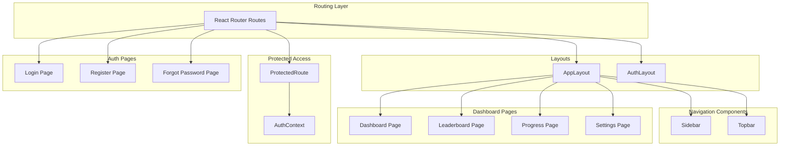
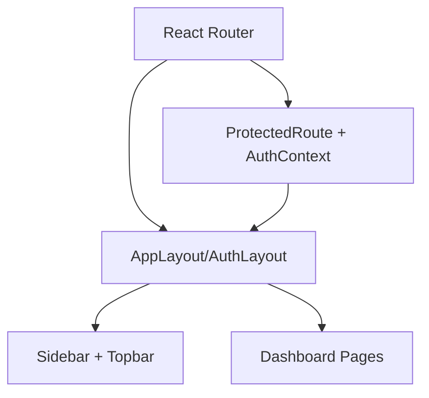
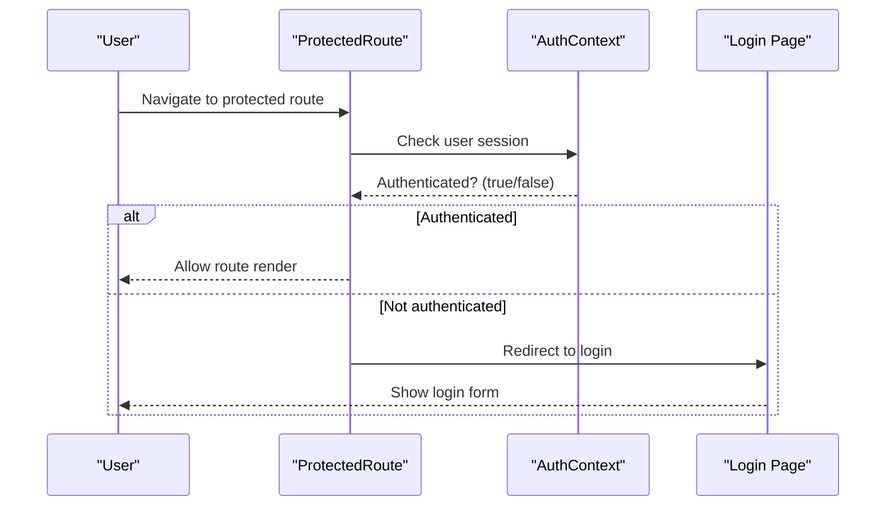
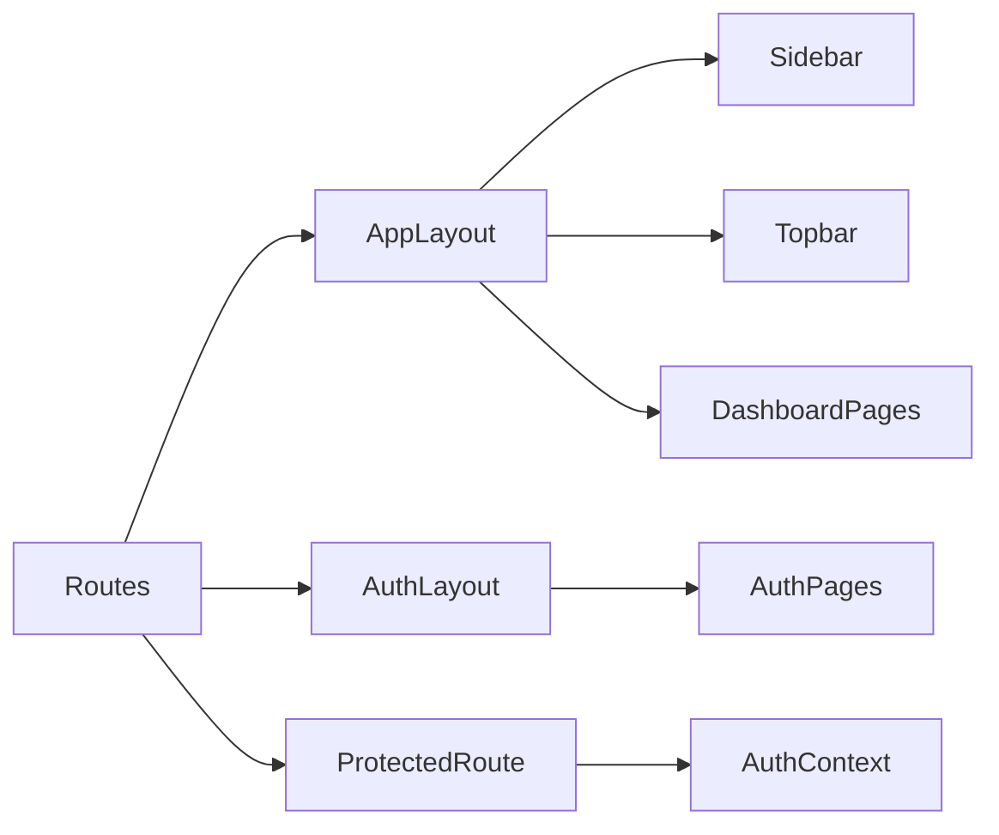

# Dashboard and Navigation

<cite>
**Referenced Files in This Document**
- [App.jsx](file://src/App.jsx)
- [main.jsx](file://src/main.jsx)
- [AppLayout.jsx](file://src/layouts/AppLayout.jsx)
- [AuthLayout.jsx](file://src/layouts/AuthLayout.jsx)
- [Sidebar.jsx](file://src/components/Sidebar.jsx)
- [Topbar.jsx](file://src/components/Topbar.jsx)
- [ProtectedRoute.jsx](file://src/components/ProtectedRoute.jsx)
- [AuthContext.jsx](file://src/contexts/AuthContext.jsx)
- [Dashboard.jsx](file://src/pages/dashboard/Dashboard.jsx)
- [LeaderboardPage.jsx](file://src/pages/dashboard/LeaderboardPage.jsx)
- [ProgressPage.jsx](file://src/pages/dashboard/ProgressPage.jsx)
- [SettingsPage.jsx](file://src/pages/dashboard/SettingsPage.jsx)
- [LoginPage.jsx](file://src/pages/auth/LoginPage.jsx)
- [RegisterPage.jsx](file://src/pages/auth/RegisterPage.jsx)
- [ForgotPasswordPage.jsx](file://src/pages/auth/ForgotPasswordPage.jsx)
- [TranslationChat.jsx](file://src/pages/chat/TranslationChat.jsx)
- [DailyChallenge.jsx](file://src/pages/games/DailyChallenge.jsx)
</cite>

## Table of Contents
1. [Introduction](#introduction)
2. [Project Structure](#project-structure)
3. [Core Components](#core-components)
4. [Architecture Overview](#architecture-overview)
5. [Detailed Component Analysis](#detailed-component-analysis)
6. [Dependency Analysis](#dependency-analysis)
7. [Performance Considerations](#performance-considerations)
8. [Accessibility and Keyboard Navigation](#accessibility-and-keyboard-navigation)
9. [Customization Guide](#customization-guide)
10. [Troubleshooting Guide](#troubleshooting-guide)
11. [Conclusion](#conclusion)

## Introduction
This document provides comprehensive documentation for the dashboard and navigation system. It explains the main dashboard layout implementation, sidebar navigation structure, topbar components, protected route mechanism, responsive design patterns, and accessibility features. It also covers how navigation integrates with routing and authentication, and offers practical guidance for extending the system with new dashboard features while maintaining a consistent user experience.

## Project Structure
The dashboard and navigation system spans several key areas:
- Layouts define the overall page containers and wrappers
- Components implement reusable UI elements like the sidebar and topbar
- ProtectedRoute enforces authentication-based access control
- Pages represent distinct dashboard features and routes
- Authentication pages handle user onboarding and session management

**Diagram sources**
- [App.jsx](file://src/App.jsx)
- [main.jsx](file://src/main.jsx)
- [AppLayout.jsx](file://src/layouts/AppLayout.jsx)
- [AuthLayout.jsx](file://src/layouts/AuthLayout.jsx)
- [Sidebar.jsx](file://src/components/Sidebar.jsx)
- [Topbar.jsx](file://src/components/Topbar.jsx)
- [ProtectedRoute.jsx](file://src/components/ProtectedRoute.jsx)
- [AuthContext.jsx](file://src/contexts/AuthContext.jsx)
- [Dashboard.jsx](file://src/pages/dashboard/Dashboard.jsx)
- [LeaderboardPage.jsx](file://src/pages/dashboard/LeaderboardPage.jsx)
- [ProgressPage.jsx](file://src/pages/dashboard/ProgressPage.jsx)
- [SettingsPage.jsx](file://src/pages/dashboard/SettingsPage.jsx)
- [LoginPage.jsx](file://src/pages/auth/LoginPage.jsx)
- [RegisterPage.jsx](file://src/pages/auth/RegisterPage.jsx)
- [ForgotPasswordPage.jsx](file://src/pages/auth/ForgotPasswordPage.jsx)

**Section sources**
- [App.jsx](file://src/App.jsx)
- [main.jsx](file://src/main.jsx)

## Core Components
This section documents the primary building blocks of the dashboard and navigation system.

- AppLayout: Provides the main container for authenticated pages, embedding the sidebar and topbar, and rendering routed content.
- Sidebar: Implements the left navigation panel with links to dashboard features and actions.
- Topbar: Hosts user profile, notifications, and quick actions.
- ProtectedRoute: Guards routes requiring authentication.
- AuthContext: Centralizes authentication state and methods for login/logout.
- Dashboard pages: Feature-specific pages such as leaderboard, progress, and settings.

Key implementation patterns:
- Composition via layouts ensures consistent header, navigation, and content areas.
- ProtectedRoute leverages AuthContext to redirect unauthenticated users.
- Responsive breakpoints and mobile-friendly toggles enable seamless cross-device navigation.

**Section sources**
- [AppLayout.jsx](file://src/layouts/AppLayout.jsx)
- [Sidebar.jsx](file://src/components/Sidebar.jsx)
- [Topbar.jsx](file://src/components/Topbar.jsx)
- [ProtectedRoute.jsx](file://src/components/ProtectedRoute.jsx)
- [AuthContext.jsx](file://src/contexts/AuthContext.jsx)
- [Dashboard.jsx](file://src/pages/dashboard/Dashboard.jsx)
- [LeaderboardPage.jsx](file://src/pages/dashboard/LeaderboardPage.jsx)
- [ProgressPage.jsx](file://src/pages/dashboard/ProgressPage.jsx)
- [SettingsPage.jsx](file://src/pages/dashboard/SettingsPage.jsx)

## Architecture Overview
The navigation and dashboard architecture follows a layered approach:
- Routing layer defines available routes and wraps content with appropriate layouts.
- Layout layer composes AppLayout or AuthLayout around page components.
- Navigation layer provides Sidebar and Topbar integrated within AppLayout.
- Access control layer enforces authentication via ProtectedRoute and AuthContext.
- Page layer implements feature-specific dashboards and related views.

**Diagram sources**
- [App.jsx](file://src/App.jsx)
- [AppLayout.jsx](file://src/layouts/AppLayout.jsx)
- [AuthLayout.jsx](file://src/layouts/AuthLayout.jsx)
- [Sidebar.jsx](file://src/components/Sidebar.jsx)
- [Topbar.jsx](file://src/components/Topbar.jsx)
- [ProtectedRoute.jsx](file://src/components/ProtectedRoute.jsx)
- [AuthContext.jsx](file://src/contexts/AuthContext.jsx)

## Detailed Component Analysis

### AppLayout: Main Dashboard Container
AppLayout serves as the primary wrapper for authenticated pages. It:
- Renders Sidebar and Topbar consistently across dashboard routes.
- Provides a content area for routed components.
- Manages responsive behavior and mobile navigation toggles.

Integration points:
- Wraps page components such as Dashboard, Leaderboard, Progress, and Settings.
- Coordinates with ProtectedRoute to ensure only authenticated users enter the layout.

Responsive behavior:
- Uses Tailwind classes and media queries to adapt layout for tablets and phones.
- Collapses Sidebar on smaller screens and exposes a mobile toggle.

**Section sources**
- [AppLayout.jsx](file://src/layouts/AppLayout.jsx)
- [Sidebar.jsx](file://src/components/Sidebar.jsx)
- [Topbar.jsx](file://src/components/Topbar.jsx)

### Sidebar: Navigation Structure
Sidebar organizes navigation items for dashboard features:
- Home/Dashboard link
- Leaderboard
- Progress
- Settings
- Additional quick-access items for games and chat

Behavior:
- Highlights the active route using location-aware logic.
- Integrates with routing to navigate without page reloads.
- Adapts to mobile viewport with collapsible behavior.

Accessibility:
- Uses semantic HTML and focus management for keyboard navigation.
- Ensures sufficient color contrast and visible focus indicators.

**Section sources**
- [Sidebar.jsx](file://src/components/Sidebar.jsx)

### Topbar: User Profile and Quick Actions
Topbar displays:
- User profile information and avatar placeholder
- Notification indicator
- Quick action buttons for common tasks
- User menu with logout and account settings

Interaction model:
- Clicking profile opens a dropdown menu with actions.
- Notifications badge updates based on activity.
- Quick actions provide shortcuts to frequently used features.

**Section sources**
- [Topbar.jsx](file://src/components/Topbar.jsx)

### ProtectedRoute: Access Control
ProtectedRoute enforces authentication:
- Checks AuthContext for current user session
- Redirects unauthenticated users to the login page
- Allows authenticated users to proceed to protected routes

Integration:
- Wrapped around AppLayout in routing configuration
- Delegates authentication state to AuthContext

**Diagram sources**
- [ProtectedRoute.jsx](file://src/components/ProtectedRoute.jsx)
- [AuthContext.jsx](file://src/contexts/AuthContext.jsx)
- [LoginPage.jsx](file://src/pages/auth/LoginPage.jsx)

**Section sources**
- [ProtectedRoute.jsx](file://src/components/ProtectedRoute.jsx)
- [AuthContext.jsx](file://src/contexts/AuthContext.jsx)

### Dashboard Pages: Feature Organization
Dashboard pages represent distinct functional areas:
- Dashboard: Overview of recent activity and highlights
- Leaderboard: Rankings and achievements
- Progress: Learning metrics and milestones
- Settings: Account preferences and configuration

Each page is rendered within AppLayout, inheriting consistent navigation and topbar behavior.

**Section sources**
- [Dashboard.jsx](file://src/pages/dashboard/Dashboard.jsx)
- [LeaderboardPage.jsx](file://src/pages/dashboard/LeaderboardPage.jsx)
- [ProgressPage.jsx](file://src/pages/dashboard/ProgressPage.jsx)
- [SettingsPage.jsx](file://src/pages/dashboard/SettingsPage.jsx)

### Authentication Pages: Onboarding and Session Management
Authentication pages support user lifecycle:
- LoginPage: Credentials-based sign-in
- RegisterPage: New user registration
- ForgotPasswordPage: Password reset flow

These pages are wrapped with AuthLayout and are not protected by ProtectedRoute.

**Section sources**
- [LoginPage.jsx](file://src/pages/auth/LoginPage.jsx)
- [RegisterPage.jsx](file://src/pages/auth/RegisterPage.jsx)
- [ForgotPasswordPage.jsx](file://src/pages/auth/ForgotPasswordPage.jsx)

### Chat and Games: Extended Navigation Items
Additional navigation items connect to:
- TranslationChat: Language practice chat interface
- DailyChallenge: Daily game challenge

These pages demonstrate how new features can be integrated into the existing navigation and layout system.

**Section sources**
- [TranslationChat.jsx](file://src/pages/chat/TranslationChat.jsx)
- [DailyChallenge.jsx](file://src/pages/games/DailyChallenge.jsx)

## Dependency Analysis
The navigation and dashboard system exhibits clear separation of concerns:
- Routing depends on layouts and protected routes
- Layouts depend on navigation components
- ProtectedRoute depends on AuthContext
- Pages depend on AppLayout for consistent presentation

**Diagram sources**
- [App.jsx](file://src/App.jsx)
- [AppLayout.jsx](file://src/layouts/AppLayout.jsx)
- [AuthLayout.jsx](file://src/layouts/AuthLayout.jsx)
- [Sidebar.jsx](file://src/components/Sidebar.jsx)
- [Topbar.jsx](file://src/components/Topbar.jsx)
- [ProtectedRoute.jsx](file://src/components/ProtectedRoute.jsx)
- [AuthContext.jsx](file://src/contexts/AuthContext.jsx)
- [Dashboard.jsx](file://src/pages/dashboard/Dashboard.jsx)
- [LeaderboardPage.jsx](file://src/pages/dashboard/LeaderboardPage.jsx)
- [ProgressPage.jsx](file://src/pages/dashboard/ProgressPage.jsx)
- [SettingsPage.jsx](file://src/pages/dashboard/SettingsPage.jsx)
- [LoginPage.jsx](file://src/pages/auth/LoginPage.jsx)
- [RegisterPage.jsx](file://src/pages/auth/RegisterPage.jsx)
- [ForgotPasswordPage.jsx](file://src/pages/auth/ForgotPasswordPage.jsx)

**Section sources**
- [App.jsx](file://src/App.jsx)
- [main.jsx](file://src/main.jsx)

## Performance Considerations
- Lazy loading: Consider lazy-loading heavy dashboard pages to reduce initial bundle size.
- Conditional rendering: Render navigation items conditionally based on user roles to minimize DOM overhead.
- Efficient state updates: Keep AuthContext state minimal and update only when necessary.
- CSS optimization: Use Tailwind utilities efficiently to avoid redundant styles and repaints.
- Image and asset optimization: Compress images and defer non-critical assets in dashboard components.

## Accessibility and Keyboard Navigation
Accessibility features implemented across navigation components:
- Semantic markup: Use of nav, ul, li, button, and header elements for proper screen reader interpretation.
- Focus management: Ensure focus moves predictably among navigation items and menus.
- Keyboard operability: Support Tab, Shift+Tab, Enter, Space, Arrow keys for navigation and selection.
- Color contrast: Maintain WCAG-compliant contrast ratios for text and interactive elements.
- ARIA attributes: Use aria-labels and aria-expanded for expanded/collapsed states.
- Skip links: Provide skip-to-content links for efficient navigation.

Recommendations:
- Add role="navigation" to navigation containers.
- Use aria-current for active navigation items.
- Implement focus traps for dropdown menus.
- Announce navigation changes with aria-live regions when appropriate.

## Customization Guide
Extending the navigation and dashboard system:
- Adding new navigation items:
  - Define the item in Sidebar with appropriate icon and label.
  - Create a new page component under the pages/dashboard directory.
  - Add a route in App.jsx pointing to the new page and wrap with AppLayout.
  - Ensure the new route is protected by ProtectedRoute if necessary.
- Creating new dashboard features:
  - Implement feature-specific components with clear responsibilities.
  - Integrate with AppLayout to inherit consistent navigation and topbar.
  - Use responsive design patterns already established in Sidebar and Topbar.
- Maintaining consistency:
  - Follow existing naming conventions for files and components.
  - Reuse shared components (Sidebar, Topbar) to preserve UX.
  - Keep authentication logic centralized in ProtectedRoute and AuthContext.
  - Test responsive behavior across tablet and phone breakpoints.

## Troubleshooting Guide
Common issues and resolutions:
- Navigation not updating active state:
  - Verify route matching logic in Sidebar and ensure location-based highlighting is applied.
- ProtectedRoute redirects incorrectly:
  - Confirm AuthContext provides a valid user session and ProtectedRoute reads it correctly.
- Mobile navigation not working:
  - Check responsive classes and event handlers for mobile toggle functionality.
- Topbar actions not responding:
  - Validate click handlers and ensure dropdown menus are properly mounted and unmounted.
- Auth pages still protected:
  - Ensure AuthLayout is used for login/register/forgot pages and they are not wrapped by ProtectedRoute.

**Section sources**
- [Sidebar.jsx](file://src/components/Sidebar.jsx)
- [Topbar.jsx](file://src/components/Topbar.jsx)
- [ProtectedRoute.jsx](file://src/components/ProtectedRoute.jsx)
- [AuthContext.jsx](file://src/contexts/AuthContext.jsx)

## Conclusion
The dashboard and navigation system is built on a clean, modular architecture that separates routing, layout, navigation, and access control concerns. AppLayout provides a consistent container, Sidebar and Topbar deliver unified navigation and user controls, and ProtectedRoute ensures secure access to dashboard features. The responsive design and accessibility features support diverse user needs, while the clear component boundaries facilitate easy extension and maintenance. Following the customization guide will help maintain a cohesive user experience as new features are added.