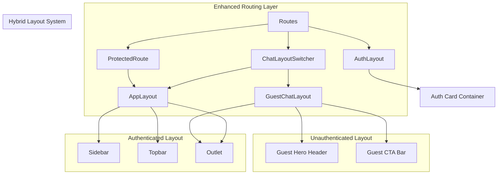
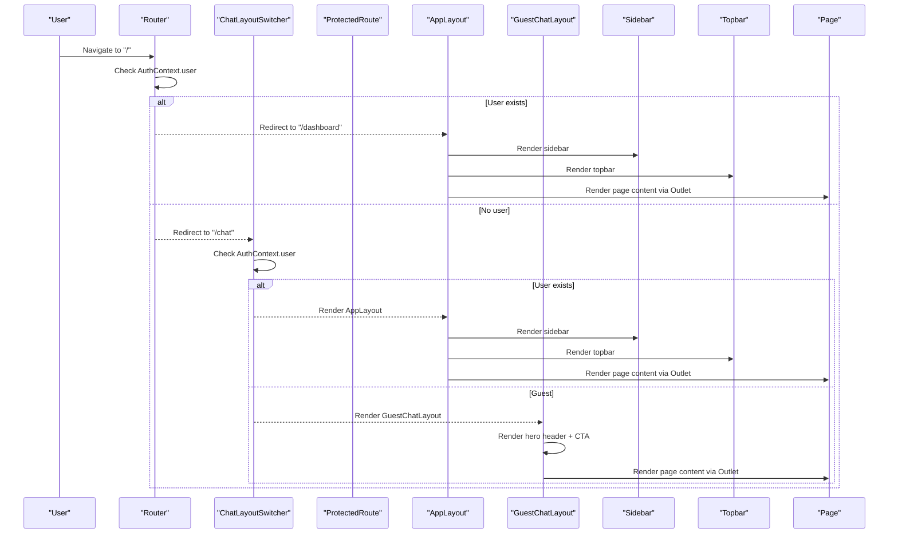
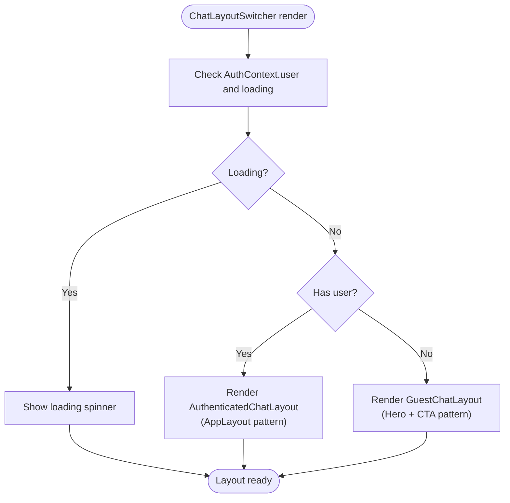
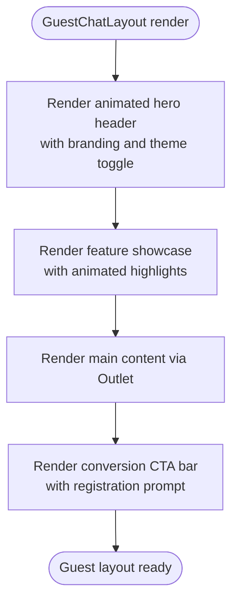
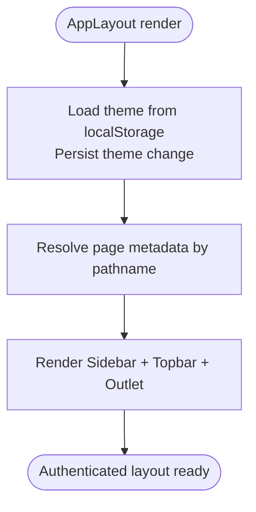
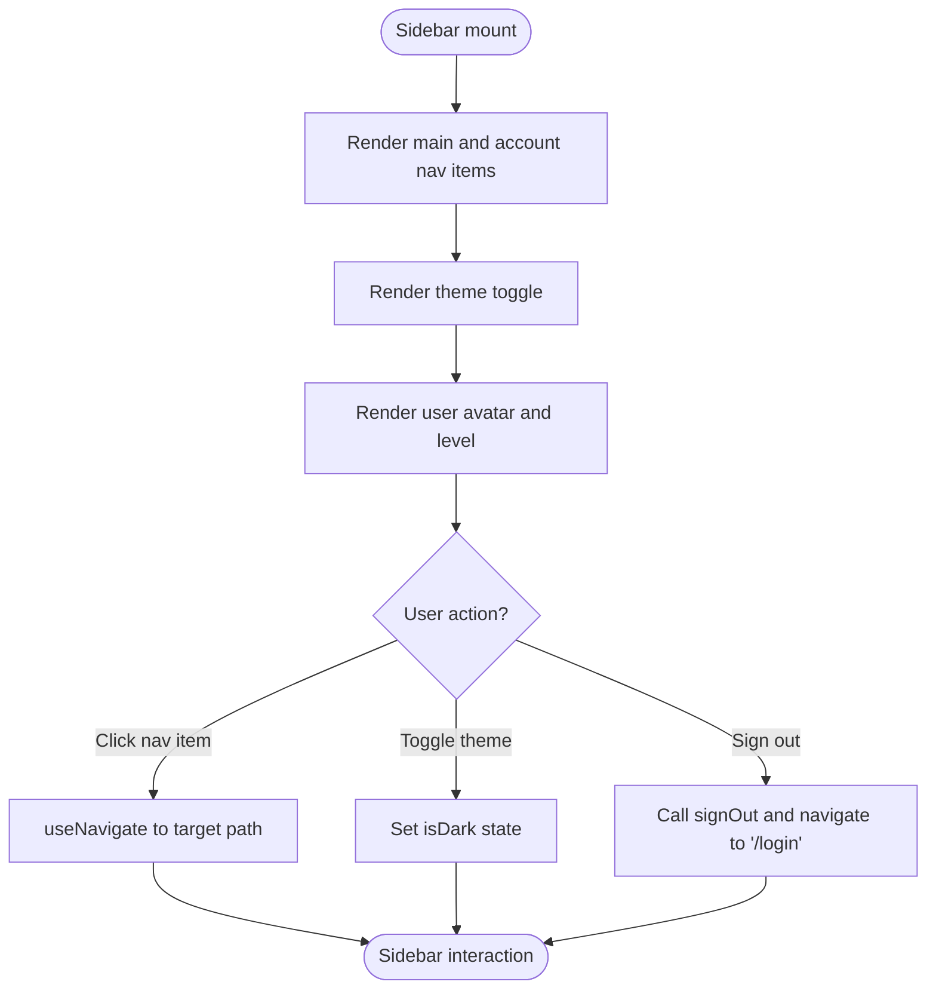
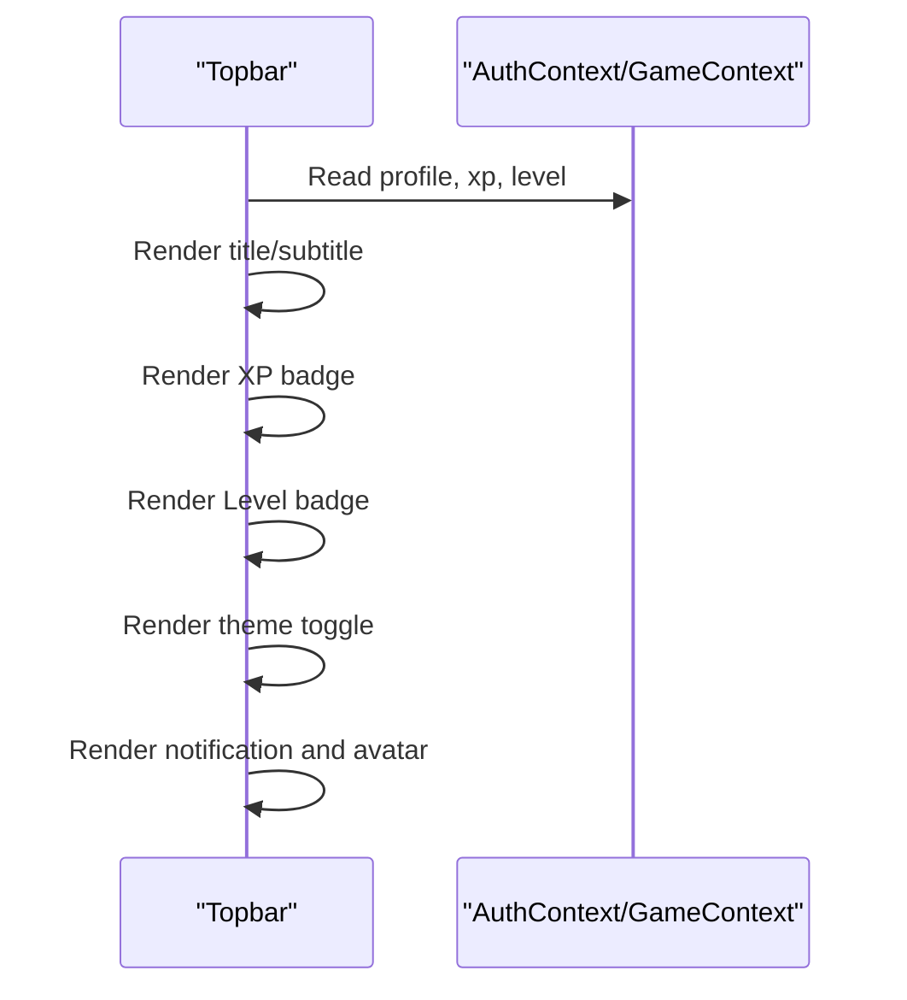
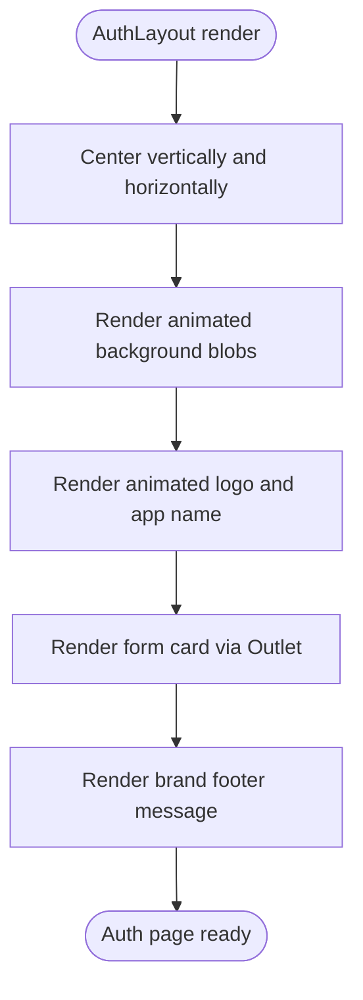
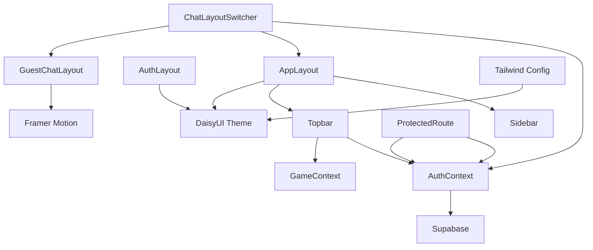

# Layout System and Responsive Design

<cite>
**Referenced Files in This Document**
- [AppLayout.jsx](file://src/layouts/AppLayout.jsx)
- [AuthLayout.jsx](file://src/layouts/AuthLayout.jsx)
- [ChatLayoutSwitcher.jsx](file://src/layouts/ChatLayoutSwitcher.jsx)
- [GuestChatLayout.jsx](file://src/layouts/GuestChatLayout.jsx)
- [Sidebar.jsx](file://src/components/Sidebar.jsx)
- [Topbar.jsx](file://src/components/Topbar.jsx)
- [App.jsx](file://src/App.jsx)
- [ProtectedRoute.jsx](file://src/components/ProtectedRoute.jsx)
- [AuthContext.jsx](file://src/contexts/AuthContext.jsx)
- [tailwind.config.js](file://tailwind.config.js)
- [index.css](file://src/index.css)
- [Dashboard.jsx](file://src/pages/dashboard/Dashboard.jsx)
- [LoginPage.jsx](file://src/pages/auth/LoginPage.jsx)
- [TranslationChat.jsx](file://src/pages/chat/TranslationChat.jsx)
</cite>

## Update Summary
**Changes Made**
- Added new ChatLayoutSwitcher component for dynamic layout selection based on authentication status
- Introduced GuestChatLayout for unauthenticated users with hero header and CTA features
- Enhanced routing system with improved chat route handling
- Updated layout switching mechanism between authenticated and unauthenticated states
- Added guest user experience with translation limits and conversion prompts

## Table of Contents
1. [Introduction](#introduction)
2. [Project Structure](#project-structure)
3. [Core Components](#core-components)
4. [Architecture Overview](#architecture-overview)
5. [Detailed Component Analysis](#detailed-component-analysis)
6. [Dependency Analysis](#dependency-analysis)
7. [Performance Considerations](#performance-considerations)
8. [Troubleshooting Guide](#troubleshooting-guide)
9. [Conclusion](#conclusion)
10. [Appendices](#appendices)

## Introduction
This document explains the layout system and responsive design implementation in the application. It focuses on how AppLayout, AuthLayout, ChatLayoutSwitcher, and GuestChatLayout provide consistent structure across authenticated, unauthenticated, and hybrid experiences. The system now features intelligent layout switching based on user authentication status, with specialized layouts for different user types. It covers how headers, sidebars, and guest interfaces integrate with content areas, responsive breakpoints, mobile navigation patterns, and the enhanced routing architecture.

## Project Structure
The layout system now centers around four key layout components:
- AppLayout: wraps authenticated pages with a persistent sidebar and topbar
- AuthLayout: wraps authentication pages with centered card layout
- ChatLayoutSwitcher: dynamically selects between authenticated AppLayout and GuestChatLayout based on authentication status
- GuestChatLayout: provides a rich, feature-rich interface for unauthenticated users with hero header and CTA elements

Routing integrates these layouts with protected routes, authentication routes, and the new chat route that intelligently switches layouts based on user state.



**Diagram sources**
- [App.jsx:59-61](file://src/App.jsx#L59-L61)
- [ChatLayoutSwitcher.jsx:17-29](file://src/layouts/ChatLayoutSwitcher.jsx#L17-L29)
- [GuestChatLayout.jsx:5-64](file://src/layouts/GuestChatLayout.jsx#L5-L64)
- [AppLayout.jsx:17-41](file://src/layouts/AppLayout.jsx#L17-L41)
- [AuthLayout.jsx:4-15](file://src/layouts/AuthLayout.jsx#L4-L15)

**Section sources**
- [App.jsx:19-84](file://src/App.jsx#L19-L84)
- [ChatLayoutSwitcher.jsx:1-118](file://src/layouts/ChatLayoutSwitcher.jsx#L1-L118)
- [GuestChatLayout.jsx:1-64](file://src/layouts/GuestChatLayout.jsx#L1-L64)

## Core Components
- AppLayout: Provides a two-column layout with a fixed sidebar and scrollable main content area, managing theme persistence and page metadata for the topbar
- AuthLayout: Provides a centered card container for authentication forms with consistent brand identity and animated background elements
- ChatLayoutSwitcher: Intelligent layout selector that chooses between AppLayout for authenticated users and GuestChatLayout for guests
- GuestChatLayout: Rich interface for unauthenticated users featuring hero header, feature showcase, and conversion call-to-action bars
- Sidebar: Implements main navigation menu, account links, theme toggle, user avatar, and sign-out flow
- Topbar: Displays page title/subtitle, XP and level badges, dark mode toggle, notifications, and user avatar
- ProtectedRoute: Guards authenticated routes and handles loading and redirect logic
- AuthContext: Centralizes authentication state and session management

Key styling and design tokens are defined via Tailwind CSS and DaisyUI, enabling consistent theming, responsive utilities, and advanced animations with Framer Motion.

**Section sources**
- [AppLayout.jsx:6-41](file://src/layouts/AppLayout.jsx#L6-L41)
- [AuthLayout.jsx:4-51](file://src/layouts/AuthLayout.jsx#L4-L51)
- [ChatLayoutSwitcher.jsx:8-29](file://src/layouts/ChatLayoutSwitcher.jsx#L8-L29)
- [GuestChatLayout.jsx:5-64](file://src/layouts/GuestChatLayout.jsx#L5-L64)
- [Sidebar.jsx:19-121](file://src/components/Sidebar.jsx#L19-L121)
- [Topbar.jsx:4-56](file://src/components/Topbar.jsx#L4-L56)
- [ProtectedRoute.jsx:4-17](file://src/components/ProtectedRoute.jsx#L4-L17)
- [AuthContext.jsx:6-30](file://src/contexts/AuthContext.jsx#L6-L30)

## Architecture Overview
The enhanced layout architecture now supports three distinct user experiences:
- Authenticated flow: ProtectedRoute checks authentication state; on success, AppLayout renders Sidebar, Topbar, and page content
- Unauthenticated flow: ChatLayoutSwitcher detects guest status and renders GuestChatLayout with rich features and CTA elements
- Hybrid flow: SmartRedirect provides intelligent root path redirection based on authentication state



**Diagram sources**
- [App.jsx:27-37](file://src/App.jsx#L27-L37)
- [ChatLayoutSwitcher.jsx:17-29](file://src/layouts/ChatLayoutSwitcher.jsx#L17-L29)
- [ProtectedRoute.jsx:4-17](file://src/components/ProtectedRoute.jsx#L4-L17)
- [AppLayout.jsx:17-41](file://src/layouts/AppLayout.jsx#L17-L41)
- [GuestChatLayout.jsx:5-64](file://src/layouts/GuestChatLayout.jsx#L5-L64)

## Detailed Component Analysis

### ChatLayoutSwitcher: Intelligent Layout Selection
ChatLayoutSwitcher provides dynamic layout selection based on authentication status:
- Authentication detection: Uses AuthContext to determine user state and loading status
- Loading state handling: Displays spinner while authentication state resolves
- Layout switching: Renders AuthenticatedChatLayout for logged-in users, GuestChatLayout for guests
- Theme synchronization: Maintains consistent dark/light theme across both layouts

**Updated** Enhanced with intelligent authentication-based layout switching for the chat route



**Diagram sources**
- [ChatLayoutSwitcher.jsx:17-29](file://src/layouts/ChatLayoutSwitcher.jsx#L17-L29)

**Section sources**
- [ChatLayoutSwitcher.jsx:1-118](file://src/layouts/ChatLayoutSwitcher.jsx#L1-L118)

### GuestChatLayout: Rich Unauthenticated Experience
GuestChatLayout provides a feature-rich interface for unauthenticated users:
- Hero header: Animated gradient branding with guest badge and theme toggle
- Feature showcase: Animated feature strip highlighting AI translation, language support, games, and gamification
- CTA bar: Prominent call-to-action for registration and conversion
- Theme management: Independent theme control synchronized with localStorage
- Navigation: Direct links to login and registration pages

**Updated** New component providing comprehensive guest experience with conversion-focused design



**Diagram sources**
- [GuestChatLayout.jsx:15-64](file://src/layouts/GuestChatLayout.jsx#L15-L64)

**Section sources**
- [GuestChatLayout.jsx:1-64](file://src/layouts/GuestChatLayout.jsx#L1-L64)

### AppLayout: Consistent Structure for Authenticated Pages
AppLayout orchestrates the authenticated experience:
- Theme management: Reads/writes theme preference to localStorage and applies DaisyUI theme variant
- Page metadata: Uses a path-to-metadata map to set title and subtitle for the topbar
- Composition: Renders Sidebar and Topbar, then renders page content via Outlet

Responsive behavior:
- Full viewport height with hidden overflow
- Sidebar width is fixed; main content area grows to fill remaining space
- Scrollbar utilities applied to sidebar and main content areas



**Diagram sources**
- [AppLayout.jsx:18-28](file://src/layouts/AppLayout.jsx#L18-L28)
- [AppLayout.jsx:30-40](file://src/layouts/AppLayout.jsx#L30-L40)

**Section sources**
- [AppLayout.jsx:17-41](file://src/layouts/AppLayout.jsx#L17-L41)
- [index.css:9-13](file://src/index.css#L9-L13)

### Sidebar: Navigation and User Controls
Sidebar provides:
- Fixed width and sticky positioning for continuous access
- Two navigation sections: main app features and account-related pages
- Theme toggle synchronized with AppLayout
- User profile display with initials and level
- Sign-out flow that navigates to login

Responsive behavior:
- Vertical scrolling container for long menus
- Hover and active states for navigation items
- Scrollbar styling applied to the sidebar



**Diagram sources**
- [Sidebar.jsx:5-17](file://src/components/Sidebar.jsx#L5-L17)
- [Sidebar.jsx:37-121](file://src/components/Sidebar.jsx#L37-L121)

**Section sources**
- [Sidebar.jsx:19-121](file://src/components/Sidebar.jsx#L19-L121)

### Topbar: Header Integration and Status Indicators
Topbar displays:
- Dynamic page title and optional subtitle
- XP and level badges reflecting game progress
- Dark mode toggle synchronized with AppLayout
- Notification indicator and user avatar

Responsive behavior:
- Sticky header with z-index for overlay behavior
- Compact horizontal layout with badges and avatar



**Diagram sources**
- [Topbar.jsx:4-56](file://src/components/Topbar.jsx#L4-L56)
- [AuthContext.jsx:6-30](file://src/contexts/AuthContext.jsx#L6-L30)

**Section sources**
- [Topbar.jsx:4-56](file://src/components/Topbar.jsx#L4-L56)

### AuthLayout: Centered Authentication Experience
AuthLayout ensures:
- Full-screen vertical centering with minimal horizontal padding
- Brand identity with animated background elements and gradient branding
- Card-based form container with a maximum width for readability

Responsive behavior:
- Single column layout optimized for mobile screens
- Forms adapt to smaller widths with appropriate spacing
- Animated background elements provide visual interest



**Diagram sources**
- [AuthLayout.jsx:4-51](file://src/layouts/AuthLayout.jsx#L4-L51)

**Section sources**
- [AuthLayout.jsx:1-51](file://src/layouts/AuthLayout.jsx#L1-L51)

### ProtectedRoute: Guarding Authenticated Routes
ProtectedRoute:
- Blocks navigation until authentication state resolves
- Redirects unauthenticated users to the login page
- Renders children (AppLayout) when the user is authenticated


**Diagram sources**
- [ProtectedRoute.jsx:4-17](file://src/components/ProtectedRoute.jsx#L4-L17)
- [AuthContext.jsx:6-30](file://src/contexts/AuthContext.jsx#L6-L30)

**Section sources**
- [ProtectedRoute.jsx:1-18](file://src/components/ProtectedRoute.jsx#L1-L18)

### Enhanced Routing and Layout Switching Mechanism
Enhanced routing system now includes:
- Auth routes wrapped in AuthLayout for login, register, and forgot-password
- Chat route wrapped in ChatLayoutSwitcher for universal access with intelligent layout switching
- Protected routes wrapped in ProtectedRoute and AppLayout for authenticated-only pages
- SmartRedirect for root path that redirects based on authentication state
- Default redirect to either dashboard (authenticated) or chat (guest)

**Updated** Enhanced with ChatLayoutSwitcher for intelligent layout selection and SmartRedirect for root path optimization

```mermaid
graph LR
L["/login,/register,/forgot-password"] --> AL["AuthLayout"]
C["/chat"] --> CLS["ChatLayoutSwitcher"]
CLS --> AU["Authenticated Users → AppLayout"]
CLS --> GU["Guest Users → GuestChatLayout"]
D["/dashboard,/games,/leaderboard,/progress,/settings"] --> PR["ProtectedRoute"] --> APP["AppLayout"]
"*" --> SR["SmartRedirect → /dashboard or /chat"]
```

**Diagram sources**
- [App.jsx:44-84](file://src/App.jsx#L44-L84)
- [ChatLayoutSwitcher.jsx:51-61](file://src/layouts/ChatLayoutSwitcher.jsx#L51-L61)

**Section sources**
- [App.jsx:19-84](file://src/App.jsx#L19-L84)

## Dependency Analysis
Enhanced dependency relationships:
- AppLayout depends on:
  - Sidebar and Topbar for structural elements
  - AuthContext/GameContext for user and progress data used in Topbar
  - DaisyUI theme attributes for consistent colors and backgrounds
- AuthLayout depends on:
  - Outlet to render authentication forms
  - DaisyUI base colors for background and typography
  - Framer Motion for animated background elements
- ChatLayoutSwitcher depends on:
  - AuthContext for authentication state detection
  - ChatLayoutSwitcher for layout selection
  - GuestChatLayout for unauthenticated experience
- GuestChatLayout depends on:
  - Outlet for content rendering
  - Framer Motion for animations
  - Theme management via localStorage
- ProtectedRoute depends on:
  - AuthContext for authentication state and loading
- Tailwind and DaisyUI configuration define:
  - Design tokens (colors, spacing, typography)
  - Theme variants ("flingo", "flingo-dark")
  - Utility classes for responsive grids and scrollbars



**Diagram sources**
- [AppLayout.jsx:3-4](file://src/layouts/AppLayout.jsx#L3-L4)
- [Topbar.jsx:1-2](file://src/components/Topbar.jsx#L1-L2)
- [ProtectedRoute.jsx:2-5](file://src/components/ProtectedRoute.jsx#L2-L5)
- [ChatLayoutSwitcher.jsx:4-6](file://src/layouts/ChatLayoutSwitcher.jsx#L4-L6)
- [GuestChatLayout.jsx:3](file://src/layouts/GuestChatLayout.jsx#L3)
- [tailwind.config.js:20-64](file://tailwind.config.js#L20-L64)

**Section sources**
- [tailwind.config.js:20-64](file://tailwind.config.js#L20-L64)
- [index.css:1-14](file://src/index.css#L1-L14)

## Performance Considerations
Enhanced performance optimizations:
- Theme persistence: LocalStorage reads/writes occur on mount and theme changes, minimizing overhead
- Scroll containers: Dedicated scroll areas (sidebar and main content) prevent unnecessary reflows
- Conditional rendering: ProtectedRoute and ChatLayoutSwitcher avoid rendering layout until authentication resolves
- DaisyUI themes: Prebuilt theme variants reduce runtime computations for color application
- Animation optimization: Framer Motion animations are only applied to guest layouts, reducing complexity for authenticated users
- Guest session management: Efficient guest translation counting with sessionStorage for better performance

## Troubleshooting Guide
Enhanced troubleshooting for new components:
- Layout not switching after login/logout:
  - Verify ChatLayoutSwitcher behavior and AuthContext state updates
  - Confirm routing configuration for chat route and authentication status detection
- Guest layout not displaying correctly:
  - Check GuestChatLayout theme synchronization and localStorage persistence
  - Verify animation components are properly loaded
- Translation limits not working:
  - Ensure guest count storage in sessionStorage and guest limit enforcement
  - Check SmartRedirect behavior for root path navigation
- Theme not persisting across layouts:
  - Ensure localStorage keys match expected values and theme attribute is applied to both AppLayout and GuestChatLayout
- Animation issues:
  - Verify Framer Motion is properly installed and configured
  - Check animation timing and easing configurations

**Section sources**
- [ChatLayoutSwitcher.jsx:17-29](file://src/layouts/ChatLayoutSwitcher.jsx#L17-L29)
- [GuestChatLayout.jsx:7-11](file://src/layouts/GuestChatLayout.jsx#L7-L11)
- [App.jsx:27-37](file://src/App.jsx#L27-L37)
- [TranslationChat.jsx:14-41](file://src/pages/chat/TranslationChat.jsx#L14-L41)

## Conclusion
The enhanced layout system now provides a sophisticated, user-centric experience with intelligent layout selection based on authentication status. ChatLayoutSwitcher and GuestChatLayout create seamless transitions between guest and authenticated experiences, while maintaining design consistency through shared components and theming. The system balances rich feature presentation for guests with streamlined functionality for authenticated users, all while leveraging Tailwind CSS, DaisyUI, and Framer Motion for cohesive design and smooth interactions. This architecture enables scalable customization and maintains design consistency across all user types and experiences.

## Appendices

### Responsive Breakpoints and Mobile Navigation Patterns
Enhanced responsive behavior:
- Grid and spacing:
  - Use responsive grid classes to adjust card and stat layouts for smaller screens
  - GuestChatLayout features adaptive CTA bars and feature showcases for mobile
- Scrollbars:
  - Apply thin scrollbar utilities for subtle, consistent scrollbars across components
  - Main content areas in both AppLayout and GuestChatLayout use dedicated scroll containers
- Layout containers:
  - AuthLayout uses constrained max-width and padding for optimal mobile readability
  - GuestChatLayout implements flexible hero headers and CTA bars that adapt to screen size

**Section sources**
- [Dashboard.jsx:58-79](file://src/pages/dashboard/Dashboard.jsx#L58-L79)
- [index.css:9-13](file://src/index.css#L9-L13)
- [GuestChatLayout.jsx:15-64](file://src/layouts/GuestChatLayout.jsx#L15-L64)

### Styling Approach: Tailwind CSS, DaisyUI, and Framer Motion Integration
Enhanced styling approach:
- Design tokens:
  - Define brand-specific colors and theme variants in the Tailwind configuration
  - Implement gradient color schemes for branding consistency
- Utilities:
  - Leverage DaisyUI utilities for components and base styles
  - Use Framer Motion for advanced animations and micro-interactions
- Layering:
  - Base and utilities layers ensure consistent typography and global styles
  - Theme attributes applied via data-theme for component-level theming
- Animation system:
  - GuestChatLayout uses sophisticated animations for hero elements and feature highlights
  - Smooth transitions between layout states for enhanced user experience

**Section sources**
- [tailwind.config.js:6-18](file://tailwind.config.js#L6-L18)
- [tailwind.config.js:20-64](file://tailwind.config.js#L20-L64)
- [index.css:1-14](file://src/index.css#L1-L14)
- [GuestChatLayout.jsx:17-37](file://src/layouts/GuestChatLayout.jsx#L17-L37)

### Creating Custom Layouts and Maintaining Consistency
Enhanced guidance for layout development:
- Wrap page components with appropriate layouts based on user type and content requirements
- Use ChatLayoutSwitcher as a template for intelligent layout selection patterns
- Reuse shared components (Sidebar, Topbar) to preserve branding and navigation consistency
- Apply DaisyUI theme attributes and responsive utilities consistently across all layouts
- Implement guest experience patterns with conversion-focused CTAs and feature showcases
- Use ProtectedRoute for authenticated-only pages and AuthLayout for login/register/forgot-password
- Extend page metadata in AppLayout for accurate header titles and use GuestChatLayout for guest-facing content
- Consider animation patterns from GuestChatLayout for enhanced user engagement

Example references:
- Intelligent layout switching via ChatLayoutSwitcher
- Authenticated page composition via AppLayout and ProtectedRoute
- Auth page composition via AuthLayout
- Guest experience composition via GuestChatLayout

**Section sources**
- [App.jsx:59-61](file://src/App.jsx#L59-L61)
- [ChatLayoutSwitcher.jsx:8-29](file://src/layouts/ChatLayoutSwitcher.jsx#L8-L29)
- [AppLayout.jsx:17-41](file://src/layouts/AppLayout.jsx#L17-L41)
- [AuthLayout.jsx:1-51](file://src/layouts/AuthLayout.jsx#L1-L51)
- [GuestChatLayout.jsx:1-64](file://src/layouts/GuestChatLayout.jsx#L1-L64)