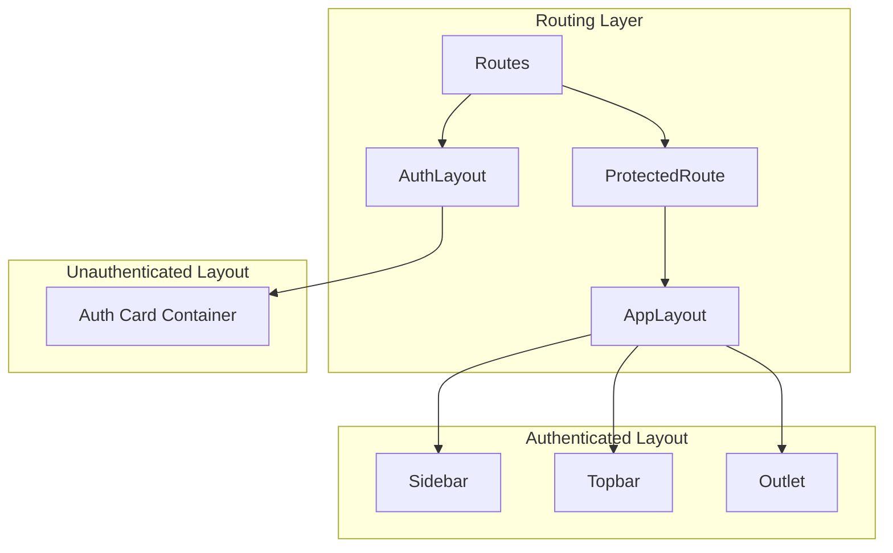
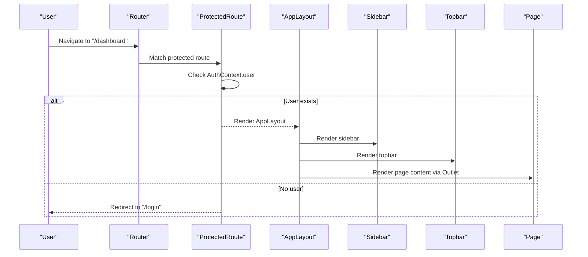
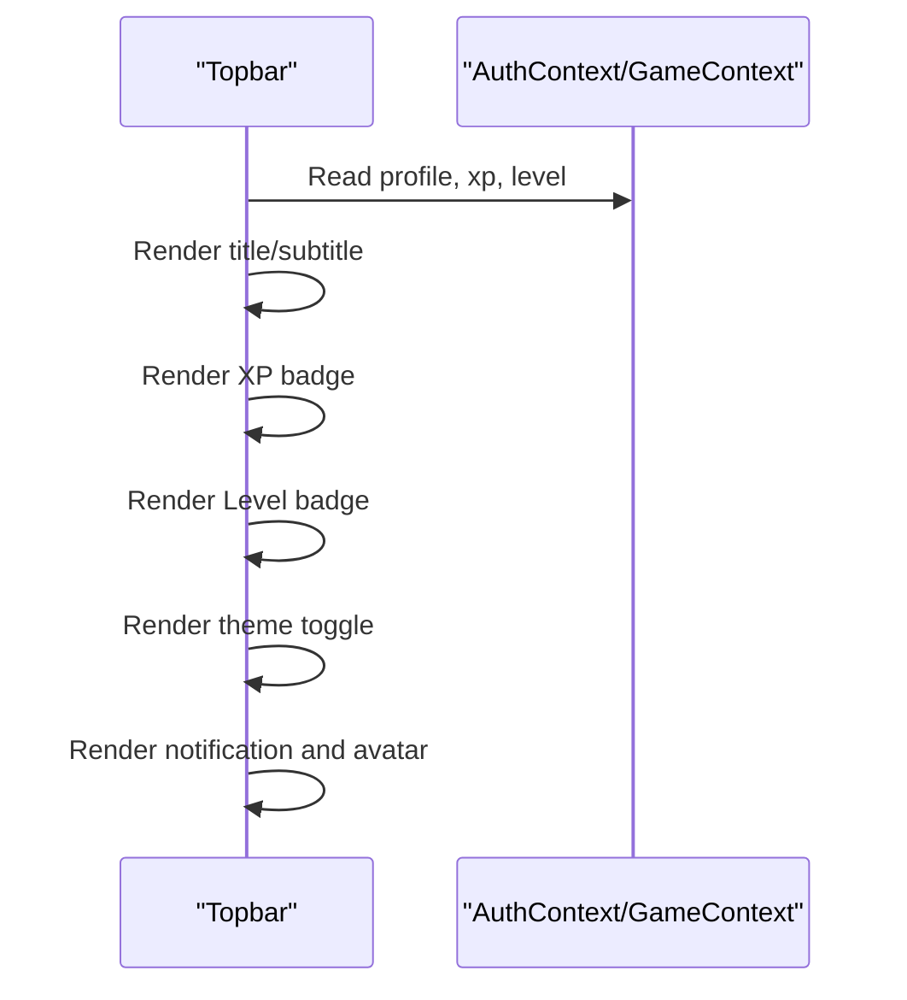
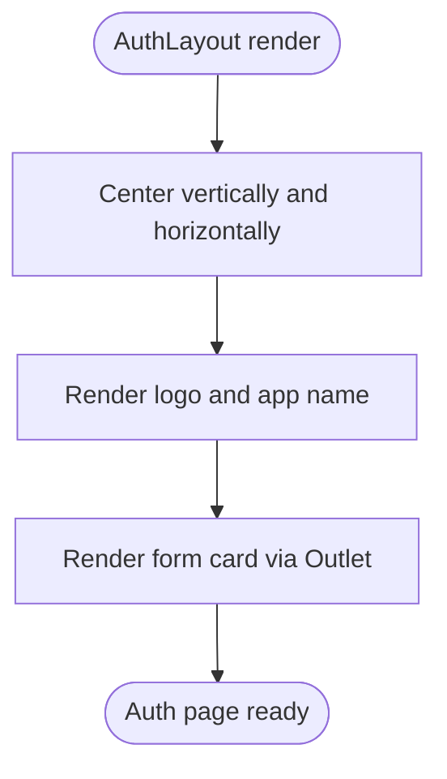
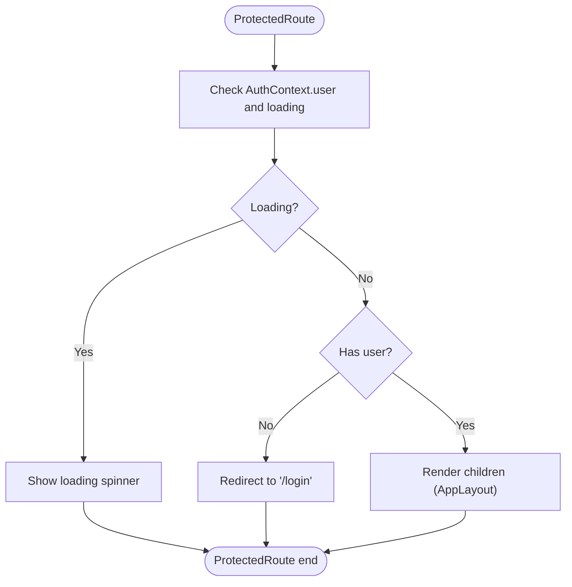
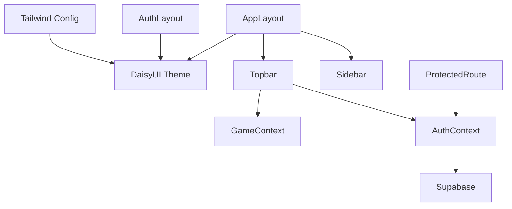

# Layout System and Responsive Design

<cite>
**Referenced Files in This Document**
- [AppLayout.jsx](file://src/layouts/AppLayout.jsx)
- [AuthLayout.jsx](file://src/layouts/AuthLayout.jsx)
- [Sidebar.jsx](file://src/components/Sidebar.jsx)
- [Topbar.jsx](file://src/components/Topbar.jsx)
- [App.jsx](file://src/App.jsx)
- [ProtectedRoute.jsx](file://src/components/ProtectedRoute.jsx)
- [AuthContext.jsx](file://src/contexts/AuthContext.jsx)
- [tailwind.config.js](file://tailwind.config.js)
- [index.css](file://src/index.css)
- [Dashboard.jsx](file://src/pages/dashboard/Dashboard.jsx)
- [LoginPage.jsx](file://src/pages/auth/LoginPage.jsx)
</cite>

## Table of Contents
1. [Introduction](#introduction)
2. [Project Structure](#project-structure)
3. [Core Components](#core-components)
4. [Architecture Overview](#architecture-overview)
5. [Detailed Component Analysis](#detailed-component-analysis)
6. [Dependency Analysis](#dependency-analysis)
7. [Performance Considerations](#performance-considerations)
8. [Troubleshooting Guide](#troubleshooting-guide)
9. [Conclusion](#conclusion)
10. [Appendices](#appendices)

## Introduction
This document explains the layout system and responsive design implementation in the application. It focuses on how AppLayout and AuthLayout provide consistent structure across authenticated and unauthenticated experiences, how the header and sidebar integrate with the content area, and how responsive breakpoints and mobile navigation patterns are handled. It also documents the styling approach using Tailwind CSS and DaisyUI design tokens, the layout switching mechanism between states, and practical guidance for creating and customizing layouts while maintaining design consistency.

## Project Structure
The layout system centers around two layout components:
- AppLayout: wraps authenticated pages with a persistent sidebar and topbar, rendering page content via Outlet.
- AuthLayout: wraps authentication pages with centered card layout and a consistent logo.

Routing integrates these layouts with protected routes and authentication routes, ensuring the correct layout renders based on user authentication state.



**Diagram sources**
- [App.jsx:23-46](file://src/App.jsx#L23-L46)
- [AuthLayout.jsx:3-16](file://src/layouts/AuthLayout.jsx#L3-L16)
- [AppLayout.jsx:17-41](file://src/layouts/AppLayout.jsx#L17-L41)
- [ProtectedRoute.jsx:4-17](file://src/components/ProtectedRoute.jsx#L4-L17)

**Section sources**
- [App.jsx:19-49](file://src/App.jsx#L19-L49)
- [AuthLayout.jsx:1-17](file://src/layouts/AuthLayout.jsx#L1-L17)
- [AppLayout.jsx:17-41](file://src/layouts/AppLayout.jsx#L17-L41)

## Core Components
- AppLayout: Provides a two-column layout with a fixed sidebar and a scrollable main content area. It manages theme persistence and sets the active page metadata for the topbar.
- AuthLayout: Provides a centered card container for authentication forms with a consistent brand identity.
- Sidebar: Implements the main navigation menu, account links, theme toggle, user avatar, and sign-out flow.
- Topbar: Displays page title/subtitle, XP and level badges, dark mode toggle, notifications, and user avatar.
- ProtectedRoute: Guards authenticated routes and handles loading and redirect logic.
- AuthContext: Centralizes authentication state and session management.

Key styling and design tokens are defined via Tailwind CSS and DaisyUI, enabling consistent theming and responsive utilities.

**Section sources**
- [AppLayout.jsx:6-28](file://src/layouts/AppLayout.jsx#L6-L28)
- [AppLayout.jsx:30-40](file://src/layouts/AppLayout.jsx#L30-L40)
- [AuthLayout.jsx:4-15](file://src/layouts/AuthLayout.jsx#L4-L15)
- [Sidebar.jsx:19-121](file://src/components/Sidebar.jsx#L19-L121)
- [Topbar.jsx:4-56](file://src/components/Topbar.jsx#L4-L56)
- [ProtectedRoute.jsx:4-17](file://src/components/ProtectedRoute.jsx#L4-L17)
- [AuthContext.jsx:6-30](file://src/contexts/AuthContext.jsx#L6-L30)

## Architecture Overview
The layout architecture separates concerns between authenticated and unauthenticated flows:
- Authenticated flow: ProtectedRoute checks authentication state; on success, AppLayout renders Sidebar, Topbar, and page content.
- Unauthenticated flow: AuthLayout renders authentication forms inside a centered card.



**Diagram sources**
- [App.jsx:32-41](file://src/App.jsx#L32-L41)
- [ProtectedRoute.jsx:4-17](file://src/components/ProtectedRoute.jsx#L4-L17)
- [AppLayout.jsx:17-41](file://src/layouts/AppLayout.jsx#L17-L41)
- [Sidebar.jsx:19-121](file://src/components/Sidebar.jsx#L19-L121)
- [Topbar.jsx:4-56](file://src/components/Topbar.jsx#L4-L56)

## Detailed Component Analysis

### AppLayout: Consistent Structure for Authenticated Pages
AppLayout orchestrates the authenticated experience:
- Theme management: Reads/writes theme preference to localStorage and applies a DaisyUI theme variant.
- Page metadata: Uses a path-to-metadata map to set title and subtitle for the topbar.
- Composition: Renders Sidebar and Topbar, then renders page content via Outlet.

Responsive behavior:
- Full viewport height with hidden overflow.
- Sidebar width is fixed; main content area grows to fill remaining space.
- Scrollbar utilities applied to sidebar and main content areas.


**Diagram sources**
- [AppLayout.jsx:18-28](file://src/layouts/AppLayout.jsx#L18-L28)
- [AppLayout.jsx:30-40](file://src/layouts/AppLayout.jsx#L30-L40)

**Section sources**
- [AppLayout.jsx:17-41](file://src/layouts/AppLayout.jsx#L17-L41)
- [index.css:9-13](file://src/index.css#L9-L13)

### Sidebar: Navigation and User Controls
Sidebar provides:
- Fixed width and sticky positioning for continuous access.
- Two navigation sections: main app features and account-related pages.
- Theme toggle synchronized with AppLayout.
- User profile display with initials and level.
- Sign-out flow that navigates to login.

Responsive behavior:
- Vertical scrolling container for long menus.
- Hover and active states for navigation items.
- Scrollbar styling applied to the sidebar.


**Diagram sources**
- [Sidebar.jsx:5-17](file://src/components/Sidebar.jsx#L5-L17)
- [Sidebar.jsx:37-121](file://src/components/Sidebar.jsx#L37-L121)

**Section sources**
- [Sidebar.jsx:19-121](file://src/components/Sidebar.jsx#L19-L121)

### Topbar: Header Integration and Status Indicators
Topbar displays:
- Dynamic page title and optional subtitle.
- XP and level badges reflecting game progress.
- Dark mode toggle synchronized with AppLayout.
- Notification indicator and user avatar.

Responsive behavior:
- Sticky header with z-index for overlay behavior.
- Compact horizontal layout with badges and avatar.



**Diagram sources**
- [Topbar.jsx:4-56](file://src/components/Topbar.jsx#L4-L56)
- [AuthContext.jsx:6-30](file://src/contexts/AuthContext.jsx#L6-L30)

**Section sources**
- [Topbar.jsx:4-56](file://src/components/Topbar.jsx#L4-L56)

### AuthLayout: Centered Authentication Experience
AuthLayout ensures:
- Full-screen vertical centering with minimal horizontal padding.
- Brand identity with a small logo and application name.
- Card-based form container with a maximum width for readability.

Responsive behavior:
- Single column layout optimized for mobile screens.
- Forms adapt to smaller widths with appropriate spacing.



**Diagram sources**
- [AuthLayout.jsx:4-15](file://src/layouts/AuthLayout.jsx#L4-L15)

**Section sources**
- [AuthLayout.jsx:1-17](file://src/layouts/AuthLayout.jsx#L1-L17)

### ProtectedRoute: Guarding Authenticated Routes
ProtectedRoute:
- Blocks navigation until authentication state resolves.
- Redirects unauthenticated users to the login page.
- Renders children (AppLayout) when the user is authenticated.



**Diagram sources**
- [ProtectedRoute.jsx:4-17](file://src/components/ProtectedRoute.jsx#L4-L17)
- [AuthContext.jsx:6-30](file://src/contexts/AuthContext.jsx#L6-L30)

**Section sources**
- [ProtectedRoute.jsx:1-18](file://src/components/ProtectedRoute.jsx#L1-L18)

### Routing and Layout Switching Mechanism
Routing defines:
- Auth routes wrapped in AuthLayout.
- Protected routes wrapped in ProtectedRoute and AppLayout.
- Default redirect to the dashboard for unmatched paths.

```mermaid
graph LR
L["/login,/register,/forgot-password"] --> AL["AuthLayout"]
D["/dashboard,/chat,/quiz,/sentence,/challenge,/leaderboard,/progress,/settings"] --> PR["ProtectedRoute"] --> APP["AppLayout"]
"*" --> RD["Redirect to '/dashboard'"]
```

**Diagram sources**
- [App.jsx:24-44](file://src/App.jsx#L24-L44)

**Section sources**
- [App.jsx:19-49](file://src/App.jsx#L19-L49)

## Dependency Analysis
- AppLayout depends on:
  - Sidebar and Topbar for structural elements.
  - AuthContext/GameContext for user and progress data used in Topbar.
  - DaisyUI theme attributes for consistent colors and backgrounds.
- AuthLayout depends on:
  - Outlet to render authentication forms.
  - DaisyUI base colors for background and typography.
- ProtectedRoute depends on:
  - AuthContext for authentication state and loading.
- Tailwind and DaisyUI configuration define:
  - Design tokens (colors, spacing, typography).
  - Theme variants ("flingo", "flingo-dark").
  - Utility classes for responsive grids and scrollbars.



**Diagram sources**
- [AppLayout.jsx:3-4](file://src/layouts/AppLayout.jsx#L3-L4)
- [Topbar.jsx:1-2](file://src/components/Topbar.jsx#L1-L2)
- [ProtectedRoute.jsx:2-5](file://src/components/ProtectedRoute.jsx#L2-L5)
- [tailwind.config.js:20-64](file://tailwind.config.js#L20-L64)

**Section sources**
- [tailwind.config.js:20-64](file://tailwind.config.js#L20-L64)
- [index.css:1-14](file://src/index.css#L1-L14)

## Performance Considerations
- Theme persistence: LocalStorage reads/writes occur on mount and theme changes, minimizing overhead.
- Scroll containers: Dedicated scroll areas (sidebar and main content) prevent unnecessary reflows.
- Conditional rendering: ProtectedRoute avoids rendering layout until authentication resolves.
- DaisyUI themes: Prebuilt theme variants reduce runtime computations for color application.

[No sources needed since this section provides general guidance]

## Troubleshooting Guide
Common issues and resolutions:
- Layout not switching after login/logout:
  - Verify ProtectedRoute behavior and AuthContext state updates.
  - Confirm routing configuration for protected and auth routes.
- Theme not persisting:
  - Ensure localStorage keys match expected values and theme attribute is applied to the root container.
- Sidebar or topbar misalignment:
  - Check fixed heights and sticky positioning classes.
  - Verify responsive utilities for sidebar width and content area growth.
- Auth forms not centered:
  - Confirm AuthLayout container classes and max-width constraints.

**Section sources**
- [ProtectedRoute.jsx:4-17](file://src/components/ProtectedRoute.jsx#L4-L17)
- [AuthContext.jsx:6-30](file://src/contexts/AuthContext.jsx#L6-L30)
- [AppLayout.jsx:22-24](file://src/layouts/AppLayout.jsx#L22-L24)
- [AuthLayout.jsx:4-15](file://src/layouts/AuthLayout.jsx#L4-L15)

## Conclusion
The layout system establishes a consistent, responsive structure across authenticated and unauthenticated experiences. AppLayout and AuthLayout encapsulate shared UI patterns, while Sidebar and Topbar deliver navigation and status indicators. Tailwind CSS and DaisyUI provide a cohesive design language with robust theming and responsive utilities. ProtectedRoute ensures secure access to authenticated pages. Together, these components enable scalable customization and maintain design consistency across the application.

[No sources needed since this section summarizes without analyzing specific files]

## Appendices

### Responsive Breakpoints and Mobile Navigation Patterns
- Grid and spacing:
  - Use responsive grid classes to adjust card and stat layouts for smaller screens.
- Scrollbars:
  - Apply thin scrollbar utilities for subtle, consistent scrollbars across components.
- Layout containers:
  - AuthLayout uses constrained max-width and padding for optimal mobile readability.

**Section sources**
- [Dashboard.jsx:58-79](file://src/pages/dashboard/Dashboard.jsx#L58-L79)
- [index.css:9-13](file://src/index.css#L9-L13)
- [AuthLayout.jsx:4-15](file://src/layouts/AuthLayout.jsx#L4-L15)

### Styling Approach: Tailwind CSS and DaisyUI Integration
- Design tokens:
  - Define brand-specific colors and theme variants in the Tailwind configuration.
- Utilities:
  - Leverage DaisyUI utilities for components and base styles.
- Layering:
  - Base and utilities layers ensure consistent typography and global styles.

**Section sources**
- [tailwind.config.js:6-18](file://tailwind.config.js#L6-L18)
- [tailwind.config.js:20-64](file://tailwind.config.js#L20-L64)
- [index.css:1-14](file://src/index.css#L1-L14)

### Creating Custom Layouts and Maintaining Consistency
Guidance:
- Wrap page components with a layout that matches the intended experience (authenticated vs. unauthenticated).
- Reuse shared components (Sidebar, Topbar) to preserve branding and navigation.
- Apply DaisyUI theme attributes and responsive utilities consistently.
- Use ProtectedRoute for authenticated-only pages and AuthLayout for login/register/forgot-password.
- Extend or modify page metadata in AppLayout for accurate header titles.

Example references:
- Authenticated page composition via AppLayout and ProtectedRoute.
- Auth page composition via AuthLayout.

**Section sources**
- [App.jsx:24-41](file://src/App.jsx#L24-L41)
- [AppLayout.jsx:17-41](file://src/layouts/AppLayout.jsx#L17-L41)
- [AuthLayout.jsx:1-17](file://src/layouts/AuthLayout.jsx#L1-L17)