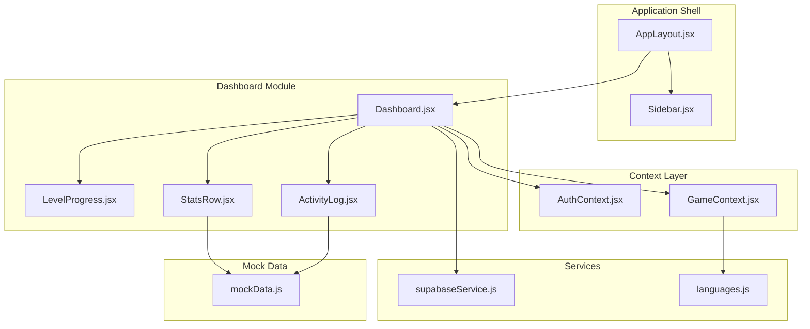
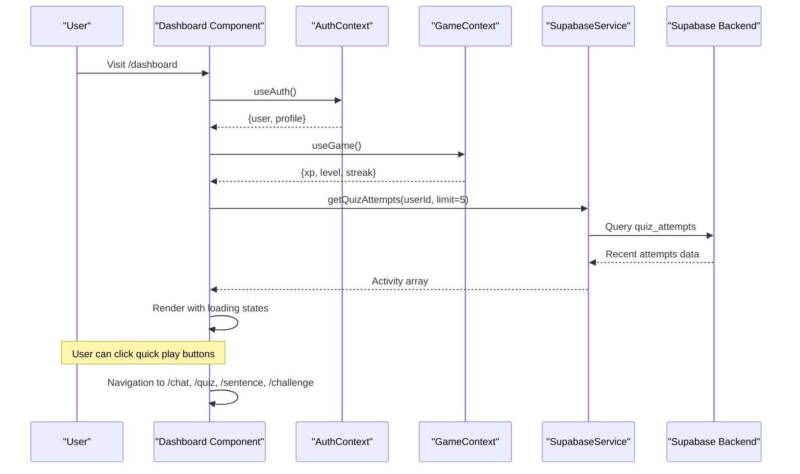
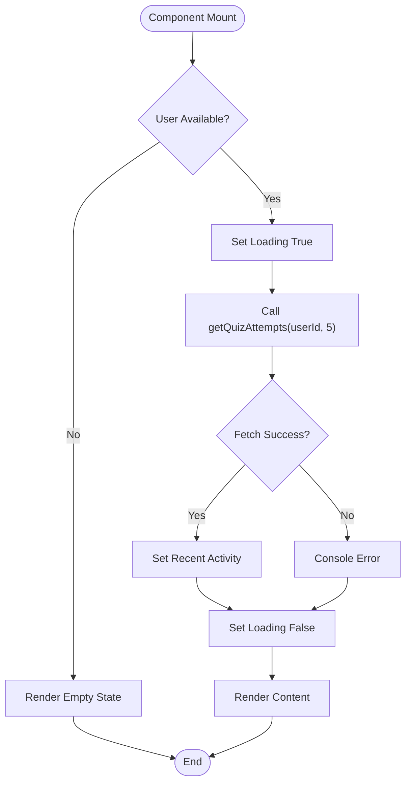
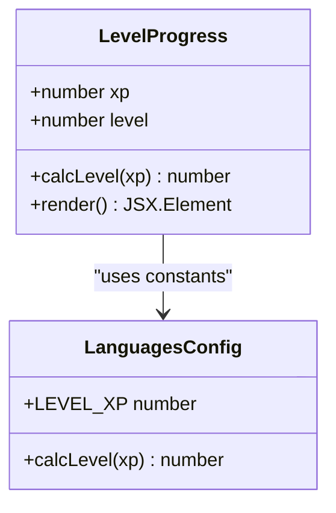
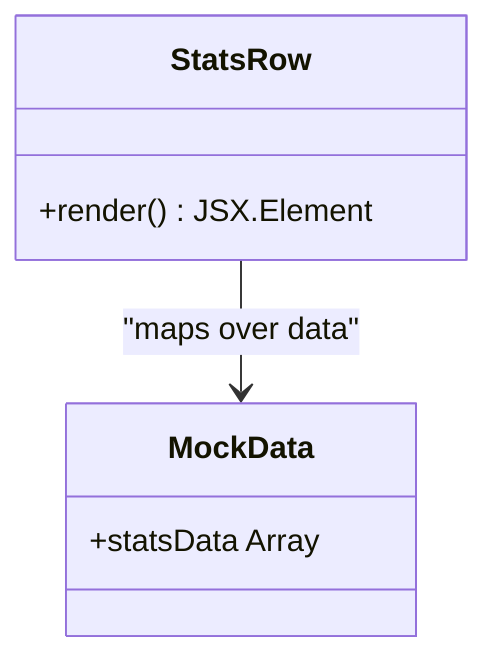
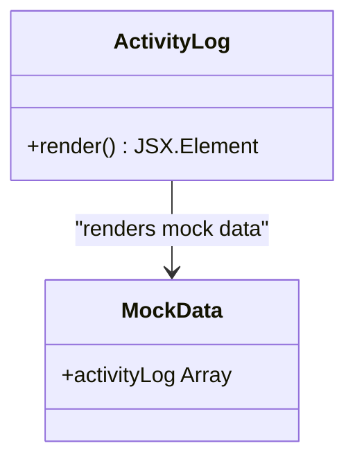
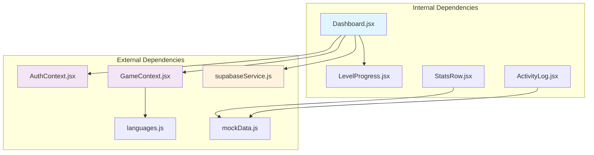

# Main Dashboard Layout

<cite>
**Referenced Files in This Document**
- [Dashboard.jsx](file://src/pages/dashboard/Dashboard.jsx)
- [LevelProgress.jsx](file://src/components/LevelProgress.jsx)
- [StatsRow.jsx](file://src/components/StatsRow.jsx)
- [ActivityLog.jsx](file://src/components/ActivityLog.jsx)
- [AuthContext.jsx](file://src/contexts/AuthContext.jsx)
- [GameContext.jsx](file://src/contexts/GameContext.jsx)
- [supabaseService.js](file://src/services/supabaseService.js)
- [languages.js](file://src/config/languages.js)
- [mockData.js](file://src/data/mockData.js)
- [App.jsx](file://src/App.jsx)
- [AppLayout.jsx](file://src/layouts/AppLayout.jsx)
- [Sidebar.jsx](file://src/components/Sidebar.jsx)
</cite>

## Table of Contents
1. [Introduction](#introduction)
2. [Project Structure](#project-structure)
3. [Core Components](#core-components)
4. [Architecture Overview](#architecture-overview)
5. [Detailed Component Analysis](#detailed-component-analysis)
6. [Dependency Analysis](#dependency-analysis)
7. [Performance Considerations](#performance-considerations)
8. [Troubleshooting Guide](#troubleshooting-guide)
9. [Conclusion](#conclusion)
10. [Appendices](#appendices)

## Introduction
The main dashboard layout serves as the central hub for user progress and quick actions. It presents a personalized learning summary including greeting, level progress, streak banner, quick stats cards, recent activity feed, and quick-play navigation. The dashboard integrates tightly with AuthContext and GameContext to display user profile information and XP/level/streak data, and uses Supabase services to fetch recent quiz attempts for the activity feed.

## Project Structure
The dashboard is organized within the pages/dashboard directory and integrates with shared components and contexts:

**Diagram sources**
- [AppLayout.jsx:17-41](file://src/layouts/AppLayout.jsx#L17-L41)
- [Dashboard.jsx:9-151](file://src/pages/dashboard/Dashboard.jsx#L9-L151)
- [AuthContext.jsx:6-101](file://src/contexts/AuthContext.jsx#L6-L101)
- [GameContext.jsx:57-141](file://src/contexts/GameContext.jsx#L57-L141)

**Section sources**
- [App.jsx:19-49](file://src/App.jsx#L19-L49)
- [AppLayout.jsx:17-41](file://src/layouts/AppLayout.jsx#L17-L41)

## Core Components
The dashboard consists of several key components that work together to present a cohesive user experience:

### Layout Structure
The dashboard follows a mobile-first responsive design with a vertical stack layout that adapts to larger screens:

- **Greeting Section**: Personalized welcome message with user's display name
- **Level Progress**: Visual progress bar showing current level and XP progression
- **Streak Banner**: Prominent streak counter with call-to-action button
- **Quick Stats Cards**: Four metric cards showing XP, Level, Streak, and Games played
- **Quick Play Buttons**: Grid of navigation buttons for instant game access
- **Recent Activity Feed**: Timeline of recent quiz attempts with timestamps

### Responsive Grid Implementation
The dashboard implements a mobile-first design approach using Tailwind CSS grid utilities:

- Mobile: Single column layout with 2-column grid on medium screens and larger
- Desktop: Four-column grid for optimal space utilization
- Adaptive spacing: Consistent gap sizing that scales with screen size

**Section sources**
- [Dashboard.jsx:28-151](file://src/pages/dashboard/Dashboard.jsx#L28-L151)

## Architecture Overview
The dashboard architecture demonstrates clean separation of concerns with clear data flow between components and external services:

**Diagram sources**
- [Dashboard.jsx:16-23](file://src/pages/dashboard/Dashboard.jsx#L16-L23)
- [AuthContext.jsx:86-93](file://src/contexts/AuthContext.jsx#L86-L93)
- [GameContext.jsx:125-133](file://src/contexts/GameContext.jsx#L125-L133)
- [supabaseService.js:47-58](file://src/services/supabaseService.js#L47-L58)

## Detailed Component Analysis

### Dashboard Component
The main dashboard component orchestrates all user-facing elements and manages the primary data flow:

#### Data Fetching and Loading States
The dashboard implements robust loading state management for the recent activity feed:

**Diagram sources**
- [Dashboard.jsx:16-23](file://src/pages/dashboard/Dashboard.jsx#L16-L23)
- [Dashboard.jsx:116-124](file://src/pages/dashboard/Dashboard.jsx#L116-L124)

#### Quick Play Navigation Behavior
The dashboard provides four quick-play buttons that immediately navigate users to relevant learning activities:

- **Translation Chat**: `/chat` - AI-powered translation practice
- **Vocabulary Quiz**: `/quiz` - Word recognition exercises  
- **Sentence Builder**: `/sentence` - Grammar and sentence construction
- **Daily Challenge**: `/challenge` - Structured daily learning tasks

Each button maintains consistent styling with emoji icons and responsive grid layout.

**Section sources**
- [Dashboard.jsx:81-110](file://src/pages/dashboard/Dashboard.jsx#L81-L110)

### Level Progress Component
The LevelProgress component provides a visual representation of the user's current XP and level advancement:

**Diagram sources**
- [LevelProgress.jsx:3-17](file://src/components/LevelProgress.jsx#L3-L17)
- [languages.js:27-29](file://src/config/languages.js#L27-L29)

**Section sources**
- [LevelProgress.jsx:3-17](file://src/components/LevelProgress.jsx#L3-L17)
- [languages.js:20-30](file://src/config/languages.js#L20-L30)

### Stats Row Component
The StatsRow component demonstrates a reusable pattern for displaying multiple metrics:

**Diagram sources**
- [StatsRow.jsx:3-16](file://src/components/StatsRow.jsx#L3-L16)
- [mockData.js:1-6](file://src/data/mockData.js#L1-L6)

**Section sources**
- [StatsRow.jsx:3-16](file://src/components/StatsRow.jsx#L3-L16)
- [mockData.js:1-6](file://src/data/mockData.js#L1-L6)

### Activity Log Component
The ActivityLog component showcases a consistent pattern for displaying user activity timelines:

**Diagram sources**
- [ActivityLog.jsx:3-28](file://src/components/ActivityLog.jsx#L3-L28)
- [mockData.js:16-21](file://src/data/mockData.js#L16-L21)

**Section sources**
- [ActivityLog.jsx:3-28](file://src/components/ActivityLog.jsx#L3-L28)
- [mockData.js:16-21](file://src/data/mockData.js#L16-L21)

## Dependency Analysis
The dashboard exhibits strong cohesion within the dashboard module while maintaining loose coupling with external systems:

**Diagram sources**
- [Dashboard.jsx:3-7](file://src/pages/dashboard/Dashboard.jsx#L3-L7)
- [AuthContext.jsx:1-101](file://src/contexts/AuthContext.jsx#L1-L101)
- [GameContext.jsx:1-141](file://src/contexts/GameContext.jsx#L1-L141)
- [supabaseService.js:1-132](file://src/services/supabaseService.js#L1-L132)

### Integration Patterns
The dashboard demonstrates several integration patterns:

1. **Context Integration**: Uses both AuthContext and GameContext for comprehensive user data
2. **Service Integration**: Leverages SupabaseService for data persistence and retrieval
3. **Configuration Integration**: References language configuration constants for XP calculations
4. **Mock Data Integration**: Provides fallback data for development and testing scenarios

**Section sources**
- [Dashboard.jsx:10-11](file://src/pages/dashboard/Dashboard.jsx#L10-L11)
- [Dashboard.jsx:18-21](file://src/pages/dashboard/Dashboard.jsx#L18-L21)
- [GameContext.jsx:24-34](file://src/contexts/GameContext.jsx#L24-L34)

## Performance Considerations
The dashboard implements several performance optimizations:

### Efficient Data Fetching
- **Limited Results**: Fetches only the 5 most recent quiz attempts to minimize database load
- **Conditional Loading**: Only fetches data when user context is available
- **Error Boundaries**: Implements try-catch blocks around data operations

### Rendering Optimizations
- **Minimal Re-renders**: Uses React state hooks efficiently to avoid unnecessary re-renders
- **Responsive Design**: Leverages Tailwind CSS for efficient responsive styling
- **Lazy Loading**: Activity feed uses conditional rendering for loading states

### Memory Management
- **Cleanup Functions**: Proper cleanup of event listeners and subscriptions
- **Efficient State Updates**: Batched state updates prevent excessive re-renders

## Troubleshooting Guide

### Common Issues and Solutions

#### Authentication Context Problems
**Issue**: Dashboard shows loading indefinitely
**Cause**: AuthContext not properly initialized
**Solution**: Verify AuthProvider wraps the application and Supabase client is configured correctly

#### Game Context Issues  
**Issue**: XP, level, or streak data missing
**Cause**: GameContext not receiving profile data
**Solution**: Ensure profile is loaded before dashboard renders and GameProvider is properly mounted

#### Data Fetching Failures
**Issue**: Recent activity shows empty state despite existing data
**Cause**: Supabase query errors or network issues
**Solution**: Check console for error messages and verify database connectivity

#### Navigation Problems
**Issue**: Quick play buttons don't navigate correctly
**Cause**: Incorrect route paths or navigation hook issues
**Solution**: Verify route definitions in App.jsx and correct button onClick handlers

**Section sources**
- [Dashboard.jsx:16-23](file://src/pages/dashboard/Dashboard.jsx#L16-L23)
- [AuthContext.jsx:12-30](file://src/contexts/AuthContext.jsx#L12-L30)
- [GameContext.jsx:62-73](file://src/contexts/GameContext.jsx#L62-L73)

## Conclusion
The main dashboard layout provides a comprehensive, user-centric interface that effectively communicates learning progress and enables quick navigation to learning activities. Its modular architecture, responsive design, and robust integration patterns create a scalable foundation for continued development. The implementation demonstrates best practices in React component design, context management, and data fetching strategies.

## Appendices

### Customization Guidelines

#### Adding New Metrics
To add new dashboard widgets following consistent design patterns:

1. **Create Component**: Develop a new component in the components directory
2. **Follow Pattern**: Use the established card-based layout with consistent spacing
3. **Integrate Context**: Access required data through AuthContext or GameContext
4. **Add Service Calls**: Implement data fetching through SupabaseService if needed
5. **Style Consistently**: Use the established color scheme and typography

#### Widget Placement Strategy
- **Priority Order**: Place most important metrics in the first row
- **Responsive Grid**: Maintain the 2-column grid on mobile, expand to 4-column on desktop
- **Consistent Spacing**: Use the established gap sizes (gap-3) for uniformity

#### Maintaining Design Consistency
- **Typography**: Follow the established hierarchy (font-semibold for headings, lighter weights for descriptions)
- **Color Scheme**: Use primary colors for interactive elements and base colors for backgrounds
- **Spacing**: Maintain consistent padding (p-4) and margins (mb-2, gap-3) across components