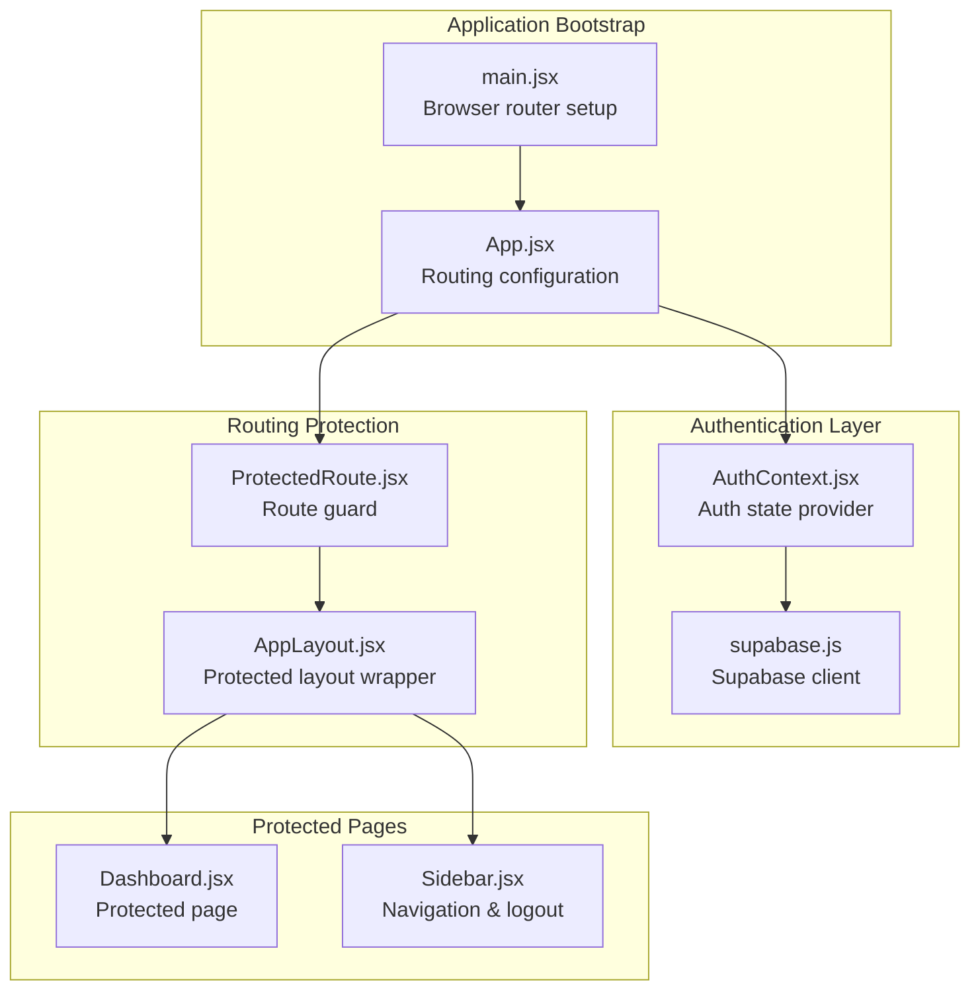
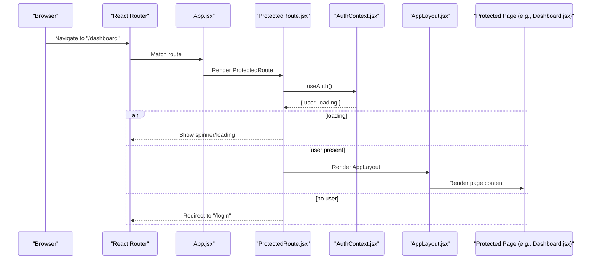
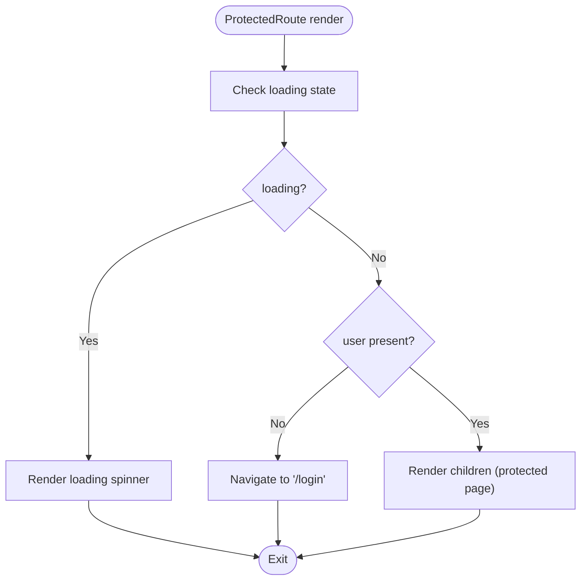
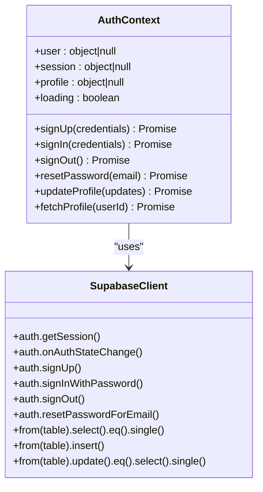
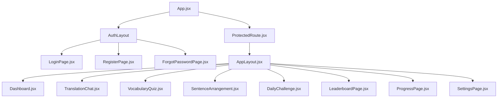
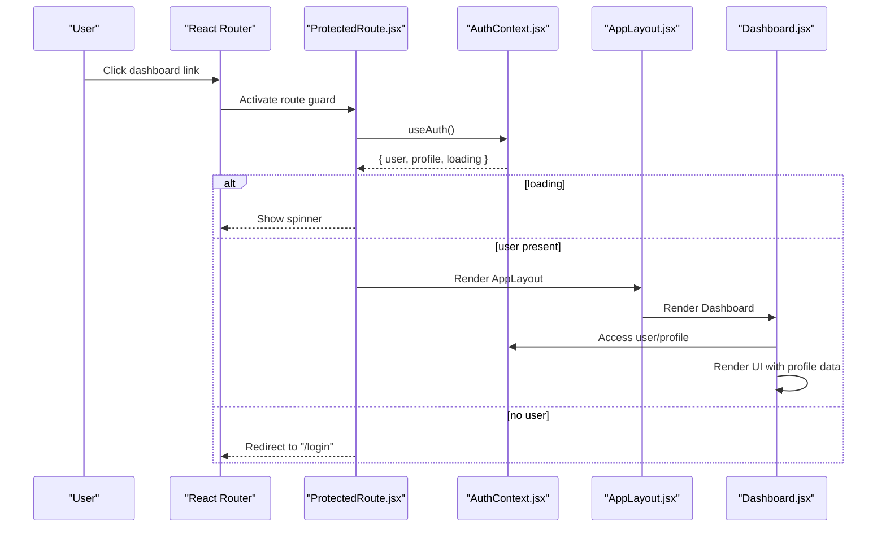
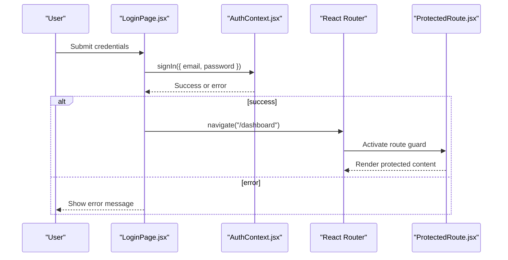
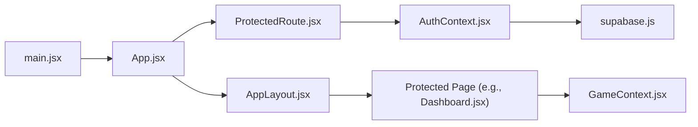

# Protected Routing System

<cite>
**Referenced Files in This Document**
- [ProtectedRoute.jsx](file://src/components/ProtectedRoute.jsx)
- [AuthContext.jsx](file://src/contexts/AuthContext.jsx)
- [App.jsx](file://src/App.jsx)
- [main.jsx](file://src/main.jsx)
- [AppLayout.jsx](file://src/layouts/AppLayout.jsx)
- [Dashboard.jsx](file://src/pages/dashboard/Dashboard.jsx)
- [LoginPage.jsx](file://src/pages/auth/LoginPage.jsx)
- [supabase.js](file://src/config/supabase.js)
- [GameContext.jsx](file://src/contexts/GameContext.jsx)
- [Sidebar.jsx](file://src/components/Sidebar.jsx)
</cite>

## Table of Contents
1. [Introduction](#introduction)
2. [Project Structure](#project-structure)
3. [Core Components](#core-components)
4. [Architecture Overview](#architecture-overview)
5. [Detailed Component Analysis](#detailed-component-analysis)
6. [Dependency Analysis](#dependency-analysis)
7. [Performance Considerations](#performance-considerations)
8. [Troubleshooting Guide](#troubleshooting-guide)
9. [Conclusion](#conclusion)

## Introduction
This document explains the protected routing system and authentication guard that secures dashboard and other protected routes in the application. It details how the ProtectedRoute component enforces authentication requirements, how authentication state is managed and checked, and how redirects occur for unauthorized access. It also covers integration with AuthContext for accessing user authentication state, the component composition pattern used to wrap protected page components, fallback behavior for unauthorized access, and edge cases such as loading states and expired sessions.

## Project Structure
The protected routing system spans several key files:
- Application bootstrap sets up routing and providers
- Authentication context manages user session and state
- ProtectedRoute enforces authentication for protected routes
- AppLayout provides the shared layout for protected pages
- Protected pages consume authentication state and render content

**Diagram sources**
- [main.jsx:1-14](file://src/main.jsx#L1-L14)
- [App.jsx:1-50](file://src/App.jsx#L1-L50)
- [AuthContext.jsx:1-101](file://src/contexts/AuthContext.jsx#L1-L101)
- [supabase.js:1-7](file://src/config/supabase.js#L1-L7)
- [ProtectedRoute.jsx:1-18](file://src/components/ProtectedRoute.jsx#L1-L18)
- [AppLayout.jsx:1-42](file://src/layouts/AppLayout.jsx#L1-L42)
- [Dashboard.jsx:1-151](file://src/pages/dashboard/Dashboard.jsx#L1-L151)
- [Sidebar.jsx:1-122](file://src/components/Sidebar.jsx#L1-L122)

**Section sources**
- [main.jsx:1-14](file://src/main.jsx#L1-L14)
- [App.jsx:1-50](file://src/App.jsx#L1-L50)

## Core Components
- ProtectedRoute: A route-level guard that checks authentication state and either renders children or redirects to the login page. It displays a spinner while authentication state is loading.
- AuthContext: Provides authentication state (user, session, profile, loading) and exposes sign-in/sign-up/sign-out/reset-password/update-profile functions. It initializes session state and subscribes to Supabase auth state changes.
- AppLayout: Wraps protected pages with shared UI and outlet rendering for nested routes.
- App: Declares protected routes under ProtectedRoute and defines public auth routes.

Key responsibilities:
- Authentication state initialization and persistence
- Real-time auth state updates via Supabase
- Route protection and redirect logic
- Layout composition for protected pages

**Section sources**
- [ProtectedRoute.jsx:1-18](file://src/components/ProtectedRoute.jsx#L1-L18)
- [AuthContext.jsx:1-101](file://src/contexts/AuthContext.jsx#L1-L101)
- [AppLayout.jsx:1-42](file://src/layouts/AppLayout.jsx#L1-L42)
- [App.jsx:1-50](file://src/App.jsx#L1-L50)

## Architecture Overview
The protected routing architecture follows a layered approach:
- Browser router bootstrapped in main.jsx
- App.jsx defines public and protected routes
- ProtectedRoute enforces authentication checks
- AuthContext manages user session and state
- AppLayout composes protected pages
- Protected pages consume authentication and game state

**Diagram sources**
- [main.jsx:1-14](file://src/main.jsx#L1-L14)
- [App.jsx:1-50](file://src/App.jsx#L1-L50)
- [ProtectedRoute.jsx:1-18](file://src/components/ProtectedRoute.jsx#L1-L18)
- [AuthContext.jsx:1-101](file://src/contexts/AuthContext.jsx#L1-L101)
- [AppLayout.jsx:1-42](file://src/layouts/AppLayout.jsx#L1-L42)
- [Dashboard.jsx:1-151](file://src/pages/dashboard/Dashboard.jsx#L1-L151)

## Detailed Component Analysis

### ProtectedRoute Component
ProtectedRoute is a route-level guard that:
- Reads authentication state via useAuth()
- Renders a loading spinner while authentication state is initializing
- Redirects to the login page if no user is present
- Renders children (protected page components) if authentication is confirmed

**Diagram sources**
- [ProtectedRoute.jsx:1-18](file://src/components/ProtectedRoute.jsx#L1-L18)

**Section sources**
- [ProtectedRoute.jsx:1-18](file://src/components/ProtectedRoute.jsx#L1-L18)

### AuthContext Implementation
AuthContext manages authentication state and integrates with Supabase:
- Initializes session state by fetching the current session
- Subscribes to auth state changes to keep user/session/profile synchronized
- Exposes functions for sign-up, sign-in, sign-out, password reset, and profile updates
- Fetches user profile data upon successful login
- Controls loading state until session initialization completes

**Diagram sources**
- [AuthContext.jsx:1-101](file://src/contexts/AuthContext.jsx#L1-L101)
- [supabase.js:1-7](file://src/config/supabase.js#L1-L7)

**Section sources**
- [AuthContext.jsx:1-101](file://src/contexts/AuthContext.jsx#L1-L101)
- [supabase.js:1-7](file://src/config/supabase.js#L1-L7)

### App and Protected Routes Composition
App.jsx defines:
- Public authentication routes (login, register, forgot password)
- Protected routes wrapped in ProtectedRoute with AppLayout
- Default redirect for unmatched routes

Protected routes include:
- Dashboard
- Translation Chat
- Vocabulary Quiz
- Sentence Arrangement
- Daily Challenge
- Leaderboard
- Progress
- Settings

**Diagram sources**
- [App.jsx:1-50](file://src/App.jsx#L1-L50)
- [ProtectedRoute.jsx:1-18](file://src/components/ProtectedRoute.jsx#L1-L18)
- [AppLayout.jsx:1-42](file://src/layouts/AppLayout.jsx#L1-L42)

**Section sources**
- [App.jsx:1-50](file://src/App.jsx#L1-L50)

### Protected Page Integration Example: Dashboard
Dashboard demonstrates how protected pages integrate with authentication:
- Uses AuthContext to access user and profile data
- Uses GameContext for game-related state
- Renders UI based on authenticated state and profile information
- Navigates to other protected pages

**Diagram sources**
- [ProtectedRoute.jsx:1-18](file://src/components/ProtectedRoute.jsx#L1-L18)
- [AuthContext.jsx:1-101](file://src/contexts/AuthContext.jsx#L1-L101)
- [AppLayout.jsx:1-42](file://src/layouts/AppLayout.jsx#L1-L42)
- [Dashboard.jsx:1-151](file://src/pages/dashboard/Dashboard.jsx#L1-L151)

**Section sources**
- [Dashboard.jsx:1-151](file://src/pages/dashboard/Dashboard.jsx#L1-L151)

### Authentication Flow Integration
The authentication flow integrates with protected routes:
- LoginPage uses AuthContext to sign in and navigates to dashboard on success
- Sign-out triggers AuthContext sign-out and navigates to login
- AuthContext subscribes to Supabase auth state changes to keep UI synchronized

**Diagram sources**
- [LoginPage.jsx:1-80](file://src/pages/auth/LoginPage.jsx#L1-L80)
- [AuthContext.jsx:1-101](file://src/contexts/AuthContext.jsx#L1-L101)
- [ProtectedRoute.jsx:1-18](file://src/components/ProtectedRoute.jsx#L1-L18)

**Section sources**
- [LoginPage.jsx:1-80](file://src/pages/auth/LoginPage.jsx#L1-L80)
- [AuthContext.jsx:1-101](file://src/contexts/AuthContext.jsx#L1-L101)

## Dependency Analysis
The protected routing system exhibits clear separation of concerns:
- ProtectedRoute depends on AuthContext for authentication state
- App.jsx orchestrates routing and wraps protected routes
- Protected pages depend on AuthContext and GameContext for state
- AuthContext depends on Supabase for session management and profile data

**Diagram sources**
- [main.jsx:1-14](file://src/main.jsx#L1-L14)
- [App.jsx:1-50](file://src/App.jsx#L1-L50)
- [ProtectedRoute.jsx:1-18](file://src/components/ProtectedRoute.jsx#L1-L18)
- [AuthContext.jsx:1-101](file://src/contexts/AuthContext.jsx#L1-L101)
- [supabase.js:1-7](file://src/config/supabase.js#L1-L7)
- [AppLayout.jsx:1-42](file://src/layouts/AppLayout.jsx#L1-L42)
- [Dashboard.jsx:1-151](file://src/pages/dashboard/Dashboard.jsx#L1-L151)
- [GameContext.jsx:1-141](file://src/contexts/GameContext.jsx#L1-L141)

**Section sources**
- [App.jsx:1-50](file://src/App.jsx#L1-L50)
- [AuthContext.jsx:1-101](file://src/contexts/AuthContext.jsx#L1-L101)

## Performance Considerations
- Initial session loading: AuthContext initializes session state asynchronously; ProtectedRoute renders a spinner while loading to avoid flickering and inconsistent UI.
- Real-time auth updates: AuthContext subscribes to Supabase auth state changes, ensuring immediate UI updates without manual polling.
- Profile fetching: Profile data is fetched once user session is established, minimizing redundant network requests.
- Layout composition: AppLayout uses Outlet to render nested routes efficiently without unnecessary re-renders.

[No sources needed since this section provides general guidance]

## Troubleshooting Guide
Common issues and resolutions:
- Unauthorized access attempts: ProtectedRoute redirects to the login page when user is absent; ensure AuthContext is properly wrapped around App and that Supabase auth state changes are subscribed.
- Loading state flicker: ProtectedRoute displays a spinner while authentication state is loading; verify that AuthContext completes session initialization before rendering protected routes.
- Expired sessions: AuthContext subscribes to Supabase auth state changes; if session expires, user becomes null and ProtectedRoute redirects to login automatically.
- Navigation after sign-out: Sign-out triggers AuthContext sign-out and navigates to login; confirm that sign-out is invoked from the UI and that navigation occurs after the operation completes.

**Section sources**
- [ProtectedRoute.jsx:1-18](file://src/components/ProtectedRoute.jsx#L1-L18)
- [AuthContext.jsx:1-101](file://src/contexts/AuthContext.jsx#L1-L101)
- [Sidebar.jsx:1-122](file://src/components/Sidebar.jsx#L1-L122)

## Conclusion
The protected routing system leverages a clean separation of concerns:
- ProtectedRoute enforces authentication at the route level
- AuthContext centralizes authentication state and integrates with Supabase
- AppLayout composes protected pages with shared UI
- Protected pages consume authentication and game state seamlessly

This design ensures robust authentication enforcement, responsive UX during loading, and straightforward integration for additional protected routes. Developers can extend the system by adding new protected routes under ProtectedRoute and leveraging AuthContext for authentication state and user session management.