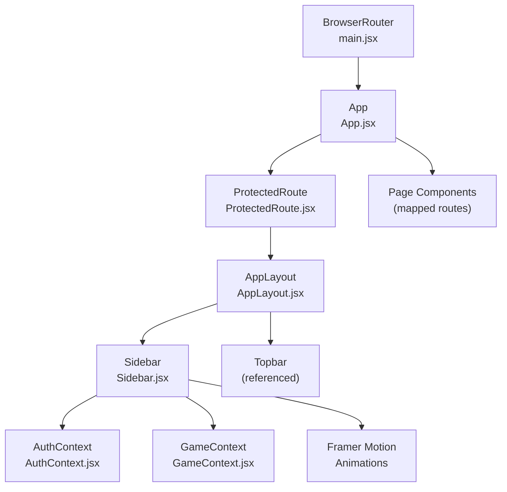
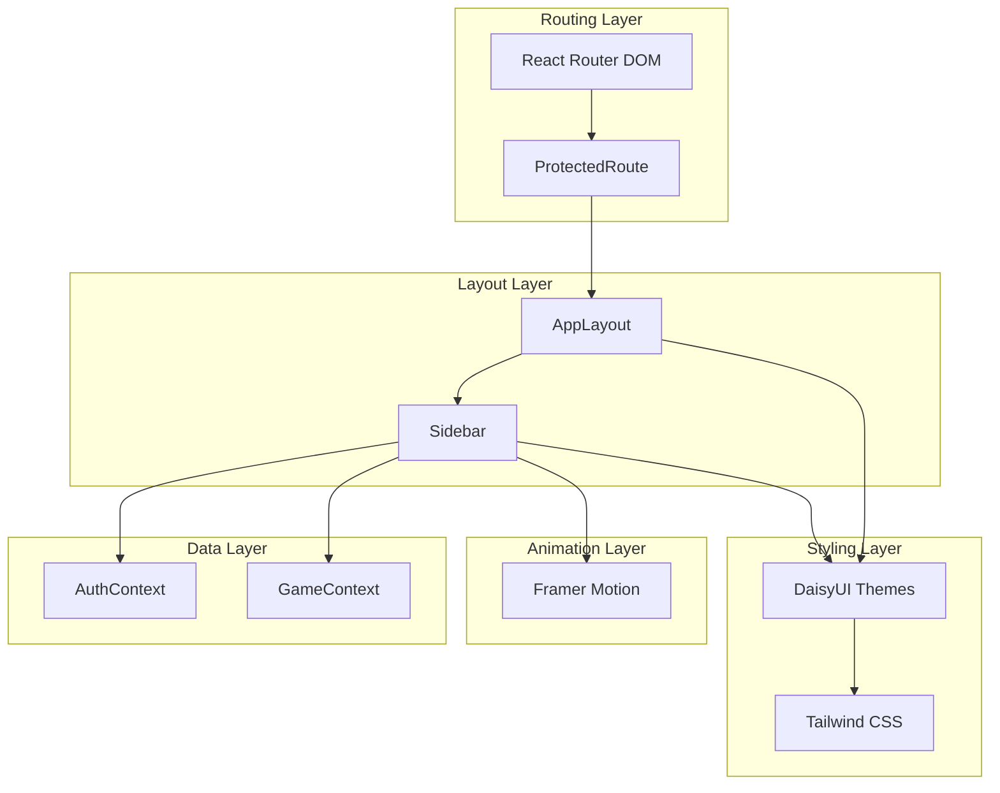
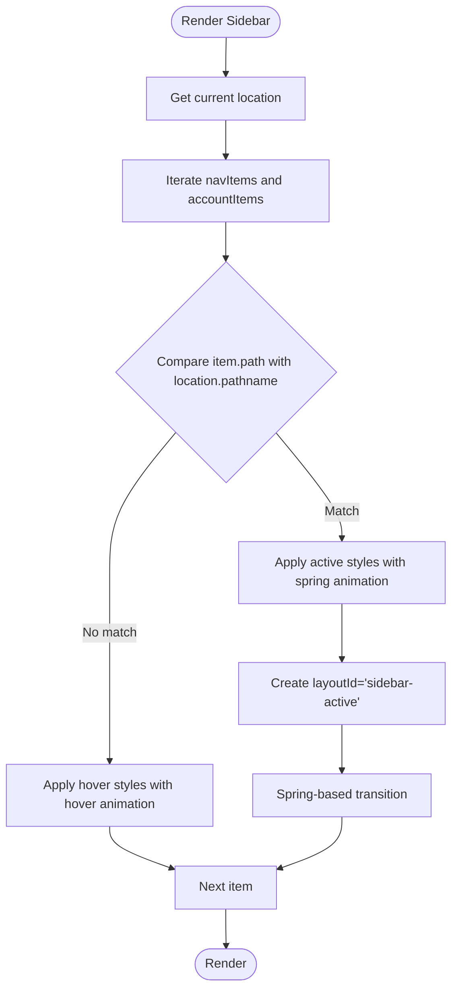
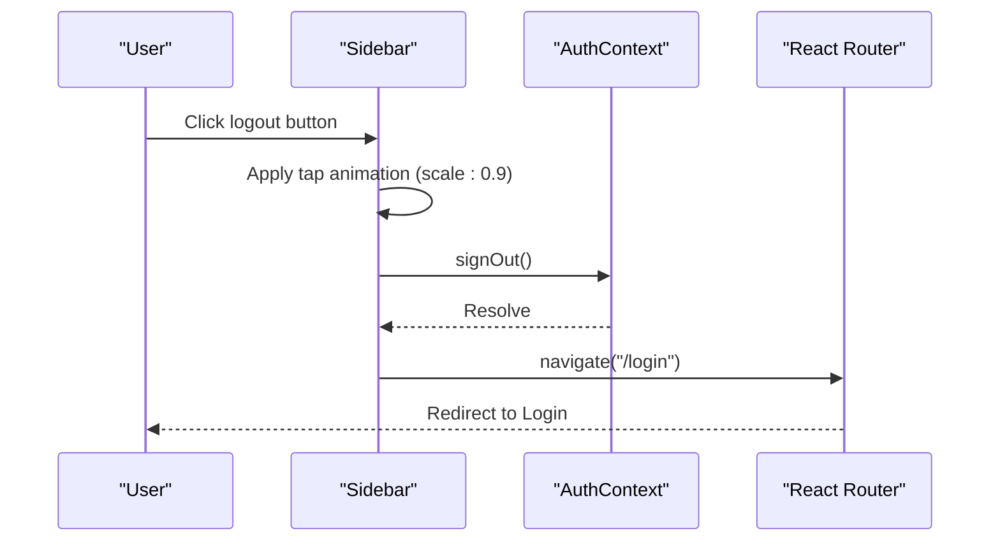
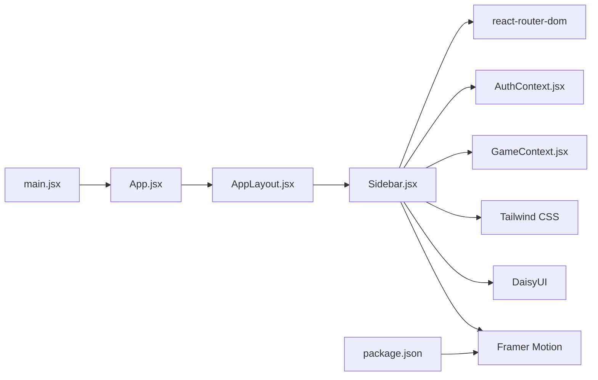

# Sidebar Navigation

<cite>
**Referenced Files in This Document**
- [Sidebar.jsx](file://src/components/Sidebar.jsx)
- [AppLayout.jsx](file://src/layouts/AppLayout.jsx)
- [App.jsx](file://src/App.jsx)
- [main.jsx](file://src/main.jsx)
- [AuthContext.jsx](file://src/contexts/AuthContext.jsx)
- [GameContext.jsx](file://src/contexts/GameContext.jsx)
- [ProtectedRoute.jsx](file://src/components/ProtectedRoute.jsx)
- [tailwind.config.js](file://tailwind.config.js)
- [index.css](file://src/index.css)
- [package.json](file://package.json)
</cite>

## Update Summary
**Changes Made**
- Enhanced Sidebar component with extensive Framer Motion animations
- Improved hover effects and visual feedback for active navigation items
- Added spring-based layout animations for active state transitions
- Implemented staggered entrance animations for menu items
- Enhanced interactive feedback with tap and hover animations
- Integrated authentication state with improved user profile display

## Table of Contents
1. [Introduction](#introduction)
2. [Project Structure](#project-structure)
3. [Core Components](#core-components)
4. [Architecture Overview](#architecture-overview)
5. [Detailed Component Analysis](#detailed-component-analysis)
6. [Animation System](#animation-system)
7. [Dependency Analysis](#dependency-analysis)
8. [Performance Considerations](#performance-considerations)
9. [Troubleshooting Guide](#troubleshooting-guide)
10. [Conclusion](#conclusion)

## Introduction
This document provides comprehensive guidance for the sidebar navigation component used for persistent navigation across the application. The sidebar now features sophisticated animations powered by Framer Motion, providing enhanced user experience with smooth transitions, interactive feedback, and polished visual effects. It explains the sidebar's role, menu structure, routing integration with React Router, responsive behavior, user profile display, logout functionality, styling via Tailwind CSS and DaisyUI, and accessibility considerations.

## Project Structure
The sidebar is integrated into the application layout and participates in routing and theming. The key files involved are:
- Sidebar component: defines the menu, user area, and theme toggle with advanced animations
- AppLayout: wraps the sidebar and topbar, manages theme persistence, and renders routed content
- App: declares protected routes and maps paths to page components
- main.jsx: sets up the routing provider
- Contexts: AuthContext and GameContext supply user and progress data used by the sidebar
- Tailwind and DaisyUI configuration: define theme variants and styling tokens
- Framer Motion: provides animation capabilities for enhanced user experience



**Diagram sources**
- [main.jsx:1-14](file://src/main.jsx#L1-L14)
- [App.jsx:1-50](file://src/App.jsx#L1-L50)
- [ProtectedRoute.jsx:1-18](file://src/components/ProtectedRoute.jsx#L1-L18)
- [AppLayout.jsx:1-42](file://src/layouts/AppLayout.jsx#L1-L42)
- [Sidebar.jsx:1-130](file://src/components/Sidebar.jsx#L1-L130)
- [AuthContext.jsx:1-193](file://src/contexts/AuthContext.jsx#L1-L193)
- [GameContext.jsx:1-145](file://src/contexts/GameContext.jsx#L1-L145)
- [package.json:14](file://package.json#L14)

**Section sources**
- [main.jsx:1-14](file://src/main.jsx#L1-L14)
- [App.jsx:1-50](file://src/App.jsx#L1-L50)
- [AppLayout.jsx:1-42](file://src/layouts/AppLayout.jsx#L1-L42)
- [Sidebar.jsx:1-130](file://src/components/Sidebar.jsx#L1-L130)

## Core Components
- **Sidebar**: Renders the logo with animated rotating indicator, two navigation sections (Menu and Account), theme toggle, user profile, and logout button. Features extensive Framer Motion animations including staggered entrances, hover effects, tap animations, and spring-based active state transitions. Computes active state based on the current route and displays user initials and level metadata.
- **AppLayout**: Provides theme switching, persists theme preference, and composes the layout with the sidebar and topbar while rendering the outlet for routed content.
- **Routing**: ProtectedRoute ensures only authenticated users can access the AppLayout and its nested routes. App maps routes to page components.

Key responsibilities:
- **Persistent navigation**: Sidebar remains visible during navigation to maintain context with smooth animations
- **Enhanced active link highlighting**: Uses Framer Motion layoutId for smooth transitions between active states
- **Interactive feedback**: Hover animations (whileHover), tap animations (whileTap), and staggered entrance animations
- **User profile display**: Shows initials, display name, level number, and level title derived from progress context
- **Logout**: Calls signOut from AuthContext and navigates to the login page
- **Theming**: Integrates DaisyUI themes and a custom theme pair (light/dark) with local storage persistence

**Section sources**
- [Sidebar.jsx:19-130](file://src/components/Sidebar.jsx#L19-L130)
- [AppLayout.jsx:17-41](file://src/layouts/AppLayout.jsx#L17-L41)
- [App.jsx:19-50](file://src/App.jsx#L19-L50)
- [ProtectedRoute.jsx:4-17](file://src/components/ProtectedRoute.jsx#L4-L17)

## Architecture Overview
The sidebar participates in a layered architecture with enhanced animation capabilities:
- **Presentation layer**: Sidebar and Topbar with Framer Motion animations
- **Layout layer**: AppLayout orchestrates theme and composition
- **Routing layer**: React Router with ProtectedRoute gating
- **Data layer**: AuthContext and GameContext for user and progress state
- **Styling layer**: Tailwind CSS and DaisyUI themes
- **Animation layer**: Framer Motion for sophisticated animations



**Diagram sources**
- [App.jsx:1-50](file://src/App.jsx#L1-L50)
- [ProtectedRoute.jsx:1-18](file://src/components/ProtectedRoute.jsx#L1-L18)
- [AppLayout.jsx:1-42](file://src/layouts/AppLayout.jsx#L1-L42)
- [Sidebar.jsx:1-130](file://src/components/Sidebar.jsx#L1-L130)
- [AuthContext.jsx:1-193](file://src/contexts/AuthContext.jsx#L1-L193)
- [GameContext.jsx:1-145](file://src/contexts/GameContext.jsx#L1-L145)
- [tailwind.config.js:1-66](file://tailwind.config.js#L1-L66)
- [package.json:14](file://package.json#L14)

## Detailed Component Analysis

### Sidebar Component
**Updated** Enhanced with comprehensive Framer Motion animations and improved interactive feedback

Responsibilities:
- Define navigation items for main features and account actions with animated transitions
- Compute active state based on current pathname with smooth layout animations
- Render user avatar, display name, and level metadata with entrance animations
- Provide theme toggle and logout handler with interactive feedback
- Integrate with DaisyUI components and Tailwind utilities

**Enhanced Animation Features**:
- **Logo Animation**: Rotating gradient indicator with continuous 360-degree rotation
- **Entrance Animations**: Staggered fade-in and slide-left effects for menu items
- **Hover Effects**: Subtle horizontal movement (x: 4px) and scaling on interaction
- **Tap Animations**: Slight compression effect (scale: 0.98) for tactile feedback
- **Active State Transitions**: Spring-based layout animations using layoutId for smooth state changes
- **Exit Animations**: Fade-out effects when navigating away from active states

Active link highlighting:
- Compares the current location pathname against each item's path
- Applies an active style with spring-based layout animations when equal
- Uses layoutId="sidebar-active" for smooth transitions between active states
- Maintains hover styles for non-active items

Navigation handling:
- Uses React Router's navigate function to change routes on click
- Ensures consistent navigation behavior across menu items with interactive feedback
- Implements tap animations for touch devices and hover animations for desktop

User profile display:
- Extracts display name fallback logic with entrance animation
- Computes level title from level value with staggered animation timing
- Renders initials avatar with gradient background and entrance animation
- Shows level metadata with fade-in animation

Logout functionality:
- Invokes signOut from AuthContext with immediate visual feedback
- Navigates to the login route after signing out
- Uses tap animations for button interaction

Styling and integration:
- Uses DaisyUI color tokens (primary, base-*), badges, avatars, and swap toggles
- Applies Tailwind utilities for spacing, typography, and scrollbars
- Responsive layout is handled by the parent AppLayout and global styles
- Gradient backgrounds for visual appeal and brand consistency

Accessibility considerations:
- Uses semantic anchor elements for menu items
- Button elements for theme toggle and logout with proper ARIA attributes
- Title attribute on logout button for tooltip-like labeling
- Enhanced focus management through interactive states
- Consider enhancing with explicit aria-current for active links and keyboard navigation support

Customization guide:
- To add a new navigation entry:
  - Add an object to navItems or accountItems with path, label, icon, and optional badge
  - Ensure the path exists in App routes
  - Menu items automatically inherit staggered animation timing
- To modify active state styling:
  - Adjust the conditional classes applied to anchors
  - Update spring animation parameters in layoutId div
- To change user display:
  - Update the display name fallback logic or avatar rendering
  - Modify animation delays for entrance effects
- To adjust theming:
  - Modify DaisyUI theme tokens in the Tailwind configuration
  - Update gradient color schemes for visual consistency

Responsive behavior:
- The sidebar width is fixed (w-56) and intended to remain visible on larger screens
- On smaller screens, AppLayout's container arrangement and Topbar adapt the interface
- Scrollbar styling is customized via Tailwind utilities
- Animations are optimized for performance across different device capabilities

**Section sources**
- [Sidebar.jsx:5-17](file://src/components/Sidebar.jsx#L5-L17)
- [Sidebar.jsx:19-34](file://src/components/Sidebar.jsx#L19-L34)
- [Sidebar.jsx:44-126](file://src/components/Sidebar.jsx#L44-L126)
- [App.jsx:31-41](file://src/App.jsx#L31-L41)
- [AppLayout.jsx:17-41](file://src/layouts/AppLayout.jsx#L17-L41)

#### Active Link Highlighting Flow


**Diagram sources**
- [Sidebar.jsx:20-21](file://src/components/Sidebar.jsx#L20-L21)
- [Sidebar.jsx:50-82](file://src/components/Sidebar.jsx#L50-L82)
- [Sidebar.jsx:67-69](file://src/components/Sidebar.jsx#L67-L69)

#### Logout Sequence


**Diagram sources**
- [Sidebar.jsx:31-34](file://src/components/Sidebar.jsx#L31-L34)
- [AuthContext.jsx:149-153](file://src/contexts/AuthContext.jsx#L149-L153)
- [App.jsx:25-29](file://src/App.jsx#L25-L29)

### AppLayout and Theming
- Persists theme preference in localStorage and applies a data-theme attribute
- Supplies theme-aware props to Sidebar and Topbar
- Manages page metadata for titles and subtitles used by Topbar

**Section sources**
- [AppLayout.jsx:17-41](file://src/layouts/AppLayout.jsx#L17-L41)
- [tailwind.config.js:20-64](file://tailwind.config.js#L20-L64)

### Routing Integration
- ProtectedRoute enforces authentication before rendering AppLayout
- App maps routes to page components; Sidebar items correspond to these paths
- BrowserRouter is initialized at the root

**Section sources**
- [ProtectedRoute.jsx:4-17](file://src/components/ProtectedRoute.jsx#L4-L17)
- [App.jsx:31-41](file://src/App.jsx#L31-L41)
- [main.jsx:7-12](file://src/main.jsx#L7-L12)

## Animation System
**New Section** The sidebar now features a comprehensive animation system powered by Framer Motion

### Animation Categories

#### Entrance Animations
- **Logo Section**: Fade-in with slide-left transition
- **Menu Items**: Staggered entrance with 0.05-second delays between items
- **Theme Toggle**: Fade-in with slight upward movement
- **User Profile**: Fade-in with upward movement (delay: 0.5s)

#### Interactive Animations
- **Hover Effects**: whileHover={{ x: 4 }} for subtle horizontal movement
- **Tap Effects**: whileTap={{ scale: 0.98 }} for tactile feedback
- **Button Interactions**: whileHover={{ scale: 1.1, rotate: -10 }} for logout button

#### Transition Animations
- **Active State**: layoutId="sidebar-active" with spring-based transitions
- **Spring Parameters**: stiffness: 350, damping: 30 for smooth, responsive feel
- **Layout Changes**: Automatic smooth transitions when switching active items

#### Continuous Animations
- **Logo Indicator**: Continuous 360-degree rotation with linear easing
- **Rotation Duration**: 10 seconds for subtle, unobtrusive animation

### Animation Implementation Details

#### Staggered Menu Items
```javascript
// Menu items use staggered delays for sequential entrance
{navItems.map((item, i) => (
  <motion.li 
    initial={{ opacity: 0, x: -20 }} 
    animate={{ opacity: 1, x: 0 }} 
    transition={{ delay: i * 0.05 }}
  >
```

#### Spring-Based Active Transitions
```javascript
// Active state uses layoutId for smooth transitions
{isActive && (
  <motion.div 
    layoutId="sidebar-active" 
    className="absolute inset-0 bg-primary/10 rounded-xl" 
    transition={{ type: "spring", stiffness: 350, damping: 30 }} 
  />
)}
```

#### Interactive Feedback
```javascript
// Anchor elements with hover and tap animations
<motion.a
  whileHover={{ x: 4 }}
  whileTap={{ scale: 0.98 }}
  className={`flex items-center gap-2.5 rounded-xl px-3 py-2.5 text-sm cursor-pointer relative overflow-hidden
    ${isActive ? "bg-primary/10 text-primary font-semibold" : "text-base-content/70 hover:bg-base-200"}`}
```

**Section sources**
- [Sidebar.jsx:38-51](file://src/components/Sidebar.jsx#L38-L51)
- [Sidebar.jsx:56-76](file://src/components/Sidebar.jsx#L56-L76)
- [Sidebar.jsx:84-101](file://src/components/Sidebar.jsx#L84-L101)
- [Sidebar.jsx:123](file://src/components/Sidebar.jsx#L123)

## Dependency Analysis
The sidebar depends on:
- React Router for location and navigation
- AuthContext for user profile and sign-out
- GameContext for level metadata
- DaisyUI and Tailwind for styling
- **Framer Motion** for advanced animations and interactive feedback



**Diagram sources**
- [Sidebar.jsx:1-4](file://src/components/Sidebar.jsx#L1-L4)
- [AuthContext.jsx:1-193](file://src/contexts/AuthContext.jsx#L1-L193)
- [GameContext.jsx:1-145](file://src/contexts/GameContext.jsx#L1-L145)
- [AppLayout.jsx:1-42](file://src/layouts/AppLayout.jsx#L1-L42)
- [App.jsx:1-50](file://src/App.jsx#L1-L50)
- [main.jsx:1-14](file://src/main.jsx#L1-L14)
- [package.json:14](file://package.json#L14)

**Section sources**
- [Sidebar.jsx:1-4](file://src/components/Sidebar.jsx#L1-L4)
- [App.jsx:31-41](file://src/App.jsx#L31-L41)
- [AppLayout.jsx:17-41](file://src/layouts/AppLayout.jsx#L17-L41)
- [package.json:14](file://package.json#L14)

## Performance Considerations
- **Animation Performance**: Framer Motion animations are hardware-accelerated and optimized for smooth 60fps performance
- **Staggered Animations**: 0.05-second delays between menu items provide visual appeal without significant performance impact
- **Spring Physics**: Spring animations use efficient physics calculations optimized by Framer Motion
- **Layout Animations**: layoutId-based transitions are highly optimized for layout changes
- **Memory Usage**: Animation state is managed efficiently and cleaned up when components unmount
- **Bundle Size**: Framer Motion adds minimal overhead with tree-shaking optimization
- **Mobile Performance**: Animations are optimized for lower-powered devices with reduced complexity

## Troubleshooting Guide
Common issues and resolutions:
- **Active link not highlighting**:
  - Verify the item path matches the current route exactly
  - Confirm the Sidebar receives the correct location from React Router
  - Check that layoutId animations are not conflicting with other elements
- **Logout does not redirect**:
  - Ensure signOut resolves successfully and navigate is called afterward
  - Confirm the login route exists in App routes
  - Verify tap animations are not interfering with click events
- **Theme toggle not persisting**:
  - Check localStorage availability and correct data-theme attribute propagation
- **Animation performance issues**:
  - Verify Framer Motion is properly installed and bundled
  - Check browser compatibility for Web Animations API
  - Ensure animations are not running unnecessarily during route transitions
- **Staggered animation timing problems**:
  - Adjust delay values in menu item animations
  - Verify animation order matches expected visual flow
- **Styling inconsistencies**:
  - Confirm DaisyUI themes are enabled and Tailwind layers are loaded
  - Verify color tokens and component classes are applied consistently
  - Check that animation classes don't conflict with Tailwind utilities

**Section sources**
- [Sidebar.jsx:50-82](file://src/components/Sidebar.jsx#L50-L82)
- [Sidebar.jsx:31-34](file://src/components/Sidebar.jsx#L31-L34)
- [App.jsx:25-29](file://src/App.jsx#L25-L29)
- [tailwind.config.js:19-64](file://tailwind.config.js#L19-L64)
- [index.css:1-14](file://src/index.css#L1-L14)

## Conclusion
The sidebar provides a robust, theme-aware, and context-driven navigation backbone for the application with significantly enhanced user experience through sophisticated Framer Motion animations. The integration with React Router enables reliable active link highlighting, while DaisyUI and Tailwind deliver consistent styling across light and dark modes. The extensive animation system provides smooth transitions, interactive feedback, and polished visual effects that enhance user engagement. By following the customization and accessibility guidance, teams can extend the sidebar with new navigation entries, maintain visual coherence, ensure inclusive user experiences, and leverage the powerful animation capabilities for creating engaging interfaces.