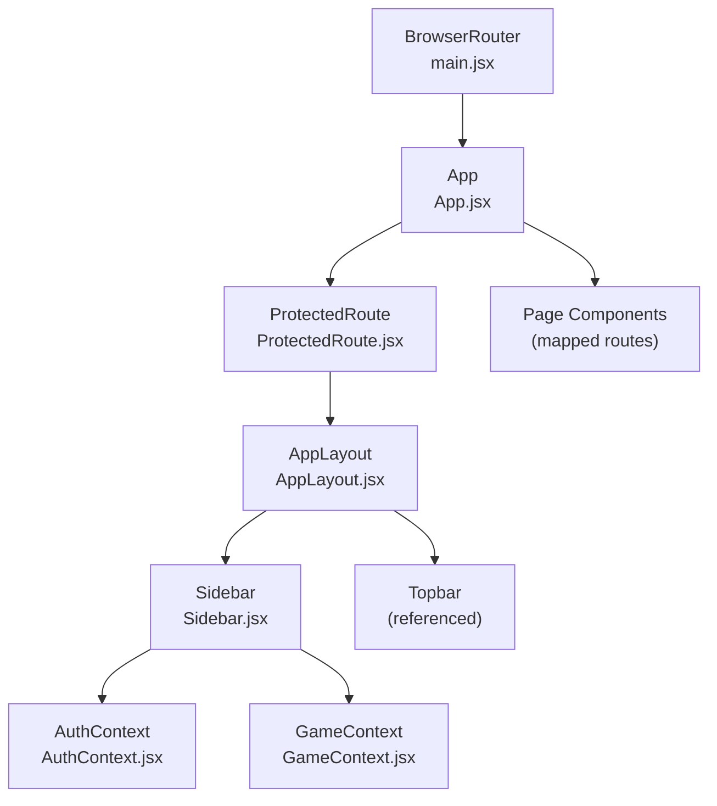
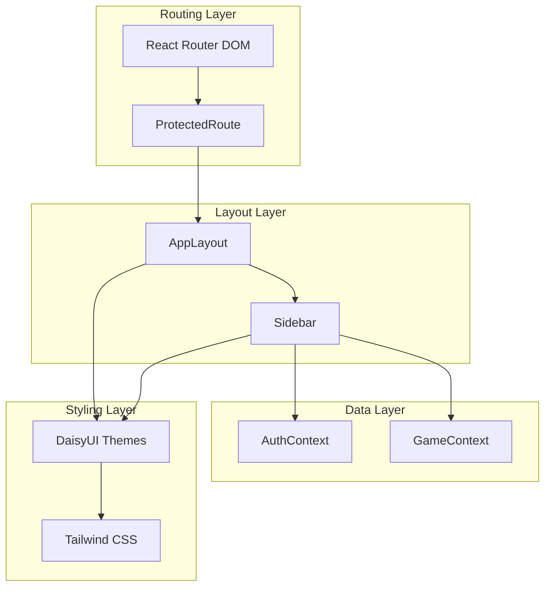
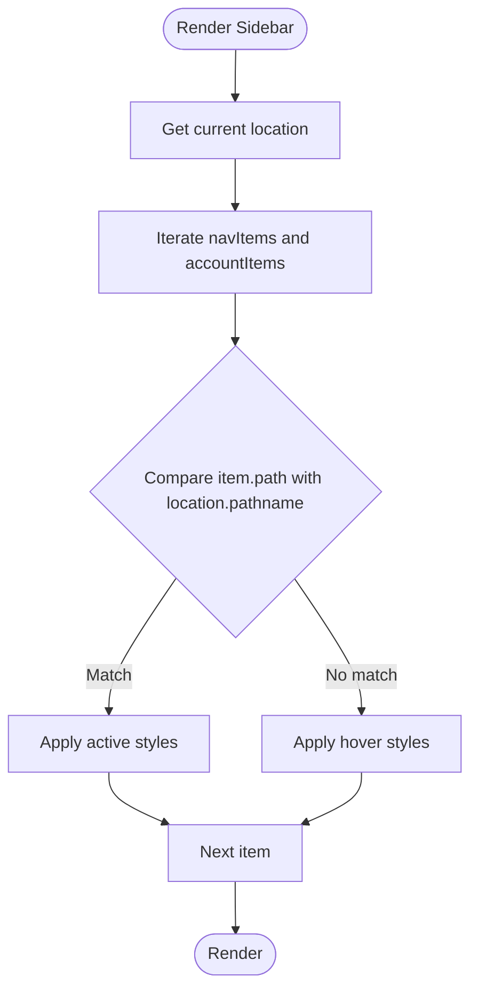
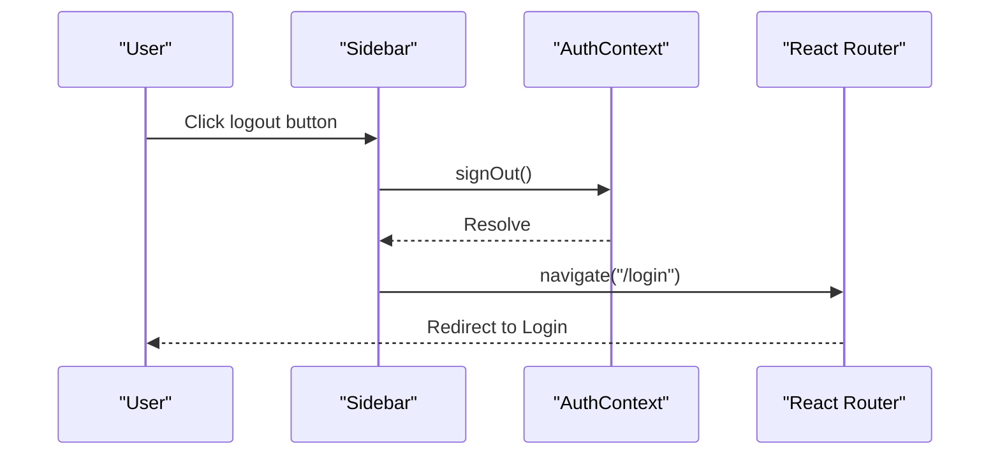
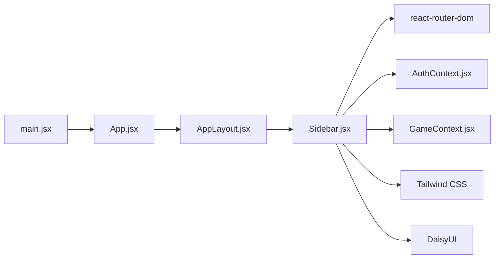

# Sidebar Navigation

<cite>
**Referenced Files in This Document**
- [Sidebar.jsx](file://src/components/Sidebar.jsx)
- [AppLayout.jsx](file://src/layouts/AppLayout.jsx)
- [App.jsx](file://src/App.jsx)
- [main.jsx](file://src/main.jsx)
- [AuthContext.jsx](file://src/contexts/AuthContext.jsx)
- [GameContext.jsx](file://src/contexts/GameContext.jsx)
- [ProtectedRoute.jsx](file://src/components/ProtectedRoute.jsx)
- [tailwind.config.js](file://tailwind.config.js)
- [index.css](file://src/index.css)
</cite>

## Table of Contents
1. [Introduction](#introduction)
2. [Project Structure](#project-structure)
3. [Core Components](#core-components)
4. [Architecture Overview](#architecture-overview)
5. [Detailed Component Analysis](#detailed-component-analysis)
6. [Dependency Analysis](#dependency-analysis)
7. [Performance Considerations](#performance-considerations)
8. [Troubleshooting Guide](#troubleshooting-guide)
9. [Conclusion](#conclusion)

## Introduction
This document provides comprehensive guidance for the sidebar navigation component used for persistent navigation across the application. It explains the sidebar’s role, menu structure, routing integration with React Router, responsive behavior, user profile display, logout functionality, styling via Tailwind CSS and DaisyUI, and accessibility considerations. It also offers practical advice for customization, adding new navigation entries, and maintaining consistent styling across screen sizes.

## Project Structure
The sidebar is integrated into the application layout and participates in routing and theming. The key files involved are:
- Sidebar component: defines the menu, user area, and theme toggle
- AppLayout: wraps the sidebar and topbar, manages theme persistence, and renders routed content
- App: declares protected routes and maps paths to page components
- main.jsx: sets up the routing provider
- Contexts: AuthContext and GameContext supply user and progress data used by the sidebar
- Tailwind and DaisyUI configuration: define theme variants and styling tokens

**Diagram sources**
- [main.jsx:1-14](file://src/main.jsx#L1-L14)
- [App.jsx:1-50](file://src/App.jsx#L1-L50)
- [ProtectedRoute.jsx:1-18](file://src/components/ProtectedRoute.jsx#L1-L18)
- [AppLayout.jsx:1-42](file://src/layouts/AppLayout.jsx#L1-L42)
- [Sidebar.jsx:1-122](file://src/components/Sidebar.jsx#L1-L122)
- [AuthContext.jsx:1-101](file://src/contexts/AuthContext.jsx#L1-L101)
- [GameContext.jsx:1-141](file://src/contexts/GameContext.jsx#L1-L141)

**Section sources**
- [main.jsx:1-14](file://src/main.jsx#L1-L14)
- [App.jsx:1-50](file://src/App.jsx#L1-L50)
- [AppLayout.jsx:1-42](file://src/layouts/AppLayout.jsx#L1-L42)
- [Sidebar.jsx:1-122](file://src/components/Sidebar.jsx#L1-L122)

## Core Components
- Sidebar: Renders the logo, two navigation sections (Menu and Account), theme toggle, user profile, and logout button. It computes active state based on the current route and displays user initials and level metadata.
- AppLayout: Provides theme switching, persists theme preference, and composes the layout with the sidebar and topbar while rendering the outlet for routed content.
- Routing: ProtectedRoute ensures only authenticated users can access the AppLayout and its nested routes. App maps routes to page components.

Key responsibilities:
- Persistent navigation: Sidebar remains visible during navigation to maintain context.
- Active link highlighting: Uses pathname equality to apply active styles.
- User profile display: Shows initials, display name, level number, and level title derived from progress context.
- Logout: Calls signOut from AuthContext and navigates to the login page.
- Theming: Integrates DaisyUI themes and a custom theme pair (light/dark) with local storage persistence.

**Section sources**
- [Sidebar.jsx:19-122](file://src/components/Sidebar.jsx#L19-L122)
- [AppLayout.jsx:17-41](file://src/layouts/AppLayout.jsx#L17-L41)
- [App.jsx:19-50](file://src/App.jsx#L19-L50)
- [ProtectedRoute.jsx:4-17](file://src/components/ProtectedRoute.jsx#L4-L17)

## Architecture Overview
The sidebar participates in a layered architecture:
- Presentation layer: Sidebar and Topbar
- Layout layer: AppLayout orchestrates theme and composition
- Routing layer: React Router with ProtectedRoute gating
- Data layer: AuthContext and GameContext for user and progress state
- Styling layer: Tailwind CSS and DaisyUI themes

**Diagram sources**
- [App.jsx:1-50](file://src/App.jsx#L1-L50)
- [ProtectedRoute.jsx:1-18](file://src/components/ProtectedRoute.jsx#L1-L18)
- [AppLayout.jsx:1-42](file://src/layouts/AppLayout.jsx#L1-L42)
- [Sidebar.jsx:1-122](file://src/components/Sidebar.jsx#L1-L122)
- [AuthContext.jsx:1-101](file://src/contexts/AuthContext.jsx#L1-L101)
- [GameContext.jsx:1-141](file://src/contexts/GameContext.jsx#L1-L141)
- [tailwind.config.js:1-66](file://tailwind.config.js#L1-L66)

## Detailed Component Analysis

### Sidebar Component
Responsibilities:
- Define navigation items for main features and account actions
- Compute active state based on current pathname
- Render user avatar, display name, and level metadata
- Provide theme toggle and logout handler
- Integrate with DaisyUI components and Tailwind utilities

Active link highlighting:
- Compares the current location pathname against each item’s path
- Applies an active style when equal; otherwise applies hover styles

Navigation handling:
- Uses React Router’s navigate function to change routes on click
- Ensures consistent navigation behavior across menu items

User profile display:
- Extracts display name fallback logic
- Computes level title from level value
- Renders initials avatar and level metadata

Logout functionality:
- Invokes signOut from AuthContext
- Navigates to the login route after signing out

Styling and integration:
- Uses DaisyUI color tokens (primary, base-*), badges, avatars, and swap toggles
- Applies Tailwind utilities for spacing, typography, and scrollbars
- Responsive layout is handled by the parent AppLayout and global styles

Accessibility considerations:
- Uses semantic anchor elements for menu items
- Button elements for theme toggle and logout
- Title attribute on logout button for tooltip-like labeling
- Consider enhancing with explicit aria-current for active links and keyboard navigation support

Customization guide:
- To add a new navigation entry:
  - Add an object to navItems or accountItems with path, label, icon, and optional badge
  - Ensure the path exists in App routes
- To modify active state styling:
  - Adjust the conditional classes applied to anchors
- To change user display:
  - Update the display name fallback logic or avatar rendering
- To adjust theming:
  - Modify DaisyUI theme tokens in the Tailwind configuration

Responsive behavior:
- The sidebar width is fixed (w-52) and intended to remain visible on larger screens
- On smaller screens, AppLayout’s container arrangement and Topbar adapt the interface
- Scrollbar styling is customized via Tailwind utilities

**Section sources**
- [Sidebar.jsx:5-17](file://src/components/Sidebar.jsx#L5-L17)
- [Sidebar.jsx:19-34](file://src/components/Sidebar.jsx#L19-L34)
- [Sidebar.jsx:44-118](file://src/components/Sidebar.jsx#L44-L118)
- [App.jsx:31-41](file://src/App.jsx#L31-L41)
- [AppLayout.jsx:17-41](file://src/layouts/AppLayout.jsx#L17-L41)

#### Active Link Highlighting Flow

**Diagram sources**
- [Sidebar.jsx:20-21](file://src/components/Sidebar.jsx#L20-L21)
- [Sidebar.jsx:50-82](file://src/components/Sidebar.jsx#L50-L82)

#### Logout Sequence

**Diagram sources**
- [Sidebar.jsx:31-34](file://src/components/Sidebar.jsx#L31-L34)
- [AuthContext.jsx:64-67](file://src/contexts/AuthContext.jsx#L64-L67)
- [App.jsx:25-29](file://src/App.jsx#L25-L29)

### AppLayout and Theming
- Persists theme preference in localStorage and applies a data-theme attribute
- Supplies theme-aware props to Sidebar and Topbar
- Manages page metadata for titles and subtitles used by Topbar

**Section sources**
- [AppLayout.jsx:17-41](file://src/layouts/AppLayout.jsx#L17-L41)
- [tailwind.config.js:20-64](file://tailwind.config.js#L20-L64)

### Routing Integration
- ProtectedRoute enforces authentication before rendering AppLayout
- App maps routes to page components; Sidebar items correspond to these paths
- BrowserRouter is initialized at the root

**Section sources**
- [ProtectedRoute.jsx:4-17](file://src/components/ProtectedRoute.jsx#L4-L17)
- [App.jsx:31-41](file://src/App.jsx#L31-L41)
- [main.jsx:7-12](file://src/main.jsx#L7-L12)

## Dependency Analysis
The sidebar depends on:
- React Router for location and navigation
- AuthContext for user profile and sign-out
- GameContext for level metadata
- DaisyUI and Tailwind for styling

**Diagram sources**
- [Sidebar.jsx:1-3](file://src/components/Sidebar.jsx#L1-L3)
- [AuthContext.jsx:1-101](file://src/contexts/AuthContext.jsx#L1-L101)
- [GameContext.jsx:1-141](file://src/contexts/GameContext.jsx#L1-L141)
- [AppLayout.jsx:1-42](file://src/layouts/AppLayout.jsx#L1-L42)
- [App.jsx:1-50](file://src/App.jsx#L1-L50)
- [main.jsx:1-14](file://src/main.jsx#L1-L14)

**Section sources**
- [Sidebar.jsx:1-3](file://src/components/Sidebar.jsx#L1-L3)
- [App.jsx:31-41](file://src/App.jsx#L31-L41)
- [AppLayout.jsx:17-41](file://src/layouts/AppLayout.jsx#L17-L41)

## Performance Considerations
- Active state computation is O(n) per render for each menu section; acceptable given small item counts
- Avoid unnecessary re-renders by keeping menu arrays static or memoized if extended
- Theme switching is lightweight and relies on CSS variables via DaisyUI
- Consider virtualizing long menus if expanded in future iterations

## Troubleshooting Guide
Common issues and resolutions:
- Active link not highlighting:
  - Verify the item path matches the current route exactly
  - Confirm the Sidebar receives the correct location from React Router
- Logout does not redirect:
  - Ensure signOut resolves successfully and navigate is called afterward
  - Confirm the login route exists in App routes
- Theme toggle not persisting:
  - Check localStorage availability and correct data-theme attribute propagation
- Styling inconsistencies:
  - Confirm DaisyUI themes are enabled and Tailwind layers are loaded
  - Verify color tokens and component classes are applied consistently

**Section sources**
- [Sidebar.jsx:50-82](file://src/components/Sidebar.jsx#L50-L82)
- [Sidebar.jsx:31-34](file://src/components/Sidebar.jsx#L31-L34)
- [App.jsx:25-29](file://src/App.jsx#L25-L29)
- [tailwind.config.js:19-64](file://tailwind.config.js#L19-L64)
- [index.css:1-14](file://src/index.css#L1-L14)

## Conclusion
The sidebar provides a robust, theme-aware, and context-driven navigation backbone for the application. Its integration with React Router enables reliable active link highlighting, while DaisyUI and Tailwind deliver consistent styling across light and dark modes. By following the customization and accessibility guidance, teams can extend the sidebar with new navigation entries, maintain visual coherence, and ensure inclusive user experiences.