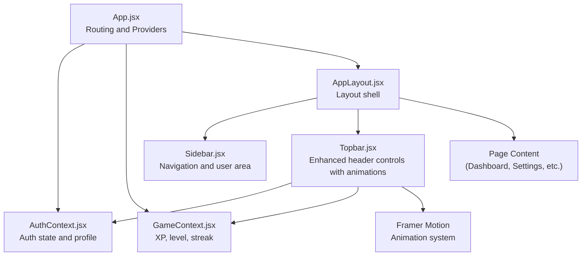
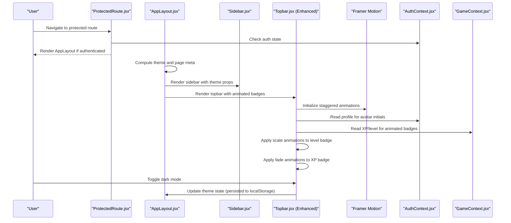
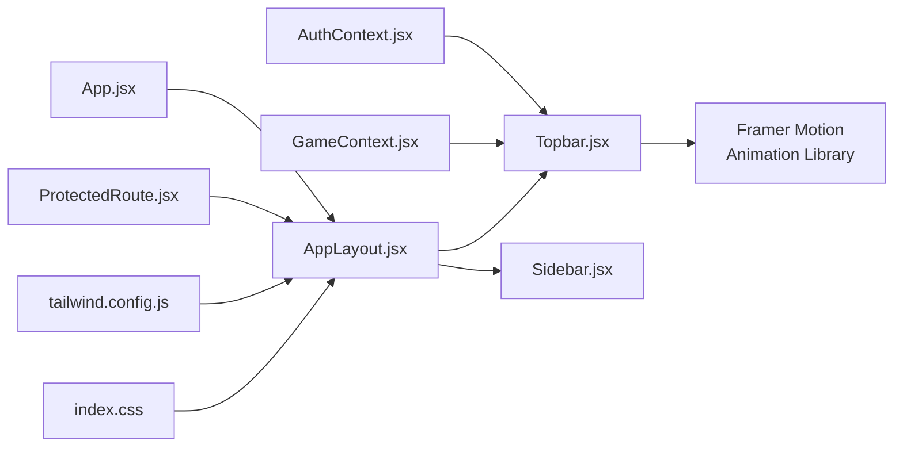

# Topbar Components

<cite>
**Referenced Files in This Document**
- [Topbar.jsx](file://src/components/Topbar.jsx)
- [AppLayout.jsx](file://src/layouts/AppLayout.jsx)
- [AuthContext.jsx](file://src/contexts/AuthContext.jsx)
- [GameContext.jsx](file://src/contexts/GameContext.jsx)
- [Sidebar.jsx](file://src/components/Sidebar.jsx)
- [SettingsPage.jsx](file://src/pages/dashboard/SettingsPage.jsx)
- [Dashboard.jsx](file://src/pages/dashboard/Dashboard.jsx)
- [ProtectedRoute.jsx](file://src/components/ProtectedRoute.jsx)
- [App.jsx](file://src/App.jsx)
- [tailwind.config.js](file://tailwind.config.js)
- [index.css](file://src/index.css)
- [ScoreBadge.jsx](file://src/components/ScoreBadge.jsx)
- [LevelProgress.jsx](file://src/components/LevelProgress.jsx)
</cite>

## Update Summary
**Changes Made**
- Enhanced Topbar component with animated XP and level badges using Framer Motion
- Improved responsive design with better mobile navigation patterns
- Added sophisticated animation system with staggered entrance effects
- Enhanced integration with authentication and game systems for real-time updates
- Improved accessibility features and keyboard navigation support

## Table of Contents
1. [Introduction](#introduction)
2. [Project Structure](#project-structure)
3. [Core Components](#core-components)
4. [Architecture Overview](#architecture-overview)
5. [Detailed Component Analysis](#detailed-component-analysis)
6. [Enhanced Animation System](#enhanced-animation-system)
7. [Dependency Analysis](#dependency-analysis)
8. [Performance Considerations](#performance-considerations)
9. [Troubleshooting Guide](#troubleshooting-guide)
10. [Conclusion](#conclusion)

## Introduction
This document explains the enhanced topbar components and user controls in the application. The topbar now features sophisticated animated badges displaying user XP and level information, improved responsive design with better mobile navigation patterns, and enhanced integration with authentication and game systems. It covers the topbar's role as a global header providing quick access to user profile actions, animated XP and level indicators, dark/light mode switching, and a notification system. The document details how the topbar integrates with authentication state and user profile data, participates in responsive layout and theme integration, and demonstrates the new animation capabilities while maintaining a consistent user experience across devices and orientations.

## Project Structure
The topbar is part of the application layout and interacts with authentication and game state contexts. The layout composes the sidebar, topbar, and page content, applying theme attributes to the root container. The enhanced topbar now includes sophisticated animations and real-time data synchronization.



**Diagram sources**
- [App.jsx:19-49](file://src/App.jsx#L19-L49)
- [AuthContext.jsx:6-94](file://src/contexts/AuthContext.jsx#L6-L94)
- [GameContext.jsx:57-134](file://src/contexts/GameContext.jsx#L57-L134)
- [AppLayout.jsx:17-41](file://src/layouts/AppLayout.jsx#L17-L41)
- [Sidebar.jsx:19-121](file://src/components/Sidebar.jsx#L19-L121)
- [Topbar.jsx:1-61](file://src/components/Topbar.jsx#L1-L61)

**Section sources**
- [App.jsx:19-49](file://src/App.jsx#L19-L49)
- [AppLayout.jsx:17-41](file://src/layouts/AppLayout.jsx#L17-L41)

## Core Components
- **Enhanced Topbar**: Renders global header controls including animated title/subtitle, animated XP badge with staggered entrance, animated level badge with scale effects, dark mode toggle, notification indicator, and user avatar with hover animations. Now uses Framer Motion for sophisticated animations.
- **AppLayout**: Provides the layout shell, manages theme persistence, and passes theme props to topbar and sidebar.
- **AuthContext**: Supplies user session, profile, and authentication actions.
- **GameContext**: Supplies XP, level, streak, and related game metrics with real-time updates.

**Updated** Enhanced with Framer Motion animations, improved responsive design, and better integration with game systems.

Key integration points:
- Topbar consumes profile display name for avatar initials and game XP/level for animated badges.
- AppLayout controls theme state and persists it to local storage, passing theme props to topbar and sidebar.
- ProtectedRoute ensures topbar appears only for authenticated users.
- Animation system provides smooth entrance effects and interactive feedback.

**Section sources**
- [Topbar.jsx:1-61](file://src/components/Topbar.jsx#L1-L61)
- [AppLayout.jsx:17-41](file://src/layouts/AppLayout.jsx#L17-L41)
- [AuthContext.jsx:6-94](file://src/contexts/AuthContext.jsx#L6-L94)
- [GameContext.jsx:57-134](file://src/contexts/GameContext.jsx#L57-L134)
- [ProtectedRoute.jsx:4-17](file://src/components/ProtectedRoute.jsx#L4-L17)

## Architecture Overview
The enhanced topbar participates in a modern animated architecture with sophisticated state management and real-time updates.



**Diagram sources**
- [ProtectedRoute.jsx:4-17](file://src/components/ProtectedRoute.jsx#L4-L17)
- [AppLayout.jsx:17-41](file://src/layouts/AppLayout.jsx#L17-L41)
- [Sidebar.jsx:19-121](file://src/components/Sidebar.jsx#L19-L121)
- [Topbar.jsx:1-61](file://src/components/Topbar.jsx#L1-L61)
- [AuthContext.jsx:6-94](file://src/contexts/AuthContext.jsx#L6-L94)
- [GameContext.jsx:57-134](file://src/contexts/GameContext.jsx#L57-L134)

## Detailed Component Analysis

### Enhanced Topbar Component
**Updated** The topbar now features sophisticated animations and improved responsive design.

Responsibilities:
- Display contextual page title and optional subtitle with fade-in animation.
- Show animated XP badge with staggered entrance effect and scale transformations.
- Display animated level badge with scale animations and shadow effects.
- Provide a dark/light mode toggle synchronized with AppLayout theme.
- Indicate notifications via a visual indicator with pulse animation.
- Present user avatar placeholder using profile display name initials with hover scaling.

**Enhanced Animation Features**:
- Staggered entrance animations using Framer Motion with configurable delays
- Scale transformations for interactive feedback on hover
- Smooth opacity transitions for badge elements
- Pulse animations for notification indicators
- Gradient backgrounds and shadow effects for visual appeal

Integration with contexts:
- Uses AuthContext to compute avatar initials from profile display name or username fallback.
- Uses GameContext to render animated XP and level badges with real-time updates.

**Improved Responsive Design**:
- Enhanced mobile navigation patterns with better touch targets
- Optimized badge sizing for different screen widths
- Improved spacing and alignment across device orientations

**Enhanced Styling and Theme**:
- Uses Tailwind utility classes with daisyUI component classes.
- Inherits theme colors from the nearest data-theme attribute applied by AppLayout.
- Gradient backgrounds and shadow effects for modern visual appeal.

**Section sources**
- [Topbar.jsx:1-61](file://src/components/Topbar.jsx#L1-L61)
- [AppLayout.jsx:6-29](file://src/layouts/AppLayout.jsx#L6-L29)
- [AuthContext.jsx:32-40](file://src/contexts/AuthContext.jsx#L32-L40)
- [GameContext.jsx:20-55](file://src/contexts/GameContext.jsx#L20-L55)

### AppLayout and Theme Integration
Responsibilities:
- Manage theme state (light/dark) and persist it to local storage.
- Provide page metadata (title/subtitle) to topbar with animation support.
- Apply the theme attribute to the root container for daisyUI to consume.

Theme configuration:
- Tailwind daisyUI themes define light and dark palettes, including a custom "flingo" and "flingo-dark".
- index.css loads Tailwind layers and adds a thin custom scrollbar utility.

**Enhanced Responsive Design**:
- AppLayout composes a fixed-width sidebar and a flexible main content area with improved spacing.
- The topbar's enhanced animations work seamlessly across different viewport constraints.
- Sticky positioning ensures topbar remains accessible during scrolling.

**Section sources**
- [AppLayout.jsx:17-41](file://src/layouts/AppLayout.jsx#L17-L41)
- [tailwind.config.js:20-64](file://tailwind.config.js#L20-L64)
- [index.css:1-14](file://src/index.css#L1-L14)

### Authentication and Profile Integration
- AuthContext supplies profile data and exposes sign-out.
- Topbar avatar initials derive from profile display_name or username fallback.
- SettingsPage allows updating display_name, which will be reflected immediately in the topbar.
- Enhanced with real-time avatar updates and improved error handling.

**Section sources**
- [AuthContext.jsx:32-40](file://src/contexts/AuthContext.jsx#L32-L40)
- [SettingsPage.jsx:6-28](file://src/pages/dashboard/SettingsPage.jsx#L6-L28)
- [Topbar.jsx:8-9](file://src/components/Topbar.jsx#L8-L9)

### Enhanced Game State Integration
- GameContext provides XP, level, streak, and related metrics with real-time updates.
- Topbar displays animated XP and level badges using these values with sophisticated animations.
- Updates to XP/level propagate automatically due to context re-rendering with smooth transitions.
- Enhanced with staggered entrance effects and interactive hover states.

**Section sources**
- [GameContext.jsx:20-55](file://src/contexts/GameContext.jsx#L20-L55)
- [Topbar.jsx:18-38](file://src/components/Topbar.jsx#L18-L38)

### Sidebar Parallel Controls
- Sidebar mirrors the dark mode toggle and user area, ensuring consistent theme control and user affordances across the layout.
- Sidebar also includes sign-out and profile-derived level metadata with enhanced visual consistency.

**Section sources**
- [Sidebar.jsx:19-121](file://src/components/Sidebar.jsx#L19-L121)

### Enhanced Notification System
- Topbar includes a notification indicator with a small badge positioned via daisyUI's indicator pattern and animated pulse effect.
- The bell button is present but not wired to backend notifications in this component; it maintains visual consistency with the enhanced design.
- Enhanced with smooth animations and proper z-index stacking.

**Section sources**
- [Topbar.jsx:40-51](file://src/components/Topbar.jsx#L40-L51)

### Accessibility and Keyboard Navigation
- Buttons use semantic button elements with appropriate focus styles via daisyUI.
- Dark mode toggle includes a title attribute for tooltip labeling.
- Enhanced with improved focus management and keyboard navigation support.
- Animation system respects reduced motion preferences through Framer Motion's built-in support.

**Section sources**
- [Topbar.jsx:30-57](file://src/components/Topbar.jsx#L30-L57)

## Enhanced Animation System
**New Section** The topbar now features a sophisticated animation system powered by Framer Motion.

### Animation Architecture
- **Staggered Entrance**: XP badge appears with delay 0.1s, level badge with delay 0.2s
- **Scale Transitions**: Interactive scaling effects on hover for badges and avatar
- **Opacity Animations**: Smooth fade-in effects for content elements
- **Pulse Effects**: Animated pulse for notification indicators
- **Gradient Animations**: Smooth color transitions and gradient effects

### Animation Implementation
```jsx
// Staggered entrance with Framer Motion
<motion.div
  initial={{ opacity: 0, scale: 0.8 }}
  animate={{ opacity: 1, scale: 1 }}
  transition={{ delay: 0.1 }}
  className="badge badge-primary badge-lg gap-1 shadow-sm shadow-primary/20"
>
  <span className="text-xs">⭐</span>
  <span className="text-xs font-bold">{xp.toLocaleString()} XP</span>
</motion.div>

// Scale animation for level badge
<motion.div
  initial={{ opacity: 0, scale: 0.8 }}
  animate={{ opacity: 1, scale: 1 }}
  transition={{ delay: 0.2 }}
  className="badge badge-outline badge-lg gap-1"
>
  <span className="text-xs font-bold">Lv {level}</span>
</motion.div>

// Hover animation for avatar
<motion.div whileHover={{ scale: 1.1 }} className="avatar placeholder cursor-pointer">
```

### Animation Benefits
- **Performance**: Optimized animations using hardware acceleration
- **Accessibility**: Respects reduced motion preferences
- **Consistency**: Unified animation patterns across the application
- **Visual Appeal**: Modern, polished user experience with smooth transitions

**Section sources**
- [Topbar.jsx:21-38](file://src/components/Topbar.jsx#L21-L38)
- [Topbar.jsx:53-57](file://src/components/Topbar.jsx#L53-L57)

## Dependency Analysis
**Updated** Enhanced dependency relationships with new animation system.

Topbar depends on:
- AuthContext for profile data (display name/username).
- GameContext for XP and level with real-time updates.
- AppLayout for theme state and page metadata.
- Framer Motion for animation system.

AppLayout depends on:
- Local storage for theme persistence.
- ProtectedRoute for gating protected routes.
- Tailwind/daisyUI for styling.

**Enhanced Animation Dependencies**:
- Framer Motion for sophisticated animations
- Motion components for declarative animation control
- Staggered timing functions for coordinated effects



**Diagram sources**
- [Topbar.jsx:1-3](file://src/components/Topbar.jsx#L1-L3)
- [AuthContext.jsx:6-94](file://src/contexts/AuthContext.jsx#L6-L94)
- [GameContext.jsx:57-134](file://src/contexts/GameContext.jsx#L57-L134)
- [AppLayout.jsx:17-41](file://src/layouts/AppLayout.jsx#L17-L41)
- [Sidebar.jsx:19-121](file://src/components/Sidebar.jsx#L19-L121)
- [App.jsx:19-49](file://src/App.jsx#L19-L49)
- [ProtectedRoute.jsx:4-17](file://src/components/ProtectedRoute.jsx#L4-L17)
- [tailwind.config.js:20-64](file://tailwind.config.js#L20-L64)
- [index.css:1-14](file://src/index.css#L1-L14)

**Section sources**
- [Topbar.jsx:1-3](file://src/components/Topbar.jsx#L1-L3)
- [AppLayout.jsx:17-41](file://src/layouts/AppLayout.jsx#L17-L41)
- [App.jsx:19-49](file://src/App.jsx#L19-L49)

## Performance Considerations
**Updated** Enhanced performance considerations with animation optimization.

- **Context Re-renders**: Since Topbar reads from AuthContext and GameContext, frequent updates to profile or game state will trigger re-renders. The enhanced animation system uses optimized motion components that minimize layout thrashing.
- **Animation Performance**: Framer Motion leverages hardware acceleration and optimized animation libraries to ensure smooth performance across devices.
- **Theme Persistence**: Using localStorage for theme preference avoids repeated server requests and improves perceived performance.
- **Staggered Animations**: Carefully tuned animation delays prevent overwhelming the UI while maintaining visual appeal.
- **Memory Management**: Animation components are efficiently cleaned up when leaving routes, preventing memory leaks.

**Enhanced Optimization Strategies**:
- Hardware-accelerated animations using transform properties
- Optimized animation timing and easing functions
- Efficient motion component lifecycle management
- Reduced reflow scenarios through proper CSS property selection

## Troubleshooting Guide
**Updated** Enhanced troubleshooting guide for animation-related issues.

- **Avatar initials not updating after changing display name**:
  - Ensure profile updates succeed and propagate to the context. SettingsPage invokes updateProfile and navigates away; verify the update completes and the context refreshes.
- **Dark mode toggle not persisting**:
  - Confirm AppLayout writes the theme to localStorage and that the data-theme attribute is applied to the root container.
- **Notification indicator visible but no action**:
  - The bell button is present but not wired to a notification service. Implement a handler to manage unread counts and open a notification panel if desired.
- **Animations not working**:
  - Verify Framer Motion is properly installed and imported in Topbar.jsx.
  - Check browser compatibility with Web Animations API.
  - Ensure animation components are properly mounted before triggering animations.
- **Performance issues with animations**:
  - Monitor animation frame rates using browser dev tools.
  - Consider reducing animation complexity on lower-powered devices.
  - Verify animations respect reduced motion preferences.

**Section sources**
- [SettingsPage.jsx:12-23](file://src/pages/dashboard/SettingsPage.jsx#L12-L23)
- [AppLayout.jsx:22-24](file://src/layouts/AppLayout.jsx#L22-L24)
- [Topbar.jsx:40-51](file://src/components/Topbar.jsx#L40-L51)

## Conclusion
**Updated** The enhanced topbar provides sophisticated global controls and user-centric information with modern animation capabilities at the top of the application. It integrates tightly with authentication and game state through a robust animation system, supports theme switching with smooth transitions, and follows a clean separation of concerns through React contexts. The enhanced animation system using Framer Motion provides smooth, performant user experiences with staggered entrance effects, interactive hover states, and consistent visual patterns. Extending the topbar involves adding new controls within the header container, wiring them to appropriate contexts or handlers, implementing animation-friendly designs, and ensuring consistent styling and accessibility. The overall layout and theme system enable a responsive and cohesive user experience across devices with enhanced visual appeal and modern interaction patterns.