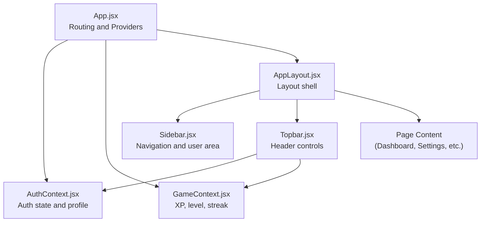
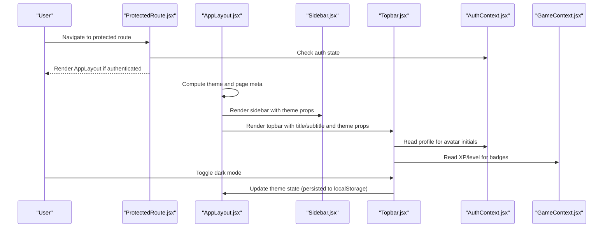
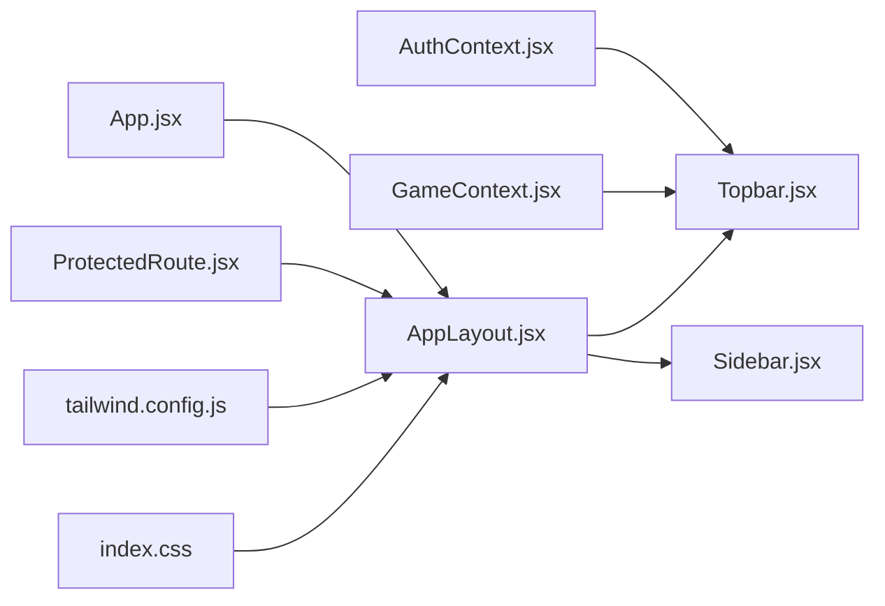

# Topbar Components

<cite>
**Referenced Files in This Document**
- [Topbar.jsx](file://src/components/Topbar.jsx)
- [AppLayout.jsx](file://src/layouts/AppLayout.jsx)
- [AuthContext.jsx](file://src/contexts/AuthContext.jsx)
- [GameContext.jsx](file://src/contexts/GameContext.jsx)
- [Sidebar.jsx](file://src/components/Sidebar.jsx)
- [SettingsPage.jsx](file://src/pages/dashboard/SettingsPage.jsx)
- [Dashboard.jsx](file://src/pages/dashboard/Dashboard.jsx)
- [ProtectedRoute.jsx](file://src/components/ProtectedRoute.jsx)
- [App.jsx](file://src/App.jsx)
- [tailwind.config.js](file://tailwind.config.js)
- [index.css](file://src/index.css)
</cite>

## Table of Contents
1. [Introduction](#introduction)
2. [Project Structure](#project-structure)
3. [Core Components](#core-components)
4. [Architecture Overview](#architecture-overview)
5. [Detailed Component Analysis](#detailed-component-analysis)
6. [Dependency Analysis](#dependency-analysis)
7. [Performance Considerations](#performance-considerations)
8. [Troubleshooting Guide](#troubleshooting-guide)
9. [Conclusion](#conclusion)

## Introduction
This document explains the topbar components and user controls in the application. It covers the topbar’s role as a global header providing quick access to user profile actions, XP and level indicators, dark/light mode switching, and a notification indicator. It documents how the topbar integrates with authentication state and user profile data, how it participates in responsive layout and theme integration, and how to extend it with new controls while maintaining a consistent user experience across devices and orientations.

## Project Structure
The topbar is part of the application layout and interacts with authentication and game state contexts. The layout composes the sidebar, topbar, and page content, and applies theme attributes to the root container.

**Diagram sources**
- [App.jsx:19-49](file://src/App.jsx#L19-L49)
- [AuthContext.jsx:6-94](file://src/contexts/AuthContext.jsx#L6-L94)
- [GameContext.jsx:57-134](file://src/contexts/GameContext.jsx#L57-L134)
- [AppLayout.jsx:17-41](file://src/layouts/AppLayout.jsx#L17-L41)
- [Sidebar.jsx:19-121](file://src/components/Sidebar.jsx#L19-L121)
- [Topbar.jsx:4-56](file://src/components/Topbar.jsx#L4-L56)

**Section sources**
- [App.jsx:19-49](file://src/App.jsx#L19-L49)
- [AppLayout.jsx:17-41](file://src/layouts/AppLayout.jsx#L17-L41)

## Core Components
- Topbar: Renders global header controls including title/subtitle, XP badge, level badge, dark mode toggle, notification indicator, and user avatar. It reads profile and game state via React contexts.
- AppLayout: Provides the layout shell, manages theme persistence, and passes theme props to topbar and sidebar.
- AuthContext: Supplies user session, profile, and authentication actions.
- GameContext: Supplies XP, level, streak, and related game metrics.

Key integration points:
- Topbar consumes profile display name for avatar initials and game XP/level for badges.
- AppLayout controls theme state and persists it to local storage, passing theme props to topbar and sidebar.
- ProtectedRoute ensures topbar appears only for authenticated users.

**Section sources**
- [Topbar.jsx:4-56](file://src/components/Topbar.jsx#L4-L56)
- [AppLayout.jsx:17-41](file://src/layouts/AppLayout.jsx#L17-L41)
- [AuthContext.jsx:6-94](file://src/contexts/AuthContext.jsx#L6-L94)
- [GameContext.jsx:57-134](file://src/contexts/GameContext.jsx#L57-L134)
- [ProtectedRoute.jsx:4-17](file://src/components/ProtectedRoute.jsx#L4-L17)

## Architecture Overview
The topbar participates in a layered architecture:
- Presentation layer: Topbar renders UI elements.
- State layer: AuthContext and GameContext provide reactive data.
- Layout layer: AppLayout orchestrates theme and routing.
- Routing layer: ProtectedRoute gates protected routes.

**Diagram sources**
- [ProtectedRoute.jsx:4-17](file://src/components/ProtectedRoute.jsx#L4-L17)
- [AppLayout.jsx:17-41](file://src/layouts/AppLayout.jsx#L17-L41)
- [Sidebar.jsx:19-121](file://src/components/Sidebar.jsx#L19-L121)
- [Topbar.jsx:4-56](file://src/components/Topbar.jsx#L4-L56)
- [AuthContext.jsx:6-94](file://src/contexts/AuthContext.jsx#L6-L94)
- [GameContext.jsx:57-134](file://src/contexts/GameContext.jsx#L57-L134)

## Detailed Component Analysis

### Topbar Component
Responsibilities:
- Display contextual page title and optional subtitle.
- Show XP and level badges derived from game state.
- Provide a dark/light mode toggle synchronized with AppLayout theme.
- Indicate notifications via a visual indicator.
- Present user avatar placeholder using profile display name initials.

Integration with contexts:
- Uses AuthContext to compute avatar initials from profile display name or username fallback.
- Uses GameContext to render XP and level badges.

Styling and theme:
- Uses Tailwind utility classes with daisyUI component classes.
- Inherits theme colors from the nearest data-theme attribute applied by AppLayout.

Accessibility and keyboard navigation:
- Buttons use semantic button elements with appropriate focus styles via daisyUI.
- Dark mode toggle includes a title attribute for tooltip labeling.

Responsive behavior:
- The topbar is horizontally compact and relies on flex layout; it does not include explicit mobile-specific toggles in this component. The overall AppLayout applies a sticky top offset and responsive layout elsewhere in the shell.

Customization guidance:
- To add a new control, insert a new button or indicator inside the header container and wire it to the appropriate context or handler.
- To modify appearance, adjust Tailwind classes or extend the theme configuration.

Examples of integration:
- Title/subtitle come from AppLayout’s page metadata mapping.
- Dark mode toggle updates AppLayout’s theme state and persists it to local storage.
- Avatar initials reflect the latest profile display name after updates.

**Section sources**
- [Topbar.jsx:4-56](file://src/components/Topbar.jsx#L4-L56)
- [AppLayout.jsx:6-29](file://src/layouts/AppLayout.jsx#L6-L29)
- [AuthContext.jsx:32-40](file://src/contexts/AuthContext.jsx#L32-L40)
- [GameContext.jsx:20-55](file://src/contexts/GameContext.jsx#L20-L55)

### AppLayout and Theme Integration
Responsibilities:
- Manage theme state (light/dark) and persist it to local storage.
- Provide page metadata (title/subtitle) to topbar.
- Apply the theme attribute to the root container for daisyUI to consume.

Theme configuration:
- Tailwind daisyUI themes define light and dark palettes, including a custom “flingo” and “flingo-dark”.
- index.css loads Tailwind layers and adds a thin custom scrollbar utility.

Responsive design:
- AppLayout composes a fixed-width sidebar and a flexible main content area. While the topbar itself is compact, the overall layout adapts to viewport constraints through flexbox and spacing utilities.

**Section sources**
- [AppLayout.jsx:17-41](file://src/layouts/AppLayout.jsx#L17-L41)
- [tailwind.config.js:20-64](file://tailwind.config.js#L20-L64)
- [index.css:1-14](file://src/index.css#L1-L14)

### Authentication and Profile Integration
- AuthContext supplies profile data and exposes sign-out.
- Topbar avatar initials derive from profile display_name or username fallback.
- SettingsPage allows updating display_name, which will be reflected immediately in the topbar.

**Section sources**
- [AuthContext.jsx:32-40](file://src/contexts/AuthContext.jsx#L32-L40)
- [SettingsPage.jsx:6-28](file://src/pages/dashboard/SettingsPage.jsx#L6-L28)
- [Topbar.jsx:8-9](file://src/components/Topbar.jsx#L8-L9)

### Game State Integration
- GameContext provides XP, level, streak, and related metrics.
- Topbar displays XP and level badges using these values.
- Updates to XP/level propagate automatically due to context re-rendering.

**Section sources**
- [GameContext.jsx:20-55](file://src/contexts/GameContext.jsx#L20-L55)
- [Topbar.jsx:18-27](file://src/components/Topbar.jsx#L18-L27)

### Sidebar Parallel Controls
- Sidebar mirrors the dark mode toggle and user area, ensuring consistent theme control and user affordances across the layout.
- Sidebar also includes sign-out and profile-derived level metadata.

**Section sources**
- [Sidebar.jsx:19-121](file://src/components/Sidebar.jsx#L19-L121)

### Notification System
- Topbar includes a notification indicator with a small badge positioned via daisyUI’s indicator pattern.
- The bell button is present but not wired to backend notifications in this component; it can be extended to integrate with a real-time notification service.

**Section sources**
- [Topbar.jsx:40-46](file://src/components/Topbar.jsx#L40-L46)

### Accessibility and Keyboard Navigation
- Buttons use native button elements and rely on daisyUI’s built-in focus styles.
- Dark mode toggle includes a title attribute for accessible tooltips.
- No explicit ARIA roles or keyboard shortcuts are implemented in the topbar; adding aria-labels and keyboard handlers would improve accessibility.

**Section sources**
- [Topbar.jsx:30-38](file://src/components/Topbar.jsx#L30-L38)

## Dependency Analysis
Topbar depends on:
- AuthContext for profile data (display name/username).
- GameContext for XP and level.
- AppLayout for theme state and page metadata.

AppLayout depends on:
- Local storage for theme persistence.
- ProtectedRoute for gating protected routes.
- Tailwind/daisyUI for styling.

**Diagram sources**
- [Topbar.jsx:4-6](file://src/components/Topbar.jsx#L4-L6)
- [AuthContext.jsx:6-94](file://src/contexts/AuthContext.jsx#L6-L94)
- [GameContext.jsx:57-134](file://src/contexts/GameContext.jsx#L57-L134)
- [AppLayout.jsx:17-41](file://src/layouts/AppLayout.jsx#L17-L41)
- [Sidebar.jsx:19-121](file://src/components/Sidebar.jsx#L19-L121)
- [App.jsx:19-49](file://src/App.jsx#L19-L49)
- [ProtectedRoute.jsx:4-17](file://src/components/ProtectedRoute.jsx#L4-L17)
- [tailwind.config.js:20-64](file://tailwind.config.js#L20-L64)
- [index.css:1-14](file://src/index.css#L1-L14)

**Section sources**
- [Topbar.jsx:4-6](file://src/components/Topbar.jsx#L4-L6)
- [AppLayout.jsx:17-41](file://src/layouts/AppLayout.jsx#L17-L41)
- [App.jsx:19-49](file://src/App.jsx#L19-L49)

## Performance Considerations
- Context re-renders: Since Topbar reads from AuthContext and GameContext, frequent updates to profile or game state will trigger re-renders. This is expected and generally inexpensive for a small header component.
- Theme persistence: Using localStorage for theme preference avoids repeated server requests and improves perceived performance.
- Styling: Tailwind utilities and daisyUI components are efficient; avoid introducing heavy dynamic styles in the topbar.

## Troubleshooting Guide
- Avatar initials not updating after changing display name:
  - Ensure profile updates succeed and propagate to the context. SettingsPage invokes updateProfile and navigates away; verify the update completes and the context refreshes.
- Dark mode toggle not persisting:
  - Confirm AppLayout writes the theme to localStorage and that the data-theme attribute is applied to the root container.
- Notification indicator visible but no action:
  - The bell button is present but not wired to a notification service. Implement a handler to manage unread counts and open a notification panel if desired.

**Section sources**
- [SettingsPage.jsx:12-23](file://src/pages/dashboard/SettingsPage.jsx#L12-L23)
- [AppLayout.jsx:22-24](file://src/layouts/AppLayout.jsx#L22-L24)
- [Topbar.jsx:40-46](file://src/components/Topbar.jsx#L40-L46)

## Conclusion
The topbar provides essential global controls and user-centric information at the top of the application. It integrates tightly with authentication and game state, supports theme switching, and follows a clean separation of concerns through React contexts. Extending the topbar involves adding new controls within the header container, wiring them to appropriate contexts or handlers, and ensuring consistent styling and accessibility. The overall layout and theme system enable a responsive and cohesive user experience across devices.