# Data Models and Schema

<cite>
**Referenced Files in This Document**
- [supabase-schema.sql](file://supabase-schema.sql)
- [supabase.js](file://src/config/supabase.js)
- [supabaseService.js](file://src/services/supabaseService.js)
- [AuthContext.jsx](file://src/contexts/AuthContext.jsx)
- [GameContext.jsx](file://src/contexts/GameContext.jsx)
- [languages.js](file://src/config/languages.js)
- [quizService.js](file://src/services/quizService.js)
- [translationService.js](file://src/services/translationService.js)
- [VocabularyQuiz.jsx](file://src/pages/games/VocabularyQuiz.jsx)
- [SentenceArrangement.jsx](file://src/pages/games/SentenceArrangement.jsx)
- [DailyChallenge.jsx](file://src/pages/games/DailyChallenge.jsx)
- [useGameScore.js](file://src/hooks/useGameScore.js)
</cite>

## Update Summary
**Changes Made**
- Added comprehensive documentation for the new unified game_content table
- Updated data model documentation to reflect the centralized content management approach
- Added detailed coverage of the three game types: vocabulary, sentence arrangement, and daily challenges
- Enhanced schema documentation with new game_content table structure and relationships
- Updated data flow documentation to show how the centralized content system works
- Added new sections covering the unified data model and content distribution strategy

## Table of Contents
1. [Introduction](#introduction)
2. [Project Structure](#project-structure)
3. [Core Components](#core-components)
4. [Architecture Overview](#architecture-overview)
5. [Detailed Component Analysis](#detailed-component-analysis)
6. [Dependency Analysis](#dependency-analysis)
7. [Performance Considerations](#performance-considerations)
8. [Troubleshooting Guide](#troubleshooting-guide)
9. [Conclusion](#conclusion)
10. [Appendices](#appendices)

## Introduction
This document describes the data models and schema powering Flinggo's language learning platform. The platform has evolved to use a unified database schema with a centralized game_content table that serves as the single source of truth for all game content. This approach replaces the previous fragmented model with a more scalable and maintainable system that supports vocabulary quizzes, sentence arrangement exercises, and daily translation challenges through a unified content management system.

## Project Structure
The data model is defined in the Supabase SQL script and consumed by the frontend via a dedicated service layer. The new unified schema introduces the game_content table as the central repository for all game content, with specialized tables for user profiles, progress tracking, and interaction history.

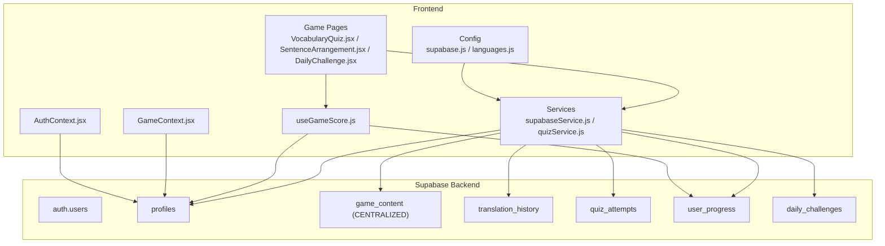

**Diagram sources**
- [supabase-schema.sql:120-170](file://supabase-schema.sql#L120-L170)
- [supabase.js:1-32](file://src/config/supabase.js#L1-L32)
- [supabaseService.js:149-210](file://src/services/supabaseService.js#L149-L210)
- [AuthContext.jsx:1-101](file://src/contexts/AuthContext.jsx#L1-L101)
- [GameContext.jsx:1-141](file://src/contexts/GameContext.jsx#L1-L141)
- [useGameScore.js:1-101](file://src/hooks/useGameScore.js#L1-L101)
- [VocabularyQuiz.jsx:1-367](file://src/pages/games/VocabularyQuiz.jsx#L1-L367)
- [SentenceArrangement.jsx:1-448](file://src/pages/games/SentenceArrangement.jsx#L1-L448)
- [DailyChallenge.jsx:1-400](file://src/pages/games/DailyChallenge.jsx#L1-L400)
- [quizService.js:1-268](file://src/services/quizService.js#L1-L268)

**Section sources**
- [supabase-schema.sql:120-170](file://supabase-schema.sql#L120-L170)
- [supabase.js:1-32](file://src/config/supabase.js#L1-L32)
- [supabaseService.js:149-210](file://src/services/supabaseService.js#L149-L210)

## Core Components
- **Profiles**: Stores user identity, display metadata, XP, level, streak, and last active date. Enforces row-level security with visibility and update policies.
- **Game Content (Centralized)**: Unified table storing all game content including vocabulary questions, sentence exercises, and daily challenges with shared fields and game-specific extensions.
- **Translation History**: Captures user translation requests and model outputs for later review.
- **Quiz Attempts**: Records quiz sessions with structured question data, answers, correctness, XP earned, and timing.
- **User Progress**: Tracks per-language/per-category scores, levels, words learned, games played, and last activity.
- **Daily Challenges**: Stores curated daily prompts with difficulty and canonical answers.

**Section sources**
- [supabase-schema.sql:4-170](file://supabase-schema.sql#L4-L170)
- [supabaseService.js:149-210](file://src/services/supabaseService.js#L149-L210)

## Architecture Overview
The frontend authenticates via Supabase Auth and interacts with Supabase tables through a typed service layer. The new unified architecture uses the game_content table as the central content repository, with specialized service functions that fetch content based on game type, language, and difficulty. Game state (XP, streak, level) is persisted to profiles and derived locally for responsiveness.

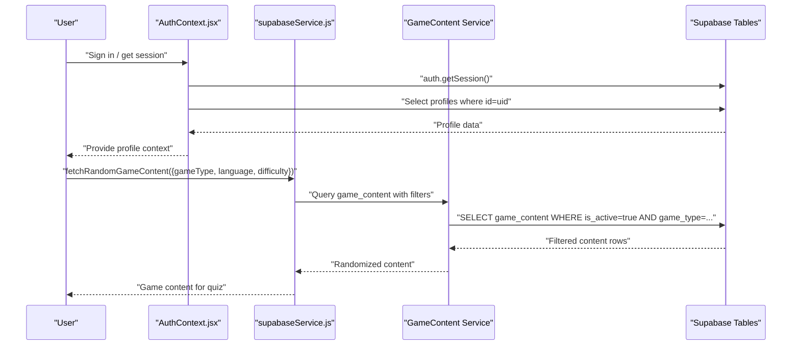

**Diagram sources**
- [AuthContext.jsx:12-40](file://src/contexts/AuthContext.jsx#L12-L40)
- [supabaseService.js:161-181](file://src/services/supabaseService.js#L161-L181)
- [supabaseService.js:187-195](file://src/services/supabaseService.js#L187-L195)

**Section sources**
- [AuthContext.jsx:1-101](file://src/contexts/AuthContext.jsx#L1-L101)
- [supabaseService.js:149-210](file://src/services/supabaseService.js#L149-L210)

## Detailed Component Analysis

### Profiles (User Identity and Stats)
- **Purpose**: Extend auth.users with application-specific attributes and stats.
- **Key fields**:
  - id: UUID, PK, references auth.users(id) with cascade delete.
  - username: Unique, not null.
  - display_name, avatar_url: Nullable.
  - current_level, total_xp, streak_days: Integers with defaults.
  - last_active_date: Date.
  - created_at: Timestamp with timezone.
- **Security**: Row-level security enabled; public select policy; update restricted to owner.
- **Access patterns**:
  - AuthContext reads profile on login and listens for auth state changes.
  - GameContext updates XP/level and streak on gameplay events.
  - Leaderboard queries top profiles by XP.

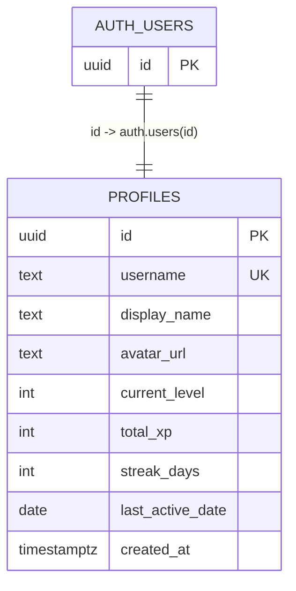

**Diagram sources**
- [supabase-schema.sql:5-18](file://supabase-schema.sql#L5-L18)
- [AuthContext.jsx:32-40](file://src/contexts/AuthContext.jsx#L32-L40)
- [GameContext.jsx:76-84](file://src/contexts/GameContext.jsx#L76-L84)

**Section sources**
- [supabase-schema.sql:4-18](file://supabase-schema.sql#L4-L18)
- [AuthContext.jsx:32-40](file://src/contexts/AuthContext.jsx#L32-L40)
- [GameContext.jsx:76-119](file://src/contexts/GameContext.jsx#L76-L119)

### Game Content (Centralized Repository)
- **Purpose**: Unified table storing all game content with shared fields and game-specific extensions.
- **Key fields**:
  - id: UUID, PK.
  - game_type: Text with enum values (vocabulary, sentence, challenge).
  - language: Target language code (es, fr, ms, id).
  - source_language: Default 'en' for translation challenges.
  - difficulty: Text with enum values (easy, medium, hard).
  - Shared fields: prompt_text, english_hint, correct_answer, explanation.
  - Vocabulary fields: options (JSONB), correct_index.
  - Sentence fields: shuffled_words (JSONB), correct_order (JSONB), grammar_tip.
  - Challenge fields: keywords (JSONB).
  - Metadata: xp_reward, time_limit_sec, is_active, timestamps.
- **Security**: Row-level security; select allowed for active content; authenticated users can insert/update.
- **Access patterns**:
  - Fetch game content by type, language, and difficulty.
  - Random selection with client-side shuffling for variety.
  - Soft-delete mechanism using is_active flag.

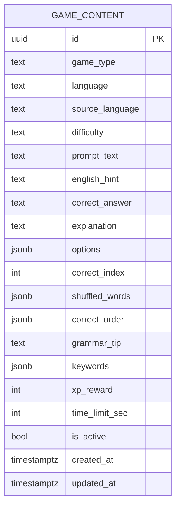

**Diagram sources**
- [supabase-schema.sql:123-154](file://supabase-schema.sql#L123-L154)
- [supabaseService.js:161-181](file://src/services/supabaseService.js#L161-L181)

**Section sources**
- [supabase-schema.sql:123-154](file://supabase-schema.sql#L123-L154)
- [supabaseService.js:161-181](file://src/services/supabaseService.js#L161-L181)

### Translation History
- **Purpose**: Store translation requests and model outputs for audit and review.
- **Key fields**:
  - id: UUID, PK.
  - user_id: UUID, FK to profiles(id) with cascade delete.
  - source_lang, target_lang: Text, not null.
  - input_text: Text, not null.
  - llama_output, gemma_output: Text.
  - selected_model: Text with default 'llama'.
  - created_at: Timestamp with timezone.
- **Security**: Row-level security; select and insert allowed only for owner.
- **Access patterns**:
  - Save translation via service insert.
  - Retrieve recent history ordered by creation time.

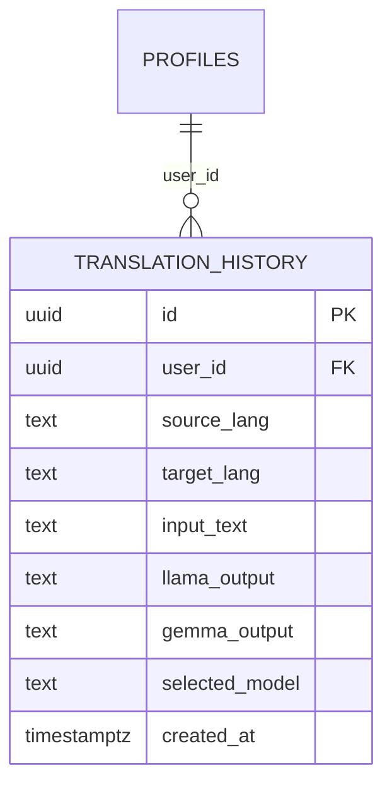

**Diagram sources**
- [supabase-schema.sql:27-46](file://supabase-schema.sql#L27-L46)
- [supabaseService.js:5-28](file://src/services/supabaseService.js#L5-L28)

**Section sources**
- [supabase-schema.sql:27-46](file://supabase-schema.sql#L27-L46)
- [supabaseService.js:5-28](file://src/services/supabaseService.js#L5-L28)

### Quiz Attempts
- **Purpose**: Persist quiz sessions with structured data for analytics and review.
- **Key fields**:
  - id: UUID, PK.
  - user_id: UUID, FK to profiles(id) with cascade delete.
  - quiz_type: Text constrained to vocabulary, sentence, challenge.
  - question_data: JSONB.
  - user_answer, correct_answer: Text.
  - is_correct: Boolean with default false.
  - xp_earned: Integer with default 0.
  - time_spent_sec: Integer with default 0.
  - created_at: Timestamp with timezone.
- **Security**: Row-level security; select and insert allowed only for owner.
- **Access patterns**:
  - Save attempt via service insert.
  - Fetch recent attempts filtered by user and optionally quiz type.

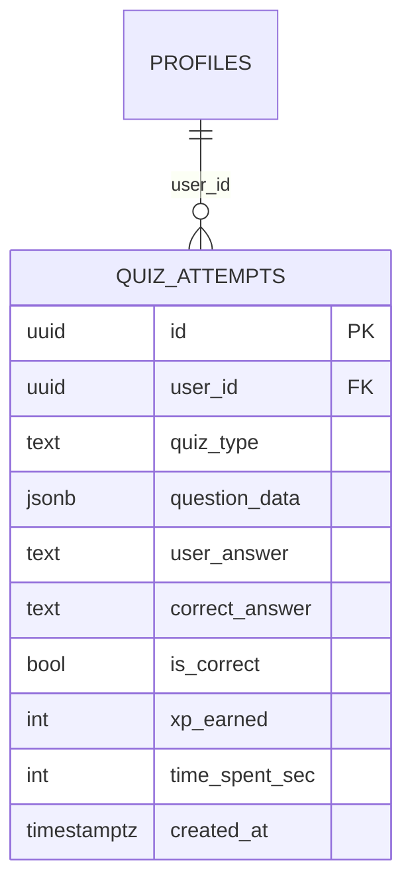

**Diagram sources**
- [supabase-schema.sql:48-68](file://supabase-schema.sql#L48-L68)
- [supabaseService.js:32-58](file://src/services/supabaseService.js#L32-L58)

**Section sources**
- [supabase-schema.sql:48-68](file://supabase-schema.sql#L48-L68)
- [supabaseService.js:32-58](file://src/services/supabaseService.js#L32-L58)

### User Progress (Per Language/Category)
- **Purpose**: Track granular learning metrics per language and category.
- **Key fields**:
  - id: UUID, PK.
  - user_id: UUID, FK to profiles(id) with cascade delete.
  - language: Text, not null.
  - category: Text with default 'general'.
  - score, level, words_learned, games_played: Integers with defaults.
  - last_played_at: Timestamp with timezone.
  - unique constraint: (user_id, language, category).
- **Security**: Row-level security; select/update allowed; upsert insert allowed for owner.
- **Access patterns**:
  - Upsert progress with conflict on user/language/category.
  - Retrieve all progress for a user.

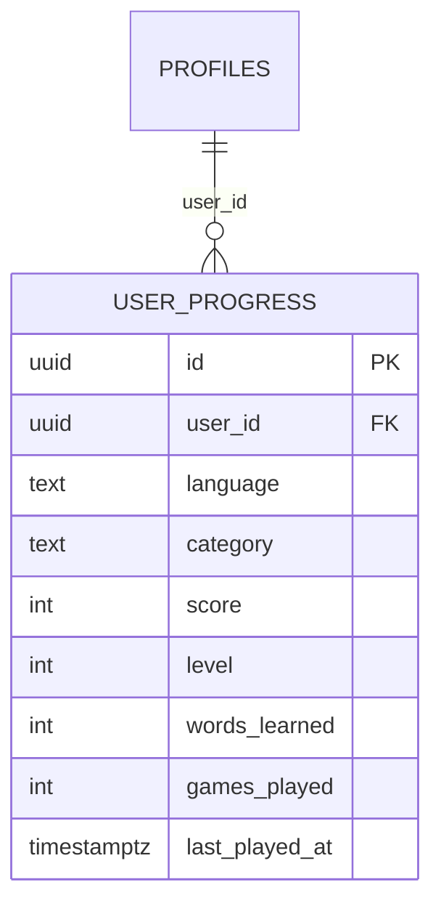

**Diagram sources**
- [supabase-schema.sql:69-92](file://supabase-schema.sql#L69-L92)
- [supabaseService.js:62-101](file://src/services/supabaseService.js#L62-L101)

**Section sources**
- [supabase-schema.sql:69-92](file://supabase-schema.sql#L69-L92)
- [supabaseService.js:62-101](file://src/services/supabaseService.js#L62-L101)

### Daily Challenges
- **Purpose**: Curated daily translation prompts with canonical answers and difficulty.
- **Key fields**:
  - id: UUID, PK.
  - date: Date, not null.
  - challenge_type: Text with default 'translation'.
  - source_lang, target_lang: Text, not null.
  - prompt_text, correct_answer: Text, not null.
  - difficulty: Text with default 'medium' and check constraint (easy, medium, hard).
  - created_at: Timestamp with timezone.
  - unique constraint: (date, difficulty).
- **Security**: Row-level security; select allowed to all; inserts managed by admin.
- **Access patterns**:
  - Fetch challenge by date.
  - Insert new daily challenge.

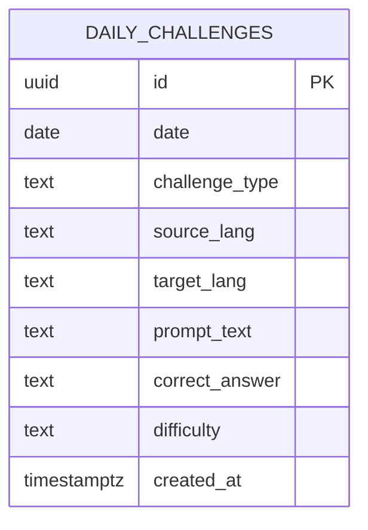

**Diagram sources**
- [supabase-schema.sql:95-111](file://supabase-schema.sql#L95-L111)
- [supabaseService.js:105-123](file://src/services/supabaseService.js#L105-L123)

**Section sources**
- [supabase-schema.sql:95-111](file://supabase-schema.sql#L95-L111)
- [supabaseService.js:105-123](file://src/services/supabaseService.js#L105-L123)

### Leaderboard Data Model
- Computed from profiles: selects id, username, display_name, avatar_url, current_level, total_xp, streak_days, orders by total_xp descending, limits results.
- Used by leaderboard page to render rankings.

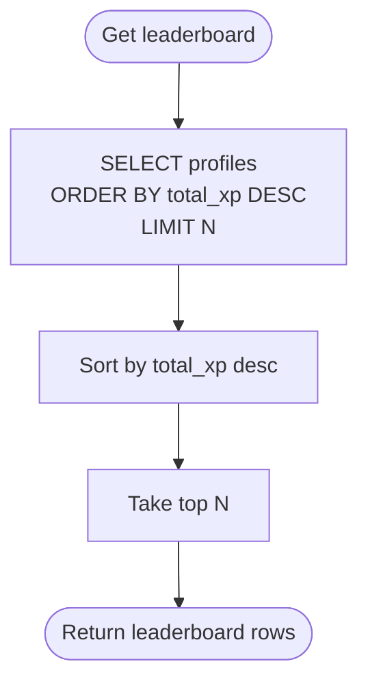

**Diagram sources**
- [supabaseService.js:127-135](file://src/services/supabaseService.js#L127-L135)
- [DailyChallenge.jsx:120-136](file://src/pages/games/DailyChallenge.jsx#L120-L136)

**Section sources**
- [supabaseService.js:127-135](file://src/services/supabaseService.js#L127-L135)
- [DailyChallenge.jsx:120-136](file://src/pages/games/DailyChallenge.jsx#L120-L136)

### Data Validation and Business Rules
- **Enum constraints**:
  - quiz_type: vocabulary, sentence, challenge.
  - game_type: vocabulary, sentence, challenge.
  - difficulty: easy, medium, hard.
  - source_language: default 'en'.
- **Defaults**:
  - Profiles: current_level=1, total_xp=0, streak_days=0.
  - Quiz attempts: is_correct=false, xp_earned=0, time_spent_sec=0.
  - Selected model: default 'llama'.
  - Game content: xp_reward=10, time_limit_sec=15, is_active=true.
- **Uniqueness**:
  - Profiles.username is unique.
  - User progress unique on (user_id, language, category).
  - Daily challenges unique on (date, difficulty).
  - Game content unique on (game_type, language, difficulty) where is_active=true.
- **Derived calculations**:
  - Level computed from XP using a constant XP-per-level threshold.
  - Streak increments when user activity crosses midnight boundary.
  - XP rewards: vocabulary=10, sentence=15, challenge=25, streak_bonus=5.

**Section sources**
- [supabase-schema.sql:51-51](file://supabase-schema.sql#L51-L51)
- [supabase-schema.sql:125-125](file://supabase-schema.sql#L125-L125)
- [supabase-schema.sql:103-103](file://supabase-schema.sql#L103-L103)
- [supabase-schema.sql:70-81](file://supabase-schema.sql#L70-L81)
- [supabase-schema.sql:95-106](file://supabase-schema.sql#L95-L106)
- [languages.js:14-30](file://src/config/languages.js#L14-L30)
- [GameContext.jsx:107-119](file://src/contexts/GameContext.jsx#L107-L119)

### Data Transformation Patterns
- **Game content transformation**:
  - Database rows transformed to game-specific structures for each component.
  - Vocabulary: prompt_text → word, options → options, correct_index → correctIndex.
  - Sentence: prompt_text → original_sentence, shuffled_words → shuffled_words, correct_order → correct_order.
  - Challenge: prompt_text → prompt_text, keywords → keywords.
- **Quiz generation pipeline**:
  - Priority: game_content table → LLM generation → hardcoded fallback.
  - Client-side randomization ensures variety across sessions.
- **Frontend aggregation**:
  - Dashboard computes recent activity from quiz attempts.
  - Progress page aggregates attempts by type and computes accuracy.
  - Leaderboard renders with user badges and initials.

**Section sources**
- [quizService.js:18-71](file://src/services/quizService.js#L18-L71)
- [quizService.js:77-134](file://src/services/quizService.js#L77-L134)
- [quizService.js:140-193](file://src/services/quizService.js#L140-L193)
- [supabaseService.js:161-195](file://src/services/supabaseService.js#L161-L195)

### Data Access Patterns Through Supabase Service Layer
- **Profiles**: fetch single profile by id; update profile fields.
- **Game Content**: fetch by game_type, language, difficulty with randomization; fetch single random challenge.
- **Translation history**: insert new translation; list recent entries.
- **Quiz attempts**: insert attempt; list recent attempts with optional filtering.
- **User progress**: fetch all progress; upsert with conflict resolution.
- **Daily challenges**: fetch by date; insert new challenge.
- **Leaderboard**: select top profiles ordered by XP.

**Section sources**
- [supabaseService.js:5-28](file://src/services/supabaseService.js#L5-L28)
- [supabaseService.js:32-58](file://src/services/supabaseService.js#L32-L58)
- [supabaseService.js:62-101](file://src/services/supabaseService.js#L62-L101)
- [supabaseService.js:105-123](file://src/services/supabaseService.js#L105-L123)
- [supabaseService.js:127-135](file://src/services/supabaseService.js#L127-L135)
- [supabaseService.js:161-195](file://src/services/supabaseService.js#L161-L195)

### Caching Strategies and Performance Considerations
- **Local state caching**:
  - AuthContext caches profile data after login and updates on auth changes.
  - GameContext maintains XP, level, streak, and recent XP gains in memory for immediate UI feedback.
  - useGameScore caches game session state during gameplay.
- **Backend indexing**:
  - Composite indexes on (user_id, created_at) for translation history and quiz attempts.
  - Separate index on user_id for progress.
  - Index on date for daily challenges.
  - Index on total_xp for leaderboard sorting.
  - New indexes on game_content: (game_type, language, difficulty, is_active) and (game_type, difficulty, is_active).
- **Query limits**:
  - Dashboard lists recent quiz attempts with small limit.
  - Leaderboard limits results to top N.
  - Game content queries limited to prevent excessive data transfer.
- **Recommendations**:
  - Add pagination for long histories.
  - Consider materialized views or scheduled aggregates for leaderboard if growth demands it.
  - Use server-side generated timestamps consistently.
  - Implement content caching for frequently accessed game types.

**Section sources**
- [AuthContext.jsx:32-40](file://src/contexts/AuthContext.jsx#L32-L40)
- [GameContext.jsx:20-54](file://src/contexts/GameContext.jsx#L20-L54)
- [useGameScore.js:88-93](file://src/hooks/useGameScore.js#L88-L93)
- [supabase-schema.sql:113-119](file://supabase-schema.sql#L113-L119)
- [supabase-schema.sql:167-169](file://supabase-schema.sql#L167-L169)
- [supabaseService.js:19-28](file://src/services/supabaseService.js#L19-L28)
- [supabaseService.js:47-58](file://src/services/supabaseService.js#L47-L58)
- [supabaseService.js:127-135](file://src/services/supabaseService.js#L127-L135)

### Data Lifecycle, Retention, and Archival
- **Current schema does not define explicit retention or archival policies**.
- **Recommended practices**:
  - Archive old translation_history and quiz_attempts periodically (e.g., older than 6–12 months) to a separate table or storage.
  - Implement soft deletion or anonymization for user-deleted accounts.
  - Schedule cleanup jobs to remove stale daily challenges after their validity period.
  - Consider archiving inactive game_content records to reduce query complexity.

### Data Security, Privacy, and Access Control
- **Row-level security**:
  - Profiles: select allowed to all; update allowed only by owner.
  - Game Content: select allowed for active content; authenticated users can insert/update.
  - Translation history: select and insert allowed only by owner.
  - Quiz attempts: select and insert allowed only by owner.
  - User progress: select/update allowed; upsert insert allowed only by owner.
  - Daily challenges: select allowed to all.
- **Authentication**:
  - Supabase Auth manages session retrieval and change subscriptions.
- **Data exposure**:
  - Leaderboard exposes minimal profile fields; consider limiting returned fields further if privacy requires.
  - Game content is filtered by is_active flag to prevent unauthorized access to inactive content.

**Section sources**
- [supabase-schema.sql:17-25](file://supabase-schema.sql#L17-L25)
- [supabase-schema.sql:156-166](file://supabase-schema.sql#L156-L166)
- [supabase-schema.sql:39-46](file://supabase-schema.sql#L39-L46)
- [supabase-schema.sql:61-68](file://supabase-schema.sql#L61-L68)
- [supabase-schema.sql:83-92](file://supabase-schema.sql#L83-L92)
- [supabase-schema.sql:108-111](file://supabase-schema.sql#L108-L111)
- [AuthContext.jsx:12-29](file://src/contexts/AuthContext.jsx#L12-L29)

### Sample Data Structures and Flows
- **User profile snapshot**:
  - Fields: id, username, display_name, avatar_url, current_level, total_xp, streak_days, last_active_date, created_at.
- **Game content entry (vocabulary)**:
  - Fields: id, game_type, language, difficulty, prompt_text, correct_answer, options, correct_index, explanation, xp_reward, time_limit_sec, is_active.
- **Game content entry (sentence)**:
  - Fields: id, game_type, language, difficulty, prompt_text, english_hint, correct_answer, shuffled_words, correct_order, grammar_tip, explanation, xp_reward, time_limit_sec, is_active.
- **Game content entry (challenge)**:
  - Fields: id, game_type, language, source_language, difficulty, prompt_text, english_hint, correct_answer, keywords, explanation, xp_reward, time_limit_sec, is_active.
- **Translation entry**:
  - Fields: id, user_id, source_lang, target_lang, input_text, llama_output, gemma_output, selected_model, created_at.
- **Quiz attempt**:
  - Fields: id, user_id, quiz_type, question_data, user_answer, correct_answer, is_correct, xp_earned, time_spent_sec, created_at.
- **Progress record**:
  - Fields: id, user_id, language, category, score, level, words_learned, games_played, last_played_at.
- **Daily challenge**:
  - Fields: id, date, challenge_type, source_lang, target_lang, prompt_text, correct_answer, difficulty, created_at.

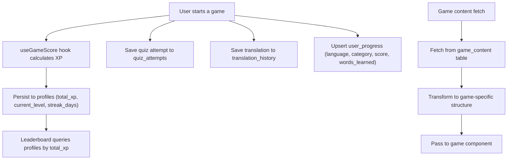

**Diagram sources**
- [GameContext.jsx:76-119](file://src/contexts/GameContext.jsx#L76-L119)
- [useGameScore.js:28-60](file://src/hooks/useGameScore.js#L28-L60)
- [supabaseService.js:32-45](file://src/services/supabaseService.js#L32-L45)
- [supabaseService.js:5-17](file://src/services/supabaseService.js#L5-L17)
- [supabaseService.js:71-101](file://src/services/supabaseService.js#L71-L101)
- [supabaseService.js:127-135](file://src/services/supabaseService.js#L127-L135)
- [supabaseService.js:161-195](file://src/services/supabaseService.js#L161-L195)

**Section sources**
- [GameContext.jsx:76-119](file://src/contexts/GameContext.jsx#L76-L119)
- [useGameScore.js:28-101](file://src/hooks/useGameScore.js#L28-L101)
- [supabaseService.js:5-101](file://src/services/supabaseService.js#L5-L101)
- [supabaseService.js:127-195](file://src/services/supabaseService.js#L127-L195)

## Dependency Analysis
- **Supabase client initialization** depends on environment variables for URL and anon key.
- **Service layer** abstracts all database operations and is used by pages and contexts.
- **Game content service** depends on the centralized game_content table and provides specialized fetch functions.
- **Contexts** depend on service layer for persistence and on configuration for constants.
- **Pages** depend on contexts and services for rendering and data fetching.
- **Quiz service** orchestrates the content fetching pipeline with priority-based fallbacks.

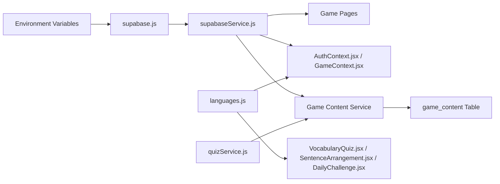

**Diagram sources**
- [supabase.js:1-32](file://src/config/supabase.js#L1-L32)
- [supabaseService.js:149-210](file://src/services/supabaseService.js#L149-L210)
- [AuthContext.jsx:1-101](file://src/contexts/AuthContext.jsx#L1-L101)
- [GameContext.jsx:1-141](file://src/contexts/GameContext.jsx#L1-L141)
- [VocabularyQuiz.jsx:1-367](file://src/pages/games/VocabularyQuiz.jsx#L1-L367)
- [SentenceArrangement.jsx:1-448](file://src/pages/games/SentenceArrangement.jsx#L1-L448)
- [DailyChallenge.jsx:1-400](file://src/pages/games/DailyChallenge.jsx#L1-L400)
- [quizService.js:1-268](file://src/services/quizService.js#L1-L268)
- [languages.js:1-30](file://src/config/languages.js#L1-L30)

**Section sources**
- [supabase.js:1-32](file://src/config/supabase.js#L1-L32)
- [supabaseService.js:149-210](file://src/services/supabaseService.js#L149-L210)
- [AuthContext.jsx:1-101](file://src/contexts/AuthContext.jsx#L1-L101)
- [GameContext.jsx:1-141](file://src/contexts/GameContext.jsx#L1-L141)
- [VocabularyQuiz.jsx:1-367](file://src/pages/games/VocabularyQuiz.jsx#L1-L367)
- [SentenceArrangement.jsx:1-448](file://src/pages/games/SentenceArrangement.jsx#L1-L448)
- [DailyChallenge.jsx:1-400](file://src/pages/games/DailyChallenge.jsx#L1-L400)
- [quizService.js:1-268](file://src/services/quizService.js#L1-L268)
- [languages.js:1-30](file://src/config/languages.js#L1-L30)

## Performance Considerations
- **Indexes**:
  - translation_history(user_id, created_at DESC)
  - quiz_attempts(user_id, created_at DESC)
  - user_progress(user_id)
  - daily_challenges(date)
  - profiles(total_xp DESC)
  - game_content(game_type, language, difficulty, is_active) WHERE is_active = true
  - game_content(game_type, difficulty, is_active) WHERE is_active = true
- **Recommendations**:
  - Monitor slow queries and add composite indexes as needed.
  - Consider partitioning historical tables by date.
  - Batch writes for progress updates to reduce round trips.
  - Implement caching for frequently accessed game content categories.
  - Use LIMIT clauses in game content queries to prevent excessive data transfer.

## Troubleshooting Guide
- **Authentication issues**:
  - Verify environment variables for Supabase URL and anon key.
  - Ensure auth state subscription is active and profile fetch occurs after session retrieval.
- **Data access errors**:
  - Check RLS policies for the relevant table; confirm auth.uid() matches the requested resource owner.
  - Validate foreign keys and unique constraints before inserts/upserts.
  - For game_content queries, verify is_active flag and filter conditions.
- **Performance problems**:
  - Confirm appropriate indexes exist for frequent filters and sorts.
  - Limit query result sizes and paginate where applicable.
  - Check game_content table for inactive records that might be affecting query performance.
- **Game content issues**:
  - Verify game_type, language, and difficulty parameters match database constraints.
  - Check for missing seed data in game_content table.
  - Ensure client-side randomization is working correctly.

**Section sources**
- [supabase.js:3-6](file://src/config/supabase.js#L3-L6)
- [AuthContext.jsx:12-29](file://src/contexts/AuthContext.jsx#L12-L29)
- [supabase-schema.sql:17-25](file://supabase-schema.sql#L17-L25)
- [supabase-schema.sql:156-166](file://supabase-schema.sql#L156-L166)
- [supabase-schema.sql:113-119](file://supabase-schema.sql#L113-L119)
- [supabase-service.js:161-181](file://src/services/supabaseService.js#L161-L181)

## Conclusion
Flinggo's data model has evolved to a unified, centralized architecture with the game_content table serving as the single source of truth for all game content. This approach provides better scalability, maintainability, and consistency across the three game types: vocabulary quizzes, sentence arrangement exercises, and daily translation challenges. The service layer encapsulates CRUD operations and content transformation logic, while contexts manage local state for responsive UX. With proper indexing, caching strategies, and the centralized content management approach, the system efficiently supports leaderboard computation, progress tracking, and interactive learning activities.

## Appendices
- **Mock data structures for UI scaffolding**:
  - Stats, language progress, activity log, weekly activity, daily challenge, and leaderboard entries.
- **Seed data coverage**:
  - Comprehensive vocabulary quizzes for Spanish, French, Malay, and Indonesian at easy and medium difficulties.
  - Sentence arrangement exercises for multiple languages with grammar tips.
  - Daily challenges with keyword-based evaluation for various language pairs.

**Section sources**
- [supabase-schema.sql:175-278](file://supabase-schema.sql#L175-L278)
- [quizService.js:199-268](file://src/services/quizService.js#L199-L268)