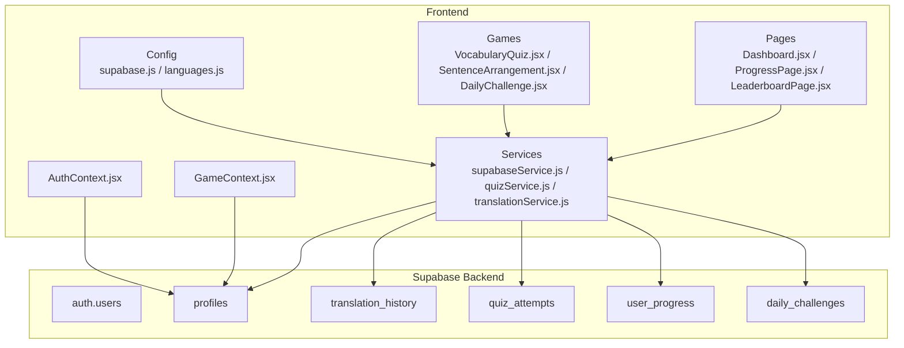
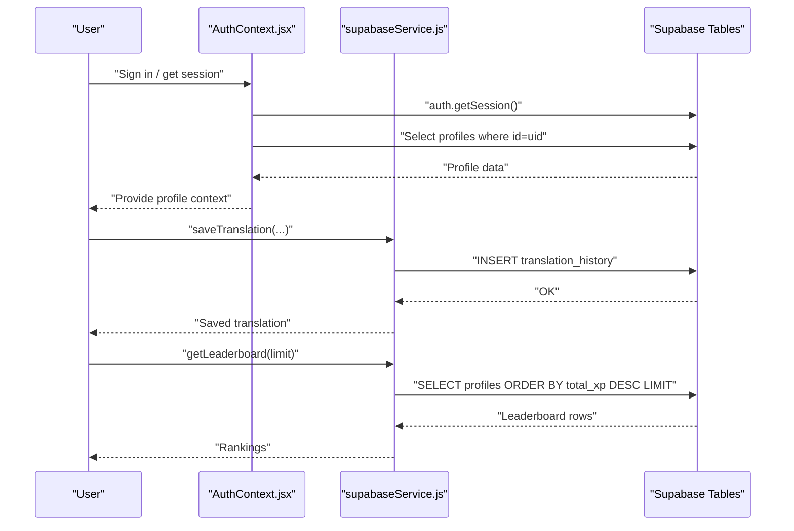
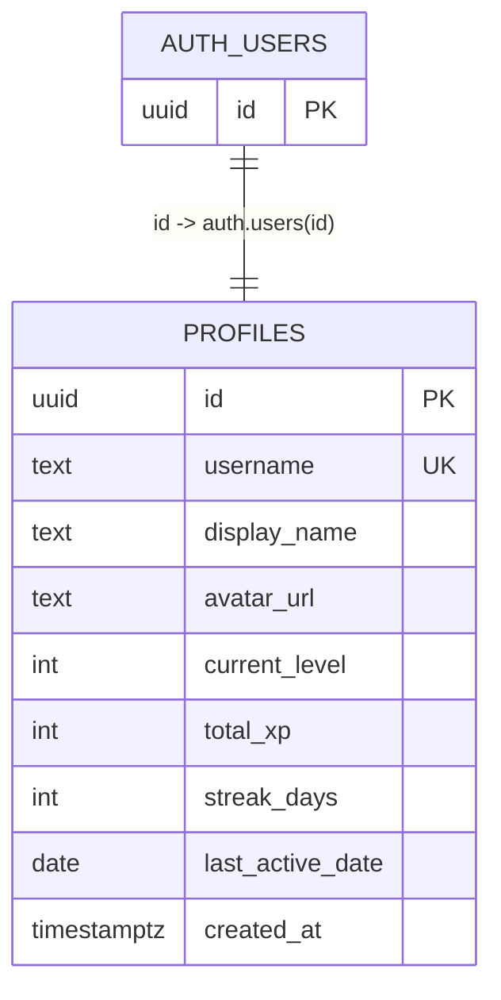
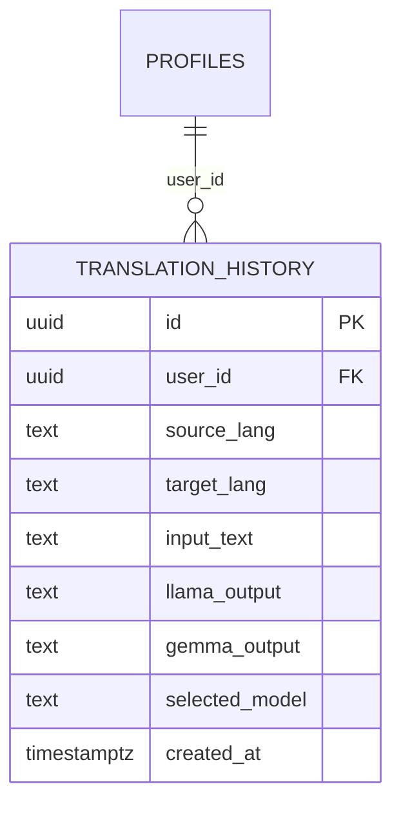
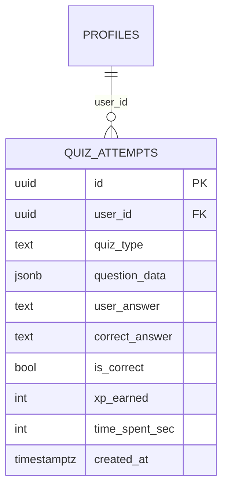
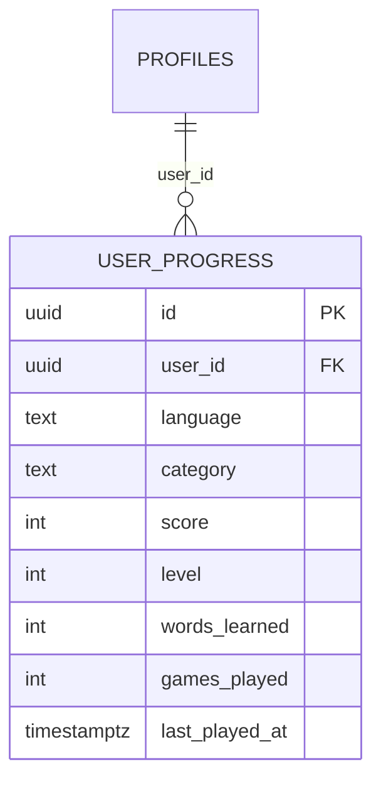
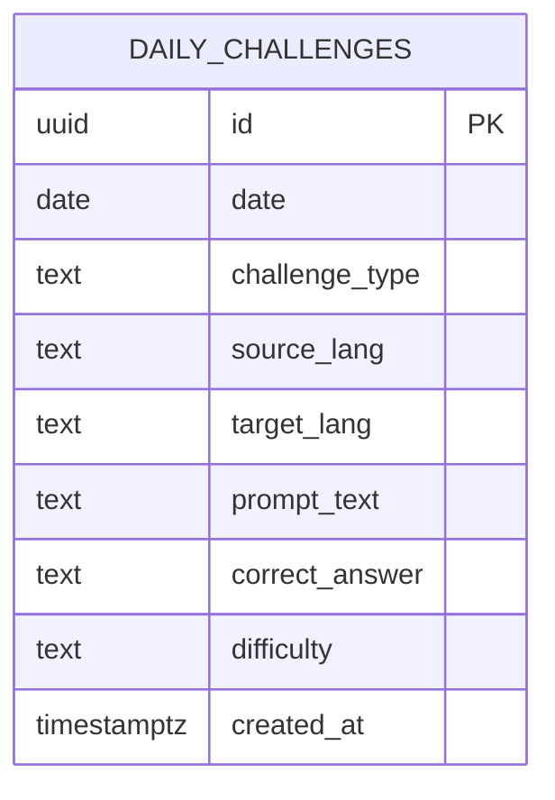
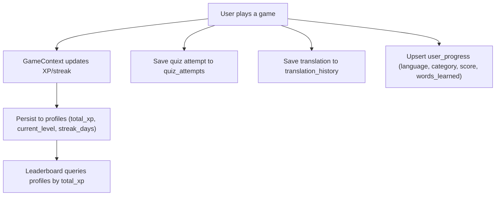
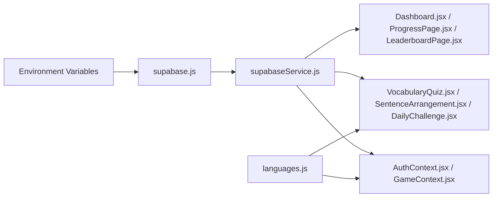

# Data Models and Schema

<cite>
**Referenced Files in This Document**
- [supabase-schema.sql](file://supabase-schema.sql)
- [supabase.js](file://src/config/supabase.js)
- [supabaseService.js](file://src/services/supabaseService.js)
- [AuthContext.jsx](file://src/contexts/AuthContext.jsx)
- [GameContext.jsx](file://src/contexts/GameContext.jsx)
- [languages.js](file://src/config/languages.js)
- [mockData.js](file://src/data/mockData.js)
- [Dashboard.jsx](file://src/pages/dashboard/Dashboard.jsx)
- [ProgressPage.jsx](file://src/pages/dashboard/ProgressPage.jsx)
- [LeaderboardPage.jsx](file://src/pages/dashboard/LeaderboardPage.jsx)
- [VocabularyQuiz.jsx](file://src/pages/games/VocabularyQuiz.jsx)
- [SentenceArrangement.jsx](file://src/pages/games/SentenceArrangement.jsx)
- [DailyChallenge.jsx](file://src/pages/games/DailyChallenge.jsx)
- [quizService.js](file://src/services/quizService.js)
- [translationService.js](file://src/services/translationService.js)
</cite>

## Table of Contents
1. [Introduction](#introduction)
2. [Project Structure](#project-structure)
3. [Core Components](#core-components)
4. [Architecture Overview](#architecture-overview)
5. [Detailed Component Analysis](#detailed-component-analysis)
6. [Dependency Analysis](#dependency-analysis)
7. [Performance Considerations](#performance-considerations)
8. [Troubleshooting Guide](#troubleshooting-guide)
9. [Conclusion](#conclusion)
10. [Appendices](#appendices)

## Introduction
This document describes the data models and schema powering Flinggo’s language learning platform. It covers the Supabase schema for user profiles, translation history, quiz attempts, progress tracking, and daily challenges, along with the application’s data access patterns, validation rules, transformations, caching strategies, and security controls. It also documents how user data flows through the system, including leaderboard computations and XP/streak mechanics.

## Project Structure
The data model is defined in the Supabase SQL script and consumed by the frontend via a dedicated service layer. Authentication integrates with Supabase Auth, and game/profile state is synchronized with backend tables.

**Diagram sources**
- [supabaseSchema.sql:1-119](file://supabase-schema.sql#L1-L119)
- [supabase.js:1-7](file://src/config/supabase.js#L1-L7)
- [supabaseService.js:1-132](file://src/services/supabaseService.js#L1-L132)
- [AuthContext.jsx:1-101](file://src/contexts/AuthContext.jsx#L1-L101)
- [GameContext.jsx:1-141](file://src/contexts/GameContext.jsx#L1-L141)
- [Dashboard.jsx:1-151](file://src/pages/dashboard/Dashboard.jsx#L1-L151)
- [ProgressPage.jsx:1-114](file://src/pages/dashboard/ProgressPage.jsx#L1-L114)
- [LeaderboardPage.jsx:1-78](file://src/pages/dashboard/LeaderboardPage.jsx#L1-L78)
- [VocabularyQuiz.jsx:1-215](file://src/pages/games/VocabularyQuiz.jsx#L1-L215)
- [SentenceArrangement.jsx:1-280](file://src/pages/games/SentenceArrangement.jsx#L1-L280)
- [DailyChallenge.jsx:1-249](file://src/pages/games/DailyChallenge.jsx#L1-L249)
- [quizService.js:1-154](file://src/services/quizService.js#L1-L154)
- [translationService.js:1-73](file://src/services/translationService.js#L1-L73)

**Section sources**
- [supabase-schema.sql:1-119](file://supabase-schema.sql#L1-L119)
- [supabase.js:1-7](file://src/config/supabase.js#L1-L7)
- [supabaseService.js:1-132](file://src/services/supabaseService.js#L1-L132)

## Core Components
- Profiles: Stores user identity, display metadata, XP, level, streak, and last active date. Enforces row-level security with visibility and update policies.
- Translation History: Captures user translation requests and model outputs for later review.
- Quiz Attempts: Records quiz sessions with structured question data, answers, correctness, XP earned, and timing.
- User Progress: Tracks per-language/per-category scores, levels, words learned, games played, and last activity.
- Daily Challenges: Stores curated daily prompts with difficulty and canonical answers.

**Section sources**
- [supabase-schema.sql:4-119](file://supabase-schema.sql#L4-L119)
- [supabaseService.js:1-132](file://src/services/supabaseService.js#L1-L132)

## Architecture Overview
The frontend authenticates via Supabase Auth and interacts with Supabase tables through a typed service layer. Game state (XP, streak, level) is persisted to profiles and derived locally for responsiveness. Leaderboards compute ranking from profile XP.

**Diagram sources**
- [AuthContext.jsx:12-40](file://src/contexts/AuthContext.jsx#L12-L40)
- [supabaseService.js:5-28](file://src/services/supabaseService.js#L5-L28)
- [supabaseService.js:111-119](file://src/services/supabaseService.js#L111-L119)

**Section sources**
- [AuthContext.jsx:1-101](file://src/contexts/AuthContext.jsx#L1-L101)
- [supabaseService.js:1-132](file://src/services/supabaseService.js#L1-L132)

## Detailed Component Analysis

### Profiles (User Identity and Stats)
- Purpose: Extend auth.users with application-specific attributes and stats.
- Key fields:
  - id: UUID, PK, references auth.users(id) with cascade delete.
  - username: Unique, not null.
  - display_name, avatar_url: Nullable.
  - current_level, total_xp, streak_days: Integers with defaults.
  - last_active_date: Date.
  - created_at: Timestamp with timezone.
- Security: Row-level security enabled; public select policy; update restricted to owner.
- Access patterns:
  - AuthContext reads profile on login and listens for auth state changes.
  - GameContext updates XP/level and streak on gameplay events.
  - Leaderboard queries top profiles by XP.

**Diagram sources**
- [supabase-schema.sql:5-18](file://supabase-schema.sql#L5-L18)
- [AuthContext.jsx:32-40](file://src/contexts/AuthContext.jsx#L32-L40)
- [GameContext.jsx:76-84](file://src/contexts/GameContext.jsx#L76-L84)

**Section sources**
- [supabase-schema.sql:4-18](file://supabase-schema.sql#L4-L18)
- [AuthContext.jsx:32-40](file://src/contexts/AuthContext.jsx#L32-L40)
- [GameContext.jsx:76-119](file://src/contexts/GameContext.jsx#L76-L119)

### Translation History
- Purpose: Store translation requests and model outputs for audit and review.
- Key fields:
  - id: UUID, PK.
  - user_id: UUID, FK to profiles(id) with cascade delete.
  - source_lang, target_lang: Text, not null.
  - input_text: Text, not null.
  - llama_output, gemma_output: Text.
  - selected_model: Text with default.
  - created_at: Timestamp with timezone.
- Security: Row-level security; select and insert allowed only for owner.
- Access patterns:
  - Save translation via service insert.
  - Retrieve recent history ordered by creation time.

**Diagram sources**
- [supabase-schema.sql:26-46](file://supabase-schema.sql#L26-L46)
- [supabaseService.js:5-28](file://src/services/supabaseService.js#L5-L28)

**Section sources**
- [supabase-schema.sql:26-46](file://supabase-schema.sql#L26-L46)
- [supabaseService.js:5-28](file://src/services/supabaseService.js#L5-L28)

### Quiz Attempts
- Purpose: Persist quiz sessions with structured data for analytics and review.
- Key fields:
  - id: UUID, PK.
  - user_id: UUID, FK to profiles(id) with cascade delete.
  - quiz_type: Text, constrained to vocabulary/sentence/challenge.
  - question_data: JSONB.
  - user_answer, correct_answer: Text.
  - is_correct: Boolean with default.
  - xp_earned: Integer with default.
  - time_spent_sec: Integer with default.
  - created_at: Timestamp with timezone.
- Security: Row-level security; select and insert allowed only for owner.
- Access patterns:
  - Save attempt via service insert.
  - Fetch recent attempts filtered by user and optionally quiz type.

**Diagram sources**
- [supabase-schema.sql:47-67](file://supabase-schema.sql#L47-L67)
- [supabaseService.js:32-58](file://src/services/supabaseService.js#L32-L58)

**Section sources**
- [supabase-schema.sql:47-67](file://supabase-schema.sql#L47-L67)
- [supabaseService.js:32-58](file://src/services/supabaseService.js#L32-L58)

### User Progress (Per Language/Category)
- Purpose: Track granular learning metrics per language and category.
- Key fields:
  - id: UUID, PK.
  - user_id: UUID, FK to profiles(id) with cascade delete.
  - language: Text, not null.
  - category: Text with default.
  - score, level, words_learned, games_played: Integers with defaults.
  - last_played_at: Timestamp with timezone.
  - unique constraint: (user_id, language, category).
- Security: Row-level security; select/update allowed; upsert insert allowed for owner.
- Access patterns:
  - Upsert progress with conflict on user/language/category.
  - Retrieve all progress for a user.

**Diagram sources**
- [supabase-schema.sql:69-92](file://supabase-schema.sql#L69-L92)
- [supabaseService.js:62-85](file://src/services/supabaseService.js#L62-L85)

**Section sources**
- [supabase-schema.sql:69-92](file://supabase-schema.sql#L69-L92)
- [supabaseService.js:62-85](file://src/services/supabaseService.js#L62-L85)

### Daily Challenges
- Purpose: Curated daily translation prompts with canonical answers and difficulty.
- Key fields:
  - id: UUID, PK.
  - date: Date, not null.
  - challenge_type: Text with default.
  - source_lang, target_lang: Text, not null.
  - prompt_text, correct_answer: Text, not null.
  - difficulty: Text with default and check constraint (easy/medium/hard).
  - created_at: Timestamp with timezone.
  - unique constraint: (date, difficulty).
- Security: Row-level security; select allowed to all; inserts managed by admin.
- Access patterns:
  - Fetch challenge by date.
  - Insert new daily challenge.

**Diagram sources**
- [supabase-schema.sql:94-111](file://supabase-schema.sql#L94-L111)
- [supabaseService.js:89-107](file://src/services/supabaseService.js#L89-L107)

**Section sources**
- [supabase-schema.sql:94-111](file://supabase-schema.sql#L94-L111)
- [supabaseService.js:89-107](file://src/services/supabaseService.js#L89-L107)

### Leaderboard Data Model
- Computed from profiles: selects id, username, display_name, avatar_url, current_level, total_xp, streak_days, orders by total_xp descending, limits results.
- Used by leaderboard page to render rankings.

**Diagram sources**
- [supabaseService.js:111-119](file://src/services/supabaseService.js#L111-L119)
- [LeaderboardPage.jsx:12-17](file://src/pages/dashboard/LeaderboardPage.jsx#L12-L17)

**Section sources**
- [supabaseService.js:111-119](file://src/services/supabaseService.js#L111-L119)
- [LeaderboardPage.jsx:1-78](file://src/pages/dashboard/LeaderboardPage.jsx#L1-L78)

### Data Validation and Business Rules
- Enum constraints:
  - quiz_type: vocabulary, sentence, challenge.
  - difficulty: easy, medium, hard.
- Defaults:
  - Profiles: current_level=1, total_xp=0, streak_days=0.
  - Quiz attempts: is_correct=false, xp_earned=0, time_spent_sec=0.
  - Selected model: default 'llama'.
- Uniqueness:
  - Profiles.username is unique.
  - User progress unique on (user_id, language, category).
  - Daily challenges unique on (date, difficulty).
- Derived calculations:
  - Level computed from XP using a constant XP-per-level threshold.
  - Streak increments when user activity crosses midnight boundary.

**Section sources**
- [supabase-schema.sql:51-51](file://supabase-schema.sql#L51-L51)
- [supabase-schema.sql:103-103](file://supabase-schema.sql#L103-L103)
- [supabase-schema.sql:70-81](file://supabase-schema.sql#L70-L81)
- [supabase-schema.sql:95-106](file://supabase-schema.sql#L95-L106)
- [languages.js:20-29](file://src/config/languages.js#L20-L29)
- [GameContext.jsx:107-119](file://src/contexts/GameContext.jsx#L107-L119)

### Data Transformation Patterns
- Translation service:
  - Single model translation or parallel comparison returning structured outputs and similarity metrics.
- Quiz generation:
  - Prompt engineering to produce JSON arrays/objects for vocabulary quizzes, sentence arrangements, and daily challenges.
  - Fallbacks when parsing fails.
- Frontend aggregation:
  - Dashboard computes recent activity from quiz attempts.
  - Progress page aggregates attempts by type and computes accuracy.
  - Leaderboard renders with user badges and initials.

**Section sources**
- [translationService.js:1-73](file://src/services/translationService.js#L1-L73)
- [quizService.js:8-32](file://src/services/quizService.js#L8-L32)
- [quizService.js:37-61](file://src/services/quizService.js#L37-L61)
- [quizService.js:66-88](file://src/services/quizService.js#L66-L88)
- [Dashboard.jsx:16-23](file://src/pages/dashboard/Dashboard.jsx#L16-L23)
- [ProgressPage.jsx:15-25](file://src/pages/dashboard/ProgressPage.jsx#L15-L25)

### Data Access Patterns Through Supabase Service Layer
- Profiles: fetch single profile by id; update profile fields.
- Translation history: insert new translation; list recent entries.
- Quiz attempts: insert attempt; list recent attempts with optional filtering.
- User progress: fetch all progress; upsert with conflict resolution.
- Daily challenges: fetch by date; insert new challenge.
- Leaderboard: select top profiles ordered by XP.

**Section sources**
- [supabaseService.js:5-28](file://src/services/supabaseService.js#L5-L28)
- [supabaseService.js:32-58](file://src/services/supabaseService.js#L32-L58)
- [supabaseService.js:62-85](file://src/services/supabaseService.js#L62-L85)
- [supabaseService.js:89-107](file://src/services/supabaseService.js#L89-L107)
- [supabaseService.js:111-119](file://src/services/supabaseService.js#L111-L119)

### Caching Strategies and Performance Considerations
- Local state caching:
  - AuthContext caches profile data after login and updates on auth changes.
  - GameContext maintains XP, level, streak, and recent XP gains in memory for immediate UI feedback.
- Backend indexing:
  - Composite indexes on (user_id, created_at) for translation history and quiz attempts.
  - Separate index on user_id for progress.
  - Index on date for daily challenges.
  - Index on total_xp for leaderboard sorting.
- Query limits:
  - Dashboard lists recent quiz attempts with small limit.
  - Leaderboard limits results to top N.
- Recommendations:
  - Add pagination for long histories.
  - Consider materialized views or scheduled aggregates for leaderboard if growth demands it.
  - Use server-side generated timestamps consistently.

**Section sources**
- [AuthContext.jsx:32-40](file://src/contexts/AuthContext.jsx#L32-L40)
- [GameContext.jsx:20-54](file://src/contexts/GameContext.jsx#L20-L54)
- [supabase-schema.sql:113-119](file://supabase-schema.sql#L113-L119)
- [Dashboard.jsx:18-21](file://src/pages/dashboard/Dashboard.jsx#L18-L21)
- [supabaseService.js:19-28](file://src/services/supabaseService.js#L19-L28)
- [supabaseService.js:47-58](file://src/services/supabaseService.js#L47-L58)
- [supabaseService.js:111-119](file://src/services/supabaseService.js#L111-L119)

### Data Lifecycle, Retention, and Archival
- Current schema does not define explicit retention or archival policies.
- Recommended practices:
  - Archive old translation_history and quiz_attempts periodically (e.g., older than 6–12 months) to a separate table or storage.
  - Implement soft deletion or anonymization for user-deleted accounts.
  - Schedule cleanup jobs to remove stale daily challenges after their validity period.

[No sources needed since this section provides general guidance]

### Data Security, Privacy, and Access Control
- Row-level security:
  - Profiles: select allowed to all; update allowed only by owner.
  - Translation history: select and insert allowed only by owner.
  - Quiz attempts: select and insert allowed only by owner.
  - User progress: select/update allowed; upsert insert allowed only by owner.
  - Daily challenges: select allowed to all.
- Authentication:
  - Supabase Auth manages session retrieval and change subscriptions.
- Data exposure:
  - Leaderboard exposes minimal profile fields; consider limiting returned fields further if privacy requires.

**Section sources**
- [supabase-schema.sql:17-25](file://supabase-schema.sql#L17-L25)
- [supabase-schema.sql:39-46](file://supabase-schema.sql#L39-L46)
- [supabase-schema.sql:61-68](file://supabase-schema.sql#L61-L68)
- [supabase-schema.sql:83-92](file://supabase-schema.sql#L83-L92)
- [supabase-schema.sql:108-111](file://supabase-schema.sql#L108-L111)
- [AuthContext.jsx:12-29](file://src/contexts/AuthContext.jsx#L12-L29)

### Sample Data Structures and Flows
- User profile snapshot:
  - Fields: id, username, display_name, avatar_url, current_level, total_xp, streak_days, last_active_date, created_at.
- Translation entry:
  - Fields: id, user_id, source_lang, target_lang, input_text, llama_output, gemma_output, selected_model, created_at.
- Quiz attempt:
  - Fields: id, user_id, quiz_type, question_data, user_answer, correct_answer, is_correct, xp_earned, time_spent_sec, created_at.
- Progress record:
  - Fields: id, user_id, language, category, score, level, words_learned, games_played, last_played_at.
- Daily challenge:
  - Fields: id, date, challenge_type, source_lang, target_lang, prompt_text, correct_answer, difficulty, created_at.

**Diagram sources**
- [GameContext.jsx:76-119](file://src/contexts/GameContext.jsx#L76-L119)
- [supabaseService.js:32-45](file://src/services/supabaseService.js#L32-L45)
- [supabaseService.js:5-17](file://src/services/supabaseService.js#L5-L17)
- [supabaseService.js:71-85](file://src/services/supabaseService.js#L71-L85)
- [supabaseService.js:111-119](file://src/services/supabaseService.js#L111-L119)

**Section sources**
- [GameContext.jsx:76-119](file://src/contexts/GameContext.jsx#L76-L119)
- [supabaseService.js:5-85](file://src/services/supabaseService.js#L5-L85)
- [supabaseService.js:111-119](file://src/services/supabaseService.js#L111-L119)

## Dependency Analysis
- Supabase client initialization depends on environment variables for URL and anon key.
- Service layer abstracts all database operations and is used by pages and contexts.
- Contexts depend on service layer for persistence and on configuration for constants.
- Pages depend on contexts and services for rendering and data fetching.

**Diagram sources**
- [supabase.js:1-7](file://src/config/supabase.js#L1-L7)
- [supabaseService.js:1-132](file://src/services/supabaseService.js#L1-L132)
- [AuthContext.jsx:1-101](file://src/contexts/AuthContext.jsx#L1-L101)
- [GameContext.jsx:1-141](file://src/contexts/GameContext.jsx#L1-L141)
- [Dashboard.jsx:1-151](file://src/pages/dashboard/Dashboard.jsx#L1-L151)
- [ProgressPage.jsx:1-114](file://src/pages/dashboard/ProgressPage.jsx#L1-L114)
- [LeaderboardPage.jsx:1-78](file://src/pages/dashboard/LeaderboardPage.jsx#L1-L78)
- [VocabularyQuiz.jsx:1-215](file://src/pages/games/VocabularyQuiz.jsx#L1-L215)
- [SentenceArrangement.jsx:1-280](file://src/pages/games/SentenceArrangement.jsx#L1-L280)
- [DailyChallenge.jsx:1-249](file://src/pages/games/DailyChallenge.jsx#L1-L249)
- [languages.js:1-30](file://src/config/languages.js#L1-L30)

**Section sources**
- [supabase.js:1-7](file://src/config/supabase.js#L1-L7)
- [supabaseService.js:1-132](file://src/services/supabaseService.js#L1-L132)
- [AuthContext.jsx:1-101](file://src/contexts/AuthContext.jsx#L1-L101)
- [GameContext.jsx:1-141](file://src/contexts/GameContext.jsx#L1-L141)
- [Dashboard.jsx:1-151](file://src/pages/dashboard/Dashboard.jsx#L1-L151)
- [ProgressPage.jsx:1-114](file://src/pages/dashboard/ProgressPage.jsx#L1-L114)
- [LeaderboardPage.jsx:1-78](file://src/pages/dashboard/LeaderboardPage.jsx#L1-L78)
- [VocabularyQuiz.jsx:1-215](file://src/pages/games/VocabularyQuiz.jsx#L1-L215)
- [SentenceArrangement.jsx:1-280](file://src/pages/games/SentenceArrangement.jsx#L1-L280)
- [DailyChallenge.jsx:1-249](file://src/pages/games/DailyChallenge.jsx#L1-L249)
- [languages.js:1-30](file://src/config/languages.js#L1-L30)

## Performance Considerations
- Indexes:
  - translation_history(user_id, created_at DESC)
  - quiz_attempts(user_id, created_at DESC)
  - user_progress(user_id)
  - daily_challenges(date)
  - profiles(total_xp DESC)
- Recommendations:
  - Monitor slow queries and add composite indexes as needed.
  - Consider partitioning historical tables by date.
  - Batch writes for progress updates to reduce round trips.

[No sources needed since this section provides general guidance]

## Troubleshooting Guide
- Authentication issues:
  - Verify environment variables for Supabase URL and anon key.
  - Ensure auth state subscription is active and profile fetch occurs after session retrieval.
- Data access errors:
  - Check RLS policies for the relevant table; confirm auth.uid() matches the requested resource owner.
  - Validate foreign keys and unique constraints before inserts/upserts.
- Performance problems:
  - Confirm appropriate indexes exist for frequent filters and sorts.
  - Limit query result sizes and paginate where applicable.

**Section sources**
- [supabase.js:3-6](file://src/config/supabase.js#L3-L6)
- [AuthContext.jsx:12-29](file://src/contexts/AuthContext.jsx#L12-L29)
- [supabase-schema.sql:17-25](file://supabase-schema.sql#L17-L25)
- [supabase-schema.sql:113-119](file://supabase-schema.sql#L113-L119)

## Conclusion
Flinggo’s data model centers on a normalized schema with strong referential integrity and row-level security. The service layer encapsulates CRUD operations, while contexts manage local state for responsive UX. With proper indexing and optional archival strategies, the system scales to support leaderboard computation, progress tracking, and interactive learning activities.

## Appendices
- Mock data structures for UI scaffolding:
  - Stats, language progress, activity log, weekly activity, daily challenge, and leaderboard entries.

**Section sources**
- [mockData.js:1-47](file://src/data/mockData.js#L1-L47)