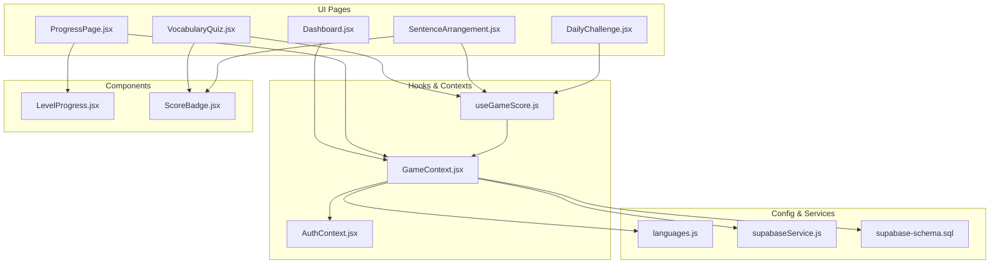
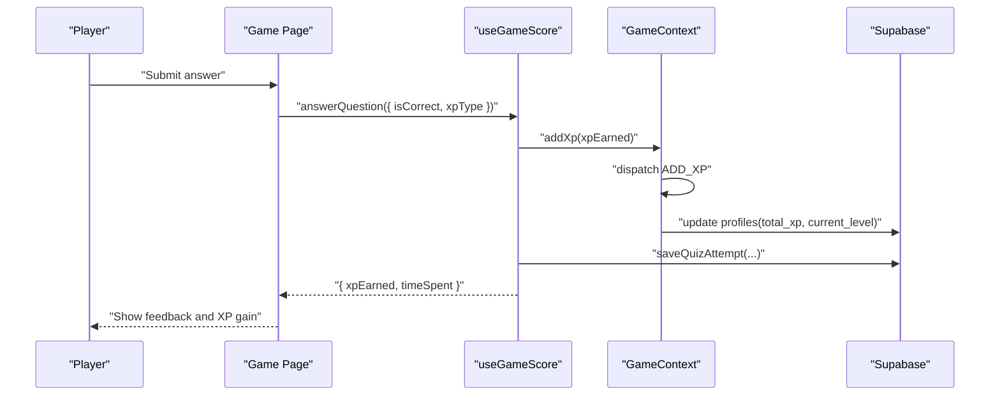
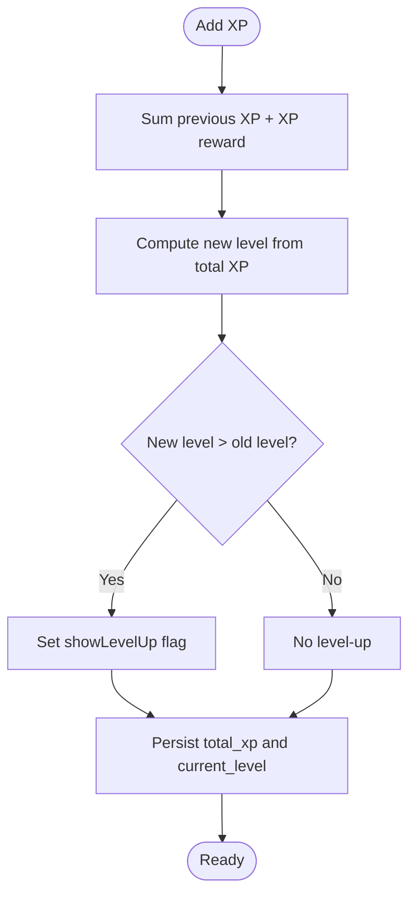
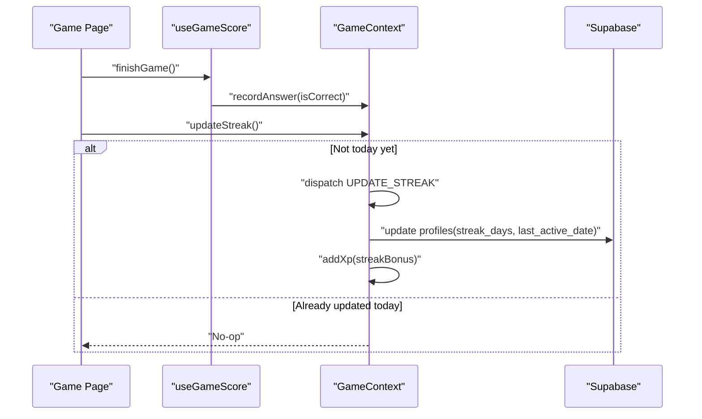
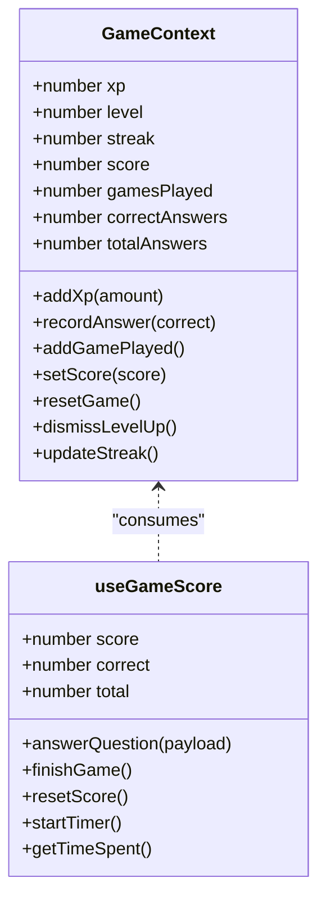
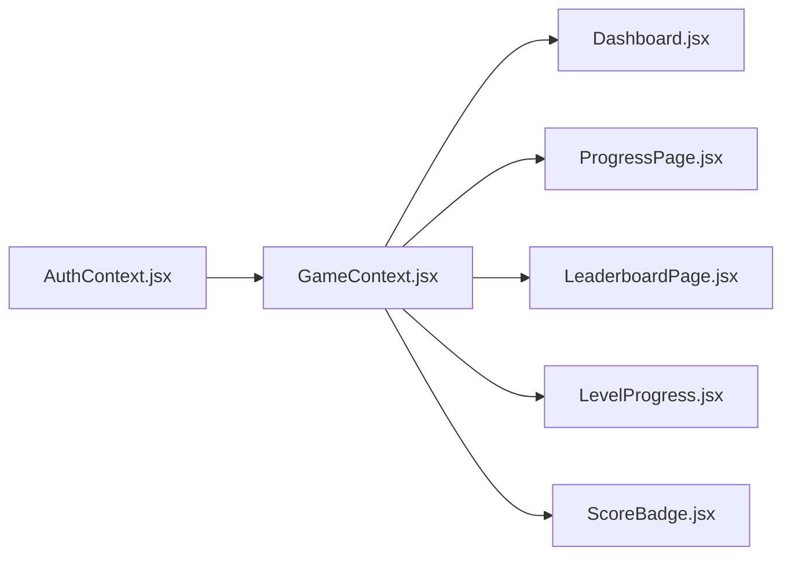
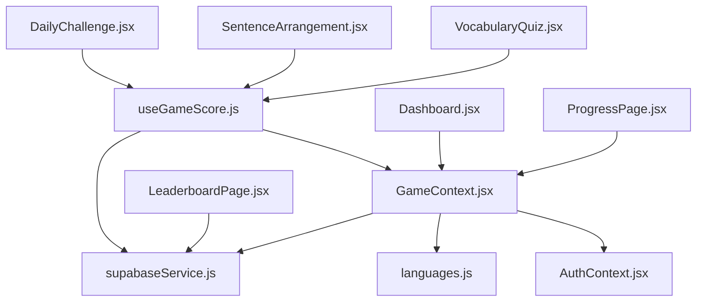

# Game Mechanics

<cite>
**Referenced Files in This Document**
- [GameContext.jsx](file://src/contexts/GameContext.jsx)
- [useGameScore.js](file://src/hooks/useGameScore.js)
- [languages.js](file://src/config/languages.js)
- [supabaseService.js](file://src/services/supabaseService.js)
- [AuthContext.jsx](file://src/contexts/AuthContext.jsx)
- [LevelProgress.jsx](file://src/components/LevelProgress.jsx)
- [ScoreBadge.jsx](file://src/components/ScoreBadge.jsx)
- [VocabularyQuiz.jsx](file://src/pages/games/VocabularyQuiz.jsx)
- [SentenceArrangement.jsx](file://src/pages/games/SentenceArrangement.jsx)
- [DailyChallenge.jsx](file://src/pages/games/DailyChallenge.jsx)
- [ProgressPage.jsx](file://src/pages/dashboard/ProgressPage.jsx)
- [Dashboard.jsx](file://src/pages/Dashboard.jsx)
- [LeaderboardPage.jsx](file://src/pages/dashboard/LeaderboardPage.jsx)
- [supabase-schema.sql](file://supabase-schema.sql)
</cite>

## Table of Contents
1. [Introduction](#introduction)
2. [Project Structure](#project-structure)
3. [Core Components](#core-components)
4. [Architecture Overview](#architecture-overview)
5. [Detailed Component Analysis](#detailed-component-analysis)
6. [Dependency Analysis](#dependency-analysis)
7. [Performance Considerations](#performance-considerations)
8. [Troubleshooting Guide](#troubleshooting-guide)
9. [Conclusion](#conclusion)
10. [Appendices](#appendices)

## Introduction
This document explains the game mechanics powering XP accumulation, leveling, streak tracking, and score management. It documents how user actions translate into XP gains, how levels are calculated, how streaks are tracked and rewarded, and how the GameContext provider orchestrates state across the app. It also covers integration with progress tracking, leaderboard visibility, and the database schema that persists player data.

## Project Structure
The game mechanics are implemented primarily in React contexts and hooks, with data persisted to Supabase. Key areas:
- Game state and persistence: GameContext provider
- Scoring and XP per action: useGameScore hook and XP reward constants
- Level computation and XP thresholds: languages configuration
- UI components displaying progress and XP feedback
- Game pages integrating scoring and XP rewards
- Authentication context enabling profile-based persistence
- Database schema defining persistent fields for XP, level, streak, and attempts

**Diagram sources**
- [GameContext.jsx:57-134](file://src/contexts/GameContext.jsx#L57-L134)
- [useGameScore.js:7-75](file://src/hooks/useGameScore.js#L7-L75)
- [languages.js:20-29](file://src/config/languages.js#L20-L29)
- [supabaseService.js:32-45](file://src/services/supabaseService.js#L32-L45)
- [AuthContext.jsx:32-40](file://src/contexts/AuthContext.jsx#L32-L40)
- [LevelProgress.jsx:3-17](file://src/components/LevelProgress.jsx#L3-L17)
- [ScoreBadge.jsx:3-18](file://src/components/ScoreBadge.jsx#L3-L18)
- [VocabularyQuiz.jsx:19](file://src/pages/games/VocabularyQuiz.jsx#L19)
- [SentenceArrangement.jsx:22](file://src/pages/games/SentenceArrangement.jsx#L22)
- [DailyChallenge.jsx:69-80](file://src/pages/games/DailyChallenge.jsx#L69-L80)
- [ProgressPage.jsx:41](file://src/pages/dashboard/ProgressPage.jsx#L41)
- [Dashboard.jsx:41](file://src/pages/Dashboard.jsx#L41)

**Section sources**
- [GameContext.jsx:57-134](file://src/contexts/GameContext.jsx#L57-L134)
- [useGameScore.js:7-75](file://src/hooks/useGameScore.js#L7-L75)
- [languages.js:20-29](file://src/config/languages.js#L20-L29)
- [supabaseService.js:32-45](file://src/services/supabaseService.js#L32-L45)
- [AuthContext.jsx:32-40](file://src/contexts/AuthContext.jsx#L32-L40)
- [LevelProgress.jsx:3-17](file://src/components/LevelProgress.jsx#L3-L17)
- [ScoreBadge.jsx:3-18](file://src/components/ScoreBadge.jsx#L3-L18)
- [VocabularyQuiz.jsx:19](file://src/pages/games/VocabularyQuiz.jsx#L19)
- [SentenceArrangement.jsx:22](file://src/pages/games/SentenceArrangement.jsx#L22)
- [DailyChallenge.jsx:69-80](file://src/pages/games/DailyChallenge.jsx#L69-L80)
- [ProgressPage.jsx:41](file://src/pages/dashboard/ProgressPage.jsx#L41)
- [Dashboard.jsx:41](file://src/pages/Dashboard.jsx#L41)

## Core Components
- GameContext provider manages XP, level, streak, score, and counters. It loads profile data on login, persists XP/level/streak updates to Supabase, and exposes convenience functions for scoring and streak maintenance.
- useGameScore hook encapsulates per-game scoring logic, computes XP per correct answer based on XP reward constants, and saves quiz attempts to the database.
- languages configuration defines XP reward amounts and the level threshold formula.
- UI components render progress, XP gains, and badges.

Key responsibilities:
- XP calculation: sum of XP rewards per correct answer.
- Level progression: integer division of total XP by a fixed threshold plus base level.
- Streak tracking: increments daily streak if not already updated today and awards a bonus XP.
- Score management: local score for the current game session and persistent XP for long-term progress.

**Section sources**
- [GameContext.jsx:8-18](file://src/contexts/GameContext.jsx#L8-L18)
- [GameContext.jsx:20-55](file://src/contexts/GameContext.jsx#L20-L55)
- [GameContext.jsx:75-85](file://src/contexts/GameContext.jsx#L75-L85)
- [GameContext.jsx:107-119](file://src/contexts/GameContext.jsx#L107-L119)
- [useGameScore.js:23-55](file://src/hooks/useGameScore.js#L23-L55)
- [languages.js:20-29](file://src/config/languages.js#L20-L29)

## Architecture Overview
The game mechanics follow a predictable flow: user performs an action (answer a question), the scoring hook calculates XP, updates local and persistent state, and the UI reflects progress and XP gains.

**Diagram sources**
- [useGameScore.js:23-55](file://src/hooks/useGameScore.js#L23-L55)
- [GameContext.jsx:75-85](file://src/contexts/GameContext.jsx#L75-L85)
- [supabaseService.js:32-45](file://src/services/supabaseService.js#L32-L45)

## Detailed Component Analysis

### XP Calculation and Leveling System
- XP rewards are defined per action type in the configuration module.
- Level is computed by dividing total XP by a fixed threshold and adding a base level.
- The reducer updates XP, recalculates level, and tracks whether a level-up occurred.

Concrete examples from the codebase:
- Per-action XP rewards are used when calculating XP earned for a correct answer.
- Level calculation is applied when persisting XP to the database.
- UI displays current level and XP within level.

**Diagram sources**
- [GameContext.jsx:24-34](file://src/contexts/GameContext.jsx#L24-L34)
- [GameContext.jsx:75-85](file://src/contexts/GameContext.jsx#L75-L85)
- [languages.js:27-29](file://src/config/languages.js#L27-L29)

**Section sources**
- [languages.js:20-29](file://src/config/languages.js#L20-L29)
- [GameContext.jsx:24-34](file://src/contexts/GameContext.jsx#L24-L34)
- [GameContext.jsx:75-85](file://src/contexts/GameContext.jsx#L75-L85)
- [LevelProgress.jsx:3-17](file://src/components/LevelProgress.jsx#L3-L17)

### Streak Tracking and Bonus XP
- Streak is maintained in the user profile and incremented daily if the last activity was not today.
- On successful streak increment, a bonus XP is awarded automatically.
- The streak UI and leaderboards reflect current streak counts.

**Diagram sources**
- [GameContext.jsx:107-119](file://src/contexts/GameContext.jsx#L107-L119)
- [useGameScore.js:57-61](file://src/hooks/useGameScore.js#L57-L61)

**Section sources**
- [GameContext.jsx:107-119](file://src/contexts/GameContext.jsx#L107-L119)
- [useGameScore.js:57-61](file://src/hooks/useGameScore.js#L57-L61)
- [supabase-schema.sql:10-15](file://supabase-schema.sql#L10-L15)

### Score Management and Real-Time Updates
- Local score tracks current game session points.
- Persistent XP is stored in the user profile and updated atomically with level recalculation.
- Quiz attempts are saved with metadata for analytics and progress insights.

**Diagram sources**
- [GameContext.jsx:8-18](file://src/contexts/GameContext.jsx#L8-L18)
- [GameContext.jsx:57-134](file://src/contexts/GameContext.jsx#L57-L134)
- [useGameScore.js:7-75](file://src/hooks/useGameScore.js#L7-L75)

**Section sources**
- [GameContext.jsx:8-18](file://src/contexts/GameContext.jsx#L8-L18)
- [GameContext.jsx:57-134](file://src/contexts/GameContext.jsx#L57-L134)
- [useGameScore.js:7-75](file://src/hooks/useGameScore.js#L7-L75)

### Achievement System and Badge Rewards
- The current codebase does not define explicit achievement triggers or badge rewards. Progress indicators include:
  - Level badge and progress bar
  - Streak display and fire emoji
  - Leaderboard entries showing XP and streak
- Achievement logic can be added by extending the reducer and UI to track milestones (e.g., “First 100 XP”, “Five-day streak”) and awarding badges accordingly.

[No sources needed since this section synthesizes current absence of explicit achievement/badge logic]

### Integration Between Game Mechanics and Progress Tracking
- Dashboard and Progress pages consume GameContext state to render:
  - Current level and XP progress
  - Overall accuracy and streak
  - Leaderboard rankings and XP totals
- The AuthContext ensures profile data is loaded and updated, which feeds GameContext initial state and persists XP/level/streak changes.

**Diagram sources**
- [AuthContext.jsx:32-40](file://src/contexts/AuthContext.jsx#L32-L40)
- [GameContext.jsx:62-73](file://src/contexts/GameContext.jsx#L62-L73)
- [Dashboard.jsx:41](file://src/pages/Dashboard.jsx#L41)
- [ProgressPage.jsx:41](file://src/pages/dashboard/ProgressPage.jsx#L41)
- [LeaderboardPage.jsx:63](file://src/pages/dashboard/LeaderboardPage.jsx#L63)
- [LevelProgress.jsx:3-17](file://src/components/LevelProgress.jsx#L3-L17)
- [ScoreBadge.jsx:3-18](file://src/components/ScoreBadge.jsx#L3-L18)

**Section sources**
- [AuthContext.jsx:32-40](file://src/contexts/AuthContext.jsx#L32-L40)
- [GameContext.jsx:62-73](file://src/contexts/GameContext.jsx#L62-L73)
- [Dashboard.jsx:41](file://src/pages/Dashboard.jsx#L41)
- [ProgressPage.jsx:41](file://src/pages/dashboard/ProgressPage.jsx#L41)
- [LeaderboardPage.jsx:63](file://src/pages/dashboard/LeaderboardPage.jsx#L63)
- [LevelProgress.jsx:3-17](file://src/components/LevelProgress.jsx#L3-L17)
- [ScoreBadge.jsx:3-18](file://src/components/ScoreBadge.jsx#L3-L18)

### Concrete Examples from the Codebase
- Vocabulary Quiz:
  - Uses the scoring hook to compute XP for correct answers and persists the attempt.
  - Displays current score via a badge component.
- Sentence Arrangement:
  - Uses a different XP reward type for sentence correctness and persists the attempt similarly.
- Daily Challenge:
  - Applies a difficulty multiplier to XP reward and triggers streak update upon completion.

**Section sources**
- [VocabularyQuiz.jsx:19](file://src/pages/games/VocabularyQuiz.jsx#L19)
- [VocabularyQuiz.jsx:50-56](file://src/pages/games/VocabularyQuiz.jsx#L50-L56)
- [SentenceArrangement.jsx:22](file://src/pages/games/SentenceArrangement.jsx#L22)
- [SentenceArrangement.jsx:82-88](file://src/pages/games/SentenceArrangement.jsx#L82-L88)
- [DailyChallenge.jsx:69-80](file://src/pages/games/DailyChallenge.jsx#L69-L80)

## Dependency Analysis
- GameContext depends on:
  - AuthContext for user/profile data
  - languages configuration for XP rewards and level calculation
  - Supabase service for profile updates and leaderboard queries
- useGameScore depends on:
  - GameContext for XP accumulation and answer recording
  - Supabase service for saving quiz attempts
- UI components depend on:
  - GameContext for rendering progress and XP
  - Config for XP thresholds and rewards

**Diagram sources**
- [GameContext.jsx:1-4](file://src/contexts/GameContext.jsx#L1-L4)
- [useGameScore.js:2-5](file://src/hooks/useGameScore.js#L2-L5)
- [AuthContext.jsx:1-3](file://src/contexts/AuthContext.jsx#L1-L3)
- [supabaseService.js:1](file://src/services/supabaseService.js#L1)
- [VocabularyQuiz.jsx:5](file://src/pages/games/VocabularyQuiz.jsx#L5)
- [SentenceArrangement.jsx:5](file://src/pages/games/SentenceArrangement.jsx#L5)
- [DailyChallenge.jsx:5](file://src/pages/games/DailyChallenge.jsx#L5)
- [Dashboard.jsx:1](file://src/pages/Dashboard.jsx#L1)
- [ProgressPage.jsx:1](file://src/pages/dashboard/ProgressPage.jsx#L1)
- [LeaderboardPage.jsx:1](file://src/pages/dashboard/LeaderboardPage.jsx#L1)

**Section sources**
- [GameContext.jsx:1-4](file://src/contexts/GameContext.jsx#L1-L4)
- [useGameScore.js:2-5](file://src/hooks/useGameScore.js#L2-L5)
- [AuthContext.jsx:1-3](file://src/contexts/AuthContext.jsx#L1-L3)
- [supabaseService.js:1](file://src/services/supabaseService.js#L1)
- [VocabularyQuiz.jsx:5](file://src/pages/games/VocabularyQuiz.jsx#L5)
- [SentenceArrangement.jsx:5](file://src/pages/games/SentenceArrangement.jsx#L5)
- [DailyChallenge.jsx:5](file://src/pages/games/DailyChallenge.jsx#L5)
- [Dashboard.jsx:1](file://src/pages/Dashboard.jsx#L1)
- [ProgressPage.jsx:1](file://src/pages/dashboard/ProgressPage.jsx#L1)
- [LeaderboardPage.jsx:1](file://src/pages/dashboard/LeaderboardPage.jsx#L1)

## Performance Considerations
- Real-time score updates:
  - Use local state for immediate UI feedback; batch writes to Supabase to reduce network overhead.
  - Debounce or throttle frequent XP additions if needed.
- State synchronization:
  - Keep GameContext minimal and focused; avoid unnecessary re-renders by structuring state updates carefully.
- Database writes:
  - Combine XP and level updates in a single write operation when possible.
  - Use indexes on frequently queried fields (e.g., profiles(total_xp), quiz_attempts(user_id)).
- UI animations:
  - Keep animations lightweight; disable during rapid sequences of XP gains.

[No sources needed since this section provides general guidance]

## Troubleshooting Guide
- XP not persisting:
  - Verify the user is logged in and profile exists.
  - Confirm the update to profiles is executed and not blocked by policies.
- Streak not incrementing:
  - Ensure last_active_date differs from today’s date.
  - Confirm updateStreak is invoked after finishing a game.
- Incorrect level:
  - Check the XP threshold constant and level calculation function.
  - Validate that total_xp is updated before recalculating level.

**Section sources**
- [GameContext.jsx:75-85](file://src/contexts/GameContext.jsx#L75-L85)
- [GameContext.jsx:107-119](file://src/contexts/GameContext.jsx#L107-L119)
- [languages.js:27-29](file://src/config/languages.js#L27-L29)
- [supabase-schema.sql:10-15](file://supabase-schema.sql#L10-L15)

## Conclusion
The game mechanics are centered around a clean separation of concerns: useGameScore handles per-session scoring and persistence of quiz attempts, while GameContext manages XP, level, streak, and persistence of profile metrics. The system is extensible—adding new XP types, difficulty multipliers, and achievement triggers is straightforward, and the database schema supports robust progress tracking.

[No sources needed since this section summarizes without analyzing specific files]

## Appendices

### Implementation Details for Extending the System
- Adding a new XP reward type:
  - Define the reward in the configuration module.
  - Use the new key in the scoring hook when computing XP for the action.
- Introducing achievements:
  - Extend the reducer to track milestone counters and expose a function to check and award badges.
  - Add UI badges and notifications to display newly earned achievements.
- Balancing gameplay elements:
  - Adjust XP_REWARDS and the level threshold to control pacing.
  - Introduce diminishing returns or caps for XP per action to prevent inflation.
- Streak mechanics:
  - Allow configurable streak bonuses and multipliers.
  - Consider weekend bonuses or streak milestones.

[No sources needed since this section provides general guidance]