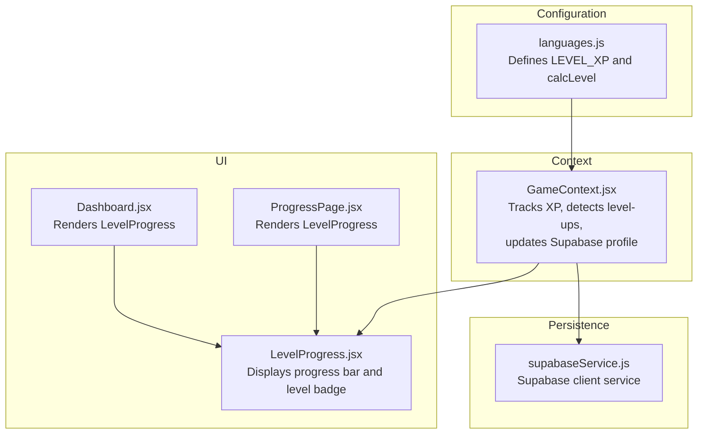
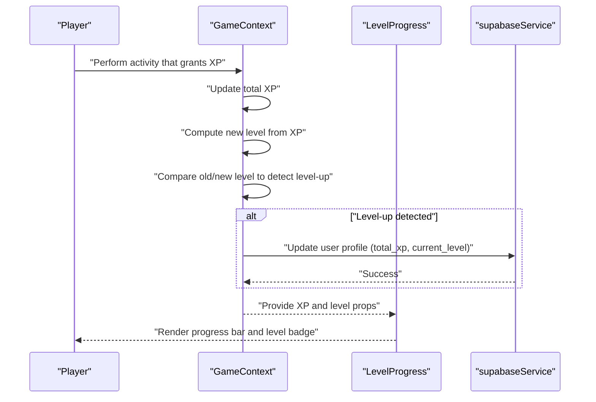
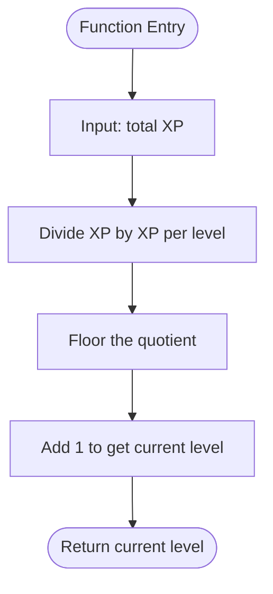
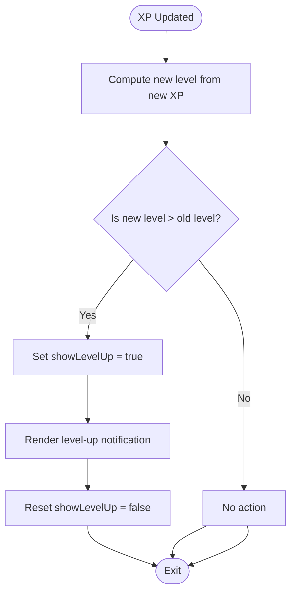
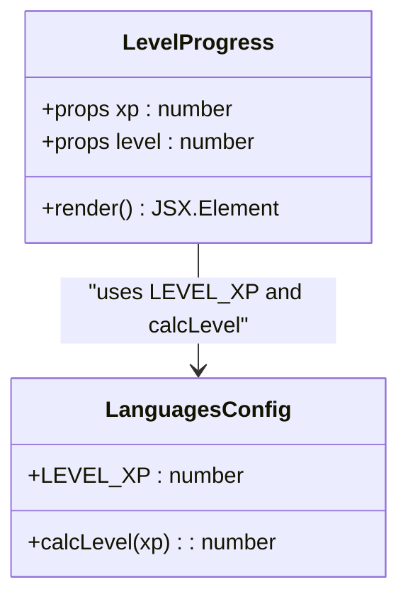
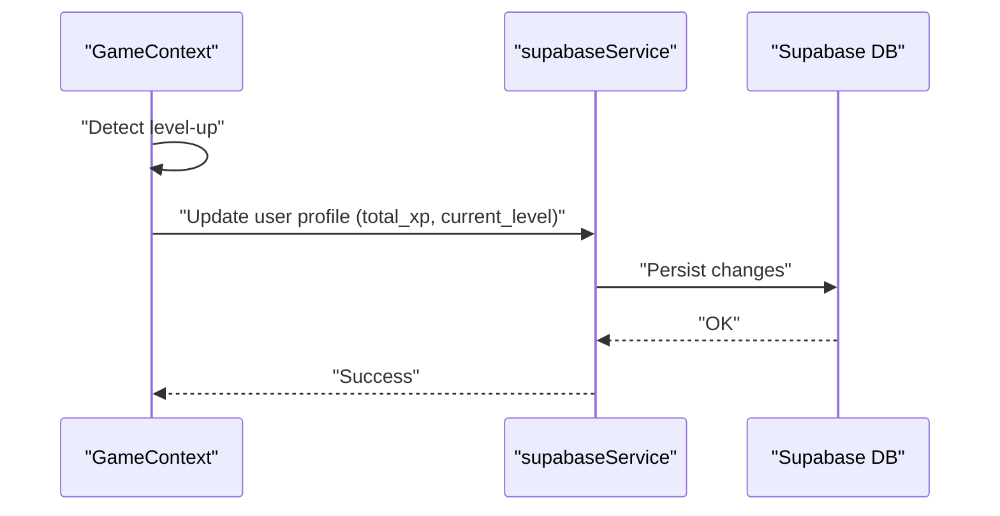
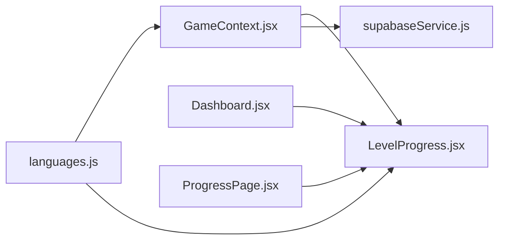

# Leveling System and Progression Mechanics

<cite>
**Referenced Files in This Document**
- [languages.js](file://src/config/languages.js)
- [GameContext.jsx](file://src/contexts/GameContext.jsx)
- [LevelProgress.jsx](file://src/components/LevelProgress.jsx)
- [Dashboard.jsx](file://src/pages/dashboard/Dashboard.jsx)
- [ProgressPage.jsx](file://src/pages/dashboard/ProgressPage.jsx)
- [supabaseService.js](file://src/services/supabaseService.js)
</cite>

## Table of Contents
1. [Introduction](#introduction)
2. [Project Structure](#project-structure)
3. [Core Components](#core-components)
4. [Architecture Overview](#architecture-overview)
5. [Detailed Component Analysis](#detailed-component-analysis)
6. [Dependency Analysis](#dependency-analysis)
7. [Performance Considerations](#performance-considerations)
8. [Troubleshooting Guide](#troubleshooting-guide)
9. [Conclusion](#conclusion)
10. [Appendices](#appendices)

## Introduction
This document explains the leveling system and progression mechanics implemented in the application. It covers how experience points (XP) translate into levels, how level thresholds are defined, and how level-ups are detected and surfaced to users. It also documents the LevelProgress component that visualizes current XP within a level and the integration with Supabase for persistent user profile updates. Guidance is included for customizing level thresholds and progression speed while maintaining balanced progression curves.

## Project Structure
The leveling system spans three primary areas:
- Configuration defines XP per level and the level calculation algorithm
- Context manages XP state, level-up detection, and user profile updates
- UI components visualize current XP and level progress

**Diagram sources**
- [languages.js](file://src/config/languages.js)
- [GameContext.jsx](file://src/contexts/GameContext.jsx)
- [LevelProgress.jsx](file://src/components/LevelProgress.jsx)
- [Dashboard.jsx](file://src/pages/dashboard/Dashboard.jsx)
- [ProgressPage.jsx](file://src/pages/dashboard/ProgressPage.jsx)
- [supabaseService.js](file://src/services/supabaseService.js)

**Section sources**
- [languages.js](file://src/config/languages.js)
- [GameContext.jsx](file://src/contexts/GameContext.jsx)
- [LevelProgress.jsx](file://src/components/LevelProgress.jsx)
- [Dashboard.jsx](file://src/pages/dashboard/Dashboard.jsx)
- [ProgressPage.jsx](file://src/pages/dashboard/ProgressPage.jsx)
- [supabaseService.js](file://src/services/supabaseService.js)

## Core Components
- Level calculation algorithm: Uses a fixed XP threshold per level to compute the current level from total XP.
- Level thresholds: Defined as a constant representing XP required to advance to the next level.
- Level-up detection: Compares previous and new XP totals to determine if a level-up occurred.
- Level-up notification: A state flag toggles the visibility of a level-up notification.
- Progress visualization: A compact component displays the current level badge, progress bar, and XP counters.

Key implementation references:
- Level calculation and threshold constants are defined in the configuration module.
- Level-up detection and state management live in the game context.
- UI rendering occurs in dashboard and progress pages via the LevelProgress component.
- Supabase integration persists XP and level updates to the user profile.

**Section sources**
- [languages.js](file://src/config/languages.js)
- [GameContext.jsx](file://src/contexts/GameContext.jsx)
- [LevelProgress.jsx](file://src/components/LevelProgress.jsx)
- [Dashboard.jsx](file://src/pages/dashboard/Dashboard.jsx)
- [ProgressPage.jsx](file://src/pages/dashboard/ProgressPage.jsx)

## Architecture Overview
The leveling system follows a unidirectional data flow:
- XP changes originate from gameplay events handled by the game context
- The context recalculates the current level and determines level-ups
- The UI renders the LevelProgress component with current XP and level
- On level-up, the context triggers a profile update in Supabase

**Diagram sources**
- [GameContext.jsx](file://src/contexts/GameContext.jsx)
- [LevelProgress.jsx](file://src/components/LevelProgress.jsx)
- [supabaseService.js](file://src/services/supabaseService.js)

## Detailed Component Analysis

### Level Calculation Algorithm (calcLevel)
The current level is computed by dividing total XP by the XP threshold per level and rounding down, then adding one to represent the first level.

**Diagram sources**
- [languages.js](file://src/config/languages.js)

Implementation highlights:
- The algorithm ensures integer level progression with no fractional levels.
- Level increases consistently after accumulating the XP threshold amount.

**Section sources**
- [languages.js](file://src/config/languages.js)

### Level-Up Detection and Notification (showLevelUp)
The game context tracks XP changes and computes the new level. If the new level exceeds the previous level, a level-up flag is set to trigger UI notifications. After surfacing the notification, the flag resets to prevent repeated alerts until another level-up occurs.

**Diagram sources**
- [GameContext.jsx](file://src/contexts/GameContext.jsx)

**Section sources**
- [GameContext.jsx](file://src/contexts/GameContext.jsx)

### LevelProgress Component
The LevelProgress component receives either raw XP or a precomputed level and calculates:
- Current level using the level calculation function
- XP within the current level (modulo the XP threshold)
- Progress percentage for the progress bar

It renders:
- A small badge indicating the current level
- A horizontal progress bar showing progress toward the next level
- Text displaying XP earned so far and the XP threshold for the level

**Diagram sources**
- [LevelProgress.jsx](file://src/components/LevelProgress.jsx)
- [languages.js](file://src/config/languages.js)

**Section sources**
- [LevelProgress.jsx](file://src/components/LevelProgress.jsx)
- [languages.js](file://src/config/languages.js)

### Integration with Supabase Profile Updates
On detecting a level-up, the game context updates the user’s profile in Supabase with:
- Total accumulated XP
- Current level derived from the updated XP

This ensures persistence of progression data across sessions and devices.

**Diagram sources**
- [GameContext.jsx](file://src/contexts/GameContext.jsx)
- [supabaseService.js](file://src/services/supabaseService.js)

**Section sources**
- [GameContext.jsx](file://src/contexts/GameContext.jsx)
- [supabaseService.js](file://src/services/supabaseService.js)

### Relationship Between XP, Level, and Milestones
- XP accumulation: Activities grant XP according to predefined rewards.
- Level advancement: Each level requires accumulating the XP threshold amount.
- Milestones: Level-ups occur at integer boundaries of the XP threshold, marking significant progression points.

Examples of how activities contribute to level gains:
- Correct answers in vocabulary quizzes increase XP linearly with reward values.
- Daily challenges award bonus XP on completion.
- Language practice sessions accumulate XP based on session duration and accuracy.

These contributions collectively push total XP toward the next level boundary.

**Section sources**
- [GameContext.jsx](file://src/contexts/GameContext.jsx)

### Level Cap Considerations and Balancing
- Fixed threshold model: The current implementation uses a constant XP threshold per level, simplifying progression but potentially requiring tuning for pacing.
- Balancing guidance:
  - Increase the XP threshold gradually to slow progression for higher levels (steepening curve).
  - Decrease the threshold for early levels to accelerate initial engagement.
  - Introduce diminishing returns by scaling XP rewards per activity as the user advances.
- Level caps: To prevent unbounded growth, introduce a maximum level and cap XP gains beyond that point.

[No sources needed since this section provides general guidance]

### Customizing Level Thresholds and Progression Speed
To adjust progression:
- Modify the XP threshold constant to change how quickly players level up.
- Adjust activity XP rewards to influence the rate of XP accumulation.
- Combine threshold changes with reward scaling to maintain balance across skill tiers.

Impact considerations:
- Lower thresholds: Faster progression; suitable for early engagement.
- Higher thresholds: Slower progression; suitable for long-term retention and challenge.
- Reward scaling: Ensures meaningful XP gains remain achievable without inflating difficulty disproportionately.

[No sources needed since this section provides general guidance]

## Dependency Analysis
The leveling system exhibits low coupling and clear separation of concerns:
- Configuration module supplies constants and functions consumed by the context and UI.
- Context orchestrates state transitions and persistence.
- UI components depend only on props for rendering.

**Diagram sources**
- [languages.js](file://src/config/languages.js)
- [GameContext.jsx](file://src/contexts/GameContext.jsx)
- [LevelProgress.jsx](file://src/components/LevelProgress.jsx)
- [Dashboard.jsx](file://src/pages/dashboard/Dashboard.jsx)
- [ProgressPage.jsx](file://src/pages/dashboard/ProgressPage.jsx)
- [supabaseService.js](file://src/services/supabaseService.js)

**Section sources**
- [languages.js](file://src/config/languages.js)
- [GameContext.jsx](file://src/contexts/GameContext.jsx)
- [LevelProgress.jsx](file://src/components/LevelProgress.jsx)
- [Dashboard.jsx](file://src/pages/dashboard/Dashboard.jsx)
- [ProgressPage.jsx](file://src/pages/dashboard/ProgressPage.jsx)
- [supabaseService.js](file://src/services/supabaseService.js)

## Performance Considerations
- Level computation is O(1) and lightweight, suitable for frequent updates.
- Progress bar calculations rely on modulo arithmetic, which is efficient.
- Minimizing unnecessary re-renders: Pass memoized XP and level props to LevelProgress.
- Batch updates: Group XP gains from multiple activities before recomputing levels to reduce UI churn.

[No sources needed since this section provides general guidance]

## Troubleshooting Guide
Common issues and resolutions:
- Level badge not updating:
  - Verify that the component receives either XP or a level prop and that calcLevel is applied when only XP is provided.
  - Confirm that the parent page passes the latest XP and level values.
- Progress bar stuck or not advancing:
  - Ensure XP increments are applied and that the XP threshold constant remains consistent.
  - Check that modulo arithmetic for XP within the level is performed correctly.
- Level-up notification not appearing:
  - Confirm that the context sets the level-up flag upon detecting a level increase.
  - Verify that the flag resets after rendering to avoid repeated notifications.
- Supabase profile not updating:
  - Validate that the update operation executes after level-up detection.
  - Confirm that the user session is active and credentials are valid.

**Section sources**
- [LevelProgress.jsx](file://src/components/LevelProgress.jsx)
- [GameContext.jsx](file://src/contexts/GameContext.jsx)
- [supabaseService.js](file://src/services/supabaseService.js)

## Conclusion
The leveling system employs a straightforward, constant-threshold model that converts XP into discrete levels with clear progression milestones. The GameContext manages level-up detection and integrates with Supabase to persist user progress. The LevelProgress component provides immediate feedback through a concise UI. By adjusting the XP threshold and activity rewards, developers can fine-tune progression pacing and balance to suit player engagement goals.

[No sources needed since this section summarizes without analyzing specific files]

## Appendices

### Example Level Progression Curves
- Linear curve: Constant XP threshold yields steady, predictable level-ups.
- Exponential curve: Increasing XP thresholds produce slower progression at higher levels.
- Hybrid curve: Early levels use lower thresholds; later levels apply steeper thresholds.

[No sources needed since this section provides conceptual guidance]