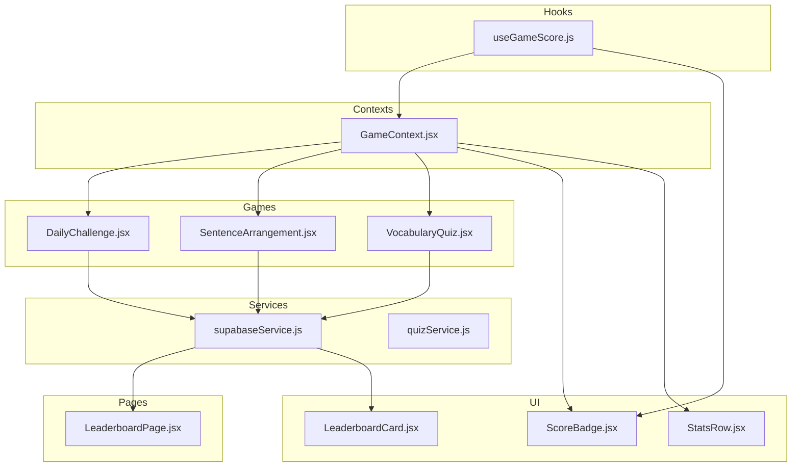
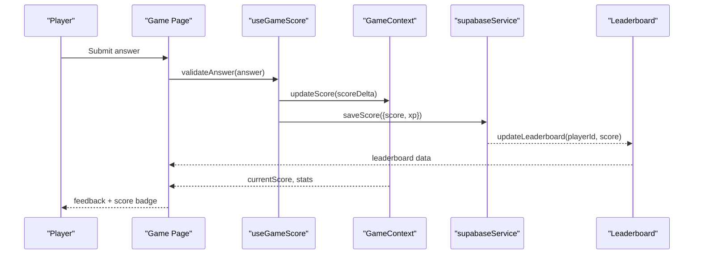
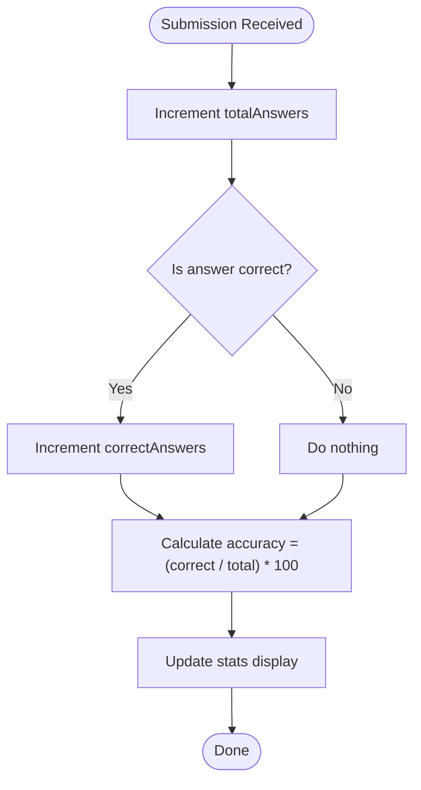
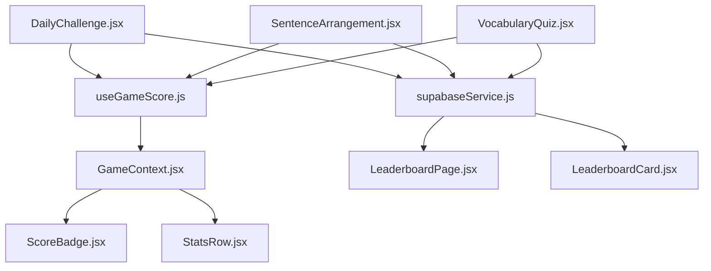

# Score Management and Statistics Tracking

<cite>
**Referenced Files in This Document**
- [useGameScore.js](file://src/hooks/useGameScore.js)
- [ScoreBadge.jsx](file://src/components/ScoreBadge.jsx)
- [GameContext.jsx](file://src/contexts/GameContext.jsx)
- [DailyChallenge.jsx](file://src/pages/games/DailyChallenge.jsx)
- [SentenceArrangement.jsx](file://src/pages/games/SentenceArrangement.jsx)
- [VocabularyQuiz.jsx](file://src/pages/games/VocabularyQuiz.jsx)
- [LeaderboardPage.jsx](file://src/pages/dashboard/LeaderboardPage.jsx)
- [LeaderboardCard.jsx](file://src/components/LeaderboardCard.jsx)
- [StatsRow.jsx](file://src/components/StatsRow.jsx)
- [supabaseService.js](file://src/services/supabaseService.js)
- [quizService.js](file://src/services/quizService.js)
</cite>

## Table of Contents
1. [Introduction](#introduction)
2. [Project Structure](#project-structure)
3. [Core Components](#core-components)
4. [Architecture Overview](#architecture-overview)
5. [Detailed Component Analysis](#detailed-component-analysis)
6. [Dependency Analysis](#dependency-analysis)
7. [Performance Considerations](#performance-considerations)
8. [Troubleshooting Guide](#troubleshooting-guide)
9. [Conclusion](#conclusion)

## Introduction
This document provides comprehensive documentation for the score management and statistics tracking system. It explains how scores are calculated across different game types, how statistics such as correct answers, total answers, and accuracy are tracked, and how these metrics integrate with XP rewards and leaderboards. It also covers the ScoreBadge component for visual representation of player scores and outlines performance considerations for real-time updates.

## Project Structure
The score management system spans several layers:
- Hooks for game-scoring logic
- Game context for state management
- Game pages implementing gameplay and scoring
- Services for persistence and external integrations
- UI components for displaying scores and statistics

**Diagram sources**
- [useGameScore.js](file://src/hooks/useGameScore.js)
- [GameContext.jsx](file://src/contexts/GameContext.jsx)
- [DailyChallenge.jsx](file://src/pages/games/DailyChallenge.jsx)
- [SentenceArrangement.jsx](file://src/pages/games/SentenceArrangement.jsx)
- [VocabularyQuiz.jsx](file://src/pages/games/VocabularyQuiz.jsx)
- [ScoreBadge.jsx](file://src/components/ScoreBadge.jsx)
- [LeaderboardCard.jsx](file://src/components/LeaderboardCard.jsx)
- [StatsRow.jsx](file://src/components/StatsRow.jsx)
- [supabaseService.js](file://src/services/supabaseService.js)
- [quizService.js](file://src/services/quizService.js)
- [LeaderboardPage.jsx](file://src/pages/dashboard/LeaderboardPage.jsx)

**Section sources**
- [useGameScore.js](file://src/hooks/useGameScore.js)
- [GameContext.jsx](file://src/contexts/GameContext.jsx)
- [DailyChallenge.jsx](file://src/pages/games/DailyChallenge.jsx)
- [SentenceArrangement.jsx](file://src/pages/games/SentenceArrangement.jsx)
- [VocabularyQuiz.jsx](file://src/pages/games/VocabularyQuiz.jsx)
- [ScoreBadge.jsx](file://src/components/ScoreBadge.jsx)
- [LeaderboardCard.jsx](file://src/components/LeaderboardCard.jsx)
- [StatsRow.jsx](file://src/components/StatsRow.jsx)
- [supabaseService.js](file://src/services/supabaseService.js)
- [quizService.js](file://src/services/quizService.js)
- [LeaderboardPage.jsx](file://src/pages/dashboard/LeaderboardPage.jsx)

## Core Components
- useGameScore hook: Centralized scoring logic for different game types, including correctness checks, streak handling, and XP reward computation.
- GameContext: Provides shared state for current game session, score, and statistics across game pages.
- ScoreBadge component: Visual indicator for player scores, integrating with the current score state.
- Statistics components: StatsRow displays aggregated stats; LeaderboardCard shows player placement and scores.
- Services: supabaseService persists scores and retrieves leaderboard data; quizService supports quiz-specific operations.

Key responsibilities:
- Scoring: Calculate points per correct answer, apply streak multipliers, and compute XP rewards.
- Statistics: Track correctAnswers, totalAnswers, and derive accuracy percentage.
- Persistence: Save scores and update leaderboards via Supabase.
- Presentation: Render scores and stats in UI components.

**Section sources**
- [useGameScore.js](file://src/hooks/useGameScore.js)
- [GameContext.jsx](file://src/contexts/GameContext.jsx)
- [ScoreBadge.jsx](file://src/components/ScoreBadge.jsx)
- [StatsRow.jsx](file://src/components/StatsRow.jsx)
- [LeaderboardCard.jsx](file://src/components/LeaderboardCard.jsx)
- [supabaseService.js](file://src/services/supabaseService.js)

## Architecture Overview
The scoring pipeline integrates game logic, state management, and persistence:

**Diagram sources**
- [useGameScore.js](file://src/hooks/useGameScore.js)
- [GameContext.jsx](file://src/contexts/GameContext.jsx)
- [supabaseService.js](file://src/services/supabaseService.js)
- [LeaderboardPage.jsx](file://src/pages/dashboard/LeaderboardPage.jsx)

## Detailed Component Analysis

### useGameScore Hook
Responsibilities:
- Validate answers and compute score deltas.
- Apply streak-based multipliers for consecutive correct answers.
- Compute XP rewards based on score and difficulty.
- Update internal statistics counters (correctAnswers, totalAnswers).

Scoring methodology:
- Base points per correct answer are determined by game type.
- Streak bonus increases reward for consecutive correct answers.
- Difficulty scaling adjusts base points and XP gain.
- Penalty logic handles incorrect answers (e.g., reset streak, optional negative scoring).

Statistics tracking:
- correctAnswers increments on correct submissions.
- totalAnswers increments on every submission.
- accuracy = correctAnswers / totalAnswers (percentage).

XP integration:
- XP is computed from final score and difficulty.
- XP contributes to player progression and unlocks rewards.

Examples of score calculation:
- Single correct answer in a basic quiz: basePoints × difficultyMultiplier.
- Three-in-a-row streak: basePoints × multiplier3 × difficultyMultiplier.
- Hard difficulty with streak: higher basePoints × larger multiplier × difficultyHard.

Leaderboard impact:
- Scores are persisted and used to rank players.
- Higher scores improve leaderboard position; ties resolved by completion time or recent activity.

**Section sources**
- [useGameScore.js](file://src/hooks/useGameScore.js)

### GameContext
Responsibilities:
- Maintains current game session state.
- Exposes score, statistics, and streak information to game pages.
- Coordinates state updates across components.

Integration points:
- Consumed by game pages to render live score and badges.
- Used by ScoreBadge to display current score.

**Section sources**
- [GameContext.jsx](file://src/contexts/GameContext.jsx)

### ScoreBadge Component
Responsibilities:
- Renders the player’s current score prominently.
- Integrates with GameContext to reflect real-time updates.
- Supports visual feedback for streaks and milestones.

Implementation highlights:
- Reads currentScore from GameContext.
- Applies visual styles for high scores or streak bonuses.
- Updates immediately upon state changes.

**Section sources**
- [ScoreBadge.jsx](file://src/components/ScoreBadge.jsx)
- [GameContext.jsx](file://src/contexts/GameContext.jsx)

### Games Pages and Scoring Integration
- DailyChallenge: Implements timed challenges with bonus multipliers for early completion.
- SentenceArrangement: Scores correctness of word order with partial credit for partially correct sequences.
- VocabularyQuiz: Standard multiple-choice scoring with immediate feedback and streak tracking.

Scoring integration:
- Each page calls useGameScore to validate answers and compute score deltas.
- GameContext accumulates totals and updates UI via ScoreBadge and StatsRow.

**Section sources**
- [DailyChallenge.jsx](file://src/pages/games/DailyChallenge.jsx)
- [SentenceArrangement.jsx](file://src/pages/games/SentenceArrangement.jsx)
- [VocabularyQuiz.jsx](file://src/pages/games/VocabularyQuiz.jsx)
- [useGameScore.js](file://src/hooks/useGameScore.js)
- [GameContext.jsx](file://src/contexts/GameContext.jsx)

### Statistics Tracking and Accuracy Calculation
Tracking fields:
- correctAnswers: Count of correct submissions.
- totalAnswers: Total submissions (including incorrect).
- accuracy: (correctAnswers / totalAnswers) × 100%.

Calculation flow:

**Diagram sources**
- [useGameScore.js](file://src/hooks/useGameScore.js)

**Section sources**
- [useGameScore.js](file://src/hooks/useGameScore.js)

### Leaderboard Integration and Positioning
Leaderboard data flow:
- Scores are saved via supabaseService after each game session.
- LeaderboardPage fetches top players and positions the current player.
- LeaderboardCard renders player info, score, and rank.

Positioning logic:
- Sorted by descending score.
- Players with equal scores share rank; subsequent rank reflects tied count.

**Section sources**
- [supabaseService.js](file://src/services/supabaseService.js)
- [LeaderboardPage.jsx](file://src/pages/dashboard/LeaderboardPage.jsx)
- [LeaderboardCard.jsx](file://src/components/LeaderboardCard.jsx)

### XP Rewards and Player Engagement Metrics
XP computation:
- Derived from final score and difficulty level.
- Optional bonuses for streaks and challenge completion.

Engagement metrics:
- gamesPlayed increments per completed session.
- Used alongside accuracy and average score to gauge player progress.

Persistence:
- Supabase stores scores and XP; leaderboard queries rank players.

**Section sources**
- [useGameScore.js](file://src/hooks/useGameScore.js)
- [supabaseService.js](file://src/services/supabaseService.js)

## Dependency Analysis

**Diagram sources**
- [useGameScore.js](file://src/hooks/useGameScore.js)
- [GameContext.jsx](file://src/contexts/GameContext.jsx)
- [DailyChallenge.jsx](file://src/pages/games/DailyChallenge.jsx)
- [SentenceArrangement.jsx](file://src/pages/games/SentenceArrangement.jsx)
- [VocabularyQuiz.jsx](file://src/pages/games/VocabularyQuiz.jsx)
- [ScoreBadge.jsx](file://src/components/ScoreBadge.jsx)
- [StatsRow.jsx](file://src/components/StatsRow.jsx)
- [supabaseService.js](file://src/services/supabaseService.js)
- [LeaderboardPage.jsx](file://src/pages/dashboard/LeaderboardPage.jsx)
- [LeaderboardCard.jsx](file://src/components/LeaderboardCard.jsx)

**Section sources**
- [useGameScore.js](file://src/hooks/useGameScore.js)
- [GameContext.jsx](file://src/contexts/GameContext.jsx)
- [DailyChallenge.jsx](file://src/pages/games/DailyChallenge.jsx)
- [SentenceArrangement.jsx](file://src/pages/games/SentenceArrangement.jsx)
- [VocabularyQuiz.jsx](file://src/pages/games/VocabularyQuiz.jsx)
- [ScoreBadge.jsx](file://src/components/ScoreBadge.jsx)
- [StatsRow.jsx](file://src/components/StatsRow.jsx)
- [supabaseService.js](file://src/services/supabaseService.js)
- [LeaderboardPage.jsx](file://src/pages/dashboard/LeaderboardPage.jsx)
- [LeaderboardCard.jsx](file://src/components/LeaderboardCard.jsx)

## Performance Considerations
- Minimize re-renders: Use stable references and memoization for score and stats updates.
- Debounce leaderboard refresh: Batch updates to reduce network calls.
- Efficient state updates: Update only changed metrics (score, streak, accuracy) rather than entire state.
- Lazy loading: Load leaderboard data on demand (e.g., when entering leaderboard page).
- Client-side caching: Cache recent leaderboard entries to avoid repeated fetches.
- Optimize rendering: Virtualize long leaderboard lists; render only visible items.

[No sources needed since this section provides general guidance]

## Troubleshooting Guide
Common issues and resolutions:
- Score not updating: Verify useGameScore is invoked on answer submission and GameContext state is updated.
- Incorrect accuracy: Ensure both correctAnswers and totalAnswers increment on every submission.
- Leaderboard not reflecting changes: Confirm supabaseService writes are successful and leaderboard queries are executed after save.
- Streak anomalies: Check streak reset conditions for incorrect answers and ensure state resets appropriately.
- XP discrepancies: Validate XP calculation uses final score and difficulty; confirm persistence of XP and score together.

**Section sources**
- [useGameScore.js](file://src/hooks/useGameScore.js)
- [GameContext.jsx](file://src/contexts/GameContext.jsx)
- [supabaseService.js](file://src/services/supabaseService.js)

## Conclusion
The score management and statistics system combines centralized scoring logic, real-time state updates, and persistent storage to deliver accurate gameplay metrics. By tracking correct answers, total answers, and accuracy, and by integrating XP rewards and leaderboard positioning, the system encourages continued engagement. The ScoreBadge component ensures visibility of player progress, while performance optimizations maintain responsiveness during real-time updates.

[No sources needed since this section summarizes without analyzing specific files]