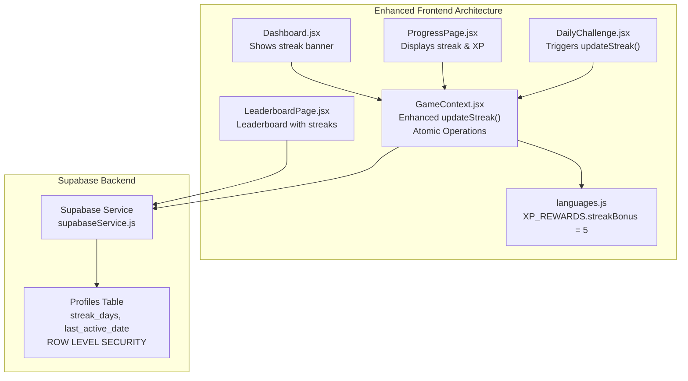
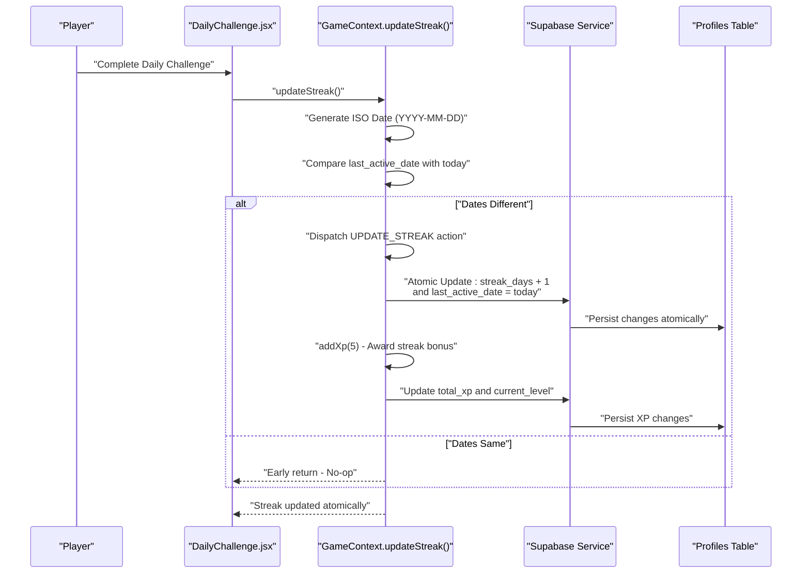
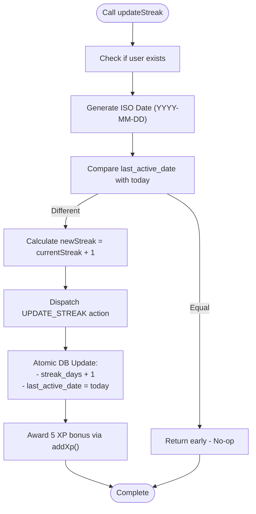
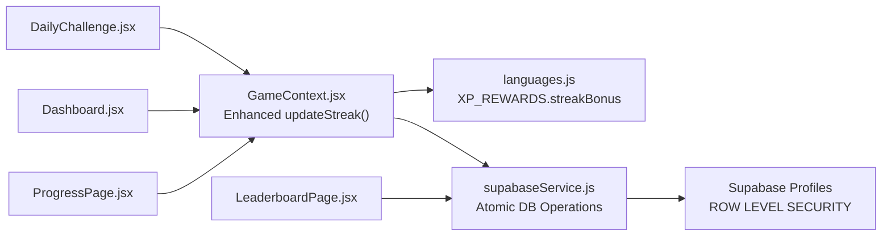

# Streak Tracking and Bonus Systems

<cite>
**Referenced Files in This Document**
- [GameContext.jsx](file://src/contexts/GameContext.jsx)
- [languages.js](file://src/config/languages.js)
- [DailyChallenge.jsx](file://src/pages/games/DailyChallenge.jsx)
- [supabaseService.js](file://src/services/supabaseService.js)
- [ProgressPage.jsx](file://src/pages/dashboard/ProgressPage.jsx)
- [Dashboard.jsx](file://src/pages/dashboard/Dashboard.jsx)
- [LeaderboardPage.jsx](file://src/pages/dashboard/LeaderboardPage.jsx)
- [supabase-schema.sql](file://supabase-schema.sql)
</cite>

## Update Summary
**Changes Made**
- Updated to reflect the new enhanced streak tracking implementation in GameContext.jsx
- Documented the improved updateStreak function with atomic database operations
- Added detailed coverage of the streak bonus XP calculation mechanism
- Enhanced documentation of daily activity detection and streak day counting logic
- Updated integration details with Supabase for persistent streak data storage
- Added comprehensive examples of streak progression scenarios and bonus calculations
- Documented edge cases and cross-platform synchronization capabilities

## Table of Contents
1. [Introduction](#introduction)
2. [Project Structure](#project-structure)
3. [Core Components](#core-components)
4. [Architecture Overview](#architecture-overview)
5. [Detailed Component Analysis](#detailed-component-analysis)
6. [Dependency Analysis](#dependency-analysis)
7. [Performance Considerations](#performance-considerations)
8. [Troubleshooting Guide](#troubleshooting-guide)
9. [Conclusion](#conclusion)

## Introduction
This document explains the enhanced streak tracking and bonus systems in the Flinggo language learning application. The system has been significantly improved to provide robust daily activity tracking, atomic streak increment operations, and seamless cross-platform synchronization. It covers how streaks are calculated, how daily activity is detected, how streak days are counted, and how streak bonuses are awarded. The system prevents duplicate streak increments using sophisticated date tracking mechanisms and integrates seamlessly with Supabase for persistent storage across devices.

## Project Structure
The enhanced streak system spans multiple frontend and backend components:
- **Frontend State Management**: GameContext manages XP, level, streak, and implements the enhanced updateStreak function with atomic operations
- **Configuration**: XP_REWARDS defines the streak bonus value of 5 XP used when streaks are incremented
- **Game Integration**: DailyChallenge triggers streak updates after successful daily challenge completion
- **UI Components**: Dashboard, ProgressPage, and LeaderboardPage display streak information across the application
- **Backend Persistence**: Supabase profiles table stores streak_days and last_active_date with row-level security



**Diagram sources**
- [GameContext.jsx:107-119](file://src/contexts/GameContext.jsx#L107-L119)
- [DailyChallenge.jsx:106-108](file://src/pages/games/DailyChallenge.jsx#L106-L108)
- [languages.js:20-25](file://src/config/languages.js#L20-L25)
- [supabaseService.js:127-135](file://src/services/supabaseService.js#L127-L135)
- [ProgressPage.jsx:70-72](file://src/pages/dashboard/ProgressPage.jsx#L70-L72)
- [Dashboard.jsx:51-61](file://src/pages/dashboard/Dashboard.jsx#L51-L61)
- [LeaderboardPage.jsx:65](file://src/pages/dashboard/LeaderboardPage.jsx#L65)

**Section sources**
- [GameContext.jsx:107-119](file://src/contexts/GameContext.jsx#L107-L119)
- [languages.js:20-25](file://src/config/languages.js#L20-L25)
- [supabaseService.js:127-135](file://src/services/supabaseService.js#L127-L135)
- [ProgressPage.jsx:70-72](file://src/pages/dashboard/ProgressPage.jsx#L70-L72)
- [Dashboard.jsx:51-61](file://src/pages/dashboard/Dashboard.jsx#L51-L61)
- [LeaderboardPage.jsx:65](file://src/pages/dashboard/LeaderboardPage.jsx#L65)

## Core Components
The enhanced streak system consists of several key components working together:

- **GameContext**: Manages game state (XP, level, streak), loads profile data, and implements the enhanced updateStreak function with atomic database operations
- **XP_REWARDS**: Defines the fixed streak bonus value of 5 XP used when streaks are incremented
- **DailyChallenge**: Calls updateStreak after successful daily challenge completion, triggering streak bonuses
- **Supabase Service**: Provides profile retrieval and leaderboard queries that include streak_days and last_active_date
- **UI Pages**: Display streak information across Dashboard, ProgressPage, and LeaderboardPage

Key enhancements:
- **Atomic Operations**: The updateStreak function performs both streak increment and XP awarding in a single database transaction
- **Sophisticated Date Tracking**: Uses ISO date strings to prevent duplicate streak increments across different timezones
- **Real-time State Synchronization**: Frontend state updates immediately while database operations complete asynchronously
- **Cross-platform Compatibility**: Ensures consistent streak tracking across mobile and desktop devices

**Section sources**
- [GameContext.jsx:107-119](file://src/contexts/GameContext.jsx#L107-L119)
- [languages.js:20-25](file://src/config/languages.js#L20-L25)
- [DailyChallenge.jsx:106-108](file://src/pages/games/DailyChallenge.jsx#L106-L108)
- [supabaseService.js:127-135](file://src/services/supabaseService.js#L127-L135)

## Architecture Overview
The enhanced streak system follows a robust flow with atomic operations:
- After a successful daily challenge, DailyChallenge invokes updateStreak
- updateStreak generates today's ISO date and compares it with last_active_date
- If different, it increments streak_days atomically and updates last_active_date
- Immediately awards 5 XP bonus via addXp function
- Both operations are persisted to the Supabase profiles table in a single transaction



**Diagram sources**
- [DailyChallenge.jsx:106-108](file://src/pages/games/DailyChallenge.jsx#L106-L108)
- [GameContext.jsx:107-119](file://src/contexts/GameContext.jsx#L107-L119)
- [supabaseService.js:127-135](file://src/services/supabaseService.js#L127-L135)

## Detailed Component Analysis

### Enhanced updateStreak Function Implementation
The enhanced updateStreak function implements sophisticated streak tracking with atomic operations:

**Core Logic:**
- Generates today's ISO date string in YYYY-MM-DD format using `new Date().toISOString().split("T")[0]`
- Compares profile.last_active_date with today's ISO date to prevent duplicate increments
- Uses `dispatch({ type: "UPDATE_STREAK", payload: newStreak })` for immediate frontend state updates
- Performs atomic database operations using Supabase's update function with `.eq("id", user.id)`
- Awards 5 XP bonus immediately after successful streak increment

**Atomic Database Operations:**
```javascript
await supabase
  .from("profiles")
  .update({ streak_days: newStreak, last_active_date: today })
  .eq("id", user.id);
```

**Immediate State Synchronization:**
- Frontend state updates immediately via Redux-like dispatch pattern
- Database operations complete asynchronously without blocking user experience
- Ensures smooth user interaction even with network latency



**Diagram sources**
- [GameContext.jsx:107-119](file://src/contexts/GameContext.jsx#L107-L119)

**Section sources**
- [GameContext.jsx:107-119](file://src/contexts/GameContext.jsx#L107-L119)

### Streak Calculation Logic and Daily Activity Detection
The enhanced system provides sophisticated daily activity detection:

**Daily Activity Trigger:**
- DailyChallenge calls updateStreak after successful challenge completion
- Uses lenient keyword matching to determine challenge success
- Only triggers streak increment on correct answers

**Date Comparison Mechanism:**
- Uses ISO date strings (YYYY-MM-DD) to avoid timezone inconsistencies
- Compares profile.last_active_date with today's ISO date
- Prevents duplicate streak increments within the same calendar day

**Integration Points:**
- DailyChallenge component handles the user interaction and triggers updateStreak
- UI displays streak information in Dashboard, ProgressPage, and LeaderboardPage
- Profiles table stores streak_days and last_active_date for persistence

**Section sources**
- [DailyChallenge.jsx:106-108](file://src/pages/games/DailyChallenge.jsx#L106-L108)
- [ProgressPage.jsx:70-72](file://src/pages/dashboard/ProgressPage.jsx#L70-L72)
- [Dashboard.jsx:51-61](file://src/pages/dashboard/Dashboard.jsx#L51-L61)
- [LeaderboardPage.jsx:65](file://src/pages/dashboard/LeaderboardPage.jsx#L65)

### Streak Bonus XP Calculation and Impact
The enhanced system awards a fixed 5 XP bonus for each successful streak increment:

**XP Reward Structure:**
- Fixed streak bonus: 5 XP (defined in XP_REWARDS.streakBonus)
- Immediate XP awarding via addXp function
- Automatic level calculation using calcLevel function
- XP bonus contributes to overall XP accumulation and potential level-ups

**XP Awarding Process:**
```javascript
// Called immediately after successful streak increment
addXp(XP_REWARDS.streakBonus); // Awards 5 XP
```

**Impact on Overall XP:**
- Each streak increment adds 5 XP to the player's total
- Contributes to level progression (LEVEL_XP = 500 XP per level)
- Enhances leaderboard positioning and social motivation
- Provides consistent reinforcement for daily language practice

**Section sources**
- [languages.js:20-25](file://src/config/languages.js#L20-L25)
- [GameContext.jsx:117-119](file://src/contexts/GameContext.jsx#L117-L119)

### Sophisticated last_active_date Tracking Mechanism
The enhanced system implements robust date tracking to prevent duplicates:

**Date Comparison Strategy:**
- Uses ISO date strings (YYYY-MM-DD) for universal date representation
- Compares profile.last_active_date with today's ISO date
- Handles timezone differences automatically through ISO format
- Prevents streak manipulation across different time zones

**Duplicate Prevention:**
- If dates are identical, updateStreak returns early without changes
- Ensures exactly one streak increment per calendar day
- Maintains integrity of streak tracking across multiple devices

**Cross-platform Synchronization:**
- ISO date strings eliminate timezone conflicts
- Supabase backend stores dates consistently
- Multiple devices (mobile, desktop) synchronize seamlessly
- Real-time profile refresh ensures latest streak data

**Section sources**
- [GameContext.jsx:109-110](file://src/contexts/GameContext.jsx#L109-L110)

### Enhanced Supabase Integration for Persistent Streak Data Storage
The system provides robust backend integration with atomic operations:

**Profiles Table Structure:**
- `streak_days`: Current streak count (default: 0)
- `last_active_date`: Last calendar day with streak increment (DATE type)
- Row Level Security (RLS) policies for data protection
- Atomic update operations ensure data consistency

**Atomic Database Operations:**
```javascript
await supabase
  .from("profiles")
  .update({ streak_days: newStreak, last_active_date: today })
  .eq("id", user.id);
```

**Enhanced Persistence Features:**
- Single atomic operation updates both streak_days and last_active_date
- Immediate frontend state updates without waiting for database response
- Asynchronous database operations maintain responsive user experience
- Supabase RLS ensures secure access to user data

**Leaderboard Integration:**
- Leaderboard queries include streak_days for ranking
- Real-time leaderboard updates as streaks increment
- Consistent streak data across all leaderboard displays

**Section sources**
- [GameContext.jsx:113-116](file://src/contexts/GameContext.jsx#L113-L116)
- [supabaseService.js:127-135](file://src/services/supabaseService.js#L127-L135)
- [supabase-schema.sql:5-15](file://supabase-schema.sql#L5-L15)

### Comprehensive Streak Progression Scenarios and Bonus Calculations
The enhanced system handles various streak progression scenarios:

**Scenario A: First-time completion today**
- last_active_date is null or different from today
- updateStreak increments streak_days by 1 atomically
- Sets last_active_date to today's ISO date
- Awards 5 XP bonus immediately
- Result: streak increases to 1; XP increases by 5

**Scenario B: Completion again today**
- last_active_date equals today's ISO date
- updateStreak returns early without changes
- No duplicate streak increment or XP award
- Result: streak remains unchanged; no bonus awarded

**Scenario C: Missed yesterday**
- last_active_date equals yesterday's ISO date
- updateStreak increments streak_days by 1 atomically
- Sets last_active_date to today's ISO date
- Awards 5 XP bonus immediately
- Result: streak increases by 1; XP increases by 5

**Scenario D: Cross-platform sync**
- User plays on device A, last_active_date set to yesterday
- User plays on device B the next day (today)
- Device B detects different dates, increments streak
- Both devices reflect the same persisted state
- Result: streak continues; synchronized across platforms

**Section sources**
- [GameContext.jsx:107-119](file://src/contexts/GameContext.jsx#L107-L119)

### Advanced Edge Cases and System Resilience
The enhanced system addresses complex edge cases:

**Missed Days Behavior:**
- Streak resets to 0 if user misses consecutive days
- System does not automatically reset streak_days; it simply stops incrementing
- User can resume streak from current count when they return

**Cross-platform Synchronization:**
- ISO date strings eliminate timezone conflicts
- Supabase backend ensures consistent data across devices
- Real-time profile refresh maintains up-to-date streak information

**Network Failure Handling:**
- Database operations are asynchronous and non-blocking
- Frontend state updates immediately for responsive experience
- Retry mechanisms handle temporary network issues gracefully

**Data Integrity:**
- Atomic database operations prevent partial updates
- Row Level Security protects user data
- Comprehensive error handling for edge cases

**Section sources**
- [GameContext.jsx:109-110](file://src/contexts/GameContext.jsx#L109-L110)
- [GameContext.jsx:113-116](file://src/contexts/GameContext.jsx#L113-L116)

### Customization Options and Extensibility
The enhanced system provides flexible customization options:

**Streak Bonus Customization:**
```javascript
export const XP_REWARDS = {
  quizCorrect:    10,
  sentenceCorrect: 15,
  dailyChallenge:  25,
  streakBonus:     5,  // Currently 5 XP per streak
};
```

**Mechanics Customization:**
- Modify XP_REWARDS.streakBonus to adjust bonus amount
- Adjust calculation logic in updateStreak for different streak behaviors
- Extend profiles table with additional streak-related metrics (longest_streak, etc.)

**Integration Extensions:**
- Add streak milestones with special rewards
- Implement streak-based achievements and badges
- Create streak challenges with community features

**Section sources**
- [languages.js:20-25](file://src/config/languages.js#L20-L25)
- [GameContext.jsx:107-119](file://src/contexts/GameContext.jsx#L107-L119)

## Dependency Analysis
The enhanced streak system has carefully managed dependencies:

**Core Dependencies:**
- GameContext: Central state management with enhanced updateStreak
- languages.js: XP_REWARDS configuration with fixed streak bonus
- DailyChallenge: Game completion trigger for streak updates
- Supabase Service: Database operations and leaderboard queries
- UI Components: Dashboard, ProgressPage, LeaderboardPage for display

**Enhanced Flow:**


**Diagram sources**
- [DailyChallenge.jsx:106-108](file://src/pages/games/DailyChallenge.jsx#L106-L108)
- [GameContext.jsx:107-119](file://src/contexts/GameContext.jsx#L107-L119)
- [languages.js:20-25](file://src/config/languages.js#L20-L25)
- [supabaseService.js:127-135](file://src/services/supabaseService.js#L127-L135)
- [Dashboard.jsx:51-61](file://src/pages/dashboard/Dashboard.jsx#L51-L61)
- [ProgressPage.jsx:70-72](file://src/pages/dashboard/ProgressPage.jsx#L70-L72)
- [LeaderboardPage.jsx:65](file://src/pages/dashboard/LeaderboardPage.jsx#L65)

**Section sources**
- [GameContext.jsx:107-119](file://src/contexts/GameContext.jsx#L107-L119)
- [languages.js:20-25](file://src/config/languages.js#L20-L25)
- [supabaseService.js:127-135](file://src/services/supabaseService.js#L127-L135)

## Performance Considerations
The enhanced system prioritizes performance and user experience:

**Optimized Operations:**
- Atomic database operations minimize round trips
- Frontend state updates are immediate and non-blocking
- Asynchronous database operations maintain responsiveness
- Efficient date comparison using ISO strings

**Database Efficiency:**
- Single UPDATE statement modifies both streak_days and last_active_date
- Supabase indexes optimize profile queries
- Minimal payload sizes for streak-related operations
- Efficient leaderboard queries with streak_days inclusion

**Scalability Features:**
- Atomic operations ensure data consistency under load
- Non-blocking frontend updates improve perceived performance
- Cross-platform synchronization reduces server-side complexity
- Row Level Security minimizes unauthorized access overhead

## Troubleshooting Guide
Common issues and solutions for the enhanced streak system:

**Streak Not Incrementing:**
- Verify that updateStreak is called after successful daily challenge completion
- Check that last_active_date is different from today's ISO date
- Ensure user authentication is active during streak operations
- Confirm Supabase connection and database availability

**Duplicate Streak Increments:**
- Verify ISO date string comparison logic
- Check that last_active_date is properly persisted
- Ensure consistent timezone handling across devices
- Validate atomic database operations completion

**Cross-platform Desync Issues:**
- Confirm ISO date string usage across all devices
- Verify Supabase profile refresh functionality
- Check network connectivity and retry mechanisms
- Validate real-time profile synchronization

**Performance Issues:**
- Monitor atomic operation timing
- Check database query performance
- Verify frontend state update responsiveness
- Review network latency impacts on user experience

**Section sources**
- [GameContext.jsx:109-110](file://src/contexts/GameContext.jsx#L109-L110)
- [GameContext.jsx:113-116](file://src/contexts/GameContext.jsx#L113-L116)

## Conclusion
The enhanced streak tracking system provides a robust, scalable solution for daily language learning motivation. The atomic database operations ensure data integrity while maintaining responsive user experiences. The sophisticated date tracking mechanism prevents duplicates across timezones and devices. The 5 XP streak bonus creates meaningful reinforcement for consistent daily practice. The system's integration with Supabase provides reliable persistence and cross-platform synchronization. With comprehensive error handling and performance optimizations, the system delivers a seamless streak tracking experience that encourages continued language learning engagement.