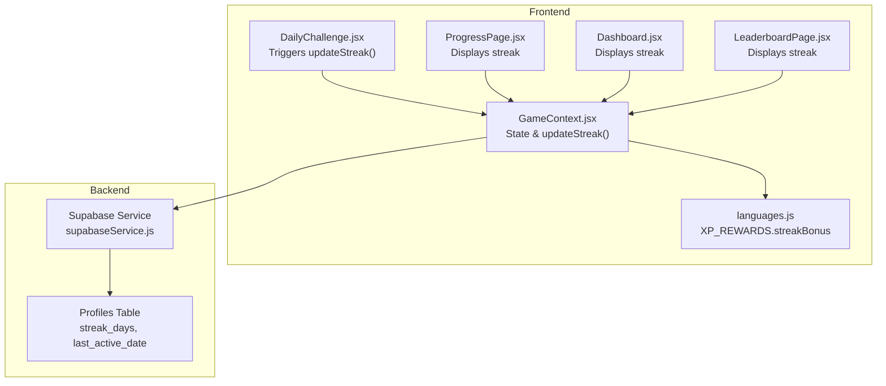
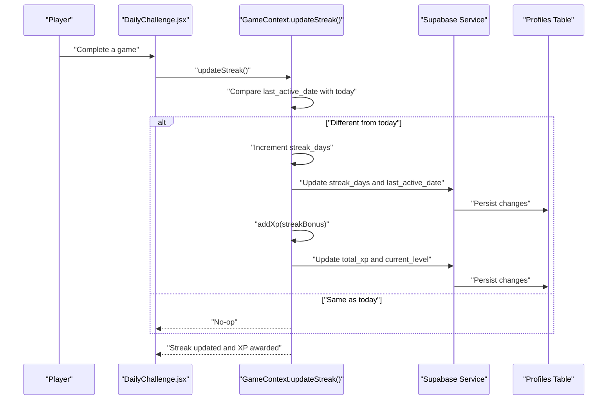
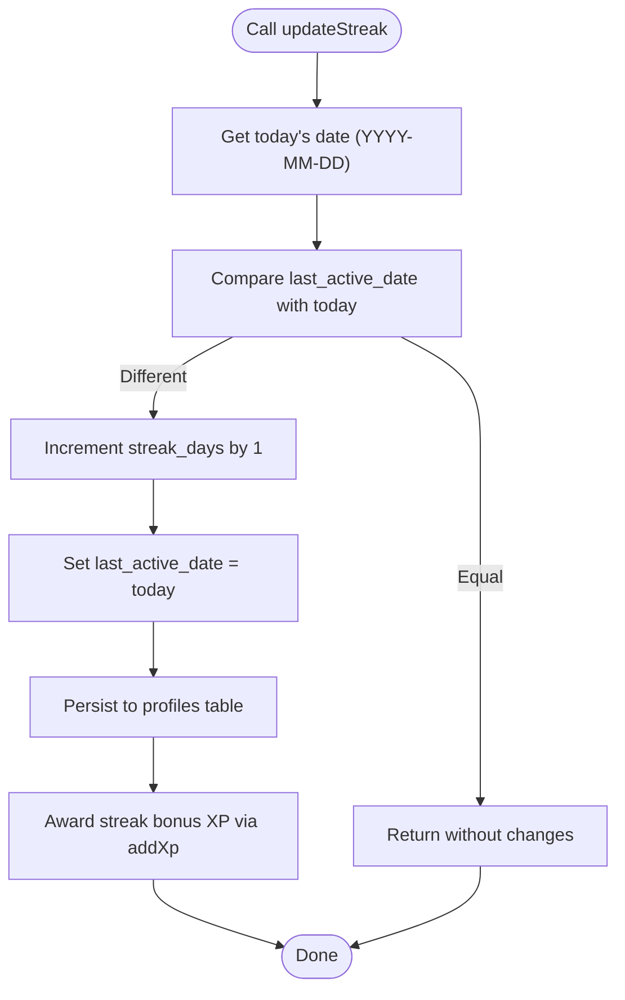
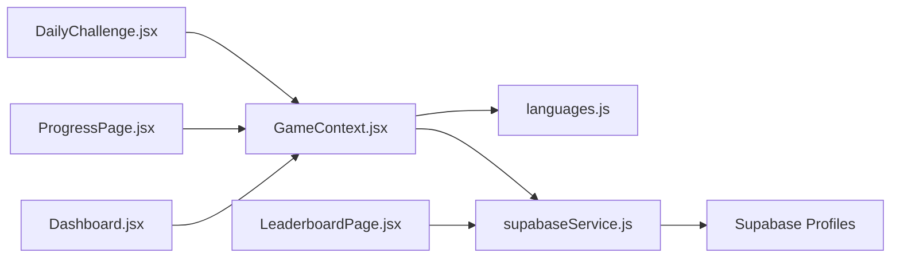

# Streak Tracking and Bonus Systems

<cite>
**Referenced Files in This Document**
- [GameContext.jsx](file://src/contexts/GameContext.jsx)
- [languages.js](file://src/config/languages.js)
- [DailyChallenge.jsx](file://src/pages/games/DailyChallenge.jsx)
- [supabaseService.js](file://src/services/supabaseService.js)
- [ProgressPage.jsx](file://src/pages/dashboard/ProgressPage.jsx)
- [Dashboard.jsx](file://src/pages/dashboard/Dashboard.jsx)
- [LeaderboardPage.jsx](file://src/pages/dashboard/LeaderboardPage.jsx)
- [supabase-schema.sql](file://supabase-schema.sql)
</cite>

## Table of Contents
1. [Introduction](#introduction)
2. [Project Structure](#project-structure)
3. [Core Components](#core-components)
4. [Architecture Overview](#architecture-overview)
5. [Detailed Component Analysis](#detailed-component-analysis)
6. [Dependency Analysis](#dependency-analysis)
7. [Performance Considerations](#performance-considerations)
8. [Troubleshooting Guide](#troubleshooting-guide)
9. [Conclusion](#conclusion)

## Introduction
This document explains the streak tracking and bonus systems in the application. It covers how streaks are calculated, how daily activity is detected, how streak days are counted, and how streak bonuses are awarded. It also documents the last_active_date tracking mechanism that prevents duplicate streak increments, the integration with Supabase for persistent storage, and edge cases such as missed days, streak resets, and cross-platform synchronization. Finally, it provides guidance on customizing streak bonus values and related game mechanics.

## Project Structure
The streak system spans several parts of the frontend and backend:
- Frontend state and logic: GameContext manages XP, level, streak, and the updateStreak function.
- Configuration: XP_REWARDS defines the streak bonus value.
- Pages and components: DailyChallenge triggers streak updates after gameplay; ProgressPage, Dashboard, and LeaderboardPage display streak data.
- Backend persistence: Supabase tables store user profiles, including streak_days and last_active_date.

**Diagram sources**
- [GameContext.jsx:107-119](file://src/contexts/GameContext.jsx#L107-L119)
- [DailyChallenge.jsx:78-79](file://src/pages/games/DailyChallenge.jsx#L78-L79)
- [languages.js:19-23](file://src/config/languages.js#L19-L23)
- [supabaseService.js:123-131](file://src/services/supabaseService.js#L123-L131)
- [ProgressPage.jsx:52-54](file://src/pages/dashboard/ProgressPage.jsx#L52-L54)
- [Dashboard.jsx:69-73](file://src/pages/dashboard/Dashboard.jsx#L69-L73)
- [LeaderboardPage.jsx:63](file://src/pages/dashboard/LeaderboardPage.jsx#L63)

**Section sources**
- [GameContext.jsx:107-119](file://src/contexts/GameContext.jsx#L107-L119)
- [languages.js:19-23](file://src/config/languages.js#L19-L23)
- [supabaseService.js:123-131](file://src/services/supabaseService.js#L123-L131)
- [ProgressPage.jsx:52-54](file://src/pages/dashboard/ProgressPage.jsx#L52-L54)
- [Dashboard.jsx:69-73](file://src/pages/dashboard/Dashboard.jsx#L69-L73)
- [LeaderboardPage.jsx:63](file://src/pages/dashboard/LeaderboardPage.jsx#L63)

## Core Components
- GameContext: Manages game state (XP, level, streak), loads profile data, and implements updateStreak to increment streak and award XP bonuses.
- XP_REWARDS: Defines the fixed streak bonus value used when a streak is incremented.
- DailyChallenge: Calls updateStreak after a successful game session.
- Supabase Service: Provides profile retrieval and leaderboard queries that include streak_days and last_active_date.
- UI Pages: Display streak information across the app.

Key responsibilities:
- Detect daily activity via updateStreak being called after gameplay.
- Prevent duplicate streak increments using last_active_date.
- Persist streak_days and last_active_date to Supabase.
- Award XP bonus upon successful streak increment.

**Section sources**
- [GameContext.jsx:107-119](file://src/contexts/GameContext.jsx#L107-L119)
- [languages.js:19-23](file://src/config/languages.js#L19-L23)
- [DailyChallenge.jsx:78-79](file://src/pages/games/DailyChallenge.jsx#L78-L79)
- [supabaseService.js:123-131](file://src/services/supabaseService.js#L123-L131)

## Architecture Overview
The streak system follows a straightforward flow:
- After a game completes successfully, DailyChallenge invokes updateStreak.
- updateStreak checks if the user has already performed an activity today using last_active_date.
- If not, it increments streak_days, updates last_active_date to today, and awards XP via addXp.
- addXp persists the updated XP and level to the profiles table.

**Diagram sources**
- [DailyChallenge.jsx:78-79](file://src/pages/games/DailyChallenge.jsx#L78-L79)
- [GameContext.jsx:107-119](file://src/contexts/GameContext.jsx#L107-L119)
- [supabaseService.js:123-131](file://src/services/supabaseService.js#L123-L131)

## Detailed Component Analysis

### updateStreak Function Implementation
The updateStreak function enforces single daily activity:
- It computes today’s date in YYYY-MM-DD format.
- It compares profile.last_active_date with today. If equal, it returns early to prevent duplicate increments.
- Otherwise, it increments streak_days by 1, updates last_active_date to today, and persists both to the profiles table.
- Immediately after persisting, it calls addXp with XP_REWARDS.streakBonus to award bonus XP.

**Diagram sources**
- [GameContext.jsx:107-119](file://src/contexts/GameContext.jsx#L107-L119)

**Section sources**
- [GameContext.jsx:107-119](file://src/contexts/GameContext.jsx#L107-L119)

### Streak Calculation Logic and Daily Activity Detection
- Daily activity is detected by invoking updateStreak after a successful game outcome.
- The system treats a “day” as a calendar date. The comparison uses ISO date strings to avoid timezone inconsistencies.
- The streak counter is stored in the profiles table under streak_days.

Integration points:
- DailyChallenge triggers updateStreak after scoring.
- UI displays streak across ProgressPage, Dashboard, and LeaderboardPage.

**Section sources**
- [DailyChallenge.jsx:78-79](file://src/pages/games/DailyChallenge.jsx#L78-L79)
- [ProgressPage.jsx:52-54](file://src/pages/dashboard/ProgressPage.jsx#L52-L54)
- [Dashboard.jsx:69-73](file://src/pages/dashboard/Dashboard.jsx#L69-L73)
- [LeaderboardPage.jsx:63](file://src/pages/dashboard/LeaderboardPage.jsx#L63)

### Streak Bonus XP Calculation and Impact
- The streak bonus is defined in XP_REWARDS.streakBonus.
- On successful streak increment, addXp is called with this value, updating total_xp and current_level in the profiles table.
- This increases the player’s XP pool and may trigger level-ups depending on thresholds.

Customization:
- Adjust XP_REWARDS.streakBonus to change the bonus amount.

**Section sources**
- [languages.js:19-23](file://src/config/languages.js#L19-L23)
- [GameContext.jsx:117-118](file://src/contexts/GameContext.jsx#L117-L118)

### last_active_date Tracking Mechanism
- last_active_date ensures that a user receives at most one streak increment per calendar day.
- The comparison is performed against today’s ISO date string.
- If equal, updateStreak returns early; otherwise, it proceeds to increment the streak.

Cross-platform note:
- Using ISO date strings avoids timezone pitfalls and supports synchronized streaks across devices.

**Section sources**
- [GameContext.jsx:109-110](file://src/contexts/GameContext.jsx#L109-L110)

### Supabase Integration for Persistent Streak Data Storage
- Profiles table stores:
  - streak_days: the current streak count.
  - last_active_date: the last calendar day the user earned streak points.
- The updateStreak function writes both fields atomically during a streak increment.
- The addXp function updates total_xp and current_level in the same transactional manner.

Relevant schema references:
- Profiles table fields are referenced in leaderboard queries and profile retrieval.

**Section sources**
- [GameContext.jsx:113-116](file://src/contexts/GameContext.jsx#L113-L116)
- [supabaseService.js:111-119](file://src/services/supabaseService.js#L111-L119)
- [supabaseService.js:123-131](file://src/services/supabaseService.js#L123-L131)
- [supabase-schema.sql:109-118](file://supabase-schema.sql#L109-L118)

### Examples of Streak Progression Scenarios and Bonus Calculations
Scenario A: First-time completion today
- last_active_date is not today.
- updateStreak increments streak_days by 1, sets last_active_date to today, and awards XP bonus.
- Result: streak increases by 1; XP increases by streakBonus.

Scenario B: Completion again today
- last_active_date equals today.
- updateStreak returns without changes.
- Result: streak remains unchanged; no duplicate bonus.

Scenario C: Missed yesterday
- last_active_date is yesterday.
- updateStreak increments streak_days by 1, sets last_active_date to today, and awards XP bonus.
- Result: streak increases by 1; XP increases by streakBonus.

Scenario D: Cross-platform sync
- User plays on device A, then device B the next day.
- Device A’s last_active_date on the previous day differs from device B’s today.
- Device B’s updateStreak increments streak_days and sets last_active_date to today.
- Result: streak continues; both devices reflect the same persisted state.

Note: These scenarios describe expected behavior based on the implementation.

### Edge Cases
- Missed days: The streak resets to 0 if the user does not complete an activity on consecutive days. The system does not automatically reset streak_days; it simply stops incrementing until the user resumes activity.
- Streak resets: There is no automatic reset logic in the provided code; streak_days continues counting from the last successful day.
- Cross-platform synchronization: Using ISO date strings and Supabase persistence ensures consistent behavior across devices.

**Section sources**
- [GameContext.jsx:109-110](file://src/contexts/GameContext.jsx#L109-L110)
- [GameContext.jsx:113-116](file://src/contexts/GameContext.jsx#L113-L116)

### Customizing Streak Bonus Values and Mechanics
To customize the streak bonus:
- Modify XP_REWARDS.streakBonus in languages.js.
- Ensure consistency with UI and leaderboard displays.

To customize streak mechanics:
- Adjust the condition in updateStreak (e.g., require multiple sessions per day).
- Add additional fields in the profiles table (e.g., longest_streak) and update them accordingly.

**Section sources**
- [languages.js:19-23](file://src/config/languages.js#L19-L23)
- [GameContext.jsx:107-119](file://src/contexts/GameContext.jsx#L107-L119)

## Dependency Analysis
The streak system depends on:
- GameContext for state management and updateStreak.
- languages.js for XP_REWARDS.streakBonus.
- Supabase service for profile persistence and leaderboard queries.

**Diagram sources**
- [DailyChallenge.jsx:78-79](file://src/pages/games/DailyChallenge.jsx#L78-L79)
- [GameContext.jsx:107-119](file://src/contexts/GameContext.jsx#L107-L119)
- [languages.js:19-23](file://src/config/languages.js#L19-L23)
- [supabaseService.js:123-131](file://src/services/supabaseService.js#L123-L131)
- [ProgressPage.jsx:52-54](file://src/pages/dashboard/ProgressPage.jsx#L52-L54)
- [Dashboard.jsx:69-73](file://src/pages/dashboard/Dashboard.jsx#L69-L73)
- [LeaderboardPage.jsx:63](file://src/pages/dashboard/LeaderboardPage.jsx#L63)

**Section sources**
- [GameContext.jsx:107-119](file://src/contexts/GameContext.jsx#L107-L119)
- [languages.js:19-23](file://src/config/languages.js#L19-L23)
- [supabaseService.js:123-131](file://src/services/supabaseService.js#L123-L131)

## Performance Considerations
- updateStreak performs a single write operation to the profiles table per streak increment, minimizing database load.
- last_active_date comparison is O(1) and avoids unnecessary writes.
- Leaderboard queries fetch only the necessary fields (including streak_days), reducing payload size.

[No sources needed since this section provides general guidance]

## Troubleshooting Guide
Common issues and resolutions:
- Streak not incrementing:
  - Verify that updateStreak is called after successful gameplay.
  - Confirm that last_active_date is not equal to today.
- Duplicate streak increments:
  - Ensure last_active_date is properly persisted and compared using ISO date strings.
- Streak resets unexpectedly:
  - The code does not reset streak_days automatically; investigate external factors or UI display logic.
- Cross-platform desync:
  - Confirm that both devices use the same timezone-aware date handling and that Supabase writes succeed.

**Section sources**
- [GameContext.jsx:109-110](file://src/contexts/GameContext.jsx#L109-L110)
- [GameContext.jsx:113-116](file://src/contexts/GameContext.jsx#L113-L116)

## Conclusion
The streak system is designed to reward consistent daily engagement with a simple, robust mechanism. It uses last_active_date to prevent duplicates, persists streak_days and last_active_date to Supabase, and awards a configurable XP bonus. The implementation is modular, easy to customize, and integrates seamlessly with the UI and leaderboard.