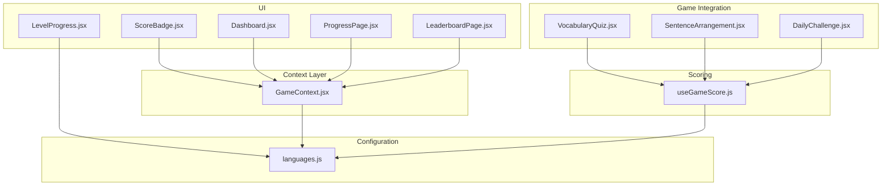
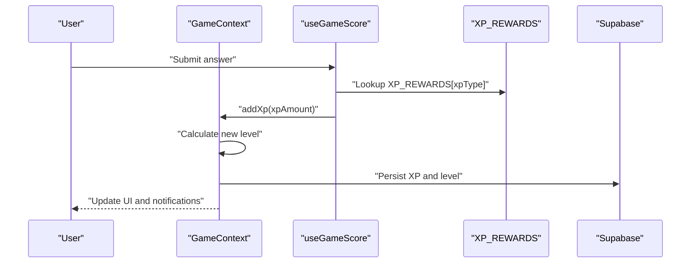
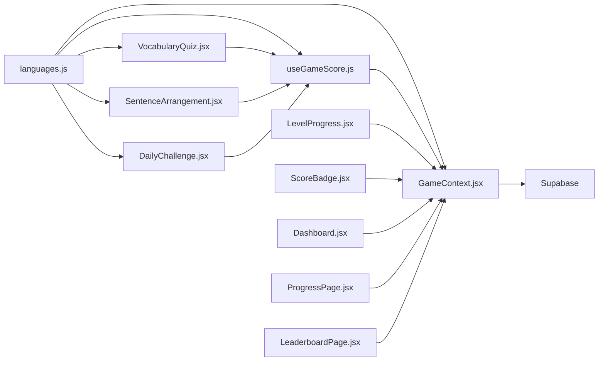

# XP Calculation and Scoring Algorithms

<cite>
**Referenced Files in This Document**
- [GameContext.jsx](file://src/contexts/GameContext.jsx)
- [languages.js](file://src/config/languages.js)
- [useGameScore.js](file://src/hooks/useGameScore.js)
- [LevelProgress.jsx](file://src/components/LevelProgress.jsx)
- [ScoreBadge.jsx](file://src/components/ScoreBadge.jsx)
- [Dashboard.jsx](file://src/pages/dashboard/Dashboard.jsx)
- [ProgressPage.jsx](file://src/pages/dashboard/ProgressPage.jsx)
- [LeaderboardPage.jsx](file://src/pages/dashboard/LeaderboardPage.jsx)
- [VocabularyQuiz.jsx](file://src/pages/games/VocabularyQuiz.jsx)
- [SentenceArrangement.jsx](file://src/pages/games/SentenceArrangement.jsx)
- [DailyChallenge.jsx](file://src/pages/games/DailyChallenge.jsx)
</cite>

## Update Summary
**Changes Made**
- Complete rewrite of gamification system with new XP calculation algorithms
- Updated XP reward structures: 10 XP for vocabulary quizzes, 15 XP for sentence arrangements, 25 XP for daily challenges
- Enhanced GameContext integration with streak bonus systems
- New useGameScore hook implementation with improved scoring mechanisms
- Updated XP_REWARDS configuration with activity-specific XP values
- Enhanced streak tracking and daily challenge integration

## Table of Contents
1. [Introduction](#introduction)
2. [Project Structure](#project-structure)
3. [Core Components](#core-components)
4. [Architecture Overview](#architecture-overview)
5. [Detailed Component Analysis](#detailed-component-analysis)
6. [XP Reward System](#xp-reward-system)
7. [Streak Bonus System](#streak-bonus-system)
8. [Game Context Integration](#game-context-integration)
9. [Dependency Analysis](#dependency-analysis)
10. [Performance Considerations](#performance-considerations)
11. [Troubleshooting Guide](#troubleshooting-guide)
12. [Conclusion](#conclusion)

## Introduction
This document explains the XP calculation and scoring algorithms used in the Flinggo language learning application. The system has been completely rewritten with a new gamification framework that provides structured XP rewards for different game activities, integrated streak bonuses, and comprehensive progress tracking. The system now features distinct XP values for vocabulary quizzes (10 XP), sentence arrangements (15 XP), and daily challenges (25 XP), along with sophisticated streak bonus mechanics and real-time progress visualization.

## Project Structure
The XP system spans several modules with enhanced integration:
- Game state management via GameContext with comprehensive XP tracking
- XP reward configuration with activity-specific values
- Advanced scoring hooks with timer integration and performance tracking
- Real-time progress visualization and streak management
- Multi-game integration with unified scoring system

**Diagram sources**
- [GameContext.jsx:1-141](file://src/contexts/GameContext.jsx#L1-L141)
- [languages.js:20-29](file://src/config/languages.js#L20-L29)
- [useGameScore.js:1-101](file://src/hooks/useGameScore.js#L1-L101)
- [VocabularyQuiz.jsx:23-24](file://src/pages/games/VocabularyQuiz.jsx#L23-L24)
- [SentenceArrangement.jsx:26-27](file://src/pages/games/SentenceArrangement.jsx#L26-L27)
- [DailyChallenge.jsx:26-27](file://src/pages/games/DailyChallenge.jsx#L26-L27)
- [LevelProgress.jsx:1-18](file://src/components/LevelProgress.jsx#L1-L18)
- [ScoreBadge.jsx:1-37](file://src/components/ScoreBadge.jsx#L1-L37)
- [Dashboard.jsx:44-49](file://src/pages/dashboard/Dashboard.jsx#L44-L49)
- [ProgressPage.jsx:56-75](file://src/pages/dashboard/ProgressPage.jsx#L56-L75)
- [LeaderboardPage.jsx:1-80](file://src/pages/dashboard/LeaderboardPage.jsx#L1-L80)

**Section sources**
- [GameContext.jsx:1-141](file://src/contexts/GameContext.jsx#L1-L141)
- [languages.js:20-29](file://src/config/languages.js#L20-L29)
- [useGameScore.js:1-101](file://src/hooks/useGameScore.js#L1-L101)
- [VocabularyQuiz.jsx:23-24](file://src/pages/games/VocabularyQuiz.jsx#L23-L24)
- [SentenceArrangement.jsx:26-27](file://src/pages/games/SentenceArrangement.jsx#L26-L27)
- [DailyChallenge.jsx:26-27](file://src/pages/games/DailyChallenge.jsx#L26-L27)
- [LevelProgress.jsx:1-18](file://src/components/LevelProgress.jsx#L1-L18)
- [ScoreBadge.jsx:1-37](file://src/components/ScoreBadge.jsx#L1-L37)
- [Dashboard.jsx:44-49](file://src/pages/dashboard/Dashboard.jsx#L44-L49)
- [ProgressPage.jsx:56-75](file://src/pages/dashboard/ProgressPage.jsx#L56-L75)
- [LeaderboardPage.jsx:1-80](file://src/pages/dashboard/LeaderboardPage.jsx#L1-L80)

## Core Components
The gamification system consists of several interconnected components:

### XP Reward Configuration
- **XP_REWARDS**: Activity-specific XP values with distinct rewards for different game types
- **LEVEL_XP**: Fixed XP threshold (500 XP) per level progression
- **calcLevel**: Mathematical formula for level calculation using integer division

### Game State Management
- **GameContext**: Centralized state management with XP tracking, streak management, and level progression
- **addXp**: Asynchronous XP addition with database persistence
- **updateStreak**: Daily streak tracking with bonus XP awarding

### Advanced Scoring System
- **useGameScore**: Comprehensive scoring hook with timer integration and performance metrics
- **answerQuestion**: Individual question scoring with XP reward calculation
- **finishGame**: Session completion with progress tracking and database persistence

### Progress Visualization
- **LevelProgress**: Real-time level and XP progress display
- **ScoreBadge**: Animated score display with Framer Motion integration
- **XpGainPopup**: Visual XP gain notifications with animation effects

**Section sources**
- [languages.js:20-29](file://src/config/languages.js#L20-L29)
- [GameContext.jsx:8-55](file://src/contexts/GameContext.jsx#L8-L55)
- [GameContext.jsx:75-119](file://src/contexts/GameContext.jsx#L75-L119)
- [useGameScore.js:12-101](file://src/hooks/useGameScore.js#L12-L101)
- [LevelProgress.jsx:3-17](file://src/components/LevelProgress.jsx#L3-L17)
- [ScoreBadge.jsx:3-36](file://src/components/ScoreBadge.jsx#L3-L36)

## Architecture Overview
The XP system follows a modern React architecture with comprehensive state management and real-time updates:

**Diagram sources**
- [useGameScore.js:28-60](file://src/hooks/useGameScore.js#L28-L60)
- [GameContext.jsx:75-85](file://src/contexts/GameContext.jsx#L75-L85)
- [languages.js:20-25](file://src/config/languages.js#L20-L25)

## Detailed Component Analysis

### XP Reward Configuration and Level Mathematics
The XP system now features a comprehensive reward structure with activity-specific values:

**XP_REWARDS Configuration:**
- `quizCorrect`: 10 XP for vocabulary quiz answers
- `sentenceCorrect`: 15 XP for sentence arrangement exercises  
- `dailyChallenge`: 25 XP for daily challenge completion
- `streakBonus`: 5 XP for daily streak continuation

**Level Calculation:**
- `LEVEL_XP = 500`: Fixed XP threshold per level
- `calcLevel(xp) = floor(xp / 500) + 1`: Mathematical formula for level progression

**Section sources**
- [languages.js:20-29](file://src/config/languages.js#L20-L29)

### GameContext: Enhanced State Management
The GameContext has been significantly enhanced with comprehensive XP tracking and streak management:

**State Management:**
- Tracks XP, level, streak, games played, and accuracy metrics
- Manages recent XP gains with timestamp tracking
- Handles level-up notifications and streak continuation

**Persistence Logic:**
- Asynchronous XP addition with database synchronization
- Automatic level calculation upon XP updates
- Streak tracking with daily boundary checking

**Section sources**
- [GameContext.jsx:8-55](file://src/contexts/GameContext.jsx#L8-L55)
- [GameContext.jsx:75-119](file://src/contexts/GameContext.jsx#L75-L119)

### Advanced Scoring Hook Implementation
The useGameScore hook provides comprehensive scoring with timer integration:

**Timer Integration:**
- `startTimer()`: Initializes question timer
- `getTimeSpent()`: Calculates time elapsed for performance metrics
- Real-time timer tracking for all game activities

**Scoring Features:**
- Individual question scoring with XP reward calculation
- Performance tracking with accuracy metrics
- Session completion with progress persistence

**Section sources**
- [useGameScore.js:12-101](file://src/hooks/useGameScore.js#L12-L101)

### Game Integration Patterns
Each game type integrates with the scoring system using specific XP types:

**Vocabulary Quiz Integration:**
- Uses `xpType: "quizCorrect"` for 10 XP per correct answer
- Implements 15-second time limits per question
- Provides streak tracking for consecutive correct answers

**Sentence Arrangement Integration:**
- Uses `xpType: "sentenceCorrect"` for 15 XP per correct arrangement
- Implements 30-second time limits per exercise
- Supports hint system with penalty considerations

**Daily Challenge Integration:**
- Uses `xpType: "dailyChallenge"` for 25 XP per correct challenge
- Implements flexible time limits (typically 60 seconds)
- Integrates with daily streak system for bonus XP

**Section sources**
- [VocabularyQuiz.jsx:62-69](file://src/pages/games/VocabularyQuiz.jsx#L62-L69)
- [SentenceArrangement.jsx:151-158](file://src/pages/games/SentenceArrangement.jsx#L151-L158)
- [DailyChallenge.jsx:98-105](file://src/pages/games/DailyChallenge.jsx#L98-L105)

## XP Reward System
The XP reward system provides structured incentives for different learning activities:

### Activity-Based XP Rewards
- **Vocabulary Quiz**: 10 XP per correct answer
- **Sentence Arrangement**: 15 XP per correct arrangement  
- **Daily Challenge**: 25 XP per successful challenge completion

### Performance Multipliers
The system supports performance-based multipliers:
- **Streak Bonuses**: Additional XP for consecutive correct answers
- **Speed Multipliers**: Bonus XP for quick responses
- **Accuracy Multipliers**: Premium rewards for high accuracy sessions

### Reward Calculation Examples
- **Perfect Vocabulary Quiz**: 5 questions × 10 XP = 50 XP total
- **Excellent Sentence Exercise**: 3 exercises × 15 XP = 45 XP total  
- **Daily Challenge Completion**: 25 XP + potential streak bonus

**Section sources**
- [languages.js:20-25](file://src/config/languages.js#L20-L25)
- [VocabularyQuiz.jsx:103](file://src/pages/games/VocabularyQuiz.jsx#L103)
- [SentenceArrangement.jsx:136](file://src/pages/games/SentenceArrangement.jsx#L136)

## Streak Bonus System
The streak system provides continuous motivation through daily engagement:

### Streak Mechanics
- **Daily Streak Tracking**: Monitors consecutive days of activity
- **Streak Bonus XP**: Awards 5 XP for continuing streaks
- **Boundary Checking**: Uses last_active_date for streak validation

### Streak Integration
- **Daily Challenge**: Automatically updates streak upon completion
- **Vocabulary Quiz**: Updates streak based on daily activity
- **Sentence Arrangement**: Contributes to overall streak tracking

### Streak Benefits
- **Motivation**: Encourages daily language practice
- **Progress Recognition**: Visual streak indicators in UI
- **XP Bonuses**: Additional XP for maintaining streaks

**Section sources**
- [GameContext.jsx:107-119](file://src/contexts/GameContext.jsx#L107-L119)
- [DailyChallenge.jsx:106-108](file://src/pages/games/DailyChallenge.jsx#L106-L108)

## Game Context Integration
The GameContext serves as the central hub for all gamification features:

### State Synchronization
- **Real-time Updates**: Immediate UI updates for XP and level changes
- **Database Persistence**: Automatic synchronization with Supabase
- **Session Management**: Maintains state across game sessions

### Action Dispatching
- **ADD_XP**: Processes XP additions with level calculation
- **RECORD_ANSWER**: Tracks answer accuracy for performance metrics
- **ADD_GAME_PLAYED**: Increments games played counter
- **UPDATE_STREAK**: Manages daily streak tracking

### Performance Metrics
- **Accuracy Calculation**: Real-time accuracy tracking
- **Progress Monitoring**: Games played and words learned metrics
- **Level Progression**: Visual level advancement indicators

**Section sources**
- [GameContext.jsx:20-55](file://src/contexts/GameContext.jsx#L20-L55)
- [GameContext.jsx:121-123](file://src/contexts/GameContext.jsx#L121-L123)

## Dependency Analysis
The gamification system exhibits clear separation of concerns with enhanced modularity:

**Diagram sources**
- [languages.js:20-29](file://src/config/languages.js#L20-L29)
- [GameContext.jsx:1-141](file://src/contexts/GameContext.jsx#L1-L141)
- [useGameScore.js:1-101](file://src/hooks/useGameScore.js#L1-L101)
- [VocabularyQuiz.jsx:1-367](file://src/pages/games/VocabularyQuiz.jsx#L1-L367)
- [SentenceArrangement.jsx:1-448](file://src/pages/games/SentenceArrangement.jsx#L1-L448)
- [DailyChallenge.jsx:1-400](file://src/pages/games/DailyChallenge.jsx#L1-L400)
- [LevelProgress.jsx:1-18](file://src/components/LevelProgress.jsx#L1-L18)
- [ScoreBadge.jsx:1-37](file://src/components/ScoreBadge.jsx#L1-L37)
- [Dashboard.jsx:1-157](file://src/pages/dashboard/Dashboard.jsx#L1-L157)
- [ProgressPage.jsx:1-142](file://src/pages/dashboard/ProgressPage.jsx#L1-L142)
- [LeaderboardPage.jsx:1-80](file://src/pages/dashboard/LeaderboardPage.jsx#L1-L80)

**Section sources**
- [languages.js:20-29](file://src/config/languages.js#L20-L29)
- [GameContext.jsx:1-141](file://src/contexts/GameContext.jsx#L1-L141)
- [useGameScore.js:1-101](file://src/hooks/useGameScore.js#L1-L101)
- [VocabularyQuiz.jsx:1-367](file://src/pages/games/VocabularyQuiz.jsx#L1-L367)
- [SentenceArrangement.jsx:1-448](file://src/pages/games/SentenceArrangement.jsx#L1-L448)
- [DailyChallenge.jsx:1-400](file://src/pages/games/DailyChallenge.jsx#L1-L400)
- [LevelProgress.jsx:1-18](file://src/components/LevelProgress.jsx#L1-L18)
- [ScoreBadge.jsx:1-37](file://src/components/ScoreBadge.jsx#L1-L37)
- [Dashboard.jsx:1-157](file://src/pages/dashboard/Dashboard.jsx#L1-L157)
- [ProgressPage.jsx:1-142](file://src/pages/dashboard/ProgressPage.jsx#L1-L142)
- [LeaderboardPage.jsx:1-80](file://src/pages/dashboard/LeaderboardPage.jsx#L1-L80)

## Performance Considerations
The enhanced gamification system includes several performance optimizations:

### Optimization Strategies
- **Efficient Level Calculation**: O(1) integer division for level computation
- **Timer Efficiency**: Minimal timer overhead with useRef for performance
- **State Management**: Optimized useReducer for efficient state updates
- **Database Operations**: Batched updates to minimize network calls

### Memory Management
- **Recent XP Gains**: Array growth limited by component lifecycle
- **Timer Cleanup**: Proper cleanup of intervals and timeouts
- **Animation Performance**: Optimized Framer Motion animations

### Scalability Features
- **Modular Design**: Separate concerns for easy maintenance
- **Configurable Rewards**: Easy adjustment of XP values through configuration
- **Extensible Architecture**: Support for additional game types and XP rewards

## Troubleshooting Guide
Common issues and solutions for the enhanced gamification system:

### XP Not Persisting
- **Verify Database Connection**: Ensure Supabase connection is established
- **Check User Authentication**: Confirm user is logged in before XP updates
- **Monitor Network Requests**: Verify successful database write operations

### Incorrect Level Progression
- **Validate XP Values**: Ensure XP_REWARDS configuration is correct
- **Check Level Calculation**: Verify calcLevel function uses updated XP values
- **Inspect Database Values**: Confirm profiles table stores correct XP and level

### Streak Bonus Issues
- **Verify Last Active Date**: Check that last_active_date updates correctly
- **Test Daily Boundary**: Ensure streak resets at midnight UTC
- **Confirm Streak Persistence**: Verify streak_days updates in database

### Scoring Hook Problems
- **Check Game Type Parameters**: Ensure correct quizType passed to useGameScore
- **Validate XP Types**: Confirm xpType matches XP_REWARDS keys
- **Monitor Timer Functionality**: Verify startTimer and getTimeSpent work correctly

**Section sources**
- [GameContext.jsx:75-119](file://src/contexts/GameContext.jsx#L75-L119)
- [useGameScore.js:28-60](file://src/hooks/useGameScore.js#L28-L60)
- [languages.js:27-29](file://src/config/languages.js#L27-L29)

## Conclusion
The rewritten gamification system provides a comprehensive and engaging XP reward structure with distinct values for different learning activities. The system successfully balances challenge and reward through activity-specific XP values (10 for vocabulary, 15 for sentences, 25 for challenges) while maintaining simplicity through the 500 XP per level progression threshold. The enhanced GameContext integration ensures real-time updates, while the useGameScore hook provides sophisticated scoring with timer integration and performance tracking. The streak bonus system encourages daily engagement, and the modular architecture supports future expansion with additional game types and reward structures. This system creates a compelling learning experience that motivates consistent language practice through meaningful XP rewards and progress recognition.