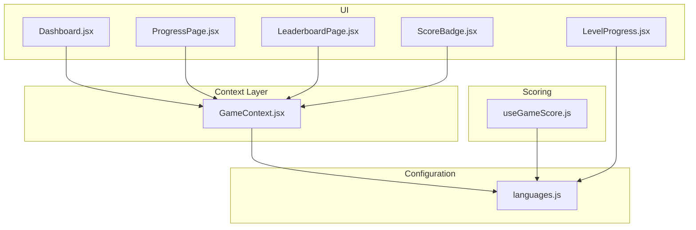
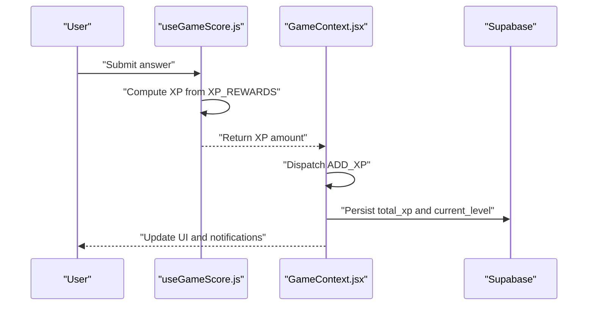
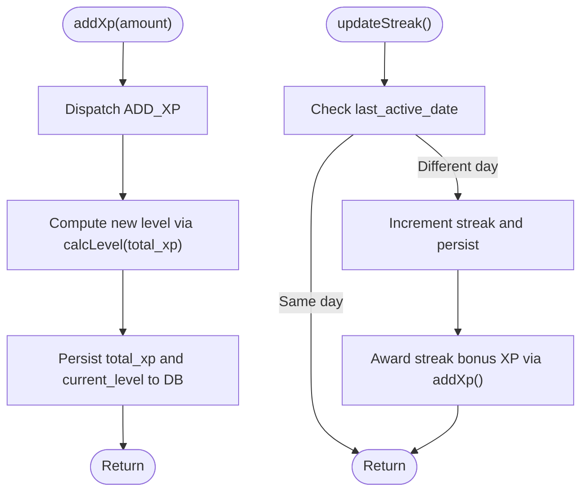
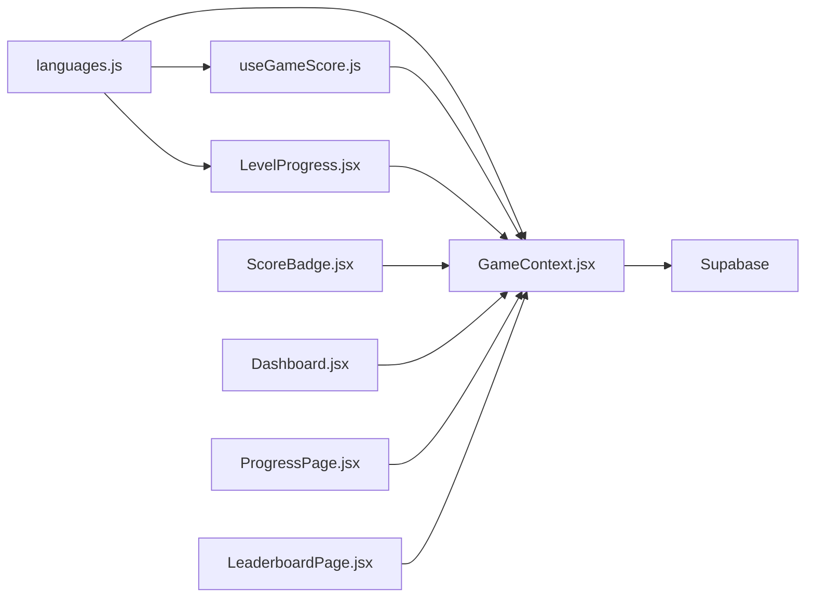

# XP Calculation and Scoring Algorithms

<cite>
**Referenced Files in This Document**
- [GameContext.jsx](file://src/contexts/GameContext.jsx)
- [languages.js](file://src/config/languages.js)
- [useGameScore.js](file://src/hooks/useGameScore.js)
- [LevelProgress.jsx](file://src/components/LevelProgress.jsx)
- [ScoreBadge.jsx](file://src/components/ScoreBadge.jsx)
- [Dashboard.jsx](file://src/pages/dashboard/Dashboard.jsx)
- [ProgressPage.jsx](file://src/pages/dashboard/ProgressPage.jsx)
- [LeaderboardPage.jsx](file://src/pages/dashboard/LeaderboardPage.jsx)
</cite>

## Table of Contents
1. [Introduction](#introduction)
2. [Project Structure](#project-structure)
3. [Core Components](#core-components)
4. [Architecture Overview](#architecture-overview)
5. [Detailed Component Analysis](#detailed-component-analysis)
6. [Dependency Analysis](#dependency-analysis)
7. [Performance Considerations](#performance-considerations)
8. [Troubleshooting Guide](#troubleshooting-guide)
9. [Conclusion](#conclusion)

## Introduction
This document explains the XP calculation and scoring algorithms used in the application. It covers the XP reward system, level progression mathematics, configuration of XP rewards, and how user actions contribute to XP accumulation. It also documents the recent XP tracking mechanism, XP notifications, and the formulas used for XP scaling and level thresholds. Finally, it provides guidance on modifying XP values and balancing gameplay difficulty.

## Project Structure
The XP system spans several modules:
- Game state management and persistence via a React context provider
- XP reward configuration and level calculation utilities
- Scoring hooks that compute XP gains from user actions
- UI components that visualize XP, levels, and XP notifications
- Pages that display progress and leaderboard information

**Diagram sources**
- [GameContext.jsx:1-140](file://src/contexts/GameContext.jsx#L1-L140)
- [languages.js:19-30](file://src/config/languages.js#L19-L30)
- [useGameScore.js:1-30](file://src/hooks/useGameScore.js#L1-L30)
- [LevelProgress.jsx:1-17](file://src/components/LevelProgress.jsx#L1-L17)
- [ScoreBadge.jsx:1-36](file://src/components/ScoreBadge.jsx#L1-L36)
- [Dashboard.jsx:34-66](file://src/pages/dashboard/Dashboard.jsx#L34-L66)
- [ProgressPage.jsx:1-64](file://src/pages/dashboard/ProgressPage.jsx#L1-L64)
- [LeaderboardPage.jsx:57-77](file://src/pages/dashboard/LeaderboardPage.jsx#L57-L77)

**Section sources**
- [GameContext.jsx:1-140](file://src/contexts/GameContext.jsx#L1-L140)
- [languages.js:19-30](file://src/config/languages.js#L19-L30)
- [useGameScore.js:1-30](file://src/hooks/useGameScore.js#L1-L30)
- [LevelProgress.jsx:1-17](file://src/components/LevelProgress.jsx#L1-L17)
- [ScoreBadge.jsx:1-36](file://src/components/ScoreBadge.jsx#L1-L36)
- [Dashboard.jsx:34-66](file://src/pages/dashboard/Dashboard.jsx#L34-L66)
- [ProgressPage.jsx:1-64](file://src/pages/dashboard/ProgressPage.jsx#L1-L64)
- [LeaderboardPage.jsx:57-77](file://src/pages/dashboard/LeaderboardPage.jsx#L57-L77)

## Core Components
- XP reward configuration and level math:
  - XP_REWARDS defines activity-based XP values and bonuses
  - LEVEL_XP sets XP threshold per level
  - calcLevel computes the player's level from total XP
- Game state management:
  - GameContext maintains XP, level, streak, recent XP gains, and level-up notifications
  - addXp updates state and persists to the backend
  - updateStreak grants streak bonus XP and persists streak
- Scoring hook:
  - useGameScore calculates XP based on correctness and activity type
- UI components:
  - LevelProgress displays current level and XP progress bar
  - XpGainPopup animates XP gain notifications
  - Dashboard and ProgressPage surfaces XP, level, and streak metrics

**Section sources**
- [languages.js:19-30](file://src/config/languages.js#L19-L30)
- [GameContext.jsx:8-55](file://src/contexts/GameContext.jsx#L8-L55)
- [GameContext.jsx:75-119](file://src/contexts/GameContext.jsx#L75-L119)
- [useGameScore.js:1-30](file://src/hooks/useGameScore.js#L1-L30)
- [LevelProgress.jsx:1-17](file://src/components/LevelProgress.jsx#L1-L17)
- [ScoreBadge.jsx:20-36](file://src/components/ScoreBadge.jsx#L20-L36)

## Architecture Overview
The XP system follows a reactive architecture:
- Configuration module exports XP_REWARDS and calcLevel
- GameContext orchestrates state transitions and persistence
- Scoring hooks compute XP gains from user actions
- UI components render XP, levels, and notifications
- Backend persists XP, level, streak, and last active date

**Diagram sources**
- [useGameScore.js:1-30](file://src/hooks/useGameScore.js#L1-L30)
- [GameContext.jsx:75-85](file://src/contexts/GameContext.jsx#L75-L85)

## Detailed Component Analysis

### XP Reward Configuration and Level Mathematics
- XP_REWARDS:
  - Defines base XP values for different activities
  - Includes streakBonus for daily streak continuation
- LEVEL_XP:
  - Fixed XP threshold per level
- calcLevel:
  - Integer division-based level computation with offset

Implementation highlights:
- XP_REWARDS is imported and used in both GameContext and useGameScore
- calcLevel is used to compute levels during state updates and UI rendering

**Section sources**
- [languages.js:19-30](file://src/config/languages.js#L19-L30)
- [GameContext.jsx:2,24-27](file://src/contexts/GameContext.jsx#L2,L24-L27)
- [useGameScore.js:3,24](file://src/hooks/useGameScore.js#L3,L24)

### GameContext: State Management and Persistence
Responsibilities:
- Initialize state with XP, level, streak, and counters
- Dispatch actions to update XP, level, streak, and recent gains
- Persist XP and computed level to the backend
- Compute accuracy from recorded answers
- Grant streak bonus XP and persist streak

Key behaviors:
- ADD_XP action updates XP, computes new level, triggers level-up flag, and appends recent XP gain
- addXp persists total_xp and current_level
- updateStreak checks last active date, increments streak, persists, and awards streak bonus XP

**Diagram sources**
- [GameContext.jsx:75-119](file://src/contexts/GameContext.jsx#L75-L119)
- [languages.js:28](file://src/config/languages.js#L28)

**Section sources**
- [GameContext.jsx:8-55](file://src/contexts/GameContext.jsx#L8-L55)
- [GameContext.jsx:75-119](file://src/contexts/GameContext.jsx#L75-L119)

### Scoring Hook: Computing XP from User Actions
The scoring hook determines XP based on correctness and activity type:
- Uses XP_REWARDS[xpType] for the base XP value
- If incorrect, XP is zero
- Returns the computed XP amount

Integration points:
- Called after answer submission to compute XP gain
- Used alongside GameContext.addXp to update state and persist

**Section sources**
- [useGameScore.js:1-30](file://src/hooks/useGameScore.js#L1-L30)

### Level Progress Visualization
The LevelProgress component:
- Computes current level using calcLevel when not provided
- Calculates XP within the current level using modulo LEVEL_XP
- Renders a progress bar and percentage indicator

**Section sources**
- [LevelProgress.jsx:1-17](file://src/components/LevelProgress.jsx#L1-L17)
- [languages.js:26-28](file://src/config/languages.js#L26-L28)

### XP Gain Notifications
The XpGainPopup component:
- Animates upward movement with fade-out for positive XP amounts
- Uses Framer Motion for smooth transitions
- Integrates with GameContext recentXpGains for timing and display

**Section sources**
- [ScoreBadge.jsx:20-36](file://src/components/ScoreBadge.jsx#L20-L36)
- [GameContext.jsx:24-34](file://src/contexts/GameContext.jsx#L24-L34)

### Dashboard and Progress Pages
- Dashboard displays XP, level, streak, and a level progress card
- ProgressPage aggregates activity metrics and shows XP, accuracy, and streak
- LeaderboardPage shows user rankings with XP and streak

**Section sources**
- [Dashboard.jsx:34-66](file://src/pages/dashboard/Dashboard.jsx#L34-L66)
- [ProgressPage.jsx:1-64](file://src/pages/dashboard/ProgressPage.jsx#L1-L64)
- [LeaderboardPage.jsx:57-77](file://src/pages/dashboard/LeaderboardPage.jsx#L57-L77)

## Dependency Analysis
The XP system exhibits clear separation of concerns:
- Configuration (languages.js) provides constants and functions
- GameContext depends on configuration and manages state/persistence
- Scoring hook depends on configuration for XP values
- UI components depend on configuration and GameContext for rendering

**Diagram sources**
- [languages.js:19-30](file://src/config/languages.js#L19-L30)
- [GameContext.jsx:1-140](file://src/contexts/GameContext.jsx#L1-L140)
- [useGameScore.js:1-30](file://src/hooks/useGameScore.js#L1-L30)
- [LevelProgress.jsx:1-17](file://src/components/LevelProgress.jsx#L1-L17)
- [ScoreBadge.jsx:1-36](file://src/components/ScoreBadge.jsx#L1-L36)
- [Dashboard.jsx:34-66](file://src/pages/dashboard/Dashboard.jsx#L34-L66)
- [ProgressPage.jsx:1-64](file://src/pages/dashboard/ProgressPage.jsx#L1-L64)
- [LeaderboardPage.jsx:57-77](file://src/pages/dashboard/LeaderboardPage.jsx#L57-L77)

**Section sources**
- [languages.js:19-30](file://src/config/languages.js#L19-L30)
- [GameContext.jsx:1-140](file://src/contexts/GameContext.jsx#L1-L140)
- [useGameScore.js:1-30](file://src/hooks/useGameScore.js#L1-L30)
- [LevelProgress.jsx:1-17](file://src/components/LevelProgress.jsx#L1-L17)
- [ScoreBadge.jsx:1-36](file://src/components/ScoreBadge.jsx#L1-L36)
- [Dashboard.jsx:34-66](file://src/pages/dashboard/Dashboard.jsx#L34-L66)
- [ProgressPage.jsx:1-64](file://src/pages/dashboard/ProgressPage.jsx#L1-L64)
- [LeaderboardPage.jsx:57-77](file://src/pages/dashboard/LeaderboardPage.jsx#L57-L77)

## Performance Considerations
- Level computation is O(1) using integer arithmetic
- Recent XP gains array grows linearly with events; consider capping length for memory efficiency
- UI animations are lightweight but can be optimized by limiting concurrent animations
- Backend writes occur on XP and streak updates; batching updates could reduce network calls

## Troubleshooting Guide
Common issues and resolutions:
- XP not persisting:
  - Verify user context and Supabase connection
  - Confirm addXp is called and backend update completes
- Incorrect level:
  - Ensure calcLevel uses the updated total XP
  - Check that LEVEL_XP remains constant across sessions
- Streak bonus not awarded:
  - Confirm last_active_date differs from today
  - Verify updateStreak executes and calls addXp with XP_REWARDS.streakBonus
- XP notifications not visible:
  - Ensure recentXpGains contains recent entries
  - Confirm XpGainPopup receives positive amounts and show flags

**Section sources**
- [GameContext.jsx:75-119](file://src/contexts/GameContext.jsx#L75-L119)
- [languages.js:26-28](file://src/config/languages.js#L26-L28)

## Conclusion
The XP system combines a simple configuration-driven reward model with robust state management and persistence. Base XP values, streak bonuses, and level thresholds are centralized for maintainability. The scoring hook and GameContext coordinate user actions, state updates, and backend persistence. UI components provide immediate feedback and progress visualization. To balance gameplay difficulty, adjust XP_REWARDS and LEVEL_XP while monitoring player engagement metrics.