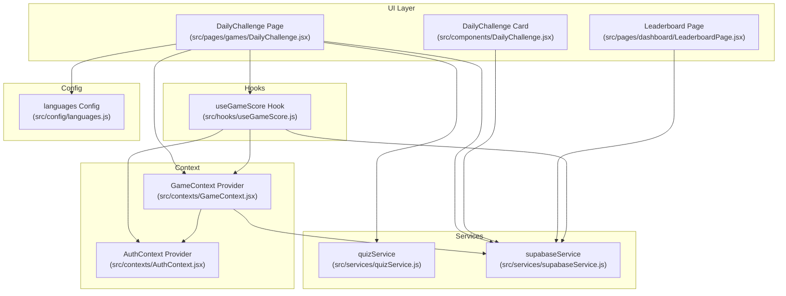
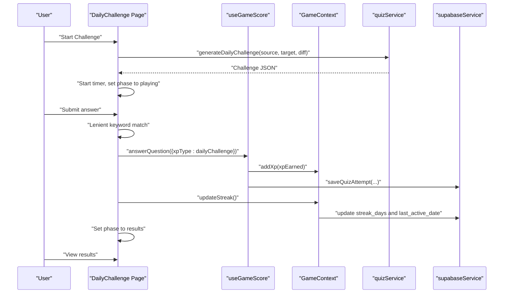
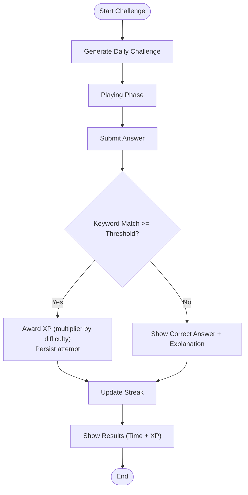
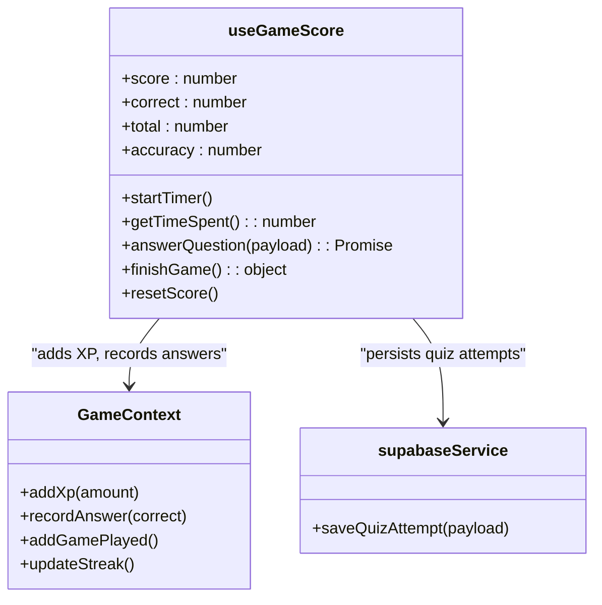
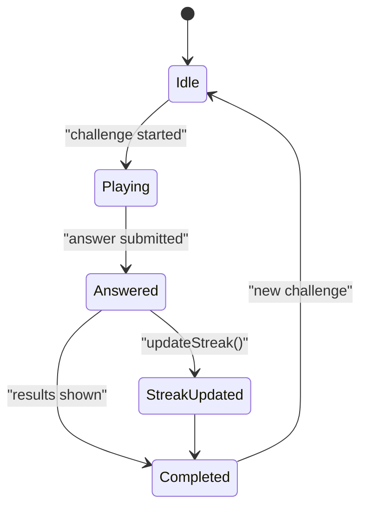
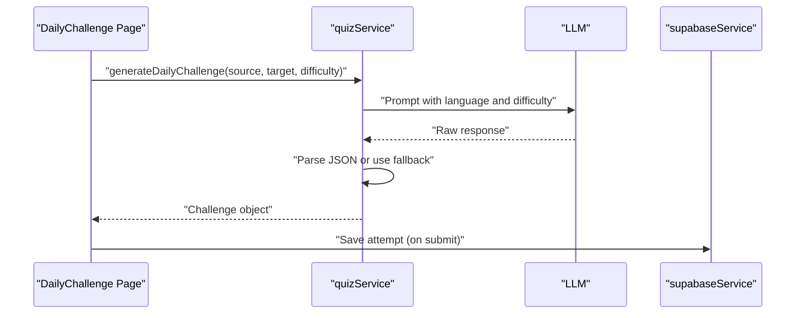
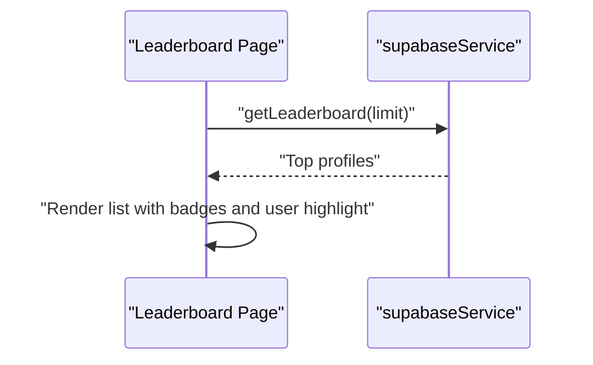
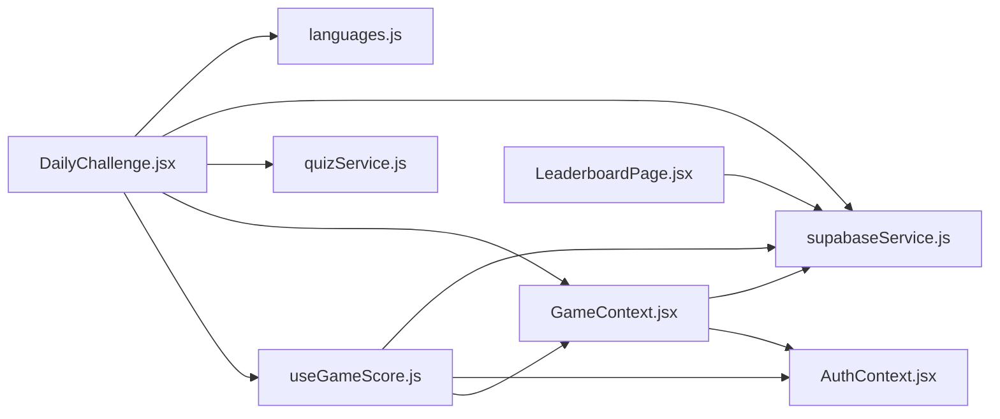

# Daily Challenge

<cite>
**Referenced Files in This Document**
- [DailyChallenge.jsx](file://src/pages/games/DailyChallenge.jsx)
- [DailyChallenge.jsx](file://src/components/DailyChallenge.jsx)
- [useGameScore.js](file://src/hooks/useGameScore.js)
- [GameContext.jsx](file://src/contexts/GameContext.jsx)
- [quizService.js](file://src/services/quizService.js)
- [supabaseService.js](file://src/services/supabaseService.js)
- [languages.js](file://src/config/languages.js)
- [LeaderboardPage.jsx](file://src/pages/dashboard/LeaderboardPage.jsx)
- [AuthContext.jsx](file://src/contexts/AuthContext.jsx)
</cite>

## Table of Contents
1. [Introduction](#introduction)
2. [Project Structure](#project-structure)
3. [Core Components](#core-components)
4. [Architecture Overview](#architecture-overview)
5. [Detailed Component Analysis](#detailed-component-analysis)
6. [Dependency Analysis](#dependency-analysis)
7. [Performance Considerations](#performance-considerations)
8. [Troubleshooting Guide](#troubleshooting-guide)
9. [Conclusion](#conclusion)
10. [Appendices](#appendices)

## Introduction
This document explains the daily challenge game system, focusing on timed gameplay mechanics, challenge objectives, streak integration, and gamification. It documents how daily challenges are generated, distributed, and tracked within the gamification framework. It also covers the integration with the useGameScore hook for real-time score calculation, streak tracking, and XP bonus systems, along with social and competitive aspects such as leaderboard integration and daily rankings. Finally, it addresses psychological aspects of daily engagement, habit formation, and motivation through gamified rewards, and discusses balancing challenge difficulty and accessibility.

## Project Structure
The daily challenge system spans several layers:
- UI pages and components for challenge presentation and interaction
- Hooks for scoring and timing
- Context providers for global game state (XP, streak, level)
- Services for challenge generation and persistence
- Configuration for languages, difficulty, and XP rewards

**Diagram sources**
- [DailyChallenge.jsx:1-249](file://src/pages/games/DailyChallenge.jsx#L1-L249)
- [DailyChallenge.jsx:1-57](file://src/components/DailyChallenge.jsx#L1-L57)
- [useGameScore.js:1-76](file://src/hooks/useGameScore.js#L1-L76)
- [GameContext.jsx:1-141](file://src/contexts/GameContext.jsx#L1-L141)
- [quizService.js:1-154](file://src/services/quizService.js#L1-L154)
- [supabaseService.js:1-132](file://src/services/supabaseService.js#L1-L132)
- [languages.js:1-30](file://src/config/languages.js#L1-L30)
- [LeaderboardPage.jsx:1-78](file://src/pages/dashboard/LeaderboardPage.jsx#L1-L78)
- [AuthContext.jsx:1-101](file://src/contexts/AuthContext.jsx#L1-L101)

**Section sources**
- [DailyChallenge.jsx:1-249](file://src/pages/games/DailyChallenge.jsx#L1-L249)
- [useGameScore.js:1-76](file://src/hooks/useGameScore.js#L1-L76)
- [GameContext.jsx:1-141](file://src/contexts/GameContext.jsx#L1-L141)
- [quizService.js:1-154](file://src/services/quizService.js#L1-L154)
- [supabaseService.js:1-132](file://src/services/supabaseService.js#L1-L132)
- [languages.js:1-30](file://src/config/languages.js#L1-L30)
- [LeaderboardPage.jsx:1-78](file://src/pages/dashboard/LeaderboardPage.jsx#L1-L78)
- [AuthContext.jsx:1-101](file://src/contexts/AuthContext.jsx#L1-L101)

## Core Components
- DailyChallenge page: orchestrates challenge lifecycle, timers, submission, feedback, XP awarding, and streak updates.
- useGameScore hook: manages score, correctness counters, timing, and persists quiz attempts with XP.
- GameContext provider: centralizes XP, level, streak, and game statistics; persists to Supabase and awards streak bonuses.
- quizService: generates daily translation challenges using LLMs with fallbacks.
- supabaseService: persists quiz attempts, daily challenges, and retrieves leaderboard data.
- languages config: defines languages, difficulty levels, XP rewards, and level calculation.

Key responsibilities:
- Timed gameplay: start timer on challenge start, stop on submission, persist time spent.
- Challenge objectives: lenient keyword matching for translations; difficulty affects XP multiplier.
- Streak integration: daily streak updates and XP bonus upon successful completion.
- Gamification: XP rewards, level progression, leaderboard visibility.

**Section sources**
- [DailyChallenge.jsx:1-249](file://src/pages/games/DailyChallenge.jsx#L1-L249)
- [useGameScore.js:1-76](file://src/hooks/useGameScore.js#L1-L76)
- [GameContext.jsx:1-141](file://src/contexts/GameContext.jsx#L1-L141)
- [quizService.js:66-88](file://src/services/quizService.js#L66-L88)
- [supabaseService.js:32-58](file://src/services/supabaseService.js#L32-L58)
- [languages.js:20-25](file://src/config/languages.js#L20-L25)

## Architecture Overview
The daily challenge follows a clear separation of concerns:
- UI renders challenge setup, playing, and results phases.
- Hook encapsulates scoring and timing logic.
- Context manages global game state and persistence.
- Services handle LLM-generated content and database operations.
- Configuration defines reward mechanics and difficulty scaling.

**Diagram sources**
- [DailyChallenge.jsx:26-85](file://src/pages/games/DailyChallenge.jsx#L26-L85)
- [useGameScore.js:23-55](file://src/hooks/useGameScore.js#L23-L55)
- [GameContext.jsx:107-119](file://src/contexts/GameContext.jsx#L107-L119)
- [quizService.js:66-88](file://src/services/quizService.js#L66-L88)
- [supabaseService.js:32-45](file://src/services/supabaseService.js#L32-L45)

## Detailed Component Analysis

### DailyChallenge Page (Timed Gameplay and Challenge Flow)
Responsibilities:
- Phase management: setup, playing, results.
- Challenge generation: selects languages and difficulty, requests LLM challenge, starts timer.
- Submission and validation: lenient keyword matching, XP multiplier by difficulty, streak update.
- Persistence: saves quiz attempt with time and XP.
- Results: displays time and XP earned.

Implementation highlights:
- Timer: started on challenge start and stopped on submission.
- Validation: checks if user’s answer contains a threshold fraction of keywords.
- XP multiplier: increases XP for higher difficulties.
- Streak: increments streak and awards bonus XP on successful completion.

**Diagram sources**
- [DailyChallenge.jsx:26-85](file://src/pages/games/DailyChallenge.jsx#L26-L85)
- [languages.js:20-25](file://src/config/languages.js#L20-L25)

**Section sources**
- [DailyChallenge.jsx:1-249](file://src/pages/games/DailyChallenge.jsx#L1-L249)

### useGameScore Hook (Real-Time Scoring and Timing)
Responsibilities:
- Track score, correct answers, total attempts, and accuracy.
- Measure time spent per attempt and expose elapsed time.
- Persist quiz attempts to the database with XP and timing metadata.
- Integrate with GameContext to add XP and record answers.

Key behaviors:
- answerQuestion: computes XP based on correctness and XP type, updates counters, persists attempt, resets timer.
- finishGame: finalizes stats and returns summary.
- resetScore: clears counters and restarts timer.

**Diagram sources**
- [useGameScore.js:1-76](file://src/hooks/useGameScore.js#L1-L76)
- [GameContext.jsx:76-119](file://src/contexts/GameContext.jsx#L76-L119)
- [supabaseService.js:32-45](file://src/services/supabaseService.js#L32-L45)

**Section sources**
- [useGameScore.js:1-76](file://src/hooks/useGameScore.js#L1-L76)

### GameContext Provider (XP, Streak, Level, and Persistence)
Responsibilities:
- Central state for XP, level, streak, games played, and answer statistics.
- Persist XP and level to Supabase on XP gain.
- Record answers and games played.
- Update streak daily if not already updated today and award streak bonus XP.

**Diagram sources**
- [GameContext.jsx:107-119](file://src/contexts/GameContext.jsx#L107-L119)

**Section sources**
- [GameContext.jsx:1-141](file://src/contexts/GameContext.jsx#L1-L141)

### Challenge Generation and Distribution
Responsibilities:
- Generate daily translation challenges using LLM prompts tailored to source/target languages and difficulty.
- Provide fallbacks when LLM parsing fails.
- Persist daily challenges to the database.

**Diagram sources**
- [quizService.js:66-88](file://src/services/quizService.js#L66-L88)
- [supabaseService.js:32-45](file://src/services/supabaseService.js#L32-L45)

**Section sources**
- [quizService.js:66-88](file://src/services/quizService.js#L66-L88)
- [supabaseService.js:89-107](file://src/services/supabaseService.js#L89-L107)

### Leaderboard Integration and Rankings
Responsibilities:
- Fetch top profiles ordered by XP.
- Display ranks, levels, streaks, and XP totals.
- Highlight current user.

**Diagram sources**
- [LeaderboardPage.jsx:12-17](file://src/pages/dashboard/LeaderboardPage.jsx#L12-L17)
- [supabaseService.js:111-119](file://src/services/supabaseService.js#L111-L119)

**Section sources**
- [LeaderboardPage.jsx:1-78](file://src/pages/dashboard/LeaderboardPage.jsx#L1-L78)
- [supabaseService.js:111-119](file://src/services/supabaseService.js#L111-L119)

### Social and Competitive Aspects
- Public leaderboard: encourages competition by showcasing top performers.
- Streak visibility: promotes consistency and daily engagement.
- XP rewards: reinforce correct answers and challenge completion.
- Difficulty scaling: allows varied challenge intensity to suit different skill levels.

**Section sources**
- [LeaderboardPage.jsx:1-78](file://src/pages/dashboard/LeaderboardPage.jsx#L1-L78)
- [GameContext.jsx:107-119](file://src/contexts/GameContext.jsx#L107-L119)
- [languages.js:20-25](file://src/config/languages.js#L20-L25)

### Psychological Aspects and Habit Formation
- Immediate feedback: correct/incorrect messages and XP awarding.
- Timed challenges: introduce mild pressure and focus.
- Streak bonuses: encourage daily participation and consistency.
- Difficulty tiers: balance challenge and accessibility to sustain engagement.

**Section sources**
- [DailyChallenge.jsx:50-80](file://src/pages/games/DailyChallenge.jsx#L50-L80)
- [GameContext.jsx:107-119](file://src/contexts/GameContext.jsx#L107-L119)
- [languages.js:14-18](file://src/config/languages.js#L14-L18)

## Dependency Analysis
High-level dependencies:
- DailyChallenge page depends on useGameScore, GameContext, quizService, and supabaseService.
- useGameScore depends on GameContext and AuthContext for user context and on supabaseService for persistence.
- GameContext depends on AuthContext and Supabase for profile data and persistence.
- quizService depends on language configuration and LLM services.
- Leaderboard page depends on supabaseService.

**Diagram sources**
- [DailyChallenge.jsx:1-249](file://src/pages/games/DailyChallenge.jsx#L1-L249)
- [useGameScore.js:1-76](file://src/hooks/useGameScore.js#L1-L76)
- [GameContext.jsx:1-141](file://src/contexts/GameContext.jsx#L1-L141)
- [quizService.js:1-154](file://src/services/quizService.js#L1-L154)
- [supabaseService.js:1-132](file://src/services/supabaseService.js#L1-L132)
- [languages.js:1-30](file://src/config/languages.js#L1-L30)
- [LeaderboardPage.jsx:1-78](file://src/pages/dashboard/LeaderboardPage.jsx#L1-L78)
- [AuthContext.jsx:1-101](file://src/contexts/AuthContext.jsx#L1-L101)

**Section sources**
- [DailyChallenge.jsx:1-249](file://src/pages/games/DailyChallenge.jsx#L1-L249)
- [useGameScore.js:1-76](file://src/hooks/useGameScore.js#L1-L76)
- [GameContext.jsx:1-141](file://src/contexts/GameContext.jsx#L1-L141)
- [quizService.js:1-154](file://src/services/quizService.js#L1-L154)
- [supabaseService.js:1-132](file://src/services/supabaseService.js#L1-L132)
- [languages.js:1-30](file://src/config/languages.js#L1-L30)
- [LeaderboardPage.jsx:1-78](file://src/pages/dashboard/LeaderboardPage.jsx#L1-L78)
- [AuthContext.jsx:1-101](file://src/contexts/AuthContext.jsx#L1-L101)

## Performance Considerations
- Challenge generation: offload to LLM services; cache or pre-generate daily challenges to reduce latency.
- Timer precision: rely on client-side timers; ensure cleanup to prevent memory leaks.
- Database writes: batch or debounce XP updates if needed; current implementation writes per attempt.
- Leaderboard queries: limit results and paginate if growth requires.

[No sources needed since this section provides general guidance]

## Troubleshooting Guide
Common issues and resolutions:
- Challenge generation failures: quizService falls back to predefined challenges when parsing fails.
- Streak not updating: ensure last_active_date is not today and user is authenticated.
- Missing XP persistence: verify user context and Supabase write permissions.
- Leaderboard empty: confirm profile entries and ordering by XP.

**Section sources**
- [quizService.js:82-87](file://src/services/quizService.js#L82-L87)
- [GameContext.jsx:107-119](file://src/contexts/GameContext.jsx#L107-L119)
- [supabaseService.js:32-45](file://src/services/supabaseService.js#L32-L45)
- [LeaderboardPage.jsx:12-17](file://src/pages/dashboard/LeaderboardPage.jsx#L12-L17)

## Conclusion
The daily challenge system integrates timed gameplay, flexible difficulty, and robust gamification through XP, streaks, and leaderboard visibility. The useGameScore hook centralizes scoring and persistence, while GameContext maintains global state and streak bonuses. quizService and supabaseService provide scalable challenge generation and persistence. Together, these components support habit formation, motivation, and healthy competition.

[No sources needed since this section summarizes without analyzing specific files]

## Appendices

### Implementation Examples

- Challenge timing and submission
  - Start challenge: [DailyChallenge.jsx:26-44](file://src/pages/games/DailyChallenge.jsx#L26-L44)
  - Submit answer and compute XP: [DailyChallenge.jsx:50-80](file://src/pages/games/DailyChallenge.jsx#L50-L80)
  - Persist attempt: [useGameScore.js:36-51](file://src/hooks/useGameScore.js#L36-L51)

- User progress monitoring
  - Score and accuracy: [useGameScore.js:70-74](file://src/hooks/useGameScore.js#L70-L74)
  - XP and streak state: [GameContext.jsx:8-18](file://src/contexts/GameContext.jsx#L8-L18)

- Completion validation
  - Keyword-based matching: [DailyChallenge.jsx:55-60](file://src/pages/games/DailyChallenge.jsx#L55-L60)
  - XP multiplier by difficulty: [DailyChallenge.jsx:69-76](file://src/pages/games/DailyChallenge.jsx#L69-L76)

- Streak integration
  - Update streak and bonus XP: [GameContext.jsx:107-119](file://src/contexts/GameContext.jsx#L107-L119)
  - Streak banner in UI: [DailyChallenge.jsx:95-104](file://src/pages/games/DailyChallenge.jsx#L95-L104)

- Leaderboard integration
  - Fetch top profiles: [LeaderboardPage.jsx:12-17](file://src/pages/dashboard/LeaderboardPage.jsx#L12-L17)
  - Render ranks and streaks: [LeaderboardPage.jsx:39-70](file://src/pages/dashboard/LeaderboardPage.jsx#L39-L70)

**Section sources**
- [DailyChallenge.jsx:26-80](file://src/pages/games/DailyChallenge.jsx#L26-L80)
- [useGameScore.js:36-51](file://src/hooks/useGameScore.js#L36-L51)
- [GameContext.jsx:107-119](file://src/contexts/GameContext.jsx#L107-L119)
- [LeaderboardPage.jsx:12-70](file://src/pages/dashboard/LeaderboardPage.jsx#L12-L70)