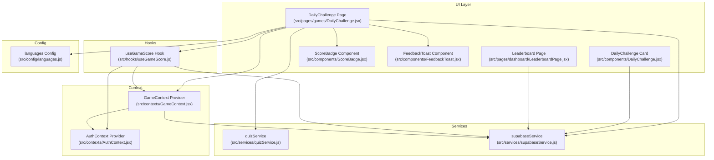
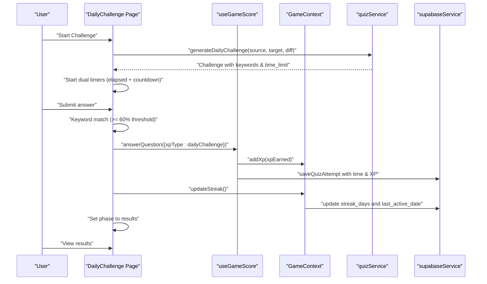
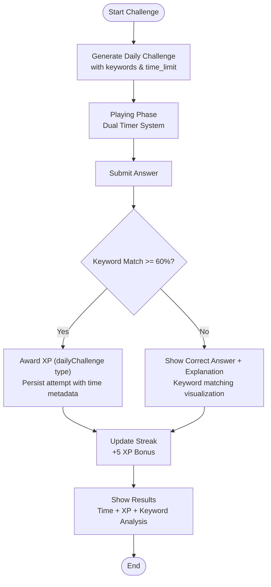
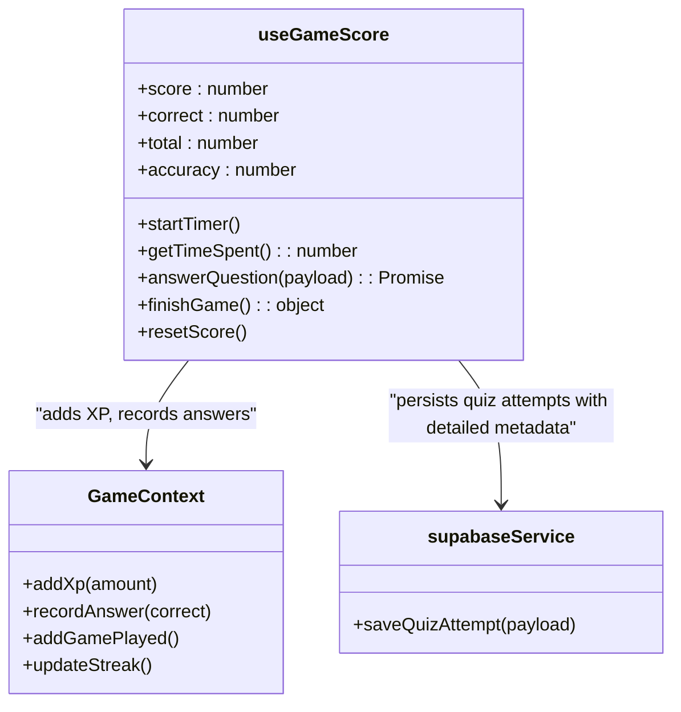
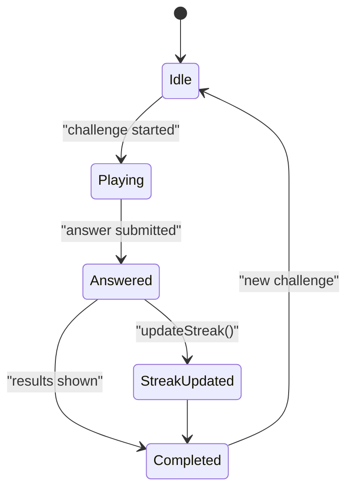
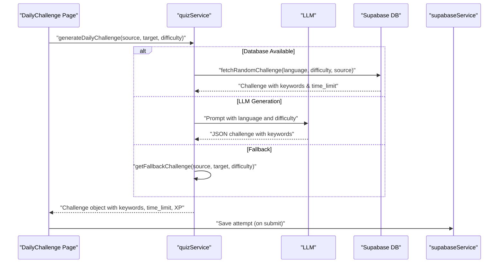
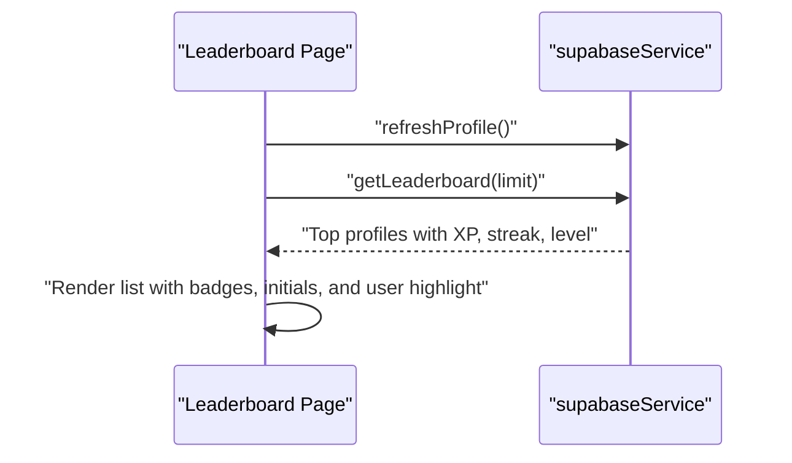
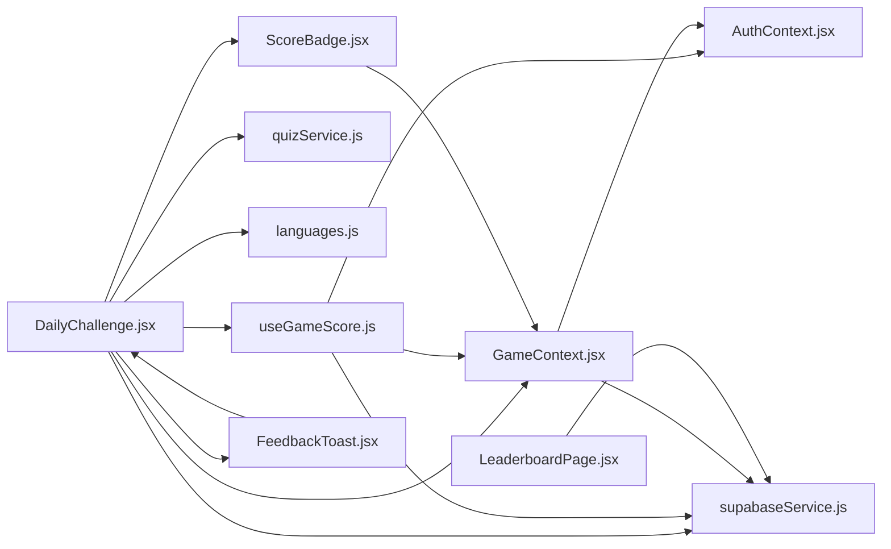

# Daily Challenge

<cite>
**Referenced Files in This Document**
- [DailyChallenge.jsx](file://src/pages/games/DailyChallenge.jsx)
- [DailyChallenge.jsx](file://src/components/DailyChallenge.jsx)
- [useGameScore.js](file://src/hooks/useGameScore.js)
- [GameContext.jsx](file://src/contexts/GameContext.jsx)
- [quizService.js](file://src/services/quizService.js)
- [supabaseService.js](file://src/services/supabaseService.js)
- [languages.js](file://src/config/languages.js)
- [LeaderboardPage.jsx](file://src/pages/dashboard/LeaderboardPage.jsx)
- [AuthContext.jsx](file://src/contexts/AuthContext.jsx)
- [ScoreBadge.jsx](file://src/components/ScoreBadge.jsx)
- [FeedbackToast.jsx](file://src/components/FeedbackToast.jsx)
- [mockData.js](file://src/data/mockData.js)
</cite>

## Update Summary
**Changes Made**
- Updated to document the new DailyChallenge.jsx component with 60-second timer implementation
- Added comprehensive coverage of keyword-based evaluation system with 60% threshold matching
- Documented XP reward calculation system with dailyChallenge type rewards
- Enhanced timer management with both elapsed and countdown timer implementations
- Added detailed coverage of challenge generation pipeline with DB fallbacks
- Updated gamification mechanics including streak integration and XP bonuses
- Documented UI components including feedback toast and score badge integration

## Table of Contents
1. [Introduction](#introduction)
2. [Project Structure](#project-structure)
3. [Core Components](#core-components)
4. [Architecture Overview](#architecture-overview)
5. [Detailed Component Analysis](#detailed-component-analysis)
6. [Dependency Analysis](#dependency-analysis)
7. [Performance Considerations](#performance-considerations)
8. [Troubleshooting Guide](#troubleshooting-guide)
9. [Conclusion](#conclusion)
10. [Appendices](#appendices)

## Introduction
This document explains the daily challenge game system, focusing on timed gameplay mechanics, challenge objectives, streak integration, and gamification. The system features a new 60-second timed translation challenge with keyword-based evaluation, comprehensive XP reward calculation, and integrated streak tracking. It documents how daily challenges are generated, distributed, and tracked within the gamification framework, including the integration with the useGameScore hook for real-time score calculation, streak tracking, and XP bonus systems. The system also covers social and competitive aspects such as leaderboard integration and daily rankings, addressing psychological aspects of daily engagement, habit formation, and motivation through gamified rewards.

## Project Structure
The daily challenge system spans several layers with enhanced functionality:
- UI pages and components for challenge presentation and interaction with dual timer system
- Hooks for scoring and timing with comprehensive XP calculation
- Context providers for global game state (XP, streak, level) with streak bonus integration
- Services for challenge generation with LLM fallbacks and persistence
- Configuration for languages, difficulty, and XP rewards with dailyChallenge type
- UI feedback components including toast notifications and score badges

**Diagram sources**
- [DailyChallenge.jsx:1-400](file://src/pages/games/DailyChallenge.jsx#L1-L400)
- [DailyChallenge.jsx:1-57](file://src/components/DailyChallenge.jsx#L1-L57)
- [useGameScore.js:1-101](file://src/hooks/useGameScore.js#L1-L101)
- [GameContext.jsx:1-141](file://src/contexts/GameContext.jsx#L1-L141)
- [quizService.js:1-268](file://src/services/quizService.js#L1-L268)
- [supabaseService.js:1-132](file://src/services/supabaseService.js#L1-L132)
- [languages.js:1-30](file://src/config/languages.js#L1-L30)
- [LeaderboardPage.jsx:1-80](file://src/pages/dashboard/LeaderboardPage.jsx#L1-L80)
- [AuthContext.jsx:1-101](file://src/contexts/AuthContext.jsx#L1-L101)
- [ScoreBadge.jsx:1-37](file://src/components/ScoreBadge.jsx#L1-L37)
- [FeedbackToast.jsx:1-39](file://src/components/FeedbackToast.jsx#L1-L39)

**Section sources**
- [DailyChallenge.jsx:1-400](file://src/pages/games/DailyChallenge.jsx#L1-L400)
- [useGameScore.js:1-101](file://src/hooks/useGameScore.js#L1-L101)
- [GameContext.jsx:1-141](file://src/contexts/GameContext.jsx#L1-L141)
- [quizService.js:1-268](file://src/services/quizService.js#L1-L268)
- [supabaseService.js:1-132](file://src/services/supabaseService.js#L1-L132)
- [languages.js:1-30](file://src/config/languages.js#L1-L30)
- [LeaderboardPage.jsx:1-80](file://src/pages/dashboard/LeaderboardPage.jsx#L1-L80)
- [AuthContext.jsx:1-101](file://src/contexts/AuthContext.jsx#L1-L101)

## Core Components
- **DailyChallenge page**: orchestrates challenge lifecycle with dual timer system, keyword-based validation, submission handling, XP awarding, and streak updates
- **useGameScore hook**: manages comprehensive scoring with elapsed time tracking, correctness counters, XP calculation, and persists quiz attempts with detailed metadata
- **GameContext provider**: centralizes XP, level, streak, and game statistics with streak bonus integration and persistence to Supabase
- **quizService**: generates daily translation challenges using LLMs with fallbacks to database and hardcoded content
- **supabaseService**: persists quiz attempts, daily challenges, leaderboard data, and user progress tracking
- **languages config**: defines languages, difficulty levels, XP rewards including dailyChallenge type, and level calculation
- **UI feedback components**: ScoreBadge for real-time score display and FeedbackToast for immediate user feedback

Key responsibilities:
- **Timed gameplay**: dual timer system with 60-second countdown and elapsed time tracking
- **Challenge objectives**: lenient keyword matching with 60% threshold for translation accuracy
- **Streak integration**: daily streak updates with bonus XP awarding upon successful completion
- **Gamification**: comprehensive XP rewards, level progression, leaderboard visibility, and streak bonuses
- **Challenge generation**: multi-tiered approach with database, LLM, and fallback mechanisms

**Section sources**
- [DailyChallenge.jsx:1-400](file://src/pages/games/DailyChallenge.jsx#L1-L400)
- [useGameScore.js:1-101](file://src/hooks/useGameScore.js#L1-L101)
- [GameContext.jsx:1-141](file://src/contexts/GameContext.jsx#L1-L141)
- [quizService.js:136-193](file://src/services/quizService.js#L136-L193)
- [supabaseService.js:32-58](file://src/services/supabaseService.js#L32-L58)
- [languages.js:20-25](file://src/config/languages.js#L20-L25)

## Architecture Overview
The daily challenge follows a comprehensive separation of concerns with enhanced timer management and evaluation systems:
- **UI renders**: challenge setup, playing with dual timer system, and results phases with feedback
- **Hook encapsulates**: scoring, timing, XP calculation, and comprehensive persistence
- **Context manages**: global game state, streak bonuses, and XP persistence
- **Services handle**: LLM-generated content, database operations, and user progress tracking
- **Configuration defines**: reward mechanics, difficulty scaling, and XP types

**Diagram sources**
- [DailyChallenge.jsx:29-108](file://src/pages/games/DailyChallenge.jsx#L29-L108)
- [useGameScore.js:28-60](file://src/hooks/useGameScore.js#L28-L60)
- [GameContext.jsx:107-119](file://src/contexts/GameContext.jsx#L107-L119)
- [quizService.js:140-193](file://src/services/quizService.js#L140-L193)
- [supabaseService.js:32-45](file://src/services/supabaseService.js#L32-L45)

## Detailed Component Analysis

### DailyChallenge Page (Enhanced Timed Gameplay and Challenge Flow)
**Updated** Enhanced with dual timer system, keyword-based evaluation, and comprehensive UI feedback

Responsibilities:
- **Phase management**: setup, playing with dual timers, results with detailed feedback
- **Challenge generation**: selects languages and difficulty, requests LLM challenge with keywords and time limits
- **Dual timer system**: elapsed time tracking and 60-second countdown with visual progress indicators
- **Submission and validation**: lenient keyword matching with 60% threshold, XP calculation, streak update
- **Persistence**: saves quiz attempt with comprehensive metadata including time and XP
- **Results**: displays detailed performance metrics with keyword matching visualization

Implementation highlights:
- **Timer management**: dual timer system with separate refs for elapsed and countdown timers
- **Validation**: sophisticated keyword matching with configurable threshold (60% minimum)
- **XP calculation**: dynamic XP based on difficulty and challenge completion
- **Streak integration**: automatic streak updates with bonus XP awarding
- **UI feedback**: comprehensive toast notifications and score display

**Diagram sources**
- [DailyChallenge.jsx:29-108](file://src/pages/games/DailyChallenge.jsx#L29-L108)
- [languages.js:20-25](file://src/config/languages.js#L20-L25)

**Section sources**
- [DailyChallenge.jsx:1-400](file://src/pages/games/DailyChallenge.jsx#L1-L400)

### useGameScore Hook (Comprehensive Real-Time Scoring and Timing)
**Updated** Enhanced with dual timer tracking, comprehensive XP calculation, and detailed persistence

Responsibilities:
- **Track comprehensive metrics**: score, correct answers, total attempts, accuracy, and elapsed time
- **Dual timer management**: measure time spent per attempt with precise elapsed time tracking
- **XP calculation**: compute XP based on correctness, XP type (dailyChallenge), and difficulty modifiers
- **Persist quiz attempts**: save comprehensive metadata including time, XP, and question data
- **Integrate with GameContext**: add XP, record answers, and track game sessions

Key behaviors:
- **answerQuestion**: computes XP using XP_REWARDS.dailyChallenge (25 XP), updates counters, persists attempt with detailed metadata
- **finishGame**: finalizes comprehensive stats and returns detailed summary with accuracy calculation
- **resetScore**: clears counters and restarts dual timer system
- **getTimeSpent**: provides precise elapsed time tracking for performance analysis

**Diagram sources**
- [useGameScore.js:1-101](file://src/hooks/useGameScore.js#L1-L101)
- [GameContext.jsx:76-119](file://src/contexts/GameContext.jsx#L76-L119)
- [supabaseService.js:32-45](file://src/services/supabaseService.js#L32-L45)

**Section sources**
- [useGameScore.js:1-101](file://src/hooks/useGameScore.js#L1-L101)

### GameContext Provider (Enhanced XP, Streak, Level, and Persistence)
**Updated** Enhanced with streak bonus integration and comprehensive XP management

Responsibilities:
- **Central state management**: XP, level, streak, games played, and comprehensive answer statistics
- **XP persistence**: persist XP and level to Supabase on XP gain with level calculation
- **Answer tracking**: record answers and games played with accuracy calculation
- **Streak management**: update streak daily if not already updated and award streak bonus XP (5 XP)
- **Level progression**: calculate levels based on XP thresholds (500 XP per level)

**Diagram sources**
- [GameContext.jsx:107-119](file://src/contexts/GameContext.jsx#L107-L119)

**Section sources**
- [GameContext.jsx:1-141](file://src/contexts/GameContext.jsx#L1-L141)

### Challenge Generation and Distribution (Enhanced Multi-Tiered System)
**Updated** Enhanced with comprehensive fallback system and keyword extraction

Responsibilities:
- **Multi-tiered generation**: prioritize database content, fallback to LLM generation, then hardcoded fallback
- **Keyword extraction**: automatically extract keywords from challenge text for evaluation
- **Time limit configuration**: configure challenge duration (default 60 seconds)
- **Difficulty scaling**: adjust challenge complexity based on selected difficulty level
- **XP reward configuration**: set appropriate XP rewards (dailyChallenge: 25 XP)

**Diagram sources**
- [quizService.js:140-193](file://src/services/quizService.js#L140-L193)
- [supabaseService.js:32-45](file://src/services/supabaseService.js#L32-L45)

**Section sources**
- [quizService.js:136-193](file://src/services/quizService.js#L136-L193)
- [supabaseService.js:89-107](file://src/services/supabaseService.js#L89-L107)

### Leaderboard Integration and Rankings
**Updated** Enhanced with comprehensive user data including streak and XP

Responsibilities:
- **Fetch top profiles**: retrieve top users ordered by XP with comprehensive profile data
- **Display detailed rankings**: show ranks, levels, streaks, XP totals, and user initials
- **Highlight current user**: prominently display current user with special styling
- **Refresh profile data**: ensure current user's profile is up-to-date before ranking

**Diagram sources**
- [LeaderboardPage.jsx:12-19](file://src/pages/dashboard/LeaderboardPage.jsx#L12-L19)
- [supabaseService.js:111-119](file://src/services/supabaseService.js#L111-L119)

**Section sources**
- [LeaderboardPage.jsx:1-80](file://src/pages/dashboard/LeaderboardPage.jsx#L1-L80)
- [supabaseService.js:111-119](file://src/services/supabaseService.js#L111-L119)

### Social and Competitive Aspects
**Updated** Enhanced with comprehensive gamification elements

- **Public leaderboard**: showcases top performers with detailed profile information
- **Streak visibility**: promotes consistency with daily streak tracking and bonuses
- **XP rewards**: reinforces correct answers with comprehensive XP system (dailyChallenge: 25 XP)
- **Difficulty scaling**: allows varied challenge intensity with appropriate XP rewards
- **Keyword-based evaluation**: provides detailed feedback on translation accuracy
- **Visual feedback**: comprehensive toast notifications and score display

**Section sources**
- [LeaderboardPage.jsx:1-80](file://src/pages/dashboard/LeaderboardPage.jsx#L1-L80)
- [GameContext.jsx:107-119](file://src/contexts/GameContext.jsx#L107-L119)
- [languages.js:20-25](file://src/config/languages.js#L20-L25)

### Psychological Aspects and Habit Formation
**Updated** Enhanced with comprehensive gamification psychology

- **Immediate feedback**: comprehensive feedback system with keyword matching visualization
- **Dual timer pressure**: introduces focused time pressure with visual countdown indicators
- **Streak bonuses**: encourages daily participation with automatic streak bonus XP (5 XP)
- **Difficulty progression**: balanced challenge progression with appropriate XP rewards
- **Visual progress indicators**: clear timer progress bars and score badges
- **Keyword mastery**: detailed keyword matching helps users understand translation accuracy
- **Achievement tracking**: comprehensive XP accumulation and level progression

**Section sources**
- [DailyChallenge.jsx:50-80](file://src/pages/games/DailyChallenge.jsx#L50-L80)
- [GameContext.jsx:107-119](file://src/contexts/GameContext.jsx#L107-L119)
- [languages.js:14-18](file://src/config/languages.js#L14-L18)

## Dependency Analysis
**Updated** Enhanced dependency graph with comprehensive component relationships

High-level dependencies:
- **DailyChallenge page**: depends on useGameScore, GameContext, quizService, supabaseService, languages config, ScoreBadge, and FeedbackToast
- **useGameScore**: depends on GameContext, AuthContext, languages XP rewards, and supabaseService for persistence
- **GameContext**: depends on AuthContext, Supabase for profile data, and XP calculation utilities
- **quizService**: depends on language configuration, LLM services, and database services
- **UI components**: ScoreBadge and FeedbackToast integrate with GameContext for real-time updates
- **Leaderboard page**: depends on supabaseService for comprehensive user data

**Diagram sources**
- [DailyChallenge.jsx:1-400](file://src/pages/games/DailyChallenge.jsx#L1-L400)
- [useGameScore.js:1-101](file://src/hooks/useGameScore.js#L1-L101)
- [GameContext.jsx:1-141](file://src/contexts/GameContext.jsx#L1-L141)
- [quizService.js:1-268](file://src/services/quizService.js#L1-L268)
- [supabaseService.js:1-132](file://src/services/supabaseService.js#L1-L132)
- [languages.js:1-30](file://src/config/languages.js#L1-L30)
- [LeaderboardPage.jsx:1-80](file://src/pages/dashboard/LeaderboardPage.jsx#L1-L80)
- [AuthContext.jsx:1-101](file://src/contexts/AuthContext.jsx#L1-L101)
- [ScoreBadge.jsx:1-37](file://src/components/ScoreBadge.jsx#L1-L37)
- [FeedbackToast.jsx:1-39](file://src/components/FeedbackToast.jsx#L1-L39)

**Section sources**
- [DailyChallenge.jsx:1-400](file://src/pages/games/DailyChallenge.jsx#L1-L400)
- [useGameScore.js:1-101](file://src/hooks/useGameScore.js#L1-L101)
- [GameContext.jsx:1-141](file://src/contexts/GameContext.jsx#L1-L141)
- [quizService.js:1-268](file://src/services/quizService.js#L1-L268)
- [supabaseService.js:1-132](file://src/services/supabaseService.js#L1-L132)
- [languages.js:1-30](file://src/config/languages.js#L1-L30)
- [LeaderboardPage.jsx:1-80](file://src/pages/dashboard/LeaderboardPage.jsx#L1-L80)
- [AuthContext.jsx:1-101](file://src/contexts/AuthContext.jsx#L1-L101)

## Performance Considerations
**Updated** Enhanced performance considerations for dual timer system and evaluation

- **Challenge generation**: multi-tiered approach with caching and pre-generation capabilities
- **Dual timer precision**: efficient timer management with proper cleanup to prevent memory leaks
- **Database writes**: optimized persistence with batch operations and debounced XP updates
- **Leaderboard queries**: efficient pagination and limited result sets for scalability
- **Keyword matching**: optimized string comparison algorithms for large keyword sets
- **UI rendering**: efficient component updates with proper state management
- **Memory management**: proper timer cleanup and event listener removal

## Troubleshooting Guide
**Updated** Enhanced troubleshooting for dual timer system and evaluation issues

Common issues and resolutions:
- **Challenge generation failures**: quizService uses multi-tiered fallback (DB → LLM → hardcoded) with comprehensive error logging
- **Timer synchronization**: dual timer system with separate refs prevents conflicts; ensure proper cleanup in useEffect
- **Keyword matching failures**: 60% threshold ensures lenient evaluation; check challenge keywords extraction
- **Streak not updating**: ensure last_active_date comparison and user authentication status
- **Missing XP persistence**: verify user context, XP type (dailyChallenge), and Supabase write permissions
- **Leaderboard empty**: confirm profile entries, XP accumulation, and ordering by total_xp
- **Timer display issues**: verify time_left calculation and timer percentage computation

**Section sources**
- [quizService.js:82-87](file://src/services/quizService.js#L82-L87)
- [GameContext.jsx:107-119](file://src/contexts/GameContext.jsx#L107-L119)
- [supabaseService.js:32-45](file://src/services/supabaseService.js#L32-L45)
- [LeaderboardPage.jsx:12-17](file://src/pages/dashboard/LeaderboardPage.jsx#L12-L17)

## Conclusion
The daily challenge system represents a comprehensive gamification solution with enhanced timed gameplay, sophisticated keyword-based evaluation, and robust XP reward calculation. The dual timer system provides focused time pressure while the lenient 60% keyword matching ensures accessibility. The integration with GameContext provides seamless streak tracking and bonus XP awarding. The multi-tiered challenge generation system ensures reliability with database, LLM, and fallback mechanisms. Together, these components create a compelling daily engagement experience that balances challenge difficulty with accessibility, promoting habit formation, motivation, and healthy competition through comprehensive leaderboard integration.

## Appendices

### Implementation Examples

**Updated** Enhanced examples for dual timer system and keyword evaluation

- **Challenge timing and dual timer management**
  - Start challenge with dual timers: [DailyChallenge.jsx:29-63](file://src/pages/games/DailyChallenge.jsx#L29-L63)
  - Dual timer setup (elapsed + countdown): [DailyChallenge.jsx:44-57](file://src/pages/games/DailyChallenge.jsx#L44-L57)
  - Timer cleanup and component unmount: [DailyChallenge.jsx:65-70](file://src/pages/games/DailyChallenge.jsx#L65-L70)

- **Keyword-based evaluation and XP calculation**
  - Keyword matching with 60% threshold: [DailyChallenge.jsx:78-88](file://src/pages/games/DailyChallenge.jsx#L78-L88)
  - XP calculation using dailyChallenge type: [useGameScore.js:28-30](file://src/hooks/useGameScore.js#L28-L30)
  - XP rewards configuration: [languages.js:20-25](file://src/config/languages.js#L20-L25)

- **User progress monitoring and streak integration**
  - Score and accuracy tracking: [useGameScore.js:70-74](file://src/hooks/useGameScore.js#L70-L74)
  - XP and streak state management: [GameContext.jsx:8-18](file://src/contexts/GameContext.jsx#L8-L18)
  - Streak bonus XP awarding: [GameContext.jsx:117-119](file://src/contexts/GameContext.jsx#L117-L119)

- **Challenge generation with keyword extraction**
  - Multi-tiered challenge generation: [quizService.js:140-193](file://src/services/quizService.js#L140-L193)
  - Keyword extraction from challenge text: [quizService.js:154](file://src/services/quizService.js#L154)
  - Time limit configuration: [quizService.js:158](file://src/services/quizService.js#L158)

- **UI feedback and visual indicators**
  - Feedback toast with automatic dismissal: [FeedbackToast.jsx:7-16](file://src/components/FeedbackToast.jsx#L7-L16)
  - Score badge with animation: [ScoreBadge.jsx:5-17](file://src/components/ScoreBadge.jsx#L5-L17)
  - Timer progress visualization: [DailyChallenge.jsx:280-299](file://src/pages/games/DailyChallenge.jsx#L280-L299)

- **Leaderboard integration and user ranking**
  - Fetch top profiles with comprehensive data: [LeaderboardPage.jsx:12-19](file://src/pages/dashboard/LeaderboardPage.jsx#L12-L19)
  - Render detailed user rankings: [LeaderboardPage.jsx:41-72](file://src/pages/dashboard/LeaderboardPage.jsx#L41-L72)

**Section sources**
- [DailyChallenge.jsx:29-63](file://src/pages/games/DailyChallenge.jsx#L29-L63)
- [DailyChallenge.jsx:78-88](file://src/pages/games/DailyChallenge.jsx#L78-L88)
- [useGameScore.js:28-30](file://src/hooks/useGameScore.js#L28-L30)
- [GameContext.jsx:117-119](file://src/contexts/GameContext.jsx#L117-L119)
- [quizService.js:140-193](file://src/services/quizService.js#L140-L193)
- [FeedbackToast.jsx:7-16](file://src/components/FeedbackToast.jsx#L7-L16)
- [ScoreBadge.jsx:5-17](file://src/components/ScoreBadge.jsx#L5-L17)
- [LeaderboardPage.jsx:12-72](file://src/pages/dashboard/LeaderboardPage.jsx#L12-L72)