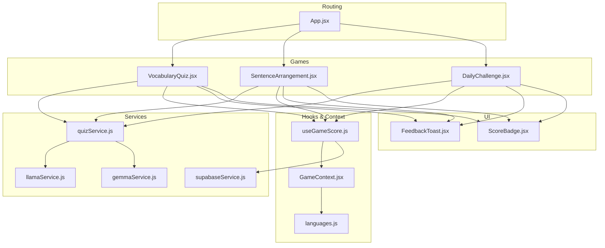
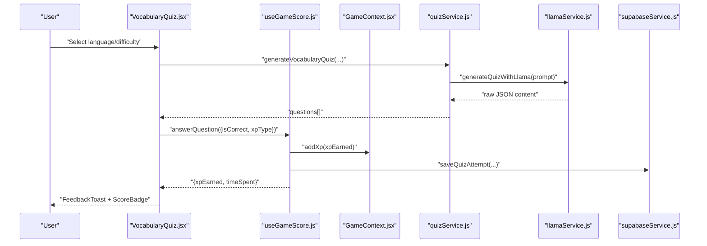
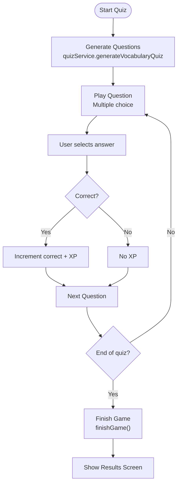
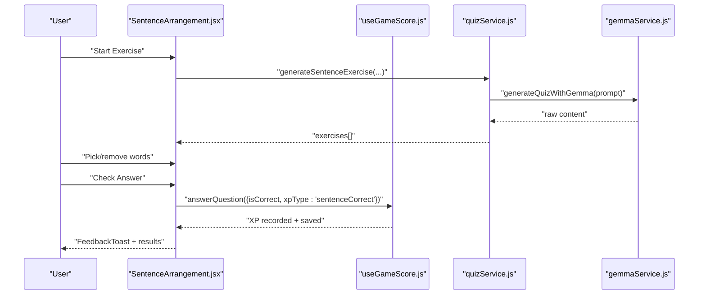
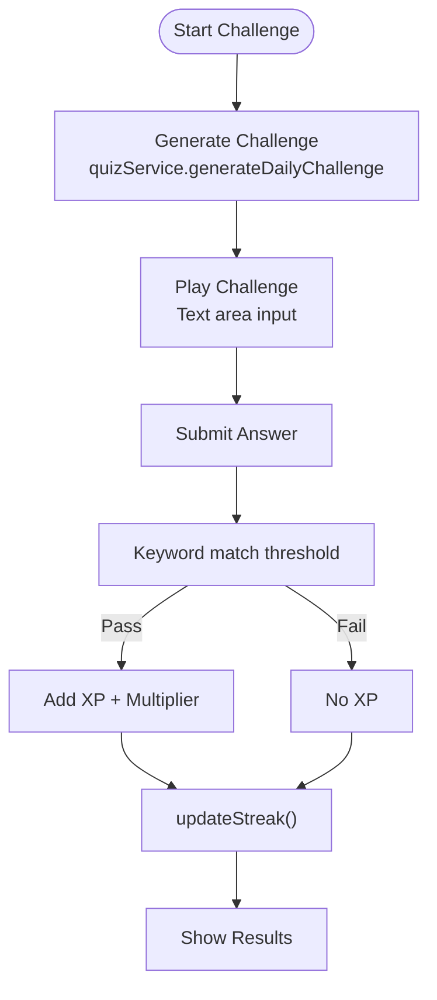
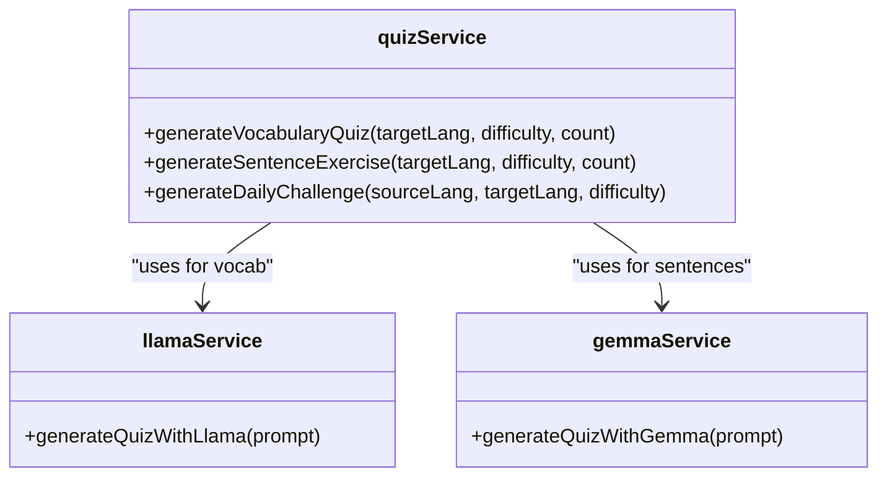
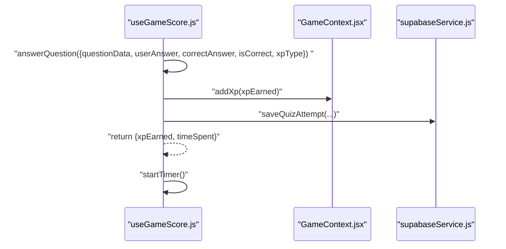
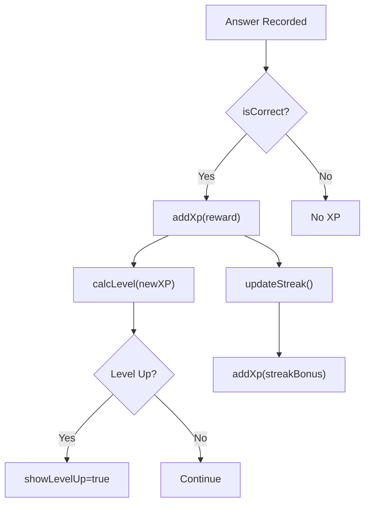
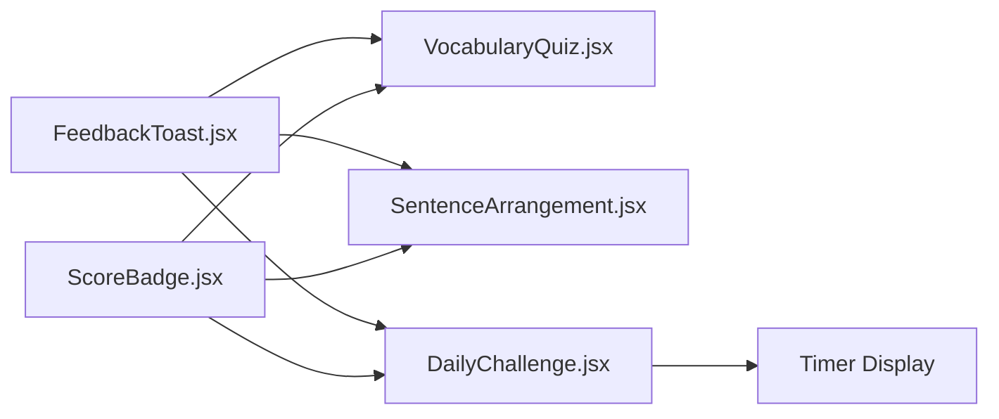
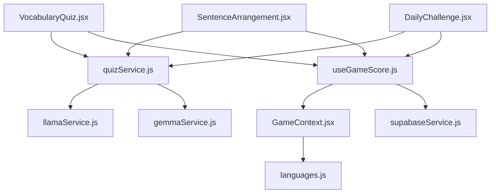

# Learning Games

<cite>
**Referenced Files in This Document**
- [App.jsx](file://src/App.jsx)
- [VocabularyQuiz.jsx](file://src/pages/games/VocabularyQuiz.jsx)
- [SentenceArrangement.jsx](file://src/pages/games/SentenceArrangement.jsx)
- [DailyChallenge.jsx](file://src/pages/games/DailyChallenge.jsx)
- [quizService.js](file://src/services/quizService.js)
- [llamaService.js](file://src/services/llamaService.js)
- [gemmaService.js](file://src/services/gemmaService.js)
- [useGameScore.js](file://src/hooks/useGameScore.js)
- [GameContext.jsx](file://src/contexts/GameContext.jsx)
- [languages.js](file://src/config/languages.js)
- [supabaseService.js](file://src/services/supabaseService.js)
- [ScoreBadge.jsx](file://src/components/ScoreBadge.jsx)
- [FeedbackToast.jsx](file://src/components/FeedbackToast.jsx)
</cite>

## Table of Contents
1. [Introduction](#introduction)
2. [Project Structure](#project-structure)
3. [Core Components](#core-components)
4. [Architecture Overview](#architecture-overview)
5. [Detailed Component Analysis](#detailed-component-analysis)
6. [Dependency Analysis](#dependency-analysis)
7. [Performance Considerations](#performance-considerations)
8. [Troubleshooting Guide](#troubleshooting-guide)
9. [Conclusion](#conclusion)
10. [Appendices](#appendices)

## Introduction
This document explains the learning games system, covering three main game types: vocabulary quiz, sentence arrangement, and daily challenge. It documents game mechanics, scoring algorithms, difficulty progression, dynamic content generation, gamification elements (XP rewards, streak bonuses, progress tracking), and UI components for feedback and timers. Guidance is included for extending the system with new game types while maintaining educational effectiveness.

## Project Structure
The learning games are React components under the games page, orchestrated by shared services and hooks. The App routes expose the games under protected routes, and the GameContext manages XP, streaks, and progress.

**Diagram sources**
- [App.jsx:19-49](file://src/App.jsx#L19-L49)
- [VocabularyQuiz.jsx:1-215](file://src/pages/games/VocabularyQuiz.jsx#L1-L215)
- [SentenceArrangement.jsx:1-280](file://src/pages/games/SentenceArrangement.jsx#L1-L280)
- [DailyChallenge.jsx:1-249](file://src/pages/games/DailyChallenge.jsx#L1-L249)
- [quizService.js:1-154](file://src/services/quizService.js#L1-L154)
- [llamaService.js:1-84](file://src/services/llamaService.js#L1-L84)
- [gemmaService.js:1-56](file://src/services/gemmaService.js#L1-L56)
- [useGameScore.js:1-76](file://src/hooks/useGameScore.js#L1-L76)
- [GameContext.jsx:1-141](file://src/contexts/GameContext.jsx#L1-L141)
- [languages.js:1-30](file://src/config/languages.js#L1-L30)
- [supabaseService.js:1-132](file://src/services/supabaseService.js#L1-L132)
- [FeedbackToast.jsx:1-39](file://src/components/FeedbackToast.jsx#L1-L39)
- [ScoreBadge.jsx:1-37](file://src/components/ScoreBadge.jsx#L1-L37)

**Section sources**
- [App.jsx:19-49](file://src/App.jsx#L19-L49)

## Core Components
- Vocabulary Quiz: Multiple-choice translation quiz with immediate feedback, animated transitions, and results summary.
- Sentence Arrangement: Drag-and-drop word ordering exercise with hints and grammar tips.
- Daily Challenge: Timed open-ended translation challenge with keyword-based correctness and streak tracking.
- Dynamic Content Generation: quizService orchestrates LLM prompts for each game type and falls back to static content when needed.
- Scoring and Gamification: useGameScore centralizes scoring, XP awarding, and persistence; GameContext tracks XP, level, streak, and progress.

**Section sources**
- [VocabularyQuiz.jsx:9-215](file://src/pages/games/VocabularyQuiz.jsx#L9-L215)
- [SentenceArrangement.jsx:9-280](file://src/pages/games/SentenceArrangement.jsx#L9-L280)
- [DailyChallenge.jsx:10-249](file://src/pages/games/DailyChallenge.jsx#L10-L249)
- [quizService.js:5-88](file://src/services/quizService.js#L5-L88)
- [useGameScore.js:7-76](file://src/hooks/useGameScore.js#L7-L76)
- [GameContext.jsx:8-141](file://src/contexts/GameContext.jsx#L8-L141)

## Architecture Overview
The system follows a layered architecture:
- UI Layer: Game components render setup, gameplay, and results screens.
- Services Layer: quizService composes prompts and delegates to LLM providers (llamaService, gemmaService).
- Hooks and Context: useGameScore encapsulates scoring and persistence; GameContext manages XP, streaks, and level.
- Persistence: supabaseService persists quiz attempts and user progress.

**Diagram sources**
- [VocabularyQuiz.jsx:21-57](file://src/pages/games/VocabularyQuiz.jsx#L21-L57)
- [useGameScore.js:23-55](file://src/hooks/useGameScore.js#L23-L55)
- [GameContext.jsx:76-84](file://src/contexts/GameContext.jsx#L76-L84)
- [quizService.js:8-32](file://src/services/quizService.js#L8-L32)
- [llamaService.js:62-83](file://src/services/llamaService.js#L62-L83)
- [supabaseService.js:32-45](file://src/services/supabaseService.js#L32-L45)

## Detailed Component Analysis

### Vocabulary Quiz
- Mechanics:
  - Setup screen selects target language and difficulty; starts a fixed number of questions.
  - Gameplay presents one question at a time with multiple-choice answers; immediate feedback and explanation.
  - Results screen shows accuracy percentage, correct/total counts, and XP earned.
- Scoring:
  - Correct answers grant XP according to XP_REWARDS; score tracked per session and persisted.
- Difficulty:
  - Uses difficulty levels mapped to prompts; fallback content ensures availability.
- UI:
  - Animated transitions between questions; progress bar; ScoreBadge; FeedbackToast.

**Diagram sources**
- [VocabularyQuiz.jsx:21-68](file://src/pages/games/VocabularyQuiz.jsx#L21-L68)
- [useGameScore.js:57-61](file://src/hooks/useGameScore.js#L57-L61)
- [quizService.js:8-32](file://src/services/quizService.js#L8-L32)

**Section sources**
- [VocabularyQuiz.jsx:9-215](file://src/pages/games/VocabularyQuiz.jsx#L9-L215)
- [quizService.js:8-32](file://src/services/quizService.js#L8-L32)
- [useGameScore.js:23-55](file://src/hooks/useGameScore.js#L23-L55)

### Sentence Arrangement
- Mechanics:
  - Shuffles words for each sentence; user drags to reorder; submit checks against correct order.
  - Hints provide grammar tips; results reveal correct answer and explanation.
- Scoring:
  - Correct answers grant higher XP reward than vocabulary quiz.
- UI:
  - Drop zones for arranged words; animated word lists; hint toggle; progress indicator.

**Diagram sources**
- [SentenceArrangement.jsx:24-102](file://src/pages/games/SentenceArrangement.jsx#L24-L102)
- [useGameScore.js:23-55](file://src/hooks/useGameScore.js#L23-L55)
- [quizService.js:37-61](file://src/services/quizService.js#L37-L61)
- [gemmaService.js:47-55](file://src/services/gemmaService.js#L47-L55)

**Section sources**
- [SentenceArrangement.jsx:9-280](file://src/pages/games/SentenceArrangement.jsx#L9-L280)
- [quizService.js:37-61](file://src/services/quizService.js#L37-L61)
- [useGameScore.js:23-55](file://src/hooks/useGameScore.js#L23-L55)

### Daily Challenge
- Mechanics:
  - Timed open-ended translation challenge; lenient keyword matching determines correctness.
  - Difficulty affects XP multiplier; streak tracking updates on completion.
- Scoring:
  - Base XP reward plus difficulty multiplier; streak bonus awarded upon successful completion.
- UI:
  - Timer display; hint support; results summary with time and XP.

**Diagram sources**
- [DailyChallenge.jsx:26-85](file://src/pages/games/DailyChallenge.jsx#L26-L85)
- [quizService.js:66-88](file://src/services/quizService.js#L66-L88)
- [GameContext.jsx:107-119](file://src/contexts/GameContext.jsx#L107-L119)

**Section sources**
- [DailyChallenge.jsx:10-249](file://src/pages/games/DailyChallenge.jsx#L10-L249)
- [quizService.js:66-88](file://src/services/quizService.js#L66-L88)
- [GameContext.jsx:107-119](file://src/contexts/GameContext.jsx#L107-L119)

### Dynamic Content Generation (quizService)
- Purpose: Compose structured prompts for LLMs and parse JSON responses; provide fallbacks when parsing fails.
- Types:
  - generateVocabularyQuiz: returns array of questions with options and explanations.
  - generateSentenceExercise: returns array of exercises with shuffled words and correct orders.
  - generateDailyChallenge: returns single challenge object with prompt, keywords, and explanation.
- Providers:
  - llamaService: handles Llama API requests and JSON parsing for quiz content.
  - gemmaService: handles Gemma API requests for sentence exercises.

**Diagram sources**
- [quizService.js:8-88](file://src/services/quizService.js#L8-L88)
- [llamaService.js:62-83](file://src/services/llamaService.js#L62-L83)
- [gemmaService.js:47-55](file://src/services/gemmaService.js#L47-L55)

**Section sources**
- [quizService.js:5-88](file://src/services/quizService.js#L5-L88)
- [llamaService.js:62-83](file://src/services/llamaService.js#L62-L83)
- [gemmaService.js:47-55](file://src/services/gemmaService.js#L47-L55)

### Score Management (useGameScore)
- Responsibilities:
  - Track score, correct answers, total answers, and accuracy.
  - Compute XP per correct answer using XP_REWARDS keyed by xpType.
  - Persist attempts to Supabase with question data, answers, correctness, XP, and time spent.
  - Reset and finalize sessions; start/reset internal timers.
- Integration:
  - Calls GameContext.addXp to update global XP and level.
  - Records answer statistics via GameContext.recordAnswer.

**Diagram sources**
- [useGameScore.js:23-55](file://src/hooks/useGameScore.js#L23-L55)
- [GameContext.jsx:76-84](file://src/contexts/GameContext.jsx#L76-L84)
- [supabaseService.js:32-45](file://src/services/supabaseService.js#L32-L45)

**Section sources**
- [useGameScore.js:7-76](file://src/hooks/useGameScore.js#L7-L76)
- [GameContext.jsx:20-54](file://src/contexts/GameContext.jsx#L20-L54)
- [supabaseService.js:32-45](file://src/services/supabaseService.js#L32-L45)

### Gamification Elements
- XP Rewards:
  - quizCorrect: base reward for vocabulary quiz.
  - sentenceCorrect: higher reward for sentence arrangement.
  - dailyChallenge: base reward with difficulty multiplier.
  - streakBonus: small bonus for maintaining streaks.
- Streak Bonuses:
  - updateStreak increments streak and awards streakBonus XP when a new day’s challenge is completed.
- Level Progression:
  - calcLevel computes level from XP; GameContext triggers level-up notifications.

**Diagram sources**
- [languages.js:20-29](file://src/config/languages.js#L20-L29)
- [GameContext.jsx:24-34](file://src/contexts/GameContext.jsx#L24-L34)
- [GameContext.jsx:107-119](file://src/contexts/GameContext.jsx#L107-L119)

**Section sources**
- [languages.js:20-29](file://src/config/languages.js#L20-L29)
- [GameContext.jsx:24-34](file://src/contexts/GameContext.jsx#L24-L34)
- [GameContext.jsx:107-119](file://src/contexts/GameContext.jsx#L107-L119)

### User Interface Components
- FeedbackToast: Animated feedback popup indicating correctness and showing explanations.
- ScoreBadge: Animated XP badge displaying current score with star icon.
- Timer in DailyChallenge: Real-time seconds counter with formatted mm:ss display.

**Diagram sources**
- [FeedbackToast.jsx:4-37](file://src/components/FeedbackToast.jsx#L4-L37)
- [ScoreBadge.jsx:3-18](file://src/components/ScoreBadge.jsx#L3-L18)
- [DailyChallenge.jsx:187-190](file://src/pages/games/DailyChallenge.jsx#L187-L190)

**Section sources**
- [FeedbackToast.jsx:1-39](file://src/components/FeedbackToast.jsx#L1-L39)
- [ScoreBadge.jsx:1-37](file://src/components/ScoreBadge.jsx#L1-L37)
- [DailyChallenge.jsx:187-190](file://src/pages/games/DailyChallenge.jsx#L187-L190)

## Dependency Analysis
- Game components depend on:
  - quizService for dynamic content generation.
  - useGameScore for scoring and persistence.
  - GameContext for XP, streaks, and progress.
- Services depend on:
  - llamaService and gemmaService for LLM content generation.
  - supabaseService for persistence.
- Configuration:
  - languages.js defines XP_REWARDS, difficulty levels, and language metadata.

**Diagram sources**
- [VocabularyQuiz.jsx:5-6](file://src/pages/games/VocabularyQuiz.jsx#L5-L6)
- [SentenceArrangement.jsx:5-6](file://src/pages/games/SentenceArrangement.jsx#L5-L6)
- [DailyChallenge.jsx:5-7](file://src/pages/games/DailyChallenge.jsx#L5-L7)
- [quizService.js:1-3](file://src/services/quizService.js#L1-L3)
- [useGameScore.js:2-5](file://src/hooks/useGameScore.js#L2-L5)
- [GameContext.jsx:1-5](file://src/contexts/GameContext.jsx#L1-L5)
- [languages.js:1-7](file://src/config/languages.js#L1-L7)
- [llamaService.js:1-2](file://src/services/llamaService.js#L1-L2)
- [gemmaService.js:1-2](file://src/services/gemmaService.js#L1-L2)
- [supabaseService.js:1](file://src/services/supabaseService.js#L1)

**Section sources**
- [VocabularyQuiz.jsx:5-6](file://src/pages/games/VocabularyQuiz.jsx#L5-L6)
- [SentenceArrangement.jsx:5-6](file://src/pages/games/SentenceArrangement.jsx#L5-L6)
- [DailyChallenge.jsx:5-7](file://src/pages/games/DailyChallenge.jsx#L5-L7)
- [quizService.js:1-3](file://src/services/quizService.js#L1-L3)
- [useGameScore.js:2-5](file://src/hooks/useGameScore.js#L2-L5)
- [GameContext.jsx:1-5](file://src/contexts/GameContext.jsx#L1-L5)
- [languages.js:1-7](file://src/config/languages.js#L1-L7)
- [llamaService.js:1-2](file://src/services/llamaService.js#L1-L2)
- [gemmaService.js:1-2](file://src/services/gemmaService.js#L1-L2)
- [supabaseService.js:1](file://src/services/supabaseService.js#L1)

## Performance Considerations
- Prompt construction: Keep prompts concise and deterministic to reduce token usage and latency.
- Parsing robustness: quizService extracts JSON from LLM responses and falls back to static content to avoid rendering failures.
- UI animations: Framer Motion animations are used sparingly; ensure smooth UX without heavy computations.
- Persistence: saveQuizAttempt is asynchronous; errors are logged and do not block gameplay.
- Difficulty scaling: Adjust question counts and time limits per difficulty to maintain engagement without fatigue.

[No sources needed since this section provides general guidance]

## Troubleshooting Guide
- LLM API errors:
  - Llama API errors are surfaced with status and message; ensure API keys and network connectivity.
  - Gemini API requires a valid API key; verify environment configuration.
- JSON parsing failures:
  - quizService attempts to extract JSON from raw responses; if parsing fails, fallback content is used.
- Streak not updating:
  - updateStreak checks last active date; ensure user is authenticated and profile is loaded.
- Score not persisting:
  - saveQuizAttempt requires a logged-in user; verify AuthContext and Supabase connection.

**Section sources**
- [llamaService.js:34-37](file://src/services/llamaService.js#L34-L37)
- [quizService.js:24-32](file://src/services/quizService.js#L24-L32)
- [GameContext.jsx:107-119](file://src/contexts/GameContext.jsx#L107-L119)
- [supabaseService.js:32-45](file://src/services/supabaseService.js#L32-L45)

## Conclusion
The learning games system integrates dynamic content generation, robust scoring, and gamification to create engaging, adaptive language practice experiences. The modular design allows easy extension to new game types while preserving educational quality and user motivation.

[No sources needed since this section summarizes without analyzing specific files]

## Appendices

### Scoring Algorithms and XP Rewards
- Vocabulary quiz: base XP per correct answer.
- Sentence arrangement: higher base XP per correct answer.
- Daily challenge: base XP with difficulty multiplier; streak bonus on completion.
- Level progression: computed from total XP using a fixed XP threshold.

**Section sources**
- [languages.js:20-29](file://src/config/languages.js#L20-L29)
- [useGameScore.js:23-25](file://src/hooks/useGameScore.js#L23-L25)
- [DailyChallenge.jsx:69-76](file://src/pages/games/DailyChallenge.jsx#L69-L76)

### Difficulty Progression
- Easy/Medium/Hard mapped to prompts and fallback content; adjust counts and complexity accordingly.
- Sentence arrangement increases word count and complexity with difficulty.
- Daily challenge adjusts keyword matching thresholds and prompt complexity.

**Section sources**
- [languages.js:14-18](file://src/config/languages.js#L14-L18)
- [quizService.js:37-61](file://src/services/quizService.js#L37-L61)
- [quizService.js:66-88](file://src/services/quizService.js#L66-L88)

### Creating New Game Types
- Define a new page component following the setup/play/results lifecycle.
- Implement a generator in quizService with a dedicated prompt and fallback content.
- Integrate useGameScore.answerQuestion with a new xpType and appropriate XP_REWARDS.
- Wire routing in App.jsx and add UI components for feedback and scoring.
- Consider difficulty scaling and adaptive content to maintain educational effectiveness.

**Section sources**
- [App.jsx:35-37](file://src/App.jsx#L35-L37)
- [quizService.js:5-88](file://src/services/quizService.js#L5-L88)
- [languages.js:20-25](file://src/config/languages.js#L20-L25)
- [useGameScore.js:23-55](file://src/hooks/useGameScore.js#L23-L55)