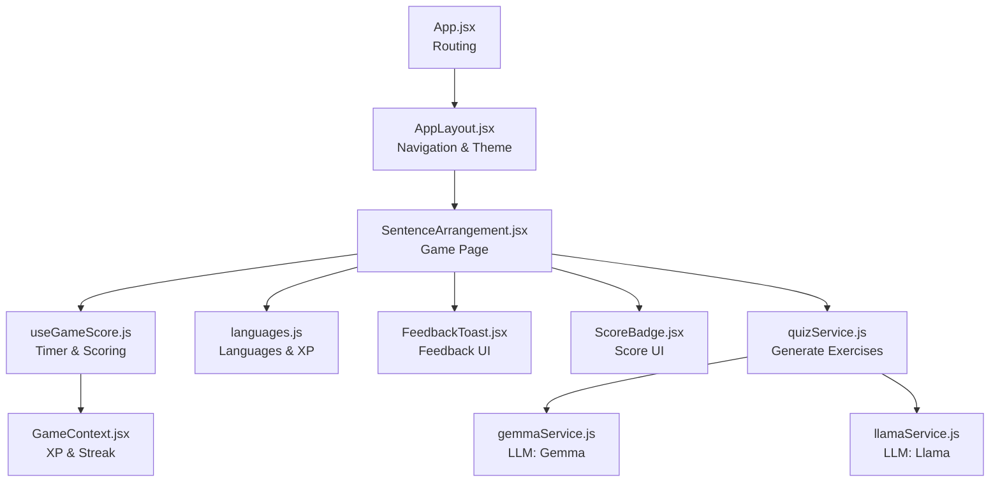
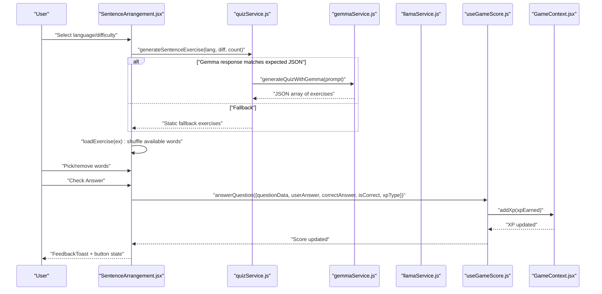
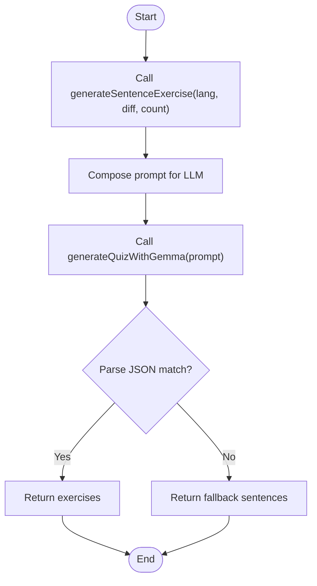
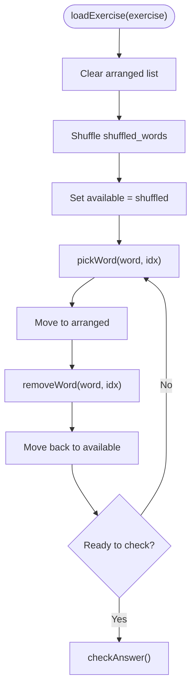
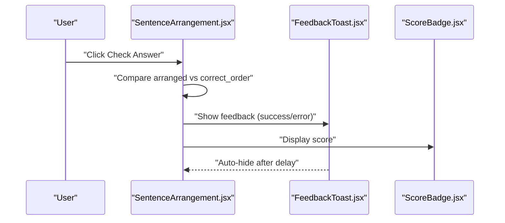
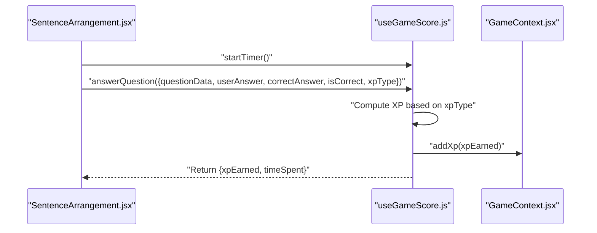
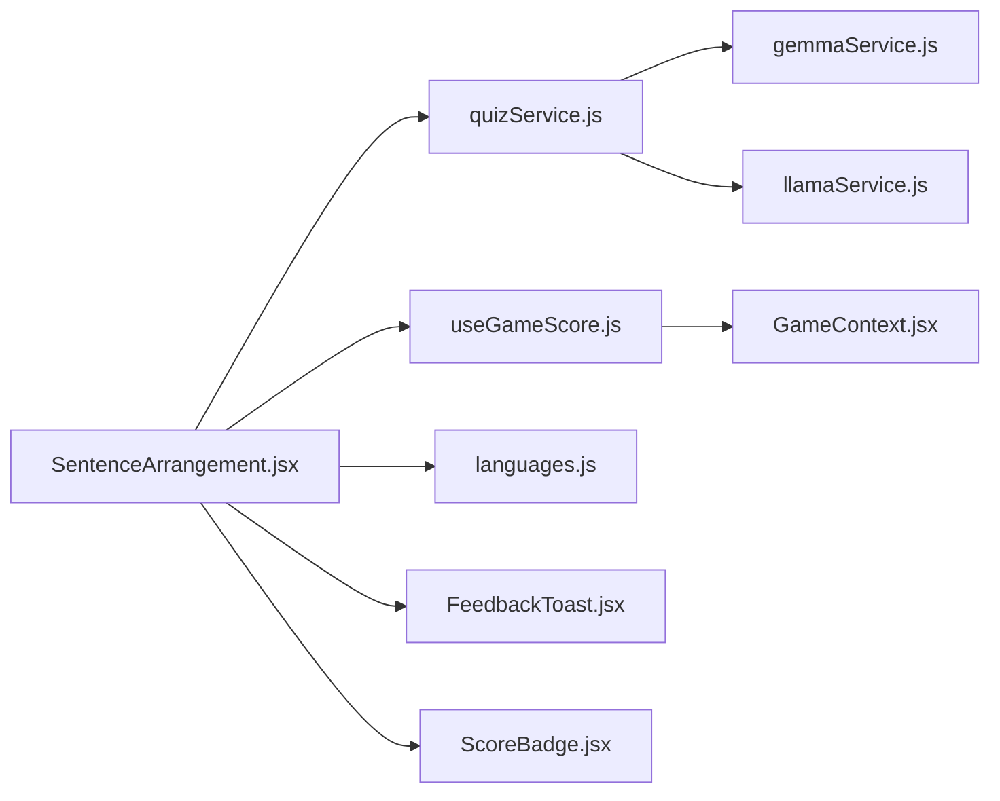

# Sentence Arrangement

<cite>
**Referenced Files in This Document**
- [SentenceArrangement.jsx](file://src/pages/games/SentenceArrangement.jsx)
- [quizService.js](file://src/services/quizService.js)
- [gemmaService.js](file://src/services/gemmaService.js)
- [llamaService.js](file://src/services/llamaService.js)
- [languages.js](file://src/config/languages.js)
- [useGameScore.js](file://src/hooks/useGameScore.js)
- [GameContext.jsx](file://src/contexts/GameContext.jsx)
- [FeedbackToast.jsx](file://src/components/FeedbackToast.jsx)
- [ScoreBadge.jsx](file://src/components/ScoreBadge.jsx)
- [App.jsx](file://src/App.jsx)
- [AppLayout.jsx](file://src/layouts/AppLayout.jsx)
</cite>

## Table of Contents
1. [Introduction](#introduction)
2. [Project Structure](#project-structure)
3. [Core Components](#core-components)
4. [Architecture Overview](#architecture-overview)
5. [Detailed Component Analysis](#detailed-component-analysis)
6. [Dependency Analysis](#dependency-analysis)
7. [Performance Considerations](#performance-considerations)
8. [Troubleshooting Guide](#troubleshooting-guide)
9. [Conclusion](#conclusion)

## Introduction
This document explains the Sentence Arrangement game system that teaches grammar and word-order recognition by having users reorder scrambled words into correct sentences. It covers how sentences are generated, randomized, validated, and presented with visual feedback. It also documents the UI components (draggable word elements, target sentence hints, and feedback), scoring and XP mechanics, hint system, timer functionality, and how the system supports language learning objectives.

## Project Structure
The game is implemented as a React page integrated into the application routing. It relies on services to generate exercises from LLMs, a hook to track scores and timing, and shared configuration for languages and XP rewards. The UI is composed of animated buttons, a progress indicator, and a feedback toast.

**Diagram sources**
- [App.jsx:19-49](file://src/App.jsx#L19-L49)
- [AppLayout.jsx:17-41](file://src/layouts/AppLayout.jsx#L17-L41)
- [SentenceArrangement.jsx:9-280](file://src/pages/games/SentenceArrangement.jsx#L9-L280)
- [useGameScore.js:7-76](file://src/hooks/useGameScore.js#L7-L76)
- [languages.js:1-30](file://src/config/languages.js#L1-L30)
- [FeedbackToast.jsx:4-39](file://src/components/FeedbackToast.jsx#L4-L39)
- [ScoreBadge.jsx:3-37](file://src/components/ScoreBadge.jsx#L3-L37)
- [quizService.js:37-61](file://src/services/quizService.js#L37-L61)
- [gemmaService.js:47-56](file://src/services/gemmaService.js#L47-L56)
- [llamaService.js:62-84](file://src/services/llamaService.js#L62-L84)
- [GameContext.jsx:57-141](file://src/contexts/GameContext.jsx#L57-L141)

**Section sources**
- [App.jsx:19-49](file://src/App.jsx#L19-L49)
- [AppLayout.jsx:6-15](file://src/layouts/AppLayout.jsx#L6-L15)

## Core Components
- SentenceArrangement page orchestrates setup, gameplay, and results screens. It manages state for selected language, difficulty, exercises, current index, arranged and available words, feedback, hints, and checked state.
- quizService generates sentence exercises using LLM prompts and falls back to static examples when needed.
- useGameScore tracks score, correct answers, total attempts, accuracy, and time spent per question, and persists quiz attempts.
- GameContext maintains XP, level, streak, and records answers globally.
- UI components provide visual feedback and score display.

Key implementation references:
- Game lifecycle and UI rendering: [SentenceArrangement.jsx:9-280](file://src/pages/games/SentenceArrangement.jsx#L9-L280)
- Exercise generation: [quizService.js:37-61](file://src/services/quizService.js#L37-L61)
- LLM integration: [gemmaService.js:47-56](file://src/services/gemmaService.js#L47-L56), [llamaService.js:62-84](file://src/services/llamaService.js#L62-L84)
- Scoring and timing: [useGameScore.js:7-76](file://src/hooks/useGameScore.js#L7-L76)
- XP and level logic: [GameContext.jsx:20-55](file://src/contexts/GameContext.jsx#L20-L55), [languages.js:20-30](file://src/config/languages.js#L20-L30)
- Feedback and score badges: [FeedbackToast.jsx:4-39](file://src/components/FeedbackToast.jsx#L4-L39), [ScoreBadge.jsx:3-37](file://src/components/ScoreBadge.jsx#L3-L37)

**Section sources**
- [SentenceArrangement.jsx:9-280](file://src/pages/games/SentenceArrangement.jsx#L9-L280)
- [quizService.js:37-61](file://src/services/quizService.js#L37-L61)
- [useGameScore.js:7-76](file://src/hooks/useGameScore.js#L7-L76)
- [GameContext.jsx:20-55](file://src/contexts/GameContext.jsx#L20-L55)
- [languages.js:20-30](file://src/config/languages.js#L20-L30)
- [FeedbackToast.jsx:4-39](file://src/components/FeedbackToast.jsx#L4-L39)
- [ScoreBadge.jsx:3-37](file://src/components/ScoreBadge.jsx#L3-L37)

## Architecture Overview
The game follows a clean separation of concerns:
- UI layer: SentenceArrangement renders the game screen and handles user interactions.
- Service layer: quizService composes prompts and delegates to LLM services for generating exercises.
- State and persistence layer: useGameScore and GameContext manage scoring, XP, and persistence.
- Configuration: languages.js centralizes language and XP constants.

**Diagram sources**
- [SentenceArrangement.jsx:24-102](file://src/pages/games/SentenceArrangement.jsx#L24-L102)
- [quizService.js:37-61](file://src/services/quizService.js#L37-L61)
- [gemmaService.js:47-56](file://src/services/gemmaService.js#L47-L56)
- [llamaService.js:62-84](file://src/services/llamaService.js#L62-L84)
- [useGameScore.js:23-55](file://src/hooks/useGameScore.js#L23-L55)
- [GameContext.jsx:76-85](file://src/contexts/GameContext.jsx#L76-L85)

## Detailed Component Analysis

### Sentence Generation and Validation
- Generation: The service composes a prompt instructing the LLM to return a JSON array of exercises. It parses the returned text and falls back to static examples if parsing fails.
- Validation: The player’s arrangement is compared to the correct order using a deep equality check on stringified arrays.

**Diagram sources**
- [quizService.js:37-61](file://src/services/quizService.js#L37-L61)
- [gemmaService.js:47-56](file://src/services/gemmaService.js#L47-L56)

**Section sources**
- [quizService.js:37-61](file://src/services/quizService.js#L37-L61)
- [SentenceArrangement.jsx:69-89](file://src/pages/games/SentenceArrangement.jsx#L69-L89)

### Word Scrambling and Construction Logic
- Scrambling: The available words are shuffled using a random comparator before being displayed.
- Construction: Players pick words from the available pool and place them into the arranged area. They can reorder by removing words back to the pool until ready to submit.

**Diagram sources**
- [SentenceArrangement.jsx:41-67](file://src/pages/games/SentenceArrangement.jsx#L41-L67)

**Section sources**
- [SentenceArrangement.jsx:41-67](file://src/pages/games/SentenceArrangement.jsx#L41-L67)

### UI Interaction and Visual Feedback
- Draggable word elements: Animated buttons represent available and arranged words. Removal toggles disabled state after submission.
- Target sentence display: A hint in English guides the correct sentence structure.
- Feedback system: A toast appears with correctness and grammar tip; buttons change color based on outcome.
- Progress and score: A progress bar and badge show current position and XP score.

**Diagram sources**
- [SentenceArrangement.jsx:177-278](file://src/pages/games/SentenceArrangement.jsx#L177-L278)
- [FeedbackToast.jsx:4-39](file://src/components/FeedbackToast.jsx#L4-L39)
- [ScoreBadge.jsx:3-37](file://src/components/ScoreBadge.jsx#L3-L37)

**Section sources**
- [SentenceArrangement.jsx:177-278](file://src/pages/games/SentenceArrangement.jsx#L177-L278)
- [FeedbackToast.jsx:4-39](file://src/components/FeedbackToast.jsx#L4-L39)
- [ScoreBadge.jsx:3-37](file://src/components/ScoreBadge.jsx#L3-L37)

### Scoring, Timer, and XP Mechanics
- Timer: A per-question timer starts when the game begins and resets after each answer is submitted.
- Scoring: Correct answers earn XP and increase the score; incorrect answers yield zero XP.
- Persistence: Attempts are saved with question data, user answer, correct answer, correctness, XP earned, and time spent.

**Diagram sources**
- [SentenceArrangement.jsx:22](file://src/pages/games/SentenceArrangement.jsx#L22)
- [useGameScore.js:15-55](file://src/hooks/useGameScore.js#L15-L55)
- [GameContext.jsx:76-85](file://src/contexts/GameContext.jsx#L76-L85)

**Section sources**
- [useGameScore.js:15-55](file://src/hooks/useGameScore.js#L15-L55)
- [GameContext.jsx:76-85](file://src/contexts/GameContext.jsx#L76-L85)
- [languages.js:20-25](file://src/config/languages.js#L20-L25)

### Educational Objectives and Grammar Reinforcement
- Grammar instruction: Each exercise includes a grammar tip that highlights the underlying rule (e.g., subject–verb–object order).
- Word order recognition: Players practice arranging words according to target language syntax.
- Language structure understanding: Hints and correct answers reinforce morphosyntactic patterns.

Implementation references:
- Grammar tips included in exercises: [quizService.js:115-142](file://src/services/quizService.js#L115-L142)
- Feedback displays grammar tip on incorrect answer: [SentenceArrangement.jsx:74-80](file://src/pages/games/SentenceArrangement.jsx#L74-L80)

**Section sources**
- [quizService.js:115-142](file://src/services/quizService.js#L115-L142)
- [SentenceArrangement.jsx:74-80](file://src/pages/games/SentenceArrangement.jsx#L74-L80)

### Hint System and Progressive Difficulty
- Hint system: Users can reveal a grammar tip once per exercise.
- Difficulty levels: Easy, Medium, Hard are selectable and influence the complexity of generated sentences.

References:
- Hint toggle and display: [SentenceArrangement.jsx:246-250](file://src/pages/games/SentenceArrangement.jsx#L246-L250)
- Difficulty levels: [languages.js:14-18](file://src/config/languages.js#L14-L18)

**Section sources**
- [SentenceArrangement.jsx:246-250](file://src/pages/games/SentenceArrangement.jsx#L246-L250)
- [languages.js:14-18](file://src/config/languages.js#L14-L18)

## Dependency Analysis
The Sentence Arrangement page depends on:
- Services for content generation
- Hooks for scoring and timing
- Context for XP and streak
- Config for languages and XP rules
- UI components for feedback and score display

**Diagram sources**
- [SentenceArrangement.jsx:6-7](file://src/pages/games/SentenceArrangement.jsx#L6-L7)
- [quizService.js:1-3](file://src/services/quizService.js#L1-L3)
- [useGameScore.js:2-5](file://src/hooks/useGameScore.js#L2-L5)
- [languages.js:1-7](file://src/config/languages.js#L1-L7)
- [FeedbackToast.jsx:1-3](file://src/components/FeedbackToast.jsx#L1-L3)
- [ScoreBadge.jsx:1-2](file://src/components/ScoreBadge.jsx#L1-L2)
- [gemmaService.js:1-5](file://src/services/gemmaService.js#L1-L5)
- [llamaService.js:1-3](file://src/services/llamaService.js#L1-L3)
- [GameContext.jsx:1-5](file://src/contexts/GameContext.jsx#L1-L5)

**Section sources**
- [SentenceArrangement.jsx:6-7](file://src/pages/games/SentenceArrangement.jsx#L6-L7)
- [quizService.js:1-3](file://src/services/quizService.js#L1-L3)
- [useGameScore.js:2-5](file://src/hooks/useGameScore.js#L2-L5)
- [languages.js:1-7](file://src/config/languages.js#L1-L7)
- [FeedbackToast.jsx:1-3](file://src/components/FeedbackToast.jsx#L1-L3)
- [ScoreBadge.jsx:1-2](file://src/components/ScoreBadge.jsx#L1-L2)
- [gemmaService.js:1-5](file://src/services/gemmaService.js#L1-L5)
- [llamaService.js:1-3](file://src/services/llamaService.js#L1-L3)
- [GameContext.jsx:1-5](file://src/contexts/GameContext.jsx#L1-L5)

## Performance Considerations
- Exercise generation: Offloads heavy work to LLMs; consider caching or pre-generating sets for frequent play.
- Rendering: Animations are lightweight; avoid unnecessary re-renders by passing memoized callbacks via the scoring hook.
- Network reliability: Implement retry logic around LLM calls and ensure robust fallbacks to prevent blocking the UI.

## Troubleshooting Guide
Common issues and remedies:
- No exercises loaded: Verify LLM API keys and endpoints; confirm fallback sentences are returned when parsing fails.
- Incorrect validation: Ensure the comparison uses stringified arrays to avoid shallow-equality pitfalls.
- Timer anomalies: Confirm startTimer is invoked after each answer submission and at game start.
- XP not persisting: Check that addXp updates both in-memory state and Supabase.

Relevant references:
- Exercise fallback: [quizService.js:58-60](file://src/services/quizService.js#L58-L60)
- Validation logic: [SentenceArrangement.jsx:72](file://src/pages/games/SentenceArrangement.jsx#L72)
- Timer and scoring: [useGameScore.js:15-55](file://src/hooks/useGameScore.js#L15-L55)
- XP persistence: [GameContext.jsx:76-85](file://src/contexts/GameContext.jsx#L76-L85)

**Section sources**
- [quizService.js:58-60](file://src/services/quizService.js#L58-L60)
- [SentenceArrangement.jsx:72](file://src/pages/games/SentenceArrangement.jsx#L72)
- [useGameScore.js:15-55](file://src/hooks/useGameScore.js#L15-L55)
- [GameContext.jsx:76-85](file://src/contexts/GameContext.jsx#L76-L85)

## Conclusion
The Sentence Arrangement game combines LLM-generated exercises with an intuitive drag-and-drop UI to teach grammar and word-order skills. Its modular architecture separates content generation, scoring, and presentation, enabling easy extension and maintenance. The hint system, feedback, and XP mechanics reinforce learning outcomes and encourage continued practice.