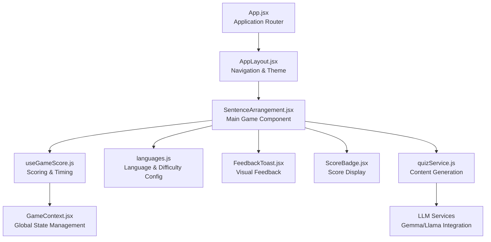
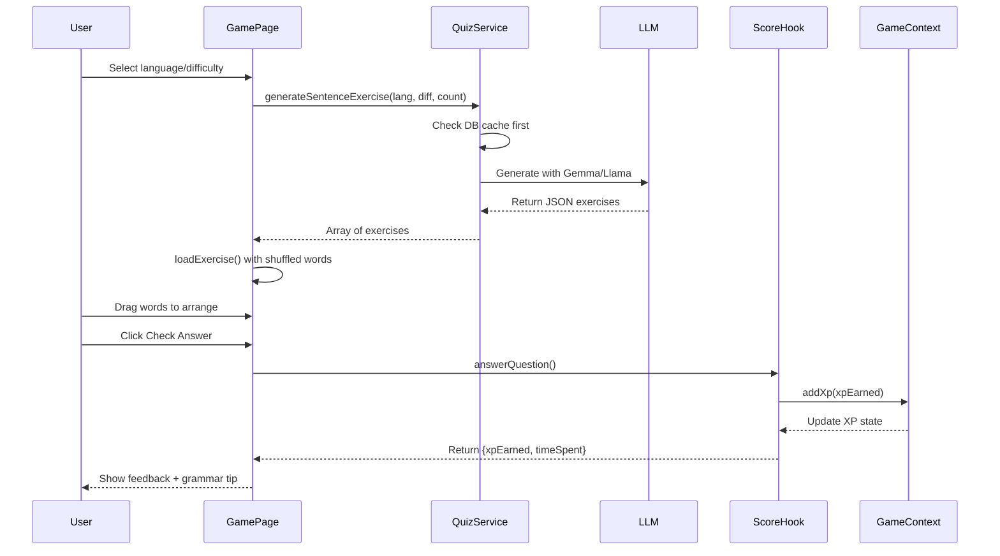
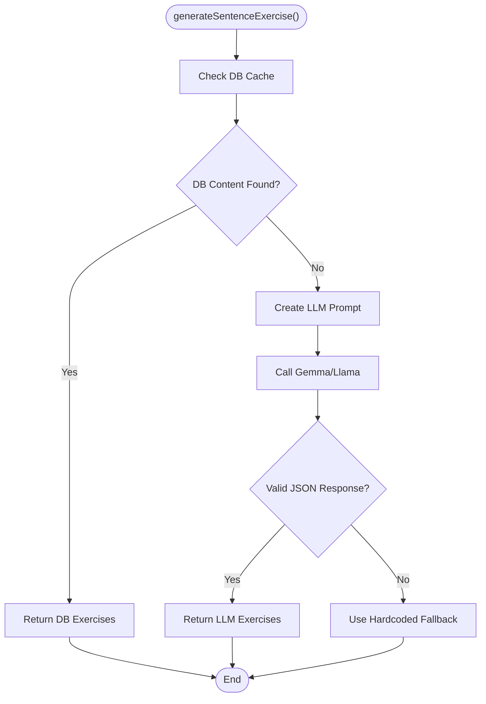
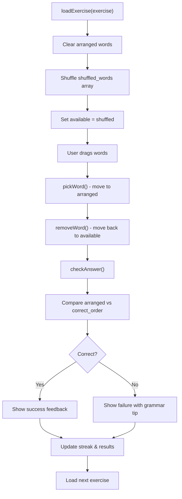
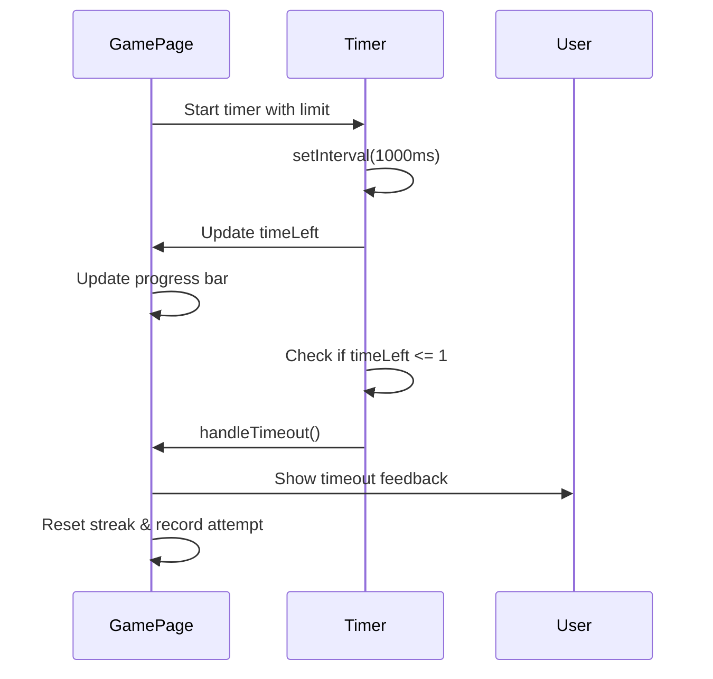
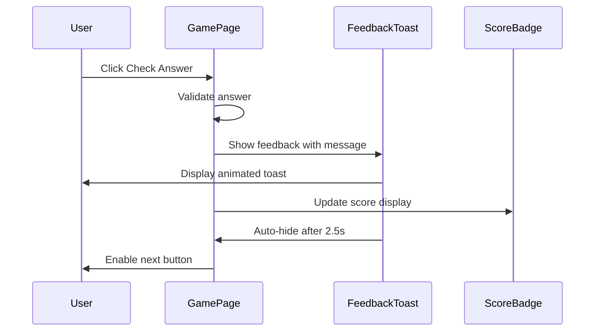
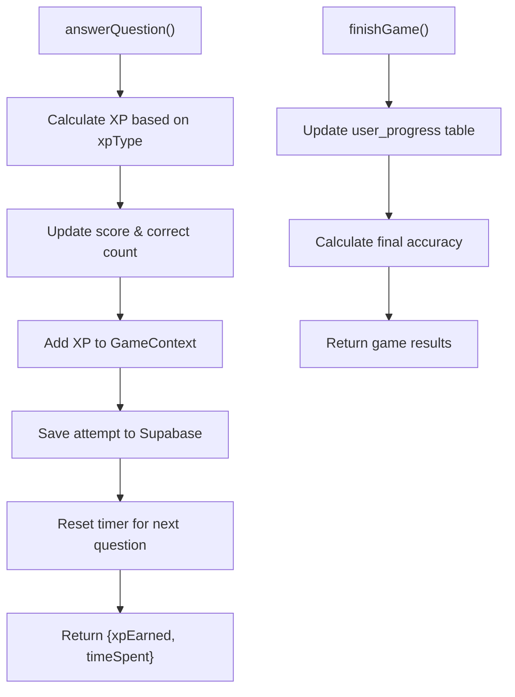
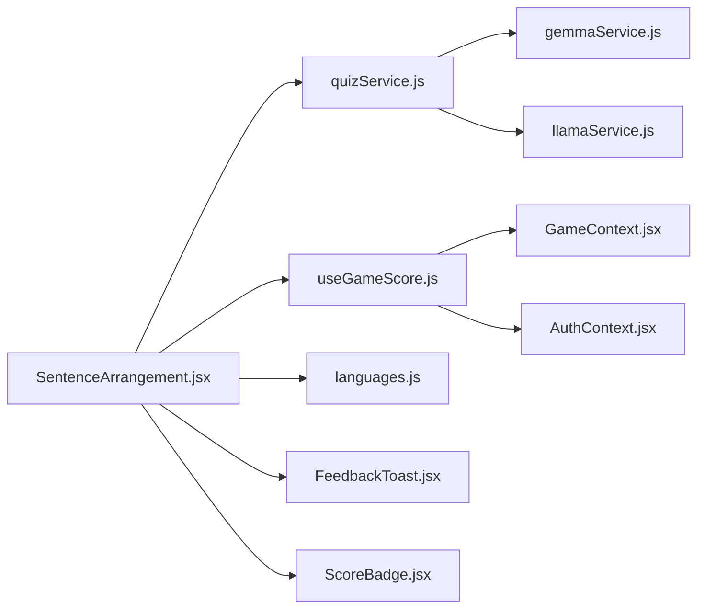

# Sentence Arrangement

<cite>
**Referenced Files in This Document**
- [SentenceArrangement.jsx](file://src/pages/games/SentenceArrangement.jsx)
- [quizService.js](file://src/services/quizService.js)
- [useGameScore.js](file://src/hooks/useGameScore.js)
- [GameContext.jsx](file://src/contexts/GameContext.jsx)
- [languages.js](file://src/config/languages.js)
- [FeedbackToast.jsx](file://src/components/FeedbackToast.jsx)
- [ScoreBadge.jsx](file://src/components/ScoreBadge.jsx)
- [App.jsx](file://src/App.jsx)
- [AppLayout.jsx](file://src/layouts/AppLayout.jsx)
</cite>

## Update Summary
**Changes Made**
- Added comprehensive documentation for the new Sentence Arrangement game system
- Documented the complete game flow from setup to results
- Explained word scrambling algorithms and sentence construction logic
- Detailed the grammar explanation system and hint functionality
- Documented timer functionality and progressive difficulty scaling
- Added implementation examples for sentence generation and validation
- Updated architecture diagrams to reflect the new component structure

## Table of Contents
1. [Introduction](#introduction)
2. [Project Structure](#project-structure)
3. [Core Components](#core-components)
4. [Architecture Overview](#architecture-overview)
5. [Detailed Component Analysis](#detailed-component-analysis)
6. [Dependency Analysis](#dependency-analysis)
7. [Performance Considerations](#performance-considerations)
8. [Troubleshooting Guide](#troubleshooting-guide)
9. [Conclusion](#conclusion)

## Introduction
This document explains the Sentence Arrangement game system that teaches grammar and word-order recognition by having users reorder scrambled words into correct sentences. The game presents users with shuffled words that they must arrange in the proper grammatical order to form complete sentences. It covers sentence generation from multiple sources, word scrambling algorithms, validation processes, visual feedback systems, and educational objectives focused on grammar instruction.

## Project Structure
The game is implemented as a React page integrated into the application routing system. It follows a modular architecture with clear separation between UI presentation, game logic, content generation, and state management. The system supports multiple languages and difficulty levels while providing immediate feedback and educational reinforcement.

**Diagram sources**
- [App.jsx:19-49](file://src/App.jsx#L19-L49)
- [AppLayout.jsx:17-41](file://src/layouts/AppLayout.jsx#L17-L41)
- [SentenceArrangement.jsx:9-448](file://src/pages/games/SentenceArrangement.jsx#L9-L448)
- [useGameScore.js:7-101](file://src/hooks/useGameScore.js#L7-L101)
- [languages.js:1-30](file://src/config/languages.js#L1-L30)
- [FeedbackToast.jsx:4-39](file://src/components/FeedbackToast.jsx#L4-L39)
- [ScoreBadge.jsx:3-37](file://src/components/ScoreBadge.jsx#L3-L37)
- [quizService.js:77-134](file://src/services/quizService.js#L77-L134)
- [GameContext.jsx:57-141](file://src/contexts/GameContext.jsx#L57-L141)

**Section sources**
- [App.jsx:19-49](file://src/App.jsx#L19-L49)
- [AppLayout.jsx:6-15](file://src/layouts/AppLayout.jsx#L6-L15)

## Core Components
The Sentence Arrangement game consists of several interconnected components that work together to provide an engaging educational experience:

- **SentenceArrangement.jsx**: Main game component handling game phases, user interactions, and state management
- **quizService.js**: Generates sentence exercises from database, LLMs, or fallback data
- **useGameScore.js**: Manages scoring, timing, and persistence of quiz attempts
- **GameContext.jsx**: Provides global game state including XP, level, and streak tracking
- **FeedbackToast.jsx**: Displays contextual feedback with animations
- **ScoreBadge.jsx**: Shows current XP score with visual enhancements

Key implementation references:
- Game lifecycle and state management: [SentenceArrangement.jsx:9-448](file://src/pages/games/SentenceArrangement.jsx#L9-L448)
- Exercise generation pipeline: [quizService.js:77-134](file://src/services/quizService.js#L77-L134)
- Scoring and persistence: [useGameScore.js:28-86](file://src/hooks/useGameScore.js#L28-L86)
- Global state management: [GameContext.jsx:20-55](file://src/contexts/GameContext.jsx#L20-L55), [languages.js:20-25](file://src/config/languages.js#L20-L25)
- Visual feedback components: [FeedbackToast.jsx:4-39](file://src/components/FeedbackToast.jsx#L4-L39), [ScoreBadge.jsx:3-37](file://src/components/ScoreBadge.jsx#L3-L37)

**Section sources**
- [SentenceArrangement.jsx:9-448](file://src/pages/games/SentenceArrangement.jsx#L9-L448)
- [quizService.js:77-134](file://src/services/quizService.js#L77-L134)
- [useGameScore.js:28-86](file://src/hooks/useGameScore.js#L28-L86)
- [GameContext.jsx:20-55](file://src/contexts/GameContext.jsx#L20-L55)
- [languages.js:20-25](file://src/config/languages.js#L20-L25)
- [FeedbackToast.jsx:4-39](file://src/components/FeedbackToast.jsx#L4-L39)
- [ScoreBadge.jsx:3-37](file://src/components/ScoreBadge.jsx#L3-L37)

## Architecture Overview
The game follows a clean separation of concerns with distinct layers for presentation, business logic, data services, and state management:

**Diagram sources**
- [SentenceArrangement.jsx:73-100](file://src/pages/games/SentenceArrangement.jsx#L73-L100)
- [quizService.js:77-134](file://src/services/quizService.js#L77-L134)
- [useGameScore.js:28-60](file://src/hooks/useGameScore.js#L28-L60)
- [GameContext.jsx:76-85](file://src/contexts/GameContext.jsx#L76-L85)

## Detailed Component Analysis

### Sentence Generation and Content Pipeline
The game generates sentence exercises through a robust fallback system that prioritizes database content, falls back to LLM generation, and finally uses hardcoded fallback data.

**Diagram sources**
- [quizService.js:77-134](file://src/services/quizService.js#L77-L134)
- [quizService.js:233-257](file://src/services/quizService.js#L233-L257)

**Section sources**
- [quizService.js:77-134](file://src/services/quizService.js#L77-L134)
- [quizService.js:233-257](file://src/services/quizService.js#L233-L257)

### Word Scrambling and Sentence Construction Logic
The game implements a sophisticated word arrangement system with real-time validation and visual feedback:

**Diagram sources**
- [SentenceArrangement.jsx:92-158](file://src/pages/games/SentenceArrangement.jsx#L92-L158)

**Section sources**
- [SentenceArrangement.jsx:92-158](file://src/pages/games/SentenceArrangement.jsx#L92-L158)

### Timer System and Progressive Difficulty
The game features a dynamic timer system with difficulty-based time limits and visual countdown indicators:

**Diagram sources**
- [SentenceArrangement.jsx:29-71](file://src/pages/games/SentenceArrangement.jsx#L29-L71)

**Section sources**
- [SentenceArrangement.jsx:29-71](file://src/pages/games/SentenceArrangement.jsx#L29-L71)

### UI Interaction and Visual Feedback System
The game provides comprehensive visual feedback through animated components and contextual messaging:

**Diagram sources**
- [SentenceArrangement.jsx:122-158](file://src/pages/games/SentenceArrangement.jsx#L122-L158)
- [FeedbackToast.jsx:4-39](file://src/components/FeedbackToast.jsx#L4-L39)
- [ScoreBadge.jsx:3-37](file://src/components/ScoreBadge.jsx#L3-L37)

**Section sources**
- [SentenceArrangement.jsx:122-158](file://src/pages/games/SentenceArrangement.jsx#L122-L158)
- [FeedbackToast.jsx:4-39](file://src/components/FeedbackToast.jsx#L4-L39)
- [ScoreBadge.jsx:3-37](file://src/components/ScoreBadge.jsx#L3-L37)

### Scoring, XP Mechanics, and Progress Tracking
The game implements a comprehensive scoring system with XP rewards, streak bonuses, and persistent progress tracking:

**Diagram sources**
- [useGameScore.js:28-86](file://src/hooks/useGameScore.js#L28-L86)
- [GameContext.jsx:76-85](file://src/contexts/GameContext.jsx#L76-L85)

**Section sources**
- [useGameScore.js:28-86](file://src/hooks/useGameScore.js#L28-L86)
- [GameContext.jsx:76-85](file://src/contexts/GameContext.jsx#L76-L85)

### Educational Objectives and Grammar Reinforcement
The game focuses on explicit grammar instruction through structured exercises and contextual explanations:

- **Grammar Instruction**: Each exercise includes a grammar tip explaining the underlying rule
- **Word Order Recognition**: Players practice arranging words according to target language syntax
- **Language Structure Understanding**: Hints and correct answers reinforce morphosyntactic patterns
- **Progressive Complexity**: Difficulty levels increase sentence complexity and grammatical structures

Implementation references:
- Grammar tips in exercise generation: [quizService.js:117](file://src/services/quizService.js#L117)
- Feedback with grammar explanations: [SentenceArrangement.jsx:132-138](file://src/pages/games/SentenceArrangement.jsx#L132-L138)

**Section sources**
- [quizService.js:117](file://src/services/quizService.js#L117)
- [SentenceArrangement.jsx:132-138](file://src/pages/games/SentenceArrangement.jsx#L132-L138)

### Hint System and Learning Support
The game provides strategic hint support to aid learning without compromising the challenge:

- **Hint Toggle**: Users can reveal grammar tips once per exercise
- **Contextual Support**: Hints explain grammatical rules and sentence structures
- **Non-intrusive Design**: Hints appear as contextual alerts without disrupting gameplay

**Section sources**
- [SentenceArrangement.jsx:410-414](file://src/pages/games/SentenceArrangement.jsx#L410-L414)

## Dependency Analysis
The Sentence Arrangement game has a well-defined dependency structure that promotes modularity and maintainability:

**Diagram sources**
- [SentenceArrangement.jsx:6-7](file://src/pages/games/SentenceArrangement.jsx#L6-L7)
- [quizService.js:1-3](file://src/services/quizService.js#L1-L3)
- [useGameScore.js:2-5](file://src/hooks/useGameScore.js#L2-L5)
- [languages.js:1-7](file://src/config/languages.js#L1-L7)
- [FeedbackToast.jsx:1-3](file://src/components/FeedbackToast.jsx#L1-L3)
- [ScoreBadge.jsx:1-2](file://src/components/ScoreBadge.jsx#L1-L2)

**Section sources**
- [SentenceArrangement.jsx:6-7](file://src/pages/games/SentenceArrangement.jsx#L6-L7)
- [quizService.js:1-3](file://src/services/quizService.js#L1-L3)
- [useGameScore.js:2-5](file://src/hooks/useGameScore.js#L2-L5)
- [languages.js:1-7](file://src/config/languages.js#L1-L7)
- [FeedbackToast.jsx:1-3](file://src/components/FeedbackToast.jsx#L1-L3)
- [ScoreBadge.jsx:1-2](file://src/components/ScoreBadge.jsx#L1-L2)

## Performance Considerations
The game is designed with performance optimization in mind:

- **Efficient State Management**: Uses React hooks and controlled components to minimize re-renders
- **Memory Optimization**: Exercises are loaded incrementally and cleared when not needed
- **Network Resilience**: Implements fallback mechanisms to prevent UI blocking
- **Animation Performance**: Uses Framer Motion for smooth, hardware-accelerated animations
- **Timer Efficiency**: Single interval timer per exercise with proper cleanup

## Troubleshooting Guide
Common issues and their solutions:

**Exercise Loading Issues**
- Verify LLM API keys and endpoints are configured correctly
- Check network connectivity for LLM services
- Ensure fallback data is available when LLM generation fails

**Validation Problems**
- Confirm string comparison uses joined arrays rather than array references
- Verify shuffled words are properly copied before modification
- Check that grammar tips are included in exercise data

**Timer and Scoring Issues**
- Ensure timer cleanup occurs on component unmount
- Verify XP reward calculation matches difficulty settings
- Check that streak counter resets appropriately on timeouts

**UI Animation Problems**
- Confirm Framer Motion dependencies are properly installed
- Verify animation callbacks are properly cleaned up
- Check that feedback toast auto-dismisses correctly

**Section sources**
- [quizService.js:104-130](file://src/services/quizService.js#L104-L130)
- [SentenceArrangement.jsx:122-158](file://src/pages/games/SentenceArrangement.jsx#L122-L158)
- [useGameScore.js:28-60](file://src/hooks/useGameScore.js#L28-L60)

## Conclusion
The Sentence Arrangement game represents a comprehensive approach to language learning through interactive grammar instruction. By combining LLM-generated content with intuitive drag-and-drop mechanics, the game creates an engaging environment for practicing sentence construction. The modular architecture ensures maintainability while the comprehensive feedback system supports effective learning outcomes. The game successfully balances educational value with entertainment, making grammar practice accessible and enjoyable for language learners across different proficiency levels.