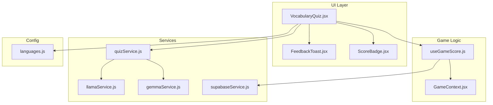
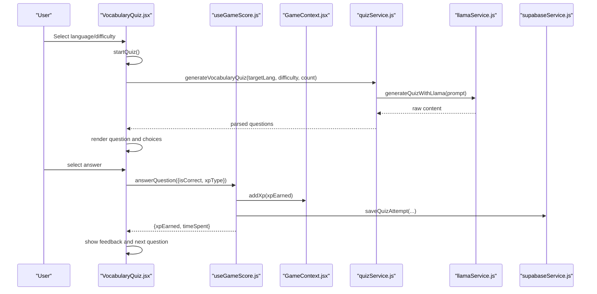
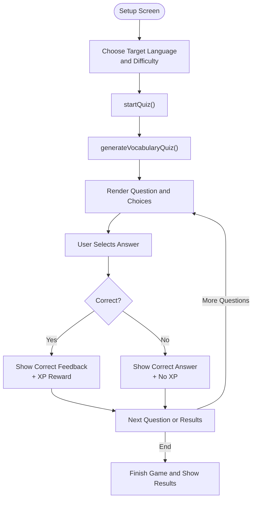
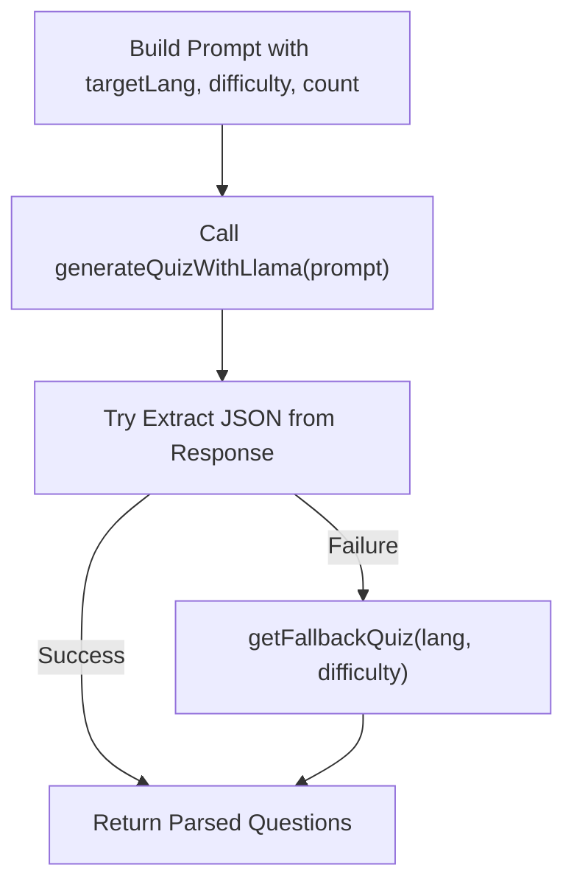
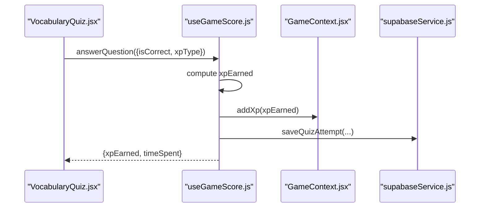
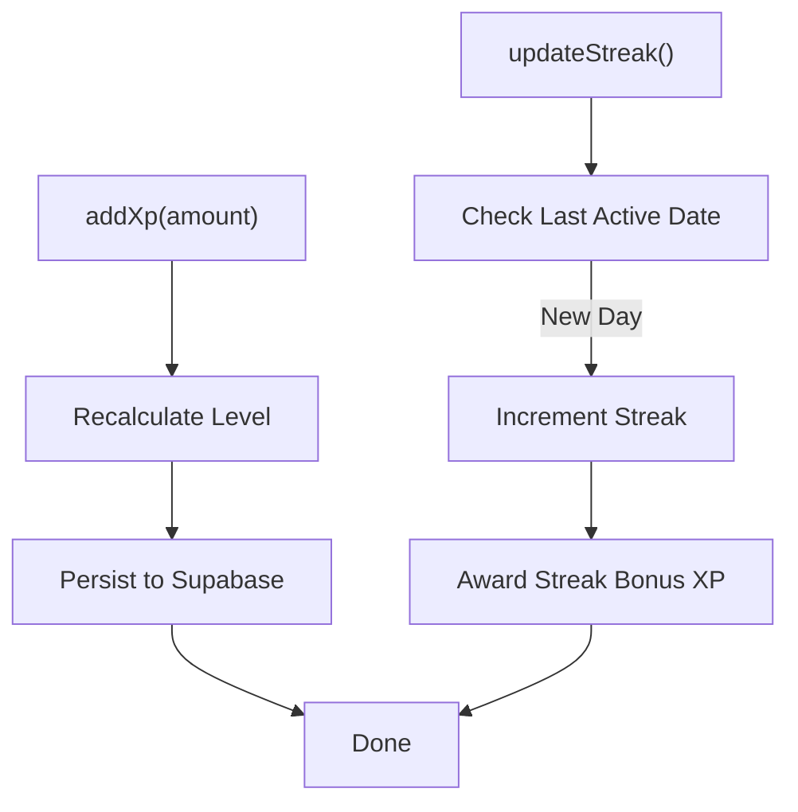
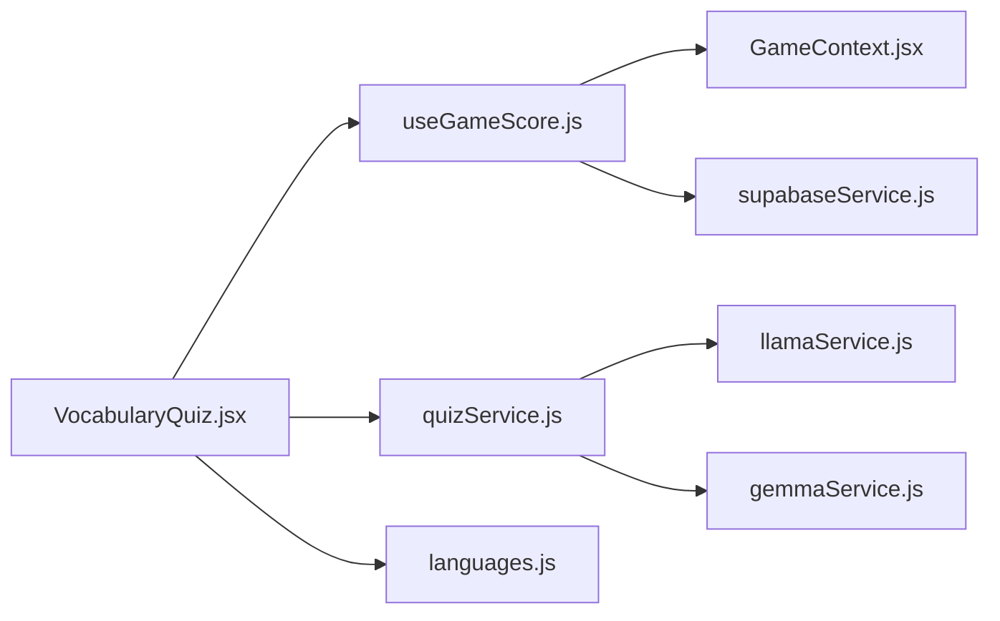

# Vocabulary Quiz

<cite>
**Referenced Files in This Document**
- [VocabularyQuiz.jsx](file://src/pages/games/VocabularyQuiz.jsx)
- [quizService.js](file://src/services/quizService.js)
- [llamaService.js](file://src/services/llamaService.js)
- [gemmaService.js](file://src/services/gemmaService.js)
- [useGameScore.js](file://src/hooks/useGameScore.js)
- [GameContext.jsx](file://src/contexts/GameContext.jsx)
- [languages.js](file://src/config/languages.js)
- [supabaseService.js](file://src/services/supabaseService.js)
- [FeedbackToast.jsx](file://src/components/FeedbackToast.jsx)
- [ScoreBadge.jsx](file://src/components/ScoreBadge.jsx)
- [mockData.js](file://src/data/mockData.js)
</cite>

## Table of Contents
1. [Introduction](#introduction)
2. [Project Structure](#project-structure)
3. [Core Components](#core-components)
4. [Architecture Overview](#architecture-overview)
5. [Detailed Component Analysis](#detailed-component-analysis)
6. [Dependency Analysis](#dependency-analysis)
7. [Performance Considerations](#performance-considerations)
8. [Troubleshooting Guide](#troubleshooting-guide)
9. [Conclusion](#conclusion)
10. [Appendices](#appendices)

## Introduction
This document describes the vocabulary quiz game system, covering how questions are generated, how multiple-choice options are formatted, how answers are validated, and how scores and XP rewards are calculated. It documents the quizService implementation for dynamic vocabulary content creation, including language selection, difficulty levels, and fallback mechanisms. It also explains the user interface components for displaying quiz questions, answer choices, and immediate feedback, and provides guidance on customizing quiz content, adding new vocabulary categories, and implementing adaptive difficulty based on user performance.

## Project Structure
The vocabulary quiz is implemented as a React page that orchestrates user interactions, integrates with a scoring hook, and delegates question generation to a service that uses LLM APIs. Data persistence is handled by a Supabase service, and global game state (XP, level, streak) is managed by a context provider.

**Diagram sources**
- [VocabularyQuiz.jsx:1-215](file://src/pages/games/VocabularyQuiz.jsx#L1-L215)
- [quizService.js:1-154](file://src/services/quizService.js#L1-L154)
- [llamaService.js:1-84](file://src/services/llamaService.js#L1-L84)
- [gemmaService.js:1-56](file://src/services/gemmaService.js#L1-L56)
- [useGameScore.js:1-76](file://src/hooks/useGameScore.js#L1-L76)
- [GameContext.jsx:1-141](file://src/contexts/GameContext.jsx#L1-L141)
- [languages.js:1-30](file://src/config/languages.js#L1-L30)
- [supabaseService.js:1-132](file://src/services/supabaseService.js#L1-L132)
- [FeedbackToast.jsx:1-39](file://src/components/FeedbackToast.jsx#L1-L39)
- [ScoreBadge.jsx:1-37](file://src/components/ScoreBadge.jsx#L1-L37)

**Section sources**
- [VocabularyQuiz.jsx:1-215](file://src/pages/games/VocabularyQuiz.jsx#L1-L215)
- [quizService.js:1-154](file://src/services/quizService.js#L1-L154)
- [useGameScore.js:1-76](file://src/hooks/useGameScore.js#L1-L76)
- [GameContext.jsx:1-141](file://src/contexts/GameContext.jsx#L1-L141)
- [languages.js:1-30](file://src/config/languages.js#L1-L30)
- [supabaseService.js:1-132](file://src/services/supabaseService.js#L1-L132)
- [FeedbackToast.jsx:1-39](file://src/components/FeedbackToast.jsx#L1-L39)
- [ScoreBadge.jsx:1-37](file://src/components/ScoreBadge.jsx#L1-L37)

## Core Components
- VocabularyQuiz page: Manages quiz lifecycle (setup, playing, results), collects language and difficulty preferences, renders questions and answer choices, and triggers feedback and scoring.
- quizService: Generates vocabulary quiz questions using LLM prompts and falls back to static content when needed.
- useGameScore: Tracks score, correct answers, total answers, accuracy, and persists attempts to Supabase.
- GameContext: Centralized game state (XP, level, streak) and persistence to Supabase.
- LLM Services: llamaService and gemmaService encapsulate external API calls for quiz generation and translation.
- UI Components: FeedbackToast and ScoreBadge provide immediate feedback and score display.

**Section sources**
- [VocabularyQuiz.jsx:9-215](file://src/pages/games/VocabularyQuiz.jsx#L9-L215)
- [quizService.js:8-32](file://src/services/quizService.js#L8-L32)
- [useGameScore.js:7-76](file://src/hooks/useGameScore.js#L7-L76)
- [GameContext.jsx:8-55](file://src/contexts/GameContext.jsx#L8-L55)
- [llamaService.js:62-83](file://src/services/llamaService.js#L62-L83)
- [gemmaService.js:47-55](file://src/services/gemmaService.js#L47-L55)
- [FeedbackToast.jsx:4-39](file://src/components/FeedbackToast.jsx#L4-L39)
- [ScoreBadge.jsx:3-37](file://src/components/ScoreBadge.jsx#L3-L37)

## Architecture Overview
The vocabulary quiz follows a layered architecture:
- UI layer handles rendering and user interactions.
- Game logic manages scoring and persistence.
- Services encapsulate external integrations (LLM APIs) and local fallbacks.
- Config defines languages, difficulty levels, and XP rewards.
- Data persistence stores quiz attempts and user progress.

**Diagram sources**
- [VocabularyQuiz.jsx:21-68](file://src/pages/games/VocabularyQuiz.jsx#L21-L68)
- [quizService.js:8-32](file://src/services/quizService.js#L8-L32)
- [llamaService.js:62-83](file://src/services/llamaService.js#L62-L83)
- [useGameScore.js:23-55](file://src/hooks/useGameScore.js#L23-L55)
- [GameContext.jsx:76-85](file://src/contexts/GameContext.jsx#L76-L85)
- [supabaseService.js:32-45](file://src/services/supabaseService.js#L32-L45)

## Detailed Component Analysis

### VocabularyQuiz Page
Responsibilities:
- Collects target language and difficulty.
- Generates a quiz with a fixed count (default 5).
- Renders the current question and answer choices.
- Handles answer selection, correctness validation, and immediate feedback.
- Manages transitions between setup, playing, and results screens.
- Integrates with useGameScore for scoring and with FeedbackToast for feedback.

Key behaviors:
- Language selection filters out English and allows choosing among configured languages.
- Difficulty selection maps to predefined difficulty levels.
- On answer selection, correctness determines feedback message and XP reward.
- After the last question, finishes the game and shows results with accuracy and XP.

**Diagram sources**
- [VocabularyQuiz.jsx:21-68](file://src/pages/games/VocabularyQuiz.jsx#L21-L68)
- [FeedbackToast.jsx:4-39](file://src/components/FeedbackToast.jsx#L4-L39)

**Section sources**
- [VocabularyQuiz.jsx:9-215](file://src/pages/games/VocabularyQuiz.jsx#L9-L215)
- [FeedbackToast.jsx:4-39](file://src/components/FeedbackToast.jsx#L4-L39)

### quizService: Question Generation and Formatting
Responsibilities:
- Builds a structured prompt for vocabulary translation questions.
- Calls LLM to generate JSON-formatted questions.
- Parses and validates responses, falling back to static quizzes if parsing fails.
- Provides fallbacks for sentence arrangements and daily challenges.

Key behaviors:
- Prompt construction includes target language, difficulty, and required JSON structure.
- Attempts to extract JSON from LLM output; otherwise parses non-standard JSON.
- Returns a static quiz for Spanish and French if parsing fails.
- Exposes helpers for sentence arrangements and daily challenges.

**Diagram sources**
- [quizService.js:8-32](file://src/services/quizService.js#L8-L32)
- [llamaService.js:62-83](file://src/services/llamaService.js#L62-L83)
- [quizService.js:95-113](file://src/services/quizService.js#L95-L113)

**Section sources**
- [quizService.js:8-32](file://src/services/quizService.js#L8-L32)
- [llamaService.js:62-83](file://src/services/llamaService.js#L62-L83)
- [quizService.js:95-113](file://src/services/quizService.js#L95-L113)

### useGameScore: Scoring, Accuracy, and Persistence
Responsibilities:
- Tracks score, correct answers, total answers, and accuracy.
- Calculates XP reward based on XP_REWARDS and correctness.
- Persists each quiz attempt to Supabase with question data, answers, correctness, XP earned, and time spent.
- Integrates with GameContext to update XP and streak.

Key behaviors:
- answerQuestion increments counters, adds XP, records answer, saves attempt, and resets timer.
- finishGame computes accuracy and returns final stats.
- resetScore initializes counters and starts timer.

**Diagram sources**
- [useGameScore.js:23-55](file://src/hooks/useGameScore.js#L23-L55)
- [GameContext.jsx:76-85](file://src/contexts/GameContext.jsx#L76-L85)
- [supabaseService.js:32-45](file://src/services/supabaseService.js#L32-L45)

**Section sources**
- [useGameScore.js:7-76](file://src/hooks/useGameScore.js#L7-L76)
- [GameContext.jsx:20-55](file://src/contexts/GameContext.jsx#L20-L55)
- [supabaseService.js:32-45](file://src/services/supabaseService.js#L32-L45)

### GameContext: XP, Level, Streak, and Persistence
Responsibilities:
- Maintains XP, level, streak, and aggregated stats.
- Persists XP and level updates to Supabase.
- Updates streak and awards streak bonus XP.
- Computes accuracy from correct and total answers.

Key behaviors:
- addXp recalculates level and tracks recent XP gains.
- updateStreak checks last active date and increments streak, awarding bonus XP.

**Diagram sources**
- [GameContext.jsx:76-119](file://src/contexts/GameContext.jsx#L76-L119)
- [languages.js:20-25](file://src/config/languages.js#L20-L25)

**Section sources**
- [GameContext.jsx:76-119](file://src/contexts/GameContext.jsx#L76-L119)
- [languages.js:20-25](file://src/config/languages.js#L20-L25)

### UI Components: FeedbackToast and ScoreBadge
- FeedbackToast displays immediate feedback with animation and auto-dismissal.
- ScoreBadge shows current XP with animated appearance.

**Section sources**
- [FeedbackToast.jsx:4-39](file://src/components/FeedbackToast.jsx#L4-L39)
- [ScoreBadge.jsx:3-37](file://src/components/ScoreBadge.jsx#L3-L37)

### Educational Aspects and Content Design
- Language selection and difficulty levels influence prompt complexity and vocabulary range.
- Static fallback quizzes ensure basic functionality when LLM parsing fails.
- XP rewards encourage correctness and sustained practice.
- Mock data demonstrates typical vocabulary items and sentence structures.

**Section sources**
- [languages.js:1-30](file://src/config/languages.js#L1-L30)
- [quizService.js:95-113](file://src/services/quizService.js#L95-L113)
- [mockData.js:33-38](file://src/data/mockData.js#L33-L38)

## Dependency Analysis
The vocabulary quiz depends on:
- quizService for question generation.
- LLM services for external API calls.
- useGameScore for scoring and persistence.
- GameContext for XP and level management.
- Supabase service for storing quiz attempts and user progress.
- Config for languages, difficulty levels, and XP rewards.

**Diagram sources**
- [VocabularyQuiz.jsx:1-8](file://src/pages/games/VocabularyQuiz.jsx#L1-L8)
- [quizService.js:1-3](file://src/services/quizService.js#L1-L3)
- [llamaService.js:1-2](file://src/services/llamaService.js#L1-L2)
- [gemmaService.js:1-4](file://src/services/gemmaService.js#L1-L4)
- [useGameScore.js:1-5](file://src/hooks/useGameScore.js#L1-L5)
- [GameContext.jsx:1-5](file://src/contexts/GameContext.jsx#L1-L5)
- [languages.js:1-5](file://src/config/languages.js#L1-L5)
- [supabaseService.js](file://src/services/supabaseService.js#L1)

**Section sources**
- [VocabularyQuiz.jsx:1-8](file://src/pages/games/VocabularyQuiz.jsx#L1-L8)
- [quizService.js:1-3](file://src/services/quizService.js#L1-L3)
- [useGameScore.js:1-5](file://src/hooks/useGameScore.js#L1-L5)
- [GameContext.jsx:1-5](file://src/contexts/GameContext.jsx#L1-L5)
- [languages.js:1-5](file://src/config/languages.js#L1-L5)
- [supabaseService.js](file://src/services/supabaseService.js#L1)

## Performance Considerations
- Minimize network calls by batching and caching where feasible.
- Use client-side animations sparingly to maintain responsiveness.
- Validate and sanitize LLM responses to reduce retries and fallbacks.
- Persist only essential fields to reduce database load.

## Troubleshooting Guide
Common issues and resolutions:
- LLM API errors: quizService catches and falls back to static quizzes.
- Parsing failures: quizService attempts to extract JSON or falls back to defaults.
- Supabase write failures: useGameScore logs and continues to avoid blocking UX.
- Authentication state changes: AuthContext ensures profile data is loaded and used consistently.

**Section sources**
- [quizService.js:24-32](file://src/services/quizService.js#L24-L32)
- [quizService.js:90-93](file://src/services/quizService.js#L90-L93)
- [useGameScore.js:36-51](file://src/hooks/useGameScore.js#L36-L51)
- [AuthContext.jsx:12-40](file://src/contexts/AuthContext.jsx#L12-L40)

## Conclusion
The vocabulary quiz system combines a clean UI layer with robust game logic and external LLM integration. It emphasizes correctness-driven XP rewards, immediate feedback, and persistent tracking of user progress. The modular design enables easy customization of content, languages, and difficulty levels, and provides a foundation for adaptive difficulty and personalized learning paths.

## Appendices

### Scoring Algorithm and XP Rewards
- Correct answer: XP reward equals XP_REWARDS.quizCorrect.
- Incorrect answer: XP reward is zero.
- Accuracy computed as correct divided by total, multiplied by 100 and rounded.
- Streak bonus XP awarded upon successful streak updates.

**Section sources**
- [languages.js:20-25](file://src/config/languages.js#L20-L25)
- [useGameScore.js:23-33](file://src/hooks/useGameScore.js#L23-L33)
- [GameContext.jsx:107-119](file://src/contexts/GameContext.jsx#L107-L119)

### Customization Guidelines
- Adding new languages:
  - Extend LANGUAGES in config and ensure quizService fallbacks include new language entries.
  - Update UI language selector if needed.
- Adding new vocabulary categories:
  - Modify quizService prompt to include category-specific instructions.
  - Adjust parsing expectations and fallbacks accordingly.
- Implementing adaptive difficulty:
  - Track user accuracy and adjust difficulty dynamically in the setup phase.
  - Consider streak-based difficulty scaling and spaced repetition patterns.

**Section sources**
- [languages.js:1-30](file://src/config/languages.js#L1-L30)
- [quizService.js:8-32](file://src/services/quizService.js#L8-L32)
- [useGameScore.js:57-61](file://src/hooks/useGameScore.js#L57-L61)