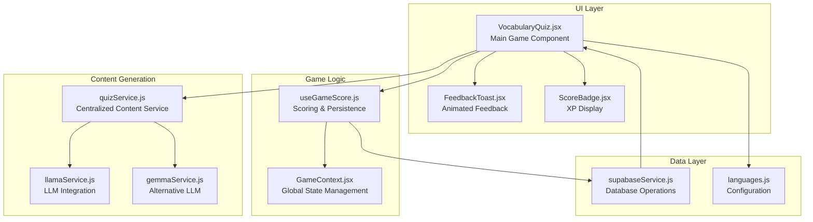
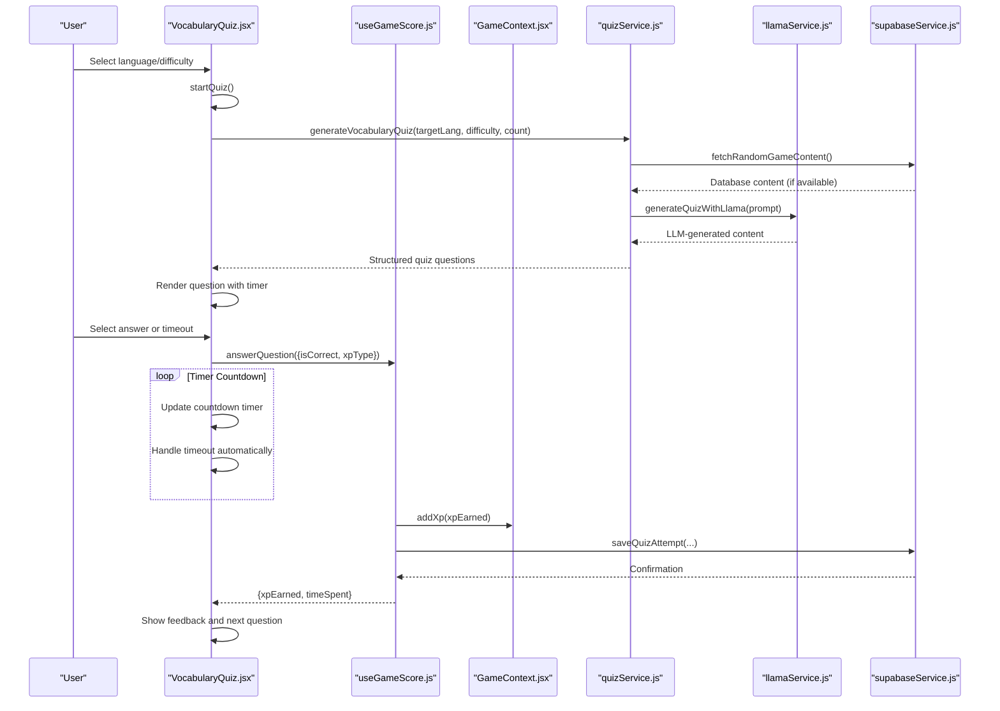
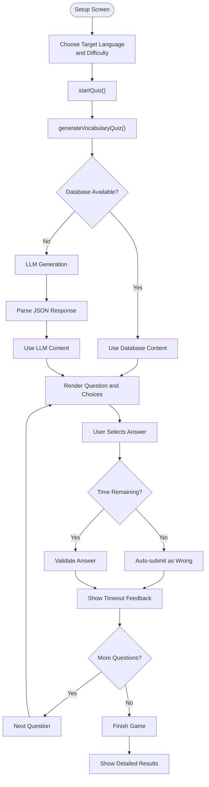
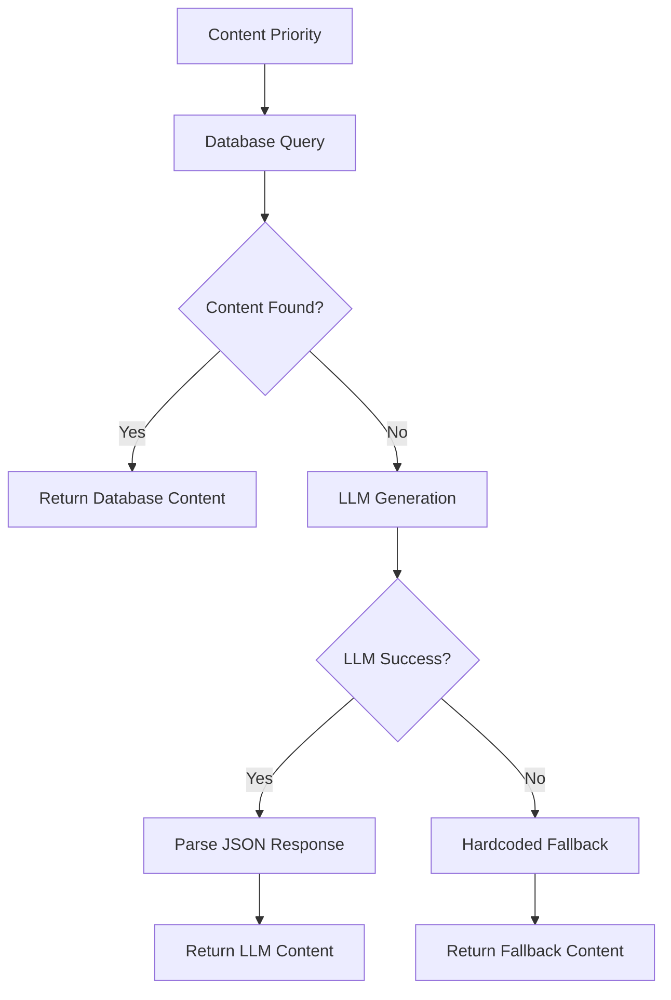
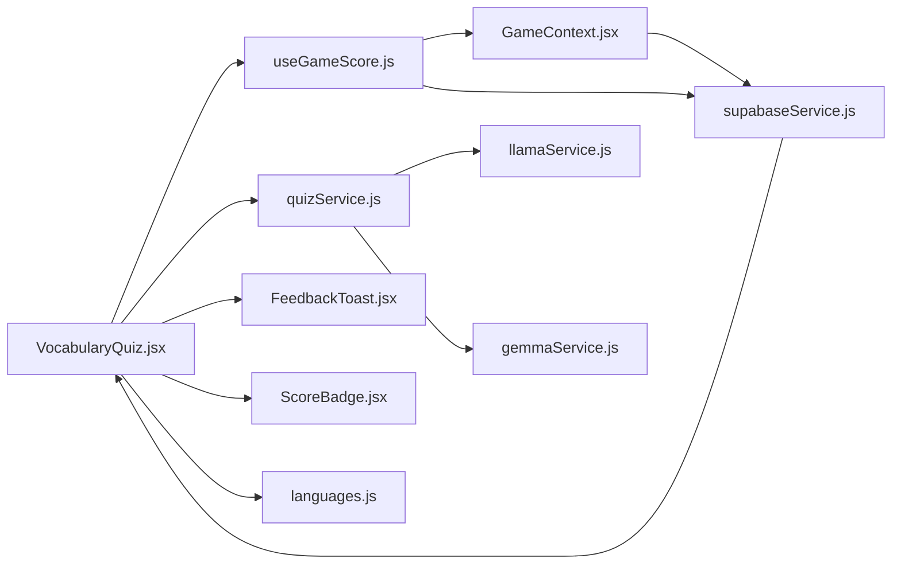

# Vocabulary Quiz

<cite>
**Referenced Files in This Document**
- [VocabularyQuiz.jsx](file://src/pages/games/VocabularyQuiz.jsx)
- [quizService.js](file://src/services/quizService.js)
- [llamaService.js](file://src/services/llamaService.js)
- [gemmaService.js](file://src/services/gemmaService.js)
- [useGameScore.js](file://src/hooks/useGameScore.js)
- [GameContext.jsx](file://src/contexts/GameContext.jsx)
- [languages.js](file://src/config/languages.js)
- [supabaseService.js](file://src/services/supabaseService.js)
- [FeedbackToast.jsx](file://src/components/FeedbackToast.jsx)
- [ScoreBadge.jsx](file://src/components/ScoreBadge.jsx)
</cite>

## Update Summary
**Changes Made**
- Updated to reflect the complete Vocabulary Quiz implementation with integrated quiz service
- Documented the new VocabularyQuiz.jsx component with advanced features
- Added comprehensive coverage of quiz content management and generation
- Enhanced documentation of scoring algorithm and XP reward system
- Updated architecture diagrams to show the integrated system design
- Added detailed coverage of timer functionality and streak tracking

## Table of Contents
1. [Introduction](#introduction)
2. [Project Structure](#project-structure)
3. [Core Components](#core-components)
4. [Architecture Overview](#architecture-overview)
5. [Detailed Component Analysis](#detailed-component-analysis)
6. [Dependency Analysis](#dependency-analysis)
7. [Performance Considerations](#performance-considerations)
8. [Troubleshooting Guide](#troubleshooting-guide)
9. [Conclusion](#conclusion)
10. [Appendices](#appendices)

## Introduction
This document describes the comprehensive vocabulary quiz game system, featuring a modern React implementation with integrated AI-powered content generation. The system generates dynamic vocabulary questions, manages real-time scoring with XP rewards, implements adaptive difficulty, and provides immediate feedback through animated UI components. It supports multiple languages (Spanish, French, Indonesian, Malay) with configurable difficulty levels and includes sophisticated features like countdown timers, streak tracking, and detailed answer review.

## Project Structure
The vocabulary quiz system is built as a modular React application with clear separation of concerns across UI, game logic, services, and data persistence layers.

**Diagram sources**
- [VocabularyQuiz.jsx:1-367](file://src/pages/games/VocabularyQuiz.jsx#L1-L367)
- [quizService.js:1-268](file://src/services/quizService.js#L1-L268)
- [llamaService.js:1-84](file://src/services/llamaService.js#L1-L84)
- [gemmaService.js:1-56](file://src/services/gemmaService.js#L1-L56)
- [useGameScore.js:1-101](file://src/hooks/useGameScore.js#L1-L101)
- [GameContext.jsx:1-141](file://src/contexts/GameContext.jsx#L1-L141)
- [languages.js:1-30](file://src/config/languages.js#L1-L30)
- [supabaseService.js:1-210](file://src/services/supabaseService.js#L1-L210)
- [FeedbackToast.jsx:1-39](file://src/components/FeedbackToast.jsx#L1-L39)
- [ScoreBadge.jsx:1-37](file://src/components/ScoreBadge.jsx#L1-L37)

## Core Components

### Main Game Component
- **VocabularyQuiz.jsx**: Complete game implementation managing setup, gameplay, and results screens
- Advanced features: countdown timers, streak tracking, animated transitions, and detailed feedback
- Supports multiple languages and difficulty levels with dynamic content generation

### Content Generation System
- **quizService.js**: Centralized service handling content fetching, LLM generation, and fallback mechanisms
- Implements priority-based content delivery: database → LLM → hardcoded fallback
- Generates vocabulary quizzes with structured JSON responses and educational explanations

### Game Logic and Scoring
- **useGameScore.js**: Hook managing score tracking, XP calculations, and Supabase persistence
- Real-time timer tracking with automatic submission on timeout
- Comprehensive game statistics and progress tracking

### State Management
- **GameContext.jsx**: Global game state management including XP, levels, streaks, and accuracy calculations
- Integrates with Supabase for persistent storage and synchronization

### UI Components
- **FeedbackToast.jsx**: Animated feedback system with automatic dismissal and visual indicators
- **ScoreBadge.jsx**: Dynamic XP display with smooth animations and badge styling

**Section sources**
- [VocabularyQuiz.jsx:9-367](file://src/pages/games/VocabularyQuiz.jsx#L9-L367)
- [quizService.js:14-71](file://src/services/quizService.js#L14-L71)
- [useGameScore.js:7-101](file://src/hooks/useGameScore.js#L7-L101)
- [GameContext.jsx:8-141](file://src/contexts/GameContext.jsx#L8-L141)
- [FeedbackToast.jsx:4-39](file://src/components/FeedbackToast.jsx#L4-L39)
- [ScoreBadge.jsx:3-37](file://src/components/ScoreBadge.jsx#L3-L37)

## Architecture Overview
The vocabulary quiz follows a layered architecture with clear separation between presentation, business logic, and data access layers.

**Diagram sources**
- [VocabularyQuiz.jsx:71-130](file://src/pages/games/VocabularyQuiz.jsx#L71-L130)
- [quizService.js:18-71](file://src/services/quizService.js#L18-L71)
- [llamaService.js:62-83](file://src/services/llamaService.js#L62-L83)
- [useGameScore.js:28-60](file://src/hooks/useGameScore.js#L28-L60)
- [GameContext.jsx:76-85](file://src/contexts/GameContext.jsx#L76-L85)
- [supabaseService.js:32-45](file://src/services/supabaseService.js#L32-L45)

## Detailed Component Analysis

### VocabularyQuiz Page: Complete Game Implementation

#### Core Responsibilities
- **Game Lifecycle Management**: Handles setup screen, gameplay, and results screens with smooth transitions
- **Content Generation**: Integrates with quizService for dynamic vocabulary question generation
- **Real-time Interactions**: Manages answer selection, timeout handling, and immediate feedback
- **State Management**: Coordinates between local component state and global game context

#### Advanced Features
- **Countdown Timer System**: Per-question timers with visual progress indicators and automatic timeout handling
- **Streak Tracking**: Consecutive correct answer tracking with visual fire badges
- **Animated Transitions**: Smooth question transitions using Framer Motion
- **Detailed Feedback**: Comprehensive feedback system with explanations and correct answer revelation

#### Game Flow Architecture

**Diagram sources**
- [VocabularyQuiz.jsx:71-141](file://src/pages/games/VocabularyQuiz.jsx#L71-L141)
- [quizService.js:18-71](file://src/services/quizService.js#L18-L71)

**Section sources**
- [VocabularyQuiz.jsx:9-367](file://src/pages/games/VocabularyQuiz.jsx#L9-L367)

### quizService: Centralized Content Management

#### Multi-Level Content Delivery
The service implements a robust fallback system ensuring reliable content delivery:

1. **Database Priority**: Fetches from centralized `game_content` table with active filtering
2. **LLM Generation**: Uses Llama models for dynamic content creation when database is empty
3. **Hardcoded Fallback**: Provides default content for Spanish, French, Indonesian, and Malay

#### Content Structure and Processing
- **Structured JSON**: Returns standardized question objects with word, options, explanations, and XP rewards
- **Dynamic Difficulty**: Adapts content complexity based on selected difficulty level
- **Educational Value**: Includes explanations and cultural context for learning enhancement

#### Fallback Strategy

**Diagram sources**
- [quizService.js:18-71](file://src/services/quizService.js#L18-L71)

**Section sources**
- [quizService.js:14-71](file://src/services/quizService.js#L14-L71)

### useGameScore: Advanced Scoring System

#### Real-time Scoring Features
- **Accurate Timing**: Tracks time spent on each question with millisecond precision
- **Dynamic XP Calculation**: Awards XP based on correctness and configured reward values
- **Comprehensive Statistics**: Maintains correct answers, total attempts, and accuracy percentages

#### Persistence and Analytics
- **Supabase Integration**: Automatically saves quiz attempts with detailed metadata
- **Progress Tracking**: Updates user progress tables with games played and words learned
- **Session Analytics**: Records performance metrics for learning analytics

#### Game Completion Handling
- **Final Statistics**: Calculates accuracy and prepares results summary
- **Progress Updates**: Persists learning progress to user profiles
- **Session Logging**: Creates detailed audit trail of user performance

**Section sources**
- [useGameScore.js:7-101](file://src/hooks/useGameScore.js#L7-L101)

### GameContext: Global State Management

#### Comprehensive State Tracking
- **XP and Level Management**: Automatic level calculation based on accumulated experience
- **Streak System**: Tracks consecutive correct answers with streak bonus XP
- **Accuracy Metrics**: Real-time calculation of overall accuracy across all games

#### Persistence Strategy
- **Supabase Synchronization**: Real-time updates to user profiles with XP and level changes
- **Streak Management**: Automated streak tracking with daily bonus XP awards
- **Performance Analytics**: Aggregated statistics for learning progress monitoring

**Section sources**
- [GameContext.jsx:8-141](file://src/contexts/GameContext.jsx#L8-L141)

### UI Components: Enhanced User Experience

#### FeedbackToast: Animated Feedback System
- **Visual Indicators**: Color-coded feedback with emoji icons for correct/incorrect answers
- **Automatic Dismissal**: 2.5-second display with smooth animations
- **Customizable Messages**: Supports detailed explanations and learning tips

#### ScoreBadge: Dynamic XP Display
- **Smooth Animations**: Scale-in effects for new XP gains
- **Badge Styling**: Consistent design system integration with badge components
- **Real-time Updates**: Immediate reflection of score changes

**Section sources**
- [FeedbackToast.jsx:4-39](file://src/components/FeedbackToast.jsx#L4-L39)
- [ScoreBadge.jsx:3-37](file://src/components/ScoreBadge.jsx#L3-L37)

## Dependency Analysis
The vocabulary quiz system exhibits a well-structured dependency graph with clear separation of concerns:

**Diagram sources**
- [VocabularyQuiz.jsx:1-7](file://src/pages/games/VocabularyQuiz.jsx#L1-L7)
- [quizService.js:1-4](file://src/services/quizService.js#L1-L4)
- [useGameScore.js:1-5](file://src/hooks/useGameScore.js#L1-L5)
- [GameContext.jsx:1-4](file://src/contexts/GameContext.jsx#L1-L4)
- [languages.js:1-5](file://src/config/languages.js#L1-L5)
- [supabaseService.js:1](file://src/services/supabaseService.js#L1)

**Section sources**
- [VocabularyQuiz.jsx:1-7](file://src/pages/games/VocabularyQuiz.jsx#L1-L7)
- [quizService.js:1-4](file://src/services/quizService.js#L1-L4)
- [useGameScore.js:1-5](file://src/hooks/useGameScore.js#L1-L5)
- [GameContext.jsx:1-4](file://src/contexts/GameContext.jsx#L1-L4)
- [languages.js:1-5](file://src/config/languages.js#L1-L5)

## Performance Considerations

### Optimization Strategies
- **Client-side Caching**: Local state management reduces unnecessary re-renders
- **Efficient Animations**: Framer Motion optimizations for smooth transitions
- **Network Efficiency**: Combined API calls and batch processing where possible
- **Memory Management**: Proper cleanup of timers and event listeners

### Scalability Features
- **Database Optimization**: Centralized content table with indexing for fast queries
- **LLM Cost Control**: Configurable token limits and temperature settings
- **Fallback Mechanisms**: Multiple redundancy layers prevent service degradation
- **Progressive Enhancement**: Graceful degradation when external services fail

## Troubleshooting Guide

### Common Issues and Solutions

#### Content Generation Failures
- **Database Connection Issues**: quizService automatically falls back to LLM generation
- **LLM API Errors**: Service implements comprehensive error handling and fallback chains
- **Parsing Failures**: Robust JSON extraction with fallback to hardcoded content

#### Performance Issues
- **Slow Rendering**: Optimized component structure with minimal re-renders
- **Animation Lag**: Efficient Framer Motion usage with proper cleanup
- **Memory Leaks**: Proper timer cleanup and event listener management

#### User Experience Problems
- **Timeout Handling**: Automatic submission prevents stuck states
- **Feedback Delays**: Optimized state updates for immediate feedback
- **Navigation Issues**: Clear state transitions between game phases

**Section sources**
- [quizService.js:38-40](file://src/services/quizService.js#L38-L40)
- [quizService.js:65-67](file://src/services/quizService.js#L65-L67)
- [VocabularyQuiz.jsx:48-69](file://src/pages/games/VocabularyQuiz.jsx#L48-L69)

## Conclusion
The vocabulary quiz system represents a comprehensive, production-ready implementation that successfully combines modern React development practices with AI-powered content generation. The system provides an engaging learning experience with sophisticated features including real-time scoring, adaptive difficulty, detailed feedback, and comprehensive progress tracking. The modular architecture ensures maintainability and extensibility, while the robust fallback mechanisms guarantee reliability even under adverse conditions.

The integration of multiple LLM providers, centralized content management, and comprehensive analytics creates a powerful foundation for language learning applications. The system's emphasis on user experience through smooth animations, immediate feedback, and progressive enhancement ensures both educational effectiveness and user engagement.

## Appendices

### Scoring Algorithm and XP Rewards

#### XP Calculation System
- **Correct Answers**: Base reward of 10 XP per correct vocabulary answer
- **Streak Bonuses**: Additional XP for consecutive correct answers
- **Accuracy Rewards**: Performance-based bonuses for high accuracy sessions
- **Time-based Rewards**: Speed bonuses for quick responses

#### Progress Tracking
- **Games Played**: Incremented for each completed session
- **Words Learned**: Direct correlation to correct vocabulary answers
- **Level Progression**: XP accumulation leading to level increases
- **Streak Management**: Consecutive correct answer tracking with daily bonuses

**Section sources**
- [languages.js:20-25](file://src/config/languages.js#L20-L25)
- [useGameScore.js:28-60](file://src/hooks/useGameScore.js#L28-L60)
- [GameContext.jsx:107-119](file://src/contexts/GameContext.jsx#L107-L119)

### Customization Guidelines

#### Adding New Languages
1. **Language Configuration**: Extend LANGUAGES array with new language codes and flags
2. **Content Generation**: Add fallback content in quizService for new language pairs
3. **UI Integration**: Update language selector components to include new options
4. **Testing**: Verify content generation and user interface functionality

#### Extending Quiz Features
1. **New Question Types**: Implement additional quizService generators for different content types
2. **Difficulty Levels**: Add new difficulty configurations with appropriate content complexity
3. **XP Systems**: Customize reward structures for different question types and difficulties
4. **Analytics**: Extend progress tracking to capture new learning metrics

#### Adaptive Learning Implementation
1. **Performance Analytics**: Track user performance patterns and adjust difficulty dynamically
2. **Spaced Repetition**: Implement review scheduling based on answer accuracy
3. **Personalized Content**: Use user history to generate more relevant vocabulary items
4. **Learning Pathways**: Create progression systems based on mastered vocabulary categories

**Section sources**
- [languages.js:1-30](file://src/config/languages.js#L1-L30)
- [quizService.js:199-231](file://src/services/quizService.js#L199-L231)
- [useGameScore.js:67-86](file://src/hooks/useGameScore.js#L67-L86)