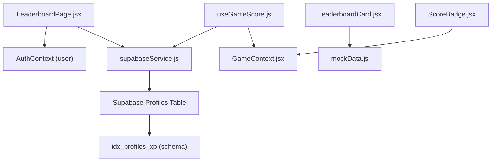
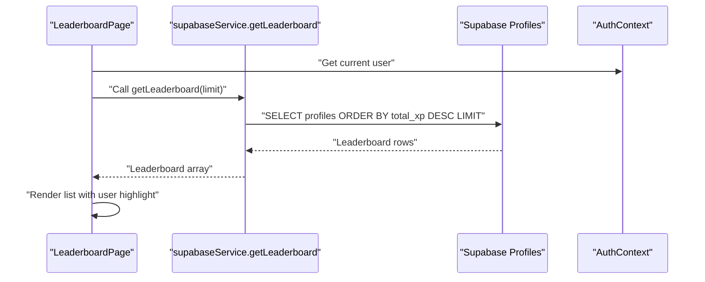
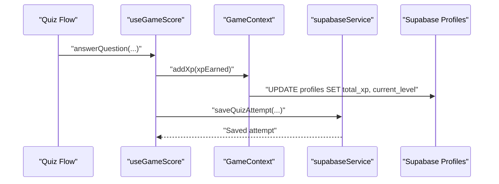
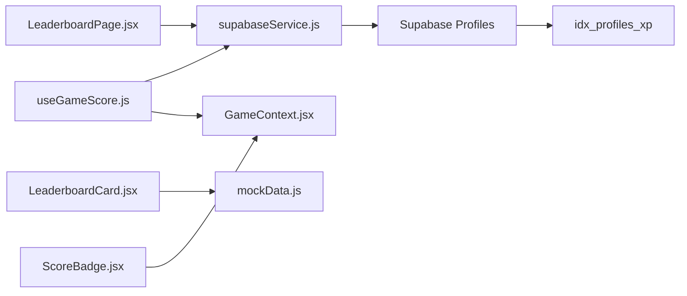

# Leaderboard System and Ranking

<cite>
**Referenced Files in This Document**
- [LeaderboardPage.jsx](file://src/pages/dashboard/LeaderboardPage.jsx)
- [LeaderboardCard.jsx](file://src/components/LeaderboardCard.jsx)
- [ScoreBadge.jsx](file://src/components/ScoreBadge.jsx)
- [supabaseService.js](file://src/services/supabaseService.js)
- [mockData.js](file://src/data/mockData.js)
- [GameContext.jsx](file://src/contexts/GameContext.jsx)
- [useGameScore.js](file://src/hooks/useGameScore.js)
- [supabase-schema.sql](file://supabase-schema.sql)
</cite>

## Table of Contents
1. [Introduction](#introduction)
2. [Project Structure](#project-structure)
3. [Core Components](#core-components)
4. [Architecture Overview](#architecture-overview)
5. [Detailed Component Analysis](#detailed-component-analysis)
6. [Dependency Analysis](#dependency-analysis)
7. [Performance Considerations](#performance-considerations)
8. [Troubleshooting Guide](#troubleshooting-guide)
9. [Conclusion](#conclusion)

## Introduction
This document explains the leaderboard system and ranking algorithms implemented in the application. It covers the LeaderboardPage component, individual player display via LeaderboardCard, achievement representation through ScoreBadge, XP gain animations, and the underlying ranking criteria. It also documents integration with user profiles, score persistence, and external ranking systems, along with social features such as friend comparisons, challenge invitations, and community engagement elements. Guidance is provided for performance optimization, caching strategies, and customization of ranking algorithms and competition modes.

## Project Structure
The leaderboard functionality spans UI components, service integrations, and data utilities:
- UI rendering and ranking display: LeaderboardPage and LeaderboardCard
- Achievement badges and XP animations: ScoreBadge
- Data access and ranking queries: supabaseService
- Mock data for development: mockData
- Game state and XP persistence: GameContext and useGameScore
- Database schema and indexes: supabase-schema.sql

**Diagram sources**
- [LeaderboardPage.jsx:1-78](file://src/pages/dashboard/LeaderboardPage.jsx#L1-L78)
- [LeaderboardCard.jsx:1-48](file://src/components/LeaderboardCard.jsx#L1-L48)
- [ScoreBadge.jsx:1-37](file://src/components/ScoreBadge.jsx#L1-L37)
- [supabaseService.js:109-119](file://src/services/supabaseService.js#L109-L119)
- [mockData.js:40-46](file://src/data/mockData.js#L40-L46)
- [GameContext.jsx:57-134](file://src/contexts/GameContext.jsx#L57-L134)
- [useGameScore.js:1-41](file://src/hooks/useGameScore.js#L1-L41)
- [supabase-schema.sql:118](file://supabase-schema.sql#L118)

**Section sources**
- [LeaderboardPage.jsx:1-78](file://src/pages/dashboard/LeaderboardPage.jsx#L1-L78)
- [LeaderboardCard.jsx:1-48](file://src/components/LeaderboardCard.jsx#L1-L48)
- [ScoreBadge.jsx:1-37](file://src/components/ScoreBadge.jsx#L1-L37)
- [supabaseService.js:109-119](file://src/services/supabaseService.js#L109-L119)
- [mockData.js:40-46](file://src/data/mockData.js#L40-L46)
- [GameContext.jsx:57-134](file://src/contexts/GameContext.jsx#L57-L134)
- [useGameScore.js:1-41](file://src/hooks/useGameScore.js#L1-L41)
- [supabase-schema.sql:118](file://supabase-schema.sql#L118)

## Core Components
- LeaderboardPage: Fetches top players, renders ranked entries with XP totals, streaks, and user identity highlighting.
- LeaderboardCard: Displays a weekly leaderboard using mock data with rank badges, streak indicators, and points.
- ScoreBadge: Renders animated XP badges and XP gain popups for immediate feedback.
- Ranking service: Retrieves leaderboard data ordered by total XP with configurable limits.
- Game state and XP persistence: Manages XP gains, streaks, and level progression with database updates.

Key ranking criteria visible in the codebase:
- Primary sort: total XP descending
- Secondary info: current level and streak days
- User identity: special highlighting for the logged-in user

**Section sources**
- [LeaderboardPage.jsx:7-77](file://src/pages/dashboard/LeaderboardPage.jsx#L7-L77)
- [LeaderboardCard.jsx:5-47](file://src/components/LeaderboardCard.jsx#L5-L47)
- [ScoreBadge.jsx:3-36](file://src/components/ScoreBadge.jsx#L3-L36)
- [supabaseService.js:111-119](file://src/services/supabaseService.js#L111-L119)
- [GameContext.jsx:75-119](file://src/contexts/GameContext.jsx#L75-L119)

## Architecture Overview
The leaderboard system follows a straightforward client-server architecture:
- UI components fetch leaderboard data from Supabase via service functions.
- The service performs a database query sorted by total XP with an optional limit.
- The UI renders the list with user-specific highlights and contextual information.
- Game actions (e.g., answering questions, updating streaks) persist XP and level changes to the database.

**Diagram sources**
- [LeaderboardPage.jsx:12-17](file://src/pages/dashboard/LeaderboardPage.jsx#L12-L17)
- [supabaseService.js:111-119](file://src/services/supabaseService.js#L111-L119)

**Section sources**
- [LeaderboardPage.jsx:12-17](file://src/pages/dashboard/LeaderboardPage.jsx#L12-L17)
- [supabaseService.js:111-119](file://src/services/supabaseService.js#L111-L119)

## Detailed Component Analysis

### LeaderboardPage Implementation
- Fetching data: Uses a service call to retrieve top players with a configurable limit.
- Rendering: Displays a ranked list with medals for top three positions, initials avatars, user identity highlighting, level, streak, and XP totals.
- Loading and empty states: Spinner during load and friendly message when no rankings exist.

Ranking calculation method:
- Sorting by total XP in descending order.
- Rank assignment is derived from the position after sorting.

User comparison algorithm:
- Compares the current user ID against each leaderboard entry to apply a distinct visual style and label.

Social engagement features:
- Highlights the logged-in user differently.
- Includes streak information to encourage continued participation.

Real-time ranking updates:
- The current implementation fetches data on mount. To support near-real-time updates, integrate periodic refetches or subscription-based updates.

Pagination handling:
- The service supports a limit parameter. Pagination can be implemented by adjusting the limit and offset for subsequent requests.

User-centric ranking views:
- The component already emphasizes the logged-in user’s position. Additional filters (e.g., friends-only, weekly) can be introduced by extending the service query and UI controls.

**Section sources**
- [LeaderboardPage.jsx:7-77](file://src/pages/dashboard/LeaderboardPage.jsx#L7-L77)
- [supabaseService.js:111-119](file://src/services/supabaseService.js#L111-L119)

### LeaderboardCard Component
- Purpose: Displays a weekly leaderboard using mock data.
- Features: Rank badges, streak indicators, points display, and a “need more points” alert.

Mock data integration:
- Uses a predefined leaderboard array for demonstration and testing.

Customization:
- Replace mock data with live data from the service for dynamic content.

**Section sources**
- [LeaderboardCard.jsx:5-47](file://src/components/LeaderboardCard.jsx#L5-L47)
- [mockData.js:40-46](file://src/data/mockData.js#L40-L46)

### ScoreBadge Component
- Purpose: Visual achievement representation with animations.
- Features: Animated badge appearance and XP gain popup with upward movement and fade-out.

Integration with game state:
- Works alongside GameContext and useGameScore to reflect XP changes immediately.

**Section sources**
- [ScoreBadge.jsx:3-36](file://src/components/ScoreBadge.jsx#L3-L36)
- [GameContext.jsx:75-119](file://src/contexts/GameContext.jsx#L75-L119)
- [useGameScore.js:23-41](file://src/hooks/useGameScore.js#L23-L41)

### Ranking Criteria and Algorithms
Observed criteria in the codebase:
- Primary: total XP (descending)
- Secondary: current level and streak days
- Identity: user highlight for the current user

Missing explicit criteria:
- No visible streak bonus multiplier or activity-based weighting in the leaderboard query.
- No separate competition modes (e.g., weekly, friends-only) in the current implementation.

Recommendations for enhancement:
- Add computed fields for weighted scores combining XP and streak bonuses.
- Introduce filters for competition modes and friend comparisons.
- Implement server-side aggregation for performance with large user bases.

**Section sources**
- [supabaseService.js:111-119](file://src/services/supabaseService.js#L111-L119)
- [LeaderboardPage.jsx:60-67](file://src/pages/dashboard/LeaderboardPage.jsx#L60-L67)

### Integration with User Profiles and Score Persistence
- GameContext manages XP, level, streak, and persists changes to the profiles table upon XP additions and streak updates.
- useGameScore coordinates XP rewards, saves quiz attempts, and integrates with the game state.

**Diagram sources**
- [useGameScore.js:23-41](file://src/hooks/useGameScore.js#L23-L41)
- [GameContext.jsx:75-119](file://src/contexts/GameContext.jsx#L75-L119)
- [supabaseService.js:32-45](file://src/services/supabaseService.js#L32-L45)

**Section sources**
- [GameContext.jsx:75-119](file://src/contexts/GameContext.jsx#L75-L119)
- [useGameScore.js:23-41](file://src/hooks/useGameScore.js#L23-L41)
- [supabaseService.js:32-45](file://src/services/supabaseService.js#L32-L45)

### Social Features
Current capabilities:
- Highlighting the logged-in user in the leaderboard.
- Streak visibility encourages continued engagement.

Potential enhancements:
- Friend comparisons: Filter leaderboard to include only users marked as friends.
- Challenge invitations: Link leaderboard entries to challenge actions.
- Community engagement: Add “invite friends,” “compare stats,” and “weekly challenges.”

Implementation approach:
- Extend the leaderboard service with filters (friends, weekly range).
- Add UI actions to send invitations and initiate challenges.

**Section sources**
- [LeaderboardPage.jsx:40-67](file://src/pages/dashboard/LeaderboardPage.jsx#L40-L67)

## Dependency Analysis
The leaderboard system exhibits clear separation of concerns:
- UI components depend on service functions for data retrieval.
- Services depend on the Supabase client and database schema.
- Game state and scoring hooks depend on context providers and services.

**Diagram sources**
- [LeaderboardPage.jsx:1-3](file://src/pages/dashboard/LeaderboardPage.jsx#L1-L3)
- [LeaderboardCard.jsx:1](file://src/components/LeaderboardCard.jsx#L1)
- [ScoreBadge.jsx:1](file://src/components/ScoreBadge.jsx#L1)
- [supabaseService.js:111-119](file://src/services/supabaseService.js#L111-L119)
- [mockData.js:40-46](file://src/data/mockData.js#L40-L46)
- [GameContext.jsx:57-134](file://src/contexts/GameContext.jsx#L57-L134)
- [useGameScore.js:1-41](file://src/hooks/useGameScore.js#L1-L41)
- [supabase-schema.sql:118](file://supabase-schema.sql#L118)

**Section sources**
- [LeaderboardPage.jsx:1-3](file://src/pages/dashboard/LeaderboardPage.jsx#L1-L3)
- [LeaderboardCard.jsx:1](file://src/components/LeaderboardCard.jsx#L1)
- [ScoreBadge.jsx:1](file://src/components/ScoreBadge.jsx#L1)
- [supabaseService.js:111-119](file://src/services/supabaseService.js#L111-L119)
- [mockData.js:40-46](file://src/data/mockData.js#L40-L46)
- [GameContext.jsx:57-134](file://src/contexts/GameContext.jsx#L57-L134)
- [useGameScore.js:1-41](file://src/hooks/useGameScore.js#L1-L41)
- [supabase-schema.sql:118](file://supabase-schema.sql#L118)

## Performance Considerations
- Database indexing: An index on total XP improves leaderboard query performance.
- Query limits: Use a reasonable limit for leaderboard fetching to reduce payload size.
- Caching strategies:
  - Client-side cache with short TTL for leaderboard data.
  - Invalidate cache on XP changes or streak updates.
- Efficient recalculations:
  - Update only affected ranks when a user’s XP changes.
  - Debounce frequent leaderboard refreshes.
- Scalability:
  - Paginate results for large user bases.
  - Consider materialized views or aggregated tables for complex ranking computations.

**Section sources**
- [supabase-schema.sql:118](file://supabase-schema.sql#L118)
- [supabaseService.js:111-119](file://src/services/supabaseService.js#L111-L119)

## Troubleshooting Guide
Common issues and resolutions:
- Empty leaderboard: Verify database records and index presence; confirm user XP values are populated.
- Slow loading: Confirm the total XP index exists and leaderboard limit is appropriate.
- Incorrect ranking: Ensure the query orders by total XP descending and handles ties consistently.
- Streak not updating: Check that the streak update logic runs once per day and persists to the database.

**Section sources**
- [supabase-schema.sql:118](file://supabase-schema.sql#L118)
- [GameContext.jsx:107-119](file://src/contexts/GameContext.jsx#L107-L119)

## Conclusion
The leaderboard system currently provides a clean, XP-driven ranking with user identity highlighting and streak visibility. The service layer efficiently retrieves top performers, while the UI renders contextual information. To enhance social engagement, introduce filters for competition modes and friend comparisons, and implement real-time updates. For large-scale deployments, adopt caching, pagination, and optimized database indexing. The existing GameContext and scoring hooks offer a solid foundation for integrating XP-based achievements and animations.